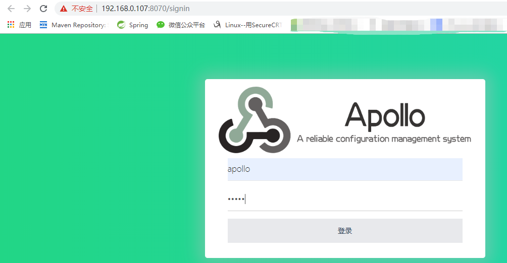
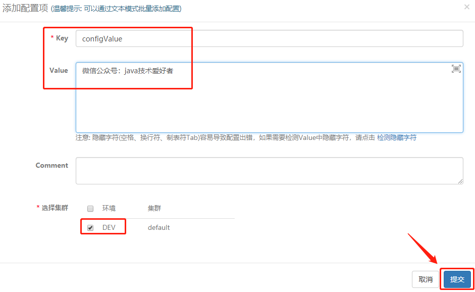

## **思维导图**


## **一、概述**

Apollo（阿波罗）是携程框架部门研发的开源配置管理中心，能够集中化管理应用**不同环境、不同集群**的配置，配置修改后能够**实时推送到应用端，并且具备规范的权限、流程治理**等特性。部署是区分环境的 设置不同的namespace，作用不同，类似不同的property文件 key、value对应关系，替换工程变量值。

目前Apollo在github有22.6k颗星，在官网登记的使用的公司有451家，算是很流行的配置中心的框架技术。所以接下来跟着我一起学习Apollo配置中心吧。


## **二、为什么使用配置中心**

首先，没有配置中心之前传统的配置都是写在配置文件中，比如各种yml、perproties、xml文件。

写在各种文件里最大的问题在于**如果需要改配置信息，需要重新部署发布应用才能生效**，这是第一个问题。

后面为了做到动态读取配置信息，后面有人改进一下把配置信息存储在数据库的一张表，程序读取表中的配置信息，这种方式很多公司都还在使用，因为简单，而且灵活(修改配置只需要执行个SQL语句，不需要重新部署发布)。但是也不是最完美的，因为**缺少了权限控制，没有管理界面进行统一配置，没有历史版本的配置信息，不支持回滚(防止误操作)**。

实际上配置中心在市面上已经有很多，比如Nacos、Consul、spring-cloud-config、Apollo等等。

相对其他的，我觉得选择Apollo的原因是，界面比较美观，操作简便，部署简单，依赖较少，开箱即用。

## **三、安装部署**

### **3.1 获取安装包**

先到官网下载安装包。


下载后解压，如下：


### **3.2 创建数据库**

使用MySQL数据库(版本要求:5.6.5+)。

#### **3.2.1 创建ApolloPortalDB数据库**

使用github上面的sql脚本创建ApolloPortalDB数据库，导入相关的表以及数据。


#### **3.2.2 创建ApolloConfigDB数据库**

使用github上面的sql脚本创建ApolloConfigDB数据库，导入相关的表以及数据。


### **3.3 修改配置**

需要改一下数据库连接信息，路径在/config下。

#### **3.3.1 apollo-configservice配置**

修改apollo-configservice的数据库连接信息application-github.properties，如下：

代码语言：javascript

复制

```javascript
# DataSource
spring.datasource.url = jdbc:mysql://192.168.0.107:3306/ApolloConfigDB?characterEncoding=utf8
spring.datasource.username = 账号
spring.datasource.password = 密码
```

#### **3.3.2 apollo-adminservice配置**

修改apollo-adminservice的数据库连接信息application-github.properties，如下：

代码语言：javascript

复制

```javascript
# DataSource
spring.datasource.url = jdbc:mysql://192.168.0.107:3306/ApolloConfigDB?characterEncoding=utf8
spring.datasource.username = 账号
spring.datasource.password = 密码
```

#### **3.3.3 apollo-portal配置**

修改apollo-portal的数据库连接信息application-github.properties，如下：

代码语言：javascript

复制

```javascript
# DataSource
spring.datasource.url = jdbc:mysql://192.168.0.107:3306/ApolloPortalDB?characterEncoding=utf8
spring.datasource.username = 账号
spring.datasource.password = 密码
```

再修改apollo-env.properties配置，这是关于环境配置的，如下：

代码语言：javascript

复制

```javascript
local.meta=http://localhost:8080
## 开发环境
dev.meta=http://192.168.0.107:8080
## 不需要配置的环境参考${lpt_meta}配置
fat.meta=${fat_meta}
uat.meta=${uat_meta}
lpt.meta=${lpt_meta}
pro.meta=${pro_meta}
```

### **3.4 部署**

然后把三个文件夹都上传到Linux服务器。


#### **3.4.1 部署发布apollo-configservice**

部署发布服务有顺序，首先发布apollo-configservice，直接执行scripts/startup.sh。


有可能会出现这个错误(我就出现了)，不用担心，实际上进程还没有结束，还在启动，我们可以到日志记录的文件夹(下图来源于startup.sh脚本)查看日志。


启动时间比较长，因为这个服务包括启动Eureka注册中心，需要耐心等待。观察apollo-configservice.log文件，当看到如下信息后，表示启动成功。


Eureka注册中心启动成功，可以打开http://192.168.0.107:8080/查看：


#### **3.4.2 部署发布apollo-adminservice**

接着发布apollo-adminservice，直接执行scripts/startup.sh。查看日志的方式跟上面一样。启动成功后，可以看到Eureka的服务列表中多了一个服务。


#### **3.4.3 部署发布apollo-portal**

接着发布apollo-portal，直接执行scripts/startup.sh。portal是提供Web界面的服务，所以启动成功后，可以打开http://192.168.0.107:8070/登录web界面，默认账号密码是apollo/admin。



到此，安装就完成了！

## **四、SpringBoot整合Apollo**

接下来，整一个Demo(相当于java客户端)，使用SpringBoot整合Apollo，实现动态读取配置。

### **4.1 Mave依赖**

代码语言：javascript

复制

```javascript
<dependency>
    <groupId>com.ctrip.framework.apollo</groupId>
    <artifactId>apollo-client</artifactId>
    <version>1.1.0</version>
</dependency>
```

### **4.2 AppId**

在classpath路径下，创建/META-INF/app.properties文件。如下：

代码语言：javascript

复制

```javascript
# 应用的唯一标识，后面创建工程需要用到
app.id=apollo-demo
```

### **4.3 Apollo Meta Server**

其实就是配置Apollo服务器的地址。官网提供的方式有很多，我这里选其中一种比较简单的方式。在classpath路径下创建apollo-env.properties文件，配置如下：

代码语言：javascript

复制

```javascript
dev.meta=http://192.168.0.107:8080
# fat.meta=http://apollo.fat.xxx.com
# uat.meta=http://apollo.uat.xxx.com
# pro.meta=http://apollo.xxx.com
```

### **4.4 Environment**

其实是配置环境，因为上面可以配置四种环境，这里配置具体选择哪个环境。这里介绍两种方式：

第一种通过Java System Property。


第二种通过配置文件。


到相对应的路径下创建server.properties，配置如下：

代码语言：javascript

复制

```javascript
env=DEV
```

### **4.5 @EnableApolloConfig**

在启动类上加上注解@EnableApolloConfig。

代码语言：javascript

复制

```javascript
@SpringBootApplication
//开启apollo配置
@EnableApolloConfig
public class ApolloDemoApplication {
    public static void main(String[] args) {
        SpringApplication.run(ApolloDemoApplication.class, args);
    }
}
```

### **4.6 测试类**

这样就完成了，接下来再创建一个Controller进行测试一下。

代码语言：javascript

复制

```javascript
@RestController
public class ApolloController {

    //冒号后面的是默认值
    @Value("${configValue:default}")
    private String configValue;

    @RequestMapping("/apollo/getConfig")
    public String getConfig() {
        return configValue;
    }
}
```

### **4.7 管理界面创建对应的配置**

第一步，创建项目。


第二步，创建配置。



第三步，发布。


### **4.8 测试**

启动项目apollo-demo，然后请求路径http://localhost:8888/apollo/getConfig，可以看到页面。


控制台可以看到推送配置信息的日志：


## **五、架构设计**

讲完了安装和SpringBoot整合的demo后，我们是时候探究一下原理，为什么要有三个服务，又是如何做到配置信息发布后，客户端实时获取到最新的配置的。继续往下看。

首先看一张官网的架构设计图。

### **5.1 基础模型**

作者在官网上有个基础模型的架构图，忽略掉很多细节后实际上非常简单：


1. 用户在配置中心对配置进行修改并发布。
2. 配置中心通知Apollo客户端有配置更新。
3. Apollo客户端从配置中心拉取最新的配置、更新本地配置并通知到应用。

### **5.2 架构模块**

如果我们把Apollo配置中心服务端展开的话，架构图如下：


看到这里，整个架构看起来就比较清晰了。接下来从上往下简单介绍一下：

**Portal服务**：提供Web界面供用户管理配置，通过MetaServer获取AdminService服务列表（IP+Port），通过IP+Port访问AdminService服务。

**Client**：实际上就是我们创建的SpringBoot项目，引入ApolloClient的maven依赖，为应用提供配置获取、实时更新等功能。

**Meta Server**：从Eureka获取Config Service和Admin Service的服务信息，相当于是一个Eureka Client。主要是为了封装服务发现的细节，对Portal和Client而言，永远通过一个Http接口获取Admin Service和Config Service的服务信息，而不需要关心背后实际的服务注册和发现组件。Meta Server只是一个逻辑角色，在部署时和Config Service是在一个JVM进程中的，所以IP、端口和Config Service一致。

**Eureka**：注册中心。Config Service和Admin Service会向Eureka注册服务。为了简单起见，目前Eureka在部署时和Config Service是在一个JVM进程中的。

**Config Service**：提供配置获取接口。提供配置更新推送接口(基于Http long polling)。服务对象为Apollo客户端(Client)。

**Admin Service**：提供配置管理接口。提供配置发布、修改等接口。服务对象为Portal。

### **5.3 配置发布后的实时推送设计**

上面讲完各个角色的用途，那这些角色是怎么配合一起工作的呢，我们来看一张图：


上图简要描述了配置发布的大致过程：

1. 用户在Portal操作配置发布。
2. Portal调用Admin Service的接口操作发布。
3. Admin Service发布配置后，发送ReleaseMessage给各个Config Service。
4. Config Service收到ReleaseMessage后，通知对应的客户端(Client)。

关键点在于AdminService发送ReleaseMessage给ConfigService，这一步是如何异步发送的呢，一般异步发送我们很容易想到消息队列，但是实际上我们在安装部署时并没有使用到消息队列。

答案在于：

- Admin Service在配置发布后会往ReleaseMessage表插入一条消息记录，消息内容就是配置发布的AppId+Cluster+Namespace。
- 然后Config Service有一个线程会每秒扫描一次ReleaseMessage表，看看是否有新的消息记录。
- Config Service如果发现有新的消息记录，那么就会通知到所有的消息监听器，监听器得到配置发布的AppId+Cluster+Namespace后，会通知对应的客户端。


> 在实现上，考虑到Apollo的实际使用场景，以及为了尽可能减少外部依赖，我们没有采用外部的消息中间件，而是通过数据库实现了一个简单的消息队列。----来自官网

### **5.4 高可用**

Apollo为了实现高可用，服务端使用了Eureka作为注册中心，这一点在官网也有谈到。


除此之外，客户端也做了高可用的一些架构设计，比如本地文件缓存。


这个缓存文件默认就放在C:\opt\data\apollo-demo\config-cache路径下：


这个文件的作用是，在遇到服务不可用，或网络不通的时候，依然能从本地恢复配置。

## **六、絮叨**

这篇文章就讲到这里。其实Apollo配置中心算是一个比较容易上手，架构相对比较清晰的开源项目。目前很多互联网公司都在推行微服务架构，在使用微服务的架构时，配置信息就会成倍数增加，因为配置实际上代表的是“控制”，很多时候程序的运行是靠配置去决定行为的，而且要能实时生效的，所以就必须要有个配置中心。

有些公司体量大一些会自己公司开发一套配置中心，其实实现起来也不是特别难，我上一间公司就自己实现，使用MQ消息队列+数据库，再自己简单地搭了一个增删改查、刷新配置的web页面，就完成了一个配置中心。