## 1、Dubbo的基本介绍

Dubbo 是阿里巴巴公司开源的一个高性能、轻量级的 Java RPC 框架。 它提供了三大核心能力：面向接口的远程方法调用，智能容错和负载均衡，以及服务自动注册和发现。 

### 1.1、基本概念

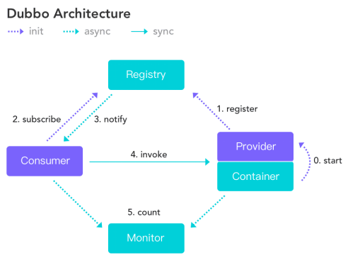

- **服务提供者****（****Provider****）**：暴露服务的服务提供方，服务提供者在启动时，向注册中心注册自己提供的服务。
- **服务消费者****（****Consumer****）**: 调用远程服务的服务消费方，服务消费者在启动时，向注册中心订阅自己所需的服务，服务消费者，从提供者地址列表中，基于软负载均衡算法，选一台提供者进行调用，如果调用失败，再选另一台调用。
- **注册中心****（****Registry****）**：注册中心返回服务提供者地址列表给消费者，如果有变更，注册中心将基于长连接推送变更数据给消费者
- **监控中心****（****Monitor****）**：服务消费者和提供者，在内存中累计调用次数和调用时间，定时每分钟发送一次统计数据到监控中心

调用关系说明：

1. 服务容器负责启动，加载，运行服务提供者。
2. 服务提供者在启动时，向注册中心注册自己提供的服务。
3. 服务消费者在启动时，向注册中心订阅自己所需的服务。
4. 注册中心返回服务提供者地址列表给消费者，如果有变更，注册中心将基于长连接推送变更数据给消费者。
5. 服务消费者，从提供者地址列表中，基于软负载均衡算法，选一台提供者进行调用，如果调用失败，再选另一台调用。

### 1.2、RPC

RPC（Remote Procedure Call）是一种进程间通信方式。简单地说就是能使应用像调用本地方法一样的调用远程的过程或服务，可以应用在分布式服务、分布式计算、远程服务调用等许多场景。业界有很多开源的优秀 RPC 框架，例如 Dubbo、Thrift、gRPC、Hprose 等等。

RPC 与 HTTP、RMI、Web Service 都能完成远程调用，但是实现方式和侧重点各有不同。

RPC是一种协议规范，可以把HTTP看作是一种RPC的实现，也可以把HTTP作为RPC的传输协议来应用。与HTTP相比，RPC的缺点就是相对复杂，学习成本稍高。

#### 1.2.1、序列化和反序列化

- 什么是序列化？序列化就是将数据结构或对象转换成二进制串的过程，也就是编码的过程
- 什么是反序列化？将在序列化过程中所生成的二进制串转换成数据结构或对象的过程
- 为什么需要序列化？转换为二进制串才好进行网络传输嘛
- 为什么需要反序列化？将二进制串转换成对象才好进行后续处理嘛

## 2、zookeeper（注册中心）

Zookeeper是一个高性能的，分布式的，开放源码的分布式应用程序协调服务，简称zk。

### 2.1、zookeeper 下载

下载可在官网下载，如 3.4.11 地址参考：[https://archive.apache.org/dist/zookeeper/zookeeper-3.4.11/](https://archive.apache.org/dist/zookeeper/zookeeper-3.4.11/)

### 2.2、zookeper安装使用（window版）

ZooKeeper服务器是用Java创建的，它运行在JVM之上。需要安装JDK 7或更高版本。

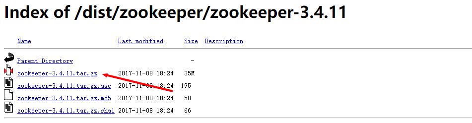

zookeeper 下载后直接解压即可。在bin文件下，直接通过命令行执行 zkServer.cmd 即为启动 zookeeper。

第一次启动时可能会有报错，如下：

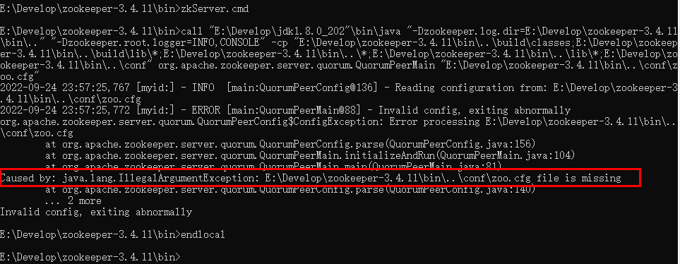

此时只需在 conf 目录下将 zoo_sample.cfg 文件复制一份，将名字改为 zoo.cfg 即可。打开 zoo.cfg 文件，可以看到内容如下：

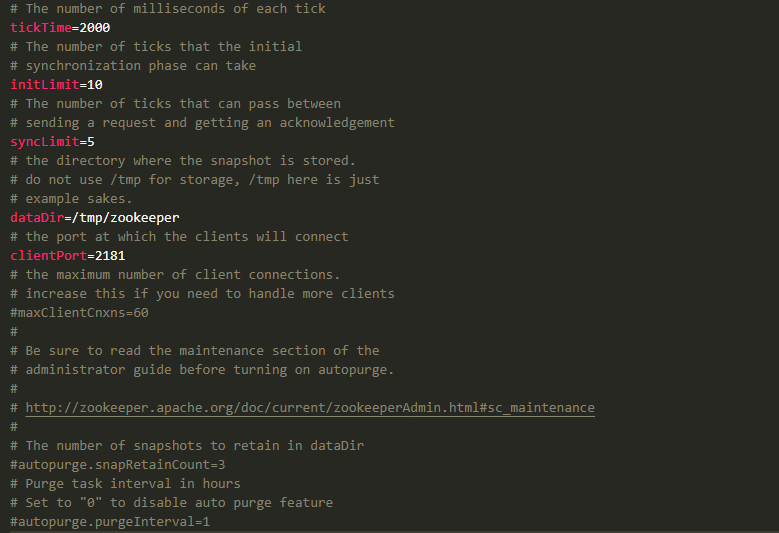

可以将 dataDir 路径修改为我们想要保存文件的路径，如：../data，然后建立相应的目录即可。

再次启动 zookeeper，可以看到可正常启动，输出如下：

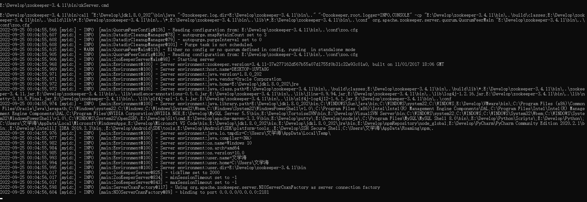

可以运行 zkCli.cmd 连接到zookeeper的服务器，如下：

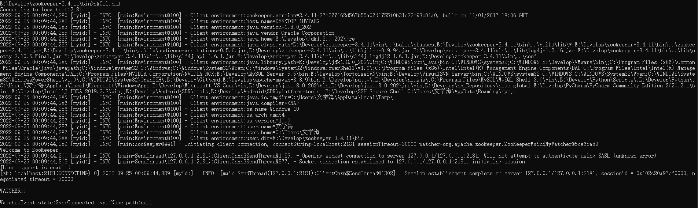

### 2.3、zookeper安装使用（Linux版）

ZooKeeper服务器是用Java创建的，它运行在JVM之上。需要安装JDK 7或更高版本。

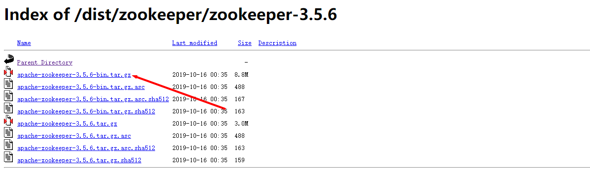

将下载的ZooKeeper放到/opt/ZooKeeper目录下：
```sql
#打开 opt目录
cd /opt
#创建zooKeeper目录
mkdir  zooKeeper
#将zookeeper安装包移动到 /opt/zooKeeper
mv apache-zookeeper-3.5.6-bin.tar.gz /opt/zookeeper/
```

将tar包解压到/opt/zookeeper目录下
```sql

tar -zxvf apache-zookeeper-3.5.6-bin.tar.gz

```


配置zoo.cfg
```sql
#进入到conf目录
cd /opt/zooKeeper/apache-zookeeper-3.5.6-bin/conf/
#拷贝
cp  zoo_sample.cfg  zoo.cfg
```

修改zoo.cfg
```sql
#打开目录
cd /opt/zooKeeper/
#创建zooKeeper存储目录
mkdir  zkdata
#修改zoo.cfg
vim /opt/zooKeeper/apache-zookeeper-3.5.6-bin/conf/zoo.cfg
```

修改存储目录：dataDir=/opt/zookeeper/zkdata
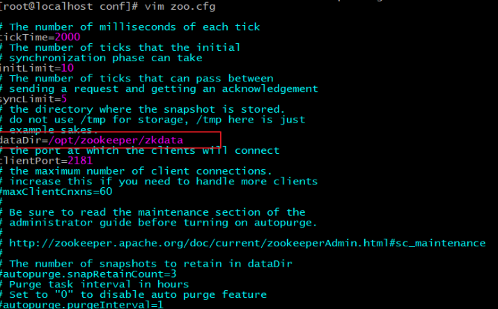

启动ZooKeeper 
```sql
cd /opt/zooKeeper/apache-zookeeper-3.5.6-bin/bin/
#启动
 ./zkServer.sh  start
```

看到下图表示ZooKeeper成功启动


#### 2.3.1、查看ZooKeeper状态

查看ZooKeeper状态
```sql
./zkServer.sh status

```

下图表示zookeeper启动成功。standalone代表zk没有搭建集群，现在是单节点
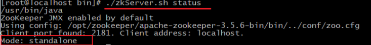

下图表示zookeeper没有启动
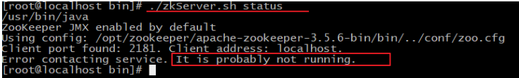

## 3、提供者消费者示例

（建议参考 3.2、springboot搭建dubbo示例）

### 3.1、spring搭建dubbo示例

基于以下图实现服务 提供者、消费者，即以用户服务作为提供者，订单服务作为消费者。
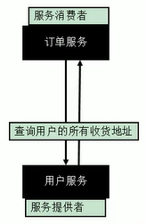

分别创建 maven 工程 user-service-provider、order-service-consumer，还需要创建一个专门用于存服务接口的工程 dubbo-interface。

提供者工程 user-service-provider 引入以下依赖：（dubbo依赖会自动引入 spring 的相关依赖），另外需要引入 dubbo-interface 工程。
```xml
<dependencies>
    <!-- 引入dubbo -->
    <!-- https://mvnrepository.com/artifact/com.alibaba/dubbo -->
    <dependency>
        <groupId>com.alibaba</groupId>
        <artifactId>dubbo</artifactId>
        <version>2.6.2</version>
    </dependency>
 
    <!-- 注册中心使用的是zookeeper，引入操作zookeeper的客户端 -->
    <!--
        由于我们使用zookeeper作为注册中心，所以需要操作zookeeper
        dubbo 2.6以前的版本引入zkclient操作zookeeper
        dubbo 2.6及以后的版本引入curator操作zookeeper
        下面两个zk客户端根据dubbo版本2选1即可
    -->
    <dependency>
        <groupId>org.apache.curator</groupId>
        <artifactId>curator-framework</artifactId>
        <version>2.12.0</version>
    </dependency>
 
</dependencies>
```

提供者工程添加配置文件 provider.xml，并添加以下配置内容：
```xml
<?xml version="1.0" encoding="UTF-8"?>
<beans xmlns="http://www.springframework.org/schema/beans"
    xmlns:xsi="http://www.w3.org/2001/XMLSchema-instance"
    xmlns:dubbo="http://code.alibabatech.com/schema/dubbo"
    xsi:schemaLocation="http://www.springframework.org/schema/beans http://www.springframework.org/schema/beans/spring-beans.xsd
        http://dubbo.apache.org/schema/dubbo http://dubbo.apache.org/schema/dubbo/dubbo.xsd
        http://code.alibabatech.com/schema/dubbo http://code.alibabatech.com/schema/dubbo/dubbo.xsd">
 
    <!-- 1、指定当前服务/应用的名字（同样的服务名字相同，不要和别的服务同名） -->
    <dubbo:application name="user-service-provider"></dubbo:application>
    
    <!-- 2、指定注册中心的位置 -->
    <!-- <dubbo:registry address="zookeeper://127.0.0.1:2181"></dubbo:registry> -->
    <dubbo:registry protocol="zookeeper" address="127.0.0.1:2181"></dubbo:registry>
    
    <!-- 3、指定通信规则（通信协议？通信端口） -->
    <dubbo:protocol name="dubbo" port="20882"></dubbo:protocol>
    
    <!-- 4、暴露服务   ref：指向服务的真正的实现对象 -->
    <dubbo:service interface="com.atguigu.gmall.service.UserService" 
        ref="userServiceImpl01" timeout="1000" version="1.0.0">
        <dubbo:method name="getUserAddressList" timeout="1000"></dubbo:method>
    </dubbo:service>
    <!-- 服务的实现 -->
    <bean id="userServiceImpl01" class="com.atguigu.gmall.service.impl.UserServiceImpl"></bean>
    
    <!--统一设置服务提供方的规则  -->
    <dubbo:provider timeout="1000"></dubbo:provider>
    
    <dubbo:service interface="com.atguigu.gmall.service.UserService" 
        ref="userServiceImpl02" timeout="1000" version="2.0.0">
        <dubbo:method name="getUserAddressList" timeout="1000"></dubbo:method>
    </dubbo:service>
    <bean id="userServiceImpl02" class="com.atguigu.gmall.service.impl.UserServiceImpl2"></bean>
    
    <!-- 连接监控中心 -->
    <dubbo:monitor protocol="registry"></dubbo:monitor>
    
</beans>
```

暴露的服务的实现类 UserServiceImpl、UserServiceImpl2 代码大概如下：
```java
public class UserServiceImpl2 implements UserService {
    @Override
    public List<UserAddress> getUserAddressList(String userId) {
        System.out.println("UserServiceImpl.....new...");
        UserAddress address1 = new UserAddress(1, "北京市昌平区宏福科技园综合楼3层", "1", "李老师", "010-56253825", "Y");
        UserAddress address2 = new UserAddress(2, "深圳市宝安区西部硅谷大厦B座3层（深圳分校）", "1", "王老师", "010-56253825", "N");
        
        return Arrays.asList(address1,address2);
    }
}

```


启动提供者，main 方法如下：
```sql
public class MainApplication {    
    public static void main(String[] args) throws IOException {
        ClassPathXmlApplicationContext ioc = new ClassPathXmlApplicationContext("provider.xml");
        ioc.start();
        
        System.in.read();
    }
}

```

启动提供者后可以在管理控制台看到注册的服务：
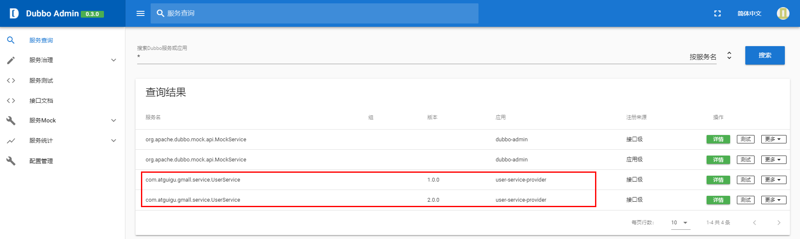

在消费者工程引入依赖：
```xml
<dependencies>
 
    <!-- 引入dubbo -->
    <dependency>
        <groupId>com.alibaba</groupId>
        <artifactId>dubbo</artifactId>
        <version>2.6.2</version>
    </dependency>
    <!-- 注册中心使用的是zookeeper，引入操作zookeeper的客户端端 -->
    <dependency>
        <groupId>org.apache.curator</groupId>
        <artifactId>curator-framework</artifactId>
        <version>2.12.0</version>
    </dependency>
 
</dependencies>

```

消费者工程添加配置文件 consumer.xml，并添加以下配置内容：
```xml
<?xml version="1.0" encoding="UTF-8"?>
<beans xmlns="http://www.springframework.org/schema/beans"
    xmlns:xsi="http://www.w3.org/2001/XMLSchema-instance"
    xmlns:dubbo="http://dubbo.apache.org/schema/dubbo"
    xmlns:context="http://www.springframework.org/schema/context"
    xsi:schemaLocation="http://www.springframework.org/schema/beans http://www.springframework.org/schema/beans/spring-beans.xsd
        http://www.springframework.org/schema/context http://www.springframework.org/schema/context/spring-context-4.3.xsd
        http://dubbo.apache.org/schema/dubbo http://dubbo.apache.org/schema/dubbo/dubbo.xsd
        http://code.alibabatech.com/schema/dubbo http://code.alibabatech.com/schema/dubbo/dubbo.xsd">
    <context:component-scan base-package="com.atguigu.gmall.service.impl"></context:component-scan>
 
    <dubbo:application name="order-service-consumer"></dubbo:application>
    
    <dubbo:registry address="zookeeper://127.0.0.1:2181"></dubbo:registry>
    
    <!--  配置本地存根-->
    
    <!--声明需要调用的远程服务的接口；生成远程服务代理  -->
    <!-- 
        1）、精确优先 (方法级优先，接口级次之，全局配置再次之)
        2）、消费者设置优先(如果级别一样，则消费方优先，提供方次之)
    -->
    <!-- timeout="0" 默认是1000ms-->
    <!-- retries="":重试次数，不包含第一次调用，0代表不重试-->
    <!-- 幂等（设置重试次数）【查询、删除、修改】、非幂等（不能设置重试次数）【新增】 -->
    <dubbo:reference interface="com.atguigu.gmall.service.UserService" 
        id="userService" timeout="5000" retries="3" version="*">
        <!-- <dubbo:method name="getUserAddressList" timeout="1000"></dubbo:method> -->
    </dubbo:reference>
        
    <!-- 配置当前消费者的统一规则：所有的服务都不检查 -->
    <dubbo:consumer check="false" timeout="5000"></dubbo:consumer>
 
    <dubbo:monitor protocol="registry"></dubbo:monitor>
    <!-- <dubbo:monitor address="127.0.0.1:7070"></dubbo:monitor> -->
    
</beans>

```

消费者建一个实现类，直接使用提供者的方法，如下：
```java
@Service
public class OrderServiceImpl implements OrderService {
 
    @Autowired
    UserService userService;
    @Override
    public List<UserAddress> initOrder(String userId) {
        // TODO Auto-generated method stub
        System.out.println("用户id："+userId);
        //1、查询用户的收货地址
        List<UserAddress> addressList = userService.getUserAddressList(userId);
        for (UserAddress userAddress : addressList) {
            System.out.println(userAddress.getUserAddress());
        }
        return addressList;
    }
}

```

启动消费者 main 方法，如下：
```java
public class MainApplication {
    
    @SuppressWarnings("resource")
    public static void main(String[] args) throws IOException {
        ClassPathXmlApplicationContext applicationContext = new ClassPathXmlApplicationContext("consumer.xml");
        
        OrderService orderService = applicationContext.getBean(OrderService.class);
        
        orderService.initOrder("1");
        System.out.println("调用完成....");
        System.in.read();
    }
}

```

可以看到输出：
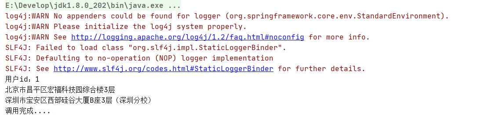

由此，消费者调用提供者提供的服务即完成。

（上面的示例没有把 dubbo-interface 工程具体写出来，可以参考下面 3.2）

### 3.2、springboot搭建dubbo示例

创建工程 dubbotest01，在该工程下创建 module：dubbo-interface、dubbo-provider、dubbo-consumer。其中，dubbo-provider 和 dubbo-consumer 创建为 springboot 项目，可用于测试服务调用，dubbo-interface 只需创建为普通 maven 项目即可，只需在里面管理一些公共接口类。dubbo-interface 后面被打成 jar 包，它的作用只是提供接口。
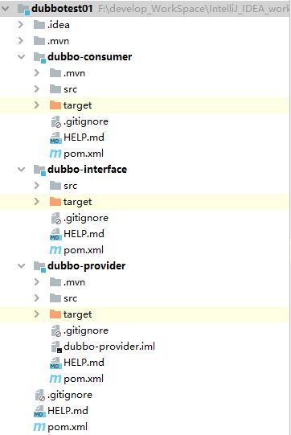

#### 3.2.1、搭建dubbo-interface 模块

在 dubbo-interface 模块中创建接口类 HelloService，如下：
```java
package com.example.dubbointerface;
public interface HelloService {
    public  String sayHello(String name);
}

```

#### 3.2.2、搭建dubbo-provider模块

dubbo-provider 中添加依赖，包括dubbo 、zookeeper以及 dubbo-interface 的依赖，如下：
```xml
<dependencies>
    <dependency>
        <groupId>org.springframework.boot</groupId>
        <artifactId>spring-boot-starter-web</artifactId>
    </dependency>
  
    <!--引入dubbo-interface的依赖-->
    <dependency>
        <groupId>com.example</groupId>
        <artifactId>dubbo-interface</artifactId>
        <version>0.0.1-SNAPSHOT</version>
    </dependency>
 
    <!--引入dubbo的依赖-->
    <dependency>
        <groupId>com.alibaba.spring.boot</groupId>
        <artifactId>dubbo-spring-boot-starter</artifactId>
        <version>2.0.0</version>
    </dependency>
    <!-- 引入zookeeper的依赖 -->
    <dependency>
        <groupId>com.101tec</groupId>
        <artifactId>zkclient</artifactId>
        <version>0.10</version>
    </dependency>
</dependencies>

```

在 application.properties 配置文件中配置 dubbo 相关信息
```sql
# 配置应用启动端口，避免端口冲突
server.port=8333
spring.dubbo.application.name=dubbo-provider
spring.dubbo.application.registry=zookeeper://192.168.118.131:2181
 
#可通过以下配置修改默认的20880端口
spring.dubbo.protocol.port=20883

```


实现 HelloService 接口，如下：
```java
import com.alibaba.dubbo.config.annotation.Service;
import org.springframework.stereotype.Component;
@Component
@Service    //将这个类提供的方法（服务）对外发布，将访问的地址、ip、路径注册到注册中心。（注意，@Service 注解使用的时 Dubbo 提供的而不是 Spring 提供的。）
public class HelloServiceImpl implements HelloService {
    @Override
    public String sayHello(String name) {
        return "Hello " + name;
    }
}

```

给启动类加上 `@EnableDubboConfiguration` 注解开启Dubbo 的自动配置。
```java
import com.alibaba.dubbo.spring.boot.annotation.EnableDubboConfiguration;
import org.springframework.boot.SpringApplication;
import org.springframework.boot.autoconfigure.SpringBootApplication;
@SpringBootApplication
// 开启dubbo的自动配置
@EnableDubboConfiguration
public class DubboProviderApplication {
    public static void main(String[] args) {
        SpringApplication.run(DubboProviderApplication.class, args);
    }
}

```

#### 3.2.3、搭建dubbo-consumer模块

dubbo-consumer 中添加依赖，包括dubbo 、zookeeper以及 dubbo-interface 的依赖，如下：
```xml
<dependencies>
    <dependency>
        <groupId>org.springframework.boot</groupId>
        <artifactId>spring-boot-starter-web</artifactId>
    </dependency>
 
    <dependency>
        <groupId>com.example</groupId>
        <artifactId>dubbo-interface</artifactId>
        <version>0.0.1-SNAPSHOT</version>
    </dependency>
    <!--引入dubbo的依赖-->
    <dependency>
        <groupId>com.alibaba.spring.boot</groupId>
        <artifactId>dubbo-spring-boot-starter</artifactId>
        <version>2.0.0</version>
    </dependency>
    <!-- 引入zookeeper的依赖 -->
    <dependency>
        <groupId>com.101tec</groupId>
        <artifactId>zkclient</artifactId>
        <version>0.10</version>
    </dependency>
</dependencies>

```


在 application.properties 配置文件中配置 dubbo 相关信息
```sql
# 配置端口
server.port=8330
spring.dubbo.application.name=dubbo-consumer
spring.dubbo.application.registry=zookeeper://192.168.118.131:2181
 
#可通过以下配置修改默认的20880端口
spring.dubbo.protocol.port=20884

```

编写一个简单 Controller ，HelloController 来调用远程服务，如下：
```java
import com.alibaba.dubbo.config.annotation.Reference;
import com.example.dubbointerface.HelloService;
import org.springframework.web.bind.annotation.RequestMapping;
import org.springframework.web.bind.annotation.RestController;
@RestController
public class HelloController {
   /**
      1.从zookeeper注册中心获取对应服务提供者的访问路径
      2.进行远程调用RPC
      3.将结果封装为一个代理对象，给变量赋值
   */
    @Reference  //远程注入
    private HelloService helloService;
    @RequestMapping("/hello")
    public String hello() {
        String hello = helloService.sayHello("world");
        System.out.println(helloService.sayHello("SnailClimb"));
        return hello;
    }
}

```


给启动类加上 `@EnableDubboConfiguration` 注解开启Dubbo 的自动配置。
```java
import com.alibaba.dubbo.spring.boot.annotation.EnableDubboConfiguration;
import org.springframework.boot.SpringApplication;
import org.springframework.boot.autoconfigure.SpringBootApplication;
import org.springframework.context.annotation.ImportResource;
@SpringBootApplication
@EnableDubboConfiguration
public class DubboConsumerApplication {
    public static void main(String[] args) {
        SpringApplication.run(DubboConsumerApplication.class, args);
    }
}

```

启动 zookeeper，启动 provider 和 consumer 服务，调用 consumer 服务的 HelloController 类，即访问 http://localhost:8330/hello，可以看到输出如下：


由此，使用SpringBoot+Dubbo 搭建分布式服务成功。

## 4、zookeeper管理控制台（dubbo-admin）

dubbo-admin 管理平台，是图形化的服务管理页面。该平台从注册中心中获取到所有的提供者 / 消费者，可进行配置管理 路由规则、动态配置、服务降级、访问控制、权重调整、负载均衡等管理功能。

### 4.1、dubbo-admin的安装使用

#### 4.1.1、dubbo-admin下载打包

dubbo-admin 是一个前后端分离的项目，前端使用vue，后端使用springboot。

dubbo-admin下载地址 ：[https://github.com/apache/dubbo-admin](https://github.com/apache/dubbo-admin)

下载解压后进入 dubbo-admin-server\src\main\resources 目录，找到 **application.properties** 配置文件进行配置修改，将 zookeeper 地址修改为正确地址，如：
```sql
# centers in dubbo2.7, if you want to add parameters, please add them to the url
admin.registry.address=zookeeper://192.168.118.131:2181
admin.config-center=zookeeper://192.168.118.131:2181
admin.metadata-report.address=zookeeper://192.168.118.131:2181

```

在 dubbo-admin-develop 根目录执行打包命令：mvn clean package -Dmaven.test.skip=true，看到 build success 即打包成功。
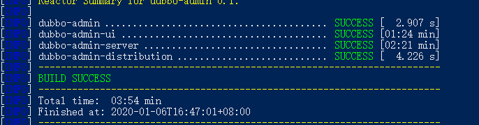

1. 或者先在 dubbo-admin-server 中打包，使用 mvn package -Dmaven.test.skip=true ，
2. 然后 java -jar 启动打包生成的 jar 包，如：java -jar dubbo-admin-server-0.3.0.jar。
3. 然后再去 dubbo-admin-ui 里面执行 npm install 等待下载前端的依赖，完毕后启动前端 npm run dev 

如果 dubbo-admin-server 编译报错，提示 zookeeper server创建失败什么的，可将上面的 admin.registry.address 配置改为：
```sql
admin.registry.address=zookeeper://192.168.118.131:2181?blockUntilConnectedWait=100000&timeout=100000

```

#### 4.1.2、启动前后端

切换到目录打包后的后端 jar 包目录：dubbo-Admin-develop\dubbo-admin-distribution\target，执行以下命令启动后台：
```sql
java -jar .\dubbo-admin-0.1.jar

```

在 dubbo-admin-ui 目录下执行以下命令启动前端：
```sql
npm run dev

```

启动完成后即可通过 localhost:8081 看到后台管理页面了，启动结果如下：（默认登录账户密码都是 root）
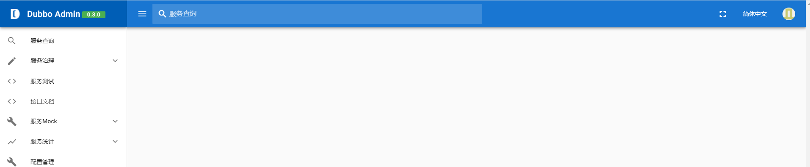

### 4.2、dubbo-admin的基本使用

可以在服务查询中看到已注册的服务，如下：
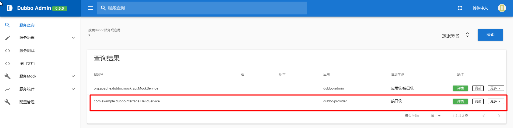

点击服务的详情，可以看到该服务的详细信息和该服务的消费者，如下：
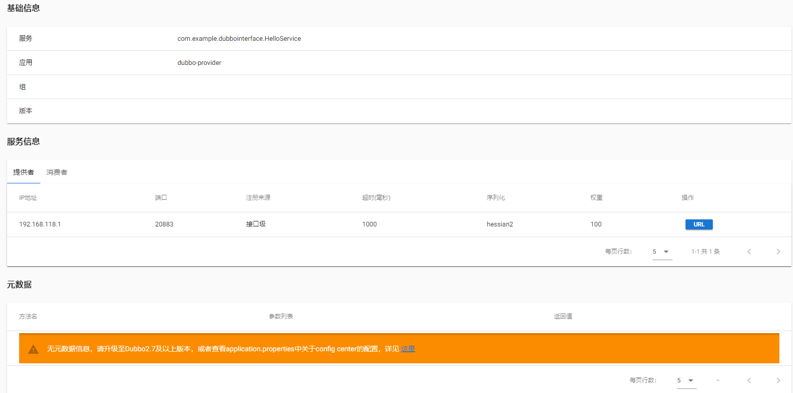
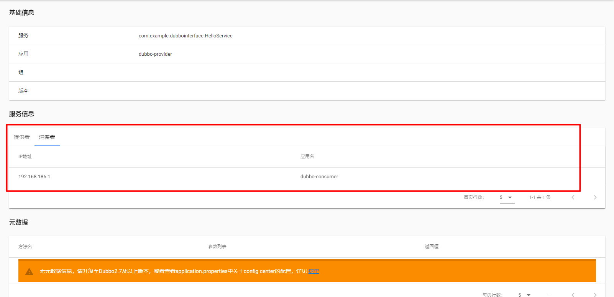
