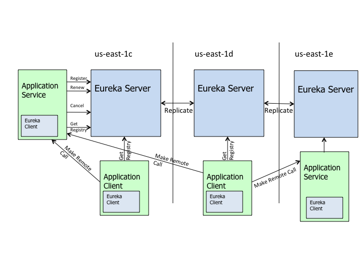

## 1.  Eureka是什么

Eureka是一个基于REST的服务，主要用于AWS云中的定位服务，以实现中间层服务器的负载平衡和故障转移

在 Spring Cloud **微服务**架构中通常用作**注册中心**

我们称这个服务为 Eureka Server，还有一个与之交互的客户端称之为 Eureka Client

## 2.  Eureka高级架构

如上图所示，其中

Application Server 表示服务提供方

Application Client  表示服务消费方

Make Remote Call 表示远程调用

服务在Eureka上注册，然后每隔30秒发送心跳来更新它们的租约。如果客户端不能多次续订租约，那么它将在大约90秒内从服务器注册表中剔除。注册信息和更新被复制到集群中的所有eureka节点。来自任何区域的客户端都可以查找注册表信息（每30秒发生一次）来定位它们的服务（可能在任何区域）并进行远程调用。

（PS：Eureka Client需要每30秒给Eureka Server发一次心跳，同时更新Server上最新的注册信息到本地，如果Server多次没有收到来自客户端的心跳，那么在90秒内会被Server上剔除）

## 3.  Eureka 客户端与服务器之间的通信

服务发现有两种模式：一种是客户端发现模式，一种是服务端发现模式。Eureka采用的是客户端发现模式。

3.1.  Register（注册）

Eureka客户端将关于运行实例的信息注册到Eureka服务器。注册发生在第一次心跳。

3.2.  Renew（更新 / 续借）

Eureka客户端需要更新最新注册信息（续借），通过每30秒发送一次心跳。更新通知是为了告诉Eureka服务器实例仍然存活。如果服务器在90秒内没有看到更新，它会将实例从注册表中删除。建议不要更改更新间隔，因为服务器使用该信息来确定客户机与服务器之间的通信是否存在广泛传播的问题。

3.3.  Fetch Registry（抓取注册信息）

Eureka客户端从服务器获取注册表信息并在本地缓存。之后，客户端使用这些信息来查找其他服务。通过在上一个获取周期和当前获取周期之间获取增量更新，这些信息会定期更新(每30秒更新一次)。获取的时候可能返回相同的实例。Eureka客户端自动处理重复信息。

3.4.  Cancel（取消）

Eureka客户端在关机时向Eureka服务器发送一个取消请求。这将从服务器的实例注册表中删除实例，从而有效地将实例从流量中取出。

## 4.  Eureka自我保护模式

如果 Eureka 服务器检测到超过预期数量的注册客户端以一种不优雅的方式终止了连接，并且同时正在等待被驱逐，那么它们将进入自我保护模式。这样做是为了确保灾难性网络事件不会擦除eureka注册表数据，并将其向下传播到所有客户端。

任何客户端，如果连续3次心跳更新失败，那么它将被视为非正常终止，病句将被剔除。当超过当前注册实例15%的客户端都处于这种状态，那么自我保护将被开启。

当自我保护开启以后，eureka服务器将停止剔除所有实例，直到：

1. 它看到的心跳续借的数量回到了预期的阈值之上，或者
2. 自我保护被禁用

默认情况下，自我保护是启用的，并且，默认的阈值是要大于当前注册数量的15%

## 5.  Eureka  VS  Zookeeper

5.1.  Eureka保证AP

Eureka服务器节点之间是对等的，只要有一个节点在，就可以正常提供服务。

Eureka客户端的所有操作可能需要一段时间才能在Eureka服务器中反映出来，随后在其他Eureka客户端中反映出来。也就是说，客户端获取到的注册信息可能不是最新的，它并不保证强一致性

5.2.  Zookeeper保证CP

Zookeeper集群中有一个Leader，多个Follower。Leader负责写，Follower负责读，ZK客户端连接到任何一个节点都是一样的，写操作完成以后要同步给所有Follower以后才会返回。如果Leader挂了，那么重新选出新的Leader，在此期间服务不可用。

5.3.  为什么用Eureka

分布式系统大都可以归结为两个问题：数据一致性和防止单点故障。而作为注册中心的话，即使在一段时间内不一致，也不会有太大影响，所以在A和C之间选择A是比较适合该场景的。