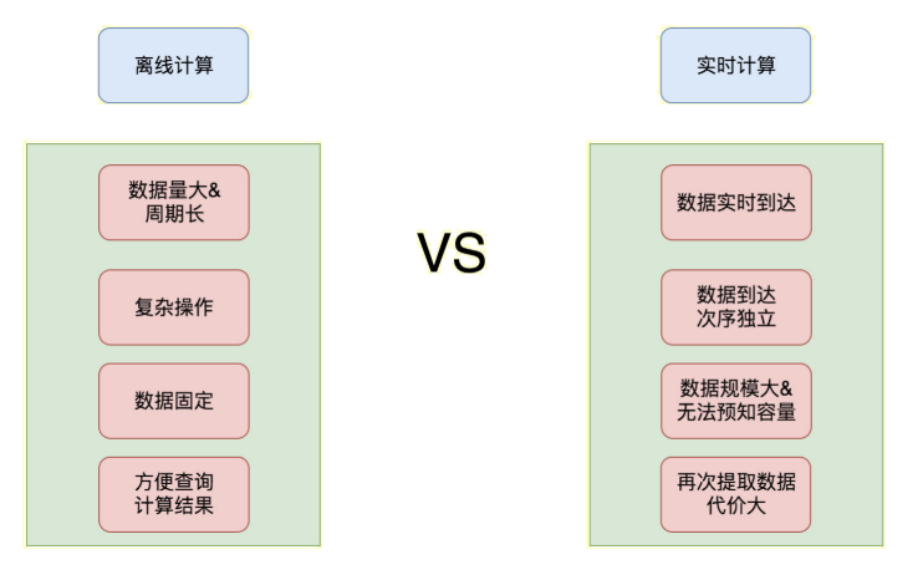
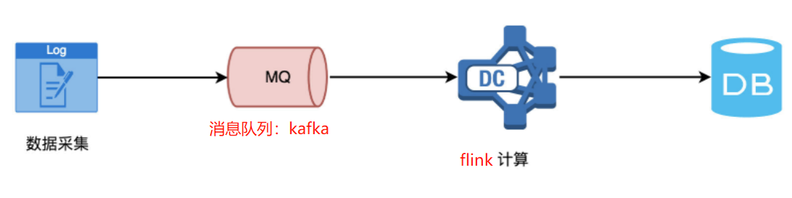
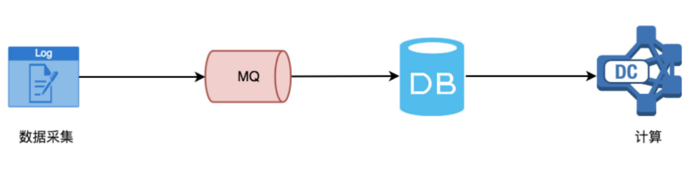
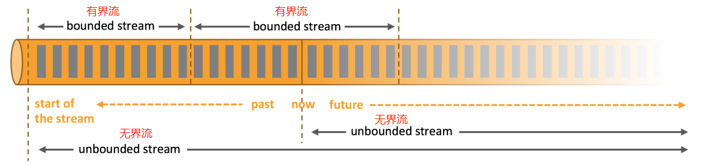
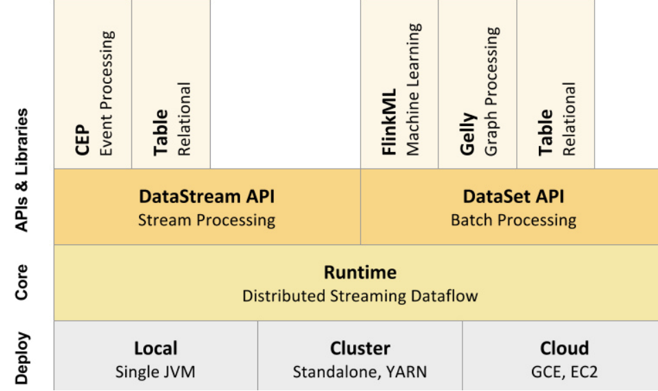
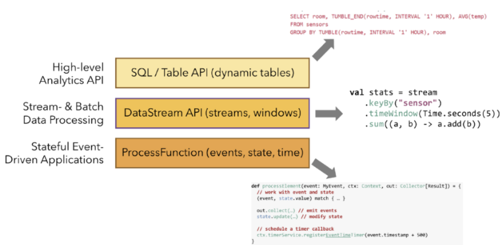
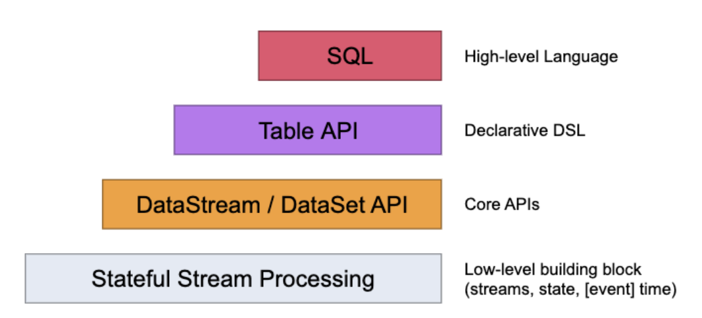
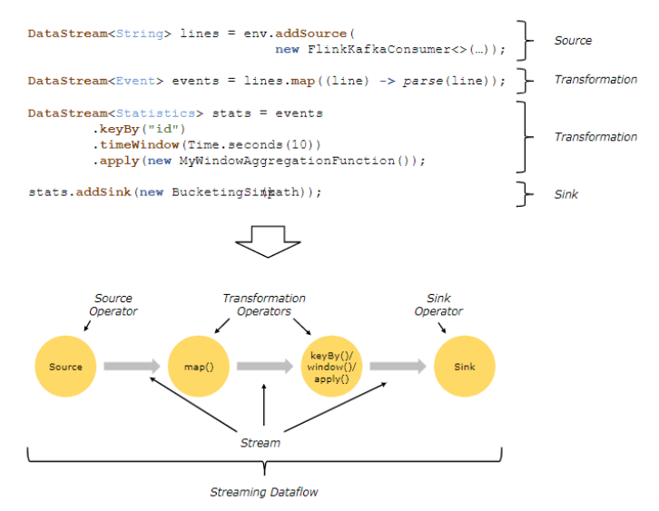

#### Flink前言

> Flink和spark的功能很相似，spark能做的flink也能做，flink能做的spark也能做；

##### 1、flink和spark本质的区别

```undefined
flink：侧重于做实时计算
spark：侧重于做离线计算
```

- 实时计算和离线计算的特点


##### 2、流处理和批处理

> 流处理和批处理：也可以叫做实时计算和离线计算

```undefined
特点
流处理：数据大小未知、做一些相对简单的操作、及时响应结果
批处理：数据大小固定、可以做复杂的操作、需要一段时间出结果
```

- 流处理


- 批处理



##### 3、无界流和有界流

> 从一开始不断地有数据过来-----无界流
>
> 有界流可以称为无界流的特例

```lua
无界流的处理称为流处理-----实时计算
有界流的处理称为批处理-----离线计算

注意：
有界流和批处理有一定的差距，有界流属于流，输出结果是一条一条的输出，
而批处理的输出结果是一个总的结果，并不是一条一条的
```


##### 4、实时计算需要考虑的问题

```scss
(1)数据处理唯一性（如何保证数据只处理一次、至少一次、最多一次）
(2)数据处理的及时性（采集的实时数据量太大的话可能会导致短时间内处理不过来，如何保证数据能够及时的处理，不出现数据堆积？）
(3)数据处理层和存储层的可扩展性（如何根据采集的实时数据量的大小提供动态扩缩容？）
(4)数据处理层和存储层的容错性（如何保证数据处理层和存储层高可用，出现故障时数据处理层和存储层服务依旧可用？）
```

#### Flink简介

##### 1、什么是Flink

```scss
Apache Flink是一个框架和分布式处理引擎，用于对无界和有界数据流进行有状态计算。
Flink设计为在所有常见的集群环境中运行(Yarn中运行)，以内存速度和任何规模执行计算。
```

##### 2、Flink的特征

> 1、可以做批处理（处理历史数据集）  
> 2、可以做流处理（处理实时数据流）  
> 3、事件驱动应用（监控事件的服务），spark是时间驱动

```scss
1、支持高吞吐、低延迟、高性能的流处理
2、支持带有事件时间的窗口（Window）操作
3、支持有状态计算的Exactly-once语义
4、支持高度灵活的窗口（Window）操作，支持基于time、count、session(绘画)，
   以及data-driven的窗口操作
5、支持具有反压功能的持续流模型
6、支持基于轻量级分布式快照（Snapshot）实现的容错
7、一个运行时同时支持Batch on Streaming处理和Streaming处理
8、Flink在JVM内部实现了自己的内存管理，避免了出现oom(内存溢出)
9、支持迭代计算
10、支持程序自动优化：避免特定情况下Shuffle、排序等昂贵操作，中间结果有必要进行缓存
```

##### 3、Blink--基于Flink开发的一个分支

```mipsasm
Blink 是阿里云基于Flink开发的一个分支.

在Flink1.9中已经将大部分Blink功能合并到Flink.

Blink 在 TPC-DS 上和 Spark 相比有着非常明显的性能优势，而且这种性能优势随着数据量的增加而变得越来越大。在实际的场景这种优势已经超过 Spark 三倍，在流计算性能上我们也取得了类似的提升。我们线上的很多典型作业，性能是原来的 3 到 5 倍。在有数据倾斜的场景，以及若干比较有挑战的 TPC-H query，流计算性能甚至得到了数十倍的提升。
```

##### 4、Flink技术栈


**部署方式：Deploy**

- Local本地模式  
  Flink部署在单个JVM进程上，主要用于调试

- Cluster集群模式  
  StandAlone模式：不依赖第三方资源管理框架，JobManager负责任务调度和资源管理，通过ZK保障高可用性；


​ YARN模式：YARN负责资源管理，JobManager负责任务调度；

- Cloud模式  
  Flink上云，发挥云的优势：弹性（快速的硬件升级以及扩容和缩容等），比如Amazon的EC2、Alibaba的ECS等；

**Runtime**  
  Flink引擎，负责计算逻辑（流计算和批处理）的执行；

**API & Libraries**  
  Flink的目标是批流一体，很可惜API层并没有做到统一。

​ DataStremAPI为流处理的API，DataSetAPI为批处理的API，以及基于API的各种Libraries，用户在使用时需要 感知流计算和批处理。

##### 5、Flink APIs


##### 6、数据流编程模型


##### 7、Flink的代码结构

