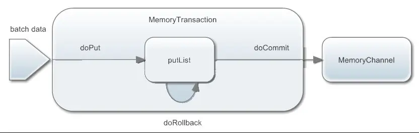

### 概述

1. Flume最早是Cloudera提供的日志收集系统，后贡献给Apache
2. Flume是一个高可用的，高可靠的 、健壮性，分布式的海量日志采集、聚合和传输的系统
3. Flume支持在日志系统中定制各类数据发送方，用于收集数据(source)
4. Flume提供对数据进行简单处理，并写到各种数据接受方(可定制)的能力(sink)。

### 版本

5. Flume0.9X：又称Flume-og，老版本的flume，需要引入zookeeper集群管理，性能也较低（单线程工作）
6. Flume1.X：又称Flume-ng。新版本需要引入zookeeper，和flume-og不兼容

### Flume的特性

7. 可靠性：事务型的数据传递，保证数据的可靠性。一个日志交给flume来处理，不会出现此日志丢失或未被处理的情况
8. 可恢复性：通道可以以内存或文件的方式实现，内存更快，但不可恢复。文件较慢但提供了可恢复性

### 基本概念

#### 一、Flume总体架构图

#### 二、event 事件

1. event的相关概念：Flume的核心是把数据从数据源(source)收集过来，在将收集到的数据送到指定的目的地(sink)。为了保证输送的过程一定成功，在送到目的地(sink)之前，会先缓存数据(channel),待数据真正到达目的地(sink)后，flume在删除自己缓存的数据
2. 在整个数据的传输的过程中，流动的是event，即事务保证是在event级别进行的。event将传输的数据进行封装，是flume传输数据的基本单位，如果是文本文件，通常是一行记录，event也是事务的基本单位。event从source，流向channel，再到sink，本身为一个字节数组，并可携带headers(头信息)信息。event代表着一个数据的最小完整单元，从外部数据源来，向外部的目的地去。简而言之，在Flume中，每一条日志就会封装成一个event对象
3. 一个完整的event包括：event headers、event body、event信息(即文本文件中的单行记录)，如下所以：  

其中event信息就是flume收集到的日记记录

#### 三、Flume的运行机制

4. flume运行的核心就是agent，agent本身是一个Java进程
5. agent里面包含3个核心的组件：source—>channel—>sink，类似生产者、仓库、消费者的架构
6. source：source组件是专门用来收集数据的，可以处理各种类型、各种格式的日志数据，包括avro、thrift、exec、jms、spooling directory、netcat、sequence generator、syslog、http、legacy、自定义等
7. channel：source组件把数据收集来以后，临时存放在channel中，即channel组件在agent中是专门用来存放临时数据的——对采集到的数据进行简单的缓存，可以存放在memory、jdbc、file等等
8. sink：sink组件是用于把数据发送到目的地的组件，目的地包括hdfs、logger、avro、thrift、ipc、file、null、hbase、solr、自定义。
9. 一个完整的工作流程：source不断的接收数据，将数据封装成一个一个的event，然后将event发送给channel，chanel作为一个缓冲区会临时存放这些event数据，随后sink会将channel中的event数据发送到指定的地方—-例如HDFS等
10. 注：只有在sink将channel中的数据成功发送出去之后，channel才会将临时event数据进行删除，这种机制保证了数据传输的可靠性与安全性。

#### 四、Flume的复杂流动

- 多个agent的数据流（多级流动）

- 数据流合并（扇入流）  
  在做日志收集的时候一个常见的场景就是，大量的生产日志的客户端发送数据到少量的附属于存储子系统的消费者agent。例如，从数百个web服务器中收集日志，它们发送数据到十几个负责将数据写入HDFS集群的agent

    这个可在Flume中可以实现，需要配置大量第一层的agent，每一个agent都有一个avro sink，让它们都指向同一个agent的avro source（强调一下，在这样一个场景下你也可以使用thrift source/sink/client）。在第二层agent上的source将收到的event合并到一个channel中，event被一个sink消费到它的最终的目的地

- 数据流复用（扇出流）  
  Flume支持多路输出event流到一个或多个目的地。这是靠定义一个多路数据流实现的，它可以实现复制和选择性路由一个event到一个或者多个channel

    上面的例子展示了agent foo中source扇出数据流到三个不同的channel，这个扇出可以是复制或者多路输出。在复制数据流的情况下，每一个event被发送所有的三个channel；在多路输出的情况下，一个event被发送到一部分可用的channel中，它们是根据event的属性和预先配置的值选择channel的。 这些映射关系应该被填写在agent的配置文件中

## 事务机制

### 一、概述

1. Flume的事务机制与可靠性保证的实现，最核心的组件是Channel（通道）。如果没有Channel组件，而紧靠Source与Sink组件是无从谈起的
2. 文件通道指的是将事件存储到代理（Agent）本地文件系统中的通道。虽然要比内存通道慢一些，不过它却提供了持久化的存储路径，可以应对大多数情况，它应该用在数据流中不允许出现缺口的场合
3. File channel虽然提供了持久化，但是其性能较差，吞吐量会受到一定的限制。相反，memory channel则牺牲可靠性换取吞吐量。当然，如果机器断电重启，则无法恢复。在实际应用中，大多数企业都是选择内存通道，因为在通过flume收集海量数据场景下，使用FileChannel所带来的性能下降是很大的甚至是无法忍受的

### 二、put事务流程

4. doPut:将批数据先写入临时缓冲区putList（Linkedblockingdequeue)
5. doCommit:检查channel内存队列是否足够合并。
6. doRollback:channel内存队列空间不足，回滚，等待内存通道的容量满足合并
7. putList就是一个临时的缓冲区，数据会先put到putList，最后由commit方法会检查channel是否有足够的缓冲区，有则合并到channel的队列

### 三、Take事务

8. doTake:先将数据取到临时缓冲区takeList(linkedBlockingDequeue)
9. 将数据发送到下一个节点
10. doCommit:如果数据全部发送成功，则清除临时缓冲区takeList
11. doRollback:数据发送过程中如果出现异常，rollback将临时缓冲区takeList中的数据归还给channel内存队列
