## 1． Hadoop介绍

Hadoop是Apache旗下的一个用java语言实现开源软件框架，是一个开发和运行处理大规模数据的软件平台。允许使用简单的编程模型在大量计算机集群上对大型数据集进行分布式处理。
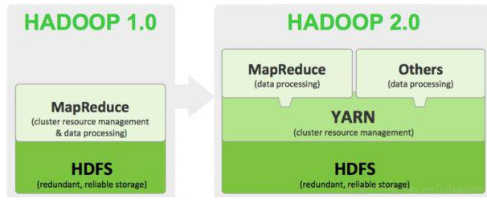

狭义上说，Hadoop指Apache这款开源框架，它的核心组件有：

HDFS（分布式文件系统）：解决海量数据存储

YARN（作业调度和集群资源管理的框架）：解决资源任务调度

MAPREDUCE（分布式运算编程框架）：解决海量数据计算

广义上来说，Hadoop通常是指一个更广泛的概念——Hadoop生态圈。
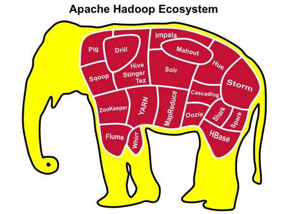

当下的Hadoop已经成长为一个庞大的体系，随着生态系统的成长，新出现的项目越来越多，其中不乏一些非Apache主管的项目，这些项目对HADOOP是很好的补充或者更高层的抽象。比如：

HDFS：分布式文件系统

MAPREDUCE：分布式运算程序开发框架

HIVE：基于HADOOP的分布式数据仓库，提供基于SQL的查询数据操作

HBASE：基于HADOOP的分布式海量数据库

ZOOKEEPER：分布式协调服务基础组件

Mahout：基于mapreduce/spark/flink等分布式运算框架的机器学习算法库

OOZIE：工作流调度框架

Sqoop：数据导入导出工具（比如用于mysql和HDFS之间）

FLUME：日志数据采集框架

IMPALA：基于hive的实时sql查询分析

## 2． Hadoop发展简史

Hadoop是Apache Lucene创始人 Doug Cutting创建的。最早起源于Nutch，它是Lucene的子项目。Nutch的设计目标是构建一个大型的全网搜索引擎，包括网页抓取、索引、查询等功能，但随着抓取网页数量的增加，遇到了严重的可扩展性问题：如何解决数十亿网页的存储和索引问题。

2003年Google发表了一篇论文为该问题提供了可行的解决方案。论文中描述的是谷歌的产品架构，该架构称为：谷歌分布式文件系统（GFS）,可以解决他们在网页爬取和索引过程中产生的超大文件的存储需求。

2004年 Google发表论文向全世界介绍了谷歌版的MapReduce系统。

同时期，Nutch的开发人员完成了相应的开源实现HDFS和MAPREDUCE，并从Nutch中剥离成为独立项目HADOOP，到2008年1月，HADOOP成为Apache顶级项目，迎来了它的快速发展期。

2006年Google发表了论文是关于BigTable的，这促使了后来的Hbase的发展。

因此，Hadoop及其生态圈的发展离不开Google的贡献。

## 3． Hadoop特性优点

扩容能力（Scalable）：Hadoop是在可用的计算机集群间分配数据并完成计算任务的，这些集群可用方便的扩展到数以千计的节点中。

成本低（Economical）：Hadoop通过普通廉价的机器组成服务器集群来分发以及处理数据，以至于成本很低。

高效率（Efficient）：通过并发数据，Hadoop可以在节点之间动态并行的移动数据，使得速度非常快。

可靠性（Rellable）：能自动维护数据的多份复制，并且在任务失败后能自动地重新部署（redeploy）计算任务。所以Hadoop的按位存储和处理数据的能力值得人们信赖。

## 4． Hadoop国内外应用

不管是国内还是国外，Hadoop最受青睐的行业是互联网领域，可以说互联网公司是hadoop的主要使用力量。

国外来说，Yahoo、Facebook、IBM等公司都大量使用hadoop集群来支撑业务。比如：

Yahoo的Hadoop应用在支持广告系统、用户行为分析、支持Web搜索等。

Facebook主要使用Hadoop存储内部日志与多维数据，并以此作为报告、分析和机器学习的数据源。

国内来说，BAT领头的互联网公司是当仁不让的Hadoop使用者、维护者。比如Ali云梯（14年国内最大Hadoop集群）、百度的日志分析平台、推荐引擎系统等。
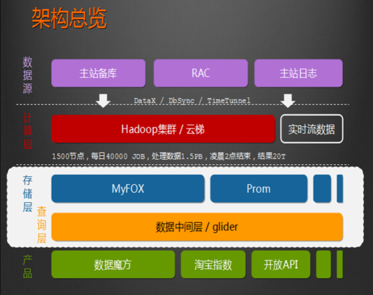

国内其他非互联网领域也有不少hadoop的应用，比如：

金融行业： 个人征信分析

证券行业： 投资模型分析

交通行业： 车辆、路况监控分析

电信行业： 用户上网行为分析

总之：hadoop并不会跟某种具体的行业或者某个具体的业务挂钩，它只是一种用来做海量数据分析处理的工具。

## 总结：

## Hadoop是什么？

#####         答：狭义上：是指Apache的一款java语言开发的开源软件，大数据问题处理平台！

|   |
|---|
|Hadoop HDFS：分布式文件系统，解决海量数据存储问题   Hadoop MapReduce：分布式计算框架，解决海量数据计算问题。   Hadoop YARN：资源管理任务调度系统|

广义上：是指hadoop生态圈，包括了大数据解决各不同步骤的软件

其中一些非Apache的项目也在其中

## Hadoop框架组成：

### Hadoop框架的组成

> HDFS(Hadoop Distributed File System)，Hadoop分布式文件系统。

> Map/Reduce分布式计算系统
>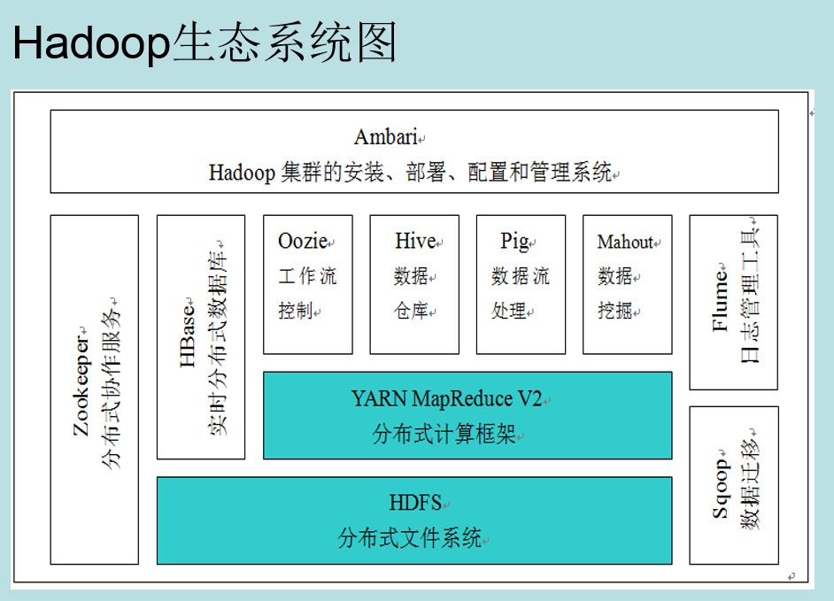

- 1、什么是HDFS分布式文件系统
    - HDFS是一个的文件系统，可以创建、移动、删除和重命名文件。
    - 是一个基于网络的分布式文件系统。
    - 由多个机器联网组成，其中一台为NameNode，其他的是DataNode。
    - NameNode为HDFS提供元数据服务，管理保存在不同节点上的数据信息。
    - DataNode管理本节点上的数据。
    - NameNode将一个大的数据文件分成多个数据块保存到不同的DataNode节点上，并记录所有数据块所在节点的信息，DataNode管理本节点上的数据块，数据块的大小默认为128M。
    - HDFS上NameNode和DataNode通信基于TCP/IP协议
- 2、HDFS(分布式文件系统)
    - HDFS分布式文件系统是基于网络的。
    - 是由多台机器组成的。
    - 是由一个NameNode和多个DataNode组成，NameNode运行在主服务器上，管理文件系统的命名空间和客户端对文件系统的访问操作。DataNode运行在其他的多台机器上，主要管理数据的存储，包括要分析的数据，历史数据等。
    - 在主服务器上的NameNode是HDFS分布式文件系统的主守护进程，分布在其他机器上的DataNode从进程定时向主进程NameNode发送报告，报告节点数据和磁盘的情况。NameNode进程向不同的DataNode节点发送指令，要求节点下载数据并管理数据。
    - 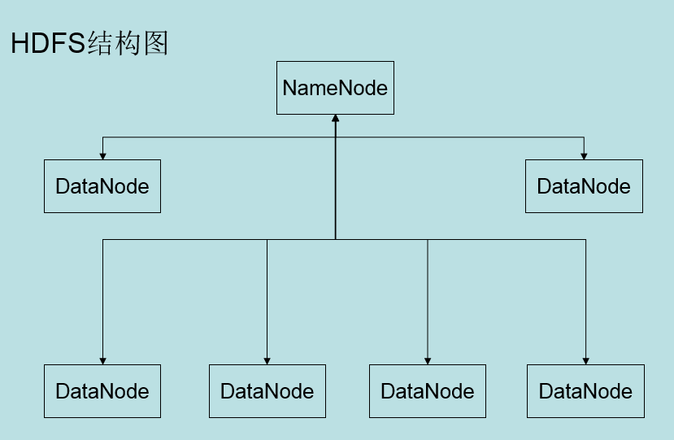
- 3、什么是MapReduce(分布式计算系统)
    - MapReduce是处理数据的编程模型。
    - 关系数据库可以采用SQL语句对数据进行操作查询。
    - MapReduce可以通过Java、C等其他语言对数据进行查询分析。
    - MapReduce分为两个阶段，map阶段和reduce阶段，map阶段将原始数据进行过滤操作，以键/值对的方式输出，map阶段的输出是reduce阶段的输入，reduce阶段对数据处理后输出最终的结果。
    - MapReduce处理的数据文件保存在HDFS上，并且最终的计算结果同样会保存到HDFS上。
    - MapReduce和HDFS相对独立由相互联系。
- 4、MapReduce(分布式计算系统)
    - Hadoop1.0版本的MapReduce
        - 由一个JobTracker和多个TaskTracker组成。 JobTracker运行在主服务器上， TaskTracker运行在集群中的从节点上。
        - JobTracker进程负责调度一个作业的所有任务的执行，这些任务会分配到不同的节点上。JobTracker主进程监控所有从节点的TaskTracker进程的作业执行情况，重新执行失败的任务。TaskTracker执行JobTracker指定的任务。当一个Job(数据分析作业)提交时，JobTracker接收到提交的任作业后，将作业执行需要的配置信息和其他数据信息分发给相应的TaskTracker。同时要调度任务并监控TaskTracker的执行。
        - 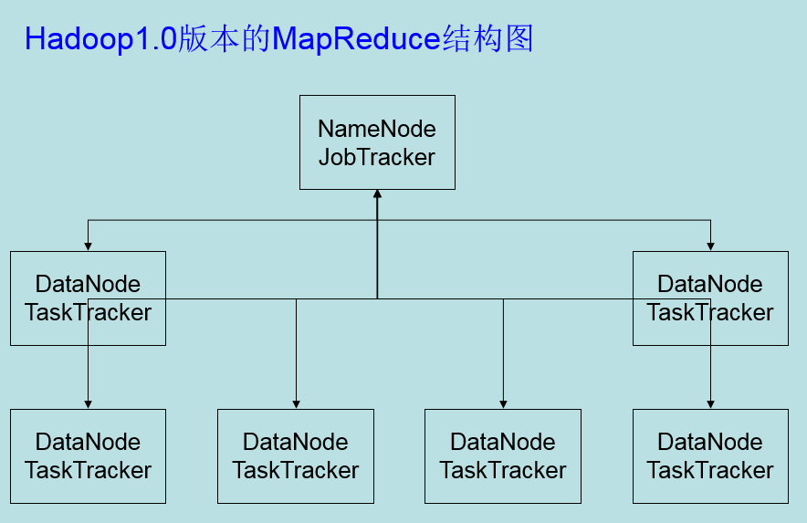
- 5、YARN(分布式计算系统)

    - Hadoop2.0版本的MapReduceV2(YARN)
    - YARN ( Yet Another Resource Negotiator )
        - 由一个ResourceManager和多个NodeManager组成。 ResourceManager运行在主服务器上， NodeManager运行在集群中的从节点上。
        - ResourceManager是集群所有可用资源的仲裁者。是一个单纯的资源控制器和调度器。主要职责是接收应用程序的资源请求并严格控制系统的可用资源。动态的分配资源。
        - NodeManager是集群中每个节点上的管理进程，职责是对节点中的资源进行管理并与ResourceManager保持通信，报告节点的各种状态信息。与ResourceManager共同管理整个集群资源，资源包括内存、CPU等。
        - 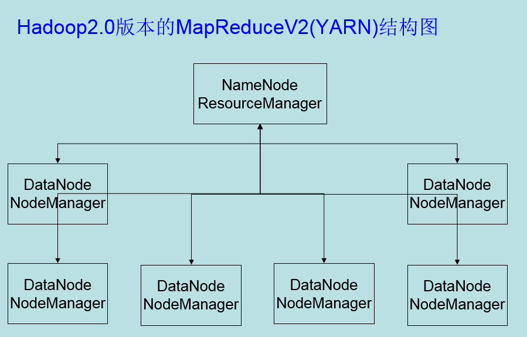

- 6、Hadoop2.0在Hadoop1.0上的改变

    - YARN将JobTracker分为两个组件：ResourceManager和ApplicationMaster。ResourceManager作为资源管理和调度不需要关心应用程序的执行和监控。而与应用程序相关的是ApplicationMaster。
    - 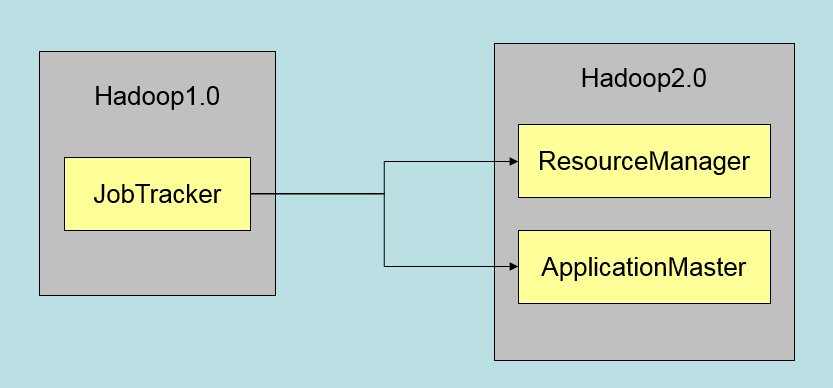

    - ResourceManager进程运行在主节点上，作为集群资源的管理者和总调度，不在需要关心应用程序的执行和监控。ApplicationMaster进程运行在从节点上，主要管理应用程序的执行和应用程序的生命周期，当应用程序执行结束，ApplicationMaster的生命周期结束。
    - 客户端发出应用程序执行请求，ResourceManager会创建与应用程序对应的ApplicationMaster实例。
    - 好处是，分工明确，粒度细化和多应用程序的同步执行。
    - 不同的应用对应不同的ApplicationMaster。MapReduce计算框架对应相应的ApplicationMaster。不同的计算框架对应不同的ApplicationMaster实现。
    - 好处是：职责的分离带来的是扩展性的提升。如：程序在运行阶段发生异常带来的节点任务失败是需要重新启动作业的，这些相关的容错机制在Hadoop1.0是由JobTracker负责的。使得JobTracker成为重量级，代码的维护相当困难，并且框架的耦合度高，功能模块粒度粗。在YARN中这些容错职责由ApplicationMaster担任，实现了容错机制局部化，而不是以往的全局管理。此外需要注意的是应用程序和ResourceManager的分离使ResourceManager轻量化。某个应用的执行不会影响到整个集群。
    - Hadoop2.0和Hadoop1.0的结构图
    - 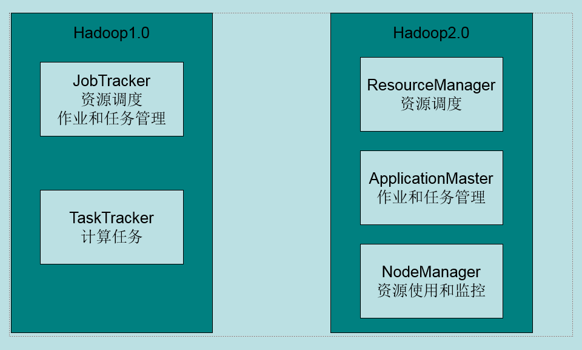

    - 不同应用对应不同的ApplicationMaster。只需要增加不同计算框架的ApplicationMaster实现即可实现多种框架使用YARN，如MapReduce、MPI和图计算等。实现上是把所有与应用程序相关的代码都放到ApplicationMaster类中。并提供不同的接口满足不同用户的需求。
      - 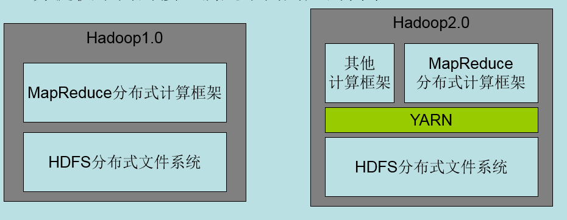
        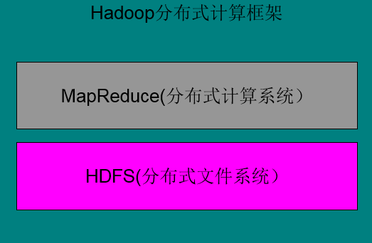

## hadoop优点及应用：

#### 优点：

#####         扩展能力强，使用分布式思想解决海量数据存储问题，使用简单方便，相比较之前的处理方式，效率提高。

#### 应用：

#####         hadoop精确的区分了what to do(做什么？ 业务)  how to do (这么做？技术)

#####         hadoop 提供了大数据存储能力，计算能力，跟具体的行业不会挂钩，通用的大数据解决方案