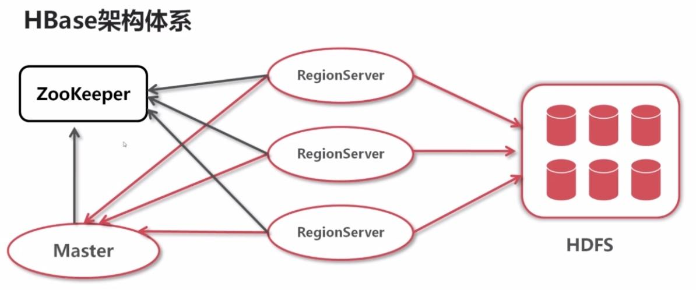
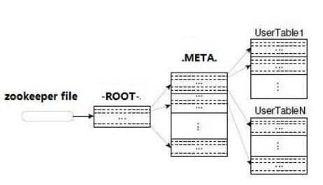
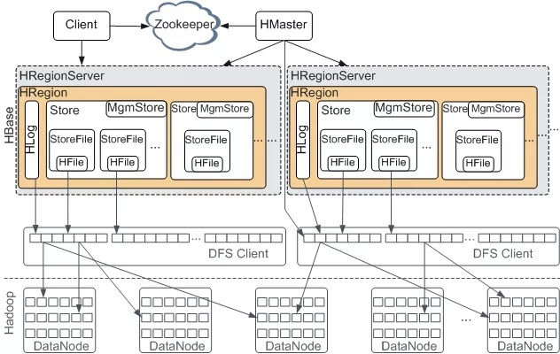

#### 简介

Hbase是一种 分布式存储 的数据库，技术上来讲，它更像是分布式存储而不是 分布式数据库，它缺少很多RDBMS系统的特性，比如列类型，辅助索引，触发器，和高级查询语言等待。

Hbase有如下特性:

- 强读写一致，但是不是“最终一致性”的 数据存储，这使得它非常适合高速的计算聚合
- 自动分片，通过Region分散在集群中，当行数增长的时候，Region也会自动的切分和再分配
- 自动的故障转移
- Hadoop/HDFS集成，和HDFS开箱即用
- 丰富的“简洁，高效”API，Thrift/REST API，Java API
- 块缓存，布隆过滤器，可以高效的列查询优化
- 操作管理，Hbase提供了内置的web界面来操作，还可以监控JMX指标

##### Hbase的使用场景

- 首先数据库量要足够多，如果有十亿及百亿行数据，那么Hbase是一个很好的选项，如果只有几百万行甚至不到的数据量，RDBMS是一个很好的选择。因为数据量小的话，真正能工作的机器量少，剩余的机器都处于空闲的状态
- 不需要辅助索引，静态类型的列，事务等特性
- 保证硬件资源足够，每个HDFS集群在少于5个节点的时候，都不能表现的很好。因为HDFS默认的复制数量是3，再加上一个NameNode

#### Hbase架构

Hbase是三层架构体系。

- 其中Hbase表底层是存储在HDFS上，可以分为多个Region， Region分布在Region Server上
- Master负责协调Region和负载
- Zookeeper负责记录一些元数据

HBase中有两张特殊的表： Root和META， META表负责记录Region的分区信息， Root表负责记录META的分区信息， Root表的位置信息则有Hadoop集群的zookeeper来记录。

那么Hbase检索一条数据的流程应该是这样的:

##### 存储结构

Hbase 是一种专门为半结构化数据和水平扩展性设计的数据库。它把数据存储在表中，表按“行健(rowkey)，列簇，列限定符和时间版本”的四维坐标系来组织。Hbase 是无模式数据库，只需要提前定义列簇，并不需要指定列限定符。同时它也是无类型数据库，所有数据都是按二进制字节方式存储的，对 Hbase 的操作和访问有 5 个基本方式，即 Get、Put、Delete 和 Scan 以及 Increment。Hbase 基于非行健值查询的唯一途径是通过带过滤器的扫描。

从上图我们可以看出 Hbase 的组成部件，HBase 中的每张表都通过行键按照一定的范围被分割成多个子表（HRegion），由 HRegionServer 管理，管理哪些 HRegion 由 HMaster 分配。

HRegionServer 存取一个子表时，会创建一个 HRegion 对象，然后对表的每个列族 (Column Family) 创建一个 Store 实例，每个 Store 都会有 0 个或多个 StoreFile 与之对应，每个 StoreFile 都会对应一个 HFile，HFile 就是实际的存储文件。因此，一个 HRegion 有多少个列族就有多少个 Store。此外，每个 HRegion 还拥有一个 MemStore 内存缓存实例。

- HFile：HBase 中 KeyValue 数据的存储格式，HFile 是 Hadoop 的二进制格式文件，实际上 StoreFile 就是对 HFile 做了轻量级包装，即 StoreFile 底层就是 HFile
- HLog: HBase记录写入记录，WAL机制保证数据可靠性，即首先写日志再写缓存，即使发生宕机，也可以通过恢复HLog还原出原始数据。该步骤就是将数据构造为WALEdit对象，然后顺序写入HLog中。
- MemStore：MemStore 即内存里放着的保存 KEY/VALUE 映射的 MAP，当 MemStore（默认 64MB）写满之后，会开始 flush 到磁盘（即 Hadoop 的 HDFS 上）的操作

##### HLog之WAL(write ahead log)机制

WAL(Write-Ahead Logging)是一种高效的日志算法,基本原理是在数据写入之前首先顺序写入日志，然后再写入缓存，等到缓存写满之后统一落盘。之所以能够提升写性能，是因为WAL将一次随机写转化为了一次顺序写加一次内存写。提升写性能的同时，WAL可以保证数据的可靠性，即在任何情况下数据不丢失。假如一次写入完成之后发生了宕机，即使所有缓存中的数据丢失，也可以通过恢复日志还原出丢失的数据。

###### HBase写入流程分析

1. zookeeper中存储了meta表的region信息，从meta表获取相应region信息，然后找到meta表的数据
2. 根据meta表的数据找到写入数据对应的region信息, 找到对应的RegionServer
3. 把数据分别写到HLog和MemStore上一份
4. MemStore达到一个阈值后则把数据刷成一个StoreFile文件。若MemStore中的数据有丢失，则可以总HLog上恢复
5. 当多个StoreFile文件达到一定的大小后，会触发Compact合并操作，合并为一个StoreFile，这里同时进行版本的合并和数据删除
6. 当Compact后，逐步形成越来越大的StoreFIle后，会触发Split操作，把当前的StoreFile分成两个，这里相当于把一个大的region分割成两个region