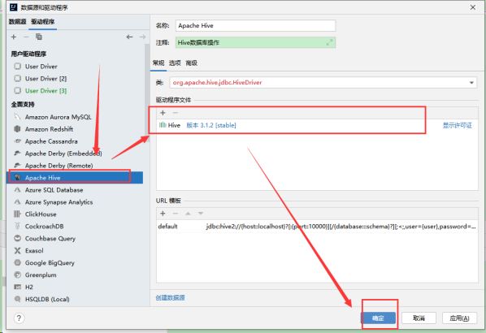

## 1 Hive基本概念

Hive是一个构建在Hadoop上的数据仓库框架。最初，Hive是由Facebook开发，后来移交由Apache软件基金会开发，并作为一个Apache开源项目。

Hive是基于Hadoop的一个数据仓库工具，可以将结构化的数据文件映射为一张数据库表，并提供类SQL查询功能。

其本质是将SQL转换为MapReduce的任务进行运算，底层由HDFS来提供数据的存储，说白了hive可以理解为一个将SQL转换为MapReduce的任务的工具，甚至更进一步可以说hive就是一个MapReduce的客户端。


## 2 Hive的特点与架构图

- Hive最大的特点是通过类SQL来分析大数据，而避免了写MapReduce程序来分析数据，这样使得分析数据更容易。
- 数据是存储在HDFS上的，Hive本身并不提供数据的存储功能，它可以使已经存储的数据结构化。
- Hive是将数据映射成数据库和一张张的表，库和表的元数据信息一般存在关系型数据库上（比如MySQL）。
- 数据存储方面：它能够存储很大的数据集，可以直接访问存储在Apache HDFS或其他数据存储系统（如Apache HBase）中的文件。
- 数据处理方面：因为Hive语句最终会生成MapReduce任务去计算，所以不适用于实时计算的场景，它适用于离线分析。
- Hive除了支持MapReduce计算引擎，还支持Spark和Tez这两种分布式计算引擎；
- 数据的存储格式有多种，比如数据源是二进制格式，普通文本格式等等；
- hive具有sql数据库的外表，但应用场景完全不同，hive只适合用来做批量数据统计分析


## 3 **Hive的安装方式**

hive的安装一共有三种方式**:内嵌模式、本地模式、远程模式** 

**元数据服务(metastore）**作用是：客户端连接metastore服务，metastore再去连接MySQL数据库来存取元数据。有了metastore服务，就可以有多个客户端同时连接，而且这些客户端不需要知道MySQL数据库的用户名和密码，只需要连接metastore 服务即可。

**（1） 内嵌模式**

**内嵌模式**使用的是内嵌的Derby数据库来存储元数据，也不需要额外起Metastore服务。数据库和Metastore服务都嵌入在主Hive Server进程中。这个是默认的，配置简单，但是一次只能一个客户端连接，适用于用来实验，不适用于生产环境。解压hive安装包  bin/hive 启动即可使用

缺点：不同路径启动hive，每一个hive拥有一套自己的元数据，无法共享。


**（2）本地模式**

**本地模式**采用外部数据库来存储元数据，目前支持的数据库有：MySQL、Postgres、Oracle、MS SQL Server.在这里我们使用MySQL。本地模式不需要单独起metastore服务，用的是跟hive在同一个进程里的metastore服务。也就是说当你启动一个hive 服务，里面默认会帮我们启动一个metastore服务。hive根据hive.metastore.uris 参数值来判断，如果为空，则为本地模式。

缺点：每启动一次hive服务，都内置启动了一个metastore。


**（3）远程模式**

**远程模式**下，需要单独起metastore服务，然后每个客户端都在配置文件里配置连接到该metastore服务。远程模式的metastore服务和hive运行在不同的进程里。在生产环境中，建议用远程模式来配置Hive Metastore。在这种情况下，其他依赖hive的软件都可以通过Metastore访问hive。

远程模式下需要配置hive.metastore.uris 参数来指定metastore服务运行的机器ip和端口，并且需要单独手动启动metastore服务。hiveserver2是Hive启动了一个server，客户端可以使用JDBC协议，通过IP+ Port的方式对其进行访问，达到并发访问的目的。


## 4 Hive的安装

之前文章介绍过按照Hadoop，继Hadoop后按照Hive。在此处选择第三台机器node3作为我们hive的安装机器，安装方式使用远程方式。

准备工作：
① 必须按照有Hadoop（可以是单节点也可以是高可用）和MySQL数据库。可参照我其他两篇文章。

② 在Node3主机上创建目录（已创建有可以忽略）：

```bash
mkdir  -p /export/server/
mkdir  -p /export/data/
mkdir  -p /export/software/
```


准备一个Hive的包，可以去官网下载 [http://archive.apache.org/dist/hive/hive-3.1.2/apache-hive-3.1.2-bin.tar.gz](http://archive.apache.org/dist/hive/hive-3.1.2/apache-hive-3.1.2-bin.tar.gz)

（1）上传压缩包到/export/software目录里，并解压安装包

```bash
# 上传压缩包到/export/software目录里，并解压安装包
cd /export/software/
tar -zxvf apache-hive-3.1.2-bin.tar.gz -C /export/server
cd /export/server
mv apache-hive-3.1.2-bin hive-3.1.2
```


（2）解决hadoop、hive之间guava版本差异

```bash
#解决hadoop、hive之间guava版本差异
cd /export/server/hive-3.1.2
rm -rf lib/guava-19.0.jar
cp /export/server/hadoop-3.1.4/share/hadoop/common/lib/guava-27.0-jre.jar ./lib/
```


(3) 配置一个MySQL的连接包。这步必须配置，Mysql5.X和Mysql8.X的连接包可能不同

```bash
#上传这个包到此目录下/export/server/hive-3.1.2/lib
mysql-connector-java-5.1.41-bin.jar
```


（5）修改hive环境变量文件 添加Hadoop_HOME

```bash
#修改hive环境变量文件 添加Hadoop_HOME
cd /export/server/hive-3.1.2/conf/
mv hive-env.sh.template hive-env.sh
vim hive-env.sh

#---将以下的配置放到配置文件中，以hadoop-3.1.4和hive-3.1.2为例
HADOOP_HOME=/export/server/hadoop-3.1.4
export HIVE_CONF_DIR=/export/server/hive-3.1.2/conf
export HIVE_AUX_JARS_PATH=/export/server/hive-3.1.2/lib
```

（6）配置mysql等相关信息，新增hive-site.xml 

```bash
#--打开配置文件
vim hive-site.xml

#--将以下配置内容写入配置文件中，具体的连接端口以自己本机为准，附上备注
<configuration>
    <!-- 存储元数据mysql相关配置 -->
    <property>
        <name>javax.jdo.option.ConnectionURL</name>
        <value> jdbc:mysql://node3:3306/hive?createDatabaseIfNotExist=true&amp;useSSL=false&amp;useUnicode=true&amp;characterEncoding=UTF-8</value>
    </property>

    <property>
        <name>javax.jdo.option.ConnectionDriverName</name>
        <value>com.mysql.jdbc.Driver</value>
    </property>

    <property>
        <name>javax.jdo.option.ConnectionUserName</name>
        <value>root</value>
    </property>

    <property>
        <name>javax.jdo.option.ConnectionPassword</name>
        <value>123456</value>
    </property>

    <!-- H2S运行绑定host -->
    <property>
        <name>hive.server2.thrift.bind.host</name>
        <value>node3</value>
    </property>

    <!-- 远程模式部署metastore 服务地址 -->
    <property>
        <name>hive.metastore.uris</name>
        <value>thrift://node3:9083</value>
    </property>

    <!-- 关闭元数据存储授权  -->
    <property>
        <name>hive.metastore.event.db.notification.api.auth</name>
        <value>false</value>
    </property>

    <!-- 关闭元数据存储版本的验证 -->
    <property>
        <name>hive.metastore.schema.verification</name>
        <value>false</value>
    </property>
</configuration>
```


（7）初始化metadata(只需要在配置完Hive之后进行一次操作)

```bash
cd /export/server/hive-3.1.2

#初始化成功会在mysql中创建74张表
bin/schematool -initSchema -dbType mysql -verbos
```

（8）系统环境变量配置

```bash
#添加环境变量
vim /etc/profile

#将以下环境变量新增到/etc/profile文件中
export HIVE_HOME=/export/server/hive-3.1.2
export PATH=:$HIVE_HOME/bin:$PATH

#刷新，让环境变量生效
source /etc/profile
```

（9）通过后台运行启动metastore和hiveserver2 启动前需要查看下Hadoop是否启动，Hadoop未启动会报错：**连接失败**

```bash
#查看Hadoop是否启动
jps

#Hadoop未启动：没有DataNode和NodeManage节点代表Hadoop未启动
#一键启动Hadoop(已启动则忽略)
start-add.sh

#-----------------Metastore 和 Hiveserver2启动----
nohup /export/server/hive-3.1.2/bin/hive --service metastore  2>&1 &
nohup /export/server/hive-3.1.2/bin/hive --service hiveserver2 2>&1 &

#启动成功会生成日志，进入可以查看是否有问题
vim nohup.out
```


（10）验证是否安装成功

```bash
#在Linux中输入，hive直接回车,
hive

#出现一个终端，在该终端中可以输入sql命令:
show databases;
```


## 5  **Hive的交互方式**

Hive交互方式有多种，这里以远程模式的hiveserver2交互为例。需要对Hadoop配置文件进行更新。

```bash
#第一步：在NameNode节点上的主机上关闭Hadoop（我的是Node1主机）
stop-all.sh

#第二步：Node1主机上进入到Hadoop配置文件的路径，然后编辑 core-site.xml文件
cd /export/server/hadoop-3.1.4/etc/hadoop/
vim core-site.xml

#第三步：在文件末尾<configuration>内追加配置
<property>
    <name>hadoop.proxyuser.root.hosts</name>
    <value>*</value>
</property>
<property>
    <name>hadoop.proxyuser.root.groups</name>
    <value>*</value>
</property>

#第四步：将修改好的core-site.xml文件分发到node2和node3
scp core-site.xml node2:$PWD
scp core-site.xml node3:$PWD

#第五步:然后重启Hadoop（stop-all.sh start-all.sh）
start-all.sh
```

在hive运行的服务器上，确保已经启动metastore服务和hiveserver2服务，如果没有启动，则执行以下语句

```bash
nohup /export/server/hive-3.1.2/bin/hive --service metastore  2>&1 &
nohup /export/server/hive-3.1.2/bin/hive --service hiveserver2 2>&1 &
```

为了方便快捷，直接通过制作脚本进行登录Hive

```bash
#Hive一键登录脚本，安装expect
yum  -y install expect

#新建一个脚本文件夹,并写一个脚本
mkdir -p /export/server/script
cd /export/server/script
vim  beenline.exp

#脚本的内容如下：

#!/bin/expect
spawn beeline 
set timeout 5
expect "beeline>"
send "!connect jdbc:hive2://node3:10000\r"
expect "Enter username for jdbc:hive2://node3:10000:"
send "root\r"
expect "Enter password for jdbc:hive2://node3:10000:"
send "123456\r"
interact

#:wq保存脚本后，需要修改脚本权限
chmod 777 beenline.exp

#最后可以实现一键脚本登录Hive
expect beenline.exp
```

## **6 使用IDEA连接hive**

使用IntelliJ IDEA 连接




打开node1:9870 看到hadoop中生成了hive的数据表所在位置


具体的hive语法操作自行百度，最后。引用网友的hive架构图


