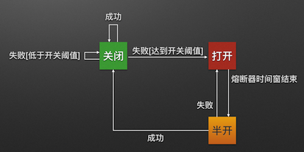
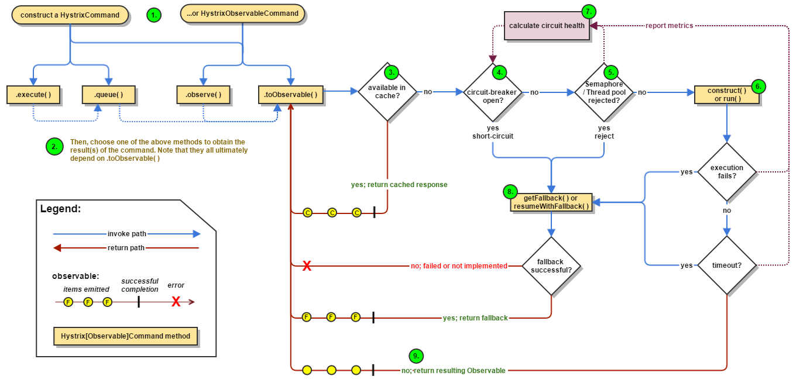
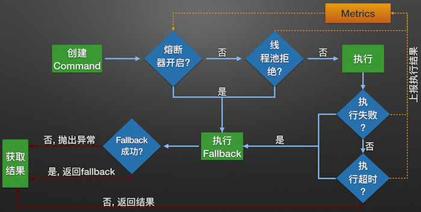
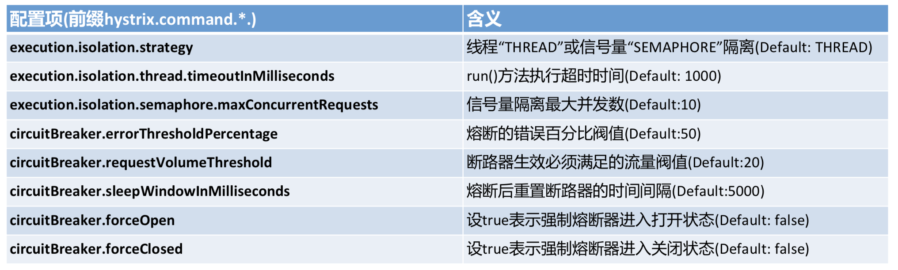
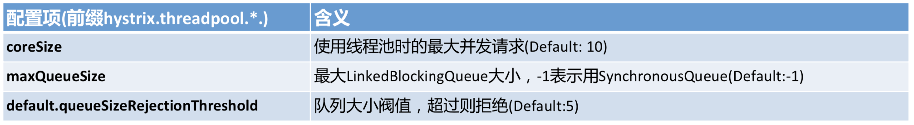

## 为什么需要容错限流

- 复杂分布式系统通常有很多依赖，如果一个应用不能对来自依赖 故障进行隔离，那么应用本身就处在被拖垮的风险中。在一个高流量的网站中，某个单一后端一旦发生延迟，将会在数秒内导致 所有应用资源被耗尽（一个臭鸡蛋影响一篮筐）。
- 如秒杀、抢购、双十一等场景，在某一时间点会有爆发式的网络流量涌入，如果没有好的网络流量限制，任由流量压到后台服务实例，很有可能造成资源耗尽，服务无法响应，甚至严重的导致应用崩溃。

## Hystrix是什么

Hystrix 能使你的系统在出现依赖服务失效的时候，通过隔离系统所依赖的服务，防止服务级联失败，同时提供失败回退机制，更优雅地应对失效，并使你的系统能更快地从异常中恢复。

## Hystrix能做什么

- 在通过第三方客户端访问（通常是通过网络）依赖服务出现高延迟或者失败时，为系统提供保护和控制
- 在分布式系统中防止级联失败
- 快速失败（Fail fast）同时能快速恢复
- 提供失败回退（Fallback）和优雅的服务降级机制
- 提供近似实时的监控、报警和运维控制手段

## Hystrix设计原则

- 防止单个依赖耗尽容器（例如 Tomcat）内所有用户线程
- 降低系统负载，对无法及时处理的请求快速失败（fail fast）而不是排队
- 提供失败回退，以在必要时让失效对用户透明化
- 使用隔离机制（例如『舱壁』/『泳道』模式，熔断器模式等）降低依赖服务对整个系统的影响
- 针对系统服务的度量、监控和报警，提供优化以满足近似实时性的要求
- 在 Hystrix 绝大部分需要动态调整配置并快速部署到所有应用方面，提供优化以满足快速恢复的要求
- 能保护应用不受依赖服务的整个执行过程中失败的影响，而不仅仅是网络请求

## Hystrix设计思想来源

### 舱壁隔离模式

货船为了进行防止漏水和火灾的扩散,会将货仓分隔为多个，当发生灾害时，将所在货仓进行隔离就可以降低整艘船的风险。


### 断路器模式

熔断器就像家里的保险丝，当电流过载了就会跳闸，不过Hystrix的熔断机制相对复杂一些。


熔断器开关由关闭到打开的状态转换是通过当前服务健康状况和设定阈值比较决定的.

- 当熔断器开关关闭时，请求被允许通过熔断器。如果当前健康状况高于设定阈值，开关继续保持关闭。如果当前健康状况低于设定阈值，开关则切换为打开状态。
- 当熔断器开关打开时，请求被禁止通过。
- 当熔断器开关处于打开状态，经过一段时间后，熔断器会自动进入半开状态，这时熔断器只允许一个请求通过。当该请求调用成功时，熔断器恢复到关闭状态。若该请求失败，熔断器继续保持打开状态， 接下来的请求被禁止通过。

## Hystrix工作流程

### 官网原图


### 中文版


### 流程说明

1. 每次调用创建一个新的HystrixCommand,把依赖调用封装在run()方法中.
2. 执行execute()/queue做同步或异步调用.
3. 当前调用是否已被缓存，是则直接返回结果，否则进入步骤 4
4. 判断熔断器(circuit-breaker)是否打开,如果打开跳到步骤 8,进行降级策略,如果关闭进入步骤 5
5. 判断线程池/队列/信号量是否跑满，如果跑满进入降级步骤8,否则继续后续步骤 6
6. 调用HystrixCommand的run方法.运行依赖逻辑

- 6.1. 调用是否出现异常，否：继续，是进入步骤8，
- 6.2. 调用是否超时，否：返回调用结果，是进入步骤8

7. 搜集5、6步骤所有的运行状态(成功, 失败, 拒绝,超时)上报给熔断器，用于统计从而判断熔断器状态
8. getFallback()降级逻辑.四种触发getFallback调用情况（图中步骤8的箭头来源）：  
   返回执行成功结果

## 两种资源隔离模式

### 线程池隔离模式

使用一个线程池来存储当前的请求，线程池对请求作处理，设置任务返回处理超时时间，堆积的请求堆积入线程池队列。这种方式需要为每个依赖的服务申请线程池，有一定的资源消耗，好处是可以应对突发流量（流量洪峰来临时，处理不完可将数据存储到线程池队里慢慢处理）。

### 信号量隔离模式

使用一个原子计数器（或信号量）来记录当前有多少个线程在运行，请求来先判断计数器的数值，若超过设置的最大线程个数则丢弃改类型的新请求，若不超过则执行计数操作请求来计数器+1，请求返回计数器-1。这种方式是严格的控制线程且立即返回模式，无法应对突发流量（流量洪峰来临时，处理的线程超过数量，其他的请求会直接返回，不继续去请求依赖的服务）。

### 线程池隔离模式 VS 信号量隔离模式


## Hystrix主要配置项



## 快速上手

### pom.xml

```xml
<dependency>
    <groupId>org.springframework.boot</groupId>
    <artifactId>spring-boot-starter-web</artifactId>
</dependency>
<dependency>
    <groupId>com.netflix.hystrix</groupId>
    <artifactId>hystrix-core</artifactId>
    <version>1.5.12</version>
</dependency>
<dependency>
    <groupId>com.netflix.hystrix</groupId>
    <artifactId>hystrix-metrics-event-stream</artifactId>
    <version>1.5.12</version>
</dependency>
<dependency>
    <groupId>com.netflix.hystrix</groupId>
    <artifactId>hystrix-javanica</artifactId>
    <version>1.5.12</version>
</dependency>
```

### HystrixConfig

```java
@Configuration
public class HystrixConfig {

    /**
     * 声明一个HystrixCommandAspect代理类，现拦截HystrixCommand的功能
     */
    @Bean
    public HystrixCommandAspect hystrixCommandAspect() {
        return new HystrixCommandAspect();
    }

}
```

### HelloService

```java
@Service
public class HelloService {

    @HystrixCommand(fallbackMethod = "helloError",
            commandProperties = {
                    @HystrixProperty(name = "execution.isolation.strategy", value = "THREAD"),
                    @HystrixProperty(name = "execution.isolation.thread.timeoutInMilliseconds", value = "1000"),
                    @HystrixProperty(name = "circuitBreaker.enabled", value = "true"),
                    @HystrixProperty(name = "circuitBreaker.requestVolumeThreshold", value = "2")},
            threadPoolProperties = {
                    @HystrixProperty(name = "coreSize", value = "5"),
                    @HystrixProperty(name = "maximumSize", value = "5"),
                    @HystrixProperty(name = "maxQueueSize", value = "10")
            })
    public String sayHello(String name) {
        try {
            Thread.sleep( 15000 );
            return "Hello " + name + " !";
        } catch (InterruptedException e) {
            e.printStackTrace();
        }
        return null;
    }

    public String helloError(String name) {
        return "服务器繁忙，请稍后访问~";
    }

}
```

### 启动类

```java
@SpringBootApplication
@RestController
public class HystrixSimpleApplication {

    @Autowired
    private HelloService helloService;

    public static void main(String[] args) {
        SpringApplication.run( HystrixSimpleApplication.class, args );
    }

    @GetMapping("/hi")
    public String hi(String name) {
        return helloService.sayHello( name );
    }


}
```

### 测试

访问 http://localhost:80809/hi?name=zhangsan

```shell
curl -X GET -d 'name=zhangsan' http://localhost:8080/hi
```

返回

```shell
服务器繁忙，请稍后访问~
```

