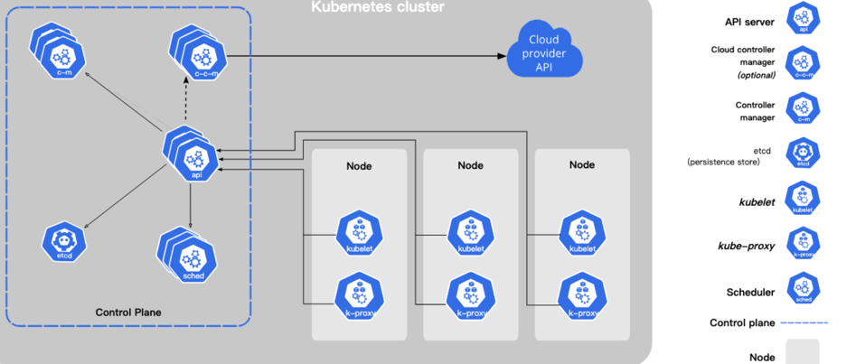
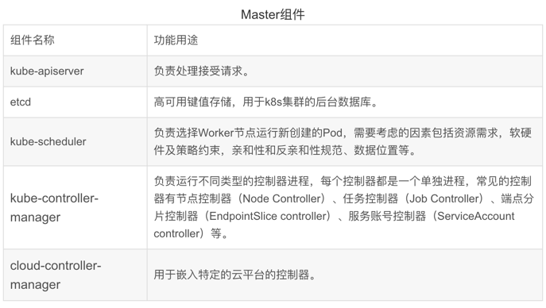
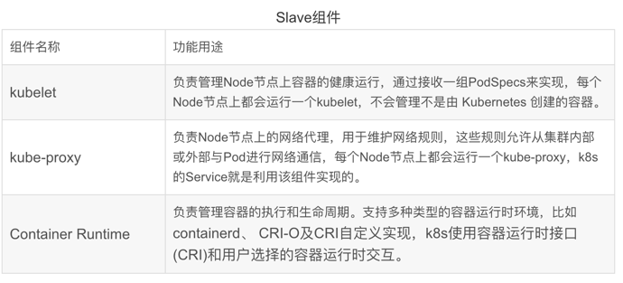
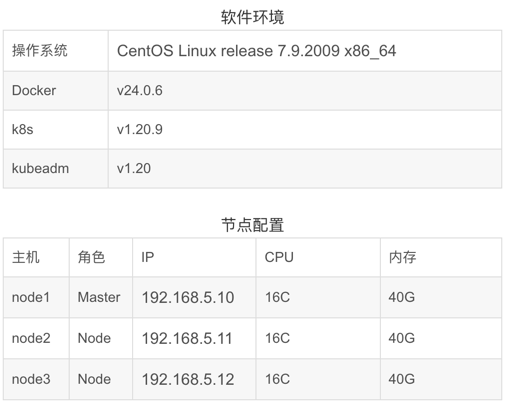
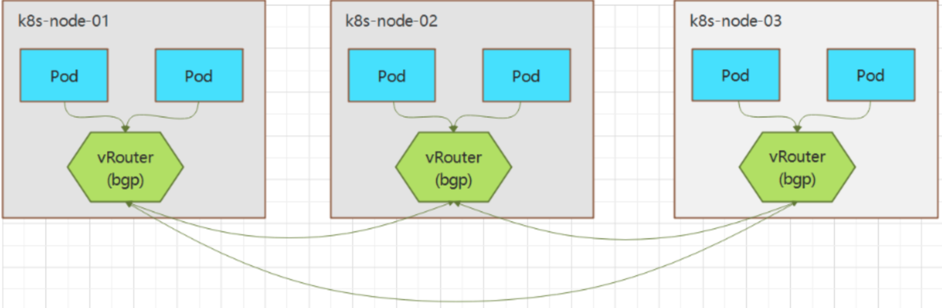
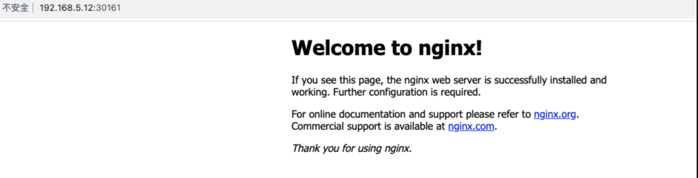
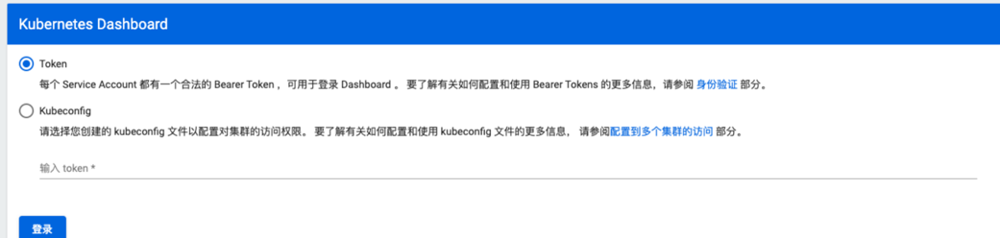
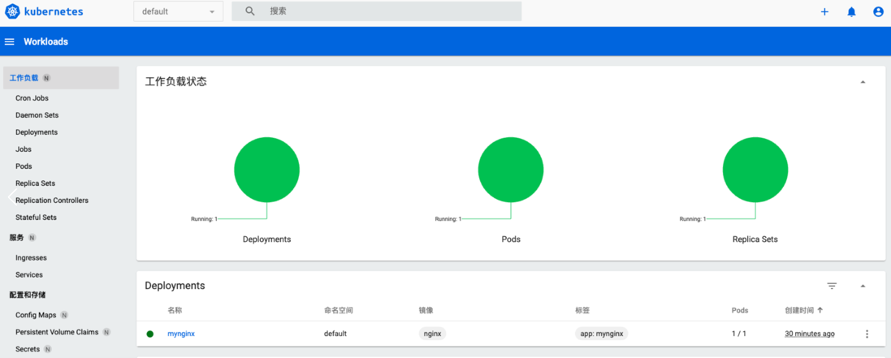

## 一、Kubernetes简介

Kubernetes中文官网：[Kubernetes](https://kubernetes.io/zh/)

GitHub：github.com/kubernetes/kubernetes

Kubernetes简称为K8s，是用于自动部署、扩缩和管理容器化应用程序的开源系统，起源于Google 集群管理工具Borg。

Kubernetes集群组件逻辑图


k8s集群属于Master-Slave主从架构，Master节点负责集群管理和资源调度，用于运行控制平面组件(Control Plane Components)，Slave节点就是工作负载节点，一般称为Node节点，也叫Worker节点，主要负责运行Pod，一个Pod里可以同时运行多个容器，而容器一般封装的就是基于Dokcer打包的应用，Pod英文叫豌豆荚，每个容器就像是一颗豌豆，简单来说Pod就是一组容器。

Master节点组件及功能
 

Slave节点组件及功能



安装部署

生产环境部署k8s主要有两种方式：

二进制包

Github下载稳定版的二进制包，手动部署每个组件组成k8s集群。

kubeadm工具

使用Kubeadm工具可以快速搭建一个k8s集群，主要包括初始化控制平面节点和加入Worker节点，提供的主要功能如下：

* kubeadm init：初始化一个Master节点
* kubeadm join：将Worker节点加入集群
* kubeadm upgrade：升级K8s版本
* kubeadm token：管理 kubeadm join 使用的令牌
* kubeadm reset：清空 kubeadm init 或者 kubeadm join 对主机所做的任何更改
* kubeadm version：打印 kubeadm 版本
* kubeadm alpha：预览可用的新功能

## 二、准备工作

软硬件要求
* Linux操作系统，Ubuntu 或 CentOS
* 每台节点至少2G
* Master节点至少2C
* 集群节点网络互通

集群规划



 环境配置

修改hosts配置

配置所有节点的IP和域名映射
```java
# vim /etc/hosts
192.168.5.10 node1
192.168.5.11 node2
192.168.5.12 node3
```

配置SSH免密登录

先生成公钥对，再把公钥远程复制到所有节点。
```java
[root@node1 ~]# ssh-keygen
[root@node1 ~]# ssh-copy-id node1
[root@node1 ~]# ssh-copy-id node2
[root@node1 ~]# ssh-copy-id node3
[root@node1 ~]# ssh node2
Last login: Mon Oct  2 17:18:39 2023 from 192.168.5.117
 
```

关闭Swap分区

kubelet要求必须禁用交换分区，所以kubeadm初始化时回检测swap是否关闭，如果没有关闭会报错，如果不想关闭安装时命令行可以指定-ignore-preflight-errors=Swap，关闭Swap分区在所有节点上执行如下命令:
```java
# 临时关闭，重启恢复
[root@node1 ~]# swapoff -a
# 永久关闭
echo vm.swappiness = 0 >> /etc/sysctl.conf
[root@node1 ~]# sysctl -p
[root@node1 ~]# cat /etc/fstab
/dev/mapper/centos-swap swap                    swap    defaults        0 0
```

禁用SELinux

所有节点执行如下命令：
```java
[root@node1 ~]# sed -i 's/SELINUX=enforcing/SELINUX=disabled/' /etc/sysconfig/selinux
```


关闭防火墙

所有节点执行如下命令：
```java
[root@node1 ~]# systemctl disable firewalld
[root@node1 ~]# systemctl stop firewalld
```

修改内核参数

```java
 
[root@node1 ~]# modprobe br_netfilter
[root@node1 ~]# echo "modprobe br_netfilter" >> /etc/profile
[root@node1 ~]# tee /etc/sysctl.d/k8s.conf << EOF
net.bridge.bridge-nf-call-ip6tables = 1
net.bridge.bridge-nf-call-iptables = 1
EOF
# 重新加载配置
[root@node1 ~]# sysctl -p /etc/sysctl.d/k8s.conf
```

配置集群时钟同步

Centos7默认使用Chrony工具而非NTP进行时间同步，修改硬件时钟为UTC，时区为本地时区，所有节点执行如下修改：
```java
# 硬件时钟设置为UTC
timedatectl set-local-rtc 0
# 设置本地时区，显示本地时间
timedatectl set-timezone Asia/Shanghai
# 手动加载RTC设置
hwclock --systohc
# 验证
[root@node1 ~]# timedatectl
      Local time: Tue 2023-10-03 11:26:44 CST
  Universal time: Tue 2023-10-03 03:26:44 UTC
        RTC time: Tue 2023-10-03 03:26:44
       Time zone: Asia/Shanghai (CST, +0800)
     NTP enabled: yes
NTP synchronized: yes
 RTC in local TZ: no
      DST active: n/a
```

配置k8s的Yum源

国外yum源因为网络问题下载比较慢，此处修改为国内aliyun，用于安装k8s各个组件。
```java
[root@node1 ~]# cat  /etc/yum.repos.d/kubernetes.repo
[kubernetes]
name=Kubernetes
baseurl=https://mirrors.aliyun.com/kubernetes/yum/repos/kubernetes-el7-x86_64/
enabled=1
gpgcheck=0
```

## 三、安装Docker

k8s运行需要容器运行环境，每个节点都需要安装Docker

## 四、安装K8S集群

安装三大组件-kubeadm、kubelet、kubectl
* kubeadm：用来初始化k8s集群的指令。
* kubelet：在集群的每个节点上用来启动 Pod 和容器等。
* kubectl：用来与k8s集群通信的命令行工具，查看、创建、更新和删除各种资源。

```java
# 所有节点都安装
[root@node1 ~]# yum install -y kubelet-1.20.9 kubeadm-1.20.9 kubectl-1.20.9
# 所有节点设置开机启动
[root@node1 ~]# systemctl enable kubelet
```

初始化k8s集群
* apiserver-advertise-address：apiserver监听地址
* control-plane-endpoint：控制平面的IP地址或DNS名称
* image-repository：镜像仓库，此处为国内阿里云镜像仓库加速下载
* service-cidr：为Service分配的IP地址段
* pod-network-cidr：为pod分配的IP地址段

```sql
# 所有节点添加
echo "192.168.5.10  cluster-endpoint" >> /etc/hosts
# 只在主节点执行
kubeadm init \
--apiserver-advertise-address=192.168.5.10 \
--control-plane-endpoint=cluster-endpoint \
--image-repository  registry.cn-hangzhou.aliyuncs.com/google_containers \
--kubernetes-version v1.20.9 \
--service-cidr=10.96.0.0/12 \
--pod-network-cidr=172.20.0.0/16
```

初始化需要下载多个镜像，可能时间比较久，最终安装的镜像如下：
```java
[root@node1 ~]# docker images
REPOSITORY                                                                    TAG        IMAGE ID       CREATED         SIZE
registry.cn-hangzhou.aliyuncs.com/google_containers/kube-proxy                v1.20.9    8dbf9a6aa186   2 years ago     99.7MB
registry.cn-hangzhou.aliyuncs.com/google_containers/kube-controller-manager   v1.20.9    eb07fd4ad3b4   2 years ago     116MB
registry.cn-hangzhou.aliyuncs.com/google_containers/kube-apiserver            v1.20.9    0d0d57e4f64c   2 years ago     122MB
registry.cn-hangzhou.aliyuncs.com/google_containers/kube-scheduler            v1.20.9    295014c114b3   2 years ago     47.3MB
registry.cn-hangzhou.aliyuncs.com/google_containers/etcd                      3.4.13-0   0369cf4303ff   3 years ago     253MB
registry.cn-hangzhou.aliyuncs.com/google_containers/coredns                   1.7.0      bfe3a36ebd25   3 years ago     45.2MB
registry.cn-hangzhou.aliyuncs.com/google_containers/pause                     3.2        80d28bedfe5d   3 years ago     683kB
```
成功界面：
```sql
Your Kubernetes control-plane has initialized successfully!
 
To start using your cluster, you need to run the following as a regular user:
 
  mkdir -p $HOME/.kube
  sudo cp -i /etc/kubernetes/admin.conf $HOME/.kube/config
  sudo chown $(id -u):$(id -g) $HOME/.kube/config
 
Alternatively, if you are the root user, you can run:
 
  export KUBECONFIG=/etc/kubernetes/admin.conf
 
You should now deploy a pod network to the cluster.
Run "kubectl apply -f [podnetwork].yaml" with one of the options listed at:
  https://kubernetes.io/docs/concepts/cluster-administration/addons/
 
Then you can join any number of worker nodes by running the following on each as root:
 
kubeadm join 192.168.5.10:6443 --token kdy4ka.jz5otwd1l3l2of5v --discovery-token-ca-cert-hash sha256:d40fe1c0af2bef8143106d27d418a4b7026f1f79a6dfe30cb4691d35755719ad
```

要使非root用户运行kubectl，请执行以下命令，这也是上面kubeadm init输出的一部分：
```sql
mkdir -p $HOME/.kube
sudo cp -i /etc/kubernetes/admin.conf $HOME/.kube/config
sudo chown $(id -u):$(id -g) $HOME/.kube/config
```

如果是root用户，则可以执行以下命令：
```java
export KUBECONFIG=/etc/kubernetes/admin.conf

```

记住上面输出的kubeadm join命令，下面用该命令将节点加入集群。

加入节点

所有Node节点执行如下命令：
```java
kubeadm join 192.168.5.10:6443 --token kdy4ka.jz5otwd1l3l2of5v --discovery-token-ca-cert-hash sha256:d40fe1c0af2bef8143106d27d418a4b7026f1f79a6dfe30cb4691d35755719ad
```

查看token列表，可观察到每个token的剩余有效时间
```java
[root@node1 ~]# kubeadm token list
TOKEN                     TTL         EXPIRES                     USAGES                   DESCRIPTION                                                EXTRA GROUPS
kdy4ka.jz5otwd1l3l2of5v   7h          2023-10-03T19:46:32+08:00   authentication,signing   The default bootstrap token generated by 'kubeadm init'.   system:bootstrappers:kubeadm:default-node-token
```

默认token有效期为24小时，过期之后token失效，可重新生成token：
```java
kubeadm token create --print-join-command
```
修改角色：
```java
# node节点执行
[root@node1 ~]# kubectl label node node2 node-role.kubernetes.io/worker=worker
# master节点执行
[root@node1 ~]# kubectl get nodes
NAME    STATUS   ROLES                  AGE   VERSION
node1   Ready    control-plane,master   16h   v1.20.9
node2   Ready    worker                 15h   v1.20.9
node3   Ready    worker                 15h   v1.20.9
 
```


安装网络插件

Calico是一套开源的纯三层的虚拟化网络解决方案，是目前K8s主流的网络方案。它把每个节点都作为一个虚拟路由器，把Pod当做路由器上一个终端设备为其分配一个IP地址，通过BGP协议生成路由规则，实现不同节点上的Pod网络互通。


```java
# 下载calico.yaml并保存到本地
[root@node1 ~]# curl https://docs.projectcalico.org/v3.15/manifests/calico.yaml -O
修改配置
3888行             - name: CALICO_IPV4POOL_CIDR
3889行               value: "172.20.0.0/16"
# 提交
[root@node1 ~]# kubectl apply -f calico.yaml
# 验证是否成功
[root@node1 ~]# kubectl get pod -A | grep calico
kube-system            calico-kube-controllers-577f77cb5c-s6zfl     1/1     Running   0          15h
kube-system            calico-node-7gsfr                            1/1     Running   0          15h
kube-system            calico-node-hb2k8                            1/1     Running   0          15h
kube-system            calico-node-xt4bl                            1/1     Running   0          15h
```

## 五、测试K8S集群

创建nginx pod

默认会在默认命名空间default中创建一个名称为mynignx的deployment，同时会创建一个名称以myniginx为前缀，叫mynginx-5b686ccd46-wshz6的Pod。
```java
[root@node1 ~]# kubectl create deployment mynginx --image=nginx
deployment.apps/mynginx created
# 查看pod
[root@node1 ~]# kubectl get pod,svc
NAME                           READY   STATUS    RESTARTS   AGE
pod/mynginx-5b686ccd46-wshz6   1/1     Running   0          39s
 
NAME                 TYPE        CLUSTER-IP   EXTERNAL-IP   PORT(S)   AGE
service/kubernetes   ClusterIP   10.96.0.1    <none>        443/TCP   17h
```

对外暴露访问

基于第一步创建的deployment再创建一个名叫mynginx的Service，资源类型由--type=ClusterIP修改为--type=NodePort，会在每个Node节点上监听30161端口，用于接收集群外部访问。
```java
[root@node1 ~]# kubectl expose deployment mynginx --port=80 --type=NodePort
service/mynginx exposed
# 查看
[root@node1 ~]# kubectl get pod,svc
NAME                           READY   STATUS    RESTARTS   AGE
pod/mynginx-5b686ccd46-wshz6   1/1     Running   0          5m24s
 
NAME                 TYPE        CLUSTER-IP     EXTERNAL-IP   PORT(S)        AGE
service/kubernetes   ClusterIP   10.96.0.1      <none>        443/TCP        17h
service/mynginx      NodePort    10.105.55.49   <none>        80:30161/TCP   50s
```

访问nginx
```sql
浏览器输入<任意一个节点IP>:<port>，都可以访问nginx首页表示测试成功。
```




## 六、安装Dashboard

k8s官方提供了一个简单的Dashboard，主要提供工作负载，服务，配置和存储，集群等管理功能。

Github：github.com/kubernetes/dashboard

通过kubectl命令安装
```sql
kubectl apply -f https://raw.githubusercontent.com/kubernetes/dashboard/v2.3.1/aio/deploy/recommended.yaml
```
对外暴露访问端口，由--type=ClusterIP修改为--type=NodePort
```sql
kubectl edit svc kubernetes-dashboard -n kubernetes-dashboard
```
查看service
```sql
[root@node1 ~]# kubectl get svc -A|grep dashboard
kubernetes-dashboard   dashboard-metrics-scraper   ClusterIP   10.102.247.36   <none>        8000/TCP                 16h
kubernetes-dashboard   kubernetes-dashboard        NodePort    10.96.38.129    <none>        443:31128/TCP            16h
```

浏览器输入访问地址：https://192.168.5.10:31128/，需要token才能访问。



创建访问账号
```java
[root@node1 ~]# vim dashboard-token.yaml
apiVersion: v1
kind: ServiceAccount
metadata:
  name: admin-user
  namespace: kubernetes-dashboard
---
 
apiVersion: rbac.authorization.k8s.io/v1beta1
kind: ClusterRoleBinding
metadata:
  name: admin-user
roleRef:
  apiGroup: rbac.authorization.k8s.io
  kind: ClusterRole
  name: cluster-admin
subjects:
- kind: ServiceAccount
  name: admin-user
  namespace: kubernetes-dashboard
[root@node1 ~]# kubectl apply -f dashboard-token.yaml
serviceaccount/admin-user created
 
```


获取token
```java
[root@node1 ~]# kubectl get secret -n kubernetes-dashboard
NAME                               TYPE                                  DATA   AGE
admin-user-token-vfj8s             kubernetes.io/service-account-token   3      10s
default-token-w8jgn                kubernetes.io/service-account-token   3      15m
kubernetes-dashboard-certs         Opaque                                0      15m
kubernetes-dashboard-csrf          Opaque                                1      15m
kubernetes-dashboard-key-holder    Opaque                                2      15m
kubernetes-dashboard-token-xjt6l   kubernetes.io/service-account-token   3      15m
# 查看名为admin-user-token-vfj8s的secret
[root@node1 ~]# kubectl describe secret admin-user-token-vfj8s -n kubernetes-dashboard
Name:         admin-user-token-vfj8s
Namespace:    kubernetes-dashboard
Labels:       <none>
Annotations:  kubernetes.io/service-account.name: admin-user
              kubernetes.io/service-account.uid: 36b4e5f5-2f46-488d-960c-899cb4309d50
 
Type:  kubernetes.io/service-account-token
 
Data
====
ca.crt:     1066 bytes
namespace:  20 bytes
token:      eyJhbGciOiJSUzI1NiIsImtpZCI6IkhMMXFCMGVaVHVrV0hHampTRExxdHlMcjBvTVlXRHd0Vl9hc29lSXU0TG8ifQ.eyJpc3MiOiJrdWJlcm5ldGVzL3NlcnZpY2VhY2NvdW50Iiwia3ViZXJuZXRlcy5pby9zZXJ2aWNlYWNjb3VudC9uYW1lc3BhY2UiOiJrdWJlcm5ldGVzLWRhc2hib2FyZCIsImt1YmVybmV0ZXMuaW8vc2VydmljZWFjY291bnQvc2VjcmV0Lm5hbWUiOiJhZG1pbi11c2VyLXRva2VuLXZmajhzIiwia3ViZXJuZXRlcy5pby9zZXJ2aWNlYWNjb3VudC9zZXJ2aWNlLWFjY291bnQubmFtZSI6ImFkbWluLXVzZXIiLCJrdWJlcm5ldGVzLmlvL3NlcnZpY2VhY2NvdW50L3NlcnZpY2UtYWNjb3VudC51aWQiOiIzNmI0ZTVmNS0yZjQ2LTQ4OGQtOTYwYy04OTljYjQzMDlkNTAiLCJzdWIiOiJzeXN0ZW06c2VydmljZWFjY291bnQ6a3ViZXJuZXRlcy1kYXNoYm9hcmQ6YWRtaW4tdXNlciJ9.ZoE_jz20Jf3ImLl9BwTmk5VM7Y_VacRI3ZaTbaD8ipdsDV7CCBjE9edrVtQ-L86HOU0Qb_SA3HHqO0wtGagfAVHahHJaNLcr-MAOURWmIyLg8A2K07OT_5Qr9BJC-xxFym25sOc04Cyj-Z86-LsECSbIKLhUwsxXSzAQKuPmD471MMO-_JL-FWAJ-3jdZ8E4uAMD-mhJrKyORqMgoRxPJXPgwkzd2PRPrHoiaunbxiGo6qWhONGiMITjfCW77or32TbPIDuxy94j64tWvJyVDbmyGq1J0WeOzjfobdnbyM6BRGdjP86F_P-DyTXWSfOJHbAVYcgpDcqYO_DImtg8_g
```

登录界面

输入上面的token，进入dashboard首页




