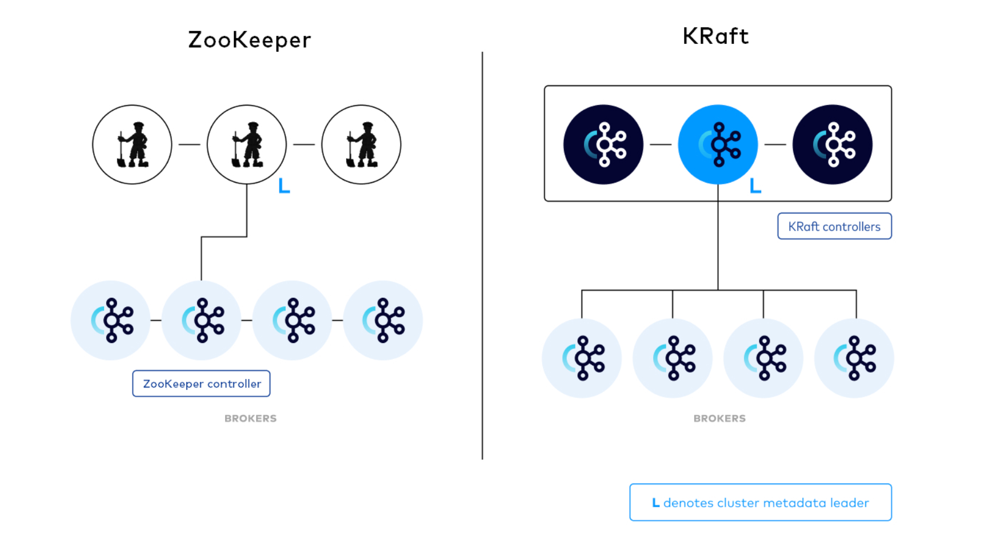
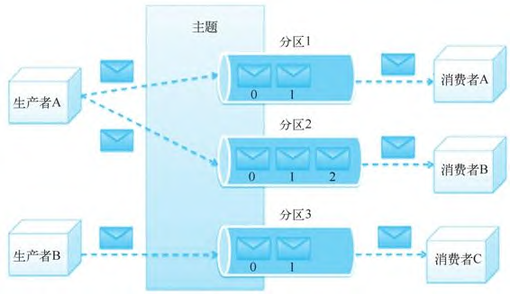
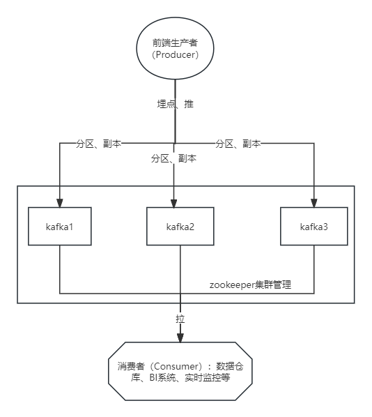
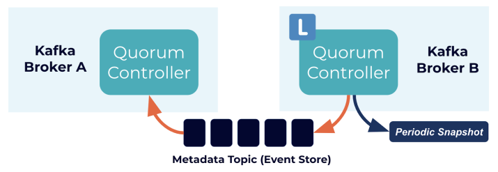
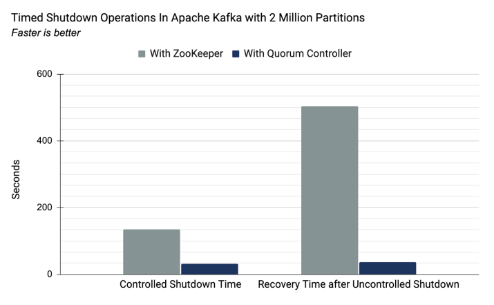
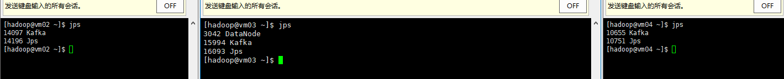
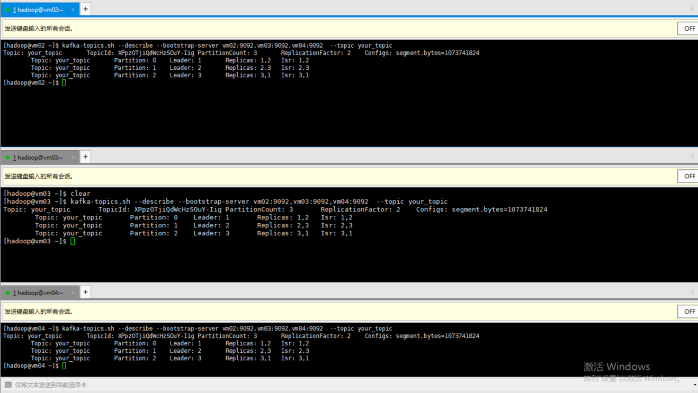
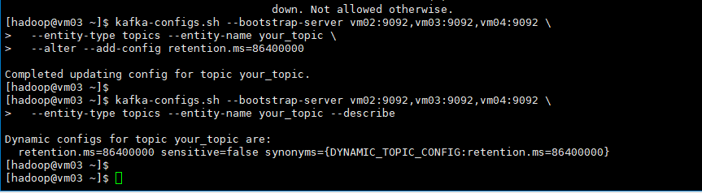
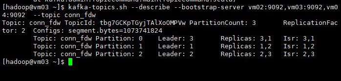

## 简介

在大数据领域开发者常常会听到MQ这个术语，该术语便是消息队列的意思，  
Kafka是分布式的发布—订阅消息系统。它最初由LinkedIn(领英)公司发布，使用Scala语言编写，与2010年12月份开源，成为Apache的顶级项目。Kafka是一个高吞吐量的、持久性的、分布式发布订阅消息系统。它主要用于处理活跃的数据(登录、浏览、点击、分享、喜欢等用户行为产生的数据)。

### 1.消息 Message

网络中的两台计算机或者两个通讯设备之间传递的数据。例如说：文本、音乐、视频等内容。

### 2.队列 Queue(栈的特点FILO 队列FIFO)

一种特殊的线性表（数据元素首尾相接），特殊之处在于只允许在首部删除元素和在尾部追加元素。入队、出队

### 3.消息队列 MQ

消息+队列，保存消息的队列。消息的传输过程中的容器；主要提供生产、消费接口供外部调用做数据的存储和获取。

## 消息队列分类

MQ主要分为两类：点对点(p2p)、发布订阅(Pub/Sub)

### 1.共同点

消息生产者生产消息发送到queue中，然后消息消费者从queue中读取并且消费消息。

### 2.不同点

p2p模型包括：消息队列(Queue)、发送者(Sender)、接收者(Receiver) ，一个生产者生产的消息只有一个消费者(Consumer)(即一旦被消费，消息就不在消息队列中)。比如说打电话。

Pub/Sub包含：消息队列(Queue)、主题(Topic)、发布者(Publisher)、订阅者(Subscriber)每个消息可以有多个消费者，彼此互不影响。比如我发布一个微博：关注我的人都能够看到。

## Kafka的特点

Kafka如此受欢迎，而且有越来越多的系统支持与Kafka的集成，主要由于Kafka具有如下特性。  
● 高吞吐量、低延迟：Kafka每秒可以处理几十万条消息，它的延迟最低只有几毫秒。  
● 可扩展性：Kafka集群同Hadoop集群一样，支持横向扩展。  
● 持久性、可靠性：Kafka消息可以被持久化到本地磁盘，并且支持Partition数据备份，防止数据丢失。  
● 容错性：允许Kafka集群中的节点失败，如果Partition（分区）副本数量为n，则最多允许n-1个节点失败。  
● 高并发：单节点支持上千个客户端同时读写，每秒钟有上百MB的吞吐量，基本上达到了网卡的极限

## Kafka组成

1. Topic：主题，Kafka处理的消息的不同分类。
2. Broker：消息代理，Kafka集群中的一个kafka服务节点称为一个broker，主要存储消息数据。存在硬盘中每个topic都是有分区的。
3. Partition：Topic物理上的分组，一个topic在broker中被分为1个或者多个partition，分区在创建topic的时候指定。
4. Replica：数据副本，可以为保存在Kafka中的数据指定副本数，以提高数据冗余性，防止数据丢失；
5. Message：消息，是通信的基本单位，每个消息都属于一个partition

### Kafka服务相关

1. Producer：消息和数据的生产者，向Kafka的一个topic发布消息。
2. Consumer：消息和数据的消费者，定于topic并处理其发布的消息。
3. Zookeeper：协调kafka的正常运行。
4. KRaft：Kafka的KRaft模式在2.8.0版本中被引入。从2.8.0版本开始，Kafka提供了对KRaft的支持，其中最大的变化之一就是不再依赖外部的ZooKeeper来管理Kafka的元数据。因此，如果你使用2.8.0版本或更高版本的Kafka，你将能够使用KRaft模式，无需安装和配置ZooKeeper。


### Kafka架构设计

一个典型的Kafka集群包含若干个生产者（Producer）、若干Kafka集群节点（Broker）、若干消费者（Consumer）以及一个Zookeeper集群或者KRaft模式。Kafka通过Zookeeper管理集群配置，选举Leader以及在消费者发生变化时进行负载均衡。生产者使用推（Push）模式将消息发布到集群节点，而消费者使用拉（Pull）模式从集群节点中订阅并消费消息。

### 主题和分区的具体定义如下。

● 主题是生产者发布到Kafka集群的每条信息所属的类别，即Kafka是面向主题的，一个主题可以分布在多个节点上。  
● 分区是Kafka集群横向扩展和一切并行化的基础，每个Topic可以被切分为一个或多个分区。一个分区只对应一个集群节点，每个分区内部的消息是强有序的。  
● Offset（即偏移量）是消息在分区中的编号，每个分区中的编号是独立的。


## Kafka分布式集群的构建

在kafka2.0版本以前是依赖于zookeeper集群中安装  
·|| Kafka使用Zookeeper作为其分布式协调框架，能很好地将消息生产、消息存储、消息消费的过程结合在一起。同时借助Zookeeper,Kafka能够将生产者、消费者和集群节点在内的所有组件，在无状态的情况下建立起生产者和消费者的订阅关系，并实现生产者与消费者的负载均衡。  
可以看出Kafka集群依赖于Zookeeper，所以在安装Kafka之前需要提前安装Zookeeper。Zookeeper集群在前面Hadoop集群的构建过程中已经在使用，Kafka可以共用之前安装的Zookeeper集群，接下来只需要安装Kafka集群即可。


·|| 较新版本的 Apache Kafka（从2.8.0版本开始）引入了KRaft，这是一个内置的分布式存储 系统，用于管理Kafka的元数据信息，不再需要依赖外部的 ZooKeeper。因此，你在使用较新版本的Kafka时，不再需要单独安装和配置 ZooKeeper。  
在KRaft模式下，Kafka内部有自己的元数据存储，这消除了对外部 ZooKeeper 的依赖。这样做的目的是简化 Kafka 集群的维护和部署，以及提高可用性。

在基于zookeeper和kraft两种集群管理机制下，200万分区数据量下的耗时比较。基于自带的KRaft，性能表现会更优。


### 基于KRaft下的kafka安装

解压压缩包

```
tar -zxvf kafka_2.12-3.6.0.tgz -C kafka
```

编辑环境变量

```
export KAFKA_HOME=/home/hadoop/kafka/kafka_2.12-3.6.0
export PATH=$KAFKA_HOME/bin:PATH

```

编辑配置文件server.properties  
文件所在路径${KAFKA_HOME}/config/kraft/server.properties  
该文件中几个重点参数

```
process.roles=broker,controller ##broker相当于从节点，controller相当于主节点
node.id=2 ##节点ID 每个节点必须唯一
controller.quorum.voters=1@vm02:9093,2@vm03:9093,3@vm04:9093
##参与主节点选举，格式(node.id)@(hostname):(port)
advertised.listeners=PLAINTEXT://hostname:9092 ##对外服务地址，消费者、生产者对该节点的访问
```

生成集群ID

```
kafka-storage.sh random-uuid
6foHn9NLQpiMAirIK7EG4A
##生成6foHn9NLQpiMAirIK7EG4A 的uuid
```

所有节点执行，kafka初始化

```
kafka-storage.sh format -t 6foHn9NLQpiMAirIK7EG4A -c ./$KAFKA_HOME/config/kraft/server.properties

```

所有节点执行，启动kafka

```
kafka-server-start.sh -daemon $KAFKA_HOME/config/kraft/server.properties

```

查看kafka进程

```
jps 

```


## 使用示例

### 创建topic

```
kafka-topics.sh --create --topic your_topic --bootstrap-server vm02:9092,vm03:9092,vm04:9092 --partitions 3 --replication-factor 2
```

注： --bootstrap-server vm02:9092,vm03:9092,vm04:9092 此处参数可以指定集群所有节点，也可以指定localhost:9092,创建的主题并不意味着后期的消费者和生产者只能指定在 localhost 节点上。这里的 --bootstrap-server 参数在创建主题时主要是为了指定初始的 Kafka 节点，它告诉 Kafka 工具在哪里查找集群的元数据。

后期的消费者和生产者在连接到 Kafka 集群时，会从指定的初始节点获取集群的元数据，然后与整个集群建立连接。一旦获取了元数据，消费者和生产者就可以与整个 Kafka 集群进行通信，而不仅仅限制在初始指定的节点上。因此，使用 --bootstrap-server localhost:9092 创建的主题对于后期的消费者和生产者，仍然可以在整个 Kafka 集群的任何节点上进行使用，只要它们能够连接到集群并获取到正确的元数据信息。

### 查看已创建的topic的详细信息

```
kafka-topics.sh --describe --bootstrap-server vm02:9092,vm03:9092,vm04:9092  --topic your_topic
```



### 修改已创建topic

在官方对于alter参数的解释中，

```
--alter                                  Alter the number of partitions and     
                                           replica assignment. Update the       
                                           configuration of an existing topic   
                                           via --alter is no longer supported   
                                           here (the kafka-configs CLI supports 
                                           altering topic configs with a --     
                                           bootstrap-server option).  

```

kafka-topics.sh --alter选项在最新版本中已不再支持更新现有主题的配置，这意味着一旦主题被创建，就不能使用–alter选项来更改其分区数和副本分配。可以通过使用kafka-configs.sh

#### 修改主题的配置参数。

```
kafka-configs.sh --bootstrap-server vm02:9092,vm03:9092,vm04:9092 \
--entity-type topics --entity-name your_topic \
--alter --add-config retention.ms=86400000

```

#### 查看topic 定义相关参数信息。

```
kafka-configs.sh --bootstrap-server \
vm02:9092,vm03:9092,vm04:9092 \
--entity-type topics --entity-name your_topic --describe


```


#### 删除已创建topic

```
kafka-topics.sh --delete --topic your_topic --bootstrap-server vm02:9092,vm03:9092,vm04:9092 
```

#### 创建生产者producer

```
kafka-console-producer.sh --broker-list 192.168.56.101:9092 --topic mrt

```

## 场景应用示例

以postgresql数据库中的public.conn_fdw表作为生产者producer身份把数据推向kafka，然后在使用kafka把数据推推向消费者数据库Oracle

### 在postgresql数据库中创建测试数据表，

```
CREATE TABLE public.conn_fdw (
	id int4 NULL,
	"name" varchar(50) NULL,
	age int4 NULL,
	city varchar(50) NULL,
	salary int4 NULL
);

```

### 在Oracle中创建同样的表结构

```
create table SYSTEM.CONN_FDW
(
  id     NUMBER,
  name   VARCHAR2(50),
  age    NUMBER,
  city   VARCHAR2(50),
  salary NUMBER,
  load_time timestamp default current_timestamp
);

```

#### 创建主题conn_fdw

```
kafka-topics.sh --create --topic conn_fdw \
--bootstrap-server vm02:9092,vm03:9092,vm04:9092 \
--partitions 3 \
--replication-factor 2

```

#### 查看已经创建的主题conn_fdw

```
kafka-topics.sh --describe \
--bootstrap-server vm02:9092,vm03:9092,vm04:9092  \
--topic conn_fdw

```

在此图中有

### 添加maven依赖

添加相应的依赖包，以作为java代码class的支持

```
    <dependency>
      <groupId>org.apache.kafka</groupId>
      <artifactId>kafka_2.12</artifactId>
      <version>2.3.0</version>
    </dependency>
    <dependency>
      <groupId>org.postgresql</groupId>
      <artifactId>postgresql</artifactId>
      <version>42.2.23</version> <!-- 使用你的 PostgreSQL 版本 -->
    </dependency>
    <dependency>
      <groupId>ch.qos.logback</groupId>
      <artifactId>logback-classic</artifactId>
      <version>1.2.3</version> <!-- 请使用最新版本 -->
    </dependency>
    <dependency>
      <groupId>com.oracle.database.jdbc</groupId>
      <artifactId>ojdbc10</artifactId> <!-- 使用你的 Oracle JDBC 版本 -->
      <version>19.8.0.0</version>
    </dependency>

```

### Kafka生产者代码

```
import org.apache.kafka.clients.producer.KafkaProducer;
import org.apache.kafka.clients.producer.Producer;
import org.apache.kafka.clients.producer.ProducerConfig;
import org.apache.kafka.clients.producer.ProducerRecord;
import java.sql.Connection;
import java.sql.DriverManager;
import java.sql.ResultSet;
import java.sql.Statement;
import java.util.Properties;

public class PgKafkaProducer {

    public static void main(String[] args) {
        // Kafka 配置
        Properties props = new Properties();
        props.put(ProducerConfig.BOOTSTRAP_SERVERS_CONFIG, "10.0.0.102:9092,10.0.0.103:9092,10.0.0.104:9092");
        props.put(ProducerConfig.KEY_SERIALIZER_CLASS_CONFIG, "org.apache.kafka.common.serialization.StringSerializer");
        props.put(ProducerConfig.VALUE_SERIALIZER_CLASS_CONFIG, "org.apache.kafka.common.serialization.StringSerializer");

        // PostgreSQL 连接配置
        String jdbcUrl = "jdbc:postgresql://10.0.0.108:5432/postgres";
        String username = "postgres";
        String password = "postgres";

        try (Connection connection = DriverManager.getConnection(jdbcUrl, username, password);
             Statement statement = connection.createStatement()) {

            // 查询 PostgreSQL 数据
            String query = "SELECT id,name,age,city,salary FROM public.conn_fdw";
            ResultSet resultSet = statement.executeQuery(query);

            // Kafka 生产者
            try (Producer<String, String> producer = new KafkaProducer<>(props)) {
                while (resultSet.next()) {
                    // 将每一行数据作为消息发送到 Kafka 主题
                    String key = String.valueOf(resultSet.getInt("id"));
                    String value = resultSet.getString("name") + "," +
                            resultSet.getInt("age") + "," +
                            resultSet.getString("city") + "," +
                            resultSet.getInt("salary");

                    ProducerRecord<String, String> record = new ProducerRecord<>("conn_fdw", key, value);
                    producer.send(record);
                }
            }

        } catch (Exception e) {
            e.printStackTrace();
        }
    }
}

```

### 消费者代码

```
import org.apache.kafka.clients.consumer.Consumer;
import org.apache.kafka.clients.consumer.ConsumerConfig;
import org.apache.kafka.clients.consumer.ConsumerRecords;
import org.apache.kafka.clients.consumer.KafkaConsumer;
import java.sql.Connection;
import java.sql.DriverManager;
import java.sql.PreparedStatement;
import java.util.Collections;
import java.util.Properties;

public class KafkaToOracleConsumer {

    public static void main(String[] args) {
        // Kafka 配置
        Properties kafkaProps = new Properties();
        kafkaProps.put(ConsumerConfig.BOOTSTRAP_SERVERS_CONFIG, "10.0.0.102:9092,10.0.0.103:9092,10.0.0.104:9092");
        kafkaProps.put(ConsumerConfig.GROUP_ID_CONFIG, "conn_fdw_groupid");
        kafkaProps.put(ConsumerConfig.KEY_DESERIALIZER_CLASS_CONFIG, "org.apache.kafka.common.serialization.StringDeserializer");
        kafkaProps.put(ConsumerConfig.VALUE_DESERIALIZER_CLASS_CONFIG, "org.apache.kafka.common.serialization.StringDeserializer");

        // Oracle 连接配置
        String jdbcUrl = "jdbc:oracle:thin:@192.168.48.1:1521:orcl";
        String username = "system";
        String password = "system";

        try (Connection connection = DriverManager.getConnection(jdbcUrl, username, password);
             PreparedStatement preparedStatement = connection.prepareStatement(
                     "INSERT INTO SYSTEM.CONN_FDW (id, name, age, city, salary) VALUES (?, ?, ?, ?, ?)")) {

            // Kafka 消费者
            try (Consumer<String, String> consumer = new KafkaConsumer<>(kafkaProps)) {
                consumer.subscribe(Collections.singletonList("conn_fdw"));

                while (true) {
                    ConsumerRecords<String, String> records = consumer.poll(100);

                    records.forEach(record -> {
                        // 解析 Kafka 消息
                        String[] values = record.value().split(",");
                        int id = Integer.parseInt(values[0]);
                        String name = values[1];
                        int age = Integer.parseInt(values[2]);
                        String city = values[3];
                        int salary = Integer.parseInt(values[4]);

                        // 插入到 Oracle 数据库
                        try {
                            preparedStatement.setInt(1, id);
                            preparedStatement.setString(2, name);
                            preparedStatement.setInt(3, age);
                            preparedStatement.setString(4, city);
                            preparedStatement.setInt(5, salary);
                            preparedStatement.executeUpdate();
                        } catch (Exception e) {
                            e.printStackTrace();
                        }
                    });
                }
            }

        } catch (Exception e) {
            e.printStackTrace();
        }
    }
}

```

此时可以通过同时执行两段代码，在跑起来的过程中向生产者PG数据库插入以下数据库，然后到Oracle 数据库中观察数据流的流入情况。

```
INSERT INTO public.conn_fdw
(id, "name", age, city, salary)
VALUES(1, 'John', 30, 'New York', 50000);
INSERT INTO public.conn_fdw
(id, "name", age, city, salary)
VALUES(2, 'Alice', 25, 'Los Angeles', 60000);
INSERT INTO public.conn_fdw
(id, "name", age, city, salary)
VALUES(3, 'Bob', 35, 'Chicago', 70000);
INSERT INTO public.conn_fdw
(id, "name", age, city, salary)
VALUES(4, 'Eva', 28, 'San Francisco', 55000);
INSERT INTO public.conn_fdw
(id, "name", age, city, salary)
VALUES(5, 'Mike', 32, 'Seattle', 65000);
INSERT INTO public.conn_fdw
(id, "name", age, city, salary)
VALUES(6, 'Sophia', 29, 'Boston', 75000);
INSERT INTO public.conn_fdw
(id, "name", age, city, salary)
VALUES(7, 'David', 27, 'Denver', 52000);
INSERT INTO public.conn_fdw
(id, "name", age, city, salary)
VALUES(8, 'Emily', 31, 'Austin', 68000);
INSERT INTO public.conn_fdw
(id, "name", age, city, salary)
VALUES(9, 'Daniel', 26, 'Phoenix', 58000);
INSERT INTO public.conn_fdw
(id, "name", age, city, salary)
VALUES(10, 'Olivia', 33, 'Houston', 72000);
INSERT INTO public.conn_fdw
(id, "name", age, city, salary)
VALUES(11, 'Liam', 24, 'Portland', 49000);
INSERT INTO public.conn_fdw
(id, "name", age, city, salary)
VALUES(12, 'Ava', 34, 'Atlanta', 71000);
INSERT INTO public.conn_fdw
(id, "name", age, city, salary)
VALUES(13, 'Logan', 30, 'Miami', 62000);
INSERT INTO public.conn_fdw
(id, "name", age, city, salary)
VALUES(14, 'Mia', 28, 'Dallas', 54000);
INSERT INTO public.conn_fdw
(id, "name", age, city, salary)
VALUES(15, 'Jackson', 29, 'Minneapolis', 67000);
INSERT INTO public.conn_fdw
(id, "name", age, city, salary)
VALUES(16, 'Sophie', 31, 'Detroit', 59000);
INSERT INTO public.conn_fdw
(id, "name", age, city, salary)
VALUES(17, 'William', 27, 'Philadelphia', 70000);
INSERT INTO public.conn_fdw
(id, "name", age, city, salary)
VALUES(18, 'Emma', 32, 'San Diego', 66000);
INSERT INTO public.conn_fdw
(id, "name", age, city, salary)
VALUES(19, 'James', 26, 'Raleigh', 63000);
INSERT INTO public.conn_fdw
(id, "name", age, city, salary)
VALUES(20, 'Avery', 35, 'Tampa', 71000);
```