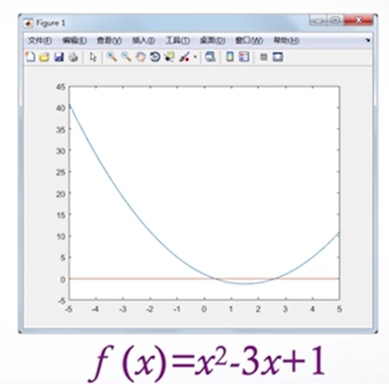
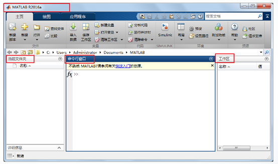
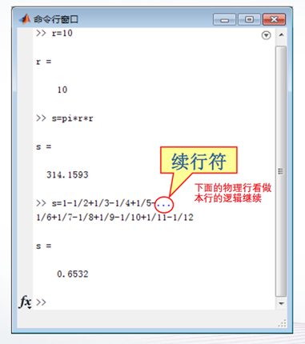
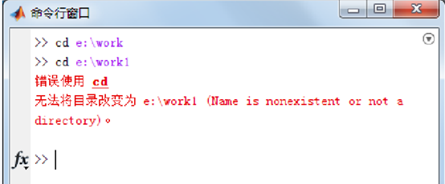
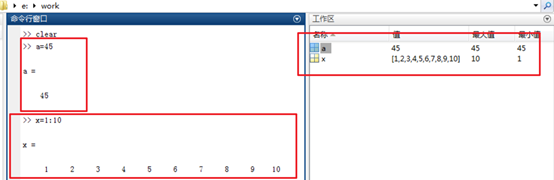

1、什么叫计算？

（1）算术运算。“计算”体现的是一种数学技能，这是人类的基本技能。

（2）较复杂的运算，即根据已知量算出未知量。

对于复杂的数值计算问题，可以利用计算机进行问题求解，即利用计算机**运算速度快、计算精度高的特点**，通过重复执行简单的操作，完成复杂的计算。

广义的理解：

“计算”体现的是问题求解的方法和手段。

“计算”是科学研究和工程应用的重要工具。

2、什么是科学计算？

利用计算机处理数值问题的方法，称为科学计算（ Scientific Computing）。

科学计算方法既有数学理论上的抽象性和严谨性，又有程序设计技术上的实用性和实验性。

3、科学计算与MATLAB语言的关系

科学计算的基本步骤是，先研究数值问题的求解算法，然后在计算机上进行程序实现。

MATLAB的优势：不需要过多了解各种数值计算方法的具体细节和计算公式，专注于实际问题的分析和设计，大大地提高工作效率和质量，

4、MATLAB语言的主要功能

MATLAB：MATrix LABoratory（矩阵实验室）

数值计算、符号计算、图形绘制、程序流程控制、工具箱等优势。

【例子】求x^2-3x+1=0的根。

方法一：利用MATLAB**多项式求根函数roots**来求根。

    p=[1,-3,1];   //建立多项式系数向量P  
    x=roots(p)
    
    绘图：  
    x=-5:0.1:5;  //产生x向量-5—5步长为0.1  
    y1=x.*x-3*x+1;  
    y2=zeros(size(x));  //产生一个和X向量同大小的0向量  
    plot(x, y1, x, y2); //绘制函数曲线

方法二 ： 利用**求单变量非线性方程根的函数fzero，**求方程在某个初始点附近的实根。

    f=@(x) x*x-3*x+1;  //匿名函数定义f（x）  
    x1=fzero(f, 0.5)    //f(x)=0在x=0.5附近的实根
    
    x2=fzero(f, 2.5)

方法三：利用**最优化工具箱中的方程求根函数fsolve。

    f=@(x) x*x-3*x+1;  
    x1=fsolve(f, 0.5, **optimset('Display', 'off')**)  //optimset用于设置优化参数  Display', 'off不显示迭代的中间结果
    
    x2=fsolve(f, 2.5, optimset('Display', 'off'))

方法四：利用**solve函数求方程的符号解，**即求得的解是一个表达式。

    syms x   //定义符号变量x  
    x=solve(x^2-3*x+1)   //求根
    
    x=eval(x)  //将符号解转换为数值解

MATLAB系统环境

需要掌握：

1. MATLAB系统环境熟知
2. MATLAB系统数值数据掌握
3. MATLAB矩阵表示及引用
4. MATLAB语言的基本运算

1. MATLAB操作界面的组成

（1）MATLAB主窗口

功能区（3个）、快速访问工具栏、当前文件夹工具栏

（2）命令行窗口

命令行窗口用于输入命令并显示命令的执行结果。

> > 命令提示符，可以接受并执行Matlab命令。

（3）当前文件夹窗口

运行时的工作文件夹。方便使用和建立。

如何设置当前文件夹呢？

（1）在当前文件夹工具栏或当前文件夹窗口中选择某文件夹为当前文件夹

（2）使用cd命令

注意：一定要先建立文件夹，再将这个文件夹设为当前文件夹。

（4）工作区窗口

工作区：也称工作空间，matlab用于存储各种变量和结果的内存空间。

工作区窗口：用于变量的显示与操作。也可以对变量进行编辑保存和删除等操作。

2. MATLAB的搜索路径
   

命令对象操作举例：

    >> clear  //清除工作区的全部变量
    
    >> x=sin(1)  //调用sin函数
    
    x = 0.8415
    
    >> sin=[1,2,3,4,5]  //sin变量，包换5个元素
    
    sin = 1     2     3     4     5
    
    >> x=sin(1)   //结果唯一，为引用sin变量的第一个元素
    
    x = 1

**变量名优先哦**

如果这时要调用sin函数，该如何操作？

可以在MATLAB工作区窗口删除定义的sin变量，那么再用sin就代表内部函数了。

**Tip：在定义变量的时候，一般不使用已有特点含义的词，例如内部函数名。**

如何设置文件的搜索路径呢？——直接搜索到用户工作夹下的文件了

（1）用path命令设置文件搜索路径。例如：

    >> path(path,'e:\work')”

（2）用对话框设置文件搜索路径。

主页选项卡，环境命令组中的设置路径命令按钮。

常见问题：

1、如果在当前文件夹和搜索路径文件夹下建立了一个同名的M 文件，那么在命令行窗口输入文件名时，执行哪个文件？

问题根据MATLAB的搜索路径，程序文件的搜索**顺序是首先在当前文件夹中搜索，然后再在文件搜索路径中的文件夹中搜索，**所以执行的是**当前文件夹下的M文件。**

2、如果用户建立的文件既没有保存在当前文件夹下，也没有保存在文件搜索路径中，那么在命令行窗口输入文件名时，会出现什么信息？

同样根据MATLAB的搜索路径，如果用户建立的文件既没有保存在当前文件夹下，也没有保存在文件搜索路径中，**那么MATLAB就找不到这个文件，系统会给出错误提示信息。**