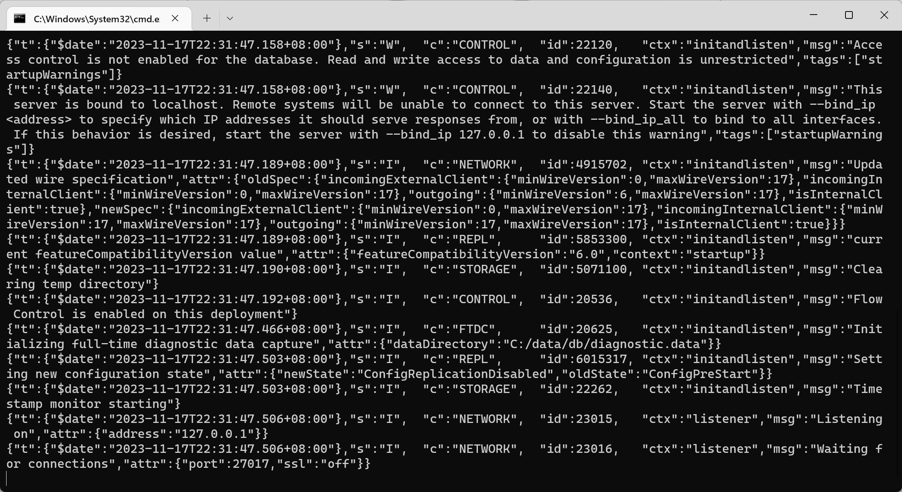

# 一、简介

## 1.1 Mongodb

MongoDb是一个基于分布式文件存储的数据库，官方地址 [https://www.mongodb.com/](https://www.mongodb.com/)

## 1.2 数据库

数据库(DataBase)是按照数据结构来组织、存储和管理数据的应用程序。

作用：数据库的主要作用就是管理数据，对数据进行增(c)、删(d)、改(u)、查(r)。

核心概念：

-   数据库（database）数据库是一个数据仓库，数据库服务下可以创建很多数据库，数据库中可以存放很多集合。
-   集合（collection）集合类似于JS中的数组，在集合中可以存放很多文档。
-   文档（document）文档是数据库中的最小单位，类似于JS中的对象。

> 一般情况下：
>
> -   一个项目使用一个数据库
> -   一个集合会存储同一种类型的数据

# 二、下载安装与启动

下载地址：[https://www.mongodb.com/try/download/community](https://www.mongodb.com/try/download/community)

建议选择`zip`类型，通用性更强，配置步骤如下：

1.  将压缩包移动到`C:\Program Files`下，然后解压
2.  创建`C:\data\db`目录，mongodb会将数据默认保存在这个文件夹
3.  以mongodb中bin目录作为工作目录，启动命令行
4.  运行命令`mongod`
5.  成功运行服务`127.0.0.1:27017`，如下图

> 注意：
>
> -   为了方便后续使用`mongod`命令，可以将bin目录配置到环境变量Path中
> -   千万不要选中服务端窗口的内容，选中会停止服务，可以敲回车取消选中