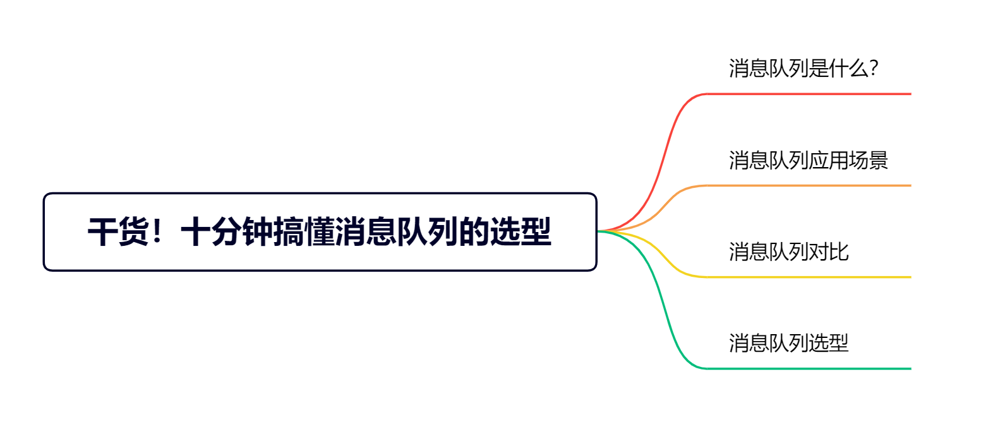
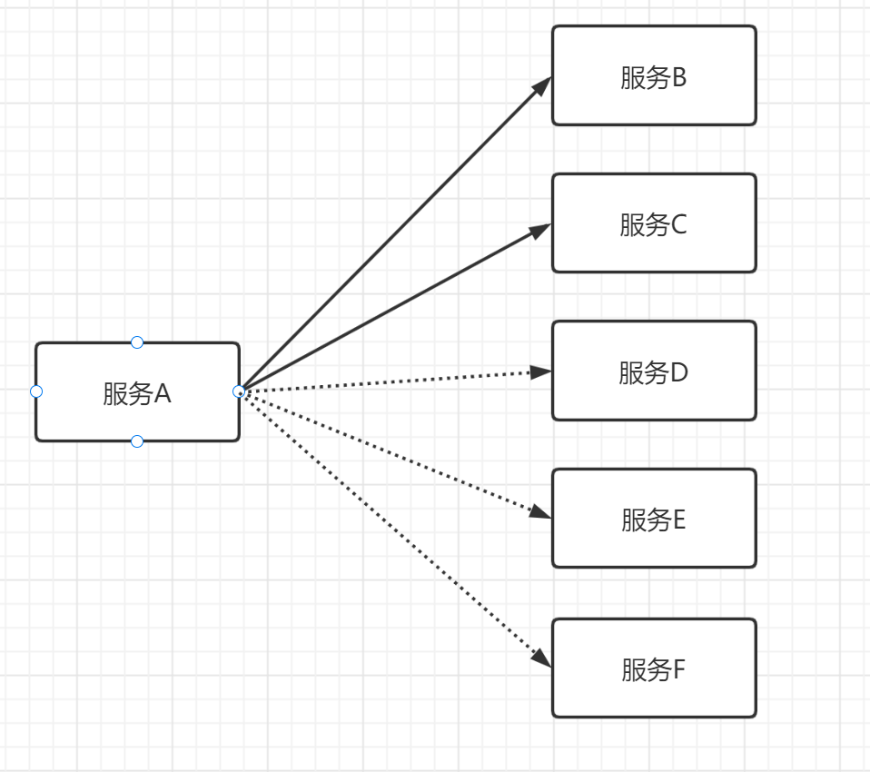
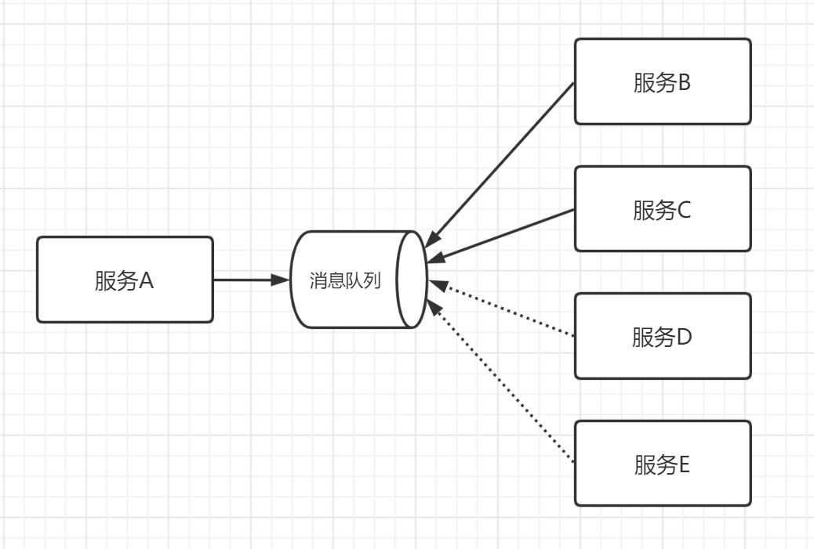
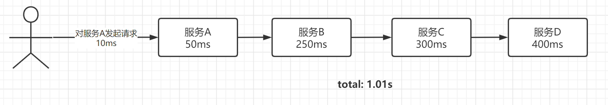
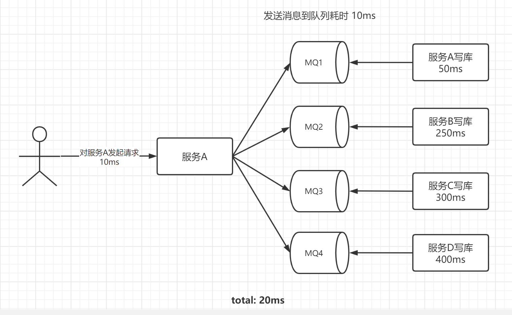
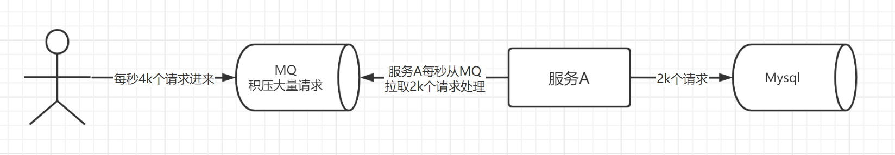
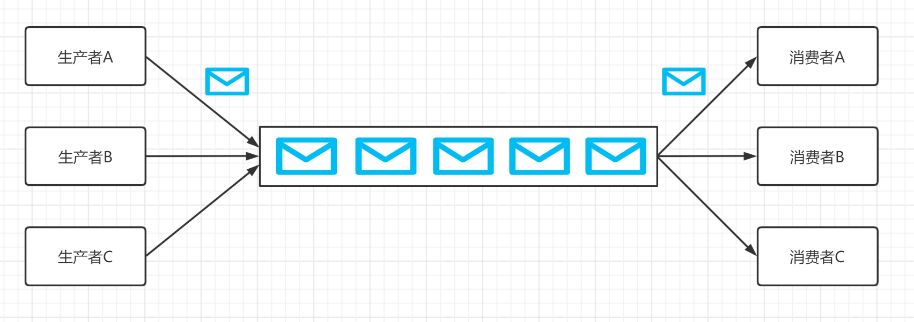
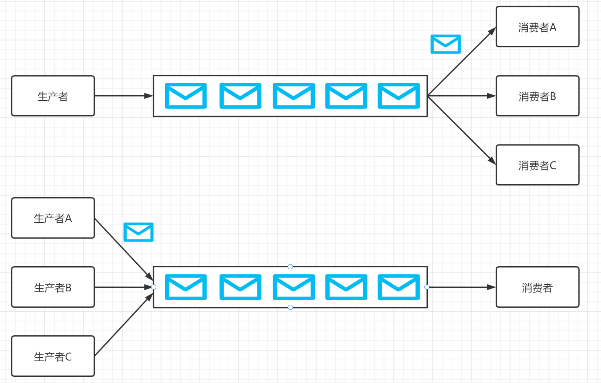

想必你在面试或者工作的过程中，被问过以下问题：

* （1）为什么你们项目要用消息队列？
* （2）用了消息队列后有什么好处？
* （3）消息队列有 ActiveMQ、ZeroMQ、MetaMQ、RabbitMQ、RocketMQ、Kafka等，你是怎么选型的？
* （4）你能对比下 RabbitMQ、RocketMQ、Kafka 吗？

如果你只会回答 ”我只会用这个消息队列“、”公司用的是这个消息队列“ 等等，可以肯定的告诉你将会被 pass 掉。

技术选型是开发工作前最重要的，也是最体现技术的环节。

目前主流的消息队列分别为 Kafka、RabbitMQ、RocketMQ 和 ActiveMQ。

这篇文章重点介绍这四种消息队列的概述、对比和选型，不深入研究每种队列内部的实现原理。

## 消息队列是什么？

消息队列是在消息的传输过程中保存消息的容器，简单点理解就是传递消息的队列，具备先进先出的特点，一般用于异步、解耦、流量削锋等问题，实现高性能、高可用、高扩展的架构。一个消息队列可以被一个或多个消费者消费，一般包含以下元素：

* Producer：消息生产者，负责产生和发送消息到 Broker。
* Broker：消息处理中心，负责消息存储、确认、重试等，一般其中会包含多个 Queue。
* Consumer：消息消费者，负责从 Broker 中获取消息，并进行相应处理。

## 消息队列应用场景

常见的消息队列使用场景有 6 个：

* 应用解耦：消息队列减少了服务之间的耦合性，不同的服务可以通过消息队列进行通信，而不用关心彼此的实现细节。
* 异步处理：消息队列本身是异步的，它允许接收者在消息发送很长时间后再取回消息。
* 流量削锋：当上下游系统处理能力存在差距的时候，利用消息队列做一个通用的”载体”，在下游有能力处理的时候，再进行分发与处理。
* 日志处理：将消息队列用在日志处理中，比如 Kafka 的应用，解决大量日志传输的问题。
* 消息通讯：消息队列一般都内置了高效的通信机制，因此也可以用在纯消息通讯，比如实现聊天室等。
* 消息广播：如果没有消息队列，每当一个新业务方接入，都要接入一次新接口。有了消息队列，我们只需要关心消息是否送达了队列，至于谁订阅，是下游的事，无疑极大地减少了开发和联调的工作量。
  比较核心的有 3 个：解耦、异步、削峰，下面着重讲下：

解耦

假设在没有消息队列的情况下，现在有上游服务 A 用来发布消息，下游服务 B、C 用来接收服务 A 的消息。但随着业务需要，现在有服务
D、E、F 需要接收服务 A 的消息，那么就出现问题了，每次新加入服务都要改一次代码，可想而知这是极大的工作量。

如果引入消息队列，那就好办了，只需要下游服务自己订阅消息队列，而无需改动服务 A 的代码。

异步

先来看没有消息队列的场景下。

服务 A 的某个接口接收到请求，分别需要在服务A、服务B、服务C、服务D进行写库。假设用户发起请求到服务 A 耗时 10ms，自己写库需要
50ms，在服务 B 写库需要 250ms，在服务 C 写库需要 300ms，在服务 D 写库需要400ms，在没有消息队列的情况下，也就是同步操作，总耗时会是
10 + 50ms + 250ms + 300ms + 400ms = 1.01s。用户发送个请求，结果感觉有点卡顿，响应的非常慢，任谁都是很难忍受的。

如果使用了消息队列，那么服务 A 只需要把对服务A、B、C、D 进行写库的操作分别放进四个消息队列，假如用户发起请求到服务器耗时是10ms，发送消息到四个消息队列的耗时是10ms，那么总耗时就是
20 ms 。用户点击了按钮后立马返回，没有卡顿现象，体验效果就会有极大的提升了。

一般接口同步处理时间很长，不能通过水平扩容来解决，且业务场景允许异步，就可以使用异步解决，比如文件上传下载受限于用户的网络带宽因素，扩容也无用，以及上述同步操作耗时长等情况，都可以先放进消息队列，等服务再进行拉取消费。

削峰

在淘宝双十一活动日，特别是 0
点的秒杀活动高峰期时，接口流量会飙升，远远高于平时，就像一个山峰，没有做好处理的话，在高峰期数据库就可能被流量打死，从而导致整个服务奔溃。如果为了在高峰期能顶住流量而常备高流量设备，会有极大的成本浪费。如果是在要高峰期前进行临时服务扩容，很可能会出现许多扩容问题，没有那么简单。

使用消息队列的话，就可以将高峰期过多的流量请求放进消息队列，等高峰期过后，服务再慢慢进行处理，就不会出现峰值流量了，而是一个相对平稳的状态。

举个例子：

* 大量的用户在中午高峰期的时候，每秒有 4k 个请求，那么每秒就有 4k 个请求放到 MQ 里。
* 服务A 每秒只能处理 2k 个请求，因为 Mysql 每秒最多处理 2k 个请求。
* 服务A 就每秒从 MQ 拉取 2k 个请求进行处理，不会超过自己每秒能处理的最大请求量，所以高峰期服务 A 就不会挂掉。
* 对于MQ，每秒 4k 个请求进来，但是却只有 2k 个请求出去，导致在高峰期 1h 内可能有几十万的请求积压在 MQ
  中。这个短暂的高峰期请求积压是可以接受的，因为过了这个时间点，每秒就 100 个请求进 MQ，但这时服务 A 还是会按照每秒 2k 的速度处理
  MQ 积压的请求。
* 所以，高峰期一过，服务 A 就会快速的将 MQ 积压的消息处理掉。

## 消息队列模型

点对点模式：多个生产者可以向同一个消息队列发送消息，一个消息只能被一个消费者消费，在被消费成功后，这条消息会被移除。如果消费者处理消息失败了，那么这条消息会重新被消费。

发布/订阅模式：单个消息可以被多个订阅者并发的获取和处理。多个生产者可以将多个消息写到同一个 Topic 中，被同一个消费者消费。

## 消息队列对比

消息队列有 ActiveMQ、ZeroMQ、RabbitMQ、RocketMQ、Kafka，其中 ZeroMQ 太过轻量，主要用于学习，实际是不会应用到生产，所以主要对比
Kafka、RocketMQ、RabbitMQ、ActiveMQ 这四种 MQ。

| 特性     | Kafka                                                        | RocketMQ                                                  | RabbitMQ                                              | ActiveMQ                      |
|--------|--------------------------------------------------------------|-----------------------------------------------------------|-------------------------------------------------------|-------------------------------|
| 单机吞吐量	 | 10万级别，吞吐量高是kafka最大的优点	                                       | 10万级，RocketMQ 也是可以支撑高吞吐的 MQ	                              | 万级，吞吐量比RocketMQ和Kafka要低了一个数量级	                        | 万级，吞吐量比RocketMQ和Kafka要低了一个数量级 |
| 支持主题数	 | 百级，topic 达到百级时吞吐量会大幅度下降，要尽量保证 topic 数量不要过多，否则需要增加更多机器资源	     | 千级，topic 达到千级时吞吐量会有较小幅度的下降。可以支撑大量 topic 是 RocketMQ 的一大优点	 | 百万级	                                                  | 千级                            |
| 消息顺序性	 | 分区有序	                                                        | 有序	                                                       | 有序	                                                   | 有序	                           |
| 消息重复	  | 至少一次，最多一次	                                                   | 至少一次，最多一次	                                                | 至少一次	                                                 | 至少一次	                         |
| 时效性	   | ms级	                                                         | ms级	                                                      | 微秒级，RabbitMQ的一大优点	                                    | ms级	                          |
| 可用性	   | 非常高，分布式架构，一个数据多个副本，少数机器宕机，不会丢失数据，不会导致不可用	                    | 非常高，分布式架构	                                                | 高，基于主从架构实现高可用性	                                       | 高，基于主从架构实现高可用性                |
| 消息可靠性	 | 经过参数优化配置，理论上消息可以做到0丢失	                                       | 经过参数优化配置，理论上消息可以做到0丢失	                                    | 有较低的概率丢失数据	                                           | 有较低的概率丢失数据                    |
| 消息回溯	  | 支持（按offset回溯）	                                               | 支持（按时间回溯）	                                                | 不支持	                                                  | 不支持                           |
| 功能支持	  | 功能较为简单，主要支持简单的MQ功能，在大数据领域的实时计算以及日志采集被大规模使用，是事实上的标准	          | MQ功能较为完善，还是分布式的，扩展性好	                                     | 基于erlang开发，所以并发能力很强，性能极其好，延时很低	                       | MQ领域的功能极其完备                   |
| 伸缩性	   | 高伸缩性，每个主题（topic）包含多个分区（partition），主题中的分区可以分布在不同的主机（broker）中	 | 高伸缩性，灵活的分布式横向扩展部署架构，整体架构和 kafka 很像	                       | 一般	                                                   |                               |
| 管理界面	  | 普通                                                           | 完善	                                                       | 普通	                                                   | 普通	                           |
| 持久化	   | 消息可以持久化到磁盘	                                                  | 消息可以持久化到磁盘	                                               | 持久化不好，可以持久化到内存、文件	                                    | 可以持久化到内存、文件、数据库               |
| 消息路由	  | 不支持	                                                         | 不支持	                                                      | 支持	                                                   |                               |
| 语言支持	  | 支持多语言，Java优先	                                                | 支持Java、C++，但C++不成熟	                                       | 支持几乎所有最受欢迎的编程语言：Java，C，C ++，C＃，Ruby，Perl，Python，PHP等	 | 支持多语言，Java优先                  |
| 社区活跃度	 | 高	                                                           | 一般	                                                       | 高	                                                    | 高	                            |

## 消息队列选型

Kafka 和 RocketMQ 都支持 10w 级别的高吞吐量。

Kafka 一开始的目的就是用于日志收集和传输，适合有大量数据产生的互联网业务，特别是大数据领域的实时计算、日志采集等场景，用
Kafka 绝对没错，社区活跃度高，业内标准。

RocketMQ 特别适用于金融互联网领域这类对于可靠性要求很高的场景，比如订单交易等，而且 RocketMQ
是阿里出品的，经历过那么多次淘宝双十一的考验，大品牌，在稳定性值得信赖。但如果阿里不再维护这个技术了，社区有可能突然黄掉的风险。因此如果公司对自己的技术实力有自信，基础架构研发实力较强，推荐用
RocketMQ。

RabbitMQ
适用于公司对外提供能力，可能会有很多主题接入的中台业务场景，毕竟它是百万级主题数的。它的时效性是毫秒级的，但实际毫秒级和微秒级在感知上没有什么太大的区别，所以它的这一大优点并不太会作为考量标准。同时，它的功能是比较完善的，开源社区活跃度高，能解决开发中遇到的bug，所以万级别数据量业务场景的小公司可以优先选择功能完善的RabbitMQ。它的缺点就是用
Erlang 语言编写，所以很多开发人员很难去看懂源码并进行二次开发和维护，也就是说对于公司来说可能处于不可控的状态。

ActiveMQ 现在很少有人用，没怎么经过大规模吞吐量场景的考验，社区不怎么活跃，官方社区现在对 ActiveMQ 5.x 维护也越来越少，所以不推荐使用。

