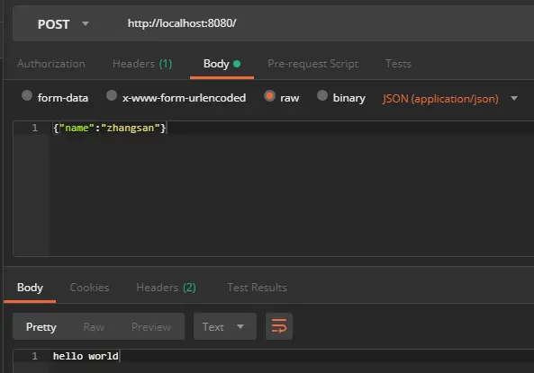
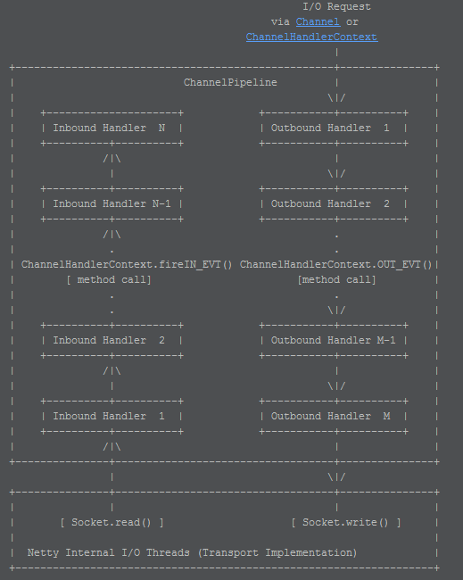
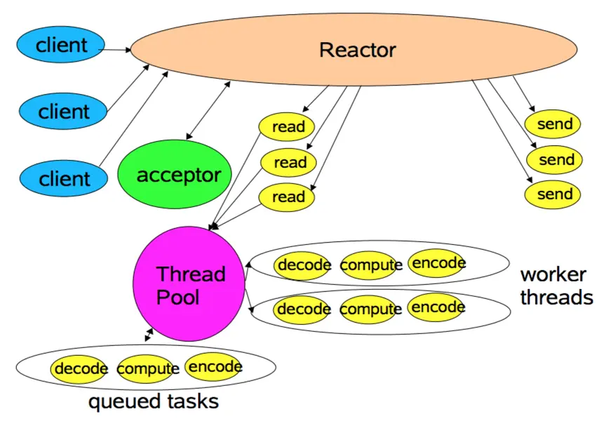
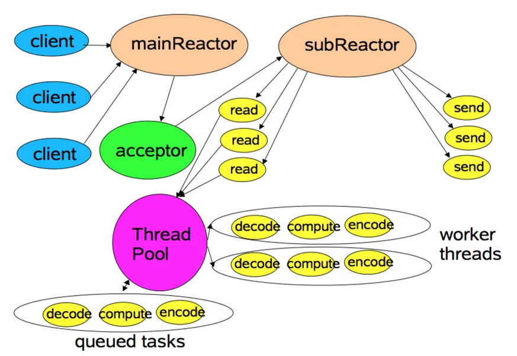

## 一、Netty 简介

Netty 是基于 Java NIO 的异步事件驱动的网络应用框架，使用 Netty 可以快速开发网络应用，Netty 提供了高层次的抽象来简化 TCP 和 UDP 服务器的编程，但是你仍然可以使用底层的 API。

Netty 的内部实现是很复杂的，但是 Netty 提供了简单易用的API从网络处理代码中解耦业务逻辑。Netty 是完全基于 NIO 实现的，所以整个 Netty 都是异步的。

Netty 是最流行的 NIO 框架，它已经得到成百上千的商业、商用项目验证，许多框架和开源组件的底层 rpc 都是使用的 Netty，如 Dubbo、Elasticsearch 等等。下面是官网给出的一些 Netty 的特性：

设计方面

* 对各种传输协议提供统一的 API（使用阻塞和非阻塞套接字时候使用的是同一个 API，只是需要设置的参数不一样）。
* 基于一个灵活、可扩展的事件模型来实现关注点清晰分离。
* 高度可定制的线程模型——单线程、一个或多个线程池。
* 真正的无数据报套接字（UDP）的支持（since 3.1）。
易用性

* 完善的 Javadoc 文档和示例代码。
* 不需要额外的依赖，JDK 5 (Netty 3.x) 或者 JDK 6 (Netty 4.x) 已经足够。
性能

* 更好的吞吐量，更低的等待延迟。
* 更少的资源消耗。
* 最小化不必要的内存拷贝。
安全性

* 完整的 SSL/TLS 和 StartTLS 支持
* 对于初学者，上面的特性我们在脑中有个简单了解和印象即可， 下面开始我们的实战部分。

## 二、一个简单 Http 服务器

开始前说明下我这里使用的开发环境是 IDEA+Gradle+Netty4，当然你使用 Eclipse 和 Maven 都是可以的，然后在 Gradle 的 build 文件中添加依赖 compile 'io.netty:netty-all:4.1.26.Final'，这样就可以编写我们的 Netty 程序了，正如在前面介绍 Netty 特性中提到的，Netty 不需要额外的依赖。

第一个示例我们使用 Netty 编写一个 Http 服务器的程序，启动服务我们在浏览器输入网址来访问我们的服务，便会得到服务端的响应。功能很简单，下面我们看看具体怎么做？

首先编写服务启动类
```java
public class HttpServer {
    public static void main(String[] args) {
        //构造两个线程组
        EventLoopGroup bossrGroup = new NioEventLoopGroup();
        EventLoopGroup workerGroup = new NioEventLoopGroup();
        try {
            //服务端启动辅助类
            ServerBootstrap bootstrap = new ServerBootstrap();
 
            bootstrap.group(bossGroup, workerGroup)
            .channel(NioServerSocketChannel.class)
            .childHandler(new HttpServerInitializer());
 
            ChannelFuture future = bootstrap.bind(8080).sync();
            //等待服务端口关闭
            future.channel().closeFuture().sync();
        } catch (InterruptedException e) {
            e.printStackTrace();
        }finally {
            // 优雅退出，释放线程池资源
            bossGroup.shutdownGracefully();
            workerGroup.shutdownGracefully();
        }
    }
}
```

在编写 Netty 程序时，一开始都会生成 NioEventLoopGroup 的两个实例，分别是 bossGroup 和 workerGroup，也可以称为 parentGroup 和 childGroup，为什么创建这两个实例，作用是什么？可以这么理解，bossGroup 和 workerGroup 是两个线程池, 它们默认线程数为 CPU 核心数乘以 2，bossGroup 用于接收客户端传过来的请求，接收到请求后将后续操作交由 workerGroup 处理。

接下来我们生成了一个服务启动辅助类的实例 bootstrap，boostrap 用来为 Netty 程序的启动组装配置一些必须要组件，例如上面的创建的两个线程组。channel 方法用于指定服务器端监听套接字通道 NioServerSocketChannel，其内部管理了一个 Java NIO 中的ServerSocketChannel实例。

channelHandler 方法用于设置业务职责链，责任链是我们下面要编写的，责任链具体是什么，它其实就是由一个个的 ChannelHandler 串联而成，形成的链式结构。正是这一个个的 ChannelHandler 帮我们完成了要处理的事情。

接着我们调用了 bootstrap 的 bind 方法将服务绑定到 8080 端口上，bind 方法内部会执行端口绑定等一系列操，使得前面的配置都各就各位各司其职，sync 方法用于阻塞当前 Thread，一直到端口绑定操作完成。接下来一句是应用程序将会阻塞等待直到服务器的 Channel 关闭。

启动类的编写大体就是这样了，下面要编写的就是上面提到的责任链了。如何构建一个链，在 Netty 中很简单，不需要我们做太多，代码如下：
```java
public class HttpServerInitializer extends ChannelInitializer<SocketChannel> {
    protected void initChannel(SocketChannel sc) throws Exception {
        ChannelPipeline pipeline = sc.pipeline();
        //处理http消息的编解码
        pipeline.addLast("httpServerCodec", new HttpServerCodec());
        //添加自定义的ChannelHandler
        pipeline.addLast("httpServerHandler", new HttpServerHandler());
    }
}
```

我们自定义一个类 HttpServerInitializer 继承 ChannelInitializer 并实现其中的 initChannel方法。

ChannelInitializer 继承 ChannelInboundHandlerAdapter，用于初始化 Channel 的 ChannelPipeline。通过 initChannel 方法参数 sc 得到 ChannelPipeline 的一个实例。

当一个新的连接被接受时， 一个新的 Channel 将被创建，同时它会被自动地分配到它专属的 ChannelPipeline。

ChannelPipeline 提供了 ChannelHandler 链的容器，推荐读者仔细自己看看 ChannelPipeline 的 Javadoc，文章后面也会继续说明 ChannelPipeline 的内容。

Netty 是一个高性能网络通信框架，同时它也是比较底层的框架，想要 Netty 支持 Http（超文本传输协议），必须要给它提供相应的编解码器。

所以我们这里使用 Netty 自带的 Http 编解码组件 HttpServerCodec 对通信数据进行编解码，HttpServerCodec 是 HttpRequestDecoder 和 HttpResponseEncoder 的组合，因为在处理 Http 请求时这两个类是经常使用的，所以 Netty 直接将他们合并在一起更加方便使用。所以对于上面的代码：
```java
pipeline.addLast("httpServerCodec", new HttpServerCodec())
```
我们替换成如下两行也是可以的。
```java
pipeline.addLast("httpResponseEndcoder", new HttpResponseEncoder());
pipeline.addLast("HttpRequestDecoder", new HttpRequestDecoder());

```
通过 addLast 方法将一个一个的 ChannelHandler 添加到责任链上并给它们取个名称（不取也可以，Netty 会给它个默认名称），这样就形成了链式结构。在请求进来或者响应出去时都会经过链上这些 ChannelHandler 的处理。

最后再向链上加入我们自定义的 ChannelHandler 组件，处理自定义的业务逻辑。下面就是我们自定义的 ChannelHandler。
```java
public class HttpServerChannelHandler0 extends SimpleChannelInboundHandler<HttpObject> {
    private HttpRequest request;
 
    @Override
    protected void channelRead0(ChannelHandlerContext ctx, HttpObject msg) throws Exception {
        if (msg instanceof HttpRequest) {
            request = (HttpRequest) msg;
            request.method();
            String uri = request.uri();
            System.out.println("Uri:" + uri);
        }
        if (msg instanceof HttpContent) {
 
            HttpContent content = (HttpContent) msg;
            ByteBuf buf = content.content();
            System.out.println(buf.toString(io.netty.util.CharsetUtil.UTF_8));
 
            ByteBuf byteBuf = Unpooled.copiedBuffer("hello world", CharsetUtil.UTF_8);
            FullHttpResponse response = new DefaultFullHttpResponse(HttpVersion.HTTP_1_1, HttpResponseStatus.OK, byteBuf);
            response.headers().add(HttpHeaderNames.CONTENT_TYPE, "text/plain");
            response.headers().add(HttpHeaderNames.CONTENT_LENGTH, byteBuf.readableBytes());
 
            ctx.writeAndFlush(response);
 
        }
    }
}
```
至此一个简单的 Http 服务器就完成了。首先我们来看看效果怎样，我们运行 HttpServer 中的 main 方法。让后使用 Postman 这个工具来测试下，使用 post 请求方式（也可以 get，但没有请求体），并一个 json 格式数据作为请求体发送给服务端，服务端返回给我们一个hello world字符串。



服务端控制台打印如下：


对于自定义的 ChannelHandler， 一般会继承 Netty 提供的SimpleChannelInboundHandler类，并且对于 Http 请求我们可以给它设置泛型参数为 HttpOjbect 类，然后覆写 channelRead0 方法，在 channelRead0 方法中编写我们的业务逻辑代码，此方法会在接收到服务器数据后被系统调用。

Netty 的设计中把 Http 请求分为了 HttpRequest 和 HttpContent 两个部分，HttpRequest 主要包含请求头、请求方法等信息，HttpContent 主要包含请求体的信息。

所以上面的代码我们分两块来处理。在 HttpContent 部分，首先输出客户端传过来的字符，然后通过 Unpooled 提供的静态辅助方法来创建未池化的 ByteBuf 实例， Java NIO 提供了 ByteBuffer 作为它的字节容器，Netty 的 ByteBuffer 替代品是 ByteBuf。

接着构建一个 FullHttpResponse 的实例，并为它设置一些响应参数，最后通过 writeAndFlush 方法将它写回给客户端。

上面这样获取请求和消息体则相当不方便，Netty 又提供了另一个类 FullHttpRequest，FullHttpRequest 包含请求的所有信息，它是一个接口，直接或者间接继承了 HttpRequest 和 HttpContent，它的实现类是 DefalutFullHttpRequest。

因此我们可以修改自定义的 ChannelHandler 如下：
```java
public class HttpServerChannelHandler extends SimpleChannelInboundHandler<FullHttpRequest> {
 
    protected void channelRead0(ChannelHandlerContext ctx, FullHttpRequest msg) throws Exception {
 
        ctx.channel().remoteAddress();
 
        FullHttpRequest request = msg;
 
        System.out.println("请求方法名称:" + request.method().name());
 
        System.out.println("uri:" + request.uri());
        ByteBuf buf = request.content();
        System.out.print(buf.toString(CharsetUtil.UTF_8));
 
 
        ByteBuf byteBuf = Unpooled.copiedBuffer("hello world", CharsetUtil.UTF_8);
        FullHttpResponse response = new DefaultFullHttpResponse(HttpVersion.HTTP_1_1, HttpResponseStatus.OK, byteBuf);
        response.headers().add(HttpHeaderNames.CONTENT_TYPE, "text/plain");
        response.headers().add(HttpHeaderNames.CONTENT_LENGTH, byteBuf.readableBytes());
 
        ctx.writeAndFlush(response);
    }
}
```


这样修改就可以了吗，如果你去启动程序运行看看，是会抛异常的。前面说过 Netty 是一个很底层的框架，对于将请求合并为一个 FullRequest 是需要代码实现的，然而这里我们并不需要我们自己动手去实现，Netty 为我们提供了一个 HttpObjectAggregator 类，这个 ChannelHandler作用就是将请求转换为单一的 FullHttpReques。

所以在我们的 ChannelPipeline 中添加一个 HttpObjectAggregator 的实例即可。
```java
public class HttpServerInitializer extends ChannelInitializer<SocketChannel> {
    protected void initChannel(SocketChannel sc) {
        ChannelPipeline pipeline = sc.pipeline();
        //处理http消息的编解码
        pipeline.addLast("httpServerCodec", new HttpServerCodec());
        pipeline.addLast("aggregator", new HttpObjectAggregator(65536));
        //添加自定义的ChannelHandler
        pipeline.addLast("httpServerHandler", new HttpServerChannelHandler0());
    }
}
```

启动程序运行，一切都顺畅了，好了，这个简单 Http 的例子就 OK 了。

## 三、编写 Netty 客户端

上面的两个示例中我们都是以 Netty 做为服务端，接下来看看如何编写 Netty 客户端，以第一个 Http 服务的例子为基础，编写一个访问 Http 服务的客户端。
```java
public class HttpClient {
 
   public static void main(String[] args) throws Exception {
       String host = "127.0.0.1";
       int port = 8080;
 
       EventLoopGroup group = new NioEventLoopGroup();
 
       try {
           Bootstrap b = new Bootstrap();
           b.group(group)
           .channel(NioSocketChannel.class)
           .handler(new ChannelInitializer<SocketChannel>() {
               @Override
               public void initChannel(SocketChannel ch) throws Exception {
                   ChannelPipeline pipeline = ch.pipeline();
                   pipeline.addLast(new HttpClientCodec());
                   pipeline.addLast(new HttpObjectAggregator(65536));
                   pipeline.addLast(new HttpClientHandler());
               }
           });
 
           // 启动客户端.
           ChannelFuture f = b.connect(host, port).sync();
           f.channel().closeFuture().sync();
 
       } finally {
           group.shutdownGracefully();
       }
   }
}
```

客户端启动类编写基本和服务端类似，在客户端我们只用到了一个线程池，服务端使用了两个，因为服务端要处理 n 条连接，而客户端相对来说只处理一条，因此一个线程池足以。

然后服务端启动辅助类使用的是 ServerBootstrap，而客户端换成了 Bootstrap。通过 Bootstrap 组织一些必要的组件，为了方便，在 handler 方法中我们使用匿名内部类的方式来构建 ChannelPipeline 链容器。最后通过 connect 方法连接服务端。

接着编写 HttpClientHandler 类。
```java
public class HttpClientHandler extends SimpleChannelInboundHandler<FullHttpResponse> {
 
    @Override
    public void channelActive(ChannelHandlerContext ctx) throws Exception {
        URI uri = new URI("http://127.0.0.1:8080");
        String msg = "Are you ok?";
        FullHttpRequest request = new DefaultFullHttpRequest(HttpVersion.HTTP_1_1, HttpMethod.GET,
                uri.toASCIIString(), Unpooled.wrappedBuffer(msg.getBytes("UTF-8")));
 
        // 构建http请求
//        request.headers().set(HttpHeaderNames.HOST, "127.0.0.1");
//        request.headers().set(HttpHeaderNames.CONNECTION, HttpHeaderValues.KEEP_ALIVE);
        request.headers().set(HttpHeaderNames.CONTENT_LENGTH, request.content().readableBytes());
        // 发送http请求
        ctx.channel().writeAndFlush(request);
    }
 
    @Override
    public void channelRead0(ChannelHandlerContext ctx, FullHttpResponse msg) {
 
        FullHttpResponse response = msg;
        response.headers().get(HttpHeaderNames.CONTENT_TYPE);
        ByteBuf buf = response.content();
        System.out.println(buf.toString(io.netty.util.CharsetUtil.UTF_8));
 
    }
}
```

在 HttpClientHandler 类中，我们覆写了 channelActive 方法，当连接建立时，此方法会被调用，我们在方法中构建了一个 FullHttpRequest 对象，并且通过 writeAndFlush 方法将请求发送出去。

channelRead0 方法用于处理服务端返回给我们的响应，打印服务端返回给客户端的信息。至此，Netty 客户端的编写就完成了，我们先开启服务端，然后开启客户端就可以看到效果了。

希望通过前面介绍的几个例子能让大家基本知道如何编写 Netty 客户端和服务端，下面我们来说说 Netty 程序为什么是这样编写的，这也是 Netty 中最为重要的一部分知识，可以让你在编写 netty 程序时做到心中有数。

## 四、Channel、ChannelPipeline、ChannelHandler、ChannelHandlerContext 之间的关系

在编写 Netty 程序时，经常跟我们打交道的是上面这几个对象，这也是 Netty 中几个重要的对象，下面我们来看看它们之间有什么样的关系。

Netty 中的 Channel 是框架自己定义的一个通道接口，Netty 实现的客户端 NIO 套接字通道是 NioSocketChannel，提供的服务器端 NIO 套接字通道是 NioServerSocketChannel。

当服务端和客户端建立一个新的连接时， 一个新的 Channel 将被创建，同时它会被自动地分配到它专属的 ChannelPipeline。

ChannelPipeline 是一个拦截流经 Channel 的入站和出站事件的 ChannelHandler 实例链，并定义了用于在该链上传播入站和出站事件流的 API。那么就很容易看出这些 ChannelHandler 之间的交互是组成一个应用程序数据和事件处理逻辑的核心。



上图描述了 IO 事件如何被一个 ChannelPipeline 的 ChannelHandler 处理的。

ChannelHandler分为 ChannelInBoundHandler 和 ChannelOutboundHandler 两种，如果一个入站 IO 事件被触发，这个事件会从第一个开始依次通过 ChannelPipeline中的 ChannelInBoundHandler，先添加的先执行。

若是一个出站 I/O 事件，则会从最后一个开始依次通过 ChannelPipeline 中的 ChannelOutboundHandler，后添加的先执行，然后通过调用在 ChannelHandlerContext 中定义的事件传播方法传递给最近的 ChannelHandler。

在 ChannelPipeline 传播事件时，它会测试 ChannelPipeline 中的下一个 ChannelHandler 的类型是否和事件的运动方向相匹配。

如果某个ChannelHandler不能处理则会跳过，并将事件传递到下一个ChannelHandler，直到它找到和该事件所期望的方向相匹配的为止。

假设我们创建下面这样一个 pipeline：
```java
ChannelPipeline p = ...;
p.addLast("1", new InboundHandlerA());
p.addLast("2", new InboundHandlerB());
p.addLast("3", new OutboundHandlerA());
p.addLast("4", new OutboundHandlerB());
p.addLast("5", new InboundOutboundHandlerX());
```
在上面示例代码中，inbound 开头的 handler 意味着它是一个ChannelInBoundHandler。outbound 开头的 handler 意味着它是一个 ChannelOutboundHandler。

当一个事件进入 inbound 时 handler 的顺序是 1，2，3，4，5；当一个事件进入 outbound 时，handler 的顺序是 5，4，3，2，1。在这个最高准则下，ChannelPipeline 跳过特定 ChannelHandler 的处理：

* 3，4 没有实现 ChannelInboundHandler，因而一个 inbound 事件的处理顺序是 1，2，5。
* 1，2 没有实现 ChannelOutBoundhandler，因而一个 outbound 事件的处理顺序是 5，4，3。
* 5 同时实现了 ChannelInboundHandler 和 channelOutBoundHandler，所以它同时可以处理 inbound 和 outbound 事件。
ChannelHandler 可以通过添加、删除或者替换其他的 ChannelHandler 来实时地修改 ChannelPipeline 的布局。

（它也可以将它自己从 ChannelPipeline 中移除。）这是 ChannelHandler 最重要的能力之一。

ChannelHandlerContext 代表了 ChannelHandler 和 ChannelPipeline 之间的关联，每当有 ChannelHandler 添加到 ChannelPipeline 中时，都会创建 ChannelHandlerContext。

ChannelHandlerContext 的主要功能是管理它所关联的 ChannelHandler 和在同一个 ChannelPipeline 中的其他 ChannelHandler 之间的交互。事件从一个 ChannelHandler 到下一个 ChannelHandler 的移动是由 ChannelHandlerContext 上的调用完成的。


但是有些时候不希望总是从 ChannelPipeline 的第一个 ChannelHandler 开始事件，我们希望从一个特定的 ChannelHandler 开始处理。

你必须引用于此 ChannelHandler 的前一个 ChannelHandler 关联的 ChannelHandlerContext，利用它调用与自身关联的 ChannelHandler 的下一个 ChannelHandler。

如下：
```java
ChannelHandlerContext ctx = ...;   // 获得 ChannelHandlerContext引用
// write()将会把缓冲区发送到下一个ChannelHandler  
ctx.write(Unpooled.copiedBuffer("Netty in Action", CharsetUtil.UTF_8));
 
//流经整个pipeline
ctx.channel().write(Unpooled.copiedBuffer("Netty in Action", CharsetUtil.UTF_8));
```
如果我们想有一些事件流全部通过 ChannelPipeline，有两个不同的方法可以做到：

* 调用 Channel 的方法
* 调用 ChannelPipeline 的方法
* 这两个方法都可以让事件流全部通过 ChannelPipeline，无论从头部还是尾部开始，因为它主要依赖于事件的性质。如果是一个 “ 入站 ” 事件，它开始于头部；若是一个 “ 出站 ” 事件，则开始于尾部。
那为什么你可能会需要在 ChannelPipeline 某个特定的位置开始传递事件呢？

* 减少因为让事件穿过那些对它不感兴趣的 ChannelHandler 而带来的开销
* 避免事件被那些可能对它感兴趣的 ChannlHandler 处理

## 五、Netty 线程模型

在前面的示例中我们程序一开始都会生成两个 NioEventLoopGroup 的实例，为什么需要这两个实例呢？这两个实例可以说是 Netty 程序的源头，其背后是由 Netty 线程模型决定的。

Netty 线程模型是典型的 Reactor 模型结构，其中常用的 Reactor 线程模型有三种，分别为：Reactor 单线程模型、Reactor 多线程模型和主从 Reactor 多线程模型。

而在 Netty 的线程模型并非固定不变，通过在启动辅助类中创建不同的 EventLoopGroup 实例并通过适当的参数配置，就可以支持上述三种 Reactor 线程模型。

Reactor 线程模型

### Reactor 单线程模型

Reactor 单线程模型指的是所有的 IO 操作都在同一个 NIO 线程上面完成。作为 NIO 服务端接收客户端的 TCP 连接，作为 NIO 客户端向服务端发起 TCP 连接，读取通信对端的请求或向通信对端发送消息请求或者应答消息。

由于 Reactor 模式使用的是异步非阻塞 IO，所有的 IO 操作都不会导致阻塞，理论上一个线程可以独立处理所有 IO 相关的操作。


Netty 使用单线程模型的的方式如下：
```java
EventLoopGroup bossGroup = new NioEventLoopGroup(1);
ServerBootstrap b = new ServerBootstrap();
b.group(bossGroup)
 .channel(NioServerSocketChannel.class)
```


在实例化 NioEventLoopGroup 时，构造器参数是 1，表示 NioEventLoopGroup 的线程池大小是 1。然后接着我们调用 b.group(bossGroup) 设置了服务器端的 EventLoopGroup，因此 bossGroup和 workerGroup 就是同一个 NioEventLoopGroup 了。

### Reactor 多线程模型

对于一些小容量应用场景，可以使用单线程模型，但是对于高负载、大并发的应用却不合适，需要对该模型进行改进，演进为 Reactor 多线程模型。

Rector 多线程模型与单线程模型最大的区别就是有一组 NIO 线程处理 IO 操作。

在该模型中有专门一个 NIO 线程 -Acceptor 线程用于监听服务端，接收客户端的 TCP 连接请求；而 1 个 NIO 线程可以同时处理N条链路，但是 1 个链路只对应 1 个 NIO 线程，防止发生并发操作问题。

网络 IO 操作-读、写等由一个 NIO 线程池负责，线程池可以采用标准的 JDK 线程池实现，它包含一个任务队列和 N 个可用的线程，由这些 NIO 线程负责消息的读取、解码、编码和发送。



Netty 中实现多线程模型的方式如下：
```java
EventLoopGroup bossGroup = new NioEventLoopGroup(1);
EventLoopGroup workerGroup = new NioEventLoopGroup();
ServerBootstrap b = new ServerBootstrap();
b.group(bossGroup, workerGroup)
 .channel(NioServerSocketChannel.class)
 
```

bossGroup 中只有一个线程，而 workerGroup 中的线程是 CPU 核心数乘以 2，那么就对应 Recator 的多线程模型。

### 主从 Reactor 多线程模型

在并发极高的情况单独一个 Acceptor 线程可能会存在性能不足问题，为了解决性能问题，产生主从 Reactor 多线程模型。

主从 Reactor 线程模型的特点是：服务端用于接收客户端连接的不再是 1 个单独的 NIO 线程，而是一个独立的 NIO 线程池。

Acceptor 接收到客户端 TCP 连接请求处理完成后，将新创建的 SocketChannel 注册到 IO 线程池（sub reactor 线程池）的某个 IO 线程上，由它负责 SocketChannel 的读写和编解码工作。

Acceptor 线程池仅仅只用于客户端的登陆、握手和安全认证，一旦链路建立成功，就将链路注册到后端 subReactor 线程池的 IO 线程上，由 IO 线程负责后续的 IO 操作。



根据前面所讲的两个线程模型，很容想到 Netty 实现多线程的方式如下：
```java
EventLoopGroup bossGroup = new NioEventLoopGroup(4);
EventLoopGroup workerGroup = new NioEventLoopGroup();
ServerBootstrap b = new ServerBootstrap();
b.group(bossGroup, workerGroup)
.channel(NioServerSocketChannel.class)

```
但是，在 Netty 的服务器端的 acceptor 阶段，没有使用到多线程, 因此上面的主从多线程模型在 Netty 的实现是有误的。

服务器端的 ServerSocketChannel 只绑定到了 bossGroup 中的一个线程，因此在调用 Java NIO 的 Selector.select 处理客户端的连接请求时，实际上是在一个线程中的，所以对只有一个服务的应用来说，bossGroup 设置多个线程是没有什么作用的，反而还会造成资源浪费。

至于 Netty 中的 bossGroup 为什么使用线程池，我在 stackoverflow 找到一个对于此问题的讨论 。

the creator of Netty says multiple boss threads are useful if we share NioEventLoopGroup between different server bootstraps

EventLoopGroup 和 EventLoop

当系统在运行过程中，如果频繁的进行线程上下文切换，会带来额外的性能损耗。多线程并发执行某个业务流程，业务开发者还需要时刻对线程安全保持警惕，哪些数据可能会被并发修改，如何保护？这不仅降低了开发效率，也会带来额外的性能损耗。

为了解决上述问题，Netty采用了串行化设计理念，从消息的读取、编码以及后续 ChannelHandler 的执行，始终都由 IO 线程 EventLoop 负责，这就意外着整个流程不会进行线程上下文的切换，数据也不会面临被并发修改的风险。

EventLoopGroup 是一组 EventLoop 的抽象，一个 EventLoopGroup 当中会包含一个或多个 EventLoop，EventLoopGroup 提供 next 接口，可以从一组 EventLoop 里面按照一定规则获取其中一个 EventLoop 来处理任务。

在 Netty 服务器端编程中我们需要 BossEventLoopGroup 和 WorkerEventLoopGroup 两个 EventLoopGroup 来进行工作。

BossEventLoopGroup 通常是一个单线程的 EventLoop，EventLoop 维护着一个注册了 ServerSocketChannel 的 Selector 实例，EventLoop 的实现涵盖 IO 事件的分离，和分发（Dispatcher），EventLoop 的实现充当 Reactor 模式中的分发（Dispatcher）的角色。

所以通常可以将 BossEventLoopGroup 的线程数参数为 1。

BossEventLoop 只负责处理连接，故开销非常小，连接到来，马上按照策略将 SocketChannel 转发给 WorkerEventLoopGroup，WorkerEventLoopGroup 会由 next 选择其中一个 EventLoop 来将这 个SocketChannel 注册到其维护的 Selector 并对其后续的 IO 事件进行处理。

ChannelPipeline 中的每一个 ChannelHandler 都是通过它的 EventLoop（I/O 线程）来处理传递给它的事件的。所以至关重要的是不要阻塞这个线程，因为这会对整体的 I/O 处理产生严重的负面影响。但有时可能需要与那些使用阻塞 API 的遗留代码进行交互。

对于这种情况， ChannelPipeline 有一些接受一个 EventExecutorGroup 的 add() 方法。如果一个事件被传递给一个自定义的 EventExecutorGroup， DefaultEventExecutorGroup 的默认实现。

就是在把 ChannelHanders 添加到 ChannelPipeline 的时候，指定一个 EventExecutorGroup，ChannelHandler 中所有的方法都将会在这个指定的 EventExecutorGroup 中运行。
```java
static final EventExecutor group = new DefaultEventExecutorGroup(16);
...
ChannelPipeline p = ch.pipeline();
pipeline.addLast(group, "handler", new MyChannelHandler());

```
* NioEventLoopGroup 实际上就是个线程池，一个 EventLoopGroup 包含一个或者多个 EventLoop；
* 一个 EventLoop 在它的生命周期内只和一个 Thread 绑定；
* 所有有 EnventLoop 处理的 I/O 事件都将在它专有的 Thread 上被处理；
* 一个 Channel 在它的生命周期内只注册于一个 EventLoop；
* 每一个 EventLoop 负责处理一个或多个 Channel；

