## **1、Nacos概述**

### **1.1、什么是Nacos**

Nacos 是阿里巴巴推出来的一个新开源项目，这是一个更易于构建云原生应用的动态服务发现、配置管理和服务管理平台。（英文全称Dynamic Naming and Configuration Service，Na为naming/nameServer即注册中心，co为configuration即配置中心，service是指该注册/配置中心都是以服务为核心。服务在nacos是一等公民）

Nacos 致力于帮助您**发现、配置和管理微服务**。Nacos 提供了一组简单易用的特性集，帮助您快速实现**动态服务发现、服务配置、服务元数据及流量管理**。

Nacos 帮助您更敏捷和容易地构建、交付和管理微服务平台。 Nacos 是构建**以“服务”为中心**的现代应用架构 (例如微服务范式、云原生范式) 的服务基础设施。

**Nacos 支持如下核心特性：**

**1）服务发现：**支持 **DNS 与 RPC 服务发现**，也提供原生 SDK 、OpenAPI 等多种服务注册方式和 DNS、HTTP 与 API 等多种服务发现方式。

**2）服务健康监测：**Nacos **提供对服务的实时的健康检查**，**阻止向不健康的主机或服务实例发送请求。**

**3）动态配置服务：**Nacos 提供**配置统一管理功能**，能够帮助我们**将配置以中心化、外部化和动态化的方式管理所有环境的应用配置和服务配置**。

**4）动态 DNS 服务：**Nacos **支持动态 DNS 服务权重路由**，能够让我们**很容易地实现中间层负载均衡、更灵活的路由策略**、流量控制以及数据中心内网的简单 DNS 解析服务。

**5）服务及其元数据管理：**Nacos **支持从微服务平台建设的视角管理数据中心的所有服务及元数据**，包括管理服务的描述、生命周期、服务的静态依赖分析、服务的健康状态、服务的流量管理、路由及安全策略、服务的 SLA 以及最首要的 metrics 统计数据。

### **1.2、常见的注册中心**

Eureka（原生，2.0遇到瓶颈，停止维护）

Zookeeper（支持，专业的独立产品。例如：dubbo）

Consul（原生，GO语言开发）

Nacos

相对于 **Spring Cloud Eureka 来说，Nacos 更强大**。

Nacos = Spring Cloud Eureka + Spring Cloud Config

Nacos 可以**与 Spring，Spring Boot，Spring Cloud 集成，并能代替 Spring Cloud Eureka， Spring Cloud Config。**

- 通过 Nacos Server 和 spring-cloud-starter-alibaba-nacos-config **实现配置的动态变更**。
- 通过 Nacos Server 和 spring-cloud-starter-alibaba-nacos-discovery **实现服务的注册与发现**。

**注**：nacos与eureka的区别（简单介绍）

1）nacos和eureka的范围不同，Nacos的阈值是针对某个具体Service的，而**不是针对所有服务**的；但Eureka的自我保护阈值是针对所有服务的。**nacos支持CP和AP两种；eureka只支持AP**。nacos使用netty，**是长连接**；eureka是**短连接，定时发送**。

2）Eureka保护方式：当在短时间内，统计续约失败的比例，**如果达到一定阈值，则会触发自我保护的机制**，在该机制下，Eureka Server不会剔除任何的微服务，等到正常后，再退出自我保护机制。自我保护开关(eureka.server. enab1e-self-preservation:false)

Nacos保护方式：**当域名健康实例(Instance)占总服务实例(Instance)的比例小于阈值时**，**无论实例(Instance)是否健康，都会将这个实例(Instance)返回给客户端**。这样做虽然损失了一部分流量，但是保证了集群的剩余健康实例(Instance)能正常工作。

### **1.3、Nacos结构图**
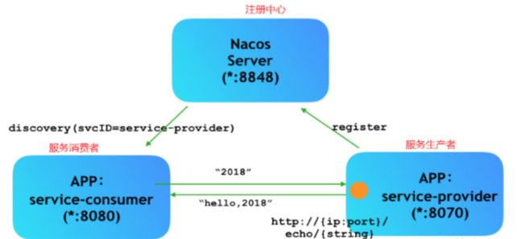

### 1.4、Nacos下载和安装

**1）软件环境**

Nacos 版本：2.0.4

mysql版本：5.7

**2）安转步骤**

此处使用docker安转nacos（单节点）

**注：**注意启动时需要配置这个环境配置 **-e MODE=standalone 否则默认启动为占用内存为1G**。

> 1、先拉取镜像  
> 命令：docker pull nacos/nacos-server:v2.0.4  
> 2、运行容器  
> 命令： docker run --name nacos(容器名称) -d -p 8848(外部访问端口):8848(容器内端口) -p 9848:9848  
> -p 9849:9849 --privileged=true --restart=always -e JVM_XMS=256m -e JVM_XMX=256m -e MODE=standalone -e PREFER_HOST_MODE=hostname -v /home/nacos/logs(数据卷主机地址):/home/nacos/logs（数据卷容器内部地址） -v /home/nacos/conf:/home/nacos/conf ea54f31c46e4（容器id）

**3）查看容器是否启动**

命令：docker ps
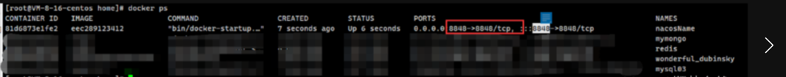

**4)查看容器相关日志**

命令：docker logs --since 10m nacos的容器id #查看指定容器的输出日志
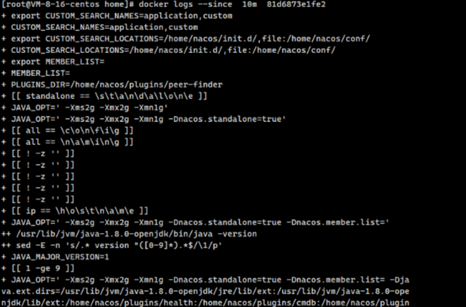

**注意**：如果查看日志发现报错如下截图
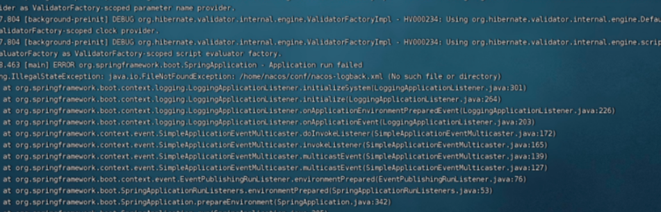

证明缺少日志文件，我们可以在宿主机配置文件目录下添加如下内容

1）新建文件nacos-logback.xml，在我们宿主机挂载的对应的保存配置文件的目录下，并在下方添加如下配置；

2）**注意**log.path 中的value配置要和日志数据卷挂载的目录一致

```XML
<?xml version="1.0" encoding="UTF-8"?>
<configuration debug="false" scan="true" scanPeriod="1 seconds">
    <contextName>logback</contextName>
    <property name="log.path" value="/home/nacos/logs/logback.log" />
    <appender name="console" class="ch.qos.logback.core.ConsoleAppender">
        <!-- <filter class="com.example.logback.filter.MyFilter" /> -->
        <filter class="ch.qos.logback.classic.filter.ThresholdFilter">
            <level>ERROR</level>
        </filter>
        <encoder>
            <pattern>%d{HH:mm:ss.SSS} %contextName [%thread] %-5level %logger{36} - %msg%n
            </pattern>
        </encoder>
    </appender>

    <appender name="file"
              class="ch.qos.logback.core.rolling.RollingFileAppender">
        <file>${log.path}</file>
        <rollingPolicy class="ch.qos.logback.core.rolling.TimeBasedRollingPolicy">
            <fileNamePattern>${log.path}.%d{yyyy-MM-dd}.zip</fileNamePattern>
        </rollingPolicy>

        <encoder>
            <pattern>%date %level [%thread] %logger{36} [%file : %line] %msg%n
            </pattern>
        </encoder>
    </appender>

    <root level="debug">
        <appender-ref ref="console" />
        <appender-ref ref="file" />
    </root>

    <logger name="com.example.logback" level="warn" />
</configuration>
```

5）进行访问

本机IP地址：8848/nacos
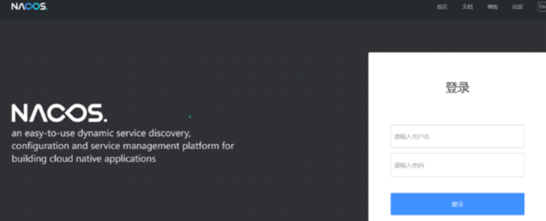

**注**：记得开放对应端口

登录账号 登录密码

nacos nacos
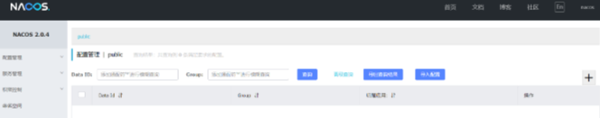

## 2、注册服务

### 1.1、整合nacos

引入依赖

```XML
<dependency>
    <groupId>com.alibaba.cloud</groupId>
    <artifactId>spring-cloud-starter-alibaba-nacos-discovery</artifactId>
</dependency>

```

在对应模块的配置文件中添加nacos配置

```csharp
#服务名（该服务名，会在nacos上显示）
spring.application.name=服务名称
# nacos服务地址
spring.cloud.nacos.discovery.server-addr=ip:端口
```

在启动类上添加注解
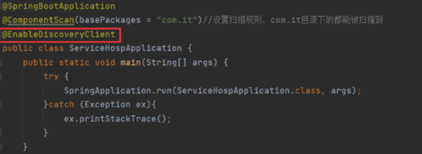

### 2.2、重启服务，查看

重新启动服务，登录nacos页面查看(下图发现服务成功注册上nacos中)
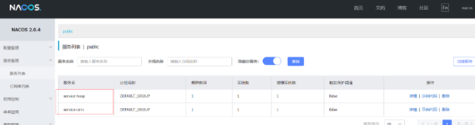

## 3、整合外部的mysql（单节点）

### 3.1、建库建表

可以直接根据里面的内容创建建表链接

**注**：对应nacos版本建表可能出现的问题
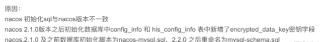

### 3.2、修改数据卷挂载出来的nacos配置

进入数据卷保存路面
此处我们nacos配置保存在宿主机的/home/nacos/conf中
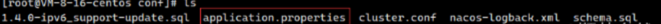


修改下面内容即可
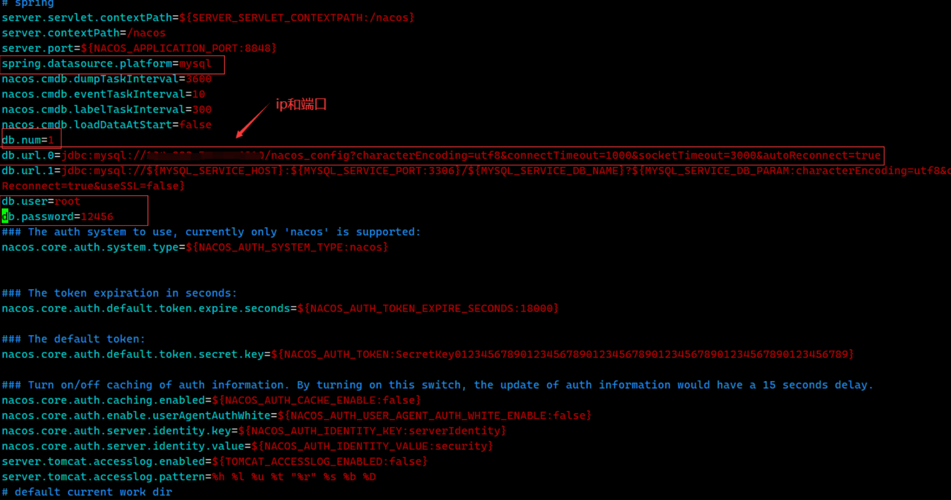

重启 Nacos 即可，验证。

再次创建相关信息、重启服务之后依然存在。

## 4、Nacos集群化部署

之前我们搭建的nacos是standalone（单节点模式），nacos是支持集群化部署的，**最好使用单数节点进行集群化部署（因为此处会有投票机制）**，此处因为只有两台机器，所以只演示两台机器如何部署

### 4.1、使用docker，分别在不同的服务器上运行两台nacos容器

**注意**：2.x版本的nacos需要开放9848 和 9849 端口的映射端口

下面为示例命令：

```cobol
docker run -d \
#  hostname
-e PREFER_HOST_MODE=nacos \
# 单例/集群模式
-e MODE=cluster \
# nacos cluster地址,节点地址
-e NACOS_SERVERS="124.223.xx.xx:8848 106.52.xx.xx:8848" \
# 开启mysql
-e SPRING_DATASOURCE_PLATFORM=mysql \
# mysql主节点host
-e MYSQL_SERVICE_HOST=106.52.xx.xx \
# mysql主节点端口
-e MYSQL_SERVICE_PORT=3306 \
# 数据库用户名
-e MYSQL_SERVICE_USER=root \
# 数据库密码
-e MYSQL_SERVICE_PASSWORD=123456 \
#数据库名称
-e MYSQL_SERVICE_DB_NAME=nacos_config_cluster \
# 自定义nacos服务器IP（当前）
-e NACOS_SERVER_IP=106.52.xx.xx \
# 指定映射端口 8848容器多映射9848 9849 端口
-p 8848:8848 \
-p 9848:9848 \
-p 9849:9849 \
# 容器名
--name nacos-8848 \
--restart=always 
# 挂载
-v /home/nacos/logs:/home/nacos/logs -v /home/nacos/conf:/home/nacos/conf  \
容器id
```

### 4.2、查看nacos控制台（通过每个节点都可以看到对应信息）
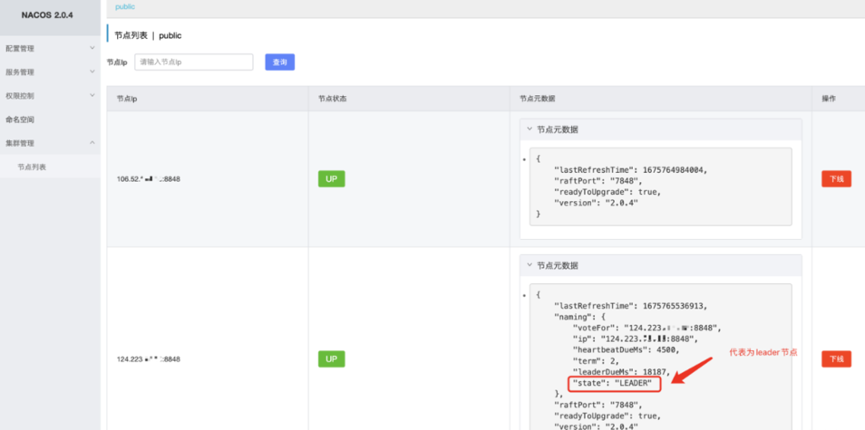

### 4.3、集群简介

**leader节点**：负责事务型请求（事务型：创建配置、修改配置、删除配置）

**follow节点**：负责读（查询请求）

**宕机情况**：当leader节点宕机时，follow节点进行投票选举出新的leader节点（与传统的redis等不同的是，follow会自动进行重新选举，不需要借助类似于哨兵机制这种机制进行选举）
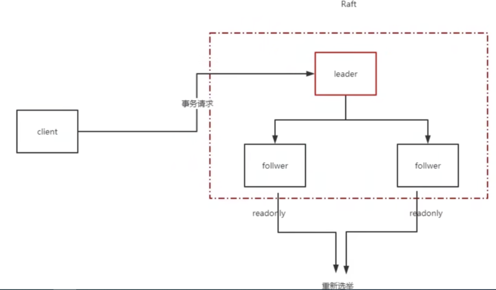

## 5、可能遇到的问题

1、conf无法挂载出来

> 在使用docker运行时，将容器内的conf挂载出来时，发现并没有对应的配置文件

1）先运行一个测试nacos容器

```cobol
 docker run -p 8848:8848 --name nacostest -d 容器id
```

2）将容器内的文件复制出来

```ruby
#配置文件复制 
#第一个目录为容器内目录  第二个为宿主机目录
docker cp nacostest（容器名）:/home/nacos/logs/ /home/nacos/logs
docker cp nacostest（容器名）:/home/nacos/conf/ /home/nacos/conf
```

3）强制关闭容器

```bash
docker rm -f 容器id
```

4）然后在重新运行，包含数据卷挂载命令的启动命令

**docker运行命令介绍**

|名称|描述|值|
|---|---|---|
|MODE|系统启动方式: 集群/单机 cluster/standalone|默认 cluster|
|NACOS_SERVERS|集群地址|p1:port1空格ip2:port2 空格ip3:port3|
|PREFER_HOST_MODE|支持IP还是域名模式|hostname/ip 默认 ip|
|NACOS_SERVER_PORT|Nacos 运行端口|默认 8848|
|NACOS_SERVER_IP|多网卡模式下可以指定IP||
|SPRING_DATASOURCE_PLATFORM|单机模式下支持MYSQL数据库|mysql / 空 默认:空|
|MYSQL_SERVICE_HOST|数据库 连接地址||
|MYSQL_SERVICE_PORT|数据库端口|默认 : 3306|
|MYSQL_SERVICE_DB_NAME|数据库库名||
|MYSQL_SERVICE_USER|数据库用户名||
|MYSQL_SERVICE_PASSWORD|数据库用户密码||
|MYSQL_SERVICE_DB_PARAM|数据库连接参数|default :|
|MYSQL_DATABASE_NUM|数据库编号|默认 :1|
|JVM_XMS|-Xms|默认 :1g|
|JVM_XMX|-Xmx|默认 :1g|
|JVM_XMN|-Xmn|默认 :512m|
|JVM_MS|-XX:MetaspaceSize|默认 :128m|
|JVM_MMS|-XX:MaxMetaspaceSize|默认 :320m|
|NACOS_DEBUG|是否开启远程DEBUG y/n|默认 :n|
|TOMCAT_ACCESSLOG_ENABLED|server.tomcat.accesslog.enabled|默认 :false|
|NACOS_AUTH_SYSTEM_TYPE|权限系统类型选择,目前只支持nacos类型|默认 :nacos|
|NACOS_AUTH_ENABLE|是否开启权限系统|默认 :false|
|NACOS_AUTH_TOKEN_EXPIRE_SECONDS|token 失效时间|默认 :18000|
|NACOS_AUTH_TOKEN|token|默认 :SecretKey012345678901234567890123456789012345678901234567890123456789|
|NACOS_AUTH_CACHE_ENABLE|权限缓存开关 ,开启后权限缓存的更新默认有15秒的延迟|默认 : false|
|MEMBER_LIST|通过环境变量的方式设置集群地址|例子:192.168.16.101:8847?raft_port=8807,192.168.16.101?raft_port=8808,192.168.16.101:8849?raft_port=8809|
|EMBEDDED_STORAGE|是否开启集群嵌入式存储模式 embedded|默认 : none|
|NACOS_AUTH_CACHE_ENABLE|nacos.core.auth.caching.enabled|default : false|
|NACOS_AUTH_USER_AGENT_<br><br>AUTH_WHITE_ENABLE|nacos.core.auth.enable.userAgentAuthWhite|default : false|
|NACOS_AUTH_IDENTITY_KEY|nacos.core.auth.server.identity.key|default : serverIdentity|
|NACOS_AUTH_IDENTITY_VALUE|nacos.core.auth.server.identity.value|default : security|
|NACOS_SECURITY_IGNORE_URLS|nacos.security.ignore.urls|default : /,/error,/**/*.css,/**/_.js,/**/_.html,/**/*.map,/**/_.svg,/**/_.png,/**/*.ico,/console-fe/public/**,/v1/auth/**,/v1/console/health/**,/actuator/**,/v1/console/server/**|