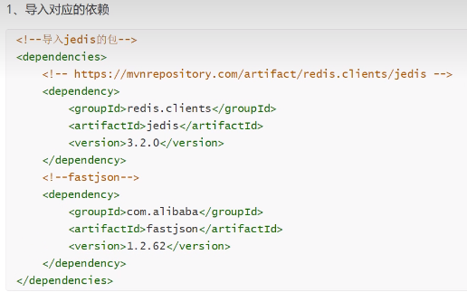
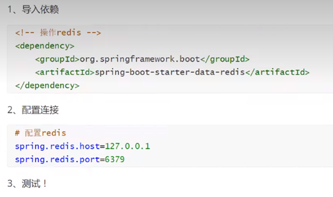

NoSQL:即Not-OnlySQL(泛指非关系型的数据库)，作为关系型数据库的补充。  
作用:应对基于海量用户和海量数据前提下的数据处理问题。

## Redis介绍

#### 概念

Redis(REmote DlctionaryServer)是用C语言开发的一个开源的高性能键值对(key-value)数据库

#### 特征

1.数据间没有必然的关联关系

2.内部采用单线程机制进行工作

3.高性能

4.支持多种数据类型

5.支持持久化，可以存硬盘。

#### 应用

热点信息，时效性信息，分布式数据共享，消息队列，即使信息查询。

### 在虚拟机上启动redis服务

通过指定的配置文件启动redis服务，

1. 查看进程：ps -ef | grep redis
2. 进入配置文件的目录cd /usr/local/redis/bin/
3. 输入 ./redis-server redis.conf
4. 输入 ./redis-cli
5. 关闭服务并退出：shutdown 然后：exit

### 键值对

设置键值对

​ 语法：set key value

获取键值对

​ 语法：get key

判断键是否存在：exist key

**设置过期时间**： expire key 时间

查看过期时间： ttl key

查看当前key的数据类型：> type key

删除key：del key

### 库

redis共有16个库

#### 选择数据库

语法：select 数字

#### 查看

查看大小：dbsize

查看数据库所有的键：keys *

#### 清空

清空当前数据库：flushdb

清空所有：flushall

### 基本数据类型

#### String

追加字符串，不存在则新建：append key1 "hello"

获取字符串长度：strlen key1

初始浏览量为0 ：set views 0

设置自增1：incr views

设置自减1：decr views

可以设置步长。每次的增长值 : INCRBY views 10 #

获取指定范围的值: GETRANGE key 起始点 结束点

获取所有长度的值: GETRANGE key 0 -1

设置多个值:

mset key value key value ……

mget key key key

msetnx 原子性操作设置多个值

**设置过期时间和值:**

设置key3 的值为 he11o,30秒后过期: setex key3 30 "he1lo"

先get然后在set: getset

## List

LPuSH key value

LPUSH list one #将一个值或者多个值，插入到列表头部(左)

RPUSH key value

Rpush list righr #将一个值或者多个值，插入到列表位部(右)

lrange key start end

LRANGE list 0 1 #通过区间获取具体的值!

LROR key #移出并获取列表的第一个元素

lindex list 1 #通过下标获得list 中的某一个值!

Llen list # 返回列表的长度

lrem key count value

lrem list 1 one # 移除list集合中指定个数的value，精确匹配

ltrim list 1 2 #截取指定的长度!

lset 将列表中指定下标的值替换为另外一个值，更新操作

lset list 0 item #如果存在，更新当前下标的值

在指定元素前后插入指定的值

LINSERT mylist after world new

## set

set集合中添加

sadd key value

sadd myset "hello"

查看指定set的所有值

smembers key

SMEMBERS myset

判断某一个值是不是在set集合中!

sismember key value

SISMEMBER myset hello

查看个数

scard key

scard myset

移除set集合中的指定元素

srem key value

srem myset hello

获取随机

SRANDMEMBER myset

SRANDMEMBER myset 2

smove myset myset2 "kuangshen"# 将一个指定的值，移动到另外一个set集合!

SDIFF key1 key2 差集

SINTER key1 key2 交集

SUNION key1 key2 并集

## hash

hset 集合名 key value

hset myhash field1 hello

# set一个具体key-vlaue

获取一个字段值

hget 集合名 key键

hget myhash field1

添加多个 key-vlaue

hmset 集合 key键1 key键2

hmset myhash field1 hello field2 world

获取多个字段值

hmget 集合名 key1 key2

hmget myhash field1 field2

获取全部的数据

hget 集合名

hgetall myhash

删除hash指定key字段!对应的value值也就消失了!

hdel 集合名 key

hdel myhash field1

判断hash中指定字段是否存在!

HEXISTS myhash field1

只获得所有field

hkeys 集合名

hkeys myhash

只获得所有value

hvals 集合名

hvals myhash

设置自动增长

HINCRBY myhash field3 1

HINCRBY myhash field3 -1

如果不存在则可以设置

hsetnx myhash field4 hello

如果存在则不能设置

hsetnx myhash field4 world

## zset

zset在set的基础上增加了一个值，set k1 v1 zset k1 score1 v1

添加一个值

zadd key score value

zadd myset 1 one

添加多个值

zadd myset 2 two 3 three

获取范围值

zrange key start end

zrange myset 0 -1

显示全部内容从小到大

ZRANGEBYSCORE key min max [WITHSCORES] [LIMIT offset count]

移除元素

zrem key value

---

## 特殊数据类型

### 地理位置geostital

创建一个元素

geoadd key 纬度 经度 成员

geoadd city 116.40 39.90 beijing

获取坐标

geopos city beijing

获取两者之间的距离

geodist key value1 value2 单位

geodist city beijing shanghai km

相关范围内的城市

georadius key 纬度 经度 距离 单位 withdist

找出指定位置内的其他元素

georadiusbymember key value 距离 单位

### bitmaps

位存储

统计用户信息，活跃，不活跃!登录、未登录!打卡，365打卡!两个状态的，都可以使用Bitmaps!

Bitmaps位图，数据结构!都是操作二进制位来进行记录，就只有0和1两个状态!

365天=365 bit 1字节=8bit46个字节左右!

设置一个元素

setbit key offset value

查看

getbit sign offset

---

## 事务

Redis 事务本质:一组命令的集合!一个事务中的所有命令都会被序列化，在事务执行过程的中，会按照顺序执行! 一次性、顺序性、排他性!执行一系列的命令!

Redis命令保证原子性，但是事务不保证原子性！

redis事务：

1 开启事务：开启一个事务

> multi

2 命令入队：将命令放入事务

> set key value

3 执行事务：执行事务中的命令

> exec

4 取消事务:事务中的命令都不会被执行

> discard

eg：

```bash
# 正常执行
127.0.0.1:6379> MULTI 
OK
127.0.0.1:6379(TX)> set k1 v1
QUEUED
127.0.0.1:6379(TX)> set k2 2
QUEUED
127.0.0.1:6379(TX)> exec
1) OK
2) OK

```

```bash
#取消事务
127.0.0.1:6379> multi
OK
127.0.0.1:6379(TX)> set k1 v1
QUEUED
127.0.0.1:6379(TX)> DISCARD
OK
127.0.0.1:6379> get k1
"v1"
127.0.0.1:6379> multi
OK
127.0.0.1:6379(TX)> set k3 v3
QUEUED
127.0.0.1:6379(TX)> DISCARD
OK
127.0.0.1:6379> get k3
(nil)

```

如果在入队的命令中有错误的命令，

如果是编译时异常，那么所有命令都不会被执行。

如果是运行时异常，那么其他命令正常执行，仅有错误的命令抛出错误信息。

---

## 锁

#### 悲观锁

很悲观，什么时候都要加锁。

#### 乐观锁

很乐观，认为什么时候都不会出问题，所以不会上锁!更新数据的时候去判断一下，在此期间是否有人修改过这个数据，  
获取version  
更新的时候比较version

使用watch命令当作redis的乐观锁操作

```bash
127.0.0.1:6379> multi
OK
127.0.0.1:6379(TX)> INCRBY money 10
QUEUED
127.0.0.1:6379(TX)> exec
1) (integer) 20
127.0.0.1:6379> 
```

> unwatch

如果发现事务执行失败，就先解锁

---

## jedis

Jedis是redis的java版本的客户端实现，使用Jedis提供的Java API对Redis进行操作，是Redis官方推崇的方式；并且，使用Jedis提供的对Redis的支持也最为灵活、全面；不足之处，就是编码复杂度较高。

#### 导入依赖


#### 简单语法：

```java
Jedis jedis = new Jedis( host: "127.0.0.1"， port: 6379);
System.out.println("清空数据:"+jedis.flushDB());
System.out.println("判断某个键是否存在:"+jedis.exists( key: "username"));
System.out.println("新增<'username','haha'>的键值对:"+jedis.set("username","haha");
System.out.println("新增<'password','mima'>的键值对:"+jedis.set("password","mima");
System.out.print("系统中所有的键如下:");
Set<String> keys = jedis.keys( pattern:"*");
System.out.println(keys);
System.out.println("删除键password:"+jedis.del( key:"password"));
System.out.println("判断键password是否存在:"+jedis.exists( key: "password"));
System.out.println("查看键username所存储的值的类型:"+jedis.type( key: "username"));
System.out.println("随机返回key空间的一个:"+jedis.randomKey());
System.out.println("重命名key:"+jedis.rename( oldkey: "username", newkey: "name"));
System.out.println("取出改后的name: "+jedis.get("name"));
System.out.println("按索引查询:"+jedis.select( index: 0));
System.out.println("删除当前选择数据库中的所有key:"+jedis.flushDB());
System.out.println("返回当前数据库中key的数目:"+jedis.dbSize());
System.out.println("删除所有数据库中的所有key:"+jedis.flushAll());                                   
                   
                      
System.out.println(jedis.set("key1","value1"));
System.out.println(jedis.set("key2","value2"));
System.out.println(jedis.set("key3","value3"));
System.out.println("删除键key2:"+jedis.del( key: "key2"));
System.out.println("获取键key2:"+jedis.get("key2"));
System.out.println("修改key1:"+jedis.set("key1","value1Changed"));
System.out.println("获取key1的值:"+jedis.get("key1"));
System.out.println("在key3后面加入值:"+jedis.append("key3", "End"));
System.out.println("key3的值:"+jedis.get("key3"));
system.out.println("增加多个键值对:"+jedis.mset( "key01","value01","key02","va2");//(keys,values)
system.out.println("获取多个键值对:"+jedis .mget( "key01","key02","key03"));//(...keys: )
                   
                   
jedis.flushDB(); //清空数据库
System.out.println("===========新增键值对防止覆盖原先值============="):
System.out.println(jedis.setnk("key1","value1"));
System.out.println(jedis.setnx("key2","value2"));
System.out.println(jedis.setnx("key2"，"value2-new"));
System.out.println(jedis.get("key1"));
System.out.println(jedis.get("key2"));
                   
System.out.println("===========新增键值对并设置有效时间=============");
System.out.print1n(jedis.setex("key3", 2,"value3")); //(key,seconds,val)
System.out.print1n(jedis.get("key3"));
                   
//清空数据库，setnx(key,value) 
jedis.flushDB();
System.out.print1n("===========新增键值对防止覆盖原先值=========");
System.out.println(jedis.setnx("key1","value1"));
System.out.println(jedis.setnx("key2","value2"));
System.out.println(jedis.setnx("key2","value2-new"));
System.out.println(jedis.get("key1"));
System.out.print1n(jedis.get("key2"));
                   
System.out.println("===========新增键值对并设置有效时间:=========");
System.out.println(jedis.setex((key:"key3"，seconds:2,Ivalue: "value3"));
System.out.println(jedis.get("key3"));
try {
TimeUnit.SECONDS.sleep(timeout: 3);
} catch (InterruptedException e) {
e.printStackTrace();
}
System.out.println(jedis.get("key3"));


//List集合
jedis.flushDB();//清空数据库
System.out.print1n("===========添加一个1ist===========");
jedis.lpush(key:"collections",...strings:"ArrayList","Vector","Stack"，"HashMap"，"WeakHashMap","List");
jedis.lpush( key: "collections",...strings:"Hashset");
jedis.lpush( key: "collections",...strings: "TreeSet");
jedis.1push( key: "collections",...strings: "TreeMap");
System.out.println("collections的内容:"+jedis.lrange( key: "collections",start: 0,stop:-1));//0,-1代表所有
System.out.println("collections区间0-3的元素:"+jedis.1range( key: "collections", start:0,stop:3));
System.out.println("删除指定元素个数:"+jedis.1rem( key: "collections", count: 2, value: "HashMap"));
System.out.print1n("collections的内容:"+jedis.lrange( key: "collections",start: 0, stop: -1));
System.out.println("删除下表0-3区间之外的元素:"+jedis.ltrim( key: "collections", start: 0, stop:3));
System.out.print1n("collections的内容:"+jedis.lrange( key: "collections", start: 0, stop:-1));
system.out.println("collections列表出栈(左端):"+jedis.lpop( key:"collections"));
System.out.println("collections的内容:"+jedis.lrange( key:"collections", start: 0, stop:-1));
System.out.println("collections添加元素，从列表右端，与lpush相对应:"+jedis.rpush( key: "collections", value:"list1");
System.out.println("collections的内容:“+jedis.1range( key: "collections",start: 0, stop:-1));
System.out.print1n("collections列表出栈(右端):"+jedis.rpop( key: "collections"));
System.out.println("collections的内容:"+jedis.lrange( key: "collections",start: 0, stop:-1));
System.out.println("修改collections指定下标1的内容:"+jedis.lset( key: "collections", index: 1, value:"list");
System.out.print1n("collections的内容:"+jedis.lrange( key: "collections", start: e, stop:-1));
System.out.print1n("===================");
System.out.println("collections的长度:"+jedis.llen( key: "collections"));
System.out.print1n("获取collections下标为2的元素:"+jedis.lindex( key: "collections", index: 2));
System.out.println("===================");
jedis.lpush( key: "sortedList", ...strings: "3","6","2","0","7","4");
System.out.println("sortedList排序前:"+jedis.lrange( key: "sortedList", start: 0, stop:-1));
System.out.println(jedis.sort( key: "sortedList"));
                   

//set集合
jedis.flushDB();//清空数据库
System.out.println("============向集合中添加元素(不重复)============");
System.out.println(jedis.sadd( key: "eleSet", ...members: "e1" ,"e2" ,"e4","e3","e0","e8","e7","e5"));
System.out.print1n(jedis.sadd( key: "eleSet", ...members: "e6"));
System.out.println(jedis.sadd( key: "eleset", ...members: "e6"));
System.out.println("eleSet的所有元素为:"+jedis.smembers( key: "eleSet"));
System.out.println("删除一个元素e0:"+jedis.srem(key: "eleSet", ...members: "e0"));
System.out.println("eleSet的所有元素为:"+jedis.smembers( key: "eleSet"));
System.out.println("删除两个元素e7和e6:"+jedis.srem( key: "eleset", ...members: "e7","e6"));
System.out.println("eleSet的所有元素为:"+jedis.smembers( key: "eleSet"));
System.out.println("随机的移除集合中的一个元素:"+jedis.spop( key: "eleSet"));
System.out.println("随机的移除集合中的一个元素:"+jedis.spop( key: "eleset"));
System.out.println("eleSet的所有元素为:"+jedis.smembers( key: "eleSet"));
System.out.println("eleSet中包含元素的个数:"+jedis.scard( key: "eleset"));
System.out.println("e3是否在eleset中:"+jedis.sismember( key: "eleset", member: "e3"));
System.out.println("e1是否在eleSet中:"+jedis.sismember( key: "eleSet", member: "e1"));
System.out.println("e1是否在eleSet中:"+jedis.sismember( key: "eleset", member: "e5"));             
System.out.println(jedis.sadd(key:"eleSet1",...members:"e1","e2","e4","e3","e0","e8","e7","e5"));
System.out.println(jedis.sadd( key: "eleSet2",...members: "e1","e2","e4","e3","e0","e8"));
System.out.println("将eleSet1中删除e1并存入eleSet3中:"+jedis.smove( srckey: "eleSet1", dstkey: "eleSet3",dstvalue:"");
System.out.println("将eleSet1中删除e2并存入eleSet3中:"+jedis.smove( srckey: "eleSet1"， dstkey: "eleSet3",dstvalue:"val");
System.out.println("eleSet1中的元素:"+jedis.smembers( key: "eleSet1"));
System.out.println("eleSet3中的元素:"+jedis. smembers ( key:"eleSet3"));
System.out.print1n("============集合运算=================");
System.out.println("eleSet1中的元素:"+jedis.smembers ( key: "eleSet1"));
System.out.println("eleSet2中的元素:"+jedis.smembers( key:"eleSet2"));

                   
                   
//hashMap
jedis.flushDB();
Map<String,String> map = new HashMap<>();
map.put("key1","value1");
map.put("key2","value2");
map.put("key3","value3");
map.put("key4","value4");
//添加名称为hash (key)的hash元素
jedis.hmset( key: "hash",map);
//向名称为hash的hash中添加key为key5，value为value5元素
jedis.hset( key: "hash"， field: "key5"， value: "value5");
System.out.println("散列hash的所有键值对为:"+jedis.hgetA1l( key: "hash"));
System.out.println("散列hash的所有键为:"+jedis.hkeys("hash"));
System.out.println("散列hash的所有值为:"+jedis.hvals( key: "hash"));
System.out.println("将key6保存的值加上一个整数，如果key6不存在则添加key6:"+jedis.r
System.out.println("散列hash的所有键值对为:"+jedis.hgetAl1( key: "hash"));
System.out.println("将key6保存的值加上一个整数，如果key6不存在则添加key6:“+jedis.r
system.out.println("散列hash的所有键值对为:"+jedis.hgetAl1(key: "hash"));
System.out.println("删除一个或者多个键值对:"+jedis.hdel( key: "hash", ...fields: "key2");
System.out.println("散列hash的所有键值对为:"+jedis.hgetA11( key: "hash"));
System.out.println("散列hash中键值对的个数:"+jedis.hlen( key:"hash"));
System.out.println("判断hash中是否存在key2:"+jedis.hexists(key: "hash",field: "key2");
System.out.println("判断hash中是否存在key3:"+jedis.hexists(key: "hash", field: "key3");
System.out.println("获取hash中的值:"+jedis.hmget( key: "hash",...fields: "key3"));
System.out.println("获取hash中的值:"+jedis.hmget( key: "hash", ...fields: "key3","key4");

                                            
                                            
//事务
jedis.flushDB();|
JSONObject json0bject = new JSONObject();
json0bject.put("hello","world");
json0bject.put("name","kuangshen");
// 开启事务
Transaction multi = jedis.multi();
String result= json0bject.toJSONString();
try{
multi.set("user1",result);
multi.set("user2",result);
int i = 1/0://代码抛出异常事务，执行失败!
}catch(Exception e){
    e.printStackTrace();
}
                   
```

---

## SpringBoot整合


**修改配置文件：**

```yaml
#redis的配置信息
spring.data.redis.host=192.168.80.128
spring.data.redis.port=6379
#最多获取数
spring.data.redis.lettuce.pool.max-active=8
spring.data.redis.lettuce.pool.max-wait=-1ms
spring.data.redis.lettuce.pool.max-idle=8
spring.data.redis.lettuce.pool.min-idle=0
```

**测试：**

redisTemplate 操作不同的数据类型，api和我们的指令是一样的  
opsForValue 操作字符串 类似String  
opsForList 操作List 类似List  
opsForSet  
opsForHash  
opsForzset  
opsForGeo  
opsForHyperLogLog

除了基本的操作，我们常用的方法都可以直接通过redisTemplate操作，比如事务，和基本的CRUD

#### 获取redis的连接对象

```java
@Autowired
private RedisTemplateredisTemplate;

public void redis(){
    RedisConnection connection = redisTemplate.getConnectionFactory().getConnection();
	connection.fLushDb();
	connection.flushAll();
    redisTemplate.opsForValue().set("mykey","redis111");
	System.out.println(redisTemplate.opsForValue().get("mykey"));
}

```

#### 配置自己的序列化方式

```java
@Configuration
public class RedisConfig {

// 自己定义了一个RedisTemplate
@Bean
@SuppressWarnings("al1")
public RedisTemplate<String, object> redisTemplate(RedisConnectionFactory factory){
// 我们为了自己开发方便，一般直接使用<String,Object>
RedisTemplate<String,Object> template = new RedisTemplate<String,0bject>();
template.setConnectionFactory(factory);
// Json序列化配置
Jackson2JsonRedisSerializer jackson2JsonRedisSerializer = new Jackson2JsonRedisSerializer(0bject.cl
ObjectMapper om = new 0bjectMapper();
om.setVisibility(PropertyAccessor.ALL，JsonAutoDetect.Visibility.ANY);
om.enableDefaultTyping(0bjectMapper.DefaultTyping.NON_FINAL);
jackson2JsonRedisSerializer.set0bjectMapper(om);
// String 的序列化 
StringRedisSerializer stringRedisSerializer = new StringRedisSerializer();
// key采用string的序列化方式
template.setKeySerializer(stringRedisSerializer);
// hash的key也采用string的序列化方式
template.setHashKeySerializer(stringRedisSerializer);
// value序列化方式采用jackson
template.setValueSerializer(jackson2JsonRedisSerializer);
// hash的value序列化方式采用jackson
template.setHashValueSerializer(jackson2JsonRedisSerializer);
template.afterPropertiesSet();
return template;
 }
 } 

```

---

## Redis配置文件

redis里的单位配置，忽略大小写。

> **导入其他配置文件：**

# include /path/to/local.conf

# include /path/to/other.conf

> 网络

bind 127.0.0.1 #绑定的ip

protected-mode yes #保护模式  
port 6379 #端口设置

> 通用 general

daemonize yes #以守护进程的方式运行，默认是no，我们需要自己开启为yes!

pidfile /var/run/redis_6379.pid #如果以后台的方式运行，我们就需要指定一个pid 文件!

#日志

#specify the server verbosity level.

#This can be one of:

#debug (a lot of information, useful for development/testing)

#verbose (many rarely useful info, but not a mess like the debug level)

#notice (moderately verbose, what you want in production probably) #生产环境

#warning (only very important / critical messages are 1ogged)

loglevel notice

logfile,"" #日志的文件位置名

databases 16 #数据库的数量，默认是16个数据库

always-show-logo yes #是否总是显示LOGO

## 持久化

持久化，在规定的时间内，执行了多少次操作，则会持久化到文件.rdb.aof  
redis是内存数据库，如果没有持久化，那么数据断电及失!

> RDB配置：

```bash

#如果900s内，如果至少有一个1key进行了修改，我们及进行持久化操作

save 900 1

#如果300s内，如果至少10key进行了修改，我们及进行持久化操作

save 300 10

#如果60s内,如果至少10000 key进行了修改，我们及进行持久化操作

save 60 10000

#我们之后学习持久化，会自己定义这个测试!

stop-writes-on-bgsave-error yes

#持久化如果出错，是否还需要继续工作!

rdbcompression yes  #是否压缩rdb 文件，需要消耗一些cpu资源!

rdbchecksum yes  #保存rdb文件的时候，进行错误的检查校验!

dir ./   #rdb 文件保存的目录!
```

> **设置密码**

获取当前的密码：config get requirepass

设置redis的密码：config set requirepass "123456"

使用密码进行登录: auth 123456

> 客户端

设置能连接上redis的最大客户端的数量 : maxclients 10000

redis 配置最大的内存容量: maxmemory <bytes>

maxmemory-policy noeviction #内存到达上限之后的处理策略

1、volatile-lru:只对设置了过期时间的key进行LRU(默认值)  
2、al1keys-lru:删除1ru算法的key  
3、volatile-random:随机删除即将过期key  
4、a11keys-random:随机删除  
5、volatile-ttl:删除即将过期的  
6、noeviction :永不过期，返回错误

> 触发机制

1、save的规则满足的情况下，会自动触发rdb规则  
2、执行 flushall命令，也会触发我们的rdb规则!  
3、退出redis，也会产生rdb文件!  
备份就自动生成一个dump

> 如何恢复rdb文件

1、只需要将rdb文件放在我们redis启动目录就可以，redis启动的时候会自动检查dump.rdb恢复其中的内容  
2、查看需要存在的位置

config get dir

1)"dir"  
2)"/usr/local/bin" # 如果在这个目录下存在dump.rdb 文件，启动就会自动恢复其中的数据

优点:  
1、适合大规模的数据恢复!  
2、对数据的完整性要不高!  
缺点:  
1、需要一定的时间间隔进程操作!如果redis意外宕机了，这个最后一次修改数据就没有的了  
2、fork进程的时候，会占用一定的内容空间!!

> AOF配置

appendonly no #默认是不开启aof模式的，默认是使用rdb方式持久化的，在大部分所有的情况下，rdb完全够用!

appendfilename "appendonly.aof" #持久化的文件的名字

appendfsync always #每次修改都会 sync。消耗性能  
appendfsync everysec #每秒执行一次sync，可能会丢失这1s的数据!

appendfsync no #不执行 sync，这个时候操作系统自己同步数据，速度最快!

> 搜索配置文件内容：

vim 文件

:/搜索内容 n下一个

如果这个 aof 文件有错误，这时候redis 是启动不起来的吗，我们需要修复这个aof文件redis 给我们提供了一个工具 redis-check-aof --fix

### 消息订阅

关注消息后，消息发出者可以发出订阅者都收到的消息。

> 发送端：

```bash
127.0.0.1:6379> PUBLISH hello nihao
(integer) 1
127.0.0.1:6379> PUBLISH hello haha
(integer) 1
127.0.0.1:6379> 
```

> 接收端

```bash
127.0.0.1:6379> SUBSCRIBE hello
Reading messages... (press Ctrl-C to quit)
1) "subscribe"
2) "hello"
3) (integer) 1
1) "message"
2) "hello"
3) "nihao"
1) "message"
2) "hello"
3) "haha"

```

## redis主从复制

主从复制，读写分离!80%的情况下都是在进行读操作!减缓服务器的压力!架构中经常使用!一主二从!

主从复制，是指将一台Redis服务器的数据，复制到其他的Redis服务器。前者称为主节点(master/leader)，后者称为从节点(slave/follower);数据的复制是单向的，只能由主节点到从节点。Master以写为主，Slave以读为主。

注意：只配从库不配主库

查看当前库的信息： info replication

```bash
127.0.0.1:6379> info replication
# Replication
role:master #角色
connected_slaves:0  #从机数量
master_failover_state:no-failover
master_replid:91336488202d1d08d9ddc463852f4c40d2950b7c
master_replid2:0000000000000000000000000000000000000000
master_repl_offset:0
second_repl_offset:-1
repl_backlog_active:0
repl_backlog_size:1048576
repl_backlog_first_byte_offset:0
repl_backlog_histlen:0

```

可以测试：

复制3个配置文件，然后修改对应的信息  
1、端口  
2、pid 名字  
3、log文件名字  
4、dump.rdb 名字

默认情况下，每台Redis服务器都是主节点

配置从节点，认老大：

> Slaveof host port

真实的从主配置应该在配置文件中配置，这样的话是永久的，我们这里使用的是命令，暂时的!

主机负责写，从机负责读

Slave 启动成功连接到master后会发送一个sync同步命令

Master 接到命令，启动后台的存盘进程，同时收集所有接收到的用于修改数据集命令，在后台进程执行完毕之后，master将传送

整个数据文件到slave，并完成一次完全同步。

全量复制:而slave服务在接收到数据库文件数据后，将其存盘并加载到内存中。

增量复制:Master继续将新的所有收集到的修改命令依次传给slave，完成同步

但是只要是重新连接master，一次完全同步(全量复制)将被自动执行

