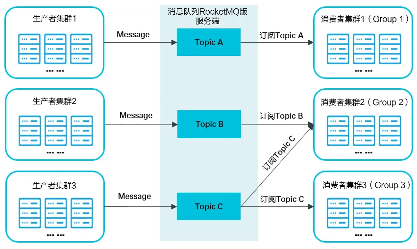
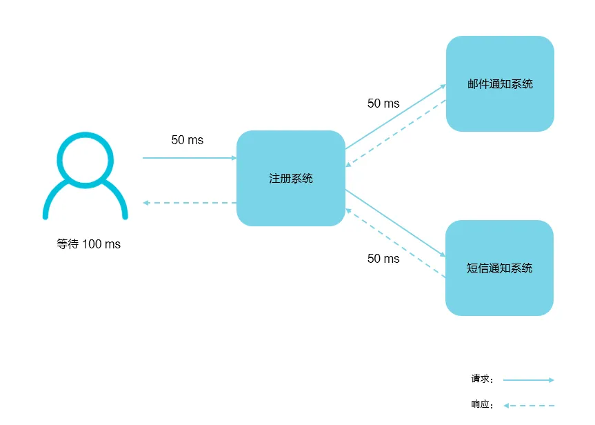
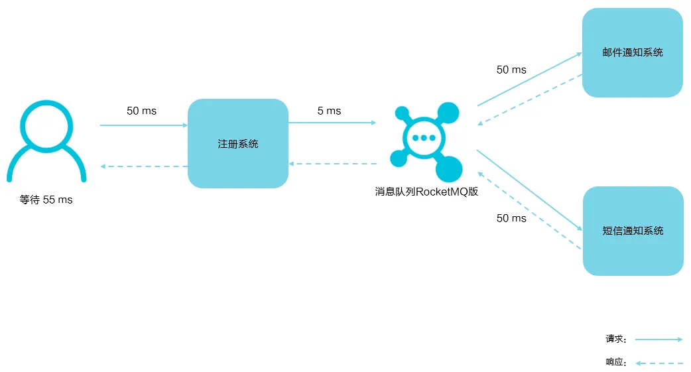
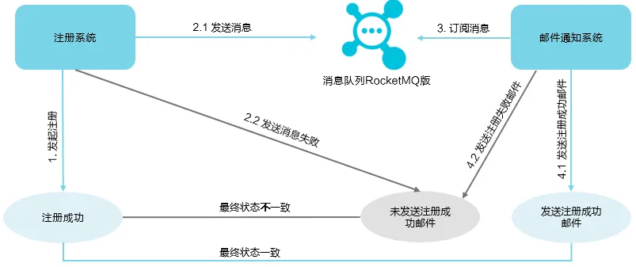
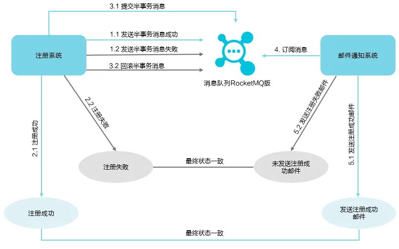

## 简介

RocketMQ是由阿里捐赠给Apache的一款低延迟、高并发、高可用、高可靠的分布式消息中间件。经历了淘宝双十一的洗礼。RocketMQ既可为分布式应用系统提供异步解耦和削峰填谷的能力，同时也具备互联网应用所需的海量消息堆积、高吞吐、可靠重试等特性。

## 核心概念

- **Topic**：消息主题，一级消息类型，生产者向其发送消息。

- **Message**：生产者向Topic发送并最终传送给消费者的数据消息的载体。

- **消息属性**：生产者可以为消息定义的属性，包含Message Key和Tag。

- **Message Key**：消息的业务标识，由消息生产者（Producer）设置，唯一标识某个业务逻辑。

- **Message ID**：消息的全局唯一标识，由消息队列RocketMQ系统自动生成，唯一标识某条消息。

- **Tag**：消息标签，二级消息类型，用来进一步区分某个Topic下的消息分类

- **Producer**：也称为消息发布者，负责生产并发送消息至Topic。

- **Consumer**：也称为消息订阅者，负责从Topic接收并消费消息。

- **分区**：即Topic Partition，物理上的概念。每个Topic包含一个或多个分区。

- **消费位点**：每个Topic会有多个分区，每个分区会统计当前消息的总条数，这个称为最大位点MaxOffset；分区的起始位置对应的位置叫做起始位点MinOffset。

- **Group**：一类生产者或消费者，这类生产者或消费者通常生产或消费同一类消息，且消息发布或订阅的逻辑一致。

- **Group ID**：Group的标识。

- **队列**：个Topic下会由一到多个队列来存储消息。

- **Exactly-Once投递语义**：Exactly-Once投递语义是指发送到消息系统的消息只能被Consumer处理且仅处理一次，即使Producer重试消息发送导致某消息重复投递，该消息在Consumer也只被消费一次。

- **集群消费**：一个Group ID所标识的所有Consumer平均分摊消费消息。例如某个Topic有9条消息，一个Group ID有3个Consumer实例，那么在集群消费模式下每个实例平均分摊，只消费其中的3条消息。

- **广播消费**：一个Group ID所标识的所有Consumer都会各自消费某条消息一次。例如某个Topic有9条消息，一个Group ID有3个Consumer实例，那么在广播消费模式下每个实例都会各自消费9条消息。

- **定时消息**：Producer将消息发送到消息队列RocketMQ服务端，但并不期望这条消息立马投递，而是推迟到在当前时间点之后的某一个时间投递到Consumer进行消费，该消息即定时消息。

- **延时消息**：Producer将消息发送到消息队列RocketMQ服务端，但并不期望这条消息立马投递，而是延迟一定时间后才投递到Consumer进行消费，该消息即延时消息。

- **事务消息**：RocketMQ提供类似X/Open XA的分布事务功能，通过消息队列RocketMQ的事务消息能达到分布式事务的最终一致。

- **顺序消息**：RocketMQ提供的一种按照顺序进行发布和消费的消息类型，分为全局顺序消息和分区顺序消息。

- **全局顺序消息**：对于指定的一个Topic，所有消息按照严格的先入先出（FIFO）的顺序进行发布和消费。

- **分区顺序消息**：对于指定的一个Topic，所有消息根据Sharding Key进行区块分区。同一个分区内的消息按照严格的FIFO顺序进行发布和消费。Sharding Key是顺序消息中用来区分不同分区的关键字段，和普通消息的Message Key是完全不同的概念。

- **消息堆积**：Producer已经将消息发送到消息队列RocketMQ的服务端，但由于Consumer消费能力有限，未能在短时间内将所有消息正确消费掉，此时在消息队列RocketMQ的服务端保存着未被消费的消息，该状态即消息堆积。

- **消息过滤**：Consumer可以根据消息标签（Tag）对消息进行过滤，确保Consumer最终只接收被过滤后的消息类型。消息过滤在消息队列RocketMQ的服务端完成。

- **消息轨迹**：在一条消息从Producer发出到Consumer消费处理过程中，由各个相关节点的时间、地点等数据汇聚而成的完整链路信息。通过消息轨迹，您能清晰定位消息从Producer发出，经由消息队列RocketMQ服务端，投递给Consumer的完整链路，方便定位排查问题。

- **重置消费位点**：以时间轴为坐标，在消息持久化存储的时间范围内（默认3天），重新设置Consumer对已订阅的Topic的消费进度，设置完成后Consumer将接收设定时间点之后由Producer发送到消息队列RocketMQ服务端的消息。

- **死信队列**：死信队列用于处理无法被正常消费的消息。当一条消息初次消费失败，消息队列RocketMQ会自动进行消息重试；达到最大重试次数后，若消费依然失败，则表明Consumer在正常情况下无法正确地消费该消息。此时，消息队列RocketMQ不会立刻将消息丢弃，而是将这条消息发送到该Consumer对应的特殊队列中。  消息队列RocketMQ将这种正常情况下无法被消费的消息称为死信消息（Dead-Letter Message），将存储死信消息的特殊队列称为死信队列（Dead-Letter Queue）。

## 消息收发模型

消息队列RocketMQ支持发布和订阅模型，消息生产者应用创建Topic并将消息发送到Topic。消费者应用创建对Topic的订阅以便从其接收消息。通信可以是一对多（扇出）、多对一（扇入）和多对多。具体通信如下图所示。

- **生产者集群**：用来表示发送消息应用，一个生产者集群下包含多个生产者实例，可以是多台机器，也可以是一台机器的多个进程，或者一个进程的多个生产者对象。  一个生产者集群可以发送多个Topic消息。发送分布式事务消息时，如果生产者中途意外宕机，消息队列RocketMQ服务端会主动回调生产者集群的任意一台机器来确认事务状态。

- **消费者集群**：用来表示消费消息应用，一个消费者集群下包含多个消费者实例，可以是多台机器，也可以是多个进程，或者是一个进程的多个消费者对象。一个消费者集群下的多个消费者以均摊方式消费消息。如果设置的是广播方式，那么这个消费者集群下的每个实例都消费全量数据。  一个消费者集群对应一个Group ID，一个Group ID可以订阅多个Topic，如上图中的Group 2所示。Group和Topic的订阅关系可以通过直接在程序中设置即可。

## 应用场景

- **削峰填谷**：诸如秒杀、抢红包、企业开门红等大型活动时皆会带来较高的流量脉冲，或因没做相应的保护而导致系统超负荷甚至崩溃，或因限制太过导致请求大量失败而影响用户体验，消息队列RocketMQ可提供削峰填谷的服务来解决该问题。

- **异步解耦**：交易系统作为淘宝和天猫主站最核心的系统，每笔交易订单数据的产生会引起几百个下游业务系统的关注，包括物流、购物车、积分、流计算分析等等，整体业务系统庞大而且复杂，消息队列RocketMQ可实现异步通信和应用解耦，确保主站业务的连续性。

- **顺序收发**：细数日常中需要保证顺序的应用场景非常多，例如证券交易过程时间优先原则，交易系统中的订单创建、支付、退款等流程，航班中的旅客登机消息处理等等。与先进先出FIFO（First In First Out）原理类似，消息队列RocketMQ提供的顺序消息即保证消息FIFO。

- **分布式事务一致性**：交易系统、支付红包等场景需要确保数据的最终一致性，大量引入消息队列RocketMQ的分布式事务，既可以实现系统之间的解耦，又可以保证最终的数据一致性。

- **大数据分析**：数据在“流动”中产生价值，传统数据分析大多是基于批量计算模型，而无法做到实时的数据分析，利用阿里云消息队列RocketMQ与流式计算引擎相结合，可以很方便的实现业务数据的实时分析。

- **分布式缓存同步**：天猫双11大促，各个分会场琳琅满目的商品需要实时感知价格变化，大量并发访问数据库导致会场页面响应时间长，集中式缓存因带宽瓶颈，限制了商品变更的访问流量，通过消息队列RocketMQ构建分布式缓存，实时通知商品数据的变化。

下文先以用户注册为场景说明消息队列RocketMQ如何实现以下功能：

- 异步解耦

- 分布式事务的数据一致性

- 消息的顺序收发

最后，再以电商的秒杀场景和价格同步场景分别说明消息队列RocketMQ所实现的削峰填谷和大规模机器的缓存同步。

### 异步解耦

#### 传统处理

最常见的一个场景是用户注册后，需要发送注册邮件和短信通知，以告知用户注册成功。传统的做法有以下两种：

**串行方式**

数据流动如下所述：

1. 您在注册页面填写账号和密码并提交注册信息，这些注册信息首先会被写入注册系统。

2. 注册信息写入注册系统成功后，再发送请求至邮件通知系统。邮件通知系统收到请求后向用户发送邮件通知。

3. 邮件通知系统接收注册系统请求后再向下游的短信通知系统发送请求。短信通知系统收到请求后向用户发送短信通知。

以上三个任务全部完成后，才返回注册结果到客户端，用户才能使用账号登录。  
假设每个任务耗时分别为50 ms，则用户需要在注册页面等待总共150 ms才能登录。

**并行方式**

数据流动如下所述：

1. 用户在注册页面填写账号和密码并提交注册信息，这些注册信息首先会被写入注册系统。

2. 注册信息写入注册系统成功后，再同时发送请求至邮件和短信通知系统。邮件和短信通知系统收到请求后分别向用户发送邮件和短信通知。

以上两个任务全部完成后，才返回注册结果到客户端，用户才能使用账号登录。  假设每个任务耗时分别为50 ms，其中，邮件和短信通知并行完成，则用户需要在注册页面等待总共100 ms才能登录。

#### 异步解耦

对于用户来说，注册功能实际只需要注册系统存储用户的账户信息后，该用户便可以登录，后续的注册短信和邮件不是即时需要关注的步骤。

对于注册系统而言，发送注册成功的短信和邮件通知并不一定要绑定在一起同步完成，所以实际当数据写入注册系统后，注册系统就可以把其他的操作放入对应的消息队列RocketMQ中然后马上返回用户结果，由消息队列RocketMQ异步地进行这些操作。

数据流动如下所述：

1. 用户在注册页面填写账号和密码并提交注册信息，这些注册信息首先会被写入注册系统。

2. 注册信息写入注册系统成功后，再发送消息至消息队列RocketMQ。消息队列RocketMQ会马上返回响应给注册系统，注册完成。用户可立即登录。

3. 下游的邮件和短信通知系统订阅消息队列RocketMQ的此类注册请求消息，即可向用户发送邮件和短信通知，完成所有的注册流程。

用户只需在注册页面等待注册数据写入注册系统和消息队列RocketMQ的时间，即等待55 ms即可登录。

异步解耦是消息队列RocketMQ的主要特点，主要目的是减少请求响应时间和解耦。主要的适用场景就是将比较耗时而且不需要即时（同步）返回结果的操作作为消息放入消息队列。同时，由于使用了消息队列RocketMQ，只要保证消息格式不变，消息的发送方和接收方并不需要彼此联系，也不需要受对方的影响，即解耦。

### 分布式事务的数据一致性

注册系统注册的流程中，用户入口在网页注册系统，通知系统在邮件系统，两个系统之间的数据需要保持最终一致。

#### 普通消息处理

如上所述，注册系统和邮件通知系统之间通过消息队列进行异步处理。注册系统将注册信息写入注册系统之后，发送一条注册成功的消息到消息队列RocketMQ，邮件通知系统订阅消息队列RocketMQ的注册消息，做相应的业务处理，发送注册成功或者失败的邮件。

流程说明如下：

1. 注册系统发起注册。

2. 注册系统向消息队列RocketMQ发送注册消息成功与否的消息。

2.1. 消息发送成功，进入3。

2.2. 消息发送失败，导致邮件通知系统未收到消息队列RocketMQ发送的注册成功与否的消               息，而无法发送邮件，最终邮件通知系统和注册系统之间的状态数据不一致。

3. 邮件通知系统收到消息队列RocketMQ的注册成功消息。

4. 邮件通知系统发送注册成功邮件给用户。

在这样的情况下，虽然实现了系统间的解耦，上游系统不需要关心下游系统的业务处理结果；但是数据一致性不好处理，如何保证邮件通知系统状态与注册系统状态的最终一致。

#### 事务消息处理

此时，需要利用消息队列RocketMQ所提供的事务消息来实现系统间的状态数据一致性。

流程说明如下：

1. 注册系统向消息队列RocketMQ发送半事务消息。

1.1. 半事务消息发送成功，进入2。

1.2. 半事务消息发送失败，注册系统不进行注册，流程结束。（最终注册系统与邮件通知系统数据一致）

2. 注册系统开始注册。

2.1. 注册成功，进入3.1。

2.2. 注册失败，进入3.2。

3. 注册系统向消息队列RocketMQ发送半消息状态。

3.1. 提交半事务消息，产生注册成功消息，进入4。

3.2. 回滚半事务消息，未产生注册成功消息，流程结束。  说明 最终注册系统与邮件通知系    统数据一致。

4. 邮件通知系统接收消息队列RocketMQ的注册成功消息。

5. 邮件通知系统发送注册成功邮件。（最终注册系统与邮件通知系统数据一致）关于分布式事务消息的更多详细内容，请参见事务消息。

### 消息的顺序收发

消息队列RocketMQ顺序消息分为两种情况：

- 全局顺序：对于指定的一个Topic，所有消息将按照严格的先入先出（FIFO）的顺序，进行顺序发布和顺序消费。

- 分区顺序：对于指定的一个Topic，所有消息根据Sharding Key进行区块分区，同一个分区内的消息将按照严格的FIFO的顺序，进行顺序发布和顺序消费，可以保证一个消息被一个进程消费。在注册场景中，可使用用户ID作为Sharding Key来进行分区，同一个分区下的新建、更新或删除注册信息的消息必须按照FIFO的顺序发布和消费。

### 削峰填谷

流量削峰也是消息队列RocketMQ的常用场景，一般在秒杀或团队抢购活动中使用广泛。

在秒杀或团队抢购活动中，由于用户请求量较大，导致流量暴增，秒杀的应用在处理如此大量的访问流量后，下游的通知系统无法承载海量的调用量，甚至会导致系统崩溃等问题而发生漏通知的情况。为解决这些问题，可在应用和下游通知系统之间加入消息队列RocketMQ。

秒杀处理流程如下所述：

1. 用户发起海量秒杀请求到秒杀业务处理系统。

2. 秒杀处理系统按照秒杀处理逻辑将满足秒杀条件的请求发送至消息队列RocketMQ。

3. 下游的通知系统订阅消息队列RocketMQ的秒杀相关消息，再将秒杀成功的消息发送到相应用户。

4. 用户收到秒杀成功的通知。

### 大规模机器的缓存同步

双十一大促时，各个分会场会有玲琅满目的商品，每件商品的价格都会实时变化。使用缓存技术也无法满足对商品价格的访问需求，缓存服务器网卡满载。访问较多次商品价格查询影响会场页面的打开速度。

此时需要提供一种广播机制，一条消息本来只可以被集群的一台机器消费，如果使用消息队列RocketMQ的广播消费模式，那么这条消息会被所有节点消费一次，相当于把价格信息同步到需要的每台机器上，取代缓存的作用。

## 系统部署架构

系统部署架构如下图所示。

图中所涉及到的概念如下所述：

- **Name Server**：是一个几乎无状态节点，可集群部署，在消息队列RocketMQ版中提供命名服务，更新和发现Broker服务。

- **Broker**：消息中转角色，负责存储消息，转发消息。分为Master Broker和Slave Broker，一个Master Broker可以对应多个Slave Broker，但是一个Slave Broker只能对应一个Master Broker。Broker启动后需要完成一次将自己注册至Name Server的操作；随后每隔30s定期向Name Server上报Topic路由信息。

- **生产者**：与Name Server集群中的其中一个节点（随机）建立长链接（Keep-alive），定期从Name Server读取Topic路由信息，并向提供Topic服务的Master Broker建立长链接，且定时向Master Broker发送心跳。

- **消费者**：与Name Server集群中的其中一个节点（随机）建立长连接，定期从Name Server拉取Topic路由信息，并向提供Topic服务的Master Broker、Slave Broker建立长连接，且定时向Master Broker、Slave Broker发送心跳。Consumer既可以从Master Broker订阅消息，也可以从Slave Broker订阅消息，订阅规则由Broker配置决定。