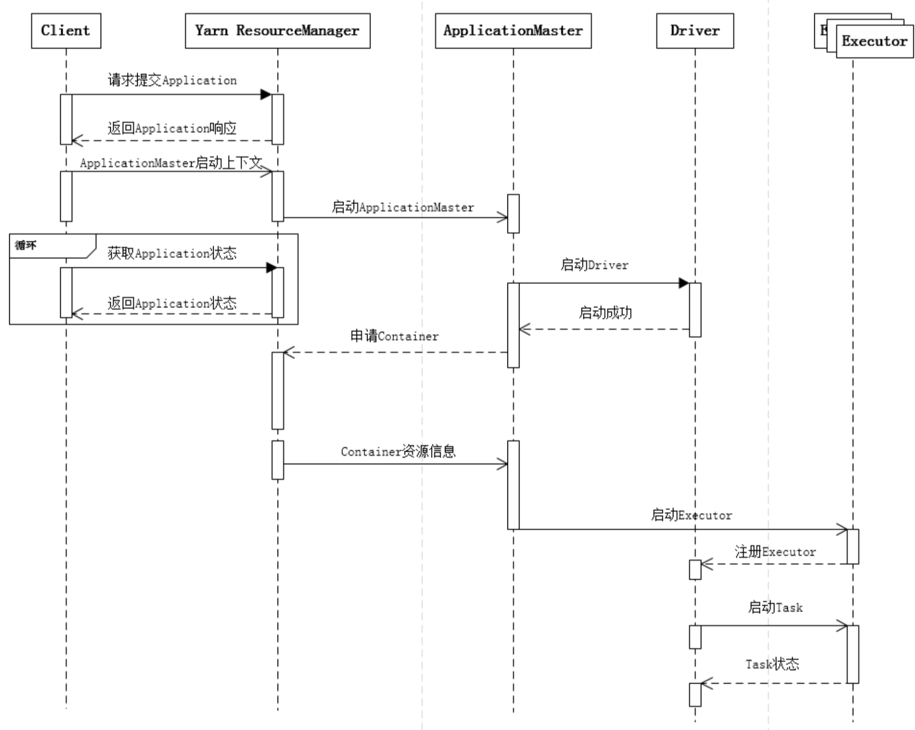

**1、什么是宽依赖，什么是窄依赖？哪些算子是宽依赖，哪些是窄依赖？**  
窄依赖就是一个父RDD分区对应一个子RDD分区，如map，filter  
或者多个父RDD分区对应一个子RDD分区，如co-partioned join

宽依赖是一个父RDD分区对应非全部的子RDD分区，如groupByKey，ruduceByKey  
或者一个父RDD分区对应全部的子RDD分区，如未经协同划分的join  

**2、Transformation和action算子有什么区别？举例说明**  
Transformation 变换/转换：这种变换并不触发提交作业，完成作业中间过程处理。Transformation 操作是延迟计算的，也就是说从一个RDD 转换生成另一个 RDD 的转换操作不是马上执行，需要等到有 Action 操作的时候才会真正触发运算

> map, filter

Action 行动算子：这类算子会触发 SparkContext 提交 Job 作业。  
Action 算子会触发 Spark 提交作业（Job）。

> count

**3、讲解spark shuffle原理和特性？shuffle write 和 shuffle read过程做些什么？**  


**4、Shuffle数据块有多少种不同的存储方式？分别是什么**

1.  RDD数据块：用来存储所缓存的RDD数据。
2.  Shuffle数据块：用来存储持久化的Shuffle数据。
3.  广播变量数据块：用来存储所存储的广播变量数据。
4.  任务返回结果数据块：用来存储在存储管理模块内部的任务返回结果。通常情况下任务返回结果随任务一起通过Akka返回到Driver端。但是当任务返回结果很大时，会引起Akka帧溢出，这时的另一种方案是将返回结果以块的形式放入存储管理模块，然后在Driver端获取该数据块即可，因为存储管理模块内部数据块的传输是通过Socket连接的，因此就不会出现Akka帧溢出了。
5.  流式数据块：只用在Spark Streaming中，用来存储所接收到的流式数据块

**5、哪些spark算子会有shuffle？**

1.  去重，distinct
2.  排序，groupByKey，reduceByKey等
3.  重分区，repartition，coalesce
4.  集合或者表操作，interection，join

**6、讲解spark schedule（任务调度）？**  



**7、Spark stage是如何划分的？**

1.  从hdfs中读取文件后，创建 RDD 对象
2.  DAGScheduler模块介入运算，计算RDD之间的依赖关系。RDD之间的依赖关系就形成了DAG
3.  每一个JOB被分为多个Stage，划分Stage的一个主要依据是当前计算因子的输入是否是确定的，如果是则将其分在同一个Stage，避免多个Stage之间的消息传递开销。

因此spark划分stage的整体思路是：从后往前推，遇到宽依赖就断开，划分为一个stage；遇到窄依赖就将这个RDD加入该stage中。

**8、Spark cache一定能提升计算性能么？说明原因？**  
不一定啊，cache是将数据缓存到内存里，当小数据量的时候是能提升效率，但数据大的时候内存放不下就会报溢出。

**9、Cache和persist有什么区别和联系？**  
cache调用了persist方法，cache只有一个默认的缓存级别MEMORY_ONLY ，而persist可以根据情况设置其它的缓存级别。  

**10、RDD是弹性数据集，“弹性”体现在哪里呢？你觉得RDD有哪些缺陷？**

1.  自动进行内存和磁盘切换
2.  基于lineage的高效容错
3.  task如果失败会特定次数的重试
4.  stage如果失败会自动进行特定次数的重试，而且只会只计算失败的分片
5.  checkpoint【每次对RDD操作都会产生新的RDD，如果链条比较长，计算比较笨重，就把数据放在硬盘中】和persist 【内存或磁盘中对数据进行复用】(检查点、持久化)
6.  数据调度弹性：DAG TASK 和资源管理无关
7.  数据分片的高度弹性repartion

缺陷：  
惰性计算的缺陷也是明显的：中间数据默认不会保存，每次动作操作都会对数据重复计算，某些计算量比较大的操作可能会影响到系统的运算效率

**11、RDD有多少种持久化方式？memory_only如果内存存储不了，会怎么操作？**  
cache和persist  
* memory_and_disk，放一部分到磁盘  
* MEMORY_ONLY_SER:同MEMORY_ONLY，但是会使用Java序列化方式，将Java对象序列化后进行持久化。可以减少内存开销，但是需要进行反序列化，因此会加大CPU开销。  
* MEMORY_AND_DSK_SER:同MEMORY_AND_DSK。但是使用序列化方式持久化Java对象。  
* DISK_ONLY:使用非序列化Java对象的方式持久化，完全存储到磁盘上。  
MEMORY_ONLY_2或者MEMORY_AND_DISK_2等：如果是尾部加了2的持久化级别，表示会将持久化数据复用一份，保存到其他节点，从而在数据丢失时，不需要再次计算，只需要使用备份数据即可。

**12、RDD分区和数据块有啥联系？**

**13、当GC时间占比很大可能的原因有哪些？对应的优化方法是？**  
垃圾回收的开销和对象合数成正比，所以减少对象的个数，就能大大减少垃圾回收的开销。序列化存储数据，每个RDD就是一个对象。缓存RDD占用的内存可能跟工作所需的内存打架，需要控制好

**14、Spark中repartition和coalesce异同？coalesce什么时候效果更高，为什么**

```less
repartition(numPartitions:Int):RDD[T]
coalesce(numPartitions:Int, shuffle:Boolean=false):RDD[T]
```

以上为他们的定义，区别就是repartition一定会触发shuffle，而coalesce默认是不触发shuffle的。

他们两个都是RDD的分区进行重新划分，repartition只是coalesce接口中shuffle为true的简易实现，（假设RDD有N个分区，需要重新划分成M个分区）

减少分区提高效率

**15、Groupbykey和reducebykey哪个性能更高，为什么？**  
reduceByKey性能高，更适合大数据集  

**16、你是如何理解caseclass的？**  

**17、Scala里trait有什么功能，与class有何异同？什么时候用trait什么时候该用class**  
它可以被继承，而且支持多重继承，其实它更像我们熟悉的接口（interface），但它与接口又有不同之处是：  
trait中可以写方法的实现，interface不可以（java8开始支持接口中允许写方法实现代码了），这样看起来trait又很像抽象类

**18、Scala 语法中to 和 until有啥区别**  
to 包含上界，until不包含上界

**19、讲解Scala伴生对象和伴生类**  
单例对象与类同名时，这个单例对象被称为这个类的伴生对象，而这个类被称为这个单例对象的伴生类。伴生类和伴生对象要在同一个源文件中定义，伴生对象和伴生类可以互相访问其私有成员。不与伴生类同名的单例对象称为孤立对象。

```sql

import scala.collection.mutable.Map
 
class ChecksumAccumulator {
  private var sum = 0
  def add(b: Byte) {
    sum += b
  }
  def checksum(): Int = ~(sum & 0xFF) + 1
}
 
object ChecksumAccumulator {
  private val cache = Map[String, Int]()
  def calculate(s: String): Int =
    if (cache.contains(s))
    cache(s)
  else {
      val acc = new ChecksumAccumulator
      for (c <- s)
        acc.add(c.toByte)
      val cs = acc.checksum()
      cache += (s -> cs)
      println("s:"+s+" cs:"+cs)
      cs
    }
 
  def main(args: Array[String]) {
    println("Java 1:"+calculate("Java"))
    println("Java 2:"+calculate("Java"))
    println("Scala :"+calculate("Scala"))
  }
}
```

**20、spark作业执行流程**

1.  客户端提交作业
2.  Driver启动流程
3.  Driver申请资源并启动其余Executor(即Container)
4.  Executor启动流程
5.  作业调度，生成stages与tasks。
6.  Task调度到Executor上，Executor启动线程执行Task逻辑
7.  Driver管理Task状态
8.  Task完成，Stage完成，作业完成