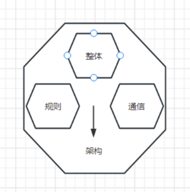
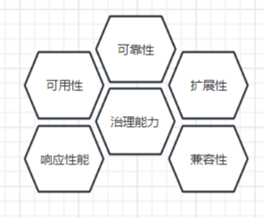
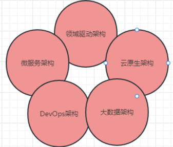
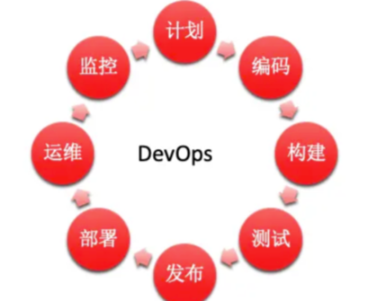
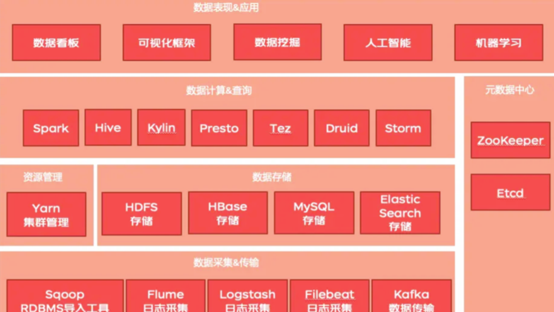

## 架构的本质

其实总结下来就一句话：**架构本质上其实就是一种指导型的约束，约定整体和部分、部分和部分之间的关系，以使整体更加稳定，更加可靠。
**

分为三部分：

* 整体：部分的组成，强调合力。
* 规则：强调部分之前有关联关系，有规则，有约束。
* 通信：强调部分之间有往来，有交互。

## 架构的分类

实际上架构有很多种类型，比如业务架构，应用架构，技术架构，数据架构等，甚至单个架构，我们站在不同的角度上，也会有不同的看法，其中的复杂度也是各不一样的。

## 业务架构

业务架构是指企业或机构的业务逻辑、流程、组织结构等方面的设计。它着重于企业业务运营的需求和目标，将业务需求转化为技术解决方案。业务架构的设计需要考虑企业的战略规划、组织结构、业务流程、客户需求等多个方面。

例如：一个银行的业务架构设计需要考虑银行的基本业务逻辑、流程和组织结构，如存款、贷款、投资、支付等，以及银行的安全性、可靠性和效率等方面的需求。

## 应用架构

应用架构是指企业或机构的信息系统中的应用程序、系统、服务等方面的设计。它着重于解决企业业务运营中的具体问题，将业务需求转化为具体的应用程序。应用架构的设计需要考虑企业的业务需求、用户体验、系统性能、安全风险等多个方面。

例如：一个电商网站的应用架构设计需要考虑用户购物、订单管理、库存管理、支付等多个应用程序的设计，以及这些应用程序之间的交互和集成。

## 技术架构

技术架构是指企业或机构的信息系统中的技术实现、系统架构、软件设计等方面的设计。它着重于解决企业业务运营中的技术问题，如系统的稳定性、可扩展性、可维护性等。

例如：一个电商网站的技术架构设计需要考虑系统的负载均衡、容错容灾、CDN缓存、自动化部署等多个方面的技术实现。

## 数据架构

数据架构是指企业或机构的信息系统中的数据存储、数据处理、数据安全等方面的设计。它着重于解决企业业务运营中的数据问题，如数据的一致性、完整性、安全性等。

例如：一个电商网站的数据架构设计需要考虑数据的分层存储、数据备份和恢复、数据加密和权限管理等多个方面的设计，以确保数据的安全和可靠性。

## 架构设计要考虑的因素

架构设计过程中我们要考虑的因素，整体可以分为两大类，一类是功能性因素，一类是非功能性因素。

## 功能性因素

无论什么架构设计，我们首先是要考虑必须满足我们的业务需求，否则我们的设计都是空中楼阁。功能需求会直接决定我们的业务架构设计。所以我们的架构必须完整性地，正确地对业务实现支撑。

## 非功能性因素

满足了功能性因素以后，我们就得要考虑怎么能够稳定地，可靠地，可持续性地支持我们的业务功能，比如性能，可靠性，扩展性，兼容性等等。

* 可靠性
    * 为了更好的服务于功能，我们需要确保架构能够稳定、高效的运行。不会时不时的出现服务崩溃或者不可用的情况。
* 可用性
    * 同样的，服务对外要始终处于可用的状态，即使单个服务实例出现问题，我们依然可以正常的对外提供服务。
* 扩展性
    * 功能性需求不是一层不变的，尤其在当今盛行敏捷的时代，需求不是一次性提出的。我们需要对系统、服务的整体能力有全面的定位和把控。这就需要我们的架构在新的需求出现的时候，可以方便的进行扩展支持。
* 治理能力
    * 好的架构一定是方便运营、管理和监控的。甚至微观到工程管理，代码一定是易于维护、扩展、协同的。
* 响应性能
    * 一般的，功能性需求都会对性能有一定的预期。这个业务要我们在架构上做很多工作，比如读写分离、缓存、异步等等的介入，以满足整体架构的响应能力。

## 设计原则

* 价值为王：系统架构设计应该以实现业务价值为目标，始终关注用户需求和业务场景，确保设计出的系统能够满足用户需求和业务场景，为企业创造价值。
* 以终为始：在进行系统架构设计时，需要明确系统的目标和愿景，并以此为起点，进行设计和实现。以确保系统的设计和实现都是为了实现业务价值，满足用户需求。
* 分治原则：将系统划分为多个子系统或模块，每个子系统或模块都可以独立地进行开发、测试、部署和维护。这样可以降低系统的复杂度，提高系统的可维护性和可扩展性。
* 服务自治：每个服务都应该具备独立的能力，能够独立地进行开发、测试、部署和维护。这样可以提高服务的可用性和可靠性，降低系统的耦合度。
* 拥抱变化：系统架构设计应该能够适应业务需求的变化和市场的变化，具备快速响应和灵活应变的能力。
* 系统安全性：系统架构设计应该充分考虑系统的安全性，包括数据安全、应用安全、系统安全等方面，确保系统的安全性和稳定性。
* 不作不死：系统架构设计应该遵循“最小化变更范围”原则，避免过度设计和复杂度的出现，从而提高系统的可维护性和可扩展性。

## 常见的架构设计方案

之前比较流行的是MVC，MVC有很多的优点，但是缺点也不少：

* 视图与控制器的连接过紧，视图如果不依赖控制器，那么它的应用就会十分有限，这妨碍了他们的独立。
* 模型对视图数据的访问效率较低，工作量大，并且有一些高级的界面工具或构造器不支持MVC框架。
* MVC架构使得我们面向视图开发，但是视图的变化是不可控的，容易受到用户主观的影响。同时复杂系统必然存在纷繁复杂的依赖，依赖不可能存在于视图，最终表现为接口依赖。

所以现在比较流行如下几种方案：

## 领域驱动架构

领域驱动设计是通过将软件实现与核心业务概念的演进紧密相连，从而实现复杂需求的软件开发方法。

领域驱动设计包括三要素：

* 专业知识：就是前期在与客户沟通需求过程中，学习到的关于业务方面的知识。 这类知识并不仅仅只是对需求的理解，更多的要思考业务需求实际要解决的是什么问题。
* 抽象能力：一般指发现核心业务对象，简化问题空间的能力。
* 细分问题：把业务问题细化为更小更容易处理的子问题。
  领域驱动设计，使得我们不再用数据进行驱动，而是使用领域进行驱动。遇到问题，我们先进行领域上的划分和拆解。这个问题属于哪个问题域，或者需要拆解到哪些问题域里面去，然后再通过领域的组合以及依赖，完成最终问题的解决。

## 微服务架构

微服务架构是一种软件开发架构，它将应用程序拆分成小型、独立的微服务，每个微服务都有自己的功能集，并运行在其独立的进程中。

微服务架构有以下优点：

* 开发人员可以只关注整个结构中的其中某一层，可以很容易的用新的实现来替换原有层次的实现，可以降低层与层之间的依赖，有利于标准化。
* 有利于各层逻辑的复用，如PetShop可经过简单的配置实现Sqlserver和Oracle之间的转换。
* 扩展性强，不同层负责不同的层面，有利于系统的扩展和维护。
* 安全性高，用户端只能通过逻辑层来访问数据层，减少了入口点，把很多危险的系统功能都屏蔽了。
* 项目结构更清楚，分工更明确，有利于后期的维护和升级。

## 云原生架构

云原生架构是一种创新的软件开发方法，专为充分利用云计算模型而设计。

云原生架构通过结合使用云计算和各种云服务来创建具有更大可扩展性的可定制模块化基础架构，从而提高了团队的效率，生产力和协作能力。

云原生架构的核心原则：

* 云原生架构是一种设计方法，利用AWS等EC2，S3，Lambda等云服务来支持动态，敏捷的应用程序开发技术，这些技术采用模块化方法通过一套基于云的套件来构建，运行和更新软件微服务与整体应用程序基础架构。
* 微服务和容器化通过简化云提供商之间的转移或独立地以不同的语言或框架部署服务而没有冲突或停机的情况，从而支持云本机应用程序的敏捷性和动态性。
* 将微服务架构集成到应用程序开发中可支持协作，效率和生产力，因为DevOps团队能够同时独立处理应用程序的不同组件或实现新功能而又不牺牲稳定性。

## DevOps架构

DevOps架构，它旨在加强软件产品开发与交付过程中的协作、自动化、持续性和监控等方面，以实现更高效、更迅速和更可靠的软件交付。

DevOps通常包括以下核心组成部分：

* 持续集成：将代码频繁地集成到一个共享的代码库中，并对代码进行自动化测试，以确保代码质量和稳定性，并及时发现和解决错误。
* 持续交付：通过自动化测试、构建、部署和运行环节，实现快速、可靠和可重复的软件发布，从而减少手动操作和人工干预带来的错误和风险。
* 自动化运维：将基础设施的管理、配置和维护工作自动化，并将其作为代码、脚本或配置文件存储在版本控制系统中，以便快速搭建、复制和修改环境。
* 容器化技术：使用容器化技术（如Docker）将应用程序和其依赖项打包成独立的、可移植的容器，在不同的环境中快速部署和运行。
* 监控和日志分析：通过对软件运行时数据进行采集、储存、分析和可视化，监控系统状态、性能和安全等方面的指标，并及时发现和修复问题。

## 大数据架构

大数据架构是一种面向海量数据、高并发、高可靠、高性能的计算和存储系统架构，用于管理和处理大规模的结构化、半结构化和非结构化数据。它具有以下几个特点：

* 高可扩展性：大数据架构应该能够轻松地扩展到海量数据和高并发请求下。
* 高容错性：大数据架构应该在硬件、网络和软件故障等异常情况下保证系统稳定性。
* 实时计算：大数据架构需要支持实时计算和流式处理，以满足复杂的业务场景。
* 数据安全：大数据架构需要保证数据的机密性、完整性和可用性，避免数据泄露和损坏。
* 成本效益：大数据架构应该充分考虑成本问题，尽可能利用开源技术和云平台来降低系统运维和资源开销。
  比如常见的大数据架构包括`Hadoop、Spark、Storm、Kafka`
  等开源软件，它们可以被组合在一起形成一个完整的数据处理流水线。例如，Hadoop可以提供分布式文件系统HDFS和MapReduce计算模型，Spark可以提供内存计算和机器学习功能，Storm可以提供实时数据处理功能，Kafka可以提供高可靠的消息队列服务。使用这些开源软件和云平台，企业可以构建出适合自己场景的大数据处理系统，提升自身的业务竞争力。
