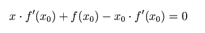
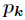

最优化方法是一种数学方法，它是研究在给定约束之下如何寻求某些因素(的量)，以使某一(或某些)指标达到最优的一些学科的总称。在学习机器学习的过程中我们发现，大部分的机器学习算法的本质都是建立优化模型，通过最优化方法对目标函数（或损失函数）进行优化，从而训练出最好的模型。常见的最优化方法有梯度下降法、牛顿法和拟牛顿法、共轭梯度法、拉格朗日数乘法等等。

### 1. 梯度下降法（Gradient Descent）

梯度下降法是最早最简单，也是最为常用的最优化方法。梯度下降法实现简单，当目标函数是凸函数时，梯度下降法的解是全局解。一般情况下，其解不保证是全局最优解，梯度下降法的速度也未必是最快的。**梯度下降法的优化思想是用当前位置负梯度方向作为搜索方向，因为该方向为当前位置的最快下降方向，所以也被称为是”最速下降法“。最速下降法越接近目标值，步长越小，前进越慢。**梯度下降法的搜索迭代示意图如下图所示：

**梯度下降法的缺点：**

**（1）靠近极小值时收敛速度减慢，如下图所示；**

**（2）直线搜索时可能会产生一些问题；**

**（3）可能会“之字形”地下降。**

从上图可以看出，梯度下降法在接近最优解的区域收敛速度明显变慢，利用梯度下降法求解需要很多次的迭代。

在机器学习中，基于基本的梯度下降法发展了两种梯度下降方法，分别为随机梯度下降法和批量梯度下降法。

比如对一个线性回归（Linear Logistics）模型，假设下面的h(x)是要拟合的函数，J(theta)为损失函数，theta是参数，要迭代求解的值，theta求解出来了那最终要拟合的函数h(theta)就出来了。其中m是训练集的样本个数，n是特征的个数。

**1）批量梯度下降法（Batch Gradient Descent，BGD）**

（1）将J(theta)对theta求偏导，得到每个theta对应的的梯度：

（2）由于是要最小化风险函数，所以按每个参数theta的梯度负方向，来更新每个theta：

（3）从上面公式可以注意到，它得到的是一个全局最优解，但是每迭代一步，都要用到训练集所有的数据，如果m很大，那么可想而知这种方法的迭代速度会相当的慢。所以，这就引入了另外一种方法——随机梯度下降。

对于批量梯度下降法，样本个数m，x为n维向量，一次迭代需要把m个样本全部带入计算，迭代一次计算量为m*n2。

**2）随机梯度下降（Stochastic Gradient Descent，SGD）**

（1）上面的风险函数可以写成如下这种形式，损失函数对应的是训练集中每个样本的粒度，而上面批量梯度下降对应的是所有的训练样本：

（2）每个样本的损失函数，对theta求偏导得到对应梯度，来更新theta：

（3）随机梯度下降是通过每个样本来迭代更新一次，如果样本量很大的情况（例如几十万），那么可能只用其中几万条或者几千条的样本，就已经将theta迭代到最优解了，对比上面的批量梯度下降，迭代一次需要用到十几万训练样本，一次迭代不可能最优，如果迭代10次的话就需要遍历训练样本10次。但是，SGD伴随的一个问题是噪音较BGD要多，使得SGD并不是每次迭代都向着整体最优化方向。

随机梯度下降每次迭代只使用一个样本，迭代一次计算量为n2，当样本个数m很大的时候，随机梯度下降迭代一次的速度要远高于批量梯度下降方法。**两者的关系可以这样理解：随机梯度下降方法以损失很小的一部分精确度和增加一定数量的迭代次数为代价，换取了总体的优化效率的提升。增加的迭代次数远远小于样本的数量。**

**对批量梯度下降法和随机梯度下降法的总结：**

**批量梯度下降---最小化所有训练样本的损失函数，使得最终求解的是全局的最优解，即求解的参数是使得风险函数最小，但是对于大规模样本问题效率低下。**

**随机梯度下降---最小化每条样本的损失函数，虽然不是每次迭代得到的损失函数都向着全局最优方向， 但是大的整体的方向是向全局最优解的，最终的结果往往是在全局最优解附近，适用于大规模训练样本情况。**

### 2. 牛顿法和拟牛顿法（Newton's method & Quasi-Newton Methods）

**1）牛顿法（Newton's method）**

牛顿法是一种在实数域和复数域上近似求解方程的方法。方法使用函数_f_ (_x_)的泰勒级数的前面几项来寻找方程_f_ (_x_) = 0的根。牛顿法最大的特点就在于它的收敛速度很快。

## 具体步骤：

首先，选择一个接近函数 _f_ (_x_)零点的 _x_0，计算相应的 _f_ (_x_0) 和切线斜率_f  '_ (_x_0)（这里_f '_ 表示函数 _f_  的导数）。然后我们计算穿过点(_x_0,  _f_  (_x_0)) 并且斜率为_f_ '(_x_0)的直线和 _x_ 轴的交点的_x_坐标，也就是求如下方程的解：

我们将新求得的点的 _x_ 坐标命名为_x_1，通常_x_1会比_x_0更接近方程_f_  (_x_) = 0的解。因此我们现在可以利用_x_1开始下一轮迭代。迭代公式可化简为如下所示：

已经证明，如果_f_  ' 是连续的，并且待求的零点_x_是孤立的，那么在零点_x_周围存在一个区域，只要初始值_x_0位于这个邻近区域内，那么牛顿法必定收敛。 并且，如果_f_  ' (_x_)不为0, 那么牛顿法将具有平方收敛的性能. 粗略的说，这意味着每迭代一次，牛顿法结果的有效数字将增加一倍。下图为一个牛顿法执行过程的例子。

由于牛顿法是基于当前位置的切线来确定下一次的位置，所以牛顿法又被很形象地称为是"切线法"。牛顿法的搜索路径（二维情况）如下图所示：

牛顿法搜索动态示例图：

**关于牛顿法和梯度下降法的效率对比：**

**从本质上去看，牛顿法是二阶收敛，梯度下降是一阶收敛，所以牛顿法就更快。如果更通俗地说的话，比如你想找一条最短的路径走到一个盆地的最底部，梯度下降法每次只从你当前所处位置选一个坡度最大的方向走一步，牛顿法在选择方向时，不仅会考虑坡度是否够大，还会考虑你走了一步之后，坡度是否会变得更大。所以，可以说牛顿法比梯度下降法看得更远一点，能更快地走到最底部。（牛顿法目光更加长远，所以少走弯路；相对而言，梯度下降法只考虑了局部的最优，没有全局思想。）**

**根据wiki上的解释，从几何上说，牛顿法就是用一个二次曲面去拟合你当前所处位置的局部曲面，而梯度下降法是用一个平面去拟合当前的局部曲面，通常情况下，二次曲面的拟合会比平面更好，所以牛顿法选择的下降路径会更符合真实的最优下降路径。**

注：红色的牛顿法的迭代路径，绿色的是梯度下降法的迭代路径。

**牛顿法的优缺点总结：**

**优点：二阶收敛，收敛速度快；**

**缺点：牛顿法是一种迭代算法，每一步都需要求解目标函数的Hessian矩阵的逆矩阵，计算比较复杂。**

**2）拟牛顿法（Quasi-Newton Methods）**

拟牛顿法是求解非线性优化问题最有效的方法之一，于20世纪50年代由美国Argonne国家实验室的物理学家W.C.Davidon所提出来。Davidon设计的这种算法在当时看来是非线性优化领域最具创造性的发明之一。不久R. Fletcher和M. J. D. Powell证实了这种新的算法远比其他方法快速和可靠，使得非线性优化这门学科在一夜之间突飞猛进。

**拟牛顿法的本质思想是改善牛顿法每次需要求解复杂的Hessian矩阵的逆矩阵的缺陷，它使用正定矩阵来近似Hessian矩阵的逆，从而简化了运算的复杂度。**拟牛顿法和最速下降法一样只要求每一步迭代时知道目标函数的梯度。通过测量梯度的变化，构造一个目标函数的模型使之足以产生超线性收敛性。这类方法大大优于最速下降法，尤其对于困难的问题。另外，因为拟牛顿法不需要二阶导数的信息，所以有时比牛顿法更为有效。如今，优化软件中包含了大量的拟牛顿算法用来解决无约束，约束，和大规模的优化问题。

**具体步骤：**

拟牛顿法的基本思想如下。首先构造目标函数在当前迭代xk的二次模型：

这里Bk是一个对称正定矩阵，于是我们取这个二次模型的最优解作为搜索方向，并且得到新的迭代点：

其中我们要求步长ak 满足Wolfe条件。这样的迭代与牛顿法类似，区别就在于用近似的Hesse矩阵Bk  

代替真实的Hesse矩阵。所以拟牛顿法最关键的地方就是每一步迭代中矩阵Bk

的更新。现在假设得到一个新的迭代xk+1，并得到一个新的二次模型：

我们尽可能地利用上一步的信息来选取Bk。具体地，我们要求 

从而得到

这个公式被称为割线方程。常用的拟牛顿法有DFP算法和BFGS算法。

### 3. 共轭梯度法（Conjugate Gradient）

**共轭梯度法是介于最速下降法与牛顿法之间的一个方法，它仅需利用一阶导数信息，但克服了最速下降法收敛慢的缺点，又避免了牛顿法需要存储和计算Hesse矩阵并求逆的缺点，共轭梯度法不仅是解决大型线性方程组最有用的方法之一，也是解大型非线性最优化最有效的算法之一。** 在各种优化算法中，共轭梯度法是非常重要的一种。其优点是所需存储量小，具有步收敛性，稳定性高，而且不需要任何外来参数。

具体的实现步骤请参加wiki百科共轭梯度法。

下图为共轭梯度法和梯度下降法搜索最优解的路径对比示意图：

注：绿色为梯度下降法，红色代表共轭梯度法

### 4. 启发式优化方法

启发式方法指人在解决问题时所采取的一种根据经验规则进行发现的方法。其特点是在解决问题时,利用过去的经验,选择已经行之有效的方法，而不是系统地、以确定的步骤去寻求答案。启发式优化方法种类繁多，包括经典的模拟退火方法、遗传算法、蚁群算法以及粒子群算法等等。

还有一种特殊的优化算法被称之多目标优化算法，它主要针对同时优化多个目标（两个及两个以上）的优化问题，这方面比较经典的算法有NSGAII算法、MOEA/D算法以及人工免疫算法等。

###  5. 解决约束优化问题——拉格朗日乘数法

### 5.1 拉格朗日乘数法的基本思想

**作为一种优化算法，拉格朗日乘子法主要用于解决约束优化问题，它的基本思想就是通过引入拉格朗日乘子来将含有n个变量和k个约束条件的约束优化问题转化为含有（n+k）个变量的无约束优化问题。拉格朗日乘子背后的数学意义是其为约束方程梯度线性组合中每个向量的系数。**

**如何将一个**含有n个变量和k个约束条件的约束优化问题转化为含有（n+k）个变量的无约束优化问题？拉格朗日乘数法从数学意义入手，通过引入拉格朗日乘子建立极值条件，对n个变量分别求偏导对应了n个方程，然后加上k个约束条件（对应k个拉格朗日乘子）一起构成包含了（n+k）变量的（n+k）个方程的方程组问题，这样就能根据求方程组的方法对其进行求解。****

解决的问题模型为约束优化问题：

**min/max a function f(x,y,z), where x,y,z are not independent and g(x,y,z)=0.**

**即：min/max f(x,y,z)**

**s.t. g(x,y,z)=0**

### 5.2 数学实例

首先，我们先以麻省理工学院数学课程的一个实例来作为介绍拉格朗日乘数法的引子。

【麻省理工学院数学课程实例】求双曲线xy=3上离远点最近的点。

解：

首先，我们根据问题的描述来提炼出问题对应的数学模型，即：

min f(x,y)=x2+y2（两点之间的欧氏距离应该还要进行开方，但是这并不影响最终的结果，所以进行了简化，去掉了平方）

s.t. xy=3.

根据上式我们可以知道这是一个典型的约束优化问题，其实我们在解这个问题时最简单的解法就是通过约束条件将其中的一个变量用另外一个变量进行替换，然后代入优化的函数就可以求出极值。我们在这里为了引出拉格朗日乘数法，所以我们采用拉格朗日乘数法的思想进行求解。

我们将x2+y2=c的曲线族画出来，如下图所示，当曲线族中的圆与xy=3曲线进行相切时，切点到原点的距离最短。也就是说，当f(x,y)=c的等高线和双曲线g(x,y)相切时，我们可以得到上述优化问题的一个极值（注意：如果不进一步计算，在这里我们并不知道是极大值还是极小值）。

现在原问题可以转化为求当f(x,y)和g(x,y)相切时，x,y的值是多少？

如果两个曲线相切，那么它们的切线相同，即法向量是相互平行的，▽f//▽g.

由▽f//▽g可以得到，▽f=λ*▽g。

这时，我们将原有的约束优化问题转化为了一种对偶的无约束的优化问题，如下所示：

**原问题：**min f(x,y)=x2+y2              **对偶问题：**由▽f=λ*▽g得，

s.t. xy=3                                       fx=λ*gx，

fy=λ*gy，

xy=3.

约束优化问题                                   无约束方程组问题

通过求解右边的方程组我们可以获取原问题的解，即

2x=λ*y

2y=λ*x

xy=3

通过求解上式可得，λ=2或者是-2；当λ=2时，(x,y)=(sqrt(3), sqrt(3))或者(-sqrt(3), -sqrt(3))，而当λ=-2时，无解。所以原问题的解为(x,y)=(sqrt(3), sqrt(3))或者(-sqrt(3), -sqrt(3))。

通过举上述这个简单的例子就是为了体会拉格朗日乘数法的思想，即通过引入拉格朗日乘子(λ)将原来的约束优化问题转化为无约束的方程组问题。

### 5.3 拉格朗日乘数法的基本形态

**求函数在满足下的条件极值，可以转化为函数的无条件极值问题。**

我们可以画图来辅助思考。

绿线标出的是约束g(x,y)=c的点的轨迹。蓝线是f(x,y)的等高线。箭头表示斜率，和等高线的法线平行。

从图上可以直观地看到在最优解处，f和g的斜率平行。

▽[f(x,y)+λ(g(x,y)−1)]=0, λ≠0

一旦求出λ的值，将其套入下式，易求在无约束极值和极值所对应的点。

F(x,y)=f(x,y)+λ(g(x,y)−c)

新方程F(x,y)在达到极值时与f(x,y)相等，因为F(x,y)达到极值时g(x,y)−c总等于零。

上述式子取得极小值时其导数为0，即▽f(x)+▽∑λigi(x)=0，也就是说f(x)和g(x)的梯度共线。

**题目1：**

给定椭球

求这个椭球的内接长方体的最大体积。这个问题实际上就是条件极值问题，即在条件   

    

下，求的最大值。

当然这个问题实际可以先根据条件消去，然后带入转化为无条件极值问题来处理。但是有时候这样做很困难，甚至是做不到的，这时候就需要用**拉格朗日乘数法**了。通过拉格朗日乘数法将问题转化为

对求偏导得到

联立前面三个方程得到和，带入第四个方程解之

带入解得最大体积为

拉格朗日乘数法对一般多元函数在多个附加条件下的条件极值问题也适用。

**题目2：**

**题目：**求离散分布的最大熵。

**分析：**因为离散分布的熵表示如下

而约束条件为

要求函数的最大值，根据**拉格朗日乘数法**，设

对所有的求偏导数，得到

计算出这个等式的微分，得到

这说明所有的都相等，最终解得

因此，使用**均匀分布**可得到最大熵的值。

### 5.4 拉格朗日乘数法与KKT条件

我们上述讨论的问题均为等式约束优化问题，但等式约束并不足以描述人们面临的问题，不等式约束比等式约束更为常见，大部分实际问题的约束都是不超过多少时间，不超过多少人力，不超过多少成本等等。所以有几个科学家拓展了拉格朗日乘数法，增加了KKT条件之后便可以用拉格朗日乘数法来求解不等式约束的优化问题了。

首先，我们先介绍一下什么是KKT条件。

**KKT条件是指在满足一些有规则的条件下, 一个非线性规划(Nonlinear Programming)问题能有最优化解法的一个必要和充分条件.** 这是一个广义化拉格朗日乘数的成果. 一般地, 一个最优化数学模型的列标准形式参考开头的式子, 所谓 Karush-Kuhn-Tucker 最优化条件，就是指上式的最优点x∗必须满足下面的条件:

1). 约束条件满足gi(x∗)≤0,i=1,2,…,p, 以及,hj(x∗)=0,j=1,2,…,q

2). ∇f(x∗)+∑i=1μi∇gi(x∗)+∑j=1λj∇hj(x∗)=0, 其中∇为梯度算子;

3). λj≠0且不等式约束条件满足μi≥0,μigi(x∗)=0,i=1,2,…,p。

KKT条件第一项是说最优点x∗必须满足所有等式及不等式限制条件, 也就是说最优点必须是一个可行解, 这一点自然是毋庸置疑的. 第二项表明在最优点x∗, ∇f必须是∇gi和∇hj的线性組合, μi和λj都叫作拉格朗日乘子. 所不同的是不等式限制条件有方向性, 所以每一个μi都必须大于或等于零, 而等式限制条件没有方向性，所以λj没有符号的限制, 其符号要视等式限制条件的写法而定.

**为了更容易理解，我们先举一个例子来说明一下KKT条件的由来。**

let L(x,μ)=f(x)+∑k=1μkgk(x)，其中μk≥0,gk(x)≤0

∵μk≥0 gk(x)≤0  =>  μg(x)≤0

∴maxμL(x,μ)=f(x)                  (2)

∴minxf(x)=minxmaxμL(x,μ)     (3)

maxμminxL(x,μ)=maxμ[minxf(x)+minxμg(x)]=maxμminxf(x)+maxμminxμg(x)=minxf(x)+maxμminxμg(x)

又∵μk≥0, gk(x)≤0

∴maxμminxμg(x)=0, 此时μ=0 or g(x)=0.

∴maxμminxL(x,μ)=minxf(x)+maxμminxμg(x)=minxf(x)      (4)

此时μ=0 or g(x)=0.

联合(3),(4)我们得到minxmaxμL(x,μ)=maxμminxL(x,μ), 亦即

minxmaxμL(x,μ)=maxμminxL(x,μ)=minxf(x)

我们把maxμminxL(x,μ)称为原问题minxmaxμL(x,μ)的对偶问题，上式表明当满足一定条件时原问题、对偶的解、以及minxf(x)是相同的，且在最优解x∗处μ=0 or g(x∗)=0。把x∗代入(2)得maxμL(x∗,μ)=f(x∗)，由(4)得maxμminxL(x,μ)=f(x∗)，所以L(x∗,μ)=minxL(x,μ)，这说明x∗也是L(x,μ)的极值点，即

最后总结一下：

KKT条件是拉格朗日乘子法的泛化，如果我们把等式约束和不等式约束一并纳入进来则表现为：

注：x,λ,μ都是向量。

表明f(x)在极值点x∗处的梯度是各个hi(x∗)和gk(x∗)梯度的线性组合。
