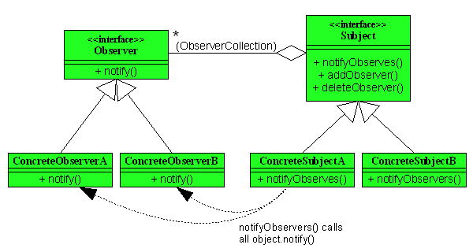

## 概述

定义了对象之间的一对多依赖，这样一来，当一个对象改变状态时，它的所有依赖者都会收到通知并自动更新。

**介绍**：Java观察者模式是一种行为设计模式，它定义了一种一对多的依赖关系，当一个对象的状态发生改变时，所有依赖它的对象都会得到通知并自动更新。该模式适用于需要在对象间建立动态的、松散耦合的关系的场景，例如事件处理等。定义对象间的一种一对多的依赖关系,**当一个对象的状态发生改变时, 所有依赖于它的对象都得到通知并被自动更新**。观察者 有多个 , 被观察的 主题对象 只有一个。

**场景**：
* 一个对象（目标对象）的状态发生改变，所有的依赖对象（观察者对象）都将得到通知，进行广播通知。
* 需要在系统中创建一个**触发链，使得事件拥有跨域通知**（跨越两种观察者的类型）
* 当一个对象的状态发生改变时，需要通知其他对象并更新它们的状态。
* 当一个对象需要将自己的状态变化通知给其他对象，但是又不希望与这些对象之间产生紧密的耦合关系。
* 当一个对象的改变需要同时改变其他对象的状态，而且不知道具体有多少对象需要改变。
* 当一个对象的改变需要其他对象的协助，但是不希望这些对象与自己产生紧密的耦合关系。
* 当一个对象的改变会引起一系列的连锁反应，而且这些连锁反应的具体实现不希望被该对象所知道。
* 当一个对象需要向其他对象提供一种数据更新的方式，而且这种更新方式需要在不同的时间点通知不同的对象。

JDK的util包中。MVC(Modew-View-Controller)架构中也应用了观察者模式，其中模型（Model）可以对应观察者模式中的观察目标，而视图（View）对应于观察者，控制器（Controller）就是中介者模式的应用

**优点**：
* 1.**抽象耦合** : 在 观察者 和 被观察者 之间 , 建立了一个 抽象的 耦合 ; 由于 耦合 是抽象的 , 可以很容易 扩展 观察者 和 被观察者 ;
* 2.**广播通信** : 观察者模式 支持 广播通信 , 类似于消息广播 , 如果需要接收消息 , 只需要注册一下即可


**不足**：
* 1.**依赖过多** : 观察者 之间 细节依赖 过多 , 会增加 时间消耗 和 程序的复杂程度 ;
* 2.**循环调用** : 避免 循环调用 , 观察者 与 被观察者 之间 绝对不允许循环依赖 , 否则会触发 二者 之间的循环调用 , 导致系统崩溃 ;

总之，观察者模式适用于需要在对象间建立动态的、松散耦合的关系的场景，例如事件处理、GUI编程、消息队列等。

## Java自带观察者模式介绍

Java提供的一种内置的观察者模式实现。它使用了Java中的Observable类和Observer接口来实现观察者模式。

Observable类是一个抽象类，它表示一个可观察的对象，具有添加、删除和通知观察者的方法。当Observable对象的状态发生改变时，会调用它的notifyObservers()方法，通知所有的观察者对象，并更新它们的状态。Observable类还提供了setChanged()方法和clearChanged()方法，用于标记Observable对象的状态是否发生了改变。

Observer接口表示观察者对象，具有更新状态的方法update()。当Observable对象的状态发生改变时，会调用观察者对象的update()方法，传递更新的数据。


类图




    Subject：主题接口，对象使用此接口注册为观察者，或者把自己从观察者中删除。
    ConcreteSubjectA，ConcreteSubjectB：具体的主题。一个具体的主题总是实现主题接口，具体接口还实现了notifyObservers( )方法，此方法用于在状态改变时更新所有当前观察者。
    Observer：观察者接口，所有潜在的观察者都必须实现这个接口，当主题状态改变的时候，notify( )方法会被调用。
    ConcreteObserverA，ConcreteObserverB：具体的观察者。观察者必须注册具体的主题，以便接受更新。
观察者模式简单实现

观察者模式这种发布-订阅的形式我们可以拿微信公众号来举例，假设微信用户就是观察者，微信公众号是被观察者，有多个的微信用户关注了程序猿这个公众号，当这个公众号更新时就会通知这些订阅的微信用户。好了我们来看看用代码如何实现：

抽象观察者（Observer）里面定义了一个更新的方法：

    public interface Observer {
        public void update(String message);
    }

具体观察者（ConcrereObserver）微信用户是观察者，里面实现了更新的方法：

    public class WeixinUser implements Observer {
        // 微信用户名
        private String name;
        public WeixinUser(String name) {
            this.name = name;
        }
        @Override
        public void update(String message) {
            System.out.println(name + "-" + message);
        }
    
    }

抽象被观察者（Subject）抽象主题，提供了addObserver、deleteObserver、notifyObservers三个方法：

    public interface Subject {
    
        //添加观察者
        void addObserver(Observer observer);
        //删除观察者
        void deleteObserver(Observer observer);
        //通知所有的观察者有更新
        void notifyObservers(String message);
    
    }


具体被观察者（ConcreteSubject）微信公众号是具体主题（具体被观察者），里面存储了订阅该公众号的微信用户，并实现了抽象主题中的方法：

    public class WeixinSubject implements Subject {
    
        private List<Observer> observerList = new ArrayList<>();
    
        @Override
        public void addObserver(Observer observer) {
            observerList.add(observer);
        }
    
        @Override
        public void deleteObserver(Observer observer) {
            observerList.remove(observer);
        }
    
        @Override
        public void notifyObservers(String message) {
            for (Observer observer : observerList) {
                observer.update(message);
            }
        }
    }

客户端调用

    public class Client {
        public static void main(String[] args) {
            WeixinSubject mSubscriptionSubject=new WeixinSubject ();
            //创建微信用户
            WeixinUser user1=new WeixinUser("杨影枫");
            WeixinUser user2=new WeixinUser("月眉儿");
            WeixinUser user3=new WeixinUser("紫轩");
            //订阅公众号
            mSubscriptionSubject.addObserver(user1);
            mSubscriptionSubject.addObserver(user2);
            mSubscriptionSubject.addObserver(user3);
            //公众号更新发出消息给订阅的微信用户
            mSubscriptionSubject.notifyObservers("刘望舒的专栏更新了");
        }
    }

输出结果

    杨影枫-刘望舒的专栏更新了
    月眉儿-刘望舒的专栏更新了
    紫轩-刘望舒的专栏更新了

使用观察者模式的场景和优缺点

    使用场景
    
    关联行为场景，需要注意的是，关联行为是可拆分的，而不是“组合”关系。
    
    事件多级触发场景。
    
    跨系统的消息交换场景，如消息队列、事件总线的处理机制。
    
    优点
    
    解除耦合，让耦合的双方都依赖于抽象，从而使得各自的变换都不会影响另一边的变换。
    
    缺点
    
    在应用观察者模式时需要考虑一下开发效率和运行效率的问题，程序中包括一个被观察者、多个观察者，开发、调试等内容会比较复杂，而且在Java中消息的通知一般是顺序执行，那么一个观察者卡顿，会影响整体的执行效率，在这种情况下，一般会采用异步实现。

**Android中的观察者模式**

以RecyclerView和RecyclerView.Adapter.notifyDataSetChanged( )为例。

在使用RecyclerView的时候，我们在每次更新了RecyclerView的数据后通常调用notifyDataSetChanged()方法来更新我们的视图，那么我们就从这里开始，一步步跟进到源码看看RecyclerView的观察者模式是怎么实现的

     //RecyclerView的内部类
     public static abstract class Adapter<VH extends ViewHolder> {
     
       //注释0处，mObservable是被观察者，AdapterDataObservable继承了java内置的Observable类
       private final AdapterDataObservable mObservable = new AdapterDataObservable();
       
       //是否有观察者
       public final boolean hasObservers() {
            return mObservable.hasObservers();
       }
       
       //注册观察者
        public void registerAdapterDataObserver(AdapterDataObserver observer) {
            mObservable.registerObserver(observer);
        }
        
        //删除观察者
        public void unregisterAdapterDataObserver(AdapterDataObserver observer) {
            mObservable.unregisterObserver(observer);
        }
        
        //notifyDataSetChanged()方法
        public final void notifyDataSetChanged() {
             //注释1处，调用每一个观察者的onChanged( )方法
             mObservable.notifyChanged();
        }    
      ....
      //其他方法省略   
    }

注释0处，mObservable是被观察者，AdapterDataObservable继承了java内置的Observable类。

在注释1处，Adapter的notifyDataSetChanged()方法中，会调用mObservable的notifyChanged方法，内部会调用每一个观察者的onChanged( )方法。

    public void notifyChanged() {
        for (int i = mObservers.size() - 1; i >= 0; i--) {
            mObservers.get(i).onChanged();
        }
    }

当我们给RecyclerView设置适配器的时候

    public void setAdapter(Adapter adapter) {
          setLayoutFrozen(false);
          //内部会调用这个方法
          setAdapterInternal(adapter, false, true);
          requestLayout();
    }

    private void setAdapterInternal(Adapter adapter, boolean compatibleWithPrevious,
                boolean removeAndRecycleViews) {
        // ...
        if (adapter != null) {
            //adapter会注册一个观察者mObserver
            adapter.registerAdapterDataObserver(mObserver);
            adapter.onAttachedToRecyclerView(this);
        }
       //...
    }

这个mObserver是一个RecyclerView的一个变量。

    private final RecyclerViewDataObserver mObserver = new RecyclerViewDataObserver();


Adapter的registerAdapterDataObserver方法。

    public void registerAdapterDataObserver(@NonNull AdapterDataObserver observer) {
        //内部调用Observable的registerObserver方法，把观察者加入到观察者集合中
        mObservable.registerObserver(observer);
    }

Observable的registerObserver方法。

    public void registerObserver(T observer) {
        if (observer == null) {
            throw new IllegalArgumentException("The observer is null.");
        }
        synchronized(mObservers) {
            if (mObservers.contains(observer)) {
                throw new IllegalStateException("Observer " + observer + " is already registered.");
            }
            mObservers.add(observer);
        }
    }

    private class RecyclerViewDataObserver extends AdapterDataObserver {
         //...
        @Override
        public void onChanged() {
            assertNotInLayoutOrScroll(null);
            mState.mStructureChanged = true;
            setDataSetChangedAfterLayout();
            if (!mAdapterHelper.hasPendingUpdates()) {
                //重新布局,视图就会更新。
                requestLayout();
            }
        }
        //...
    }

梳理一下流程：当给RecyclerView设置适配器的Adapter时候,RecyclerView会向Adapter注册一个观察者RecyclerViewDataObserver mObserver。当我们的数据发生变化调用Adapter的notifyDataSetChanged( )方法的时候，会调用每一个观察者的onChanged( )方法。在onChanged( )方法中会调用requestLayout()方法会导致RecyclerView重新布局从而达到更新视图的作用。


## 具体示例

```java
import java.util.ArrayList;
import java.util.List;

interface Observer {
    void update(float temp, float humidity, float pressure);
}

interface Subject {
    void registerObserver(Observer o);
    void removeObserver(Observer o);
    void notifyObservers();
}

class WeatherData implements Subject {
    private List<Observer> observers;
    private float temperature;
    private float humidity;
    private float pressure;

    public WeatherData() {
        observers = new ArrayList<>();
    }

    @Override
    public void registerObserver(Observer o) {
        observers.add(o);
    }

    @Override
    public void removeObserver(Observer o) {
        int i = observers.indexOf(o);
        if (i >= 0) {
            observers.remove(i);
        }
    }

    @Override
    public void notifyObservers() {
        for (Observer observer : observers) {
            observer.update(temperature, humidity, pressure);
        }
    }

    public void measurementsChanged() {
        notifyObservers();
    }

    public void setMeasurements(float temperature, float humidity, float pressure) {
        this.temperature = temperature;
        this.humidity = humidity;
        this.pressure = pressure;
        measurementsChanged();
    }
}

class CurrentConditionsDisplay implements Observer {
    private float temperature;
    private float humidity;

    public void update(float temp, float humidity, float pressure) {
        this.temperature = temp;
        this.humidity = humidity;
        display();
    }

    public void display() {
        System.out.println("Current conditions: " + temperature + "F degrees and " + humidity + "% humidity");
    }
}

public class WeatherStation {
    public static void main(String[] args) {
        WeatherData weatherData = new WeatherData();

        Observer currentDisplay = new CurrentConditionsDisplay();
        weatherData.registerObserver(currentDisplay);

        // 模拟气象数据变化
        weatherData.setMeasurements(30, 65, 30.4f);
    }
}
```

在这个例子中，WeatherData类实现了Subject接口，维护了观察者列表。当气象数据改变时，它会通知所有观察者。CurrentConditionsDisplay类实现了Observer接口，并更新了气象数据。当WeatherData的气象数据改变时，观察者会收到更新并打印出当前的气象状况。


