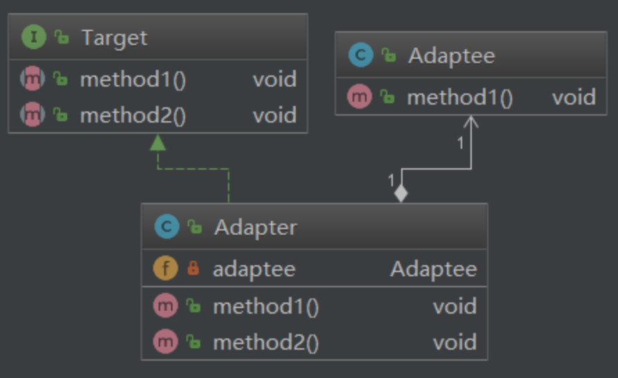

## 概述

**介绍**：适配器模式是一种结构型设计模式，它允许将一个类的接口转换成客户端所期望的另一个接口。适配器模式的主要目的是解决两个不兼容接口之间的接口转换问题，使得原本由于接口不匹配而无法工作的类可以协同工作。
适配器模式是用来做适配的，它将不兼容的接口转换为可兼容的接口，让原本由于接口不兼容而不能一起工作的类可以一起工作。适配器模式有两种实现方式：类适配器和对象适配器。其中，类适配器使用继承关系来实现，对象适配器使用组合关系来实现。
适配器模式的核心思想是创建一个适配器类，该适配器类实现了客户端期望的目标接口，并持有一个对被适配者对象的引用。适配器类通过调用被适配者对象的方法来实现目标接口的方法，从而完成接口的适配。它允许不兼容的接口之间进行通信。适配器模式通过将一个类的接口转换为客户端所期望的另一个接口来实现这一点。这种模式可以在不修改现有代码的情况下重用现有类。
适配器模式可以帮助我们在不修改现有代码的情况下重用现有类，并且可以使不兼容的接口之间进行通信。

把一个类的接口变换成客户端所期待的另一种接口，从而使原本因接口不匹配而无法在一起工作的两个类能够在一起工作。

**场景**：

适配器模式将一个类的接口转换成客户希望的另外一个接口，使得原本由于接口不兼容而不能一起工作的那些类可以一起工作。
* 1.封装有缺陷的接口设计
* 2.统一多个类的接口设计
* 3.替换依赖的外部系统
* 4.兼容老版本接口
* 5.适配不同格式的数据

在Spring 的 AOP 面向切面编程 中

**优点**：

* 1.更好的复用性，系统需要使用现有的类，而此类的接口不符合系统的需要,那么通过适配器模式就可以让这些功能得到更好的复用。
* 2.透明、简单，客户端可以调用同一接口，因而对客户端来说是透明的
* 3.更好的扩展性，在实现适配器功能的时候，可以调用自己开发的功能，从而自然地扩展系统的功能
* 4.解耦性，目标类和适配者类解耦，通过引入一个适配器类重用现有的适配者类，而无需修改原有代码

**不足**：过多的使用适配器，会让系统非常零乱，不易整体进行把握


### 适配器模式涉及三种角色

    源（Adaptee）：需要被适配的对象或类型
    目标（Target）：期待得到的目标
    适配器（Adapter）：连接源和目标的中间对象


### 适配器模式包括3种形式

    类适配器模式
    对象适配器模式
    接口适配器模式

#### 类适配器模式

从下面的结构图可以看出，Adaptee类并没有method2()方法，而客户端则期待这个方法。为使客户端能够使用Adaptee类，我们把Adaptee与Target衔接起来。
Adapter与Adaptee是继承关系，这决定了这是一个类适配器模式。


代码实现：

源：

    public class Adaptee {
        public void method1(){
            System.out.println("method 1");
        }
    }

目标：

    public interface Target {
        void method1();
        void method2();
    }

适配器：

    public class Adapter extends Adaptee implements Target {
        @Override
        public void method2() {
            System.out.println("method 2");
        }
    }

// 测试

    class AdapterTest {
        public static void main(String[] args) {
            Adapter adapter = new Adapter();
            adapter.method1();
            adapter.method2();
        }
    }

运行结果：

    method 1
    method 2


#### 对象适配器模式

对象适配器模式是另外6种结构型设计模式的起源。


从下面的结构图可以看出，Adaptee类并没有method2()方法，而客户端则期待这个方法。与类适配器模式一样，为使客户端能够使用Adaptee类，我们把Adaptee与Target衔接起来。
但这里我们不继承Adaptee，而是把Adaptee封装进Adapter里。这里Adaptee与Adapter是组合关系。


代码实现：

Target和Adaptee和上面的类适配器一样，不再贴出。

适配器：

    public class Adapter implements Target {
    
        private Adaptee adaptee;
    
        public Adapter(Adaptee adaptee) {
            this.adaptee = adaptee;
        }
    
        @Override
        public void method1() {
            adaptee.method1();
        }
    
        @Override
        public void method2() {
            System.out.println("method 2");
        }
    
    }

    class AdapterTest {
        public static void main(String[] args) {
            Adapter adapter = new Adapter(new Adaptee());
            adapter.method1();
            adapter.method2();
        }
    }

运行结果：

    method 1
    method 2

**类适配器与对象适配器的区别**

类适配器使用的是继承的方式，直接继承了Adaptee，所以无法对Adaptee的子类进行适配。

对象适配器使用的是组合的方式，·所以Adaptee及其子孙类都可以被适配。另外，对象适配器对于增加一些新行为非常方便，而且新增加的行为同时适用于所有的源。

基于**组合/聚合优于继承**的原则，使用对象适配器是更好的选择。


#### 接口适配器模式（缺省适配模式）

思想是：为一个接口提供缺省实现，这样子类可以从这个缺省实现进行扩展，而不必从原有接口进行扩展。

这里提供一个例子。java.awt.KeyListener是一个键盘监听器接口，我们把这个接口的实现类对象注册进容器后，这个容器就会对键盘行为进行监听，像这样：

    public static void main(String[] args) {
        JFrame frame = new JFrame();
        frame.addKeyListener(new KeyListener() {
            @Override
            public void keyTyped(KeyEvent e) {}

            @Override
            public void keyPressed(KeyEvent e) {
                System.out.println("hey geek!");
            }

            @Override
            public void keyReleased(KeyEvent e) {
            }
        });
    }

可以看到其实我们只使用到其中一个方法，但必须要把接口中所有方法都实现一遍，如果接口里方法非常多，那岂不是非常麻烦。于是我们引入一个默认适配器，让适配器把接口里的方法都实现一遍，使用时继承这个适配器，把需要的方法实现一遍就好了。JAVA里也为java.awt.KeyListener提供了这样一个适配器：java.awt.KeyAdapter。我们使用这个适配器来改改上面的代码：

    public static void main(String[] args) {
        JFrame frame = new JFrame();
        frame.addKeyListener(new KeyAdapter() {
            @Override
            public void keyPressed(KeyEvent e) {
                System.out.println("fxcku!");
            }
        });
    }

这样不必再把每个方法都实现一遍，代码看起来简洁多了。在任何时候，如果不准备实现一个接口里的所有方法时，就可以使用“缺省适配模式”制造一个抽象类，实现所有方法，这样，从这个抽象类再继承下去的子类就不必实现所有的方法，只要重写需要的方法就可以了。


## 具体示例

```java
// 目标接口
interface Target {
    void request();
}
 
// 需要适配的类
class Adaptee {
    public void specificRequest() {
        System.out.println("特定请求被处理");
    }
}
 
// 适配器类
class Adapter implements Target {
    private Adaptee adaptee = new Adaptee();
    
    @Override
    public void request() {
        adaptee.specificRequest();
    }
}
 
// 测试适配器
public class Main {
    public static void main(String[] args) {
        Target target = new Adapter();
        target.request();  // 输出: 特定请求被处理
    }
}
```
在这个例子中，Target接口定义了一个方法request()，而Adaptee类有一个特定的方法specificRequest()，我们需要创建一个适配器Adapter，它实现了Target接口，并且内部包含了Adaptee的实例。这样，当我们调用适配器的request()方法时，它就会调用被适配对象的specificRequest()方法。这样，我们就可以在不修改现有代码的情况下，将现有的类集成到我们的系统中。


