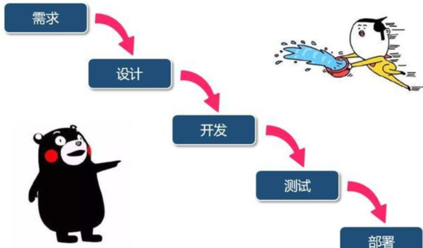
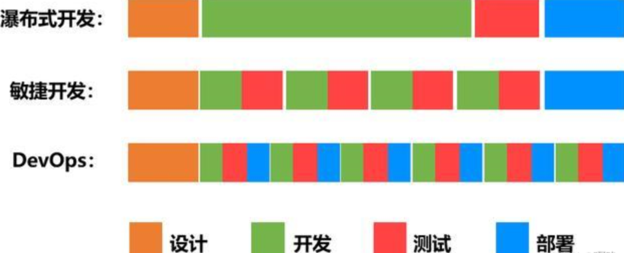
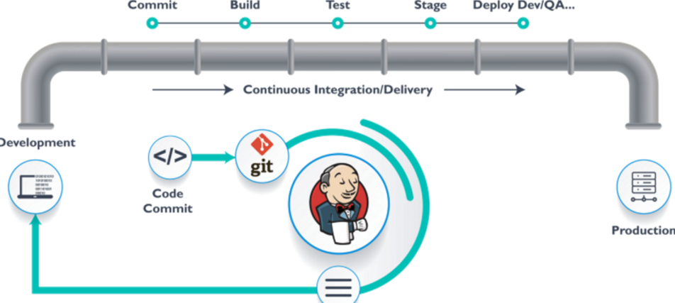
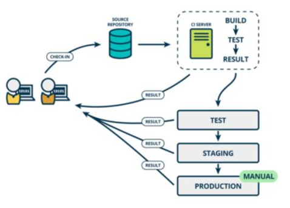

## 1. DevOps

维基百科定义：DevOps是一组过程、方法与系统的统称，用于促进 开发、技术运营 和 质量保障（QA） 部门之间的沟通、协作与整合。我理解DevOps是一种软件管理思维模式。

为什么会有DevOps呢，或者说软件开发领域是怎么样演变出DevOps这个概念的呢？

项目管理模式的演变是受项目的规模大小影响的。

最初阶段，项目软件功能比较简单，工作量不大，程序员一个人可以完成规划、编码、构建、测试、发布、部署和维护所有阶段的工作。

后来，项目扩大，软件的规模也在逐渐变得庞大，采有传统瀑布流模型。团队里面除了软件开发工程师之外，又有了软件测试工程师，软件运维工程师，各个工种分工合作，一个阶段所有工作完成之后，再进入下一个阶段。

再后来，随着项目的再次扩大，用户对系统的需求不断增加，与此同时，用户给的时间周期却越来越少，时间周期比较长的瀑布流模式不再适用，于是就出现了“敏捷开发”，为的就是小步快跑，持续迭代，快速发现问题，快速解决问题，快速和用户、业主进行确认。

再然后，在现今这个时代，对变化进行响应的要求越来越高，可以一个项目几天就要迭代上线一版。而从上面的图也可以看到，敏捷开发大幅提升了软件开发的效率和版本更新的速度，但是它的效果仅限于开发环节，运维部署成为瓶颈。运维的核心就是维稳，不出问题，这导致了开发快速迭代的版本很难快速正式上线。

这时候，DevOps这个概念才被提出和关注。从目标来看，DevOps就是让开发人员和运维人员更好地沟通合作，通过自动化流程来使得软件整体过程更加快捷和可靠。而从DevOps概念提出到现在，也不仅仅只是要打通开发和运维的壁垒了，而是扩大到整个项目团队涉及到所有角色，也包括了市场、需求等人员。

DevOps 的三大支柱，即人（People）、流程（Process）和平台（Platform）。

* DevOps = 人 + 流程 + 平台
* 人 + 流程 = 文化
* 流程 + 平台 = 工具
* 平台 + 人 = 赋能

这是这个行业演变过程，也是一个公司从成立，到发展壮大的过程，一个公司的项目管理模式演变过程是整个行业演变过程的缩影，不同阶段有不同阶段的模式，达到一定阶段才有改变的必要，不过我们如果提前有这些了解，提前有所准备，那边在转变的过程中就可以少些弯路和内耗。

DevOps要做就是使用技术工具按照标准化的流程统筹各个阶段的人和人的行为，实现快速交付。它的落地考验的不仅是一家企业的技术，更是管理水平和企业文化，需要一家公司从上到下进行思维转变，并且重新梳理全流程的规范和标准。技术（工具和平台）是最容易实现的，流程次之，思维转变反而最困难。

虽然思维转变是最重要的，但是思维转变没法凭空而来，不可能看一下概念，听一下别人的描述就可以转变过来。只有身处在那样的环境，体会到确切的痛点，如一个公司随着规模的扩大，项目变得复杂，发现按照以前的项目执行方式每次都是亏钱，这样才有可能引发思考，如果这时再体验到相关地技术带来的便利和好处，这样才有可能引发思维的转变。

对于开发人员个人而言，虽然DevOps实施落地中技术和工具是最简单的，但是我们还是要先了解技术和工具，从中体会它与我们日常工作流程的差别，引发思考，同时也为可能用到的时机进行准备积累。

## 2. CI/CD

DevOps涉及开发的各个阶段，涉及到各个阶段的人，人的思维   转变是最难的，而标准的流程和规范是DevOps的基础，是将各个阶段的人和行为管理起来的根本，平台则是流程自动化的技术工具。其中，CI/CD是DevOps中最能体现流程化的一个阶段，旨在通过技术工具搭建标准自动化流水线过程，减少重复工作的资源浪费。

CI/CD是伴随着DevOps出现的两个词汇，CI是Continuous Integration（持续集成），而CD对应多个英文，Continuous Delivery（持续交付）或Continuous Deployment（持续部署）。所谓持续就是即时和反复，为的就是及时发现问题，及时响应。

**持续集成**：

持续集成是指多名开发者在开发不同功能代码的过程当中，可以频繁的将代码行合并到一起，然后进行自动化测试，并且不会相互影响工作。

**持续交付**：

持续交付是指在持续集成的基础上，将集成后的代码部署到更贴近真实运行环境的「类生产环境」中。比如，我们完成单元测试后，可以把代码部署到连接数据库的 Staging 环境中更多的测试。如果代码没有问题，可以继续手动部署到生产环境中。

**持续部署**：

在持续交付的基础上，把部署到生产环境的过程自动化。如果你对比上图持续部署就可以发现持续部署和持续交付的区别就是最终部署到生产环境是自动化的。

从上面的几个图可以看出，要实现CI/CD最起码需要一个固定的流程和三个工具。流程需要规定从代码开发到生产环境需要经过哪些阶段，每个阶段需要做什么，如果一个阶段没有达到预期应该怎么做，这个流程不同公司会有所不同，也是每个企业管理方式的体现。最基本的三个工具包括源代码管理工具（SCM）、自动化构建平台，消息通知工具。

平台工具各个公司各有不同，大家日常工作中也各有熟悉的工具，DevOps也不仅仅CI/CD需要平台工具，如项目管理、需求、原型和UI管理都需要工具，这里只是介绍CI/CD过程相关的。

源代码管理工具一般选择 GitLab，也可以用Gitbilit等其他的，这些大家都应该很熟悉，毕竟是日常工作中必不可少要接触的。

自动化构建平台成熟的有很多，GitLab也自带有CI/CD模块可以用，而这里要采有的是开源且发展历史长久，广泛使用和最好的CI/CD工具之一的Jenkins。

消息通知可以用邮件，也可以通知到钉钉等办公软件中。
