## 简介

Elasticsearch 是一个分布式可扩展的实时搜索和分析引擎,一个建立在全文搜索引擎 Apache Lucene™ 基础上的搜索引擎.当然 Elasticsearch 并不仅仅是 Lucene 那么简单，它不仅包括了全文搜索功能，还可以进行以下工作:

* 一个分布式的实时文档存储，每个字段可以被索引与搜索
* 一个分布式实时分析搜索引擎
* 能胜任上百个服务节点的扩展，并支持 PB 级别的结构化或者非结构化数据

## 1.ES概览

### 1.ES优点

* 1.支持全文搜索，并基于倒排索引，检索速度特别快
* 2.高可用性，支持集群部署，任何节点失效系统自动调整。

### 2.ES缺点

* 1.对硬件要求较高，es比较吃内存，需要存储资源来支持大量数据的处理。
* 2.不支持事务等ACID属性。

### 3.ES使用场景

1.聊天消息
* 数据量大，业务关系简单，会通过关键字搜索聊天信息
* 非核心业务，不会频繁crud
* 没有事务的场景，可以不用支持事务

2.日志纪录

Elasticsearch 一个典型应用就是 ELK 日志分析系统。如nginx接入请求的访问日志纪录。

3.热点数据搜索

如电商业务的商品搜索等。

### 2.DSL语言高级查询

1.Query DSL概述

Domain Specific Language 领域专用语言

* Elasticsearch provides a ful1 Query DSL based on JSON to define queries
* Elasticsearch提供了基于JSON的DSL来定义查询。

DSL由叶子查询子句和复合查询子句两种子句组成。

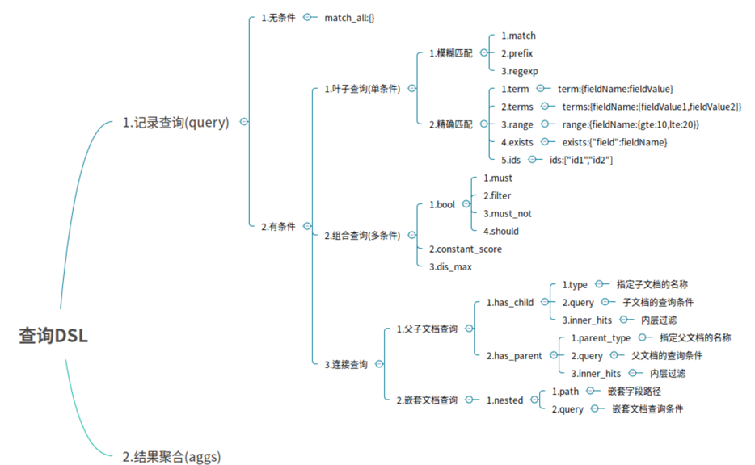

**2.模糊匹配**

模糊匹配主要是针对文本类型的字段，文本类型的字段会对内容进行分词，对查询时，也会对搜索条件进行分词，然后通过倒排索引查找到匹配的数据，模糊匹配主要通过match等参数来实现

* match : 通过match关键词模糊匹配条件内容
* prefix : 前缀匹配
* regexp : 通过正则表达式来匹配数据
```sql
POST /es_db/_doc/_search
{
"from": 0,
"size": 2,
"query": {
"match": {
"address": "广州"
}
}
}
    
SQL: select * from user where address like '%广州%' limit 0, 2
```


**3.精确匹配**

* term : 单个条件相等
* terms : 单个字段属于某个值数组内的值
* range : 字段属于某个范围内的值
* exists : 某个字段的值是否存在
* ids : 通过ID批量查询

```sql
POST /es_db/_doc/_search
{
"query": {
"term": {
"name": "admin"
}
}
}

SQL: select * from student where name = 'admin'
```

### 4.聚合搜索

**1.bucket和metric**

bucket就是一个聚合搜索时的数据分组。

如：销售部门有员工张三和李四，开发部门有员工王五和赵六。那么根据部门分组聚合得到结果就是两个bucket。销售部门bucket中有张三和李四，开发部门 bucket中有王五和赵六。

metric就是对一个bucket数据执行的统计分析。如上述案例中，开发部门有2个员工，销售部门有2个员工，这就是metric。

metric有多种统计，如：求和，最大值，最小值，平均值等。

用一个大家容易理解的SQL语法来解释，如：select count() from table group by column。那么group by column分组后的每组数据就是bucket。对每个分组执行的count()就是metric。

es最重要的核心功能是数据检索，统计分析我认为不是es最核心的功能，想这种离线统计应该由其他的替代方案去做，所以如果想了解更多es聚合搜索相关知识可以参考官网或者其他博客

## 3.文档映射

ES中映射可以分为动态映射和静态映射

### 1.动态映射

在关系数据库中，需要事先创建数据库，然后在该数据库下创建数据表，并创建表字段、类型、长度、主键等，最后才能基于表插入数据。而Elasticsearch中不需要定义Mapping映射（即关系型数据库的表、字段等），在文档写入Elasticsearch时，会根据文档字段自动识别类型，这种机制称之为动态映射。
动态映射规则如下：

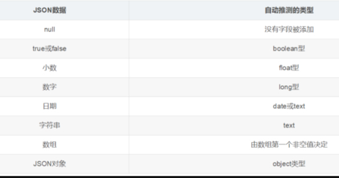

### 2.静态映射

静态映射是在Elasticsearch中也可以事先定义好映射，包含文档的各字段类型、分词器等，这种方式称之为静态映射。

### 3.核心类型（Core datatype）

* 字符串：string，string类型包含 text 和 keyword。
* text：该类型被用来索引长文本，在创建索引前会将这些文本进行分词，转化为词的组合，建立索引；允许es来检索这些词，text类型不能用来排序和聚合。
* keyword：该类型不能分词，可以被用来检索过滤、排序和聚合，keyword类型不可用text进行分词模糊检索。
* 数值型：long、integer、short、byte、double、float
* 日期型：date
* 布尔型：boolean

## 4.数据建模

就是针对于关系型数据库的一对多数据模型，而我自己认为es的主要应用场景是全文搜索引擎，这种复杂的业务关系就应该由关系型数据库如mysql去完成数据建模和存储，而不是交给es去建模存储，当然es也是提供了Parent / Child相关机制继续数据建模，如果有场景使用到，自己去参考对应的官方文档了解即可，但我自己不建议这样做。

## 5.分页查询

### 1.语法

在存在大量数据时，一般我们进行查询都需要进行分页查询。例如：我们指定页码、并指定每页显示多少条数据，然后Elasticsearch返回对应页码的数据。

在执行查询时，可以指定from（从第几条数据开始查起）和size（每页返回多少条）数据，就可以轻松完成分页。
```sql
POST /es_db/_doc/_search
{
"from": 0,
"size": 2,
"query": {
"match": {
"address": "广州天河"
}
}
}
```

### 2.scroll解决深分页问题

前面使用from和size方式，查询在1W条数据以内都是OK的，但如果数据比较多的时候，会出现性能问题。Elasticsearch做了一个限制，不允许查询的是10000条以后的数据。如果要查询1W条以后的数据，需要使用Elasticsearch中提供的scroll游标来查询。

在进行大量分页时，每次分页都需要将要查询的数据进行重新排序，这样非常浪费性能。

使用scroll是将要用的数据一次性排序好，然后分批取出,性能要比from + size好得多。

使用scroll查询后，排序后的数据会保持一定的时间，后续的分页查询都从该快照取数据即可。

第一次使用scroll分页查询

此处，我们让排序的数据保持1分钟，所以设置scroll为1m
```sql
GET /es_db/_search?scroll=1m
{
"query": {
"multi_match":{
"query":"广州长沙张三",
"fields":["address","name"]
}
},
"size":100
}
```

执行后，我们注意到，在响应结果中有一项：
```sql
"_scroll_id": "DXF1ZXJ5QW5kRmV0Y2gBAAAAAAAAAZEWY2VQZXBia1JTVkdhTWkwSl9GaUYtQQ=="
```


后续，我们需要根据这个_scroll_id来进行查询

第二次直接使用scroll id进行查询

## 6.suggest search

suggest search（completion suggest）：就是建议搜索或称为搜索建议，也可以叫做自动完成-auto completion。类似百度中的搜索联想提示功能。

ES实现suggest的时候，性能非常高，其构建的不是倒排索引，也不是正排索引，就是纯的用于进行前缀搜索的一种特殊的数据结构，而且会全部放在内存中，所以suggest search进行的前缀搜索提示，性能是非常高。

需要使用suggest的时候，必须在定义index时，为其mapping指定开启suggest。

具体如下:
```sql
PUT /movie
{
"mappings": {
"properties" : {
"title" : {
"type": "text",
"analyzer": "ik_max_word",
"fields": {
"suggest" : {
"type" : "completion",
"analyzer": "ik_max_word"
}
}
},
"content": {
"type": "text",
"analyzer": "ik_max_word"
}
}
}
}

PUT /movie/_doc/1
{
"title": "西游记电影系列",
"content": "西游记之月光宝盒将与2021年进行......"
}

PUT /movie/_doc/2
{
"title": "西游记文学系列",
"content": "某知名网络小说作家已经完成了大话西游同名小说的出版"
}

PUT /movie/_doc/3
{
"title": "西游记之大话西游手游",
"content": "网易游戏近日出品了大话西游经典IP的手游，正在火爆内测中"
}

```

suggest 搜索：

```sql
GET /movie/_search
{
"suggest": {
"my-suggest" : {
"prefix" : "西游记",
"completion" : {
"field" : "title.suggest"
}
}
}
}
```

## 二、ES核心原理

### 1.ES存储模型

Elasticsearch与关系数据库结构对应

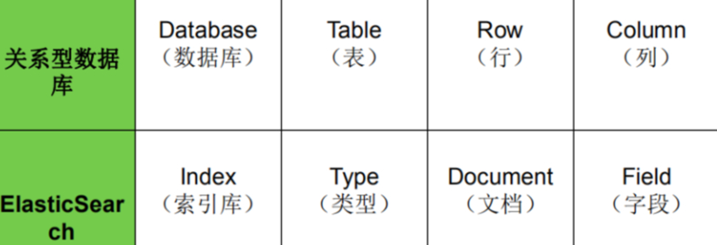

ElasticSearch的对象模型，跟关系型数据库模型相比：

### 1.索引（Index）

相当于数据库，用于定义文档类型的存储；在同一个索引中，同一个字段只能定义一个数据类型；

一个索引就是一个拥有几分相似特征的文档的集合。比如说，可以有一个客户数据的索引，另一个产品目录的索引，还有一个订单数据的索引
一个索引由一个名字来标识（必须全部是小写字母的），并且当我们要对对应于这个索引中的文档进行索引、搜索、更新和删除的时候，都要使用到这个名字

### 2.文档类型（Type）

相当于关系表，用于描述文档中的各个字段的定义；不同的文档类型，能够存储不同的字段，服务于不同的查询请求；

每一个字段都应该有一个对应的类型，例如：Text、Keyword、Byte等

### 3.文档（Document）

相当于关系表的数据行，存储数据的载体，包含一个或多个存有数据的字段；

一个文档是一个可被索引的基础信息单元，类似一条记录。文档以JSON（Javascript Object Notation）格式来表示；

### 4.字段（Field）

文档的一个Key/Value对；
* 词（Term）：表示文本中的一个单词；
* 标记（Token）：表示在字段中出现的词，由该词的文本、偏移量（开始和结束）以及类型组成；

相当于是数据表的字段|列

### 2.倒排索引

全文搜索引擎的技术原理被称为“倒排索引”（Inverted index），也常被称为反向索引、置入档案或反向档案，是一种索引方法，其基本原理是建立单词到文档的索引。

之所以被称为“倒排”索引，是和“正排“索引相对的，“正排索引”的基本原理是建立文档到单词的索引。我们通过一个简单的样例来说明这两种索引的差异。

假设我们有一个技术文章的网站，里面收集了各种技术文章，用户可以在网站浏览或者搜索文章。

正排索引示例：


（注：文章内容仅为示范，文章内容实际上存储的是几千字的内容。）

正排索引适用于根据文档名称来查询文档内容。例如，用户在网站上单击了“面向对象葵花宝典是什么”，网站根据文章标题查询文章的内容展示给用户。

倒排索引示例：

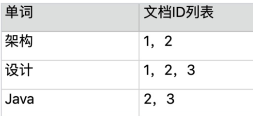

（注：表格仅为示范，不是完整的倒排索引表格，实际上的倒排索引有成千上万行，因为每个单词就是一个索引。）

倒排索引适用于根据关键词来查询文档内容，它是根据文章内容中的关键字建立索引，而值对应于文档ID，而搜索出来的结果就是文档ID所在行的所有内容。

例如，用户只是想看“设计”相关的文章，网站需要将文章内容中包含“设计”一词的文章都搜索出来展示给用户。

要注意倒排索引的两个重要细节：

* 倒排索引中的所有词项对应一个或多个文档；
* 倒排索引中的词项根据字典顺序升序排列
Elasticsearch 也是 Master-slave 架构，也实现了数据的分片和备份。

### 3.分词器

对于英文来说，分词比较简单，只需要按照单词的空格来进行分词。
如下所示


如果要搜索hello这个关键词，则匹配的结果将是下面两个内容
```sql
hello world
hello elasticsearch

```
ES的默认分词设置是standard，这个在中文分词时就比较尴尬了，会单字拆分，比如我搜索关键词“清华大学”，这时候会按“清”，“华”，“大”，“学”去分词，然后搜出来的都是些“清清的河水”，“中华儿女”，“地大物博”，“学而不思则罔”之类的莫名其妙的结果。

这里我们就想把这个分词方式修改一下，于是呢，就想到了ik分词器，有两种ik_smart和ik_max_word。

ik_smart会将“清华大学”整个分为一个词，而ik_max_word会将“清华大学”分为“清华大学”，“清华”和“大学”，按需选其中之一就可以了。

修改默认分词方法(这里修改school_index索引的默认分词为：ik_max_word)：
```sql
PUT /school_index
{
"settings" : {
"index" : {
"analysis.analyzer.default.type": "ik_max_word"
}
}
}
```

1.分词器工作流程

分词器由三部分组成：

* Character Filter：将文本中html标签剔除掉。
* Tokenizer：按照规则进行分词，在英文中按照空格分词
* Token Filter：将切分的单词进行加工，小写，删除 stopwords(停顿词，a、an、the、is等),增加同义词

每个组件的作用，可参考下面的例子

character filter：在一段文本进行分词之前，先进行预处理，比如说最常见的就是，过滤html标签

tokenizer：分词，hello you and me --> hello, you, and, me

token filter：lowercase，stop word，synonymom，liked --> like，Tom --> tom，a/the/an --> 干掉，small --> little

**2.ES内置分词器**

* Standard Analyzer - 默认分词器，按词切分，小写处理
* Simple Analyzer - 按照非字母切分(符号被过滤), 小写处理
* Stop Analyzer - 小写处理，停用词过滤(the,a,is)
* Whitespace Analyzer - 按照空格切分，不转小写
* Keyword Analyzer - 不分词，直接将输入当作输出
* Patter Analyzer - 正则表达式，默认\W+(非字符分割)
* Language - 提供了30多种常见语言的分词器
* Customer Analyzer 自定义分词器

每个内置分词器的作用，可参考下面的例子
```sql
Set the shape to semi-transparent by calling set_trans(5)

standard analyzer：set, the, shape, to, semi, transparent, by, calling, set_trans, 5（默认的是standard）

simple analyzer：set, the, shape, to, semi, transparent, by, calling, set, trans

whitespace analyzer：Set, the, shape, to, semi-transparent, by, calling, set_trans(5)

stop analyzer:移除停用词，比如a the it等等
```

**3.定制分词器**
```sql
PUT /my_index
{
"settings": {
"analysis": {
"analyzer": {
"es_std": {
"type": "standard",
"stopwords": "_english_"
}
}
}
}
}

GET /my_index/_analyze
{
"analyzer": "standard",
"text": "a dog is in the house"
}

GET /my_index/_analyze
{
"analyzer": "es_std",
"text":"a dog is in the house"
}

```

**3、定制化自己的分词器**
```sql
PUT /my_index
{
"settings": {
"analysis": {
"char_filter": {
"&_to_and": {
"type": "mapping",
"mappings": ["&=> and"]
}
},
"filter": {
"my_stopwords": {
"type": "stop",
"stopwords": ["the", "a"]
}
},
"analyzer": {
"my_analyzer": {
"type": "custom",
"char_filter": ["html_strip", "&_to_and"],
"tokenizer": "standard",
"filter": ["lowercase", "my_stopwords"]
}
}
}
}
}

GET /my_index/_analyze
{
"text": "tom&jerry are a friend in the house, <a>, HAHA!!",
"analyzer": "my_analyzer"
}

PUT /my_index/_mapping/my_type
{
"properties": {
"content": {
"type": "text",
"analyzer": "my_analyzer"
}
}
}

```

**4.IK热更新**
每次都是在es的扩展词典中，手动添加新词语，很坑

（1）每次添加完，都要重启es才能生效，非常麻烦

（2）es是分布式的，可能有数百个节点，你不能每次都一个一个节点上面去修改

es不停机，直接我们在外部某个地方添加新的词语，es中立即热加载到这些新词语
IKAnalyzer.cfg.xml
```sql
<properties>
	<comment>IK Analyzer 扩展配置</comment>
	<!--用户可以在这里配置自己的扩展字典 -->
	<entry key="ext_dict">location</entry>
	 <!--用户可以在这里配置自己的扩展停止词字典-->
	<entry key="ext_stopwords">location</entry>
	<!--用户可以在这里配置远程扩展字典 -->
	<entry key="remote_ext_dict">words_location</entry> 
	<!--用户可以在这里配置远程扩展停止词字典-->
	<entry key="remote_ext_stopwords">words_location</entry>
</properties>
```

## 4.es评分机制

当你通过关键字搜索相关文档时，可能会出现多个文档，这些文档的顺序是通过一个max_score属性的大小从高到低顺序展现出来的，max_score属性就是我们所说的评分。

### 1.打分算法

relevance score算法，简单来说，就是计算出，一个索引中的文本，与搜索文本，他们之间的关联匹配程度

Elasticsearch使用的是 term frequency/inverse document frequency算法，简称为TF/IDF算法

### 总公式

max_score = boost * idf * tf

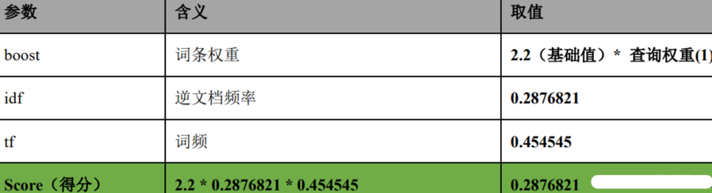

对于查询权重我们可以自己定义

如下面所示：

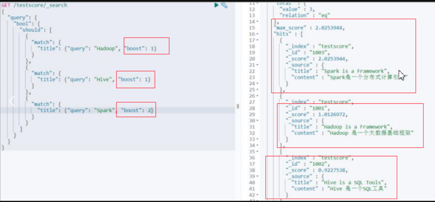

### 1.TF算法

Term frequency：搜索文本中的各个词条在field文本中出现了多少次，出现次数越多，就越相关

* 搜索请求：hello world
* doc1：hello you, and world is very good
* doc2：hello, how are you

doc1这个文档匹配了2个单词，所以doc1的得分要高一些。

2.IDF算法
Inverse document frequency：搜索文本中的各个词条在整个索引的所有文档中出现了多少次，出现的次数越多，就越不相关

* 搜索请求：hello world
* doc1：hello, tuling is very good
* doc2：hi world, how are you

比如说，在index中有1万条document，hello这个单词在所有的document中，一共出现了1000次；world这个单词在所有的document中，一共出现了100次，所以world这个单词得分就更高。

那么匹配world的doc得分就越高,越有可能排在搜索结果前面。

Field-length norm：field长度，field越长，相关度越弱
搜索请求：hello world

* doc1：{ "title": "hello article", "content": "...... N个单词" }
* doc2：{ "title": "my article", "content": "...... N个单词，hi world" }

hello world在整个index中出现的次数是一样多的，那么doc1更相关，title field更短

**2.空间向量模型（vector space model）**

每个doc vector计算出对query vector的弧度，最后基于这个弧度给出一个doc相对于query中多个term的总分数

弧度越大，分数月底; 弧度越小，分数越高

如果是多个term，那么就是线性代数来计算，无法用图表示


了解即可，掌握对应的打分算法我自己认为就足够了，不用砖牛角尖

## 三、ElasticSearch架构设计

### 1.es集群架构

如下图 ，就是一个三个节点组成的es集群，p0、p1、p2表示一个节点中的分片，R0、R1、R2表示分片对应的副本
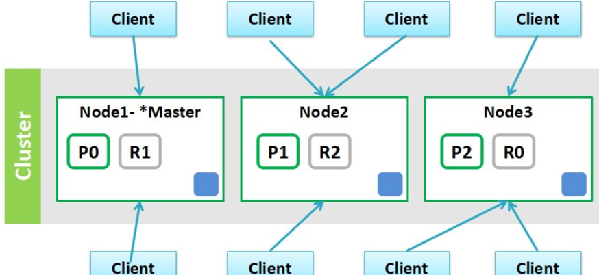
在Elasticsearch主要分成两类节点，一类是Master，一类是DataNode。

### 1.Master节点

在Elasticsearch启动时，会选举出来一个Master节点。

当某个节点启动后，然后使用Zen Discovery机制找到集群中的其他节点，并建立连接。

discovery.seed_hosts: [“192.168.21.130”, “192.168.21.131”, “192.168.21.132”]

并从候选主节点中选举出一个主节点。

cluster.initial_master_nodes: [“node1”, “node2”,“node3”]

Master节点主要负责
* 管理索引（创建索引、删除索引）、分配分片
* 维护元数据
* 管理集群节点状态
* 不负责数据写入和查询，比较轻量级

一个Elasticsearch集群中，只有一个Master节点。在生产环境中，内存可以相对小一点，但机器要稳定。

### 2.DataNode节点

在Elasticsearch集群中，会有N个DataNode节点。

DataNode节点主要负责：

数据写入、数据检索，

大部分Elasticsearch的压力都在DataNode节点上在生产环境中，内存最好配置大一些

### 3.分片

Elasticsearch是一个分布式的搜索引擎，索引的数据也是分成若干部分，分布在不同的服务器节点中，分布在不同服务器节点中的索引数据，就是分片（Shard）。

Elasticsearch会自动管理分片，如果发现分片分布不均衡，就会自动迁移一个索引（index）由多个shard（分片）组成，而分片是分布在不同的服务器上的.

### 4.副本

为了对Elasticsearch的分片进行容错，假设某个节点不可用，会导致整个索引库都将不可用。所以，需要对分片进行副本容错，每一个分片都会有对应的副本。

在Elasticsearch中，默认创建的索引为1个分片、每个分片有1个主分片和1个副本分片。

每个分片都会有一个Primary Shard（主分片），也会有若干个Replica Shard（副本分片）

Primary Shard和Replica Shard不在同一个节点上

## 2.es集群读写流程

### 1.es 写数据流程

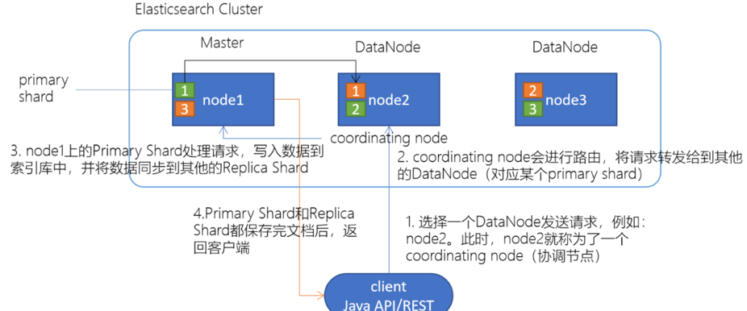

1.选择任意一个DataNode发送请求，例如：node2。此时，node2就成为一个coordinating node（协调节点）

2.计算得到文档要写入的分片

`shard = hash(routing) % number_of_primary_shards`
routing 是一个可变值，默认是文档的 _id

3.coordinating node会进行路由，将请求转发给对应的primary shard所在的DataNode（假设primary shard在node1、replica shard在node2）

4.node1节点上的Primary Shard处理请求，写入数据到索引库中，并将数据同步到Replica shard

5.Primary Shard和Replica Shard都保存好了文档，返回client

### 2.es 读数据流程

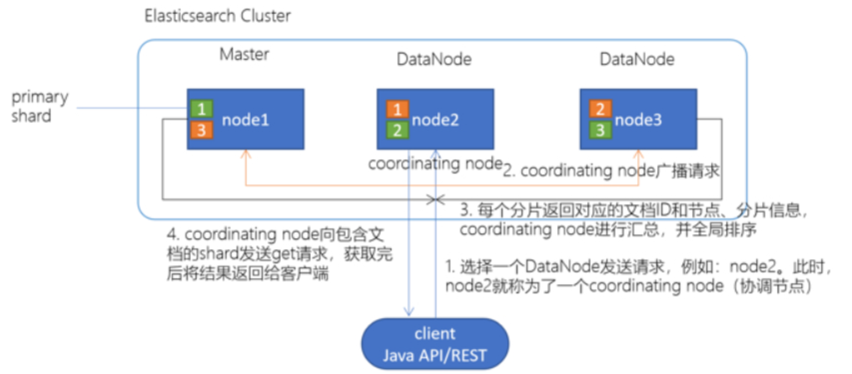

1.client发起查询请求，某个DataNode接收到请求，该DataNode就会成为协调节点（Coordinating Node）

2.协调节点（Coordinating Node）将查询请求广播到每一个数据节点，这些数据节点的分片会处理该查询请求

3.每个分片进行数据查询，将符合条件的数据放在一个优先队列中，并将这些数据的文档ID、节点信息、分片信息返回给协调节点

4.协调节点将所有的结果进行汇总，并进行全局排序

5.协调节点向包含这些文档ID的分片发送get请求，对应的分片将文档数据返回给协调节点，最后协调节点将数据返回给客户端

注意：写请求是写入 primary shard，然后同步给所有的 replica shard；读请求可以从 primary shard 或 replica shard 读取，采用的是随机轮询算法。

自己总结：es的检索流程和mysql数据表查询非主键索引的思路有些相似，先从索引表查询出对应的主键索引值，在进行回表查询具体的行数据。

### 3.es删除/更新数据底层原理

如果是删除操作，commit 的时候会生成一个 .del 文件，里面将某个 doc 标识为 deleted 状态，那么搜索的时候根据 .del 文件就知道这个 doc 是否被删除了。

如果是更新操作，就是将原来的 doc 标识为 deleted 状态，然后新写入一条数据。

## 3.es 底层写数据原理

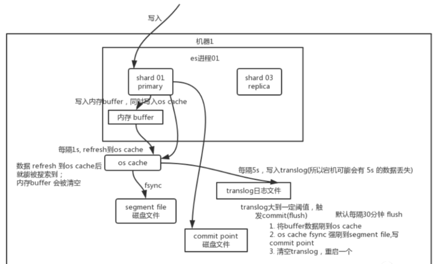

简述：先写入内存 buffer，在 buffer 里的时候数据是搜索不到的；然后刷新到os cache中（同时将数据备份到translog日志文件），最后刷新到 segment file磁盘文件中

总结一下，数据先写入内存 buffer，然后每隔 1s，将数据 refresh 到 os cache，到了 os cache 数据就能被搜索到（所以我们才说 es 从写入到能被搜索到，中间有 1s 的延迟）。每隔 5s，将数据写入 translog 文件作备份（这样如果机器宕机，内存数据全没，最多会有 5s 的数据丢失），translog 大到一定程度，或者默认每隔 30mins，会触发 commit 操作，将缓冲区的数据都 flush 到 segment file 磁盘文件中。最后存入到commit point磁盘文件中。

### 1.refresh到文件系统缓存

当数据写入到ES分片时，会首先写入到内存中，然后通过内存的buffer生成一个segment，并刷到文件系统缓存中。

如果 buffer 快满了，或者到一定时间，就会将内存 buffer 数据 refresh 到一个新的 segment file中，但是此时数据不是直接进入 segment file 磁盘文件，而是先进入 os cache 。

这个过程就是 refresh 。

只要 buffer 中的数据被 refresh 操作刷入 os cache 中，这个数据就可以被搜索到了。

定时 refresh到文件系统缓存机制

每隔 1 秒钟，es 将 buffer 中的数据写入一个新的 segment file ，每秒钟会产生一个新的磁盘文件 segment file ，这个 segment file 中就存储最近 1 秒内 buffer 中写入的数据。
但是如果 buffer 里面此时没有数据，那当然不会执行 refresh 操作，如果 buffer 里面有数据，默认 1 秒钟执行一次 refresh 操作，刷入一个新的 segment file 中。

segment file合并

buffer 每 refresh 一次，就会产生一个 segment file ，所以默认情况下是 1 秒钟一个 segment file ，这样下来 segment file 会越来越多，此时会定期执行 merge，减少索引查询时IO开销。
每次 merge 的时候，会将多个 segment file 合并成一个，同时这里会将标识为 deleted 的 doc 给物理删除掉（之前执行过的delete的数据），然后将新的 segment file 写入到一个 commit point磁盘 。

知识扩展

操作系统里面，磁盘文件其实都有一个东西，叫做 os cache ，即操作系统缓存，就是说数据写入磁盘文件之前，会先进入 os cache ，先进入操作系统级别的一个内存缓存中去。

### 2.备份到translog磁盘

刷新到translog文件以保障数据不丢失，translog的设计思想和mysql的redo log是相似的。

每隔5s,从os cache 中同步到translog磁盘里面去做备份。

那么translog 日志文件的作用是什么？

你执行 commit 操作之前，数据要么是停留在 buffer 中，要么是停留在 os cache 中，无论是 buffer 还是 os cache 都是内存，一旦这台机器死了，内存中的数据就全丢了。所以需要将数据对应的操作写入一个专门的日志文件 translog 中，一旦此时机器宕机，再次重启的时候，es 会自动读取 translog 日志文件中的数据，恢复到内存 buffer 和 os cache 中去。

### 3.flush到磁盘文件

重复上面的步骤，新的数据不断进入 buffer 和 translog，不断将 buffer 数据写入一个又一个新的 segment file文件系统缓存中去，每次 refresh 完 buffer 清空，translog 保留。随着这个过程推进，translog 会变得越来越大。当 translog 达到一定长度的时候，就会触发 commit 操作。

数据最终被flush到磁盘文件就完成了数据的最终归宿。

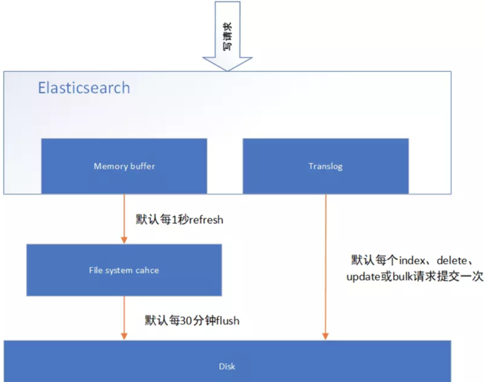

commit操作流程

commit 操作首先就是将 buffer 中现有数据 refresh 到 os cache 中去，清空 buffer。
然后，将一个 commit point 写入磁盘文件，里面标识着这个 commit point 对应的所有 segment file ，同时强行将 os cache 中目前所有的数据都 fsync 到磁盘文件中去。
最后清空 现有 translog 日志文件，重启一个 translog，此时 commit 操作完成。

这个 commit 操作叫做 flush 。

默认 30 分钟自动执行一次 flush ，将文件系统缓存的数据刷入到磁盘。
但如果 translog 过大，也会触发 flush 。

flush 操作就对应着 commit 的全过程，我们可以通过 es api，手动执行 flush 操作，手动将 os cache 中的数据 fsync 强刷到磁盘上去。

## 4.es准实时机制

### 1.为什么叫 es 是准实时的？

NRT ，全称 near real-time 。默认是每隔 1 秒 refresh 一次的，所以 es 是准实时的，因为写入的数据 1 秒之后才能被看到。

可以通过 es 的 restful api 或者 java api ，手动执行一次 refresh 操作，就是手动将 buffer 中的数据刷入 os cache 中，让数据立马就可以被搜索到。只要数据被输入 os cache 中，buffer 就会被清空了，因为不需要保留 buffer 了，数据在 translog 里面已经持久化到磁盘去一份了。

### 2.es会数据丢失吗？

可能会丢失有 5 秒的数据，停留在 buffer、translog os cache、segment file os cache 中，而不在磁盘上，此时如果备份到translog过程中宕机，会导致 5 秒的数据丢失。

translog 其实也是先写入 os cache 的，默认每隔 5 秒刷一次到磁盘中去，所以默认情况下，可能有 5 秒的数据会仅仅停留在 buffer 或者 translog 文件的 os cache 中，如果此时机器挂了，会丢失 5 秒钟的数据。但是这样性能比较好，最多丢 5 秒的数据。
也可以将 translog 设置成每次写操作必须是直接 fsync 到磁盘，但是性能会差很多。

### 5.es集群脑裂

关于集群脑裂的定义请参考我的另一篇博文

https://blog.csdn.net/sinat_34814635/article/details/129914369

那么es是如何解决脑裂问题的？

es是直到有足够的master候选节点时，才可以选举出一个master，否则就不要选举出一个master。

这个参数必须被设置为集群中master候选节点的quorum数量，也就是大多数，至于quorum的算法，就是：master候选节点数量 / 2 + 1。

综上所述，一个生产环境的es集群，至少要有3个节点，同时将这个参数设置为quorum，也就是2。discovery.zen.minimum_master_nodes设置为2

那么这个是参数是如何避免脑裂问题的产生的呢？比如我们有3个节点，quorum是2.现在网络故障，1个节点在一个网络区域，另外2个节点在另外一个网络区域，不同的网络区域内无法通信。

这个时候有两种情况情况：

（1）如果master是单独的那个节点，另外2个节点是master候选节点，那么此时那个单独的master节点因为没有指定数量的候选master node在自己当前所在的集群内，因此就会取消当前master的角色，尝试重新选举，但是无法选举成功。然后另外一个网络区域内的node因为无法连接到master，就会发起重新选举，因为有两个master候选节点，满足了quorum，因此可以成功选举出一个master。此时集群中就会还是只有一个master。

（2）如果master和另外一个node在一个网络区域内，然后一个node单独在一个网络区域内。那么此时那个单独的node因为连接不上master，会尝试发起选举，但是因为master候选节点数量不到quorum，因此无法选举出master。而另外一个网络区域内，原先的那个master还会继续工作。这也可以保证集群内只有一个master节点。

综上所述，集群中master节点的数量至少3台，三台主节点通过在elasticsearch.yml中配置discovery.zen.minimum_master_nodes: 2，就可以避免脑裂问题的产生。

## 四、ElasticSearch应用

### 1.Elasticsearch SQL


Elasticsearch SQL允许执行类SQL的查询，可以使用REST接口、命令行或者是JDBC，都可以使用SQL来进行数据的检索和数据的聚合。

Elasticsearch SQL特点：

本地集成

Elasticsearch SQL是专门为Elasticsearch构建的。每个SQL查询都根据底层存储对相关节点有效执行。

没有额外的要求

不依赖其他的硬件、进程、运行时库，Elasticsearch SQL可以直接运行在Elasticsearch集群上

轻量且高效

像SQL那样简洁、高效地完成查询

Elasticsearch SQL提供了sql转换的功能，但是只能满足一些简单的查询，例如：不支持JOIN、不支持较复杂的子查询。官方还是推荐使用DSL语句来实现

### 2.Java客户端

这个就自己看官网吧

### 4.1 es和mysql的双写

双写的流程：
* 1.先写数据库，然后写es，es只存常搜索的索引字段。
* 2.读取时先读es，找到对应主键后，然后根据主键在读mysql。（这种场景主要出现在mysql是分表的，而主键配置的是分片键，非分片键的查询将扫描全表）
首先不建议进行双写，因为会造成数据不一致这样新的问题。造成不一致的原因为写入es或者更新es字段失败，加上补充机制后也没有成功。

双写的同步

分页查询mysql中的数据，放入mq中（放入mq中的原因，为读取mysql的线程会远比执行同步的线程速度快），同步线程从mq中拉起数据，然后和es对比，如果不同，与mysql中的数据为准，进行删除复制。

补偿机制

我认为任何对es写失败，更新失败，删除失败都应该纪录下来，然后去手动操作使其同步。

## 五、ElasticSearch安装配置

### 1.安装ElasticSearch

解压下载的压缩包，本次使用7.14.0版本

从v7开始，elasticsearch不用单独安装JDK，因为它在下载时会自动下载对应的jdk包。因此不用额外下载jdk和配置环境变量。

在终端cd到elasticsearch的bin目录，运行命令./elasticsearch即可开启es数据库服务（在终端通过按control + c可停止服务）。在网页中访问localhost:9200看到json结果即启动成功。

如下图所示：

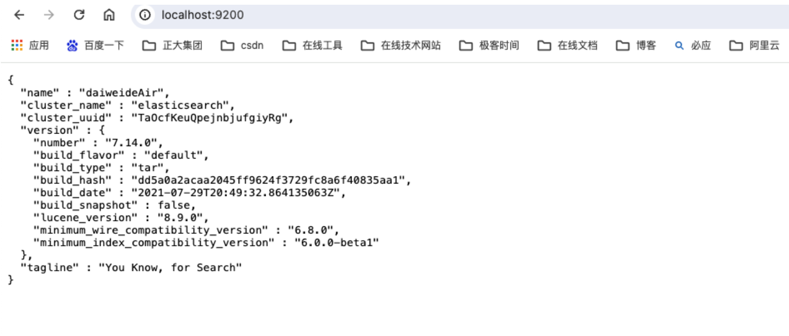

### 2.安装Kibana

下载可视化工具Kibanahttps://www.elastic.co/cn/downloads/kibana

解压下载的压缩包，并将其复制粘贴至自己想要存放的目录。Kibana的版本最好和es保持一致，如这次同样使用7.14.0版本

启动Kibana

在终端cd到Kibana目录下，运行命令./Kibana即可开启Kibana的端口访问。在网页中访问http://localhost:5601跳转到如下界面即访问成功。

访问下面地址：http://localhost:5601/app/dev_tools#/console 可进入管理后台

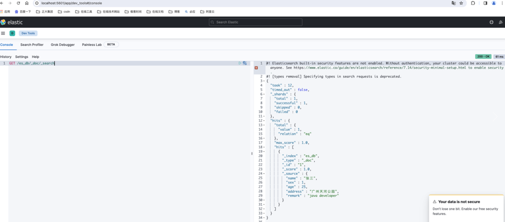

ElasticSearch可视化工具之cerebro
