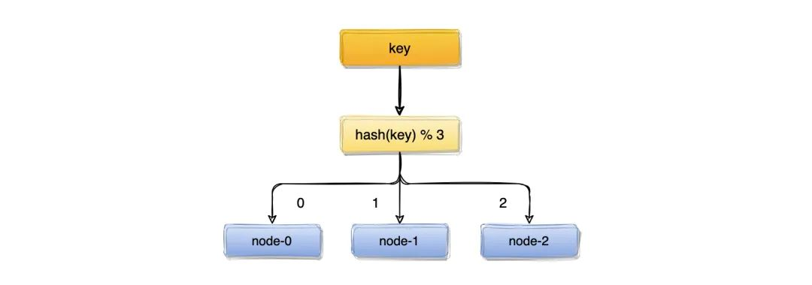
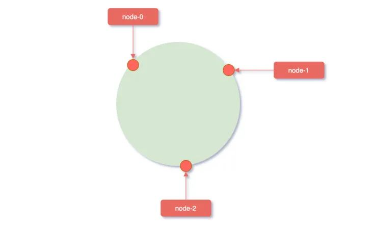
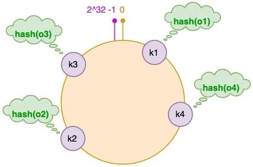
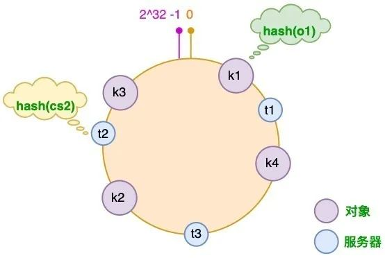
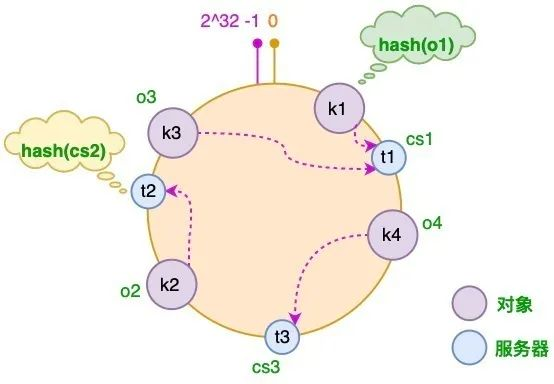
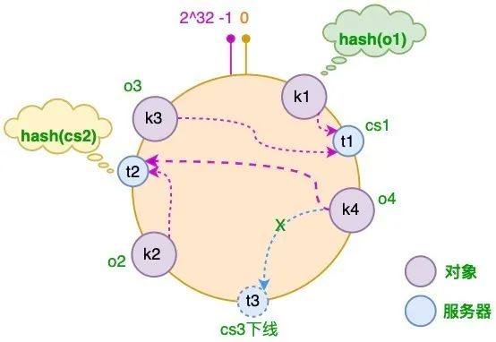
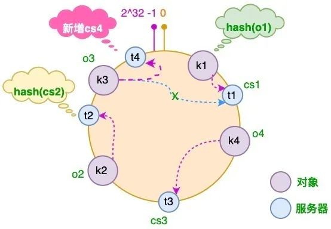
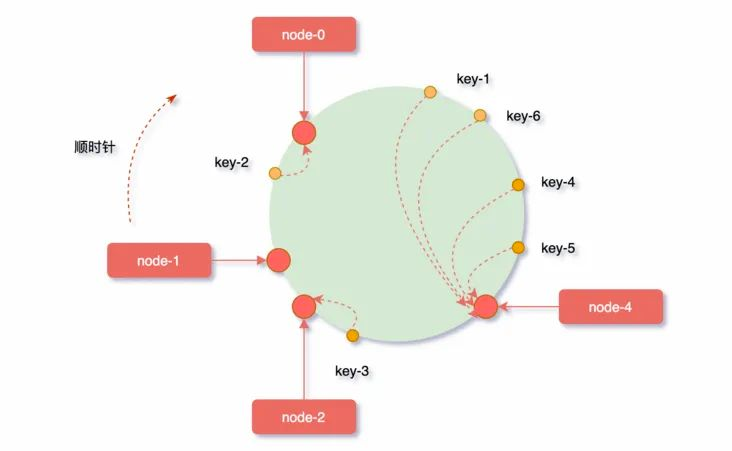

## 简介

在分布式系统中，数据的存储和访问是很重要的问题。为了提高系统的可用性和扩展性，常常需要将数据分布到不同的节点上，而且这些节点也可能会动态地加入或离开集群。一致性哈希算法就是一种常用的解决方案，它可以解决节点的动态变化和负载均衡的问题。

本文将深入探讨一致性哈希算法的底层原理，包括其基本思想、关键步骤以及优缺点等，同时结合实际场景进行举例说明。

## 产生背景
考虑这么一种场景：

我们有三台缓存服务器编号node0、node1、node2，现在有 3000 万个key，希望可以将这些个 key 均匀的缓存到三台机器上，你会想到什么方案呢？

我们可能首先想到的方案是：取模算法hash（key）% N，即：对 key 进行 hash 运算后取模，N 是机器的数量；

这样，对 key 进行 hash 后的结果对 3 取模，得到的结果一定是 0、1 或者 2，正好对应服务器node0、node1、node2，存取数据直接找对应的服务器即可，简单粗暴，完全可以解决上述的问题；



取模算法虽然使用简单，但对机器数量取模，在集群扩容和收缩时却有一定的局限性：因为在生产环境中根据业务量的大小，调整服务器数量是常有的事；

而服务器数量 N 发生变化后hash（key）% N计算的结果也会随之变化！


比如：一个服务器节点挂了，计算公式从hash（key）% 3变成了hash（key）% 2，结果会发生变化，此时想要访问一个 key，这个 key 的缓存位置大概率会发生改变，那么之前缓存 key 的数据也会失去作用与意义；

大量缓存在同一时间失效，造成缓存的雪崩，进而导致整个缓存系统的不可用，这基本上是不能接受的；

为了解决优化上述情况，一致性 hash 算法应运而生~

## 什么是一致性哈希算法
一致性哈希算法是一种用于分布式系统中的数据分片和负载均衡的算法。它将整个哈希空间划分为一个环，并且每个节点在这个环上都有一个对应的位置。当需要读写某个数据时，先将其进行哈希运算得到一个哈希值，然后根据这个哈希值在环上找到对应的节点，从而实现数据的定位。

一致性哈希算法的优点在于：当新增或删除节点时，只会影响到环上的一小部分节点，因此不会像传统的哈希算法那样造成大量的数据迁移和重新分片。同时，由于节点数较多，请求可以被更好地平均分配，从而实现了负载均衡的效果。

另外，一致性哈希算法还可以通过增加虚拟节点来解决节点不均衡的问题，从而进一步提高负载均衡的效果。

## 一致性哈希算法原理
一致性哈希算法在 1997 年由麻省理工学院提出，是一种特殊的哈希算法，在移除或者添加一个服务器时，能够尽可能小地改变已存在的服务请求与处理请求服务器之间的映射关系；

一致性哈希解决了简单哈希算法在分布式哈希表（Distributed Hash Table，DHT）中存在的动态伸缩等问题；

一致性 hash 算法本质上也是一种取模算法；

不过，不同于上边按服务器数量取模，一致性 hash 是对固定值 2^32 取模；

IPv4 的地址是 4 组 8 位 2 进制数组成，所以用 2^32 可以保证每个 IP 地址会有唯一的映射；

1. hash 环
   我们可以将这2^32个值抽象成一个圆环 ⭕️，圆环的正上方的点代表 0，顺时针排列，以此类推：1、2、3…直到2^32-1，而这个由 2 的 32 次方个点组成的圆环统称为hash环；


2. 服务器映射到 hash 环
   在对服务器进行映射时，使用hash（服务器ip）% 2^32，即：

使用服务器 IP 地址进行 hash 计算，用哈希后的结果对2^32取模，结果一定是一个 0 到2^32-1之间的整数；

而这个整数映射在 hash 环上的位置代表了一个服务器，依次将node0、node1、node2三个缓存服务器映射到 hash 环上；



3. 对象 key 映射到服务器
   在对对应的 Key 映射到具体的服务器时，需要首先计算 Key 的 Hash 值：hash（key）% 2^32；

注：此处的 Hash 函数可以和之前计算服务器映射至 Hash 环的函数不同，只要保证取值范围和 Hash 环的范围相同即可（即：2^32）；

将 Key 映射至服务器遵循下面的逻辑：

从缓存对象 key 的位置开始，沿顺时针方向遇到的第一个服务器，便是当前对象将要缓存到的服务器；

假设我们有 “semlinker”、“kakuqo”、“lolo”、“fer” 四个对象，分别简写为 o1、o2、o3 和 o4；

首先，使用哈希函数计算这个对象的 hash 值，值的范围是 [0, 2^32-1]：



图中对象的映射关系如下：
```java
hash(o1) = k1; hash(o2) = k2;
hash(o3) = k3; hash(o4) = k4;

```

同时 3 台缓存服务器，分别为 CS1、CS2 和 CS3：



则可知，各对象和服务器的映射关系如下：

```java
K1 => CS1
K4 => CS3
K2 => CS2
K3 => CS1

```

即：



以上便是一致性 Hash 的工作原理；

> 可以看到，一致性 Hash 就是：将原本单个点的 Hash 映射，转变为了在一个环上的某个片段上的映射！

## 服务器扩缩容场景
1. 服务器减少

假设 CS3 服务器出现故障导致服务下线，这时原本存储于 CS3 服务器的对象 o4，需要被重新分配至 CS2 服务器，其它对象仍存储在原有的机器上：



此时受影响的数据只有 CS2 和 CS3 服务器之间的部分数据！

2. 服务器增加

假如业务量激增，我们需要增加一台服务器 CS4，经过同样的 hash 运算，该服务器最终落于 t1 和 t2 服务器之间，具体如下图所示：



此时，只有 t1 和 t2 服务器之间的部分对象需要重新分配；

在以上示例中只有 o3 对象需要重新分配，即它被重新到 CS4 服务器；

在前面我们已经说过：如果使用简单的取模方法，当新添加服务器时可能会导致大部分缓存失效，而使用一致性哈希算法后，这种情况得到了较大的改善，因为只有少部分对象需要重新分配！

## 数据偏斜&服务器性能平衡问题
1. 引出问题

在上面给出的例子中，各个服务器几乎是平均被均摊到 Hash 环上；

但是在实际场景中很难选取到一个 Hash 函数这么完美的将各个服务器散列到 Hash 环上；

此时，在服务器节点数量太少的情况下，很容易因为节点分布不均匀而造成数据倾斜问题；

如下图被缓存的对象大部分缓存在node-4服务器上，导致其他节点资源浪费，系统压力大部分集中在node-4节点上，这样的集群是非常不健康的：



同时，还有另一个问题：

在上面新增服务器 CS4 时，CS4 只分担了 CS1 服务器的负载，服务器 CS2 和 CS3 并没有因为 CS4 服务器的加入而减少负载压力；如果 CS4 服务器的性能与原有服务器的性能一致甚至可能更高，那么这种结果并不是我们所期望的；

2. 虚拟节点

针对上面的问题，我们可以通过：引入虚拟节点来解决负载不均衡的问题：

即将每台物理服务器虚拟为一组虚拟服务器，将虚拟服务器放置到哈希环上，如果要确定对象的服务器，需先确定对象的虚拟服务器，再由虚拟服务器确定物理服务器；

如下图所示：


在图中：o1 和 o2 表示对象，v1 ~ v6 表示虚拟服务器，s1 ~ s3 表示实际的物理服务器；

3. 虚拟节点的计算

虚拟节点的 hash 计算通常可以采用：对应节点的 IP 地址加数字编号后缀 hash（10.24.23.227#1) 的方式；

举个例子，node-1 节点 IP 为 10.24.23.227，正常计算node-1的 hash 值：

* hash（10.24.23.227#1）% 2^32
假设我们给 node-1 设置三个虚拟节点，node-1#1、node-1#2、node-1#3，对它们进行 hash 后取模：

* hash（10.24.23.227#1）% 2^32
* hash（10.24.23.227#2）% 2^32
* hash（10.24.23.227#3）% 2^32

注意：

* 分配的虚拟节点个数越多，映射在 hash 环上才会越趋于均匀，节点太少的话很难看出效果；
* 引入虚拟节点的同时也增加了新的问题，要做虚拟节点和真实节点间的映射，对象key->虚拟节点->实际节点之间的转换；
## 使用场景
一致性 hash 在分布式系统中应该是实现负载均衡的首选算法，它的实现比较灵活，既可以在客户端实现，也可以在中间件上实现，比如日常使用较多的缓存中间件memcached和redis集群都有用到它；

memcached 的集群比较特殊，严格来说它只能算是伪集群，因为它的服务器之间不能通信，请求的分发路由完全靠客户端来的计算出缓存对象应该落在哪个服务器上，而它的路由算法用的就是一致性 hash；

还有 redis 集群中 hash 槽的概念，虽然实现不尽相同，但思想万变不离其宗，看完本篇的一致性 hash，你再去理解 redis 槽位就轻松多了；

其它的应用场景还有很多：

* RPC框架Dubbo用来选择服务提供者
* 分布式关系数据库分库分表：数据与节点的映射关系
* LVS负载均衡调度器
* ……
## 小结
一致性哈希是一种用于分布式系统中数据负载均衡的算法。在分布式系统中，多个服务器节点需要负责处理不同的请求，但由于每个请求的负载大小不同，因此会导致服务器节点的负载不平衡，一些节点可能会过度负载，而另一些节点则占用较少的资源。这就需要一种算法来平衡各个节点之间的负载。

一致性哈希算法通过将服务器节点和请求都映射到一个固定的哈希环上，使得每个请求可以被映射到一个特定的服务器节点上。同时，在哈希环上沿顺时针方向查找离该请求最近的服务器节点，并将该请求路由到该节点上，从而实现了负载均衡。一致性哈希算法还支持添加或删除服务器节点，同时保持大部分请求仍然能够映射到原来的节点上，以避免数据迁移带来的复杂性和成本。

总之，一致性哈希算法可以提高分布式系统的可扩展性和可靠性，减少系统崩溃等问题的风险，从而更好地满足大规模应用所需的高吞吐量和低延迟要求。

