## 1.背景

在实际开发中，我们经常要一边开发一边测试，当然这里说的测试并不是程序员对自己代码的单元测试，而是同组程序员将代码提交后，由测试人员测试；

或者前后端分离后，经常会修改接口，然后重新部署；

这些情况都会涉及到频繁的打包部署；

手动打包常规步骤：

* 1.提交代码
* 2.问一下同组小伙伴有没有要提交的代码
* 3.拉取代码并打包（war包，或者jar包）
* 4.上传到Linux服务器
* 5.查看当前程序是否在运行
* 6.关闭当前程序
* 7.启动新的jar包
* 8.观察日志看是否启动成功
* 9.如果有同事说，自己还有代码没有提交......再次重复1到8的步骤！！！！！（一上午没了）


那么，有一种工具能够实现，将代码提交到git后就自动打包部署勒，答案是肯定的：Jenkins

当然除了Jenkins以外，也还有其他的工具可以实现自动化部署，如Hudson等

只是Jenkins相对来说，使用得更广泛。

## 2.Jenkins服务器搭建及基本配置

### 2.1.简介

　　Jenkins是一个开源软件项目，是基于Java开发的一种持续集成工具，用于监控持续重复的工作，旨在提供一个开放易用的软件平台，使软件的持续集成变成可能。

### 2.2.Jenkins自动化部署实现原理


### 2.3.Jenkins部署环境

基本环境：

* 1.jdk环境，Jenkins是java语言开发的，因需要jdk环境。
* 2.git/svn客户端，因一般代码是放在git/svn服务器上的，我们需要拉取代码。
* 3.maven客户端，因一般java程序是由maven工程，需要maven打包，当然也有其他打包方式，如：gradle

以上是自动化部署java程序jenkins需要的基本环境，请自己提前安装好，下面着重讲解Jenkins的安装部署配置。

### 2.4.Jenkins安装

* 1.下载安装包jenkins.war；
* 2.在安装包根路径下，运行命令 java -jar jenkins.war --httpPort=8080，（linux环境、Windows环境都一样）； 补充:一个童鞋遇到的问题,反馈说,git自动触发时报错403,启动加如下参数可以解决问题 nohup java -jar -Dhudson.security.csrf.GlobalCrumbIssuerConfiguration.DISABLE_CSRF_PROTECTION=true /usr/local/jenkins/jenkins.war --httpPort=8080 &
* 3.打开浏览器进入链接 http://localhost:8080.
* 4.填写初始密码，激活系统

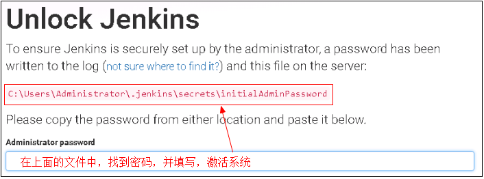

* 5.进入插件安装选择

这里建议选择，推荐安装的插件，保证基本常用的功能可以使用。

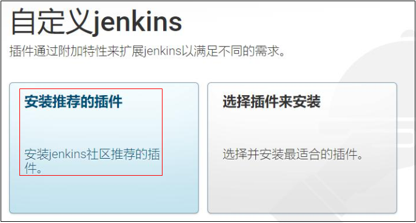

选择后，进入插件安装页面
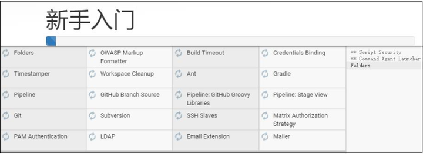


* 6.设置初始用户和密码
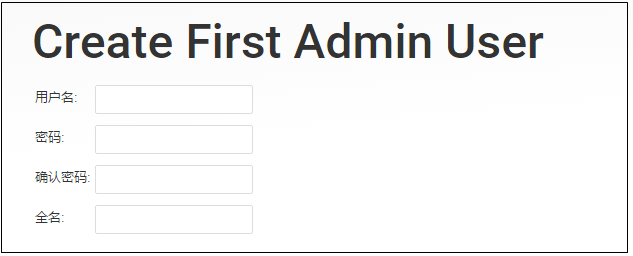


* 7.进入系统，安装完成
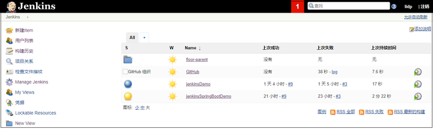


注意，如果还是进入不了系统，需要稍等一下，或者刷新页面，如果还是进入不了，需要重新启动jenkinds服务器。

### 2.5.Jenkins基本配置

#### 2.5.1.系统初始化配置


**1.Configure System (系统设置)**

在系统设置这里，我们只需要设置最后面的一项，配置远程服务器地址，

即我们代码最终运行的服务器地址信息，就像我们之前手动部署时使用xshell登录Linux服务器一样，

当然这里是可以配置多台远程Linux服务器的，配置完成后点击保存即可，为后面我们配置自动化部署做准备，配置如下图
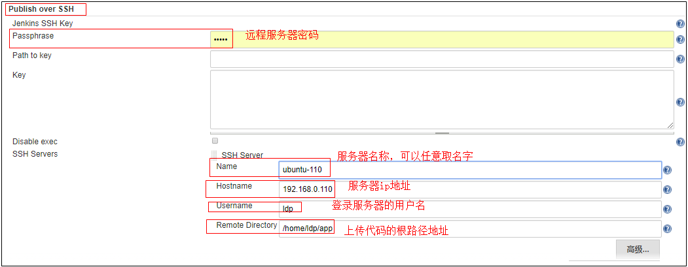

**2.Configure Global Security (全局安全配置)**

a.配置用户相关的权限

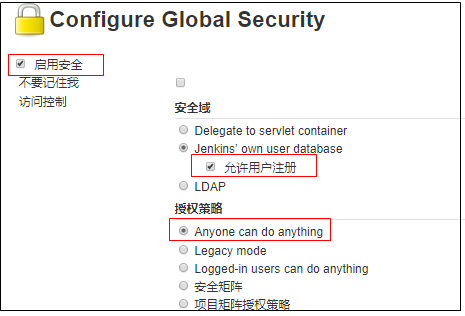

b.配置钩子程序（当用代码更新时通知）访问权限，避免报403错误

默认是勾选上了的，这里去掉勾选


**3.Global Tool Configuration (全局工具配置 )**

a.配置maven的全局settings路径
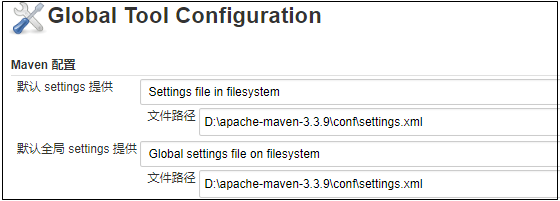

b.配置jdk
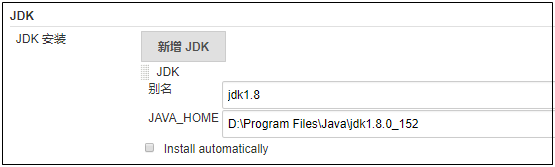


c.配置git


d.配置maven的安装路径

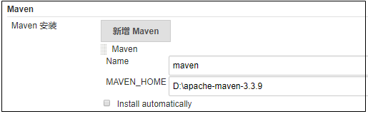


**4.配置必要插件**

主要是检查如下这两个插件是否已安装

* 插件1：Publish over SSH
* 插件2：Deploy to container Plugin


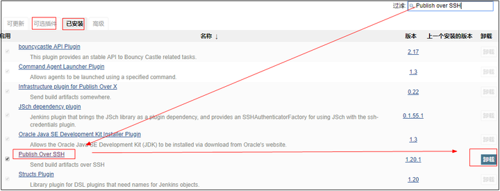

添加图片注释，不超过 140 字（可选）

到这里，我们配置一个自动化部署的的java程序（springBoot+maven+gitHub），基本必要配置就差不多了，后面配置过程中如果需要在配置。

## 3.Jenkins自动化部署（springBoot+maven+gitHub）项目

### 　3.1.Jenkins服务器上创建项目和配置

　　大体步骤：General(基础配置)--》源码管理--》构建触发器--》构建环境--》构建--》构建后操作

**1.创建一个工程**

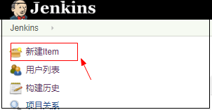

**2.General(基础配置)**

仅需填写标准部分，其他可不填写

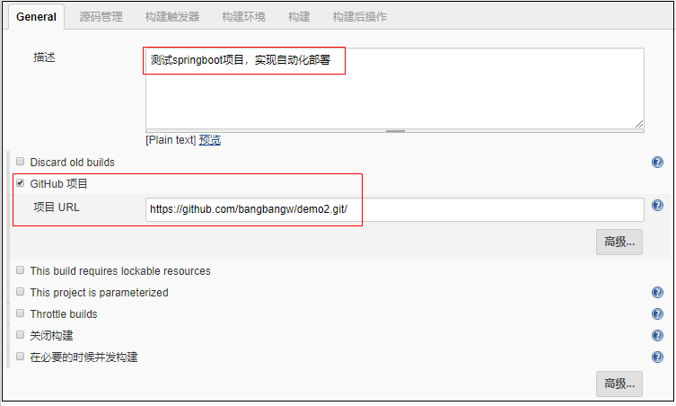

**3.源码管理**
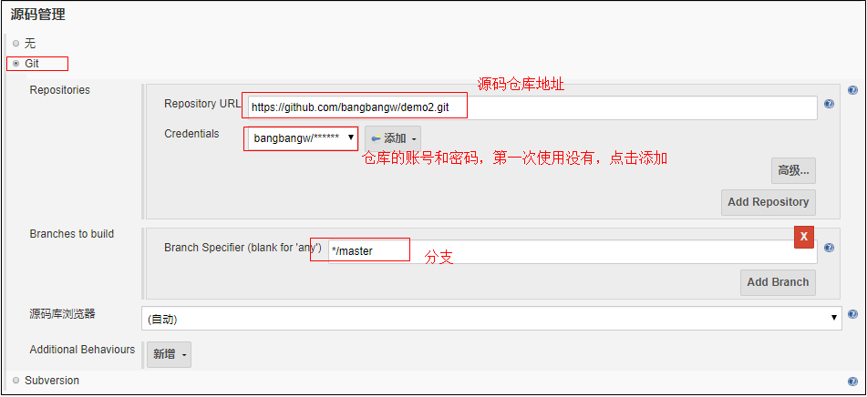


上图中点击“添加”按钮添加一组账号和密码
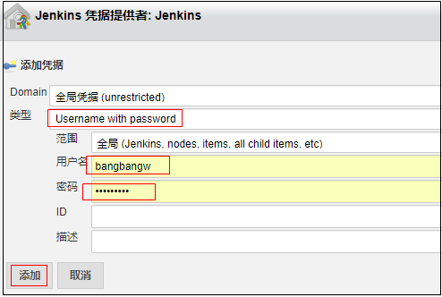

**4.构建触发器**

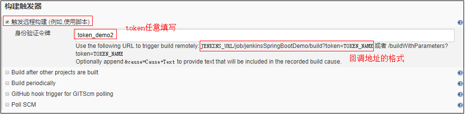


如上图：当前项目的回调地址为：

http://localhost:8080/job/jenkinsSpringBootDemo/build?token=token_demo2

只要执行这个地址（在浏览器上访问改地址），该项目就会发起一次构建项目，即拉取代码打包部署操作，

在实际中，是由git服务器回调改地址，在后面讲git服务器配置时详细讲解 ，

值得注意的是，如果你是学习测试，使用的是GitHub服务，要确保你的回调地址已经试外网映射过的，即往外网可以访问

**5.构建环境（无需配置）**

**6.构建**

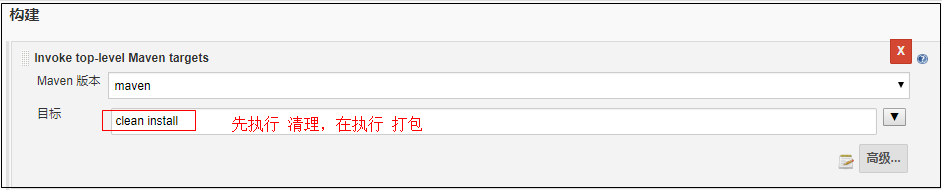

**7.构建后操作**

构建后操作的意思是，jar打包好后，要将jar发送到哪里去，发送后去和启动等

这里需要提前在需要部署的服务器上配置好路径，写好启动和停止项目的脚本，并设置为可以执行的脚本，

其实就是我们平时在Linux上手动部署项目操作的脚本
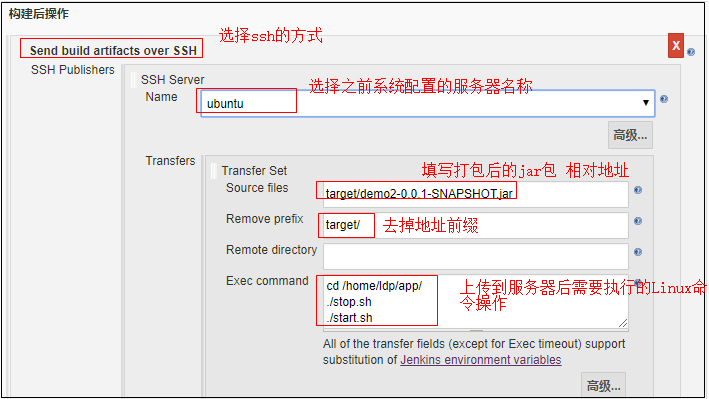


案例中给出的stop.sh脚本如下：
```java
1 #!/bin/bash
2 echo "Stop Procedure : demo2-0.0.1-SNAPSHOT.jar"
3 pid=`ps -ef |grep java|grep demo2-0.0.1-SNAPSHOT.jar|awk '{print $2}'`
4 echo 'old Procedure pid:'$pid
5 if [ -n "$pid" ]
6 then
7 kill -9 $pid
8 fi
```

　　案例中给出的start.sh脚本如下：
```java
        1 #!/bin/bash
        2 export JAVA_HOME=/usr/java/jdk1.8.0_131
        3 echo ${JAVA_HOME}
        4 echo 'Start the program : demo2-0.0.1-SNAPSHOT.jar'
        5 chmod 777 /home/ldp/app/demo2-0.0.1-SNAPSHOT.jar
        6 echo '-------Starting-------'
        7 cd /home/ldp/app/
        8 nohup ${JAVA_HOME}/bin/java -jar demo2-0.0.1-SNAPSHOT.jar &
        9 echo 'start success'
```

　　到此，Jenkinds服务器配置完成，接下来我还有要配置Linux服务器和Git服务器。

### 3.2.Linux服务器配置

　　在Liux服务上，上传上文中的两个脚本，用于启动和停止

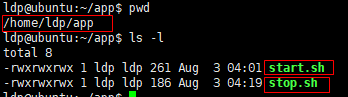


### 3.3.GitHub服务器配置

　　在GitHub服务器上的指定项目里面配置上文中提到的回调地址

特别注意：为了保证回调地址网可以使用，

我已经将地址：http://localhost:8080/job/jenkinsSpringBootDemo/build?token=token_demo2，

通过花生壳进行外网映射为：http://zhishidi.imwork.net/job/jenkinsSpringBootDemo/build?token=token_demo2

所以，下面配置的是外网映射地址。

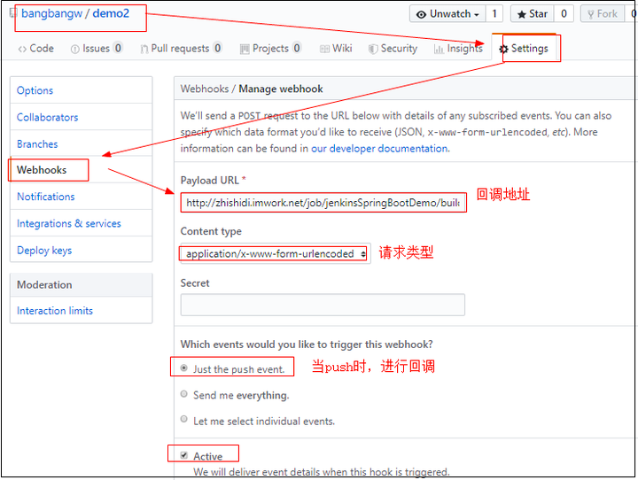

到这里所有配置搞定，只需修改代码，提交到git,然后访问程序看是否生效。

## 4.测试

**1.测试代码**


**2.提交代码到git,触发构建**

**3.在GitHub服务器上去看，是否已经触发**
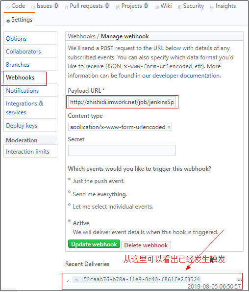


**4.在Jenkins的控制台查看是否，正在构建**

从下图中可以看出，正在构建


**5.查看当次构建的控制台日志**


说明已经启动成功

**6.查看Linux服务器，是否上传代码**

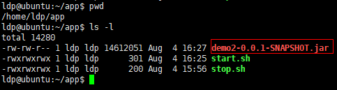


**7.在Linux上使用命令jps，查看是否启动**

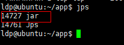


**8.浏览器上访问，看是否能用**

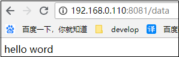

说明，已经正常启动可以使用。

**9.再次确认是否能自动化部署**

修改代码，重新提交代码，循环1到8步查看。

如果测试结果是你预期的，那么自动化部署成功。

## 5.总结&资料下载

### 5.1.总结

自动化部署Jenkins，作为一款工具，有着非常强大的功能，

上面我们只是讲了生产上做Java自动化部署的一个主要流程，

其他的功能，大家可以参看官方文档：Jenkins 用户手册

但是，本着学习是为了解决生产的原则，

个人建议，用到Jenkins的什么功能就学什么就可以了，

没必要把Jenkins的所有功能都学完在使用，

就如同我们使用word文档一样，并没有系统的他word文档学完后，在开始使用，而是用到什么功能就学习什么功能！

### 5.2.相关资料

* 1.案例中的源码地址：https://github.com/processfactory/demo01.git
* 2.官方文档：Jenkins 用户手册
