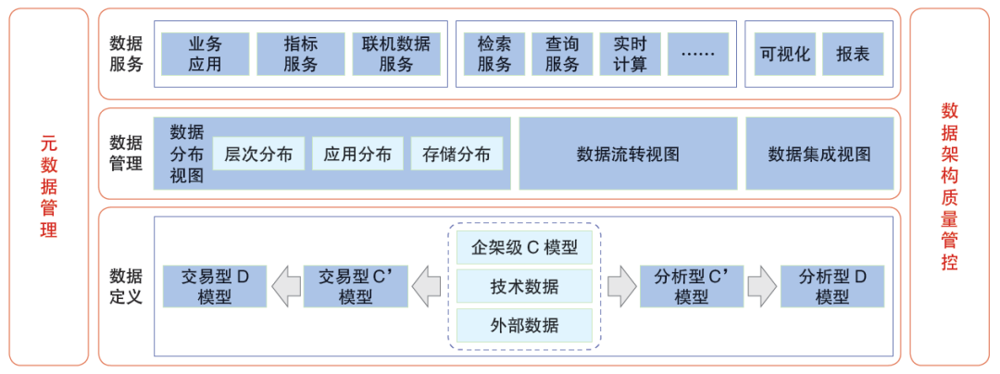
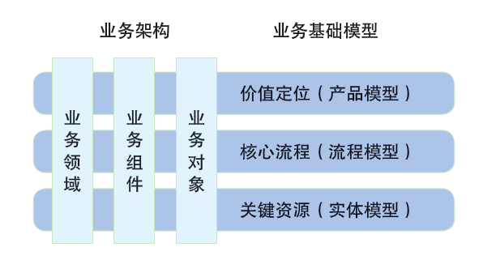

数字化转型背景下，银行业务和IT技术融合发展的趋势愈发明显。企业级架构通过统一的方法论进行企业级分析、设计、规划和实施，有助于将业务和技术更好地结合在一起，建立一整套基于操作模型的标准化流程，进而成功执行和实现战略转型。企业级架构主要可分为业务架构与IT架构两大部分，其核心作用包括贯彻企业战略、促进业务和科技融合、消除部门竖井，以及统一方法、统一语言、统一标准等，最终潜移默化地持续提升整体效率。针对这一趋势，笔者结合价值评估、数据治理、业技融合、方法实践等视角，尝试分析了实施企业级架构所能带来的模式改变与价值提升。

## 一、价值评估有章可循

近年来，金融科技与银行业务的依存关系愈发紧密，特别是各类新技术、新场景的不断涌现，推动用户体验持续完善、风控水平快速提升。然而，面对金融业务的快速发展，尽管科技部门采用了敏捷模式、外协模式不断提高产能，却依然很难达到需求方的期望。在此背景下，为有效缓解供需矛盾，需求价值评估环节应需而生，即当改造范围及工作量评估完成后，业务部门和科技部门在需求排期会再次进行沟通，以保证高优先级需求优先开发。但事实上，需求方大多以本部门利益为上，排期结论往往很难达成一致，其根本原因即在于价值评估没有贯穿在需求产生的过程中。

企业级架构建设循着企业价值创造的链条，可面向业务领域逐步开展需求识别和定义。对于业务领域而言，其主要职责是创造业务价值，承接战略分析成果，进行产品研发。实践中，业务领域需要清晰定义本领域应具备的能力，提出能力建设方案，并在领域范畴内，按照计划—执行—监督的完整价值流，识别出业务活动。业务活动是指创造端对端业务价值的具体工作，其价值交付主要以产品为载体，包括产品服务的客户、产品提供的渠道、产品所需的合作伙伴等，在流程模型中需要进行全面辨识。基于企业级架构方法论形成的业务需求和业务模型，有助于业务价值的体现和评估：

一是基于企业级架构的全局视角，可以减少个别部门的短期促销行为，同时避免不规范需求引发的产品定价、业务流程不一致等问题。二是企业级架构承接业务战略，始终围绕着价值创造建设，而需求在经过“战略解析—能力主题—产品设计—流程设计—能力实现”的工作模型检验后，将能够更好地满足战略需要，有利于提高核心竞争力。三是需求的业务价值更容易量化，基于企业级架构，可建立产品、客户、渠道、合作方贡献度评价体系，对需求带来的效益进行数字化评估。四是业务需求价值评估能力提高，可以使科技产能更好地倾向于重点需求开发，快速形成竞争力。

## 二、数据治理追本溯源

如果说价值交付是建设企业级架构的核心，那么业务信息则是构成企业级架构的基础，内容涉及业务架构的业务对象以及业务模型的实体模型等。对此，IT架构的数据架构进一步从数据定义、数据管理、数据服务等方向，规定了数据生命周期中各种形态的管理原则。数据架构组成示意如图1所示。例如，针对实体建模，该架构详细描述定义了业务实体和实体属性；针对数据定义，要求开发数据结构准确继承实体模型；针对元数据管理，要求建立企业级数据字典，保证数据能被正确描述和使用。此外，在数据质量管控方面，则是要求在组织、办法和流程等维度进行全面统筹。

实践证明，如果不能全面梳理数据脉络，数据治理的结果往往是事倍功半。对此，企业级架构有助于为全面实施数据治理打开局面：一是在需求的业务建模阶段，业务流程的数据需求和实体模型需要进行相互验证，并通过企业级数据字典进行定义，在源头保证数据准确性。二是从架构设计到实施工艺，从实体建模到数据结构设计，借助企业级架构可形成全面的数据管理办法，保证数据在产生、传输、存储、服务各个环节的一致性。三是基于企业级架构，可将内部能力按业务组件归集，并依照业务组件开发应用组件，同时加强数据副本管理，进而避免因同类业务被不同应用系统承接导致的管理复杂化问题。综上，数据治理是数字化转型的一项基础性工作，而企业级架构恰好提供了一枚“金钥匙”。

## 三、业务与技术更好衔接

在瀑布式开发模式下，标准化需求确认需要经历多个不同阶段的准入门禁，需求响应缓慢。与之相比，敏捷开发模式强调客户参与，更有助于加速需求交付进程，例如将开发过程前移到需求提出阶段，或是请业务人员加入开发团队等。除此之外，企业级架构也为业务与技术融合提供了一种新的途径：

* 一是在提交业务需求前，通过对活动进行流程建模，以及对业务对象进行实体建模，并采用结构化、标准化语言(如流程建模的BPMN图和实体建模的ER图等)消弭理解歧义，可基于业务模型团队构建衔接业务和技术的桥梁。
* 二是企业级架构结合内部视角，可从业务流程、职责划分等维度映射业务组件与应用组件的对应关系，进而实现业务和技术的完美对应。
* 三是企业级架构的流程建模需要勾连相关实体，而建模产出物结合面向对象的设计方法，将能方便地识别出符合客观世界的对象，对象拥有实体属性，并具备流程模型描述的处理能力。
* 四是企业级架构在进行实体建模时，可对实体进行归类，定义出主实体，并与周边的多个实体组成业务对象(子主题域)。在开发阶段，通过将业务建模的业务对象(子主题域)设计成相应的数据聚合，可有效保证技术和业务理解一致，使用“共同语言”。

总体而言，业务模型通过以业务视角来描述战术层和运营层的业务架构，可为IT架构提供高效输入，而善于使用业务架构和业务模型，也将使业务与技术衔接得更好，加快需求响应速度。业务架构基础模型如图2所示。

## 四、方法实践潜移默化

从实践角度发出，企业级架构不仅是对业务架构和IT架构进行全局设计，还提供了精确描述企业的统一方法论，如可灵活应用在日常工作中，将产生潜移默化的积极影响：

* 一是价值链分析。企业级架构进行企业层面的流程模型设计，遵循价值创造的链条识别业务领域，并在业务领域通过各类活动实现业务价值，接着就是将活动下的任务按能力类别聚合成业务组件。在IT实施阶段，可沿用同样的分析方法，按价值维度将业务组件进一步细分为子域，最后将能力进行聚合，开发出高内聚的微服务。
* 二是架构视图绘制。企业级架构的IT架构通常包含了四个维度，即安全架构、技术架构、数据架构和应用架构。其中，应用架构可进一步划分为三个阶段，即分层架构、逻辑架构、物理架构，并从功能视图、接口视图、剖面视图等多个维度进行描述。实践中，上述建模方法不仅可用于搭建企业级总体架构，在描述应用系统的内部架构时也同样适用。
* 三是名词术语。基于企业级架构建设，有助于统一名词术语，改善概念混淆的状况，进而减少沟通成本。例如，在旧文档中信息系统有时被称作“系统”，也有称作“产品”或“应用”的情况。而结合企业级架构建设，可将业务领域下各类活动的系统统一称为“应用”，负责承接业务组件的系统称为“应用组件”，名称更加准确、明白。
* 四是建模方法。业界常用的建模方法一般指业务建模采用的BPMN图和实体建模采用的ER图，两者作为通用的建模语言，在开发阶段也常被使用。而企业级架构借助建模过程可将上述方法进一步推广到整个组织，进而可大幅提高描述能力和沟通效率。
* 五是职责定义。企业级架构对工作职责的定义往往是从目标(WHY)、定义(WHAT)、范围(WHERE)等三个维度进行描述，不仅言简意赅，且广泛适用于各种场景。

综上，数字化转型是银行机构践行高质量发展的必由之路。自2018年提出数字化转型总体框架以来，中国银行于2019年全面启动数据治理，并在2020年启动了企业级架构建设，通过自上而下对业务架构、技术架构、工艺方法等进行全面整合，数据治理各环节工作变得更加顺畅，需求开发变得更加敏捷，数字化转型目标也愈发清晰可见!

