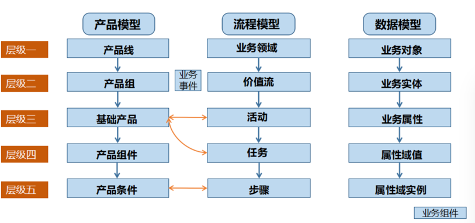
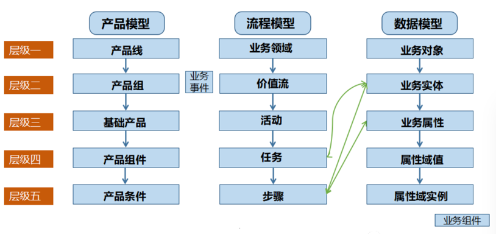
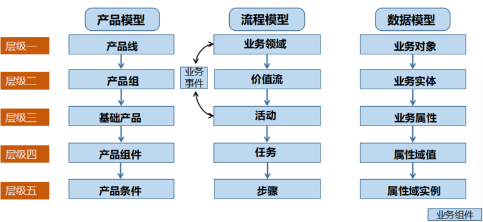

通俗来说，产品泛指银行销售给客户的服务，并通过与客户签订具体产品合约获取利益。产品模型站在企业视角，确定与产品相关的业务规则、限额、约束、期限、价格等要素，形成自上而下以产品线、产品组、基础产品、产品组件和产品条件的结构化模型表达。

企业级架构三大模型从不同视角描述整个业务体系，将企业战略分解细化到各个业务领域的具体环节，对原本分割的部分进行系统化表达，同时弥补了产品、流程及数据间信息的不一致。
产品模型是企业定制化产品的集合，阐述企业提供的服务是什么

流程模型展现可复用的业务环节，表达企业提供的服务怎么做

数据模型扮演高度集合的资源池，用统一的语言和视图支撑产品和流程模型。
从结构上看，产品模型和数据模型分别通过挂接流程模型进而产生关联，三者协同便可清晰、系统化地呈现企业最终为客户提供的服务。模型间联动产出物有效指导开发，实现业务能力的复用以及业务组件的灵活配置。

## 01、三大模型概述

1.企架三大模型之——产品模型

通俗来说，产品泛指银行销售给客户的服务，并通过与客户签订具体产品合约获取利益。产品模型站在企业视角，确定与产品相关的业务规则、限额、约束、期限、价格等要素，形成自上而下以产品线、产品组、基础产品、产品组件和产品条件的结构化模型表达。顶层的产品线可以理解为银行业务条线，可包含多个产品组，每一个产品组是对其唯一归属的产品线下具有相似业务性质基础产品的聚合。基础产品包含了聚类可售产品所有可能的特征，为对基础产品进一步划分，可创建不同的产品组件。产品组件的存在不仅能对基础产品做出细分，同时也是最底层产品特征相同或相似的产品条件的归类。产品条件表达产品对金额、利率、期限、数量等业务特征的限制规则，可用于对属性和逻辑的控制参数。

2.企架三大模型之——流程模型

流程模型用标准化的方式表达业务流程结构，可分为五层，逐层把企业业务能力分解为业务领域、价值流、活动、任务和步骤，并通过与产品模型和数据模型协同关系，精准刻画业务需求。顶层的业务领域是紧密相关业务的集合。价值流是一组互不相同、界限分明，但相互关联的生产经营活动，是构成价值创造的动态过程，如存款和贷款的界限分明但共同存在为银行创造价值。这里的活动由不同的事件触发，比如外部事件、时间或条件触发的内部事件，活动的存在是为了达成具体的业务目的，企业执行端到端的行为序列集合；活动也是从用户角度看到的执行业务流程。具体来讲，我们可用任务来表达从银行内部执行的操作。活动和任务具备明确目的性，要求产生可观测、有价值的结果。流程模型中最底层的步骤则涵盖所有最细化的业务规则和业务信息。

3.企架三大模型之——数据模型

数据模型是企业范围内统一的数据视图，通过一系列规范和相关图表反映数据需求和设计。根据规则从企业的视角对业务概念进行逻辑化、一致性的表述，用数据语言表达业务需求并展现业务规则，是联接业务和技术的桥梁，也是业务模型的主要组成部分。具体来看，顶层的业务对象是一组关联实体的集合，要求高内聚松耦合；关联的实体不允许重复或缺失。业务实体可视为以业务视角抽象表示一种客观存在于现实世界并且可以跟其他物体区分开，用一系列业务属性来描述的事物。

因此业务实体所具有的某一业务特性，我们称之为实体属性。若干个属性可共同刻画同一实体。向下延申，属性域值对属性取值范围进行规范，每个属性都有需要遵循的值的范围，通过域明确属性的取值规则。属性域实例只与代码类的域关联，用于进一步明确每一个取值下的规范。一个实例组会有多个取值，每个取值称为实例组的一个实例。业务组件是独立的业务模块，指具有相似资源、人和专业技能的任务组合，通过将标准化的任务按照业务对象聚类形成业务组件。

## 02、模型间协同关系

第一部分概述中已经对每个模型划分层级，比如产品模型自上而下分别是产品线、产品组、基础产品、产品组件和产品条件。三大模型间的协同关系主要也是讨论模型层级与层级间的联动，下面将分类剖析：

1.产品模型对接流程模型

基础产品与活动（多对多） 基础产品仅关联与产品有关的活动。活动可以看作是某个基础产品在提供服务有哪些环节划分，比如任何与贷款相关的基础产品需要有申请贷款额度、审核客户背景等环节共同搭建贷款服务体系。这些环节我们就可以说是这个基础产品对应的活动。在填写流程模型活动表单时，会体现活动编号、名称、详情等信息，也会专门有一列“产品信息”来体现活动对应到哪些具体的基础产品。基础产品与任务（多对多） 刚才提到活动是环节划分，而任务则是某环节衍生出来要做的事，因此任务与其上层活动所关联的基础产品范围上是一致的。延续”申请贷款额度“这个活动案例，银行方面需要完成的任务就是“受理额度申请”等一系列为了完成客户申请贷款额度而做的工作。我们也可以理解为活动是客户角度看到的环节，而任务是从我们服务提供方内部角度对活动拆解出来需要完成的事项。当活动关联了基础产品，才会建立该活动下层任务与基础产品的关系。产品条件与步骤（多对多） 步骤则是呈现任务中的事项具体如何去操作，是环节最细致的拆分。因此当活动和任务关联了基础产品，步骤作为最底层的拆分理应映射产品模型最下层的参数-产品条件。通常一个步骤需要关联至少一个产品条件，同时每个产品条件需要被至少一个步骤使用。对“受理额度申请”这个任务来说，其中一个“检查账户信息”的具体步骤，在流程模型步骤表单“与产品模型映射”列就可以映射“开户银行类型”这一产品条件，表示对某账户开户银行具体类型的选择。

2.数据模型对接流程模型

任务与业务实体（多对多） 数据模型中的实体由流程模型的任务创建而来。流程模型任务表单有专门一列“业务实体”来呈现关系。比如终止某产品协议就可以关联到“产品协议”这个实体。终止某产品协议是要做的事，要把这件事说清楚便需要创建一个产品协议实体去承接，且实体名称需与数据模型的实体精确匹配。步骤与业务实体（多对多） 步骤是任务的细化，和任务一样可以去操作实体。在实际工作中，会遇到步骤牵扯到多个实体的情况，比如“调查客户背景”这个任务，其中有一个步骤是“核实客户基本信息”，涉及操作“账户”实体和“客户信息”实体，这时可根据业务含义判断是否可拆分步骤，拆至最小颗粒度便于业务和技术人员清晰理解流程。步骤与实体属性（多对多） 实体属性用于描述业务实体。流程模型中的“业务规则”列需要体现涉及业务实体下的属性。主要体现对业务规则有影响的关键属性及对应的取值描述和使用规则。还是举“核实客户基本信息”这个步骤，在创建“客户信息”实体的同时会在业务规则中体现是对公客户还是对私客户，因此属性“客户公私类型”便会建立在数据模型与其做映射，属性的取值也直接影响到该步骤最终的结果。

3.业务组件对接业务对象和任务

业务组件与任务（一对多）

业务组件可视为业务分类器，作为独立的业务模块归集具有相似业务目的的任务。这里的相似主要是领域和数据使用的相似。比如“调查客户背景”和“识别客户风险”两项任务都是为了更好了解和识别客户信息和行为，涉及的数据都可以有账户实体下的所有属性字段。因此我们可以将它们归集在“客户管理”业务组件。一个任务只归属一个业务组件，一个业务组件下可包含多个紧密相关的任务。

业务组件与业务对象（一对一/多）

业务组件归集具有相似业务目的的任务，业务对象归集互相关联的实体，而实体由任务来创建。因此业务组件与业务对象的关联具体体现在业务组件下任务对业务对象下实体的操作。以最基本的存款业务举例，“存款”是业务组件，具体任务有“记录存款信息”和“更换存单”，这两项任务便可操作“存款账户”这个业务对象下的“存款合约”和“存单”两个实体。

3.业务事件承接业务领域和活动

业务领域对业务划分主题类型，其具体发生的行为操作称之为业务事件。围绕业务事件所产生的两条关系可总结为业务领域包含业务事件，而事件会触发一系列活动。比如贷款这个业务领域，我们能想到发生的业务事件包括申请住房贷款、购车贷款、助学贷款等贷款额度，这些事件便可触发申请个人贷款额度的活动，这个活动下面的任务和步骤则是对其需要做的事更细致的划分。一个领域涵盖多个事件，每个活动必由一个或多个业务事件触发。在实际建模工作中，三大模型分别建立再做关联映射大大提升建模难度，为了映射而映射，导致模型质量降低。因此，从建模初期保持三大建模的“实时”匹配尤其重要。无论是顶层领域划分规则还是底层参数设定，三个建模组通过完善的沟通机制共同协商而定，是企业级建模结果能够有效应用于全领域业务的基石。