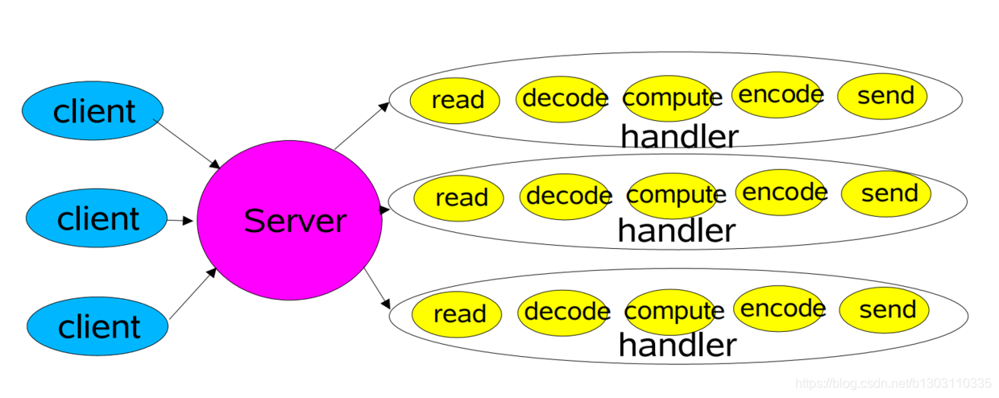
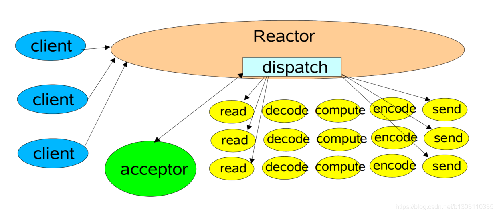
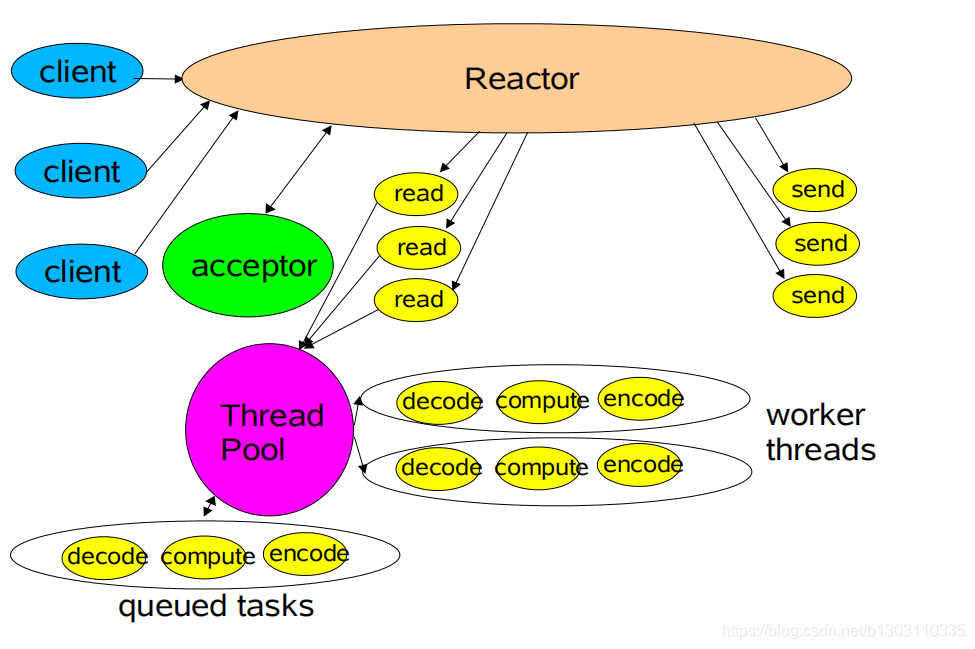
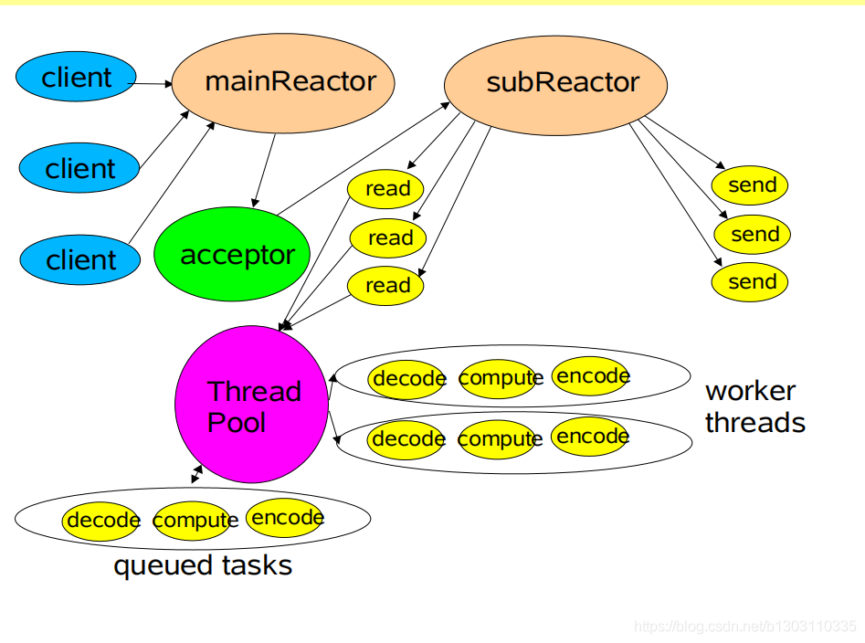
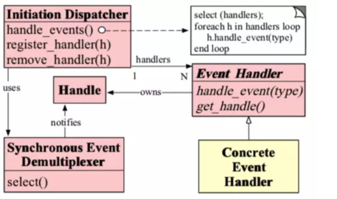

## 前言
说到NIO、Netty，Reactor模型一定是绕不开的，因为这种模式架构太经典了，但是好多人在学习的时候，往往会忽视基础的学习，一上来就是Netty，各种高大上，但是却没有静下心来好好看看Netty的基石——Reactor模型。本文就带着大家看看Reactor模型，让大家对Reactor模型有个浅显而又感性的认识。

## 一、经典的同步阻塞模型



这是最为传统的Socket服务设计，有多个客户端连接服务端，服务端会开启很多线程，一个线程为一个客户端服务。

在绝大多数场景下，处理一个网络请求有如下几个步骤：

* read：从socket读取数据。
* decode：解码，因为网络上的数据都是以byte的形式进行传输的，要想获取真正的请求，必定需要解码。
* compute：计算，也就是业务处理，你想干啥就干啥。
* encode：编码，同理，因为网络上的数据都是以byte的形式进行传输的，也就是socket只接收byte，所以必定需要编码。
1.下面看传统的BIO代码：

```java
public static void main(String[] args) {
        try {
            ServerSocket serverSocket = new ServerSocket(9696);
            Socket socket = serverSocket.accept();
            new Thread(() -> {
                try {
                    byte[] byteRead = new byte[1024];
                    socket.getInputStream().read(byteRead);
 
                    String req = new String(byteRead, StandardCharsets.UTF_8);//encode
                    // do something
 
                    byte[] byteWrite = "Hello".getBytes(StandardCharsets.UTF_8);//decode
                    socket.getOutputStream().write(byteWrite);
                } catch (IOException e) {
                    e.printStackTrace();
                }
            }).start();
        } catch (IOException e) {
            e.printStackTrace();
        }
    }

```
这个设计的问题就是：需要开启大量的线程。因为一个客户端独占一个线程

我们的目标是：

* 随着负载的增加可以优雅降级；
* 能够随着资源的改进，性能可以持续提升；
* 同时还要满足可用性和性能指标：
* 低延迟
* 满足高峰需求
* 可调节的服务质量

阻塞 （针对的是被调用方）

不管是等待客户端的连接，还是等待客户的数据，都是阻塞的，一夫当关，万夫莫开，不管你什么时候连接我，不管你什么时候给我数据，我都依然等着你。
让我们试想下：如果accept()、read()这两个方法都是不阻塞的，是不是传统的Socket问题就解决一半了？

同步 （针对的是调用方）

服务端是死死的盯着客户端，看客户端有没有连接我，有没有给我发数据。
如果我可以喝着茶，打着农药，而你发了数据，连接了我，系统通知我一下，我再去处理，那该多好，这样传统的Socket问题又解决了一半。

NIO就很好的解决了传统Socket问题：

* 一个线程可以监听多个Socket，不再是一夫当关，万夫莫开；
* 基于事件驱动：等发生了各种事件，系统可以通知我，我再去处理。

2.client端代码：

```java
import java.io.IOException;
import java.io.InputStream;
import java.net.InetSocketAddress;
import java.net.Socket;
import java.nio.charset.StandardCharsets;
import java.util.Scanner;

public class Client {
    public static void main(String[] args) {
        try {
            Socket socket = new Socket();
            socket.connect(new InetSocketAddress("localhost", 9090));
            new Thread(() -> {
                while (true) {
                    try {
                        InputStream inputStream = socket.getInputStream();
                        byte[] bytes = new byte[1024];
                        inputStream.read(bytes);
                        System.out.println(new String(bytes, StandardCharsets.UTF_8));
                    } catch (Exception e) {
                        e.printStackTrace();
                    }
                }
            }).start();

            while (true) {
                Scanner scanner = new Scanner(System.in);
                while (scanner.hasNextLine()) {
                    String s = scanner.nextLine();
                    socket.getOutputStream().write(s.getBytes());
                }
            }
        } catch (IOException e) {
            e.printStackTrace();
        }
    }
}

```
3.因此，我们要引出我们今日的主角: reactor

## 二、单reactor单线程设计



这是最简单的Reactor模型，可以看到有多个客户端连接到Reactor，Reactor内部有一个dispatch（分发器）。

有连接请求后，Reactor会通过dispatch把请求交给Acceptor进行处理，有IO读写事件之后，又会通过dispatch交给具体的Handler进行处理。

此时一个Reactor既然负责处理连接请求，又要负责处理读写请求，一般来说处理连接请求是很快的，但是处理具体的读写请求就要涉及到业务逻辑处理了，相对慢太多了。Reactor正在处理读写请求的时候，其他请求只能等着，只有等处理完了，才可以处理下一个请求。

单线程Reactor模型编程简单，比较适用于每个请求都可以快速完成的场景，但是不能发挥出多核CPU的优势，在一般情况下，不会使用单Reactor单线程模型。

代码示例

```java
public class Main {

    public static void main(String[] args) {
        Reactor reactor = new Reactor(9090);
        reactor.run();
    }
}


```

```java
public class Reactor implements Runnable {

    ServerSocketChannel serverSocketChannel;
    Selector selector;

    public Reactor(int port) {
        try {
            serverSocketChannel = ServerSocketChannel.open();
            selector = Selector.open();
            serverSocketChannel.socket().bind(new InetSocketAddress(port));
            serverSocketChannel.configureBlocking(false);
            // 注册了连接事件
            SelectionKey selectionKey = serverSocketChannel.register(selector, SelectionKey.OP_ACCEPT);
            // 并且在selectionKey对象附加了一个Acceptor对象，这是用来处理连接请求的类
            selectionKey.attach(new Acceptor(selector, serverSocketChannel));

        } catch (IOException e) {
            e.printStackTrace();
        }
    }

    @Override
    public void run() {
        while (true) {
            try {
                selector.select();
                Set<SelectionKey> selectionKeys = selector.selectedKeys();
                Iterator<SelectionKey> iterator = selectionKeys.iterator();
                while (iterator.hasNext()) {
                    SelectionKey selectionKey = iterator.next();
                    dispatcher(selectionKey);
                    iterator.remove();
                }
            } catch (IOException e) {
                e.printStackTrace();
            }
        }
    }

    private void dispatcher(SelectionKey selectionKey) {
        Runnable runnable = (Runnable) selectionKey.attachment();
        runnable.run();
    }
}

```
定义了一个Reactor类。

在构造方法中，注册了连接事件，并且在selectionKey对象附加了一个Acceptor对象，这是用来处理连接请求的类。

Reactor类实现了Runnable接口，并且实现了run方法，在run方法中，
监听各种事件，有了事件后，调用dispatcher方法，在dispatcher方法中，拿到了selectionKey附加的对象，随后调用run方法，注意此时是调用run方法，并没有开启线程，只是一个普通的调用而已。
```java
import java.io.IOException;
import java.nio.channels.SelectionKey;
import java.nio.channels.Selector;
import java.nio.channels.ServerSocketChannel;
import java.nio.channels.SocketChannel;

public class Acceptor implements Runnable {
    private Selector selector;

    private ServerSocketChannel serverSocketChannel;

    public Acceptor(Selector selector, ServerSocketChannel serverSocketChannel) {
        this.selector = selector;
        this.serverSocketChannel = serverSocketChannel;
    }

    @Override
    public void run() {
        try {
            SocketChannel socketChannel = serverSocketChannel.accept();
            System.out.println("有客户端连接上来了," + socketChannel.getRemoteAddress());
            socketChannel.configureBlocking(false);
            SelectionKey selectionKey = socketChannel.register(selector, SelectionKey.OP_READ);
            selectionKey.attach(new WorkerHandlerThreadPool(socketChannel));
        } catch (IOException e) {
            e.printStackTrace();
        }
    }
}

```

目前如果有事件发生，那一定是连接事件，因为在Reactor类的构造方法中只注册了连接事件，还没有注册读写事件。

发生了连接事件后，Reactor类的dispatcher方法拿到了Acceptor附加对象，调用了Acceptor的run方法，在run方法中又注册了读事件，然后在selectionKey附加了一个WorkHandler对象。

Acceptor的run方法执行完毕后，就会继续回到Reactor类中的run方法，负责监听事件。

此时，Reactor监听了两个事件，一个是连接事件，一个是读事件。

当客户端写事件发生后，Reactor又会调用dispatcher方法，此时拿到的附加对象是WorkHandler，所以又跑到了WorkHandler中的run方法。
```java
public class WorkHandler implements Runnable {
    private SocketChannel socketChannel;

    public WorkHandler(SocketChannel socketChannel) {
        this.socketChannel = socketChannel;
    }

    @Override
    public void run() {
        try {
            ByteBuffer byteBuffer = ByteBuffer.allocate(1024);
            socketChannel.read(byteBuffer);
            String message = new String(byteBuffer.array(), StandardCharsets.UTF_8);
            System.out.println(socketChannel.getRemoteAddress() + "发来的消息是:" + message);
            //System.out.println("sleep 10s");
            //Thread.sleep(10000);

            socketChannel.write(ByteBuffer.wrap("你的消息我收到了".getBytes(StandardCharsets.UTF_8)));
        } catch (IOException e) {
            e.printStackTrace();
        }
    }
}

```


WorkHandler就是真正负责处理客户端写事件的了。

下面我们可以进行测试了：
```java
有客户端连接上来了,/127.0.0.1:64571
有客户端连接上来了,/127.0.0.1:64577
/127.0.0.1:64571发来的消息是:123
/127.0.0.1:64577发来的消息是:456
/127.0.0.1:64571发来的消息是:我是第一个人
/127.0.0.1:64577发来的消息是:我是第二个人

```


我们知道了单Reactor单线程模型有那么多缺点，就可以有针对性的去解决了。让我们再回顾下单Reactor单线程模型有什么缺点：**在处理一个客户端的请求的时候，其他请求只能等着。**
那么我们只要+上多线程的概念不就可以了吗？没错，这就是单Reactor多线程模型。

## 三、单reactor多线程设计



可以看到，Reactor还是既要负责处理连接事件，又要负责处理客户端的写事件，不同的是，多了一个线程池的概念。

当客户端发起连接请求后，Reactor会把任务交给acceptor处理，如果客户端发起了写请求，Reactor会把任务交给线程池进行处理，这样一个服务端就可以同时为N个客户端服务了。

让我们继续敲敲键盘，实现一个单Reactor多线程模型把：
```java
public class Acceptor implements Runnable {
    private Selector selector;

    private ServerSocketChannel serverSocketChannel;

    public Acceptor(Selector selector, ServerSocketChannel serverSocketChannel) {
        this.selector = selector;
        this.serverSocketChannel = serverSocketChannel;
    }

    @Override
    public void run() {
        try {
            SocketChannel socketChannel = serverSocketChannel.accept();
            System.out.println("有客户端连接上来了," + socketChannel.getRemoteAddress());
            socketChannel.configureBlocking(false);
            SelectionKey selectionKey = socketChannel.register(selector, SelectionKey.OP_READ);
            // 修改此处就可以切换成多线程模型了
            selectionKey.attach(new WorkerHandlerThreadPool(socketChannel));
        } catch (IOException e) {
            e.printStackTrace();
        }
    }
}

```

```java
public class WorkerHandlerThreadPool implements Runnable {

    static ExecutorService pool = Executors.newFixedThreadPool(2);

    private SocketChannel socketChannel;

    public WorkerHandlerThreadPool(SocketChannel socketChannel) {
        this.socketChannel = socketChannel;
    }

    @Override
    public void run() {
        try {
            System.out.println("WorkerHandlerThreadPool thread :" + Thread.currentThread().getName());
            ByteBuffer buffer = ByteBuffer.allocate(1024);
            socketChannel.read(buffer);
            pool.execute(new Process(socketChannel, buffer));
        } catch (IOException e) {
            e.printStackTrace();
        }
    }
}

```

```java
public class Process implements Runnable {

    private SocketChannel socketChannel;

    private ByteBuffer byteBuffer;

    public Process(SocketChannel socketChannel, ByteBuffer byteBuffer) {
        this.byteBuffer = byteBuffer;
        this.socketChannel = socketChannel;
    }

    @Override
    public void run() {
        try {
            System.out.println("sleep 10s");
            Thread.sleep(10000);
            System.out.println("process thread:" + Thread.currentThread().getName());
            String message = new String(byteBuffer.array(), StandardCharsets.UTF_8);
            System.out.println(socketChannel.getRemoteAddress() + "发来的消息是:" + message);
            socketChannel.write(ByteBuffer.wrap("你的消息我收到了".getBytes(StandardCharsets.UTF_8)));
        } catch (IOException e) {
            e.printStackTrace();
        } catch (InterruptedException e) {
            e.printStackTrace();
        }
    }
}

```
查看测试结果：
```java
有客户端连接上来了,/127.0.0.1:64797
有客户端连接上来了,/127.0.0.1:64800
WorkerHandlerThreadPool thread :main
sleep 10s
process thread:pool-1-thread-1
/127.0.0.1:64797发来的消息是:I am one
WorkerHandlerThreadPool thread :main
sleep 10s
WorkerHandlerThreadPool thread :main
sleep 10s
process thread:pool-1-thread-2
/127.0.0.1:64800发来的消息是:I am two
process thread:pool-1-thread-1
/127.0.0.1:64797发来的消息是:hah

```


可以很清楚的看到acceptor、workHandler还是主线程，但是到了process就开启多线程了。

单Reactor多线程模型看起来是很不错了，但是还是有缺点：一个Reactor还是既然负责连接请求，又要负责读写请求，连接请求是很快的，而且一个客户端一般只要连接一次就可以了，但是会发生很多次写请求，如果可以有多个Reactor，其中一个Reactor负责处理连接事件，多个Reactor负责处理客户端的写事件就好了，这样更符合单一职责，所以主从Reactor模型诞生了。

## 四、多reactor多线程设计



这就是主从Reactor模型了，可以看到mainReactor只负责连接请求，而subReactor
只负责处理客户端的写事件。

下面来实现一个主从Reactor模型，需要注意的是，我实现的主从Reactor模型和图片上有区别。图片上是一主一从，而我实现的是一主八从，图片上一个subReactor下面开了一个线程池，而我实现的subReactor之下没有线程池，虽然有所不同，但是核心思路是一样的。
```java
public class Reactor implements Runnable {

    ServerSocketChannel serverSocketChannel;
    Selector selector;

    public Reactor(int port) {
        try {
            serverSocketChannel = ServerSocketChannel.open();
            selector = Selector.open();
            serverSocketChannel.socket().bind(new InetSocketAddress(port));
            serverSocketChannel.configureBlocking(false);
            SelectionKey selectionKey = serverSocketChannel.register(selector, SelectionKey.OP_ACCEPT);
            selectionKey.attach(new Acceptor(serverSocketChannel));

        } catch (IOException e) {
            e.printStackTrace();
        }
    }

    @Override
    public void run() {
        while (true) {
            try {
                selector.select();
                Set<SelectionKey> selectionKeys = selector.selectedKeys();
                Iterator<SelectionKey> iterator = selectionKeys.iterator();
                while (iterator.hasNext()) {
                    SelectionKey selectionKey = iterator.next();
                    dispatcher(selectionKey);
                    iterator.remove();
                }
            } catch (IOException e) {
                e.printStackTrace();
            }
        }
    }

    private void dispatcher(SelectionKey selectionKey) {
        Runnable runnable = (Runnable) selectionKey.attachment();
        runnable.run();
    }
}

```

```java
public class Acceptor implements Runnable {
    private ServerSocketChannel serverSocketChannel;
    private final int core = 8;
    private int index;
    private SubReactor[] subReactors = new SubReactor[core];
    private Thread[] threads = new Thread[core];
    private final Selector[] selectors = new Selector[core];

    public Acceptor(ServerSocketChannel serverSocketChannel) {
        this.serverSocketChannel = serverSocketChannel;
        for (int i = 0; i < core; i++) {
            try {
                selectors[i] = Selector.open();
            } catch (IOException e) {
                e.printStackTrace();
            }
            subReactors[i] = new SubReactor(selectors[i]);
            threads[i] = new Thread(subReactors[i]);
            threads[i].start();
        }
    }

    @Override
    public void run() {
        try {
            System.out.println("acceptor thread:" + Thread.currentThread().getName());

            SocketChannel socketChannel = serverSocketChannel.accept();
            System.out.println("有客户端连接上来了," + socketChannel.getRemoteAddress());
            socketChannel.configureBlocking(false);
            selectors[index].wakeup();
            SelectionKey selectionKey = socketChannel.register(selectors[index], SelectionKey.OP_READ);
            selectionKey.attach(new WorkerHandler(socketChannel));
            if (++index == threads.length) {
                index = 0;
            }
        } catch (IOException e) {
            e.printStackTrace();
        }
    }
}

```

```java
public class SubReactor implements Runnable {

    private Selector selector;

    public SubReactor(Selector selector) {
        this.selector = selector;
    }

    @Override
    public void run() {
        while (true) {
            try {
                selector.select();
                System.out.println("selector:" + selector.toString() + "thread:" + Thread.currentThread().getName());
                Set<SelectionKey> selectionKeys = selector.selectedKeys();
                Iterator<SelectionKey> iterator = selectionKeys.iterator();
                while (iterator.hasNext()) {
                    SelectionKey selectionKey = iterator.next();
                    dispacher(selectionKey);
                    iterator.remove();
                }
            } catch (IOException e) {
                e.printStackTrace();
            }
        }
    }

    private void dispacher(SelectionKey selectionKey) {
        Runnable runnable = (Runnable) selectionKey.attachment();
        runnable.run();
    }
}

```
```java
public class WorkerHandler implements Runnable {
    private SocketChannel socketChannel;

    public WorkerHandler(SocketChannel socketChannel) {
        this.socketChannel = socketChannel;
    }

    @Override
    public void run() {
        try {
            System.out.println("workHandler thread:" + Thread.currentThread().getName());
            ByteBuffer buffer = ByteBuffer.allocate(1024);
            socketChannel.read(buffer);
            String message = new String(buffer.array(), StandardCharsets.UTF_8);
            System.out.println(socketChannel.getRemoteAddress() + "发来的消息：" + message);
            socketChannel.write(ByteBuffer.wrap("你的消息我收到了".getBytes(StandardCharsets.UTF_8)));

        } catch (IOException e) {
            e.printStackTrace();
        }
    }
}

```


查看结果：
```java
acceptor thread:main
有客户端连接上来了,/127.0.0.1:65194
selector:sun.nio.ch.KQueueSelectorImpl@5a506132thread:Thread-0
selector:sun.nio.ch.KQueueSelectorImpl@5a506132thread:Thread-0
workHandler thread:Thread-0
/127.0.0.1:65194发来的消息：123

acceptor thread:main
有客户端连接上来了,/127.0.0.1:65202
selector:sun.nio.ch.KQueueSelectorImpl@59887d72thread:Thread-1
selector:sun.nio.ch.KQueueSelectorImpl@59887d72thread:Thread-1
workHandler thread:Thread-1
/127.0.0.1:65202发来的消息：444

```


可以很清楚的看到，从始至终，acceptor都只有一个main线程，而负责处理客户端写请求的是不同的线程，而且还是不同的reactor、selector。

## 五、Reactor模型结构图



* Synchronous Event Demultiplexer：同步事件分离器，用于监听各种事件，调用方调用监听方法的时候会被阻塞，直到有事件发生，才会返回。对于Linux来说，同步事件分离器指的就是IO多路复用模型，比如epoll，poll 等， 对于Java NIO来说， 同步事件分离器对应的组件就是selector，对应的阻塞方法就是select。
* Handler：本质上是文件描述符，是一个抽象的概念，可以简单的理解为一个一个事件，该事件可以来自于外部，比如客户端连接事件，客户端的写事件等等，也可以是内部的事件，比如操作系统产生的定时器事件等等。
* Event Handler：事件处理器，本质上是回调方法，当有事件发生后，框架会根据Handler调用对应的回调方法，在大多数情况下，是虚函数，需要用户自己实现接口，实现具体的方法。
* Concrete Event Handler： 具体的事件处理器，是Event Handler的具体实现。
* Initiation Dispatcher：初始分发器，实际上就是Reactor角色，提供了一系列方法，对Event Handler进行注册和移除；还会调用Synchronous Event Demultiplexer监听各种事件；当有事件发生后，还要调用对应的Event Handler。