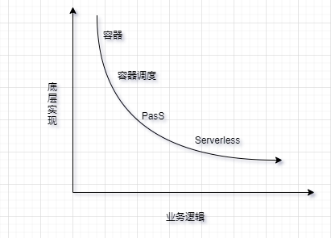
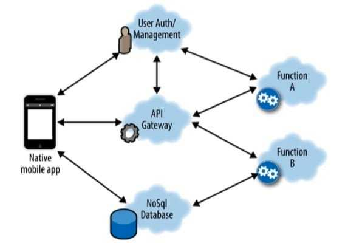

## 1 什么是severless ?

Serverless（无服务器架构）是指服务端逻辑由开发者实现，运行在无状态的计算容器中，由事件触发，完全被第三方管理，其业务层面的状态则存储在数据库或其他介质中。

纵观云原生技术的发展过程， 体现出的一条脉络就是对底层实现、基础设施关心的越来越少，而把重心放在业务逻辑上。

那么serverless到底是什么呢？ 下引用serverless handbook给出通俗易懂和具体的定义。

* 简单版：Serverless（无服务器架构）指的是服务端逻辑由开发者实现，运行在无状态的计算容器中，由事件触发，完全被第三方管理，而业务层面的状态则记录在数据库或存储资源中。
* 进阶定义: Serverless是由事件（event）驱动（例如 HTTP、pub/sub）的全托管计算服务。用户无需管理服务器等基础设施，只需编写代码和选择触发器（trigger)，比如 RPC 请求、定时器等并上传，其余的工作（如实例选择、扩缩容、部署、容灾、监控、日志、安全补丁等）全部由 serverless 系统托管。用户只需要为代码实际运行消耗的资源付费——代码未运行则不产生费用。
就像无线互联网实际有的地方也需要用到有线连接一样，无服务器架构仍然在某处有服务器。开发者无需关注服务器，只需关注代码。erverless 相对于 serverful，对业务用户强调 noserver（serverless 并不是说没有服务器，只是业务人员无需关注服务器了，代码仍然是运行在真实存在的服务器上）的运维理念，业务人员只需要聚焦业务逻辑代码。

## 2 有服务到无服务构架有哪些变化？

* 弱化了存储和计算之间的联系。服务的储存和计算被分开部署和收费，存储不再是服务本身的一部分，而是演变成了独立的云服务，这使得计算变得无状态化，更容易调度和扩缩容，同时也降低了数据丢失的风险。
* 代码的执行不再需要手动分配资源。不需要为服务的运行指定需要的资源（比如使用几台机器、多大的带宽、多大的磁盘等），只需要提供一份代码，剩下的交由 serverless 平台去处理就行了。当前阶段的实现平台分配资源时还需要用户方提供一些策略，例如单个实例的规格和最大并发数，单实例的最大 CPU 使用率。理想的情况是通过某些学习算法来进行完全自动的自适应分配。
* 按使用量计费。Serverless按照服务的使用量（调用次数、时长等）计费，而不是像传统的 serverful 服务那样，按照使用的资源（ECS 实例、VM 的规格等）计费。
云改变了我们对操作系统的认知，原来一个系统的计算资源、存储和网络是可以分离配置的，而且还可以弹性扩展，但是长久以来，我们在开发应用时始终没有摆脱的服务器的束缚（或者说认知），应用必须运行在不论是实体还是虚拟的服务器上，必须经过部署、配置、初始化才可以运行，还需要对服务器和应用进行监控和管理，还需要保证数据的安全性，这些云能够帮我们简化吗？让我们只要关注自己代码的逻辑就好了，其它的东西让云帮我实现就好了。

## 3 serverless发展历史

serverless是云化的延伸，为了更好的理解, 回顾一下云计算的发展过程

* LaaS, 2006 年 AWS 推出 EC2（Elastic Compute Cloud），作为第一代 IaaS（Infrastructure as a Service），用户可以通过 AWS 快速的申请到计算资源，并在上面部署自己的互联网服务。IaaS 从本质上讲是服务器租赁并提供基础设施外包服务。就比如我们用的水和电一样，我们不会自己去引入自来水和发电，而是直接从自来水公司和电网公司购入，并根据实际使用付费。这使得极大降低了基础设施的成本，而且具有很好扩展性。
* PaaS（Platform as a Service）是构建在 IaaS 之上的一种平台服务，提供操作系统安装、监控和服务发现等功能，用户只需要部署自己的应用即可。
* 历史上第一个 Serverless 平台可以追溯到 2006 年，名为 Zimki，这个平台提供服务端 JavaScript 应用，虽然他们没有使用Serverless 这个名词，但是他们是第一个“按照实际调用付费”的平台。第一个使用 Serverless 名词的是 iron.io。
* Serverless 实际发展已经有 10 年之久，而随着以 Kubernetes 为基础的的云原生应用平台的兴起，serverless 再度成为人民追逐的焦点。

## 4 severless 分类

serverless通常分为两个领域，BaaS（Backend as a Service）和 FaaS（Function as a Service)。

* BaaS（Backend as a Service）后端即服务，一般是一个个的 API 调用后端或别人已经实现好的程序逻辑，比如身份验证服务 Auth0，这些 BaaS 通常会用来管理数据，还有很多公有云上提供的我们常用的开源软件的商用服务，比如亚马逊的 RDS 可以替代我们自己部署的 MySQL，还有各种其它数据库和存储服务。
* FaaS（Functions as a Service）函数即服务，FaaS 是无服务器计算的一种形式，当前使用最广泛的是 AWS 的 Lambada。

FaaS 本质上是一种事件驱动的由消息触发的服务，FaaS 供应商一般会集成各种同步和异步的事件源，通过订阅这些事件源，可以突发或者定期的触发函数运行。传统的服务器端软件不同是经应用程序部署到拥有操作系统的虚拟机或者容器中，一般需要长时间驻留在操作系统中运行，而 FaaS 是直接将程序部署上到平台上即可，当有事件到来时触发执行，执行完了就可以卸载掉。

## 5 severles优缺点

### 优点

* 降低运营成本， Serverless 是非常简单的外包解决方案。它可以让您委托服务提供商管理服务器、数据库和应用程序甚至逻辑，否则您就不得不自己来维护。由于这个服务使用者的数量会非常庞大，于是就会产生规模经济效应。在降低成本上包含了两个方面，即基础设施的成本和人员（运营/开发）的成本。
* 降低开发成本， aaS 和 PaaS 存在的前提是，服务器和操作系统管理可以商品化。Serverless 作为另一种服务的结果是整个应用程序组件被商品化。
* 扩展能力，Serverless 架构一个显而易见的优点即“横向扩展是完全自动的、有弹性的、且由服务提供者所管理”。从基本的基础设施方面受益最大的好处是，用户只需支付所需要的计算能力。
* 更简单的管理，Serverless 架构明显比其他架构更简单。更少的组件，就意味着您的管理开销会更少。
* 绿色的计算， 按照《福布斯》杂志的统计，在商业和企业数据中心的典型服务器仅提供 5%～15% 的平均最大处理能力的输出。这无疑是一种资源的巨大浪费。随着Serverless架构的出现，让服务提供商提供我们的计算能力最大限度满足实时需求。这将使我们更有效地利用计算资源。
* 在上面我们提到了使用 IaaS给 我们带来了五点好处，FaaS 当然也包括了这些好处，但是它给我们带来的最大的好处就是多快好省。减少从概念原型到实施的等待时间，比自己维护服务更省钱。
* 降低人力成本，不需要再自己维护服务器，操心服务器的各种性能指标和资源利用率，而是关心应用程序本身的状态和逻辑。而且 serverless 应用本身的部署也十分容易，我们只要上传基本的代码但愿，例如 Javascript 或 Python 的源代码的 zip 文件，以及基于JVM的语言的纯 JAR 文件。不需使用 Puppet、Chef、Ansible 或 Docker 来进行配置管理，降低了运维成本。同时，对于运维来说，也不再需要监控那些更底层的如磁盘使用量、CPU 使用率等底层和长期的指标信息，而是监控应用程序本身的度量，这将更加直观和有效。
* 降低风险，对于组件越多越复杂的系统，出故障的风险就越大。我们使用 BaaS 或 FaaS 将它们外包出去，让专业人员来处理这些故障，有时候比我们自己来修复更可靠，利用专业人员的知识来降低停机的风险，缩短故障修复的时间，让我们的系统稳定性更高。
* 减少资源开销，我们在申请主机资源一般会评估一个峰值最大开销来申请资源，往往导致过度的配置，这意味着即使在主机闲置的状态下也要始终支付峰值容量的开销。对于某些应用来说这是不得已的做法，比如数据库这种很难扩展的应用，而对于普通应用这就显得不太合理了，虽然我们都觉得即使浪费了资源也比当峰值到来时应用程序因为资源不足而挂掉好。解决这个问题的一个办法就是，不计划到底需要使用多少资源，而是根据实际需要来请求资源，当然前提必须是整个资源池是充足的（公有云显然更适合）。根据使用时间来付费，根据每次申请的计算资源来付费，让计费的粒度更小，将更有利于降低资源的开销。这是对应用程序本身的优化，例如让每次请求耗时更短，让每次消耗的资源更少将能够显著节省成本。
* 增加缩放的灵活性， 以 AWS Lamba 为例，当平台接收到第一个触发函数的事件时，它将启动一个容器来运行你的代码。如果此时收到了新的事件，而第一个容器仍在处理上一个事件，平台将启动第二个代码实例来处理第二个事件。AWS lambad 的这种自动的零管理水平缩放，将持续到有足够的代码实例来处理所有的工作负载。但是，AWS 仍然只会向您收取代码的执行时间，无论它需要启动多少个容器实例要满足你的负载请求。例如，假设所有事件的总执行时间是相同的，在一个容器中按顺序调用Lambda 100 次与在 100 个不同容器中同时调用 100 次 Lambda 的成本是 一样的。当然 AWS Lambada 也不会无限制的扩展实例个数，如果有人对你发起了 DDos 攻击怎么办，那么不就会产生高昂的成本吗？AWS 是有默认限制的，默认执行 Lambada 函数最大并发数是 1000。
* 缩短创新周期，小团队的开发人员正可以在几天之内从头开始开发应用程序并部署到生产。使用短而简单的函数和事件来粘合强大的驱动数据存储和服务的 API。完成的应用程序具有高度可用性和可扩展性，利用率高，成本低，部署速度快。以 Docker 为代表的容器技术仅仅是缩短了应用程序的迭代周期，而 serverless 技术是直接缩短了创新周期，从概念到最小可行性部署的时间，让初级开发人员也能在很短的时间内完成以前通常要经验丰富的工程师才能完成的项目。

### 缺点

* 状态管理， 要实现自由的缩放，无状态是必须的，而对于有状态的服务，使用serverless这就是丧失了灵活性，有状态服务需要与存储交互就不可避免的增加了延迟和复杂性。
* 延迟，应用程序中不同组件的访问延迟是一个大问题，我们可以通过使用专有的网络协议、RPC 调用、数据格式来优化，或者是将实例放在同一个机架内或同一个主机实例上来优化以减少延迟。而 serverless 应用程序是高度分布式、低耦合的，这就意味着延迟将始终是一个问题，单纯使用 serverless 的应用程序是不太现实的。
* 本地测试，Serverless 应用的本地测试困难是一个很棘手的问题。虽然可以在测试环境下使用各种数据库和消息队列来模拟生产环境，但是对于无服务应用的集成或者端到端测试尤其困难，很难在本地模拟应用程序的各种连接，并与性能和缩放的特性结合起来测试，并且 serverless 应用本身也是分布式的，简单的将无数的 FaaS 和 BaaS 组件粘合起来也是有挑战性的。

## 6 serverless使用场景

了解Severless的应用优劣之后，我们看一下severless比较适合的场景。

* 异步的并发，组件可独立部署和扩展
* 应对突发或服务使用量不可预测（主要是为了节约成本，因为 Serverless 应用在不运行时不收费）
* 短暂、无状态的应用，对冷启动时间不敏感
* 需要快速开发迭代的业务（因为无需提前申请资源，因此可以加快业务上线速度）
Serverless 的使用场景示例如：

* ETL
* 机器学习及 AI 模型处理
* 图片处理
* IoT 传感器数据分析
* 流处理
* 聊天机器人
示例：

我们以一个游戏应用为例，来说明什么是 serverless 应用。

一款移动端游戏至少包含如下几个特性：

* 移动端友好的用户体验
* 用户管理和权限认证
* 关卡、升级等游戏逻辑，游戏排行，玩家的等级、任务等信息
传统的应用程序架构可能是这样的：

* 一个 app 前端，iOS 或者安卓
* 用 Java 写的后端，使用 JBoss 或者 Tomcat 做 server 运行
* 使用关系型数据库存储用户数据，如 MySQL
这样的架构可以让前端十分轻便，不需要做什么应用逻辑，只是负责渲染用户界面，将请求通过 HTTP 发送给后端，而所有的数据操作都是有由后端的 Java 程序来完成的。

这样的架构开发起来比较容易，但是维护起来确十分复杂，前端开发、后端的开发都需要十分专业的人员、环境的配置，还要有人专门维护数据库、应用的更新和升级。

而在 serverless 架构中，我们不再需要在服务器端代码中存储任何会话状态，而是直接将它们存储在 NoSQL 中，这样将使应用程序无状态，有助于弹性扩展。前端可以直接利用 BaaS 而减少后端的编码需求，这样架构的本质上是减少了应用程序开发的人力成本，降低了自己维护基础设施的风险，而且利用云的能力更便于扩展和快速迭代。

## 7 serverless核心技术

Serverless 是由事件驱动的全托管计算服务，它的核心技术包括：

* 函数的规范定义
* 函数部署流水线
* Workflow 设置
* 0-m-n 扩缩容
* 快速冷启动

## 总结

云原生经过这么多年的发展，已经逐渐变成到用户仅需关注业务和所需的资源。比如，通过K8S这类编排工具，用户只要关注自己的计算和需要的资源（CPU、内存等）就行了，不需要操心到机器这一层。serverless的发展这条路走的越来越远，因为这极大的提高了资源的使用效率，降低了成本。这就是生产力的体现。 Serverless架构让人们不再操心运行所需的资源，只需关注自己的业务逻辑，并且为实际消耗的资源付费。任何新概念新技术的落地，本质上都是要和具体业务去结合，去真正解决具体问题。虽然Serverless很多地方不成熟，亟待完善。不过Serverless自身的特性，对于开发者来说，吸引力是巨大的。

