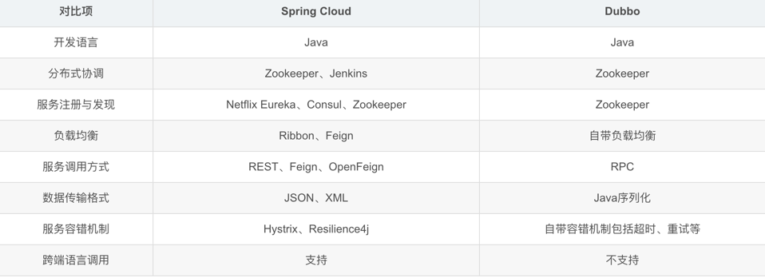

SpringCloud是一个基于SpringBoot的分布式系统开发框架，它能够帮助我们快速、稳定地构建分布式系统。本篇博客将对SpringCloud进行详细解析，介绍SpringCloud的主要组件和相关应用场景，同时提供代码示例以帮助读者更好地掌握SpringCloud的实际开发应用。

## 一、SpringCloud概述

SpringCloud：[SpringCloud官网](https://spring.io/projects/spring-cloud)

SpringCloud是一个由Spring公司维护的分布式系统开发框架，它是基于SpringBoot的微服务框架。SpringCloud提供了一系列的组件和开发工具，用于构建分布式系统的各个方面，如服务发现、服务注册、服务调用、负载均衡、分布式配置中心等。

## 二、Spring Cloud 和 Dubbo 对比

Spring Cloud和Dubbo都是目前比较流行的微服务框架，它们各自有着不同的特点和优势。
Spring Cloud是基于Spring Boot的一套微服务框架，提供了一系列工具和组件来快速构建和部署微服务应用。
Dubbo则是阿里巴巴的开源RPC框架，专门为分布式服务架构设计，提供了高性能和可靠性的服务注册、发现和调用机制。
下面是Spring Cloud和Dubbo的一些比较：


总的来说，Spring Cloud更注重整个微服务架构的可扩展性和协调性，适合复杂业务场景。Dubbo则更注重性能和可靠性，适合高并发、大规模、分布式的场景。

需要根据具体的业务需求来选择合适的微服务框架。

## 三、Spring Cloud 优缺点

其主要优点有：

* 集大成者，Spring Cloud 包含了微服务架构的方方面面。
* 约定优于配置，基于注解，没有配置文件。
* 轻量级组件，Spring Cloud 整合的组件大多比较轻量级，且都是各自领域的佼佼者。
* 开发简便，Spring Cloud 对各个组件进行了大量的封装，从而简化了开发。
* 开发灵活，Spring Cloud 的组件都是解耦的，开发人员可以灵活按需选择组件。
接下来，我们看下它的缺点：

* 项目结构复杂，每一个组件或者每一个服务都需要创建一个项目。
* 部署门槛高，项目部署需要配合 Docker 等容器技术进行集群部署，而要想深入了解 Docker，学习成本高。
Spring Cloud 的优势是显而易见的。因此对于想研究微服务架构的同学来说，学习 Spring Cloud 是一个不错的选择。

## 四、SpringCloud组件

### 1、Eureka

Eureka是SpringCloud提供的服务发现组件，它能够将所有微服务以易于管理的方式注册到一个注册中心，并且能够自动检测失效的服务并从服务列表中剔除。下面是一个简单的Eureka注册中心示例：
```java
@SpringBootApplication
@EnableEurekaServer
public class EurekaServerApplication {
    public static void main(String[] args) {
        SpringApplication.run(EurekaServerApplication.class, args);
    }
}

```


### 2、Feign

Feign是一个声明式的REST客户端，它能够简化我们的代码开发，Feign会根据我们定义的接口生成实现类，并且自动进行负载均衡和服务发现等操作。下面是一个简单的Feign客户端示例：
```java
@FeignClient(name = "service-hi")
public interface HelloFeignClient {

    @RequestMapping(value = "/hi", method = RequestMethod.GET)
    String sayHiFromClient(@RequestParam("name") String name);

}

```


### 3、Ribbon

Ribbon是一个负载均衡组件，它能够帮助我们将请求分配到不同的微服务中，从而实现负载均衡的目的。下面是一个简单的Ribbon负载均衡示例：
```java
@Configuration
public class RibbonConfiguration {

    @Bean
    @LoadBalanced
    public RestTemplate restTemplate() {
        return new RestTemplate();
    }

}

```


### 4、Hystrix

Hystrix是一个熔断器组件，在微服务架构中，一些服务可能出现故障或者超时，Hystrix能够帮助我们实现服务的熔断、降级等操作，从而保证服务的稳定性和可用性。下面是一个简单的Hystrix熔断器示例：
```java
@FeignClient(value = "service-hi", fallback = HelloHystrix.class)
public interface HelloFeignClient {

    @RequestMapping(value = "/hi", method = RequestMethod.GET)
    String sayHiFromClient(@RequestParam("name") String name);

}

@Component
public class HelloHystrix implements HelloFeignClient {

    @Override
    public String sayHiFromClient(String name) {
        return "Hello " + name + ", sorry, error occurred!";
    }

}

```


### 5、Config

Config是SpringCloud提供的配置中心，它能够将各个微服务的配置信息集中管理，并且能够进行动态刷新。下面是一个简单的Config配置中心示例：
```java
@SpringBootApplication
@EnableConfigServer
public class ConfigServerApplication {
    public static void main(String[] args) {
        SpringApplication.run(ConfigServerApplication.class, args);
    }
}

```


## 五、SpringCloud应用场景

### 1、微服务架构

SpringCloud提供了一系列的组件和工具，能够帮助我们实现微服务架构，从而将一个大型的应用系统拆分为多个小的服务单元，各个服务之间可以独立开发、部署、运行，从而提高开发效率和应用性能。

### 2、分布式配置中心

Config组件能够将各个微服务的配置信息集中管理，这样一方面可以统一管理配置，同时也可以快速进行配置变更并将变更信息更新到各个微服务中，大大提高了系统的可维护性和可扩展性。

### 3、服务调用和负载均衡

Ribbon和Feign组件能够帮助我们实现服务调用和负载均衡等操作，使得我们可以在不同的微服务之间进行数据交互和调用，从而实现整个系统的功能。

### 4、高可用和容错机制

Hystrix组件能够帮助我们实现服务的熔断和降级等操作，从而实现系统的自愈能力，同时也可以增强系统的容错能力和高可用性，保证系统的稳定性和可用性。

## 六、结语

本文详细介绍了SpringCloud的概述、主要组件和应用场景，并提供了相应的代码示例，希望能够帮助读者更好地理解和掌握SpringCloud的实际开发应用。在分布式系统的开发中，SpringCloud作为一个强大的分布式框架，为我们提供了不少有力的工具和支持，能够使得我们更加高效地开发分布式应用，提高开发效率和应用性能。


