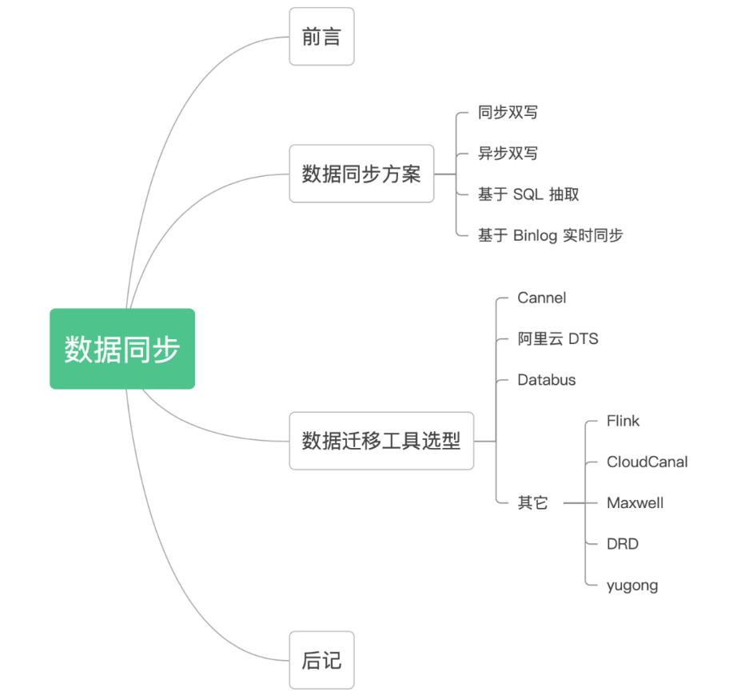
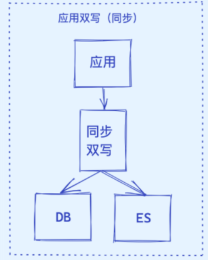
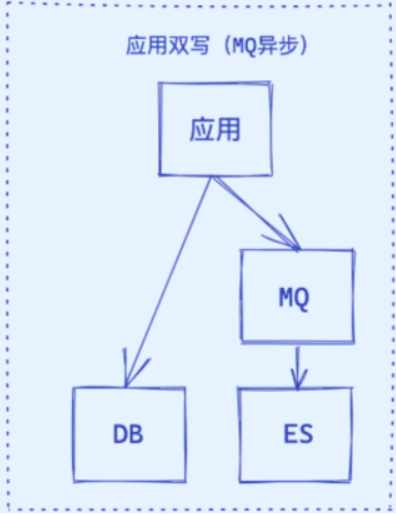
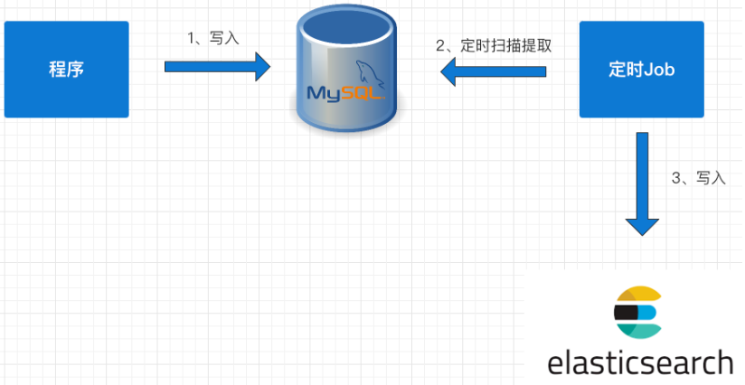
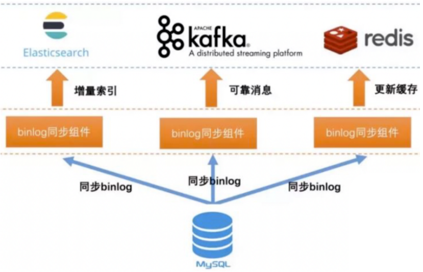
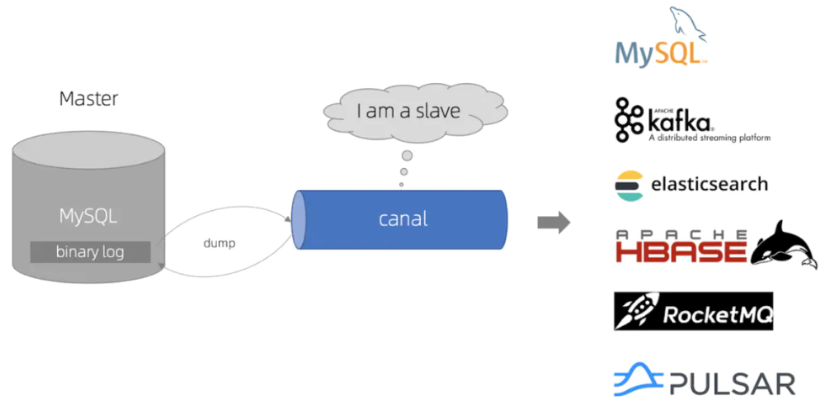

## 简介

本文会先讲述数据同步的 4 种方案，并给出常用数据迁移工具

# **1.前言**

在实际项目开发中，我们经常将 MySQL 作为业务数据库，ES 作为查询数据库，用来实现读写分离，缓解 MySQL 数据库的查询压力，应对海量数据的复杂查询。  
这其中有一个很重要的问题，就是如何实现 MySQL 数据库和 ES 的数据同步，今天和大家聊聊 MySQL 和 ES 数据同步的各种方案。  
我们先看看下面 4 种常用的数据同步方案。

# **2.数据同步方案**

## **2.1同步双写**

这是一种最为简单的方式，在将数据写到 MySQL 时，同时将数据写到 ES。

优点：

-   业务逻辑简单；
-   实时性高。

缺点：

-   硬编码，有需要写入 MySQL 的地方都需要添加写入 ES 的代码；
-   业务强耦合；
-   存在双写失败丢数据风险；
-   性能较差，本来 MySQL 的性能不是很高，再加一个 ES，系统的性能必然会下降。

## **2.2异写同步**

针对多数据源写入的场景，可以借助 MQ 实现异步的多源写入。

优点：

-   性能高；
-   不易出现数据丢失问题，主要基于 MQ 消息的消费保障机制，比如 ES 宕机或者写入失败，还能重新消费 MQ 消息；
-   多源写入之间相互隔离，便于扩展更多的数据源写入。

缺点：

-   硬编码问题，接入新的数据源需要实现新的消费者代码；
-   系统复杂度增加，引入了消息中间件；
-   MQ是异步消费模型，用户写入的数据不一定可以马上看到，造成延时。

## **2.3基于SQL抽取**

上面两种方案中都存在硬编码问题，代码的侵入性太强，如果对实时性要求不高的情况下，可以考虑用定时器来处理：

1.  数据库的相关表中增加一个字段为 timestamp 的字段，任何 CURD 操作都会导致该字段的时间发生变化；
2.  原来程序中的 CURD 操作不做任何变化；
3.  增加一个定时器程序，让该程序按一定的时间周期扫描指定的表，把该时间段内发生变化的数据提取出来；
4.  逐条写入到 ES 中。

优点：

-   不改变原来代码，没有侵入性、没有硬编码；
-   没有业务强耦合，不改变原来程序的性能；
-   Worker 代码编写简单不需要考虑增删改查。

缺点：

-   时效性较差，由于是采用定时器根据固定频率查询表来同步数据，尽管将同步周期设置到秒级，也还是会存在一定时间的延迟；
-   对数据库有一定的轮询压力，一种改进方法是将轮询放到压力不大的从库上。

**经典方案：借助 Logstash 实现数据同步，其底层实现原理就是根据配置定期使用 SQL 查询新增的数据写入 ES 中，实现数据的增量同步。**

## **2.4基于Binlog实现同步**

上面三种方案要么有代码侵入，要么有硬编码，要么有延迟，那么有没有一种方案既能保证数据同步的实时性又没有代入侵入呢？

当然有，可以利用 MySQL 的 Binlog 来进行同步。

具体步骤如下：

-   读取 MySQL 的 Binlog 日志，获取指定表的日志信息；
-   将读取的信息转为 MQ；
-   编写一个 MQ 消费程序；
-   不断消费 MQ，每消费完一条消息，将消息写入到 ES 中。

优点：

-   没有代码侵入、没有硬编码；
-   原有系统不需要任何变化，没有感知；
-   性能高；
-   业务解耦，不需要关注原来系统的业务逻辑。

缺点：

-   构建 Binlog 系统复杂；
-   如果采用 MQ 消费解析的 Binlog 信息，也会像方案二一样存在 MQ 延时的风险。

# **3.数据迁移工具**

对于上面 4 种数据同步方案，“基于 Binlog 实时同步”方案是目前最常用的，也诞生了很多优秀的数据迁移工具，这里主要对这些迁移工具进行介绍。

这些数据迁移工具，很多都是基于 Binlog 订阅的方式实现，**模拟一个 MySQL Slave 订阅 Binlog 日志，从而实现 CDC**（Change Data Capture），将已提交的更改发送到下游，包括 INSERT、DELETE、UPDATE。

至于如何伪装？大家需要先了解 MySQL 的主从复制原理，需要学习这块知识的同学，可以看我之前写的高并发教程，里面有详细讲解。

## **3.1Canal**

基于数据库增量日志解析，提供增量数据订阅&消费，目前主要支持 MySQL。

Canal 原理就是伪装成 MySQL 的从节点，从而订阅 master 节点的 Binlog 日志，主要流程为：

1.  Canal 服务端向 MySQL 的 master 节点传输 dump 协议；
2.  MySQL 的 master 节点接收到 dump 请求后推送 Binlog 日志给 Canal 服务端，解析 Binlog 对象（原始为 byte 流）转成 Json 格式；
3.  Canal 客户端通过 TCP 协议或 MQ 形式监听 Canal 服务端，同步数据到 ES。

## **3.2阿里DTS**

数据传输服务 DTS（Data Transmission Service）支持 RDBMS、NoSQL、OLAP 等多种数据源之间的数据传输。

它提供了数据迁移、实时数据订阅及数据实时同步等多种数据传输方式。相对于第三方数据流工具，DTS 提供丰富多样、高性能、高安全可靠的传输链路，同时它提供了诸多便利功能，极大方便了传输链路的创建及管理。

特点：

-   多数据源：支持 RDBMS、NoSQL、OLAP 等多种数据源间的数据传输；
-   多传输方式：支持多种传输方式，包括数据迁移、实时数据订阅及数据实时同步；
-   高性能：底层采用了多种性能优化措施，全量数据迁移高峰期时性能可以达到70MB/s，20万的TPS，使用高规格服务器来保证每条迁移或同步链路都能拥有良好的传输性能；
-   高可用：底层为服务集群，如果集群内任何一个节点宕机或发生故障，控制中心都能够将这个节点上的所有任务快速切换到其他节点上，链路稳定性高；
-   简单易用：提供可视化管理界面，提供向导式的链路创建流程，用户可以在其控制台简单轻松地创建传输链路；
-   需要付费。

## **3.3Databus**

Databus 是一个低延迟、可靠的、支持事务的、保持一致性的数据变更抓取系统。由 LinkedIn 于 2013 年开源。

Databus 通过挖掘数据库日志的方式，将数据库变更实时、可靠的从数据库拉取出来，业务可以通过定制化 client 实时获取变更并进行其他业务逻辑。

特点：

-   多数据源：Databus 支持多种数据来源的变更抓取，包括 Oracle 和 MySQL。
-   可扩展、高度可用：Databus 能扩展到支持数千消费者和事务数据来源，同时保持高度可用性。
-   事务按序提交：Databus 能保持来源数据库中的事务完整性，并按照事务分组和来源的提交顺寻交付变更事件。
-   低延迟、支持多种订阅机制：数据源变更完成后，Databus 能在毫秒级内将事务提交给消费者。同时，消费者使用D atabus 中的服务器端过滤功能，可以只获取自己需要的特定数据。
-   无限回溯：对消费者支持无限回溯能力，例如当消费者需要产生数据的完整拷贝时，它不会对数据库产生任何额外负担。当消费者的数据大大落后于来源数据库时，也可以使用该功能。

## **3.4其他**

**Flink**

-   有界数据流和无界数据流上进行有状态计算分布式处理引擎和框架。
-   官网地址：https://flink.apache.org

**CloudCanal**

-   数据同步迁移系统，商业产品。
-   官网地址：https://www.clougence.com/?utm_source=wwek

**Maxwell**

-   使用简单，直接将数据变更输出为json字符串，不需要再编写客户端。
-   官网地址：http://maxwells-daemon.io

**DRD**

-   阿里巴巴集团自主研发的分布式数据库中间件产品，专注于解决单机关系型数据库扩展性问题，具备轻量(无状态)、灵活、稳定、高效等特性。
-   官方地址：https://www.aliyun.com/product/drds

**yugong**

-   帮助用户完成从 Oracle 数据迁移到 MySQL。
-   访问地址：https://github.com/alibaba/yugong