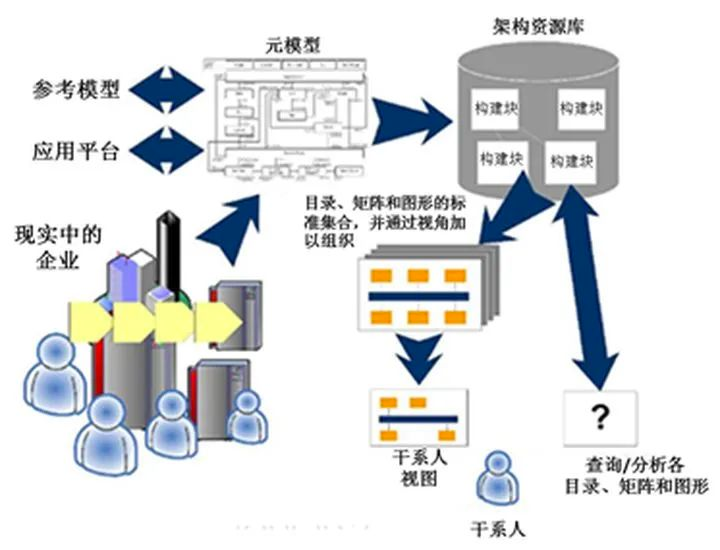
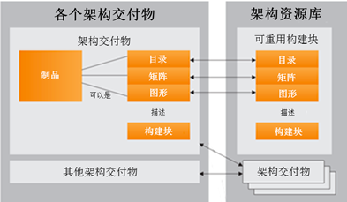
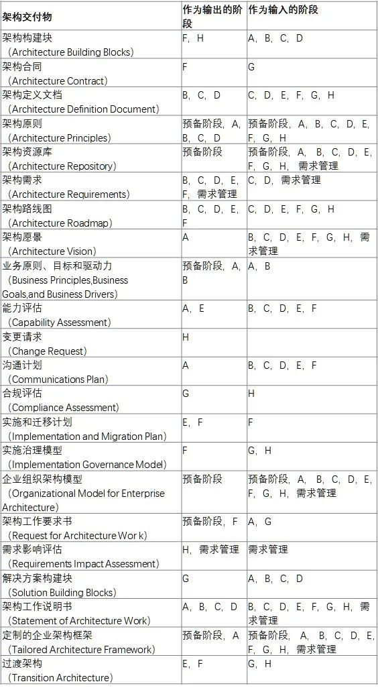
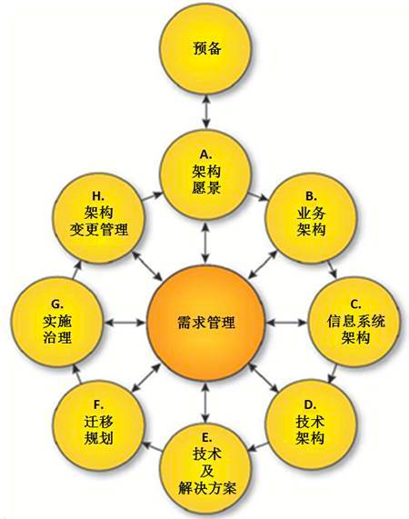
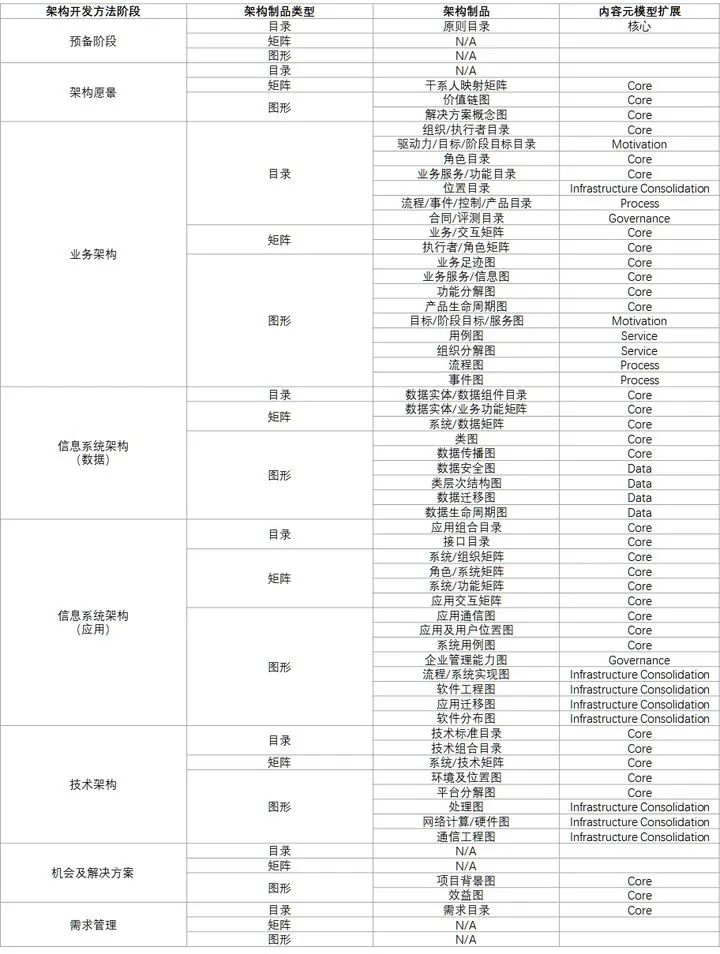

## 一、内容框架概述

TOGAF 9之前的版本中没有企业架构的具体内容相关的论述，需要与其他具有企业架构内容描述的框架（例如Zachman框架）进行配合。随着内容框架（Content Framework）的引入，以及企业架构开发方法与该内容框架的相互结合，TOGAF已经成为一个独立完备的企业架构框架标准。

企业架构开发方法描述了一个流程，使得企业从一个基线状态过渡到符合其战略目标的目标状态。这个流程是一个动态的过程，具有对外界环境变化的自适应特性，从而保证企业能够按照一种适应性很强的方式进行有序、透明的演进。架构开发方法过程中的每个阶段都需要一定的信息作为输入，并通过一定的开发步骤产生一系列具有特定意义的输出。这些输入与输出信息通过内容框架进行定义、组织和表达。内容框架为这些信息的结构化组织、定义和表达提供了一套完备的框架，使用者能够清楚地理解企业架构的内容。

内容框架对企业架构开发方法中各阶段的输入和输出信息进行了分类总结，并通过内容元模型（Content MetaModel）对构成企业架构内容的各个元素（即企业架构中的各个构建块的类型）以及他们之间的关系进行了定义。内容框架中针对其内容的描述采用了一种与架构开发方法的各阶段相映射的方式进行组织，即对架构开发方法的各个阶段所产出的企业架构内容具体是什么进行描述。

虽然针对企业架构内容的定义非常重要，但是同样重要的还有如何对企业架构的内容进行利用。企业架构的核心目标是为具有不同视角的干系人根据其关注点提供准确的视图，从而使得不同的干系人虽然采用了不同的观察角度和描述方式，但的确是在为共同的目标而进行着无障碍沟通和协作。为了达到这一目标，内容框架对于各种视角（ViewPoint）从表现形式和内容方面都进行了归纳总结，并对一些视图的开发也提供了建议和指南。TOGAF是一个通用性的标准，它的内容不可能涵盖企业中所有的视角，因而在具体实践中，各个企业完全可以根据自身需要对这些视角进行引用、修改和组合，从而总结出适合的视角，并借此开发出相应的视图，从而满足企业中具体干系人的需要。

下图展示了内容框架中各方面内容与企业中客观存在的各种资源之间关系，以及企业架构的内容是如何在内容框架的组织下为各个干系人提供帮助的：

## 二、企业架构工作产品分类

在内容框架中，企业架构开发方法过程中所涉及到的各种工作产品被归纳为如下几种：

1、架构交付物（Architecture Deliverables）：架构交付物是由合同指定并被相关干系人轮流进行正式的审查和签字认可的工作产品。这些交付物代表着架构项目的输出，以及那些在一个项目完结时以文档形式进行交付的，或者作为参考模型、标准或在某一时点的架构情景快照（snapshot of the Architecture Landscape）被过渡到架构资源库中的工作产品。

2、架构制品（Architectural Artifacts）：与架构交付物相比，架构制品是一个从某个特定视角进行架构描述并具备更细粒度的工作产品。例如，网络图、服务器说明、用例说明、架构需求列表以及业务交互矩阵等。就表现形式来讲，架构制品的内容可以通过目录、矩阵和图形这三种方式来表述。通常情况下，一个架构交付物可以包含多个架构制品，而架构制品也可能会出现在多个架构交付物之中，并且架构制品也将会形成架构资源库的内容。

3、构建块（Building Blocks）：构建块代表着业务、IT或者架构能力的一个组件，并且可以与其他构建块组合在一起来对各种架构和解决方案进行交付。根据所处的架构开发阶段的不同，构建块能够在多个详细度层次上进行定义。例如，在架构开发的早期阶段，一个构建块可能仅仅包含一个名字或一个概要描述，而随着架构开发过程的演进，此构建块可能会被进一步分解为若干具有详尽描述的支持性构建块。从内容和所面对的问题上看，构建块可以被进一步分为如下两种：

架构构建块（ABBs：Architecture Building Blocks）：此种类型的构建块一般用于描述各种需要的能力，并对其后的解决方案构建块的轮廓进行了勾勒。例如，企业中的一个客户服务定义了实现这项能力的各种需求，而对于它的真正落实就需要若干解决方案构建块在各方面（流程、数据以及应用软件等）将这些需求映射到具体的实现技术之上。
解决方案构建块（SBBs：Solution Building Blocks）：此种类型的构建块代表了用于实现各种需求（由架构构建块定义）的具体组件。

以上三种工作产物虽然在内容和产生背景上有着很大的不同，但是他们之间却有着非常紧密的联系。构建块可以说是企业架构资源库的核心内容，并且也是企业架构过程的终极目标产物，因而把其称为企业的模型也并不为过，而架构制品则可以看成此模型在某个角度的各种视图，属于架构描述的范畴。架构交付物比较特殊，它与架构开发方法各阶段紧密相连，并作为各个阶段的输入与输出载体而存在。

## 三、架构交付物（Architecture Deliverables）
架构交付物是在整个架构开发方法循环过程中所产生或被使用的契约性、正规化的企业架构内容。它与企业架构开发方法有着紧密的联系。本节将针对这些架构交付物以及它们与架构开发方法各阶段之间的关系进行阐述。需要注意的是，本节的内容只提供了一个关于架构交付物的内容概括。由于企业中可能存在着符合其自身需要的项目和过程管理方法，所以企业也可以根据自己的实际情况对这些交付物进行改造和定制。

架构交付物与企业架构开发方法各阶段之间的对应关系（注意，下表采用了简称来标示各企业架构开发方法阶段）：

### 1、架构构建块

构建块是企业架构过程的最终目标之一，它是企业对于各个层面上（业务、应用、数据以及技术等）的可重用部件的抽象。架构构建块的内容侧重于对构建块的需求进行描述，就像软件开发中的接口一样，架构构建块并不涉及具体的实现方式，而只是描述了构建块所需要达成的功能。用于描述架构构建块的文档和模型存储在企业架构资源库之中，企业架构开发过程正是对企业中各种客观存在的或计划中的可重用模块进行抽象建模，并最终将这些内容存储到企业架构资源库之中（或对其内容进行更新）。

### 2、架构合同

目标

架构合同是企业架构开发团队与赞助团队之间关于架构的交付、质量和适用性的联合协定。为了成功实现这一协定则需要企业进行有效的架构治理。通过实现一个用于合同管理的治理方法，企业将会确保：

* 对组织中所有架构相关活动的完整性检查、变更、决策和审计进行持续监督。
* 现存或正在开发的架构得以贯彻组织的原则、标准和需求。
* 明确架构在开发和实现的各个方面中的风险，这些方面涵盖了关于可接受的标准、策略、技术和产品的内部开发，以及架构的运营层面，从而使得组织可以在一个具有弹性的环境中继续其业务。
* 一系列流程和实践，用于确定关于所有架构制品的开发和使用的责任和规则。
* 对于为合同负责的治理组织，他们的权限级别及其治理之下的架构范围有一个正式的理解。

内容

架构设计和开发合同的内容一般包括：

* 介绍和背景
* 协议性质
* 架构范围
* 架构以及战略原则和需求
* 一致性需求
* 架构开发和管理流程，以及相关角色
* 目标架构评测标准
* 定义的交付阶段
* 按照优先级排序的联合工作计划
* 时间窗口（Time windows）
* 架构交付和业务指标

业务用户的架构合同一般包括：

* 介绍和背景
* 协议性质
* 范围
* 战略需求
* 一致性需求
* 架构采用者
* 时间窗口
* 架构业务指标
* 服务架构（包括服务水平协议（SLA：Service Level Agreement））
### 3、架构定义文档

目标

架构定义文档是一个包含在整个项目中所产生的各种制品的可交付容器。它跨越所有的架构领域（业务、数据、应用和技术），并可用于检阅架构的所有相关状态（当前态、中间态和目标态）。架构定义文档对架构需求文档在如下方面进行互补：

* 架构定义文档提供了一个解决方案的定性视图，用于沟通架构师的意图。
* 架构需求说明提供了一个解决方案的定量视图，用于声明在架构实现过程中必须遵守的可测量的标准。
内容

架构定义文档内容一般包括：

* 范围
* 目标、阶段目标和约束
* 架构原则
* 基线架构
* 架构模型（针对每个被建模的状态）：业务架构模型、数据架构模型、应用架构模型、技术架构模型
* 架构方法的基本原理和理由
* 架构资源库内容映射：架构情景映射、参考模型映射、标准映射、重用评估
* 差距分析结果
* 影响评估

### 4、架构原则

目标

通用的规则和指南，一般是不会进行更改的。这些原则知会并支持一个组织用以实现其任务的方法。它是用于定义和指导组织从价值到行为和结果的一系列结构化思路中的一员。

内容

架构原则一般包括如下几个层面的内容（其具体内容请参看TOGAF标准相关内容）：

* 业务原则
* 数据原则
* 应用原则
* 技术原则
### 5、架构资源库

目标

架构资源库在企业中充当了对于所有架构相关项目进行存储的区域。它允许各个项目管理它们的交付物，定位可重用资产，并对干系人以及其他有兴趣者进行信息发布。

内容

架构资源库的内容包括如下几个方面（其具体内容请参看TOGAF标准相关内容）：

* 架构框架
* 标准信息库
* 架构情景
* 参考架构
* 治理日志
### 6、架构需求说明

目标

架构需求说明提供了一组量化的描述，用于概括一个项目的实现与架构相符合所必须做的事情。架构需求说明一般会形成一个实施契约，或是更详细的架构定义契约中的主要组件。

内容

架构需求说明的内容通常包括：

* 成功评测标准
* 架构需求描述
* 业务服务契约
* 应用服务契约
* 实施导则
* 实施说明
* 实施标准
* 互操作需求
* 约束
* 假设
### 7、架构路线图

目标

架构路线图列举出各个变化增量，并把他们放到时间轴之上，从而展示了从当前架构到目标架构的演进过程。架构路线图是迁移架构的重要组件，并在架构开发方法的B、C、D、E、F阶段中以增量的方式开发出来。

内容

架构路线图的内容包括：

* 项目列表：每个涉及到的项目的名称、描述和目标，用于实现所建议的架构的项目列表，并按照优先级进行了排序。
* 基于时间的迁移规划：迁移的效益、针对各种迁移选择的成本估算。
* 实施建议：用于衡量项目有效性的评估准则、风险和问题、解决方案构建块的描述和模型。
### 8、架构愿景

目标

架构愿景是在项目生命周期早期创建的，它提供了一个高阶的对于最终架构产品的期望视图。目的是为了在一开始就对架构应该达到的期望结果形成一致意见，从而使得在之后的过程中架构师能够关注于切实可行的关键领域。通过提供一份关于整体架构定义的内容摘要，架构愿景对于干系人之间按沟通也提供了一定的支持。

内容

架构愿景的内容通常包括：

* 问题描述：干系人以及他们的关注点，需要解决的问题/场景列表。
* 详细目标描述
* 环境和流程模型：流程描述、涉及到环境的流程步骤、涉及到人员的流程步骤、信息流
* 执行者以及他们担当的角色和责任：人员方面的执行者和角色、计算机方面的执行者和角色、需求
* 所产生的架构模型：约束、IT原则、支持流程的架构、映射到架构之上的需求。
### 9、业务原则、目标和驱动力

目标

业务原则、目标和驱动力通过描述企业的需要和工作方式为架构工作提供了背景。此外，许多处于架构原则考虑之外的因素对架构的开发也有着重要的影响。

内容

于不同的组织有着不同的特性，因而关于架构业务背景的内容将会各不相同，企业应该根据各自的情况定义这部分内容。

### 10、能力评估

目标

在做一份详细的架构定义之前，对企业的当前和目标的能力水平有一个清晰的认识是非常有价值的。对于能力评估，我们可以在如下几个层面进行考虑：

* 企业整体的能力水平是什么？企业希望在何处增强或优化其能力？用于支持企业期望发展的架构关注领域是什么？
* 企业中的IT功能的能力或成熟度水平是什么？就设计管理、操作管理、技术和组织架构而言，进行架构项目最可能的影响都有哪些？为了与企业文化和IT部门的能力相适应，架构项目所需的正规化和详细度的最适宜水平是什么？
* 企业架构功能的能力和成熟度是什么？当前存在的架构资产有哪些？这些资产是否被一直维护，并且是否还准确？什么样的标准和参考模型需要被考虑进去？是否在这些在架构项目中有可能创建可重用资产？
* 能力欠缺存在于何处？为了达成目标能力而需要进行转型的业务范围是什么？在对基本能力欠缺考虑之上的转换风险、文化壁垒以及其他方面考虑都有哪些？
内容

能力评估的内容通常包括：

* 业务能力评估：业务能力、针对每项能力性能水平的基线状态评估、针对每项能力性能水平的未来状态期望、针对每项能力如何实现的基线状态评估、针对每项能力将会被如何实现的期望
* IT能力评估：变更流程的基线和目标成熟度水平、运营流程的基线和目标成熟度水平、基线能力以及容量评估、针对由于架构项目的执行而对IT组织所可能产生的影响的评估
* 架构成熟度评估：架构治理流程/组织/角色和责任、架构技能评估、架构资源库中的情景定义的深度/广度/质量、架构资源库中的标准定义的深度/广度/质量、架构资源库中的参考模型的深度/广度/质量、针对可重用潜力的评估。
* 业务转型准备度评估：准备度因素、对于每个准备度因素的愿景、针对当前和目标准备度的评级、与准备度相关的风险。
### 11、变更请求

目标

在架构的实现过程中，在一切清晰之前，原来的架构定义和需求很可能不适合或不足以达成解决方案的实现。在这种情况下，对实施项目进行调整使之与建议的架构方法发生偏离，或请求架构范围扩展是必需的行为。另外，很多外部因素（例如，市场因素、业务策略变化以及新技术机会）也会为扩展及优化架构提供新的机会。在以上这些环境下，一个变更请求可以被提出，用以开始一个新的架构工作周期。

内容

变更请求的内容通常包括：

* 对于所建议的变更的描述
* 对于所建议的变更的理由
* 对于所建议的变更的影响评估：针对相关特定需求的引用、迄今需求所涉及的干系人的优先级、重新审视这些需求的各阶段描述、对需求优先级进行排序的阶段、调查和修正需求的优先级阶段的结果、对于需求管理的建议。
* 资源库引用编号
### 12、 沟通计划

目标

企业架构包含大量的复杂且相互关联的信息。有效地与适当的人在适当的时间针对目标信息进行交流是成功建设企业架构的重要因素。开发沟通计划可以使这些交流通过一种可计划、可管理的方式进行。

内容

沟通计划的内容通常包括：

* 针对干系人的识别，并根据沟通需求进行分组
* 明确沟通需求、与架构愿景相关的关键消息、沟通风险和关键成功因素（CSFs：Critical Success Factors）
* 明确用来与干系人进行沟通的机制，并允许其对架构信息的访问
* 制定沟通时间表。该时间表展示了沟通将在何时何地进行，以及在何种干系人组之间进行
### 13、 合规评估

目标

一旦一个架构被定义了出来，就必须在整个实施过程中对其进行治理，从而保证原先的架构愿景可以被适当的实现，并且实现中的经验教训也可以反馈到架构过程中。针对实施项目进行周期性的合规检查为重新审核项目过程，并保证设计和实施符合企业策略和架构目标，提供了一种有益的机制。

内容

合规评估的内容通常包括：

* 项目进程和状态的概览
* 项目架构/设计概览
* 完整的架构清单：硬件和操作系统清单、软件服务和中间件清单、应用清单、信息管理清单、安全清单、系统管理清单、系统工程清单、方法和工具清单。
### 14、实施和迁移计划

目标

通过过渡框架的描述为解决方案的实施提供一个日程表，包括实施的时间、成本、资源、收益和里程碑。

内容

实施和迁移计划的内容通常包括：

* 实施和迁移战略：战略实施方向、实施排序方法
* 与其他管理框架的交互：架构与业务规划相协调的方法、整合架构的方法、架构与项目管理相协调的方法、架构与运营管理相协调的方法。
* 项目章程：项目所能交付的能力、所包含的工作包、业务价值、风险、问题、假设和依赖关系
* 实施规划：由实施分解出来的各个阶段和工作流、为各阶段和工作流进行工作包分配、里程碑和时间要求、工作分解结构、资源需求和成本
### 15、实施治理模型

目标

一旦一个架构被定义，在整个实施过程中就需要对用于实现架构的过渡框架进行治理。在已经建立了架构功能的组织中可能已经存在了一个治理框架，但是对于特定的过程、组织、角色、责任和度量来说，需要根据项目进行具体的定义。

内容

实施治理模型的内容通常包括：

* 治理流程
* 治理组织结构
* 治理角色和相应职责
* 治理检查点和成功与失败标准

### 16、 企业组织架构模型

目标

为了一个架构框架能够被成功地使用，它必须在企业中获得正确的组织、角色和责任的支持。特别重要的是，对不同企业架构参与者之间边界的定义，以及针对跨边界关系的治理。

内容

企业组织架构模型的内容通常包括：

* 受影响的组织的范围
* 成熟度评估、差距和决议方法
* 架构团队的角色和责任
* 针对架构工作的约束
* 资金预算需求
* 治理和支持策略

### 17、架构工作要求书

目标

由赞助组织交付给架构组织的用于启动架构开发工作的文档。架构工作要求书可以产生于预备阶段，可以是经过批准的架构变化请求的结果，或者是源于迁移计划对架构工作的参考。

内容

架构工作要求书的内容通常包括：

* 组织赞助者
* 组织的任务说明
* 业务目标（以及变更）
* 业务的战略规划
* 时间限制
* 业务环境的变化
* 组织方面的约束
* 预算信息以及财务约束
* 外部约束以及业务约束
* 当前业务系统描述
* 当前架构/IT系统描述
* 开发组织的描述
* 开发组织可用资源的描述

### 18、需求影响评估

目标

在整个架构开发方法过程中，总会有新的与架构相关的信息被收集起来。当这些信息被收集后，对架构在当前某方面有影响的新因素也经常会显现出来。需求影响评估就是用来对当前架构需求进行评估，阐明需要进行的变更以及这些变更所带来的影响。

内容

需求影响评估的内容通常包括：

* 对于具体需求的引用
* 迄今需求的相关干系人优先级
* 进行重审的各个阶段
* 进行需求优先级排序的阶段
* 调查和修正需求的优先级阶段的结果
* 关于需求管理的建议
* 资源库引用编号

### 19、解决方案构建块

与架构构建块相类似，解决方案构建块也是存储于架构资源库中的构建块的一种，不过它的内容更倾向于在实现层面对企业中的可重用构建块进行描述。可以说，架构构建块定义了构建块的需求，而解决方案构建块则是此需求在具体实现技术层面的映射。关于解决方案构建块的具体内容请参阅后面的内容。

### 20、架构工作说明书

目标

架构工作说明书定义了用于完成一个架构项目的方法和范围，它也是用于评测架构项目是否被成功执行的典型文档，并且它也形成了架构服务提供者和使用者之间的合同协议的基础。

内容

架构工作说明书的内容通常包括：

* 架构工作标题说明
* 项目申请和背景
* 项目描述和范围
* 架构愿景的概括
* 管理办法
* 范围变更程序
* 角色、责任和交付物
* 验收标准和程序
* 项目计划和日程安排
* 针对架构连续体的支持
* 签字批准

### 21、定制的架构框架

目标

TOGAF提供了一个行业的标准架构框架，但是要在一个架构项目中对其进行有效地使用，则必须在两个层面上进行定制。首先，需要对TOGAF模型进行定制，使得它可以融入到企业之中。此种定制包括将TOGAF模型整合入企业的项目和过程管理框架、术语定制、展示方式开发、架构工具的选择、配置和部署等方面之中。任何被采用的框架的形式和详细程度应该与企业的其他背景元素相适应，例如文化、干系人、企业架构的商业模型以及当前架构能力的水平。一旦针对框架完成了上面的定制，企业就需要为具体的架构项目做进一步的框架定制，而在这一层面的定制中，企业需要选择适当的架构交付物和架构制品来满足项目和干系人的需要。

内容

定制的架构框架的内容通常包括：

* 定制架构的方法
* 定制架构的内容（架构交付物和架构制品）
* 配置和部署工具
* 治理模型和其他框架的接口：企业架构管理框架、能力管理框架、项目组合管理框架、项目管理框架、运营管理框架。

### 22、过渡架构

目标

过渡架构展示了企业的增量状态，并反映从当前架构到目标架构的过渡过程。过渡架构被用来将单独的工作包和项目组合为可管理的项目组合和程序，用于描述每个阶段的业务价值。

内容

过渡架构的内容通常包括：

* 机会组合描述：综合的差距、解决方案和依赖关系评估、机会描述、收益评估、能力和能力增量、互操作性和共存的需求
* 工作包组合描述：工作包描述（名称、描述、目标和交付物）、功能性需求、依赖关系、与机会之间的关系、与架构定义文档和架构需求说明之间的关系。
* 里程碑和里程碑过渡架构：过渡状态描述、每个过渡状态的业务架构、每个过渡状态的数据架构、每个过渡状态的应用架构、每个过渡状态的技术架构。
* 实施因素评估和推导矩阵（ImplementationFactor Assessment and Deduction Matrix：用于记录将会影响架构实施和迁移计划的各个因素。此矩阵包括在制定迁移计划时需要考虑的各个因素、它们的描述，以及由此而推断出的在制定计划时需要考虑的行动或约束）：风险、问题、假设、依赖、行动。
* 综合差距、解决方案和依赖矩阵（Consolidated Gaps，Solutions，and Dependencies matrix：此矩阵使架构师可以对在各领域架构差距分析结果中明确的差距进行分组，并评估潜在的解决方案，以及这些方案与差距之间的依赖关系）：架构领域、差距、潜在解决方案、依赖关系。

## 四、架构制品（Architectural Artifacts）

架构制品是针对某个系统或解决方案的模型描述，与架构交付物和构建块相比，架构制品既不是架构开发方法过程各阶段的合约性产物，亦不是企业中客观存在的各种可重用解决方案，而是针对包括这些构建块在内的企业客观现实的描述，并以解答不同干系人的关注点为其最终目标。可以说，架构交付物面向于企业架构的产生，架构构建块倾向于企业架构的结果，而架构制品则注重于针对企业架构的应用（虽然架构交付物可以包含若干架构制品，但是架构制品在本质上还是被用来为不同的干系人按照其视角提供相应的企业客观视图，况且架构交付物对架构制品的包含本身也是架构制品的应用之一，其目的也是为了在架构开发过程中所涉及的不同干系人之间达成共识）。

企业架构并不是一个静态的过程，不能将建设一个包含企业架构内容的信息资源库当作唯一目标。对于任何企业来说，企业架构的意义都应该在于将其自身的战略决策、业务和信息技术资源联系为一个有机整体，并且不同的干系人从企业架构中获得其所需的关于企业的自上而下（自业务至用于支持各项业务实现的解决方案）的视图，而这方面的内容属于针对企业架构内容的使用范畴。在这一范畴之中，所有的企业架构框架理论，哪怕是几乎不涉及企业架构内容的框架，都会关注于两个概念：视角与视图。其中视角是针对不同干系人企业架构内容的需求描述，而视图是基于某一视角的具体架构内容描述，因而也可以说视角是视图的元类型定义。在这两个概念中，视图比较好理解，亦即根据视角的定义而对企业客观现状的某一侧面描述，相比之下，用于对视图进行定义的视角概念则更为关键。视角是不同干系人对于企业架构内容需求的体现，亦即其采用何种角度对企业客观存在或计划存在的自顶层战略、业务至底层解决方案而进行观察。这些角度的定义基本上应该包括如下几个方面：

1、目标需求：不同的干系人担当着不同的角色及责任，其看问题的角度与担当的任务也因此有着非常紧密的联系。一般来讲，目标需求大体可以分为：

* 设计层面：包括了用于指导和支持与设计决策相关的各种制品。例如架构师、开发人员以及业务流程建模人员等干系人经常会用到的UML图、流程建模图（例如BPMN图）、以及用于描述数据的关系-实体图等制品都属于这一范畴。
* 决策层面：包括了用于支持高层决策的制品（例如，交叉引用表、情景图、以及各种报告等制品），适用于企业中处于管理高层的各种决策人，例如CEO、CIO等。
* 告知层面：包括了用于为相关干系人进行解释、说服以及获得其承诺方面的制品（流程概述、图表、宣讲动画等）。这些干系人可能会是一般职工、客户，或者其他在企业中从业务到解决方案这条线上虽不占关键位置却需要对企业架构进行了解的干系人。
2、抽象级别需求：上面描述了不同干系人由于其担负任务的不同，因而对于企业的观察也具有着不同的角度，从而对不同的制品产生兴趣。然而，即使不同的干系人针对企业的相同侧面有着共同的兴趣，但是他们对于描述的抽象级别或详细程度也可能有着不同的要求。例如，对于相同的业务流程来说，可能对于高层管理人员来说需要关注的仅是此流程的输入、输出，而对于其实现细节并不一定关心，而对于流程建模人员来说此业务流程恐怕就需要被细化为粒度更加细小的业务功能组合，而对于软件开发人员来讲，可能还要为某个具体业务行为而考虑其相关的数据结构和实现方案。

3、展示需求：上述两点可以说是依据干系人所持的角度在内容方面所进行的分类，而除此之外，由于不同的干系人由于各自的偏好不同，他们可能会对视图的展示也有着非常不同的要求。虽然在TOGAF中，架构制品的描述方式被定义为目录、矩阵和图形三种方式，但就其具体展示方式来说，不同的干系人还可能具有不同的要求和偏好。例如，对于组织结构的展示，有的干系人可能偏好于采用简单的树形结构的展示，而其他干系人则可能更加倾向于图形化的结构图。这种展示需求在图形展示方面尤其突出，某些干系人（特别是来自于内部的干系人，例如领域专家等）可能习惯于采用某种标准的标注体系来对架构内容进行展示，而对于其他干系人来讲（例如客户或非专业的干系人）采用如此方式可能并不能取得很好的效果，而采用更加贴近现实的图标来代替标准图标（通常是若干简单的形状、连线和颜色的组合）则更加友好。虽然展示需求也是视角定义所需靠虑的元素之一，但是在大多数情况下这一层面的定义往往可以采用松耦合的方式来进行描述，即将视角的定义分为内容和展示两个层面，并在两者之间建立关联（通常一个内容定义可以包含若干展示定义）。

上述关于视角分类的定义很容易让人产生非此即彼的感觉，即视角是为干系人服务的，因而应该仅从属于某种干系人。这样的思想除了源于思想的惯性，最主要的还是由于忽视了企业架构的核心精神—在组织中创建无障碍的沟通信息流。作为企业架构的核心概念，如果只把视角看作为企业架构描述用的约束和定义，而忽视了沟通这一本质则是违反企业架构最终目标的。每种干系人对于视角的采用都要着自己的要求，但反过来讲，视角却不一定从属于某种干系人，不同的干系人之间可以共享同样的视角，也只有这样才能保证不同干系人之间的顺畅沟通。正像TOGAF中所举的例子一样，飞机的飞行员和航空管制员对于飞行的视角各具特点，并采用不同的语言和元素来对“飞行”进行描述，但是他们同时也采用一种通用的语言（高度、速度等）来进行沟通。在这个例子中，飞行员和航空管制员在自己的领域内分别采用了自己的视角来对“飞行”进行理解和描述，不过作为沟通用的通用语言却形成了第三个，并且是他们所共享的视角。

企业架构开发过程的结果可以说是在架构资源库中按照架构元模型定义而填充的各种实体元素，这也方便了在对企业架构的使用中按照各个干系人的视角为其提供相应的视图。针对架构的使用需要自动化工具的支持，该工具需要支持视角的定义和管理，并能够从企业架构资源库中根据选定的视角生成相应的视图。

不同的企业架构开发框架对于架构制品、视角和视图的定义，有着不同的描述。例如在Zachman框架中，每一个单元格所代表的是某一种干系人视角针对系统某个方面的描述，而在TOGAF中，The Open Group则采用了一种独特的方式对视角进行了组织和定义。与其他框架理论不同，TOGAF定义了一系列原子架构制品，并倡议在企业架构过程中根据不同干系人的需要对这些原子架构制品进行组合，从而生成对于视角的定义。这些原子架构制品业可被看为原子级的视角定义，实际上在TOGAF中也正是用视角（ViewPoint）这个词来称呼各个架构开发阶段相关的原子架构制品。TOGAF并不强制其用户遵循这些原子架构制品，用户可以根据自己的需要增加新的原子架构制品，或对已经定义的原子架构制品进行修订。根据架构制品的描述形式，TOGAF将这些原子架构制品分为以下三类：

* 目录（Catalogs）：此类型的原子架构制品（视角）以列表的形式对各种构建块进行列举。
* 矩阵（Matrices）：此类型的原子架构制品（视角）用于展示特定构建块之间的关系。
* 图形（Diagrams）：此类型的原子架构制品（视角）采用了一种具有丰富表现力的方式对构建块以及他们之间的关系进行了展示。此种方式特别适合用于在干系人之间进行沟通的场合。

### 1、架构开发过程与架构制品

表面上架构制品并不像架构交付物那样与架构开发方法的各个阶段有着很强的契约性关联，但是做为架构交付物的重要组成部分，架构制品与架构开发方法之间也有着非常紧密的联系。在TOGAF中，针对架构制品的组织和描述也是以架构开发方法各阶段为基础的，它详尽展示了在每个架构开发方法阶段中所产生的各个原子架构制品，以及这些架构制品与架构内容元模型各扩展之间的关系。

### 2、架构制品定义

原则目录（Principles catalog）

原则目录对各项业务原则及架构原则进行列举，用以表明一个好的解决方案或架构看起来应该是什么样子。原则用于对各架构决策点的输出进行评估和认可。原则也可在针对变更举措的架构治理中充当辅助工具。

干系人映射矩阵（Stakeholder Map Matrix）

干系人映射矩阵用于明确参与架构活动的各个干系人、他们的影响、他们的主要问题，以及架构框架所必须解答的关注点。通过对于干系人的识别，并对他们的需求进行理解，架构师可以将注意力集中在能够满足干系人需求的各个领域之中。

价值链图（Value Chain Diagram）

价值链表提供了一张面向高层的企业视图，用于表示企业如何与外界环境交互。与在业务架构阶段中开发出来的更加正式的功能解构图相比较，价值链表更着重于表象上的影响。价值链表的目标是使一个特定的变更主张能够快速地在干系人中获得一致性认识，从而使得所有参与者能够对架构所涉及到的高层次功能性和组织性环境进行理解。

解决方案概念图（Solution Concept Diagram）

解决方案概念图提供了一个解决方案的高层次方向，用于达成架构所涉及的各个目标。与后续架构开发方法阶段开发出来的、更正式且更详细的架构图相比较，解决方案概念图更像是在一开始阶段关于期望解决方案的一张草图。这张图体现了关键的目标、需求和约束，并对将采用正式架构模型来进行更详细描述的各个工作区域进行了标明。解决方案概念图的目标是使一个特定的变更主张能够快速地在干系人中获得一致性认识，从而使所有的参与者能够理解架构所需要的究竟是什么，以及一个特定的解决方案被期望以何种方式来满足企业的需求。

组织/执行者目录（Organization/Actor Catalog）

该目录的目标是得到一份明确的包括用户和IT系统所有者在内的所有与IT有互动的参与者列表。该列表可以在开发需求时作为完备性检测的参考。例如，针对于一个对客户进行服务支持的应用的需求，我们可以通过如下几个方面对其进行完备性检测：

* 需要对何种类型的客户进行支持。
* 是否某种类型的用户存在特定需求或约束。
* 此目录所涉及到的内容元模型实体包括：

* 组织单位
* 执行者
* 位置（如果一个单独的位置目录并不存在，则关于位置的信息就需要在这个目录中加以维护）

驱动力/目标/阶段目标目录（Driver/Goal/Objective Catalog）

该目录的目标是描述组织如何通过目标、工作目标和评测（可选内容）来满足其驱动力的需要，并为此提供一份跨越组织的参考。通过针对驱动力、目标和阶段目标的层层分解，各个变更举措可以采用一种跨越组织边界的方式进行协同，并在随后的活动中使得各个干系人得以被明确，此外，相关的变更举措也能够被整合或协调起来。此目录所涉及到的内容元模型实体包括：

* 组织单元
* 驱动力
* 目标
* 阶段目标
* 评测（可选内容）

角色目录（Role Catalog）

角色目录的目标是为企业中所有的授权级别或区域提供一份列表。一般情况下，应用的安全或行为应该按照其对授权概念的理解而分别进行定义，但在与用户的计算机相绑定时却造成了复杂且不被期望的后果。如果角色在整个组织和所有应用中都得到了定义、理解和共识，那么更加安全并能够提供更加无缝的用户体验的应用将会出现，因为管理员无需通过迂回的解决方法来使用户执行他们的工作。除了对企业的安全定义进行支持，角色目录还可以是明确组织变更管理影响、定义工作职能，以及执行最终用户培训这些方面的关键输入。

由于每个角色都暗含着关于一系列业务功能的访问，如果这些功能被影响到，那么变更管理将必不可少，组织的职责也需要被重新定义，同时新的培训可能也是需要的。

业务服务/功能目录（Business Service/Function Catalog）

业务服务功能目录的目标是提供一份功能性的解构，使得各种功能可以被过滤、汇报和查询，并能够作为功能结构图的一个有力补充。服务功能目录可以被用来对组织中的各项能力进行明确，并对组织中施加到各种功能上的治理水平加以理解。通过功能解构，用于支持业务变化所需要的各种新能力能够被识别出来，或者对变更措施、应用以及技术组件的范围进行确定。此目录所涉及到的内容元模型实体包括：

* 组织单位
* 业务功能
* 业务服务
* 信息系统服务（可选内容）

位置目录（Location Catalog）

位置目录为企业的业务运营或房屋建筑相关的资产（例如数据中心或终端用户计算设备）所处位置提供了一份列表。针对此位置列表的维护，各个变更举措的位置范围得以被快速地定义出来，并且针对当前情况和建议的目标解决方案进行评估时，完备性测试也得以被执行。例如，一个用于更新台式计算机操作系统的项目需要识别出这些系统所部署的位置。与此相似，当实施一个新的系统时，一张关于位置的图形描述对于开发适当的部署策略是非常关键的，该部署策略被用于对用户和应用的位置进行了解，并且各个与位置相关的问题（例如，国际化、本地化、针对可用性的时区影响、延时距离影响、网络带宽影响和访问）也得以被明确。此目录所涉及到的内容元模型实体包括：

* 位置

流程/事件/控制/产品目录（Process/Event/Control/Product Catalog）

流程/事件/控制/产品目录为流程、触发流程的事件、流程的输出和施加到流程执行之上的控制提供了一份层次结构，并可被用来作为流程图（Process Flow diagram）的一个有力的补充，这些流程图使得企业可以进行跨越组织和流程的过滤、汇报和查询操作，从而对其范围、通用性或影响进行明确。例如，流程/事件/控制/产品目录使得企业可以查看流程与各子流程之间的关系，从而明确源自于一个高层流程的变更所能带来的影响链。此目录所涉及到的内容元模型实体包括：

* 流程
* 事件
* 控制
* 产品

合同/评测目录（Contract/Measure Catalog）

此目录提供了一份关于所有经过批准的服务合同以及与此相关的评测的列表，从而形成了在整个企业内获得批准的服务水平的主列表。此目录所涉及到的内容元模型实体包括：

* 业务服务
* 信息系统服务（可选内容）
* 合同
* 评测

业务交互矩阵（Business Interaction Matrix）

此矩阵用于描述企业中各组织与业务功能之间的交互关系。理解企业中的业务交互是很重要的，因为它有助于突出整个组织中的价值链以及相互依赖关系。此矩阵所涉及到的内容元模型实体包括：

* 组织
* 业务功能
* 业务服务
* 业务服务之间的通信关系
* 业务服务之间的依赖关系

执行者/角色矩阵（Actor/Role Matrix）

此矩阵用于展示哪些执行者扮演何种角色，并支持对安全性和技能需求的定义。理解执行者与角色之间的关系对定义培训需求、用户安全设置和组织变更管理具有关键性作用。此矩阵所涉及到的内容元模型实体包括：

* 执行者
* 角色
* 执行者与角色之间的担当关系

务足迹图（Business Footprint Diagram）

业务足迹图描述了业务目标、组织单元、业务功能和服务之间的关联，并将这些功能映射到各个提供了所需能力的技术组件之上。它在从技术组件到业务目标的映射中提供了清晰的可追溯性，同时还对已经明确的服务的所有权进行了阐述。业务功能图仅对联系组织单元功能与交付服务的关键因素进行描述，并且还可被用来作为与高层次干系人（CIO、CEO等）进行沟通的平台。

业务服务/信息图（Business Service/Information Diagram）

业务服务/信息图展示了用于对一个或多个业务服务进行支持的信息，包括了由业务服务使用或者产生的数据及其信息源。服务/信息图对信息在架构中的最初表现形式进行了展现，因此为数据架构阶段的进一步描述打下了基础。

功能分解图（Functional Decomposition Diagram）

功能分解图的目标是将组织中与架构相关的各项能力展现在一张图纸之上。通过从功能的视角检视组织的各项能力，企业可以快速针对组织所做的事情进行建模，而不用陷入针对组织如何做所进行的额外讨论之中。

产品生命周期图（Product Lifecycle Diagram）

产品生命周期图的目标是对企业中关键实体的理解进行辅助。就关于产品从生产到撤销过程中所必须遵守的环境的关注、立法和规章来说，理解产品生命周期变得越来越重要。与此相同，在为了保证在控制、流程和程序的设计严谨而进行的业务架构开发过程中，创建涉及个人或敏感信息产品的组织必须对产品生命周期具有一个详尽的理解，例如信用卡、借记卡、智能卡以及用户身份认证等信息。

目标/阶段目标/服务图（Goal/Objective/Ser viceDiagram）

此图的目标是为服务对业务愿景或策略的达成而定义方法。通过将服务与驱动力、目标、阶段目标和相关的评测进行关联，企业可以了解到哪些服务贡献于相似的业务效能方面。此外，该图还为针对某一特定服务所形成的高效能的认定提供了定性的输入。

业务用例图（Business Use-Case Diagram）

业务用例图展示了业务服务的提供者和使用者之间的关系。业务服务被各个执行者或其他的业务服务所使用，而业务用例图则通过针对业务能力在何时以及如何被使用的描述，为业务能力的描述方面提供了额外的价值。此图形的目标是对各执行者和他们在各流程和功能中所担当的角色之间的交互关系进行描述和验证。随着架构过程的演进，这些用例图也将从业务级别发展至包括数据、应用和技术在内的更加详尽的级别。除此之外，业务用例图也可在系统设计工作中得到复用。

组织分解图（Organization Decomposition Diagram）

组织分解图描述了执行者、角色以及他们在组织树中所处位置之间的关系。一份组织分解图应提供了一条组织中决策者和业务拥有者的命令链。虽然组织分解图并不打算将组织与其目标联系在一起，但是在这张图中为最终目标与干系人之间建立直观的联系也是可以的。

流程图（Process Flow Diagram）

流程图的目标是对流程元模型实体相关的所有模型和映射进行描述，它展示了位于各个活动之间的顺序化控制流，并可借助于泳道技术来表达各个流程步骤的归属和实现。例如，用于支持一个流程步骤的应用就可以作为一条泳道来展示。除此之外，流程图也可以被用来细化赋予在流程之上的控制、触发某流程或产生于流程结束时的事件，以及由于流程执行所产生的各种输出产物。流程图在为主题专家描述架构时非常有用，它可以为这些专家描述一个特定功能的工作是如何被完成的。通过这样一个过程，每个流程步骤可以被细化为更小粒度的功能块，而且这些功能块在以后亦可以被当作一个流程来进行进一步的阐述。

事件图（Event Diagram）

事件图的目标是描述事件与流程之间的关系。诸如某些特定信息的到来，或者是某个特定的时间点这样的特定事件会致使业务中特定的工作和行为得以进行，同时也经常会有被称为业务事件（或简称事件）的信息被当作某个流程的触发者。

数据实体/数据组件目录（Data Entity/Data Component Catalog）

数据实体/数据组件目录的目标是明确和维护企业中使用的所有数据的列表，包括数据实体，以及用于存储数据实体的数据组件。一个经过批准的数据实体/数据组件目录支持对信息管理和数据治理策略的定义和应用，并且鼓励对数据进行有效地共享和重用。此目录所涉及到的内容元模型实体包括：

* 数据实体
* 逻辑数据组件
* 物理数据组件

数据实体/业务功能矩阵（Data Entity/Business Function Matrix）

此矩阵用来描述企业中数据实体和业务功能之间的关系。业务功能被具有明显边界的业务服务所支持，并通过业务流程加以实现。通过数据实体与业务功能之间的映射，企业可以得到：

* 将数据实体的所有权分配给各个组织。
* 理解业务服务的数据和信息交换需求。
* 支持差距分析，并决定是否有需要被创建的数据实体被遗漏。
* 为数据实体定义源系统、记录系统和引用系统。
* 启动企业的数据治理程序的开发（建立数据管家、开发与业务功能相关的数据标准等）。

此矩阵所涉及到的内容元模型实体包括：

* 数据实体
* 业务功能
* 数据实体与其所属组织单位的“从属”关系

系统/数据矩阵（System/Data Matrix）

此矩阵用于描述系统与系统所访问和更新的数据实体之间的关系（一张两维表，其中一个纬度对应逻辑应用组件，而另外一个则对应数据实体）。系统用于创建、读取、更新和删除与他们相关联的特定数据实体。例如，一个客户关系系统将创建、读取、更新和删除客户实体信息。处在一个被封包好的服务环境中的数据实体可以被分为主数据、引用数据、事务数据、内容数据和历史数据，而用于操作这些数据实体的应用则包括事务应用、信息管理应用和业务仓库应用。针对应用组件和数据实体之间映射是一个非常重要的步骤，因为它可以使得：

* 针对数据的访问能力被分配给组织中的具体应用。
* 了解在不同应用中数据重复的程度，以及数据生命周期的规模。
* 了解在何处相同的数据会被不同的应用所更新。
* 支持差距分析，并确定是否本应存在的应用被遗漏了。

类图（Class Diagram）

类图的主要目标是描述企业中重要数据实体（或类）之间的关系。此图用于清晰地展示数据之间的关系，并帮助干系人理解企业下层数据模型。

数据传播图（Data Dissemination Diagram）

数据传播图的目标是展示数据实体、业务服务和应用组件之间关系。此图展示了各个逻辑实体如何被应用组件所实现。它使得针对数据大小的调整得以被有效地执行，同时IT足迹也会得以改善。而且，通过为数据设置业务价值，应用组件的业务重要性的指标也能够在同时被获得。另外，此图还可以展示针对数据复制和主引用的所有权，即它可以展示数据的两个备份以及数据之间的主-备份关系。此图还能够包含服务，比如，封装数据并且驻留在应用之内的服务，或者驻留在应用之上并能够访问封装在应用中的数据的服务。

上面所说的IT footprint中，footprint，即足迹，的本意是由动物遗留下的包含了遗留者本身标识和信息的事物。在信息技术领域，根据哈佛商学院Andrew McAfee所述，技术足迹表示了其在地理、逻辑分区和/或功能方面所能延展到范围，是针对一个信息技术所期望的覆盖范围的描述（A technology's footprint is its geographic, divisional, and/or functional reach. It's a description of how much territory a piece of IT is intended to cover）。在TOGAF中并没有说明数据大小的调整与IT足迹改善之间的关系，也没有说明所谓的IT足迹改善的具体含义。不过通过互联网上的一个关于IT足迹改善的实例，即将原本有着十几台计算机的教室用一台中心计算机和若干终端来代替，笔者有感而发，粗浅的认为这里IT足迹改善意思是说由于数据尺寸得到了很好的调整，那么不必需的冗余信息被削减，因而数据和应用的“足迹”，即其涉及到的范围，将比冗余剔除前更加清晰有效

数据安全图（Data Security Diagram）

数据可以看作是企业的一项资产，简单的讲，数据安全可被认为是确保企业数据不被损害，并且针对数据的访问也要在适当的控制之下。数据安全图的目标是描述何执行者可以访问企业中的哪些数据。此外，此图也可以被用来阐述与数据隐私法规以及其他应用性法规的符合度。此图还需要考虑发生在企业合作伙伴或其他团体对企业系统进行访问之处的信任含义，例如在外包的情形下，信息可能会被企业之外的其他人员（甚至身处国门之外）所管理。

类层次结构图（Class HierarchyDiagram）

类层次结构图的目标是为技术方面的干系人展示一个有关类层次的视图。此图的优点是干系人可以得到一份关于数据实体在技术层面上如何被使用的图形描述，它使得干系人可以了解何人正在针对数据进行使用，以及他是在何时、如何以及为何进行这项活动。

数据迁移图（Data Migration Diagram）

在实现一个以封包服务为基础的解决方案时，数据迁移是非常重要的，特别是将现存的遗留系统替换为一个服务封包时，或者当企业将要迁移到一个更大的封包服务时。每个服务包都倾向于具有属于他们自己的数据模型，并且在数据迁移过程中，遗留的应用数据可能需要在载入到服务封包之前需要进行某种转化。数据迁移活动通常包含如下的步骤：

* 从原有应用中抽取出数据。
* 配置源数据
* 执行数据转换，其中包括数据质量相关的各个过程：
  * 对数据进行标准化、归一化，并消除数据的重复性（数据清洗）。
  * 针对不同来源的数据进行比对、合并和整合。
  * 进行自源头至目标的映射
* 将数据加载到目标应用之中。

数据迁移图的目标是展示数据如何从源头应用流入到目标应用之中。此图为数据从源头到目标过程的进行提供了一个可视化表达，并可在数据审计和追溯中作为辅助工具。此外，此图所展示的细节程度可以按照需要进行调整。例如，数据迁移图可以仅仅包含一个关于迁移情况的整体布置，也可以为单独的应用提供元数据元素级别的详细信息。

数据生命周期图（Data Lifecycle Diagram）

数据生命周期图是在业务流程的约束之下对业务数据在其整个生命周期（从概念阶段到最终退出）中对其进行管理的核心部分。数据从本质上讲是一个实体，并独立于业务流程和活动。数据状态的每个变化都被表现在这张图中，这也可以包括引起此状态变化事件或规则。数据与流程的分离使得通用数据需求可以被识别出来，从而使得资源共享得以有效达成。

应用组合目录（Application Por tfolio Catalog）

此目录的目标是明确和维护企业中所有应用的列表。一个经过批准的应用组合目录使得一系列应用得以被定义和治理。此目录为后面的矩阵和图形提供了基础，是应用架构开发阶段的起点。现有的应用注册表和资源库（比如SAP的解决方案管理和系统情况目录产品）也从基线和目标两个角度为这个目录的制定提供了输入。此目录所涉及到的内容元模型实体包括：

* 信息系统服务
* 逻辑应用组件
* 物理应用组件

接口目录（Interface Catalog）

接口目录用来界定应用之间接口的范围，并对这些接口进行文档化记录，从而使得应用间的所有依赖关系得以被尽可地界定。系统可以用来创建、读取、更新和删除其他系统内的数据。无论是通过循环载入的批处理文件、对其他系统数据库的直接连接，还是通过某种形式的应用程序接口或Web服务，这些行为都是通过接口来实现。针对应用组件之间关系的映射是一个非常重要的步骤，它使得如下情形得以实现：

* 了解应用间交互程度的，从而可以站在应用与其他系统之间依赖性的角度识别出各个关键的交互。
* 了解应用之间接口的数量和类型。
* 了解应用之间接口的重复程度。
* 在考虑目标应用组合时明确各接口的简化潜力。
* 支持差距分析，并确定是存在本应建立的应用被遗漏了。

此目录所涉及到的内容元模型实体包括：

* 逻辑应用组件
* 物理应用组件
* 应用之间的通信关系

系统/组织矩阵（System/Organization Matrix）

此矩阵用于描述企业中系统与组织单元之间的关系。业务功能由组织单元来执行，而一些由组织单元执行的功能和服务也将会被IT系统所支持。应用组件与组织单元之间的映射非常重要，它会使得：

* 为执行业务功能的组织单元分配针对应用的使用。
* 理解由组织单元所执行的业务服务和流程对应用支持需求。
* 支持差距分析，并确定是否有需要被建立的应用被遗漏。
* 定义特定组织单元所使用的应用集合

。
此矩阵是一张两维表，其中逻辑/物理应用组件在一条坐标轴上，而组织单元在另一条轴上。这两个实体之间的关系包含了一系列需要被验证的元模型关系：

* 组织单位与服务之间的从属关系。
* 执行者与组织单位之间的从属关系，以及其与服务之间的使用关系。
* 服务与逻辑/物理应用组件之间的实现关系。

角色/系统矩阵（Role/System Matrix）

此矩阵用来描述企业中系统与业务角色之间的关系。一个组织中的人们会与各种系统发生交互。在交互过程中，这些用户被假定成为执行一项任务的特定角色，例如，产品购买者。应用组件与角色之间的关系映射非常重要，它使得：

* 在组织内为特定的角色分配针对应用的使用。
* 理解支持功能的业务服务和流程的应用安全需求，并检查是否与现有策略相符合。
* 支持差距分析，并确定是否有应该被创建的应用被遗漏。
* 定义被特定业务角色所使用的应用集合。
此矩阵是一个两维表，其中逻辑应用组件在一条坐标轴上，而角色在另一条轴上。这两个实体之间的关系包含了一系列需要被验证的元模型关系：

* 角色与功能之间的访问关系。
* 功能与服务之间的绑定关系。
* 服务与逻辑/物理应用组件的实现关系。

系统/功能矩阵（System/Function Matrix）

此矩阵用于阐述企业中系统与业务功能之间的关系。业务功能由组织单元所执行。一些业务功能和服务将会被IT系统所支持。应用组件与功能之间的关系映射是非常重要的，它使得如下方面成为可能：

* 为业务功能分配针对应用的使用
* 理解业务服务和流程的应用支持需求
* 支持差距分析，并确定是否有需要被创建的应用被遗漏
* 定义被特定业务功能所使用的应用集合
此矩阵是一张两维表，其中逻辑应用组件位于一条坐标轴上，而功能处在另一条坐标轴之上。这两个实体之间的关系包含了一系列需要被验证的元模型关系：

* 功能与服务之间的绑定关系。
* 服务与逻辑/物理应用组件的实现关系。

应用交互矩阵（Application Interaction Matrix）

应用交互矩阵的目标是阐述系统之间的沟通关系。在矩阵中展示的应用交互映射与接口目录或者应用通信图示相类似的，只不过以矩阵的形式来展示。此矩阵是一张两维表，其中的每一个维度都包含了应用服务、逻辑应用组件和物理应用组件这些概念。在此矩阵中所描述的关系包括：

* 应用服务之间的使用关系。
* 逻辑应用组件之间的通信关系。
* 物理应用组件的通信关系。

应用通信图（Application Communication Diagram）

此图的目标是描述所有与应用之间的沟通相关的模型和映射。应用通信图展示了应用的应用组件和接口，并且接口可以关联数据实体，而应用则可以关联业务服务。此图所表述的“通信”应该是符合逻辑的，并且仅用来展示与架构相关的中介技术。

应用和用户位置图（Application and User Location Diagram）

应用和用户位置图展示了应用的地理分布情况。它可以被用来展示：

* 被最终用户所使用的各个应用的地点分布
* 被执行和/或交付（在客户端情形下）的各个主机应用程序的地点分布情况
* 被开发、测试和发布的应用所处位置的分布情况

此图的目标在于清晰地描述与应用发生交互的业务用户所处的业务位置，而且还包括了应用基础设施的位置。通过此图，我们可以：

* 识别出足以支持分散在各地的用户群的产品包的数量
* 估算产品或软件的用户许可的类型和数量
* 估算用户的支持等级和支持中心的位置
* 选择系统管理工具、结构，以及用于支持本地或远程的企业用户/客户/合作伙伴的管理系统
* 适当规划业务的技术组件，即服务规模、网络带宽等
* 在实施应用和技术架构解决方案时进行性能方面的考虑
用户通常会采用多种方式与应用进行交互，例如：

* 支持日常业务的运营。
* 参与业务流程的执行过程。
* 访问信息（查询、读取等）。
* 开发应用。
* 管理、维护应用。

系统用例图（System Use-Case Diagram）

系统用例图展示了客户与应用服务提供者之间的关系。应用服务被角色或其他应用服务所使用，并且通过描述功能是在何时被如何使用，应用用例图对应用功能的描述提供了更多意义。此图的目标是帮助描述和验证各个参与者与他们对应用所担当的角色之间的交互。随着架构的进展，这些用例能够从功能性信息演进到包含技术实现细节。架构系统用例还可以在更细节的系统设计工作中被复用。

企业管理能力图（Enterprise Manageability Diagram）

企业管理能力图展示了一个或多个应用是如何与用以支持一个解决方案的运营管理的应用和技术组件进行交互的。此图实际上是针对应用通信图的一个过滤，特别是针对企业管理类软件方面。基于此图的分析可以揭示组织的IT服务管理操作方面重复、差距和机遇。

流程/系统实现图（Process/System Realization Diagram）

流程/系统实现图的目标是清晰地阐述在业务流程执行过程中涉及到多个应用时所产生的事件的顺序。此图可以识别出能够被简化的复杂顺序，以及架构中各种可能的合理化点，从而为业务用户提供更加及时的信息。此外，此图还可被用来明确流程中能够通过减少应用之间的交互流量而进行效率改善的地方。

软件工程图（Software Engineering Diagram）

系统工程图从开发的角度将应用分解为包、模块、服务和操作，它使得在各规划迁移阶段和分析机会与解决方案时进行更加详细的影响分析成为可能。在管理复杂开发环境时，系统工程图对应用开发团队和应用管理团队是非常有用的。

应用迁移图（Application Migration Diagram）

应用迁移图表明了应用从基线到目标应用组件的迁移过程，它通过精确地展示哪些应用和接口在迁移各阶段中需要被映射，使得针对迁移成本的估算更加准确。应用迁移图确定了临时的应用、集结区域以及用于支持迁移的各项基础设施。

软件分布图（Software Distribution Diagram）

软件分布图展示了应用软件在整个组织内的结构和布局，它在系统升级或应用整合项目中是非常有用的。此外，软件分布图还展示了物理应用在整个物理技术领域中是如何分布的，以及这些物理技术的位置。软件分布图对软件是如何被托管的这一问题提供了一份清晰的视图，而且还使得管理操作人员能够了解应用软件在安装成功后是如何被维护的。

技术标准目录（Technology Standards Catalog）

技术标准目标记录了企业中被批准的各项技术标准，涵盖了技术、版本、技术生命周期，以及技术的更新周期。根据组织需要，也可能包括地点或者业务的特定领域的标准信息。此目录提供了一个当前或能够被部署的企业标准技术的快照，并有助于在整个企业内搜寻差异。如果当前已经存在了各种技术标准，那么把它们放入到技术组合目录中将会得到一张关于各技术标准符合性的基线视图。此目录所涉及到的内容元模型实体包括：

* 平台服务
* 逻辑技术组件
* 物理技术组件

技术组合目录（Technology Por tfolio Catalog）

此目录的目标是识别和维护整个企业中在用技术的列表，包括硬件、技术设施软件，以及应用软件。一个经过批准的技术组合支持技术产品和版本的生命周期管理，而且还形成了技术标准定义的基础。技术组合目录为后续的矩阵和图形描述提供了基础，是技术架构开发阶段的起点。技术注册表和资源库从基线和目标的视角为此目录提供了输入。在此目录中的技术应该按照TOGAF技术参考模型（可以按照需要来对模型进行扩展，从而符合针对正在使用的技术产品的分类）进行分类。此目录所涉及到的内容元模型实体包括：

* 平台服务
* 逻辑技术组件
* 物理技术组件

系统/技术矩阵（System/Technology Matrix）

系统/技术矩阵记录了业务系统与技术平台之间的映射关系。此矩阵应该是一张或多张平台分解图的补充，并应与这些图保持一致。此矩阵展示了：

* 逻辑/物理应用组件。
* 服务、逻辑技术组件以及物理技术组件。
* 物理技术组件与物理应用组件之间的实现关系。

环境和位置图（Environments and Locations Diagram）

环境和位置图描述了哪些应用处于哪些位置，并标识出什么技术和/或应用被用在了哪些地方，以及表示出业务用户一般在何处与应用进行交互。此图还展示了不同部署环境的存在和位置，包括非生产环境，例如开发和预生产。

平台分解图（Platform Decomposition Diagram）

平台分解图描述了用于支持信息系统架构运行的技术平台。此图涵盖了技术设施平台的所有方面，并提供了一个关于企业技术平台的概览。此图可以通过扩展来将技术平台映射到适当的处于特定功能或流程区域内的应用组件。此图还可以被用来展示规范说明的细节，例如产品版本、CPU数量等，或者只是用来提供技术环境概览的非正式的“过眼图”。

此图应该清楚的展示企业应用和针对每个应用区域的技术平台，它可以被进一步分解为：

* 硬件：
* 逻辑技术组件
* 物理技术组件
* 软件：
* 逻辑技术组件
* 物理技术组件

处理图（Processing Diagram）

处理图关注于代码/配置的部署单元（针对业务功能、服务或应用组件的分组），以及这些单元是如何被部署到技术平台之上的。处理图表明了：

* 哪些应用组件需要被组织起来，并形成部署单元。
* 部署单元之间是如何连接和交互的。
* 应用配置和使用模式是如何针对不同的技术组件而产生负载或容量方面需求。
针对部署单元的组织和分组依赖于对组件的展示、业务逻辑以及数据存储层和服务水平需求这些方面关注点的分离。例如，展示层部署单元是基于如下方面进行分组的：

* 用于提供用户界面或用户访问功能的应用组件。
* 根据位置和用户角色来进行区分的应用组件。
每个部署单元是由若干子单元所组成的，例如：

* 安装单元：包含可执行的代码或封包配置的部分。
* 执行单元：应用组件以及与其相关的运行时状态。
* 持久化单元：代表应用组件的持久化状态的数据。
部署单元可以被部署到专用或共享的技术组件之上（工作站、Web服务器、应用服务器或数据库服务器等）。需要注意的是，技术处理对于服务的定义和粒度具有着较大的影响。

网络计算/硬件图（Networked Computing/Hardware Diagram）

从大型机到客户端-服务器系统的改造开始，以及随后的电子商务和J2EE的出现，大型企业逐步进入到了一个高度网络化的分布式网络计算环境之中。当前，大多数应用都具有一个Web前端，并且就这些应用的部署架构来说，具备三个独立层次的情况还是非常常见的，亦即Web表现层、业务逻辑或应用层，以及一个后台数据存储层。将应用部署到一个共享的通用技术设施环境之中也是一种常见的做法。

由此可见，将逻辑应用与在开发和生产过程中对应用进行支持的技术组件之间的映射关系记录起来是非常重要的。网络计算/硬件图的目标是展示逻辑应用组件在一个分布式网络计算环境中部署的逻辑视图。此图之所以有用，是因为通过此图我们可以：

* 了解应用部署在分布式网络计算环境中的什么地方。
* 建立针对这些技术组件的授权、安全和访问。
* 了解在问题解决和故障排除中用以支持应用的技术架构。
* 对应用所遇到的性能问题进行隔离，确定应用是代码相关的，还是技术平台相关的，并对具体的物理技术组件进行必要的升级。
* 当新的技术出现并能够因此带来成本缩减时，确定可通过此技术进行优化的区域。
* 使得应用/技术审计成为可能，并证明企业技术标准的符合性程度。
* 作为将变更引入到技术架构的用力工具，从而支持有效地变更管理。
* 当应用从一个共享环境迁移到一个专门的环境时，建立可追溯性和正在进行变化的应用的终端地址，反之亦然。

通过适当的定义，网络计算/硬件图的范围可以涵盖某一个特定的应用、业务功能或者是整个企业，而如果选择在企业级别进行开发，那么组织就可以通过一种与应用无关的方式来对网络计算情况进行描述。

通信工程图（Communications Engineering Diagram）

通信工程图描述了处在技术架构中的各资产之间的通信方法（收发信息的方法）。此图展示了客户端和服务器组件之间的逻辑连接，并明确了用于对这些逻辑连接进行实现的网络边界和网络基础设施。需要注意的是，此图并不描述参与通信的信息格式或内容，但它可以对通信协议以及容量方面的问题进行阐述。

项目背景图（Project Context Diagram）

项目背景图展示了作为过渡路线图一部分而实现的工作包的范围。此图会将工作包与在项目中被增加、删除或影响的组织、功能、服务、流程、应用、数据以及技术连接在一起。此图对于项目组合管理和项目动员来说也是一个有价值的工具。

效益图（Benefits Diagram）

效益图展示了在架构定义中识别出来的各种机会，并通过他们的相对规模、效益和复杂度进行分类。此图可被干系人用来对这些识别出来的机会进行选择、对其优先级进行定义，并对他们的顺序进行确定。

需求目录（Requirements Catalog）

需求目录包含企业需要用来满足目标要求的种种事物。在架构行为中所产生的需求一般会通过变更措施来实现，并在机会和解决方案阶段中界定其范围。需求还可以被用来作为质量保证的工具，从而保证针对特定架构的使用始终处在其使用范围之内。

### 3、针对视图的开发

如前所述，TOGAF中定义了一系列基本的架构制品来担当原子性视角，不同的组织可以根据自身的需要创建、改造或利用这些原子视角，并根据不同干系人的关注点将这些架构制品组合为适合于他们的视角定义，因而针对视图的开发需要明确其目标干系人、他们的关注点，以及所采用的各种基本架构制品和建模方法。TOGAF中针对多种视图的开发方法进行了建议，包括：

* 业务架构视图：此视图是为用户而进行开发的，它从系统用户的角度对系统的功能性方面进行关注。
* 企业安全视图：此视图是为系统安全工程师而进行开发的，它从安全的角度对系统如何实现，以及安全如何影响系统特性这些方面进行关注，这其中最重要的是，相关干系人能够了解如何确保系统仅能被具有权限的人员或系统来进行访问，以及如何保护系统不受到非授权地侵扰。
* 软件工程视图：创建一个软件密集型系统是非常耗费资源和时间的，因而建立一个能够帮助最小化劳力付出和风险的导则是非常必要的，而这正是软件工程视图的目标。此视图应该是为开发系统的软件工程师而进行开发的。
* 系统工程视图：此视图应该是为系统的系统工程人员而进行开发的，并从硬件/软件和网络连接的角度对系统如何被实现进行关注。
* 通信工程视图：此视图应该是为系统的通信工程人员而进行开发的，并在通信工程师的角度关注于系统是如何被实现的。
* 数据流视图：此视图应该是为系统的数据库工程师而进行开发的。此视图的主要关注点在于了解如何为正确的人员和应用通过适当的接口并在合适的时间提供正确的数据。
* 企业管理能力视图：此视图应该是为系统的运营、行政和管理人员而进行开发的。此视图的主要关注点在于了解系统是如何做为一个整体而被管理的，以及系统的所有组件是如何被管理的，这其中关键之处在于管理系统变更，并对预防性维护措施进行预测。
* 采购视图：此视图应该是为在架构组件的采购过程中所牵涉的人员而进行开发的。此视图的主要关注点在于了解哪些架构的构建块是需要被采购的，以及与采购行为相关的各种约束。
### 5、构建块（Building Blocks）

架构构建块可以说是企业架构内容的核心，也是企业架构开发方法的最终产物。与此相比，架构交付物所面向的是企业架构开发过程，架构制品则可以看作是企业架构内容的表现形式和使用方式，而唯有构建块则是企业架构内容本身。企业架构的主要作用就是在企业中的各个领域内（业务、数据、应用和技术）寻找和定义可重用的资源模块，并将这些模块结合为一个有机的整体，从而使得各个干系人对于企业情况具有准确清晰的共识，并促进企业中的信息资源的共享和优化。这些企业各个领域中的可重用模块就是架构构建块，也是架构资源库中的各种架构制品所描述的本体。

构建块特性

在TOGAF中，构建块所共有的特性被定义如下：

* 构建块是为了达成整个组织的需要而定义的功能包。
* 构建块需要具有在TOGAF内容元模型中定义的类型，例如执行者（Actor）、业务服务（Business Service）、应用（Application）或数据实体（Data Entity）等。
* 需要为构建块定义一个边界，并且通常需要领域专家认可这一边界定义。
* 构建块通常会与其他相互依存的构建块进行互操作。

除了上述通用的特性之外，作为一个良好的构建块还需要具有如下特点：

* 构建块的制定需要考虑其实现和使用方面，并通过逐渐演进而达成针对各种技术和标准的最大化利用。
* 一个好的构建块可以由其他构建块组合而成。
* 一个好的构建块可以是其他构建块的一个组件。
* 在理想的情况下，一个构建块应是可重用和可替换的，并具备详尽的描述。

构建块分类

与软件技术中的接口和实现类之间的关系相类似，构建块的边界定义和规范说明与其具体实现方式之间也是松耦合的，也就是说可以通过多种实现方式来针对一个构建块进行实现，而不会影响到构建块的边界定义和规范说明。为了达成这种灵活性，在TOGAF中构建块被分为架构构建块和解决方案构建块两类，其中前者用于对构建块的需求进行描述，而后者则在实现的层面对能够实现构建块的解决方案进行描述。需要注意的是，由于构建块的独立存在是没有意义的，如果要发挥其作用往往需要其他构建块的配合，因而针对作为构建块“接口定义”的架构构建块应具有一定的稳定性，而更加倾向于实现的解决方案构建块则更加灵活和多样。

①架构构建块（ABBs：Architecture Building Blocks）

架构构建块与架构连续体相关，并且通常作为架构开发方法的应用结果而被定义或选择。架构构建块应具备如下特性：

* 捕捉架构需求，例如业务、数据、应用和技术方面的需求。
* 用以指导解决方案架构块的开发。
架构构建块的内容至少应包括：

* 基本功能和属性说明：有关语义方面且明确的说明，包括安全能力和管理能力。
* 接口：提供的选择集合。
* 与其他构建块之间的互操作和关系。
* 所依赖的构建块，并附以针对所需功能和用户界面的描述。
* 业务和组织实体之间的映射和策略。

②解决方案构建块（SBBs：SolutionBuilding Blocks）

解决方案与解决方案连续体相关，并通过采购或开发的方式而获得。解决方案构建块应具备如下特性：

* 对用于进行功能实现的产品和组件进行定义。
* 对实施进行了定义。
* 满足业务需求。
* 产品或厂商是明确的。
解决方案构建块的内容至少应包括：

* 具体的功能和属性。
* 接口：具体实现集合。
* 被所需功能的使用而需要的解决方案构建块以及所用接口的名称。
* 解决方案构建块与IT技术和运用策略之间的映射。
* 环境中所共享属性的说明，例如安全性、可管理性、本地化和可扩展性。
* 性能以及可配置能力。
* 设计驱动力和约束，包括物理架构。
* 解决方案构建块与架构构建块之间的关系。

构建块的使用原则

虽然构建块是针对企业中各项资源和能力的组合，但针对这些内容的组合方式在不同的组织中却各不相同，并且组织也应该按照各自的特点对各个构建块进行安置，从而使构建块能够得到最大化的利用，因为一个针对构建块的明智选择和使用将会使得企业改善其对遗留系统的整合、互操作性以及在新系统和软件的创建中灵活性。从某种意义上说，所谓架构就是一系列描述在架构模型之中的构建块，以及一份关于这些构建块是如何组合在一起来达成所有业务需求的说明，而这些架构中的构建块描述了用于解决特定业务问题的范围和方法。在具体架构的设计过程中，针对构建块的使用需要遵循如下几个通用原则：

* 一个架构应该仅包含与此架构需要解决的业务问题相关的构建块。
* 构建块与其他构建块之间存在着复杂的关系。一个构建块可以用来支持其他多个构建块，或作为用以支持某一个构建块的一部分。
* 构建块应与其类型相关的标准相符合，并遵循企业中的其他相关原则和标准。
通过上述原则，企业可以将构建块组合为用于解决业务问题的各个具体架构，而针对作为架构组成单位的构建块的确定也是非常重要的。针对构建块的识别过程包括寻找企业中进行相互交互的各个能力或资产，并在之后将他们组合在一起，在这个过程中我们需要对如下几点进行考虑：

* 从如下角度对企业中的能力或资产进行分类：
  * 可重用的构建块，例如遗留项。
  * 需要被开发的构建块，例如新的应用。
  * 需要被采购的构建块，例如从市场中可购得的应用。
* 采用适当的整合水平将各个功能组合到构建块之中。例如，遗留下来的各个元素就可以被当作一个大型构建块来处理，而不用将其分解开来。

构建块与架构开发方法

由于详细的功能需求、约束以及现实产品的可得性并不是在一开始就可以被定义清楚的，并且这些方面对于构建块的内容和选择也有着非常大的影响，因而构建块的定义过程必将是一个迭代过程，并伴随着架构开发方法的进行而逐步演进。总的来说，这一过程可以概括为：在架构开发方法的进行过程中，首先是架构构建块被确定出来，用以达成各项业务目标和阶段目标；接下来，这些架构构建块将会通过后续的迭代过程而得以改善，并最终形成一系列可由开发或购买而得的解决方案构建块。由此可见，构建块的详细程度与架构开发所处的阶段有着非常紧密的联系，但我们还需要注意，一个构建块的详细程度还与其所组成的架构所面对的目标有着关联，例如在呈现企业的能力时，一张清晰简洁的图片将胜过上百页的详细描述。

架构开发方法的各个阶段对于构建块的定义和确定有着紧密的联系，特别是架构愿景、业务架构、信息系统架构和技术架构这几个阶段，而包含在这些企业架构开发方法阶段之中对构建块进行定义和演进的步骤总结如下：

## 四、机构构建块（Building Blocks）
架构构建块是企业架构内容的核心，也是企业架构开发方法的最终产物。架构交付物面向的是企业架构开发过程，架构制品则是企业架构内容的表现形式和使用方式，而唯有构建块是企业架构内容本身。企业架构的主要作用就是在企业中的各个领域内（业务、数据、应用和技术）寻找和定义可重用的资源模块，并将这些模块结合为一个有机的整体，从而使得各个干系人对于企业情况具有准确清晰的共识，并促进企业中的信息资源的共享和优化。这些可重用模块就是架构构建块，也是架构资源库中的各种架构制品所描述的本体。

### 1、构建块特性
在TOGAF中，构建块所共有的特性被定义如下：

* 构建块是为了达成整个组织的需要而定义的功能包。
* 构建块需要具有在TOGAF内容元模型中定义的类型，例如执行者（Actor）、业务服务（Business Service）、应用（Application）或数据实体（Data Entity）等。
* 需要为构建块定义一个边界，并且通常需要领域专家认可这一边界定义。
* 构建块通常会与其他相互依存的构建块进行互操作。
除了上述通用的特性之外，作为一个良好的构建块还需要具有如下特点：

* 构建块的制定需要考虑其实现和使用方面，并通过逐渐演进而达成针对各种技术和标准的最大化利用。
* 一个好的构建块可以由其他构建块组合而成。
* 一个好的构建块可以是其他构建块的一个组件。
* 一个构建块应是可重用和可替换的，并具备详尽的描述。
### 2、构建块分类
与软件技术中的接口和实现类之间的关系相类似，构建块的边界定义和规范说明与其具体实现方式之间也是松耦合的。也就是说可以通过多种实现方式来针对一个构建块进行实现，而不会影响到构建块的边界定义和规范说明。为了达成这种灵活性，在TOGAF中构建块被分为架构构建块和解决方案构建块两类，其中前者用于对构建块的需求进行描述，而后者在实现层面对能够实现构建块的解决方案进行描述。由于构建块的独立存在是没有意义的，如果要发挥其作用往往需要其他构建块的配合。因而针对作为构建块“接口定义”的架构构建块应具有一定的稳定性，而更加倾向于实现的解决方案构建块则更加灵活和多样。

架构构建块（ABBs：Architecture Building Blocks）

架构构建块与架构连续体相关，并且通常作为架构开发方法的应用结果而被定义或选择。架构构建块应具备如下特性：

* 捕捉架构需求，例如业务、数据、应用和技术方面的需求。
* 用以指导解决方案架构块的开发。
架构构建块的内容至少应包括：

* 基本功能和属性说明：有关语义方面且明确的说明，包括安全能力和管理能力。
* 接口：提供的选择集合。
* 与其他构建块之间的互操作和关系。
* 所依赖的构建块，并附以针对所需功能和用户界面的描述。
* 业务和组织实体之间的映射和策略。

解决方案构建块（SBBs：SolutionBuilding Blocks）

与解决方案连续体相关，并通过采购或开发的方式而获得。解决方案构建块应具备如下特性：

* 对用于进行功能实现的产品和组件进行定义。
* 对实施进行了定义。
* 满足业务需求。
* 产品或厂商是明确的。
解决方案构建块的内容至少应包括：

* 具体的功能和属性。
* 接口：具体实现集合。
* 被所需功能的使用而需要的解决方案构建块以及所用接口的名称。
* 解决方案构建块与IT技术和运用策略之间的映射。
* 环境中所共享属性的说明，例如安全性、可管理性、本地化和可扩展性。
* 性能以及可配置能力。
* 设计驱动力和约束，包括物理架构。
* 解决方案构建块与架构构建块之间的关系。
### 3、构建块的使用原则
虽然构建块是针对企业中各项资源和能力的组合，但针对这些内容的组合方式在不同的组织中却各不相同。组织应该按照各自的特点对各个构建块进行安置，从而使构建块能够得到最大化的利用。因为一个针对构建块的明智选择和使用将会使得企业改善其对遗留系统的整合、互操作性以及在新系统和软件的创建中灵活性。从某种意义上说，所谓架构就是一系列描述在架构模型之中的构建块，以及一份关于这些构建块是如何组合在一起来达成所有业务需求的说明，而这些架构中的构建块描述了用于解决特定业务问题的范围和方法。在具体架构的设计过程中，针对构建块的使用需要遵循如下几个通用原则：

* 一个架构应该仅包含与此架构需要解决的业务问题相关的构建块。
* 构建块与其他构建块之间存在着复杂的关系。一个构建块可以用来支持其他多个构建块，或作为用以支持某一个构建块的一部分。
* 构建块应与其类型相关的标准相符合，并遵循企业中的其他相关原则和标准。
通过上述原则，企业可以将构建块组合为用于解决业务问题的各个具体架构，而针对作为架构组成单位的构建块的确定也是非常重要的。针对构建块的识别过程包括寻找企业中进行相互交互的各个能力或资产，并将他们组合在一起，在这个过程中我们需要对如下几点进行考虑：

从如下角度对企业中的能力或资产进行分类：
* 可重用的构建块，例如遗留项。
* 需要被开发的构建块，例如新的应用。
* 需要被采购的构建块，例如从市场中可购得的应用。

采用适当的整合水平将各个功能组合到构建块之中。例如，遗留下来的各个元素就可以被当作一个大型构建块来处理，而不用将其分解开来。

### 4、构建块与架构开发方法
由于详细的功能需求、约束以及现实产品的可得性并不是在一开始就可以被定义清楚的，并且这些方面对于构建块的内容和选择也有着非常大的影响，因而构建块的定义过程必将是一个迭代过程，并伴随着架构开发方法的进行而逐步演进。总的来说，这一过程可以概括为：在架构开发方法的进行过程中，首先是架构构建块被确定出来，用以达成各项业务目标和阶段目标；接下来，这些架构构建块将会通过后续的迭代过程而得以改善，并最终形成一系列可由开发或购买而得的解决方案构建块。由此可见，构建块的详细程度与架构开发所处的阶段有着非常紧密的联系，但我们还需要注意，一个构建块的详细程度还与其所组成的架构所面对的目标有着关联，例如在呈现企业的能力时，一张清晰简洁的图片将胜过上百页的详细描述。

架构开发方法的各个阶段对于构建块的定义和确定有着紧密的联系，特别是架构愿景、业务架构、信息系统架构和技术架构这几个阶段，包含在这些企业架构开发方法阶段之中对构建块进行定义和演进的步骤总结如下：

