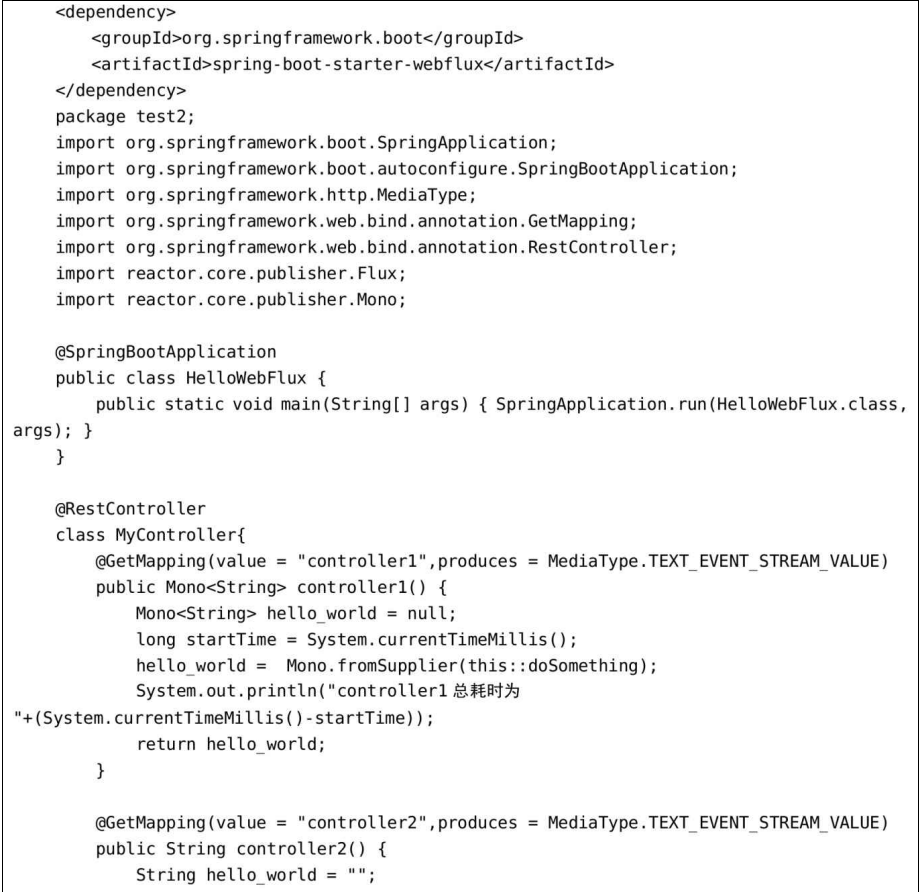

## 简介

## JUnit test

JUnit是一个用于编写和运行Java单元测试的框架。它提供了一组注解和断言方法，使得编写和执行单元测试变得更加简单和方便。JUnit可以帮助开发人员验证代码的正确性，捕获和修复潜在的缺陷，并确保代码在修改过程中不会破坏现有的功能。

## EclEmma

EclEmma是一个用于Java代码覆盖率分析的插件，可以与Eclipse集成使用。它可以显示代码中哪些部分被单元测试覆盖到，并生成可视化的报告。EclEmma帮助开发人员评估测试套件的覆盖范围，并确定哪些代码需要进一步测试。

## Checkstyle

Checkstyle是一个静态代码分析工具，用于帮助开发团队遵循一致的编码规范。它可以检查代码中的格式错误、命名约定、代码风格和其他潜在的问题，并生成相应的报告。通过使用Checkstyle，团队可以提高代码质量、可读性和可维护性。

## SpotBugs

SpotBugs是一个静态代码分析工具，用于检测Java程序中的潜在缺陷和错误。它可以发现常见的编程错误、空指针引用、资源泄漏、线程安全问题等。SpotBugs提供了详细的报告和建议，帮助开发人员改进代码质量和可靠性。

## VisualVM

VisualVM是一个功能强大的Java虚拟机（JVM）监视和性能分析工具。它可以显示应用程序的内存使用情况、线程活动、垃圾收集行为等，并提供实时的性能监控和分析。VisualVM还支持插件和扩展，可以与其他工具集成以提供更丰富的功能。

## Git

版本控制系统，用于管理和跟踪源代码的变更。可以查看历史提交记录、分支、合并代码等。

## Eclipse Memory Analyzer

Eclipse Memory Analyzer (MAT) 是一个用于分析 Java
应用程序的内存使用情况的工具。它可以通过分析堆转储文件（例如通过jmap生成的文件）来查找内存泄漏、大对象、过多的对象等问题，而无需执行正在开发的软件代码。MAT提供了强大的内存分析功能，可以帮助开发人员定位和解决内存相关的问题。

## JMap

jmap是Java虚拟机（JVM）的一个诊断工具，它可以生成Java堆转储文件，其中包含了Java应用程序在运行时的内存使用情况。通过使用jmap生成堆转储文件，可以将其提供给Eclipse
Memory Analyzer（MAT）等工具进行进一步的分析，而无需执行正在开发的软件代码。

## Jenkins

jenkins：一个开源的持续集成和交付工具，可自动构建、测试和部署软件项目。它可以设置为监控代码库的变更，并在发生变更时触发自动构建和测试过程。

## 自动化测试架构
#### TestNG + Mocktio

JUnit是Java单元测试的一站式解决方案，它把测试驱动的开发思想介绍给了Java开发人员，并教会他们如何有效地编写单元测试。但是在过去的几年中，JUnit的改进并不大，所以为当前复杂的环境编写测试任务已经变得越来越困难，即JUnit必须与其他一些补充性测试框架集成起来。TestNG是一个测试Java应用程序的新框架，功能十分强大。

EasyMock和Mockito可以极大地简化单元测试的编写过程，因而被许多程序员应用在日常工作中。这两个工具无法实现对静态函数、构造函数、私有函数、Final函数和系统函数的模拟，而这些函数在大型系统中必不可少。

#### JUnit + JMock

单元测试一般只测试某一个功能，但是由于类之间的耦合，往往难以把功能隔离开来。例如，想要测试某个业务逻辑处理数据的功能，但是数据是从Database取回的，这就涉及DAO层的类调用。但是很多时候，你不想让单元测试函数去访问数据库（，而是希望有一个假的DAO类刚好可以返回你需要的测试数据。此时即可使用Mock，它的作用是在单元测试里模拟类的行为和状态。

JMock与Mocktio都是提供Mock功能的框架。

## 自动化持续集成部署架构
#### Git/SVN + Jenkins

Git和SVN都是版本控制器。Git是分布式管理的版本控制器，通常被用于分布式模式，也就是说，每个开发人员从中心版本库或服务器上检出代码后都会在自己的机器上克隆一个与中心版本库一模一样的本地版本库。而SVN是集中式管理的版本控制器。

Jenkins是一个开源的、提供友好操作界面的持续集成工具，主要用于持续、自动地构建或测试软件项目、监控外部任务的运行。Jenkins是用Java语言编写的，既可以在Tomcat等流行的Servlet容器中运行，也可以独立运行。Jenkins通常与版本管理工具（SCM）和构建工具结合使用。

常用的版本控制工具有SVN和Git等，常用的构建工具有Maven、Ant和Gradle等。

Jenkins涉及持续集成（Continuous Integration，CI）和持续交付（Continuous Delivery，CD）。持续集成强调开发人员在提交新代码之后，立刻进行构建和（单元）测试。根据测试结果，确定新代码和原有代码能否正确地集成在一起。持续交付是在持续集成的基础上，将集成后的代码部署到类生产环境中。

Jenkins可以把FTP、SVN或Git中存储的Java程序持续构建到生产与测试环境中。也就是说，在微服务分布式环境下，不需要每次更新都在各个服务器上上传代码。一个项目的服务器越多，Jenkins的优势越明显。与Jenkins类似的软件有Travis CI等，不再赘述。

#### Puppet

Puppet是Linux、UNIX和Windows操作系统的自动管理引擎，它根据集中式规范执行管理任务（例如，添加用户、安装软件包和更新服务器配置等）。Puppet的简单陈述规范语言的能力提供了强大的代理服务，制定了主机之间的相似之处，同时使它们能够提供尽可能具体的、必要的管理内容，它依赖的先决条件和对象之间的关系清楚且明确。

Puppet主要解决的是环境部署的难点，例如，需要给50台服务器安装JDK，或者给10台服务器的MongoDB升级版本。如果在升级过程中出现意外的Bug和错误，此时就可以通过Puppet编写相关配置文件，一键安装到所有服务器上。与Puppet类似的软件有Homebrew等。

## 高并发架构
#### FreeMaker/Thymeleaf + FastDFS

页面静态化指将部分前端需要经常请求的内容，通过页面静态化引擎转换成独立的HTML页面进行缓存。也就是说，不再需要请求后端代码，即可直接返回独立的HTML页面，减轻后端的压力。例如，在某小说网站中如果对某本热门小说的每一章内容都去请求后端，则服务器和数据库的压力会过大，通过页面静态化技术，可以把该热门小说的每一章内容都制作成独立的HTML页面，当返回该页面时，服务器承受的压力几乎可以忽略不计。除小说网站外，门户网站、新闻网站、博客网站和视频网站都可以通过这样的技术进行架构。

FreeMaker/Thymeleaf + FastDFS是一种页面静态化+文件管理系统的高并发架构，多用于视频、电商、小说等网站。这里的FastDFS也可以换成其他软件，其目的是减少对数据库的读取，将静态化页面存储在某存储引擎或文件管理系统中。

传统SSM项目架构在上传静态文件时通常上传至SSM项目服务器的本地，无法针对存储进行加卷之类的扩展性操作，因而FastDFS应运而生。FastDFS是专门为了管理静态文件制作的独立运行的应用程序，静态文件可能包含图片、GIF、TXT等。

在Spring Boot + FastDFS + Thymeleaf架构中，FastDFS主要负责保存Thymeleaf生成的静态文件，并提供给Spring Boot进行读写操作。这是一种很常见的以空间换时间的架构模式。当文件管理系统中的数据量过大时，可以进行定时删除操作，极大地减少对MySQL的访问量。

当然，电商网站用Elasticsearch引擎或MongoDB缓存的也非常多，方便在读取页面时返回不同的数据，减少对MySQL数据库的访问量。页面静态化+文件管理系统的架构更加细致，返回速度更快，压力更小。

下面用一个简单的例子介绍Spring Boot + FastDFS + Thymeleaf架构的业务流程。假设前端需要请求一页新闻，首先，请求Redis查看缓存中是否包含Thymeleaf生成的静态页面标识。若没有，则通过MySQL请求静态页面标识。其次，在拿到静态页面标识后，即可通过FastDFS请求到HTML静态页面，并直接将其返回给前端进行处理。另外，管理员或定时任务可以定时修改FastDFS中的新闻（相当于更新FastDFS中的缓存）。

如果不使用该架构，仍假设前端需要请求一页一万字的新闻，则先在Redis中查询是否包含这一万字的新闻。若没有，再在MySQL中查询一万字的String字符串，转化速度极慢。这种架构相当于将大量的字符都缓存了起来 ， 减 少 了 后 端 的 压 力 。 但 是 将 N 篇 一 万 字 的 新 闻 都 缓 存 在 Redis 或Elasticsearch中并不是好的选择。

#### Spring Boot +Netty+ gRpc + Protobuf

Spring Boot + Netty + gRPC +Protobuf是一种多语言多协议的集成架构，多用于金融、医疗等网站。

Protobuf是一个与平台和语言无关，可扩展且轻便高效的序列化数据结构协议，可用于网络通信和数据存储。Protobuf像XML和JSON一样，可以让由不同语言编写并在不同平台上运行的应用程序交换数据。例如，用Go语言编写的发送程序可以在Protobuf中对用Go语言编写的销售订单数据进行编码，然后用Java语言编写的接收方对它进行解码，以获取所接收订单数据的Java表示方式。Protobuf传输的是二进制数据。Protobuf和其他编码系统对结构化数据进行序列化和反序列化。

远程过程调用（Remote Procedure Call，RPC）框架实际上是提供了一套机制，使得应用程序之间可以进行通信，而且遵从C/S模型。在使用时，客户端调用服务器端提供的接口就像调用本地的函数一样。

gRPC是Google公司针对远程过程调用提供的一种实现框架，通过gRPC框架配合ProtoBuf序列化传输协议，可以使数据如同本地调用一样轻松跨语言传输。例如，对于一些特定内容，若C++性能比Java性能更加优秀，则可以使用C++代码编写，之后再通过gRPC+ Protobuf架构让Java代码直接调用。

#### Spring Batch + Quartz + Kettle

Spring Batch是Spring全家桶的一个组件，是一个批处理应用框架。它不是调度框架，但需要和调度框架合作来构建并完成批处理任务。它只关注批处理任务相关的问题，如事务、并发、监控、执行等，并不提供相应的调度功能。如果需要使用调度框架，则可以使用Quartz、Tivoli、Control-M、Cron等企业级调度框架。Spring Batch擅长数据迁移、数据同步、数据批处理等工作。

Quartz是OpenSymphony开源组织在Job Scheduling领域的又一个开源项目，它既可以与J2EE和J2SE应用程序相结合，也可以单独使用。Quartz可以用来创建简单的或者可以运行上万个Jobs这样复杂的程序。Jobs可以做成标准的Java组件或EJBs。

Spring Batch + Quartz通常与Kettle、MySQL一起使用。Kettle是一款国外开源的ETL（Extract-Transform-Load）数据仓库技术工具，可以在Window、Linux、UNIX操作系统上运行，数据抽取高效稳定。Spring Batch +Quartz可将多个数据源的数据统一置入数据仓库中，由数据仓库导出各种所需要的数据。例如，原本的数据为用户表、购物车表和商品表，经数据仓库处理之后，可直接返回所需要的数据格式，而非多个表或多个值。除此之外，Kettle包含界面化导出Excel的功能，可以由非技术类人员导出相关数据。

## 响应式编程架构
响应式编程（Reactive Programming）是一种面向数据流和变化传播的范式，可以在编程语言中很方便地表达静态或动态的数据流，相关的计算模型会自动将变化的值通过数据流进行传播。例如，c=a+b表示将a+b表达式的结果赋给c。在传统编程中，改变a或b的值不会影响c；但在响应式编程中，c的值会随着a或b值的变化而变化。

Reactor是一个基于JVM之上的异步应用框架。为Java、Groovy和其他JVM语言提供构建基于事件和数据驱动应用的抽象库。Reactor的性能相当高，在最新的硬件平台上，使用无堵塞分发器每秒可以处理1500万个事件。

Reactor框架是Spring之前的项目，实现了Reactive Programming思想，符合Reactive Streams规范。。Spring WebFlux是在Ractor框架基础上实现的响应式Web框架，完全无阻塞，支持Reactive Streams背压，并且可以在Netty、Undertow和Servlet 3.1+等服务器上运行。

Spring WebFlux的功能较多，下面通过代码展示部分功能：

此时分别调用controller1接口与controller2接口，后台日志输出如下所示：

## 负载均衡架构
负载均衡的含义是通过多台服务器共同承载压力。例如，一个HTTP请求通过Nginx中间件转发给多台Tomcat的架构形式即为负载均衡架构。

负载均衡架构有多种表现形式，如下所示：

* 服务器端静态反向代理负载均衡架构：Keepalived + Nginx + Java。该架构被负载的实际地址是在配置文件中直接编写的IP地址与端口。该架构形式无法在正在运行的过程中进行修改。
* 服务器端动态反向代理负载均衡架构：Nginx + UpSync + Consul +Java。该架构被负载的实际地址是通过Consul注册中心记录的。Nginx会通过UpSync插件获得到实际地址并进行负载均衡。该架构形式可以在系统正常运行时更新Java程序的节点。
* 客 户 端 负 载 均 衡 架 构 Spring Cloud + Consul + Spring BootRibbon。在该架构中，当Java1程序请求Java2程序时，Java1程序会通过Consul获取Java2程序的节点信息，若Java2程序在Consul中注册了N个节点，则Java1程序在获得所有Java2程序的节点信息之后，会通过算法请求Java2程序的其中一个节点，即以客户端请求直接进行分发的方式达到负载均衡的目的
* DNS负载均衡技术的实现原理是在DNS服务器中为同一个主机名配置多个IP地址，以便将客户端的访问引导到不同的服务器上去，使得不同的客户端访问不同的服务器，从而达到负载均衡的目的。这种负载均衡技术通常由云服务商提供。与DNS负载均衡类似的是CDN负载均衡，不再赘述。
* 硬件负载均衡技术：通常由硬件直接进行数据与请求分发，达到负载均衡的结果。市场上常见的硬件有NetScaler和Radware等。
* 协议性负载均衡架构。例如，通过HTTP协议的重定向功能进行负载均衡，或通过自研协议进行负载均衡。
* 混合型负载均衡架构。使用多种负载均衡架构的混合架构，不同的应用程序可以采用不同的负载均衡架构。

## 监控工具与监控架构
#### 性能监控设计

性能监控通常指监控Linux服务器的CPU、内存、I/O、硬盘、应用程序接口耗时等，常见的性能监控架构如下所示：

* Telegraf + InfluxDB + Chronograf + Kapacitor架构。
* Prometheus + Grafana架构。
* Elasticsearch + Logstash + Kibana + Filebeat架构。
* Zabbix + Grafana架构。
在Telegraf + InfluxDB + Chronograf + Kapacitor架构（简称TICK架构）中，InfluxDB为时序数据库，负责数据存储；Telegraf为独立运行的采集软件，负责数据采集；Chronograf负责数据可视化；Kapacitor负责告警、预警。Telegraf从Linux系统或相关文件中获取数据，通过HTTP接口传到InfluxDB数据库中，Chronograf会定时从InfluxDB数据库中获取相关数据并进行展示。

TICK架构可转换成Telegraf + InfluxDB + Grafana架构（简称TIG架构），其中，Grafana提供数据可视化与报警、预警功能。TICK架构也可转换成Prometheus + Grafana架构（简称PG架构），即由Prometheus负责数据的采集与存储。

在 Elasticsearch + Logstash + Kibana 架 构 （ 简 称 ELK 架 构 ） 中 ，Logstash负责数据的采集，Elasticsearch负责数据的存储，Kibana负责数据的展示。当Logstash在大型项目中采集能力不足时，偶尔会增加Filebeat来采集数据，之后通过Logstash管道传输给Elasticsearch。

ELK架构与TICK架构、TIG架构和PG架构的相似之处在于各个角色的划分几乎相同，并且都可以采集CPU、内存等信息，与TICK架构、TIG架构和PG架构相比，ELK架构更着重于采集不同类型的数据，具有更丰富的生态，不过在构建一些监控图表时，较为费时费力。TICK架构、TIG架构和PG架构的监控图表更加美观，搭建与报警也更加简便，所以业内通常采用TICK架构和TIG架构作为性能监控设计，采集CPU、内存、硬盘等相关信息；采用ELK架构作为业务监控设计，采集程序日志、Nginx日志、接口请求等相关信息。采用TICK架构、TIG架构作为性能监控设计主要。采用PG架构采集MySQL相关的信息。

Zabbix与上面的软件都不同，它是一套自我完善的监控软件，也就是说，只使用Zabbix，也可以完成对CPU、内存等相关信息的监控。Zabbix是一个基于Web界面的提供分布式系统监视和网络监视功能的企业级的开源解决方案。Zabbix能控各种网络参数，保证服务器系统的安全运营；并提供灵活的通知机制，以便让系统管理员快速定位并解决存在的问题。

Zabbix由两部分组成，zabbix server与可选组件zabbix agent。zabbixserver可以通过SNMP、zabbix agent、ping、端口监视等实现对远程服务器或网络状态的监控、数据收集等功能，它可以运行在Linux、Solaris、OS X等平台上。

Zabbix自带图表功能，但图表并不美观，所以通常结合Grafana使用。

## 全链路监控

Pinpoint是一款全链路分析工具，提供了无侵入式的调用链监控和方法执行详情查看、应用状态信息监控等功能，与另一款开源的全链路分析工具Zipkin类似。与Zipkin相比，Pinpoint提供了无侵入式等特性，支持的功能较为丰富，可以帮助分析系统的总体结构，以及分布式应用程序组件之间是如何进行数据互联的。

服务拓扑图：对整个系统中应用的调用关系进行了可视化的展示，单击某个服务节点，可以显示该节点的详细信息，比如当前节点状态、请求数量等

实时活跃线程图：监控应用内活跃线程的执行情况，可以直观地了解应用的线程执行性能。请求响应散点图：以时间维度进行请求计数和响应时间的展示，通过拖动图表可以选择对应的请求，查看执行的详细情况。

请求调用栈查看：对分布式环境中的每个请求都提供了代码维度的可见性，可以在页面中查看请求针对代码维度的执行详情，帮助查找请求的瓶颈和故障原因。

应用状态、机器状态检查：查看相关应用程序的其他详细信息，比如CPU的使用情况、内存状态、垃圾收集状态、TPS和JVM信息等参数。

与Pinpoint类似的还有Zorka和Scouter等。

