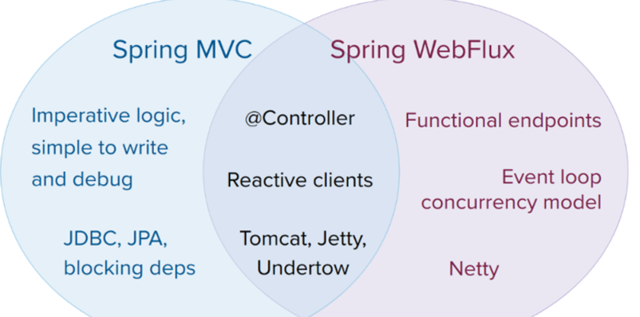
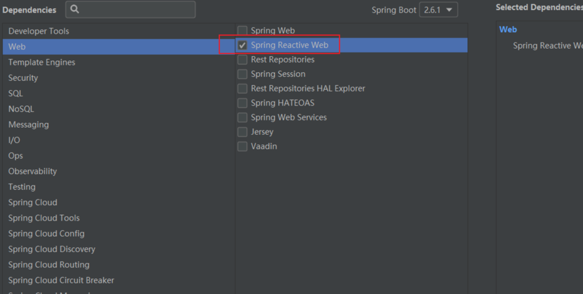
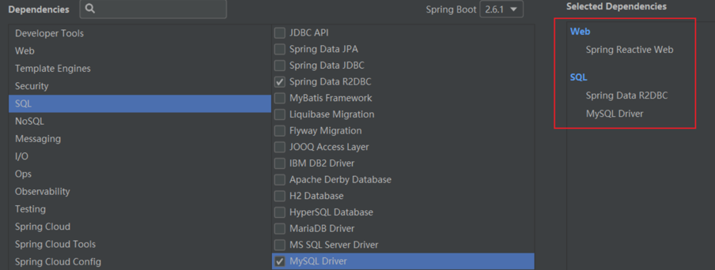

因为想学习 Spring Cloud Gateway 来着，然后发现它是基于 Spring5.0+SpringBoot2.0+WebFlux等技术开发的。所以学之前才要来简单了解下 WebFlux 技术。

然后要学习 WebFlux 时我发现又需要 Java 8 中的函数式编程、Stream 流等技术作为前置知识。环环相扣啊，套娃一样。

所以前面还有两篇学习的文章：来系统学习下 lambda 表达式吧和来一起学习下 Java 8 的 Stream 流。

我只是想学下 Spring Cloud Gateway 而已，作为前置知识，WebFlux 我暂时也不打算深深的研究了，就先简单学习下吧。

话说这么多，开始今天的学习吧。

## 什么是 WebFlux

Spring Framework 中包含的原始 Web 框架 Spring Web MVC 是专门为 Servlet API 和 Servlet 容器构建的。反应式堆栈 Web 框架 Spring WebFlux 是在 5.0 版的后期添加的。它是完全非阻塞的，支持反应式流(Reactive Stream)背压，并在Netty，Undertow和Servlet 3.1 +容器等服务器上运行。



上面的文字和图片都是来自官网的。从中我们可以大概知道 Spring WebFlux 是对标 Spring MVC 的。

Spring WebFlux 是一个异步非阻塞式 IO 模型，通过少量的容器线程就可以支撑大量的并发访问。底层使用的是 Netty 容器，这点也和传统的 SpringMVC 不一样，SpringMVC 是基于 Servlet 的。

接口的响应时间并不会因为使用了 WebFlux 而缩短，服务端的处理结果还是得由 worker 线程处理完成之后再返回给前端。

## 反应式库

### 1. Reactive Stream

   相信你应该注意到上面的一个名词 反应式流(Reactive Stream)。是什么意思呐？

我们先看下这个概念：

反应式编程（Reactive Programming） ，这是微软为了应对 高并发环境下 的服务端编程，提出的一个实现 异步编程 的方案。

反应式流（Reactive Stream） 就是反应式编程相关的规范，在 Java 平台上，由Netflix（开发了 RxJava）、TypeSafe（开发了 Scala、Akka）、Pivatol（开发了 Spring、Reactor）共同制定。

它由以下几个组件组成：

* 发布者：发布元素到订阅者
* 订阅者：消费元素
* 订阅：在发布者中，订阅被创建时，将与订阅者共享
* 处理器：发布者与订阅者之间处理数据

### 2. Reactor

Reactive Stream 是一套反应式编程的规范，但作为应用程序 API，应用程序肯定还是需要一个更高级、更丰富的功能 API 来编写异步逻辑。这就是 反应式库 所扮演的角色。

Reactor 框架是 Pivotal 基于 Reactive Programming 思想实现的。它符合 Reactive Streams 规范。它提供了Mono和Flux API 类型，通过一组与 ReactiveX 运算符词汇表一致的丰富运算符来处理 0…1 （） 和 0…N （）的数据序列。是一个用于 JVM 的完全非阻塞的响应式编程框架，具备高效的需求管理，可以很好的处理 “backpressure”。
Reactor 就是 Spring WebFlux 的首选 反应式库。

在上面的概念中，大家最重要是要记住 Flux 和 Mono 这两个 Reactor 的核心类：

* Mono：实现发布者 Publisher，并返回 0 或 1 个元素。
* Flux：实现发布者 Publisher，并返回 N 个元素。
两个都是发布者 Publisher。

### 3. Reactive Stream、Reactor 和 WebFlux 关系

上面概念性的东西可能看起来有些头疼，说了这么多，Reactive Stream、Reactor 和 WebFlux 三者之间到底是什么关系呐？

* Reactive Stream 是一套反应式编程 标准 和 规范；
* Reactor 是基于 Reactive Streams 一套 反应式编程框架；
* WebFlux 以 Reactor 为基础，实现 Web 领域的 反应式编程框架。

代码初体验

上面说了那么多的概念，终于到了代码环节了，就先来简单的体验下代码是什么样子的吧。

首先我们创建一个 Spring Boot 工程，需要注意的是，以往创建 Spring Boot 时我们都是选择 Spring Web 依赖，但是这次我们选择 Spring Reactive Web 依赖:



1. Mono

```java
@RestController
public class HelloController {
    @GetMapping("/hello")
    public Mono<String> hello() {
        long start = System.currentTimeMillis();
        Mono<String> hello = Mono.fromSupplier(() -> getHelloStr());
        System.out.println("接口耗时：" + (System.currentTimeMillis() - start));
        return hello;
    }

    private String getHelloStr() {
        try {
            Thread.sleep(2000);
        } catch (InterruptedException e) {
            e.printStackTrace();
        }
        return "hello";
    }
}

```


启动项目，浏览器访问这个 /hello 接口，控制台输出如下：

* 接口耗时：0
* 可以看到：在 WebFlux 接口中，请求不会被阻塞，所以服务端的接口耗时为 0。


2. Flux

```java
@GetMapping(value = "/flux",produces = MediaType.TEXT_EVENT_STREAM_VALUE)
public Flux<String> flux() {
    Flux<String> flux = Flux.fromArray(new String[]{"小黑","小胖","小六","一鑫"}).map(s -> {
        try {
            Thread.sleep(2000);
        } catch (InterruptedException e) {
            e.printStackTrace();
        }
        return "二班：" + s;
    });
    return flux;
}

```


> Flux 也是一个 Publisher，它可以由一个数组产生，需要注意的是，这里返回的 Content-Type 是 MediaType.TEXT_EVENT_STREAM_VALUE，即 text/event-stream。 text/event-stream 是服务器向浏览器推送消息的一种方案，这种方案和我们所熟知的 WebSocket 有一些差别。暂时先不写了。

## 操作数据库

Spring Boot 2.3.0.RELEASE 开始才正式支持基于 R2DBC 的 MySQL 驱动。

R2DBC：R2DBC 是 Spring 官方在 Spring5 发布了响应式 Web 框架 Spring WebFlux 之后急需能够满足异步响应的数据库交互 API，不过由于缺乏标准和驱动，Pivotal 团队开始自己研究响应式关系型数据库连接 Reactive Relational Database Connectivity，并提出了 R2DBC 规范 API 用来评估可行性并讨论数据库厂商是否有兴趣支持响应式的异步非阻塞驱动程序。最早只有 PostgreSQL 、H2、MSSQL 三家数据库厂商，现在 MySQL也加入进来了。

今天就学习一下基于 R2DBC 来操作 MySQL 数据库。

### 1. 创建项目

选择这几个依赖，创建新的 project:



pom.xml 文件里是这样的：
```java
<dependencies>
    <dependency>
        <groupId>org.springframework.boot</groupId>
        <artifactId>spring-boot-starter-data-r2dbc</artifactId>
    </dependency>
    <dependency>
        <groupId>org.springframework.boot</groupId>
        <artifactId>spring-boot-starter-webflux</artifactId>
    </dependency>
    <dependency>
        <groupId>dev.miku</groupId>
        <artifactId>r2dbc-mysql</artifactId>
        <scope>runtime</scope>
    </dependency>
    <dependency>
        <groupId>mysql</groupId>
        <artifactId>mysql-connector-java</artifactId>
        <scope>runtime</scope>
    </dependency>
</dependencies>

```


然后是 application.properties:
```java
server.port=8081
spring.r2dbc.url=r2dbcs:mysql://locahost:3306/test
spring.r2dbc.username=root
spring.r2dbc.password=root

```


### 2. 创建数据库表
```java
CREATE TABLE `test_user`  (
  `user_id` int NOT NULL AUTO_INCREMENT,
  `user_name` varchar(255),
  `age` int,
  `address` varchar(255) ,
  PRIMARY KEY (`user_id`) USING BTREE
) 

```


创建一个简单的 test_user 表。

### 3. 创建相关类

实体类
```java
@Table("test_user")
public class User {
    @Id
    private int userId;
    private String userName;
    private int age;
    private String address;
    
    // 省略 getter、setter
}

```


UserRepository，就相当于 DAO
```java
public interface UserRepository extends ReactiveCrudRepository<User, Integer> {
}

```

UserController 控制器
```java
@RestController
@RequestMapping("/user")
public class UserController {
    @Autowired
    private UserRepository userRepository;

    @RequestMapping("/getAllUser")
    public Flux<User> getAllUser() {
        Flux<User> userFlux = userRepository.findAll();
        return userFlux;
    }

    @RequestMapping("/addUser")
    public Mono<User> addUser(User user) {
        Mono<User> mono = userRepository.save(user);
        return mono;
    }
}

```


大功告成，接下来就该启动项目，测试一下了。

### 4. 启动测试

   项目启动之后，我们使用 Postman 测试一下。

### 请求地址路由

还使用上一步的数据库表和实体类，但这次我们不用 UserController，而是换成了 UserHandler 和 RouterConfiguration。

创建 Userhandler.java
```java
@Component
public class UserHandler {

    @Autowired
    UserRepository userRepository;

    public Mono<ServerResponse> getAllUsers(ServerRequest serverRequest) {
        return ok().contentType(APPLICATION_JSON)
                .body(userRepository.findAll(), User.class);
    }

    public Mono<ServerResponse> addUser(ServerRequest serverRequest) {
        return ok().contentType(APPLICATION_JSON)
                .body(userRepository.saveAll(serverRequest.bodyToMono(User.class)), User.class);
    }

    public Mono<ServerResponse> deleteUser(ServerRequest serverRequest) {
        return userRepository.findById(Integer.valueOf(serverRequest.pathVariable("userId")))
                .flatMap(user -> userRepository.delete(user).then(ok().build()))
                .switchIfEmpty(notFound().build());
    }
}

```


创建 RouterConfiguration
```java
@Configuration
public class RouterConfiguration {
    @Bean
    RouterFunction<ServerResponse> userRouterFunction(UserHandler userHandler) {
        return RouterFunctions.nest(RequestPredicates.path("/user"),
                RouterFunctions.route(RequestPredicates.GET("/getAllUser"), userHandler::getAllUsers)
                        .andRoute(RequestPredicates.POST("/addUser"), userHandler::addUser)
                        .andRoute(RequestPredicates.DELETE("/{userId}"), userHandler::deleteUser));
    }
}

```


* 这个配置类的作用有点像 SpringMVC 中的 DispatcherServlet，负责请求的分发，根据不同的请求 URL，找到对应的处理器去处理。
* 通过 RouterFunctions 这样一个工具类来创建 RouterFunction 实例。
* 首先调用 nest 方法，第一个参数配置的相当于是接下来配置的地址的一个前缀，这有点类似于我们在 Controller 类上直接写 @RequestMapping 注解去配置地址。
* nest 方法的第二个参数就是 RouterFunction 实例了，每一个 RouterFunction 实例通过 RouterFunctions.route 方法来构建，它的第一个参数就是请求的 URL 地址（注意这个时候配置的地址都是有一个共同的前缀），第二个参数我们通过方法引用的方式配置了一个 HandlerFunction，这个就是当前请求的处理器了。
* 通过 addRoute 方法可以配置多个路由策略。
测试

修改：

查询和前面一样：


### 适用性

官网上是这样建议的：

* 如果原先使用用SpringMVC好好的话，则没必要迁移。因为命令式编程是编写、理解和调试代码的最简单方法。因为老项目的类库与代码都是基于阻塞式的。
* 如果你的团队打算使用非阻塞式web框架，WebFlux确实是一个可考虑的技术路线，而且它支持类似于SpringMvc的Annotation的方式实现编程模式，也可以在微服务架构中让WebMvc与WebFlux共用Controller，切换使用的成本相当小。
* 在SpringMVC项目里如果需要调用远程服务的话，你不妨考虑一下使用WebClient，而且方法的返回值可以考虑使用Reactive Type类型的，当每个调用的延迟时间越长，或者调用之间的相互依赖程度越高，其好处就越大。
* 在微服务架构中，您可以混合使用Spring MVC或Spring WebFlux控制器或Spring WebFlux功能端点的应用程序。在两个框架中支持相同的基于注释的编程模型，可以更轻松地重用知识，同时为正确的工作选择正确的工具。

Spring WebFlux 并不是让你的程序运行的更快(相对于SpringMVC来说)，而是在有限的资源下提高系统的伸缩性，因此当你对响应式编程非常熟练的情况下并将其应用于新的系统中，还是值得考虑的，否则还是老老实实的使用WebMVC。

