## 一、原子类简介

### 1 什么是原子类

Java中提供了一些原子类，原子类包装了一个变量，并且提供了一系列对变量进行原子性操作的方法。原子性的意思是对于一组操作，要么全部执行成功，要么全部执行失败，不能只有其中某几个执行成功。在多线程的情况下能够保证操作 `不会被中断`，从而能保证并发安全

### 2. 与锁的区别

原子类作用和锁挺像，都可以保证并发情况下的`线程安全`。但是原子类比锁更`具有优势`：

- 粒度更细：

  原子变量可以把多线程竞争范围缩小到变量级别，这是我们可以获得的最细粒度的情况，通常锁的粒度都要比原子变量的粒度大

- 效率更高：

  通常，使用原子类的效率会比使用锁的效率更高，除了高度竞争的情况


### 3. 原子类的底层实现

目前Java中提供的原子类大部分底层使用了CAS锁（CompareAndSet自旋锁），如AtomicInteger、AtomicLong等；也有使用了分段锁+CAS锁的原子类，如LongAdder等。

### 4. 原子类种类

在JDK中J.U.C包下提供了种类丰富的原子类，以下所示：

|类型|具体类型|
|---|---|
|Atomic* 基本类型原子类|AtomicInteger、AtomicLong、AtomicBoolean|
|Atomic*Array 数组类型原子类|AtomicIntegerArray、AtomicLongArray、AtomicReferenceArray|
|Atomic*Reference 引用类型原子类|AtomicReference、AtomicStampedReference、AtomicMarkableReference|
|Atomic*FieldUpdater 升级类型原子类|AtomicIntegerfieldupdater、AtomicLongFieldUpdater、AtomicReferenceFieldUpdater|
|Adder 累加器|LongAdder、DoubleAdder|
|Accumulator 积累器|LongAccumulator、DoubleAccumulator|

## 二、原子类使用案例

### 1. Atomic* 基本类型原子类

这里以 AtomicInteger 为例，下面是 AtomicInteger常用方法 ，其他的两种AtomicLong、AtomicBoolean和它相似：

|方法|作用|
|---|---|
|public final int get()|获取当前的值|
|public final int getAndSet(int newValue)|获取当前的值，并设置新的值|
|public final int getAndIncrement()|获取当前的值，并自增+1|
|public final int getAndDecrement()|获取当前的值，并自减-1|
|public final int getAndAdd(int delta)|获取当前的值，并加上预期的值。getAndIncrement和getAndDecrement不满足，可使用当前方法|
|boolean compareAndSet(int expect, int update)|如果输入的数值等于预期值，则以原子方式将该值更新为输入值（update）|

代码演示：

```java
/**
 *      演示AtomicInteger的基本用法，并对比非原子类的线程安全问题
 */
public class AtomicIntegerDemo1 implements Runnable {
    private static final AtomicInteger atomicInteger =  new AtomicInteger();
    private static final AtomicInteger atomicInteger2 =  new AtomicInteger();

    //原子类型自增
    public void atomicIncrement(){
        atomicInteger.getAndIncrement();
    }
    //原子类型 getAndAdd()
    public void atomicAdd(){
        atomicInteger2.getAndAdd(4);
    }

    private static volatile int basicCount = 0;

    //普通类型自增
    public void basicIncrement(){
        basicCount++;
    }

    @Override
    public void run() {
        for (int i = 0; i < 10000; i++) {
            atomicIncrement();
            basicIncrement();
            atomicAdd();
        }
    }

    //主函数
    public static void main(String[] args) throws InterruptedException {
        AtomicIntegerDemo1 aid = new AtomicIntegerDemo1();
        Thread thread1 = new Thread(aid);
        Thread thread2 = new Thread(aid);
        thread1.start();
        thread2.start();
        thread1.join();
        thread2.join();

        System.out.println("原子类的结果："+atomicInteger.get());
        System.out.println("普通变量值："+basicCount);
        System.out.println("getAndAdd的结果："+atomicInteger2.get());
    }
}
```
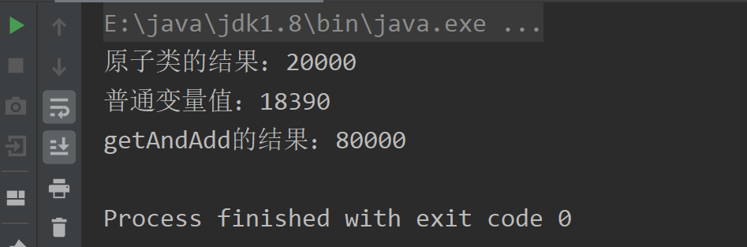

以上截图可以看出，普通基本类型由于多线程冲突，导致累加结果不准确，但是如果使用`synchronized`修饰普通变量的自增，那么就和原子变量atomicInteger 的数据结果一致了，如下

```cpp
    //普通类型自增
    public synchronized void basicIncrement(){
        basicCount++;
    }
```
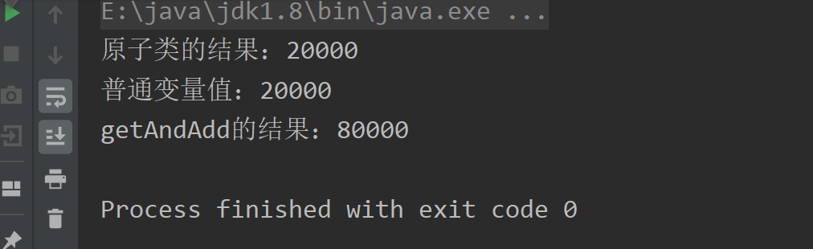

### 2. Atomic*Array数组类型原子类

代码演示：

```java
/**
 *      演示原子数组的使用方法
 */
public class AtomicArray {

    public static void main(String[] args) {
        AtomicIntegerArray atomicIntegerArray = new AtomicIntegerArray(1000);

        Incrementer incrementer = new Incrementer(atomicIntegerArray);
        Decrementer decrementer = new Decrementer(atomicIntegerArray);

        Thread[] threadsIncrementer = new Thread[100];
        Thread[] threadsDecrementer = new Thread[100];
        for (int i = 0; i < 100; i++) {
            threadsDecrementer[i] = new Thread(decrementer);
            threadsIncrementer[i] = new Thread(incrementer);

            threadsDecrementer[i].start();
            threadsIncrementer[i].start();
        }

//        Thread.sleep(10000);
        for (int i = 0; i < 100; i++) {
            try {
                threadsDecrementer[i].join();
                threadsIncrementer[i].join();
            } catch (InterruptedException e) {
                e.printStackTrace();
            }
        }

        for (int i = 0; i <atomicIntegerArray.length() ; i++) {
            if (atomicIntegerArray.get(i)!=0){
                System.out.println("发现了错误： " +i);
            }
        }
        System.out.println("运行结束");

    }
}

//自减任务类
class Decrementer implements Runnable{
    private AtomicIntegerArray array;

    public Decrementer(AtomicIntegerArray array) {
        this.array = array;
    }

    @Override
    public void run() {
        for (int i = 0; i < array.length(); i++) {
            array.getAndDecrement(i);
        }
    }
}

//自增任务类
class Incrementer implements Runnable{
    private AtomicIntegerArray array;

    public Incrementer(AtomicIntegerArray array) {
        this.array = array;
    }

    @Override
    public void run() {
        for (int i = 0; i < array.length(); i++) {
            array.getAndIncrement(i);
        }
    }
}

```
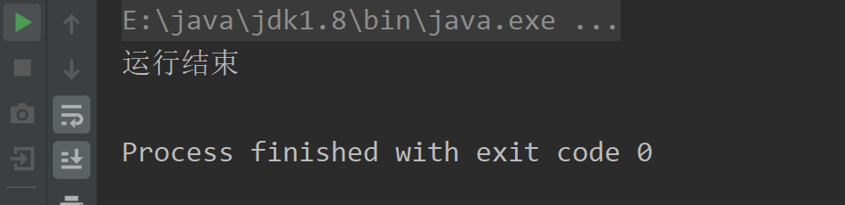

长度为1000的数组，使用100个线程执行自增，100个线程执行自减，执行完毕后，数组内的所有元素的值均为0，可见，AtomicIntegerArray的每一个元素的操作都是原子性的。

### 3. Atomic*Reference引用类型原子类

代码演示如下，这是一个实现自旋锁的例子，该例子出自 [Java并发之 Lock 锁](https://mp.weixin.qq.com/s?__biz=MzU3NDgyMTIxMw==&mid=2247484834&idx=1&sn=21a528f8abdfca34c1759f778f69eb2c&chksm=fd2dc390ca5a4a868e2f15126ae9fc87df6db082dc51b7c13d6b7042e5b07a1263631300f46c#rd)：

```java
/**
 *      自旋锁演示
 */
public class SpinLock {
    private AtomicReference<Thread> sign = new AtomicReference<>();

    //加锁操作
    public void lock(){
        Thread current = Thread.currentThread();
        //期待是null，如果是期望的，就将其设置为current
        while (!sign.compareAndSet(null,current)){
            System.out.println(Thread.currentThread().getName()+"：自旋获取失败，再次尝试");
        }
    }

    //解锁操作
    public void unlock(){
        Thread current = Thread.currentThread();
        //期待加锁的当前线程，如果是期望的，就将其设置为为null，也就是没有持有了，就是解锁了
        sign.compareAndSet(current,null);
    }

    public static void main(String[] args) {
        SpinLock spinLock = new SpinLock();

        Runnable runnable = new Runnable() {
            @Override
            public void run() {
                System.out.println(Thread.currentThread().getName() + "：开始尝试获取自旋锁");
                spinLock.lock();
                System.out.println(Thread.currentThread().getName() + "：获取到了自旋锁");
                try {
                    Thread.sleep(300);
                } catch (InterruptedException e) {
                    e.printStackTrace();
                } finally {
                    spinLock.unlock();
                    System.out.println(Thread.currentThread().getName() + "：释放了自旋锁");
                }
            }
        };

        Thread thread1 = new Thread(runnable);
        Thread thread2 = new Thread(runnable);

        thread1.start();
        thread2.start();

    }

}
```
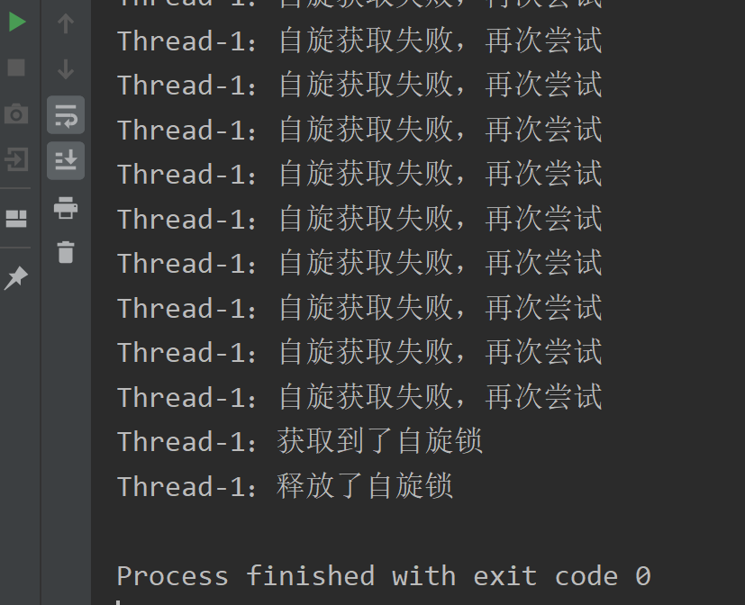

其中，compareAndSet() 方法的源码如下：
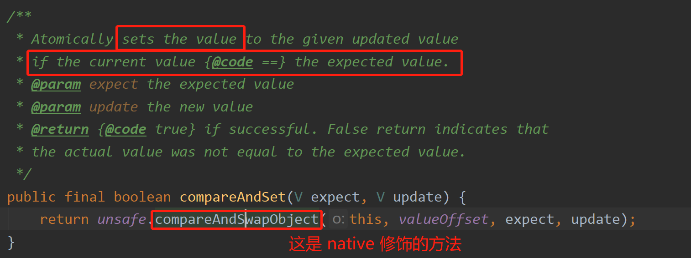

### 4. Atomic*FieldUpdater 升级类型原子类

以AtomicIntegerFieldUpdater 为例， `AtomicIntegerFieldUpdater`可以对普通变量进行`升级`。

**使用场景**

- 这个普通变量，只偶尔需要一个原子get/set操作（如晚上某个时刻他存在大量并发修改，其他时刻就正常）
- 这个变量是其他人定义的，我们无权将他定义为原子类型，只能对他进行临时升级

**代码演示**

```java
/**
 *      演示AtomicIntegerFieildUpdater的用法
 */
public class AtomicIntegerFieildUpdater implements Runnable {
    static Candidate tom;
    static Candidate jack;

    //newUpdater():参数1指定哪个类，参数2哪个字段。这里的入参和反射的入参很像，因为它的底层原理是反射
    public static AtomicIntegerFieldUpdater<Candidate> scoreUpdater = AtomicIntegerFieldUpdater.newUpdater(Candidate.class,"score");

    @Override
    public void run() {
        for (int i = 0; i < 10000; i++) {
            tom.score++;//普通自增
            scoreUpdater.getAndIncrement(jack);//通过包装自增
        }
    }


    //候选人类
    public static class Candidate{
        //分数
        volatile int score;
    }

    //主函数
    public static void main(String[] args) throws InterruptedException {
        tom = new Candidate();
        jack = new Candidate();
        AtomicIntegerFieildUpdater a = new AtomicIntegerFieildUpdater();
        Thread thread1 = new Thread(a);
        Thread thread2 = new Thread(a);

        thread1.start();
        thread2.start();
        thread1.join();
        thread2.join();

        System.out.println("普通自增： "+tom.score);
        // 获取值时还按照普通变量操作
        System.out.println("升级自增： "+jack.score);
    }
    
}

```
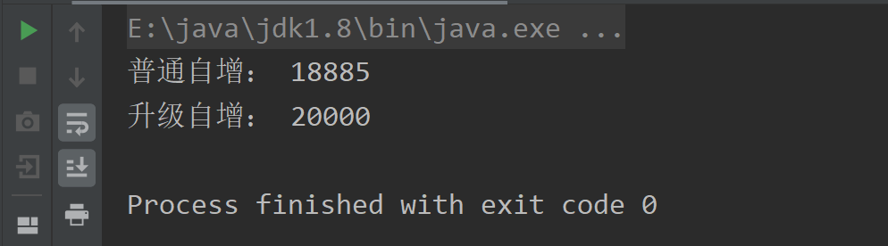

被升级的变量有两个**限制**：

- 不支持`被static修饰`的变量
- 可见范围，`由public修饰的变量`，private不行

## 三、Adder累加器

这里以 LongAdder 为例，

### 1. LongAdder 简介：

- Java8引入
- 高并发下LongAdder比AtomicLong`效率高`，本质还是`空间换时间`
- 竞争激烈的情况下，LongAdder会把不同线程对应到不同的Cell上进行修改，降低冲突的概率，是`多段锁`的理念，提高了并发性

### 2. 代码演示

对比AddderLong & AtomicLong的高并发性能：

#### （1）AtomicLong，20个线程并发，每个线程执行10000次

```java
public class AtomicLongDemo {
    //主函数
    public static void main(String[] args) throws InterruptedException {
        AtomicLong counter = new AtomicLong(0);

        //新建线程池
        ExecutorService pool = Executors.newFixedThreadPool(20);
        long startTime = System.currentTimeMillis();
        //任务次数
        for (int i = 0; i < 10000; i++) {
            pool.submit(new Task(counter));
        }
        //关闭线程池
        pool.shutdown();
        while (!pool.isTerminated()){
        }
        long endTime = System.currentTimeMillis();
        System.out.println(counter.get());
        System.out.println("AtomicLong完成时间："+(endTime-startTime)+"毫秒");
    }

    //任务内部类
    public static class Task implements Runnable{
        private AtomicLong count;

        public Task(AtomicLong count) {
            this.count = count;
        }

        @Override
        public void run() {
            for (int i = 0; i < 10000; i++) {
                count.incrementAndGet();//自增
            }
        }
    }

}

```
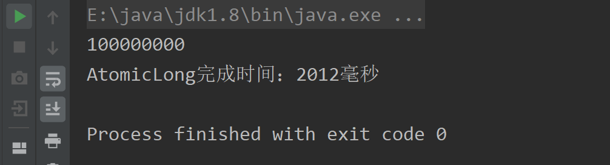

#### (2) LongAdder，20个线程并发，每个线程执行10000次

```java
public class LongAdderDemo {
    //主函数
    public static void main(String[] args) throws InterruptedException {
        LongAdder counter = new LongAdder();

        //新建线程池
        ExecutorService pool = Executors.newFixedThreadPool(20);
        long startTime = System.currentTimeMillis();
        //任务次数
        for (int i = 0; i < 10000; i++) {
            pool.submit(new Task(counter));
        }
        //关闭线程池
        pool.shutdown();
        while (!pool.isTerminated()){
        }
        long endTime = System.currentTimeMillis();
        System.out.println(counter.sum());
        System.out.println("LongAdder完成时间："+(endTime-startTime)+"毫秒");
    }

    //任务内部类
    public static class Task implements Runnable{
        private LongAdder count;

        public Task(LongAdder count) {
            this.count = count;
        }

        @Override
        public void run() {
            for (int i = 0; i < 10000; i++) {
                count.increment();//自增
            }
        }
    }

}

```

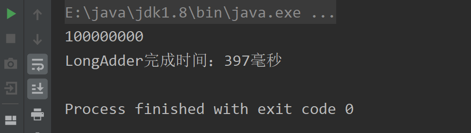
通过两个代码的耗时对比，可以得出结论：在多线程的情况下，LongAdder比AtomicLong的性能更好

### 3. LongAdder 高并发性能好的原因

#### （1）**AtomicLong**

AtomicLong每次执行加法，都需要flush和refresh，导致消耗资源更多。
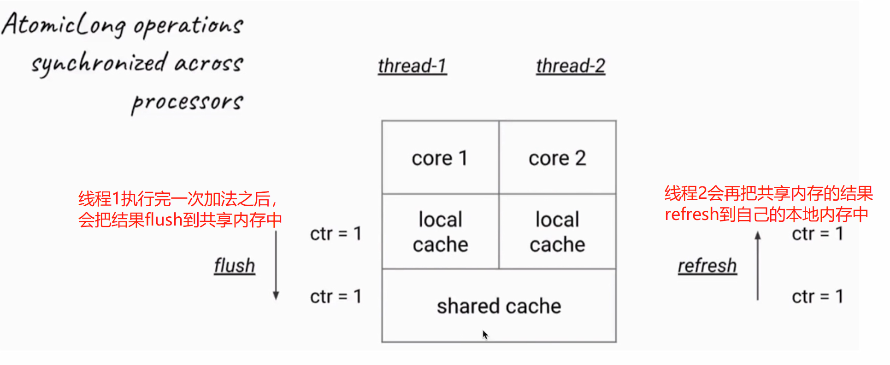

#### （2）**LongAdder**

LongAdder中，每个线程他自己有`独立的计数器`，只有在执行 `sum()`方法时才会将各个线程德计数器汇总
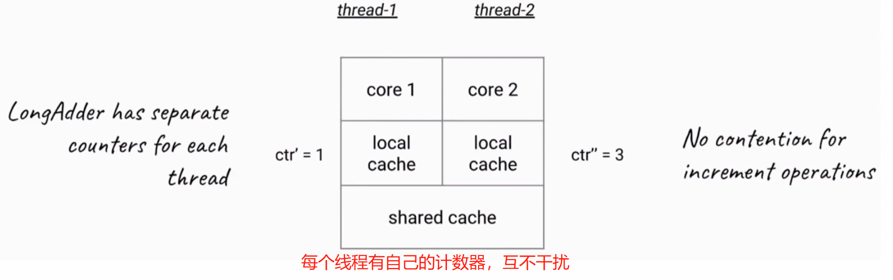

LongAdder引入了分段累加的概念，内部有一个base变量和一个Cell[] 数组共同参与计数:

- base变量：在竞争不激烈的时候，加法运算会直接累加到该变量上
- Cel[]数组：在竞争激烈的时候，LongAdder内部的 `Cell[]`数组就会派上用场，各个线程都会有一个对应的`Cell[i]`,计数的结果会存到各自的`Cell[i]`中.
- 在执行`sum`方法时，会将 base变量和 Cel[]数组中的结果都汇总。
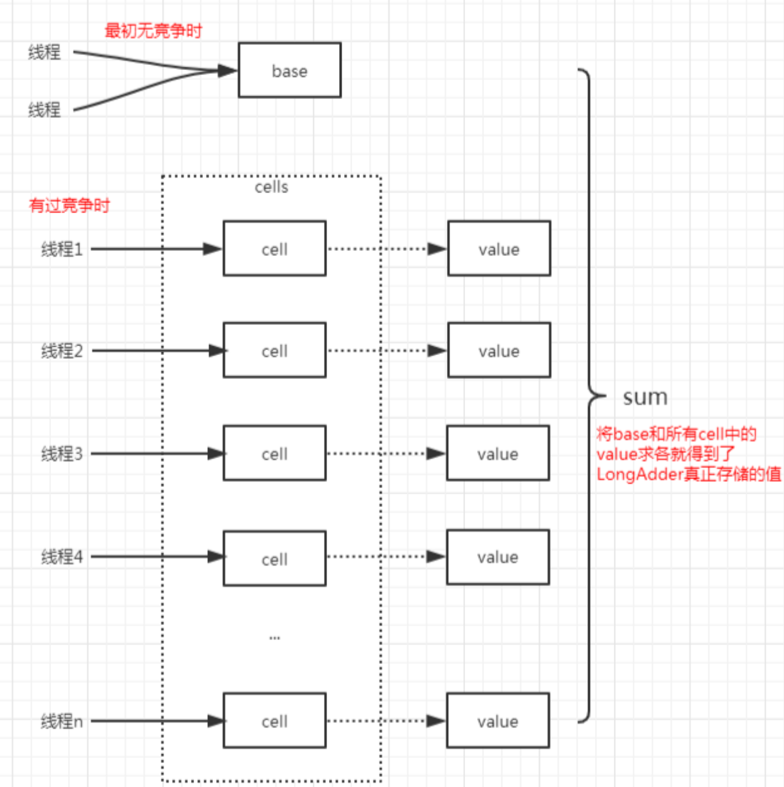

**sum() 源码如下**

```java
    /**
     * Returns the current sum.  The returned value is <em>NOT</em> an
     * atomic snapshot; invocation in the absence of concurrent
     * updates returns an accurate result, but concurrent updates that
     * occur while the sum is being calculated might not be
     * incorporated.
     *
     * @return the sum
     */
    public long sum() {
        Cell[] as = cells; Cell a;
        long sum = base;
        if (as != null) {
            for (int i = 0; i < as.length; ++i) {
                if ((a = as[i]) != null)
                    sum += a.value;
            }
        }
        return sum;
    }
```

上面源码中会判断，如果as变量不为null 也就是cell[]数组中有值，就会对`Cell[]`和`base`一起相加后返回最后的结果

> 上面的源码看出，这个方法没有加锁，也就是说如果之前已经汇总了的数组元素发生了变动，他就不会实时的反映在最终返回的sum总和中，也就是说`返回的sum结果可能不是最新的值`

#### （3）AtomicLong & LongAdder对比

LongAdder的特点：

- 消耗更多的空间；
- 在高并发的情况下性能更好；
- 适用于统计求和计数场景；
- 类方法相对较少

在低争用下，AtomicLong和LongAdder这两个类的性能差不多。但是在竞争激烈的情况下，LongAdder的预期吞吐量要高得多，但要消耗更多的空间；

LongAdder适合的场景是统计求和计数的场景，而且LongAdder基本只提供了加法，而AtomicLong还具有 [CAS](https://mp.weixin.qq.com/s?__biz=MzU3NDgyMTIxMw==&mid=2247484848&idx=1&sn=2af8f0a333f8f87c053fc7c5e067ce24&chksm=fd2dc382ca5a4a943f3869625f06af461d97cd7613ea4bb39867a40c4fee0e68557a32c6a3c6#rd) 方法

## 四. Accumulator累加器

Accumulator 和 Adder 非常相似，实际上 Accumulator 就是一个更通用版本的 Adder，比如 LongAccumulator 是 LongAdder 的功能增强版，因为 LongAdder 的 API 只有对数值的加减，而 LongAccumulator 提供了自定义的函数操作。

### 1. 基本用法演示

```java
public class LongAccumulatorDemo {
    public static void main(String[] args) {
        //参数1：表达式
        //参数2：初始值，对X的第一次定义
        //最开始会将初始值赋给X ，y就是之前的结果；类似于 数学归纳法
        LongAccumulator accumulator = new LongAccumulator((x, y) -> x + y, 100); // 这里的 100 就是初始值
        accumulator.accumulate(1);//此时，x=1，y=100，结果为101
        accumulator.accumulate(2);//此时，x=2，y=101，结果为103
        System.out.println(accumulator.getThenReset());
    }
}
```
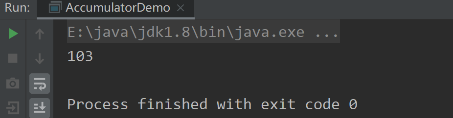

### 2. 灵活使用

自定义表达式： _求1加到9中最大的数_

```java
public class LongAccumulatorDemo {
    public static void main(String[] args) {
        //求1加到9中最大的数
        LongAccumulator accumulator = new LongAccumulator((x, y) -> Math.max(x,y), 0);
        ExecutorService pool = Executors.newFixedThreadPool(10);

        //从1加到9
        IntStream.range(1,10).forEach(i->pool.submit(()->accumulator.accumulate(i)));
        pool.shutdown();

        while (!pool.isTerminated()){ }
        System.out.println(accumulator.getThenReset());
    }
}

```
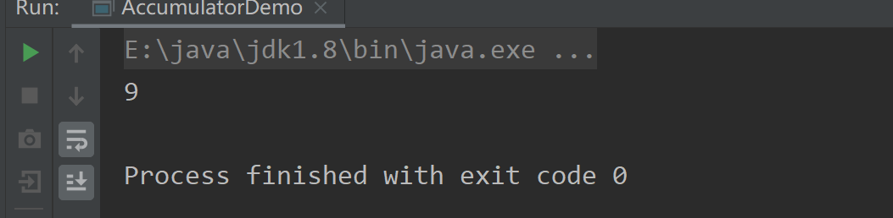

### 3. **使用场景**：

并行计算，且不要求计算有顺序，也就是即使执行顺序不同，结果依然一样的情况。比如以下场景：

- 相加
- 相乘
- 最大值、最小值

