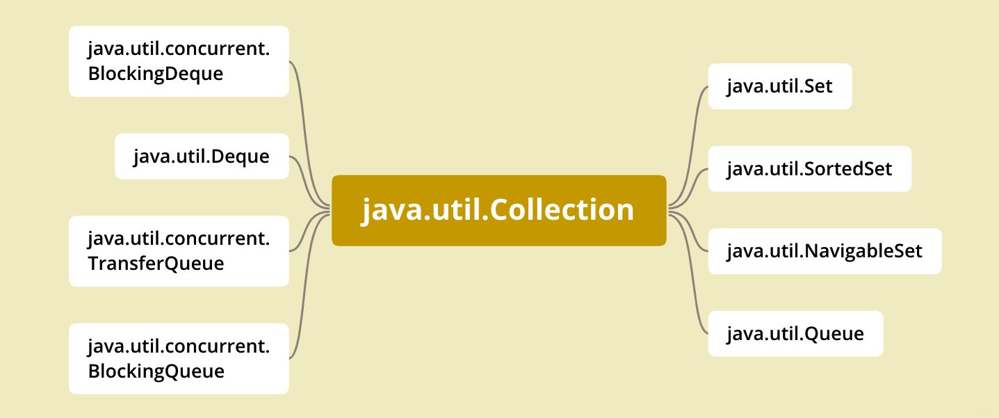
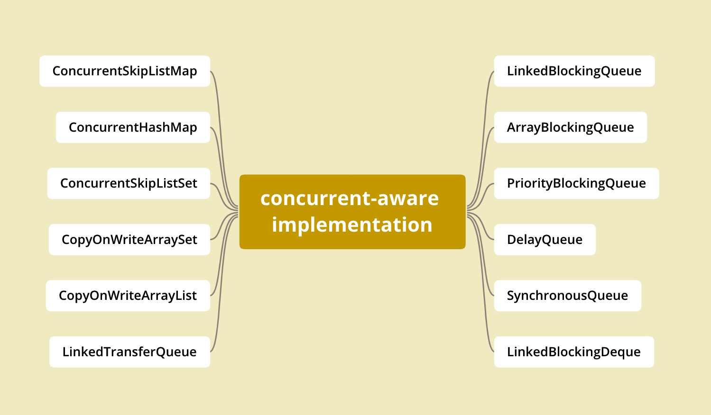
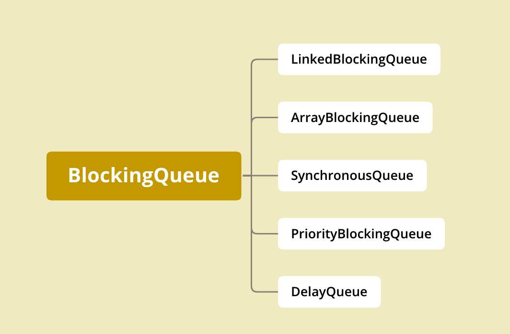
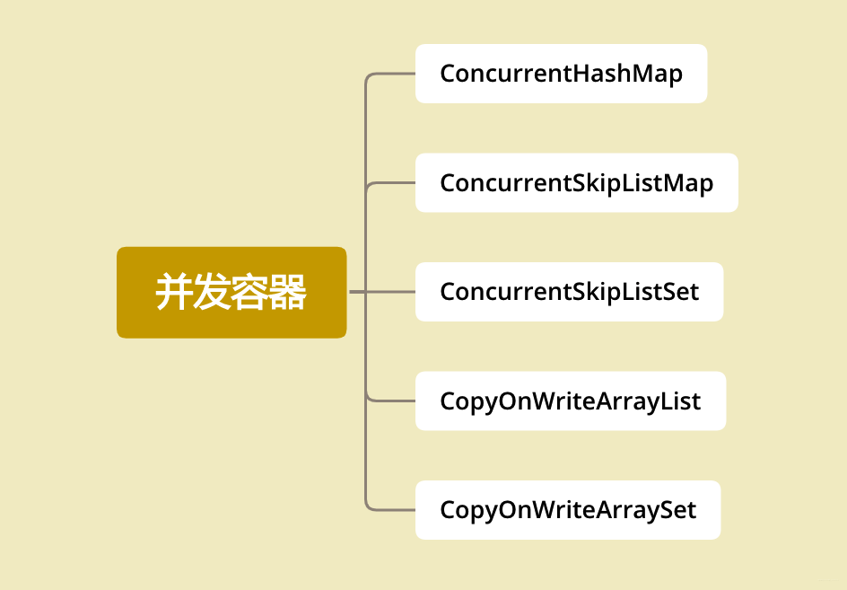
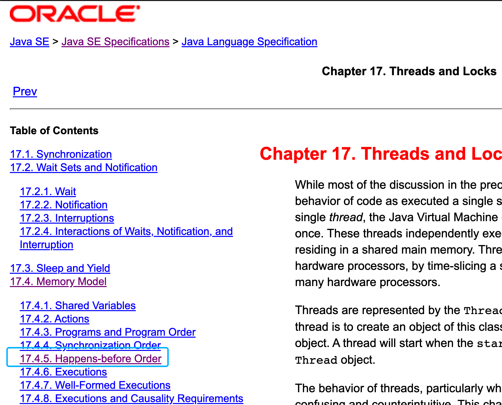
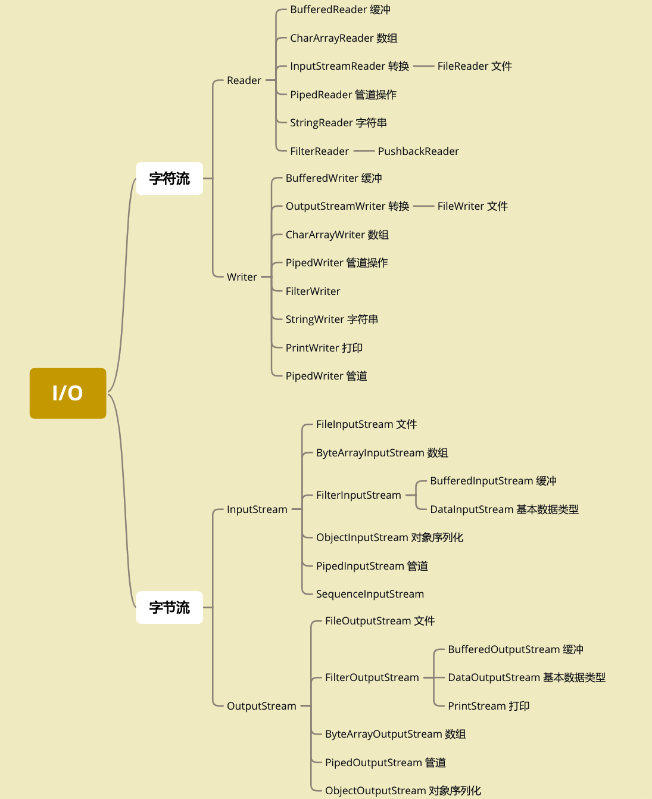

在研读 JDK 源码之前，先了解 JDK 几个核心包的设计思想，将有助于我们理解当初的设计者们的意图，让我们更能体会到设计者的良苦用心。

## 1 java.lang 语言包

提供利用 Java 编程语言进行程序设计的基础类。最重要的类是 Object（类层次结构的根）和 Class（其实例表示正在运行的应用程序中的类）。

把基本类型的值当成一个对象来表示通常很有必要。包装器类 Boolean、Character、Integer、Long、Float 和 Double 就是用于这个目的。例如，一个 Double 类型的对象包含了一个类型为 double 的字段，这表示如果引用某个值，则可以将该值存储在引用类型的变量中。这些类还提供了大量用于转换基值的方法，并支持一些标准方法，比如 equals 和 hashCode。Void 类是一个非实例化的类，它保持一个对表示基本类型 void 的 Class 对象的引用。

类 Math 提供了常用的数学函数，比如正弦、余弦和平方根。类似地，类 String 和 StringBuffer 提供了常用的字符串操作。

类 ClassLoader、Process、Runtime、SecurityManager 和 System 提供了管理类的动态加载、外部进程创建、主机环境查询（比如时间）和安全策略实施等“系统操作”。

类 Throwable 包含了可能由 throw 语句抛出的对象。Throwable 的子类表示错误和异常。

**字符编码**

java.nio.charset.Charset 类的规范描述了字符编码的命名约定，以及每个 Java 平台实现必须支持的标准编码集。

## 2 java.util

**简介**

包含 collection 框架、遗留的 collection 类、事件模型、日期和时间工具、国际化和各种实用的工具类（字符串标记生成器、随机数生成器和位数组）。

限于篇幅和重要性，我们这里只讨论最常用的 collection 容器类库的设计规划。

Java平台包括一个集合框架。集合是代表一组对象的对象（例如经典的Vector类）。集合框架是用于表示和操作集合的统一体系结构，使集合可以独立于实现细节进行操作。

集合框架的主要优点是：

* 通过提供数据结构和算法来减少编程工作，因此不必自己实现它们
* 通过提供数据结构和算法的高性能实现来提高性能。因为每个接口的各种实现都是可互换的，所以可以通过切换实现来调整程序
* 通过建立公共语言来回传递集合，从而在不相关的API之间提供互操作性
* 通过要求您学习多个临时集合API，减少了学习API所需的工作量
* 通过不需要生成临时集合API，减少了设计和实现API所需的工作量
* 通过为集合和用于操作集合的算法提供标准接口，促进软件重用

集合框架包括：

* Collection接口。表示不同类型的集合，例如set，list和map。这些接口构成了框架的基础
* 通用实现。集合接口的主要实现
* 旧版实现。改造了早期版本的Vector和Hashtable的收集类，以实现集合接口
* 特殊用途的实现。设计用于特殊情况的实现。这些实现显示非标准的性能特征，使用限制或行为
* 并发实现。专为高度并发使用而设计的实现，下一节具体描述
* 包装器实现。向其他实现中添加功能，例如同步
* 便利的实现。集合接口的高性能“微型实现”
* 抽象实现。集合接口的部分实现可简化自定义实现
* 算法。对集合执行有用功能的静态方法，例如对列表进行排序
* 基础设施。为集合接口提供基本支持的接口
* 数组实用程序。原始类型和引用对象数组的实用程序函数。严格来讲，它不是集合框架的一部分，而是与集合框架同时添加到Java平台，并且依赖于某些相同的基础结构。

**集合接口**

分为两组。最基本的接口java.util.Collection具有以下子类或接口：

其他集合接口基于java.util.Map，而不是真实的集合。但是，这些接口包含集合视图操作，使它们可以作为集合进行操作。map具有以下子类：

集合接口中的许多修改方法都标记为可选。允许实现不执行这些操作中的一项或多项，如果尝试执行，则会抛出运行时异常（UnsupportedOperationException）。每个实现的文档必须指定支持哪些可选操作。引入了一些术语以帮助该规范：

* 不支持修改操作（例如添加，删除和清除）的集合称为unmodifiable。非不可修改的集合是modifiable
* 另外保证不可见Collection对象中的任何更改的集合称为immutable。非不可更改的集合是mutable
* 即使元素可以更改，也要保证其大小保持不变的列表称为 fixed-size。非固定大小的列表称为variable-size。
* 支持快速（通常为固定时间）索引元素访问的列表称为random access列表。不支持快速索引元素访问的列表称为sequential access列表。 RandomAccess标记接口使列表能够公布它们支持随机访问的事实。这使得通用算法在应用于随机或顺序访问列表时，可以更改其行为以提供良好的性能。
一些实现限制了可以存储哪些元素（或在Maps中，键和值）。可能的限制包括要求元素：

* 属于特定类型
* 不为空
* 服从一些任意谓词
尝试添加违反实现限制的元素会导致运行时异常，通常是ClassCastException，IllegalArgumentException或NullPointerException。尝试删除或测试是否存在违反实现限制的元素会导致异常。一些受限制的集合允许这种用法。

**集合实现**

实现collection接口的类通常以Implementation-style Interface的形式来命名。下表总结了通用实现：

通用实现支持集合接口中的所有可选操作，并且对它们可能包含的元素没有限制。它们是不同步的，但是Collections类包含称为同步包装器的静态工厂，可用于将同步添加到许多未同步的集合中。所有新的实现都有fail-fast迭代器，该迭代器检测无效的并发修改，并且快速而干净地失败（而不是行为异常）。

AbstractCollection，AbstractSet，AbstractList，AbstractSequentialList和AbstractMap类提供了核心集合接口的基本实现，以最大程度地减少实现它们所需的工作量。这些类的API文档精确地描述了每种方法的实现方式，因此，在特定实现的基本操作得以执行的情况下，实现者知道必须重写哪些方法。

**并发容器**

使用来自多个线程的集合的应用程序必须经过仔细地编程。通常，这称为并发编程。 Java平台包括对并发编程的广泛支持。

集合是如此频繁地使用，以至于各种并发友好接口和集合的实现都包含在API中。这些类型超出了前面讨论的同步包装程序的范围，可提供并发编程中经常需要的功能。

这些并发感知接口可用：

可以使用以下并发感知实现类。

**设计目标**

主要设计目标是生产一种尺寸更小且更重要的是“概念重量”的API。至关重要的是，新功能与当前的Java程序员似乎并没有太大区别。它必须增加现有设施，而不是更换它们。同时，新的API必须足够强大才能提供先前描述的所有优点。

为了使核心接口的数量保持较小，接口不会尝试捕获诸如可变性，可修改性和可缩放性之类的细微差别。相反，核心接口中的某些调用是可选的，从而使实现可以引发UnsupportedOperationException来指示它们不支持指定的可选操作。集合实现者必须清楚地记录实现支持哪些可选操作。

为了使每个核心接口中的方法数量保持较小，接口仅在满足以下任一条件时才包含方法：

* 这是真正的基本操作：可以合理定义其他基本操作的基本操作
* 有一个令人信服的性能原因，为什么重要的实现要覆盖它

至关重要的是，所有合理的馆藏表现形式必须能够良好地互操作。这包括数组，如果不更改语言就不能直接实现Collection接口。因此，该框架包括以下方法：使集合能够移动到数组中，将数组视为集合，将map视为集合。

## 3 java.util.concurrent

从JDK1.5版本开始提供：在并发编程中很常用的实用工具类。该包涵盖几个小的、已标准化的可扩展框架，以及一些提供有用功能的类，没有这些类，这些功能会很难实现或实现起来冗长乏味。

下面简要描述主要的组件。

### 3.1 执行器（Executors）

**接口**

Executor 是一个简单的标准化接口，用于定义类似于线程的自定义子系统，包括线程池、异步 IO 和轻量级任务框架。

根据所使用的具体 Executor 类的不同，任务们可能在新创建的线程中、已有的任务执行线程中或者调用 execute() 的线程中执行，并且可能顺序或并发执行。

* ExecutorService 提供了多个完整的异步任务执行框架。

ExecutorService 管理任务的排队和安排，并允许受控的关闭。ScheduledExecutorService 子接口及相关的接口添加了对延迟的和定期任务执行的支持。ExecutorService 提供了安排异步执行的方法，可执行由 Callable 表示的任何函数，结果类似于 Runnable。

Future 返回函数的结果，允许确定执行是否完成，并提供取消任务执行的方法。

RunnableFuture 是拥有 run 方法的 Future，run 方法执行时将设置其结果。

**实现**

类 ThreadPoolExecutor 和 ScheduledThreadPoolExecutor 提供可调的、灵活的线程池。Executors 类提供大多数 Executor 的常见类型和配置的工厂方法，以及使用它们的几种实用工具方法。其他基于 Executor 的实用工具包括具体实现类 FutureTask，它提供了 Future 的常见可扩展实现，以及 ExecutorCompletionService 有助于协调对异步任务组的处理。

ForkJoinPool类提供了一个Executor，主要用于处理ForkJoinTask及其子类的实例。这些类使用工作窃取调度程序，该任务调度程序可满足符合计算密集型并行处理中经常存在的限制的任务的高吞吐量。

### 3.2 队列

ConcurrentLinkedQueue 类提供了高效的、可伸缩的、线程安全的非阻塞 FIFO 队列。ConcurrentLinkedDeque类与此类似，但是还支持Deque接口。

java.util.concurrent 包中的五个实现都支持扩展的 BlockingQueue 接口。该接口定义了 put 和 take 的阻塞版本：

这些不同的类覆盖了生产者-消费者、消息传递、任务并行执行和相关并发设计的大多数常见模型的上下文。

扩展接口TransferQueue及其实现LinkedTransferQueue引入了同步的传输方法（以及相关功能），生产者可以选择阻塞等待其消费者。

BlockingDeque 接口继承了 BlockingQueue，以支持 FIFO 和 LIFO（基于栈）操作。LinkedBlockingDeque 类就提供了这样一个实现。

### 3.3 超时

TimeUnit 类为指定和控制基于超时的操作提供了多层粒度（包括纳秒级）。该包中的大多数类除了包含不确定的等待之外，都包含了基于超时机制的操作。

在使用超时的所有场景中，超时规定了在表明已超时前，该方法应等待的最少时间。超时后，实现类们会“尽力”检测超时。当然了，在检测到超时和超时后再次真正地执行线程之间可能还要经过一段不确定的时间。接受超时期参数的所有方法将小于等于 0 的值视为根本不会等待。要“永远”等待，可以使用 Long.MAX_VALUE 值。

### 3.4 同步器

五个类可辅助实现常见的专用同步语法。

* Semaphore 是一个经典的并发工具
* CountDownLatch 是一个非常简单但又常用的工具，在持有给定数目的信号、事件或条件前一直阻塞
* CyclicBarrier 是一个可重置的多路同步点，在某些并行编程风格中很有用
* Phaser 提供了更灵活的屏障形式，可用于控制多个线程之间的分阶段计算。
* Exchanger 允许两个线程在一个会合点交换对象，它在多流水线设计中是有用的

### 3.5 并发容器

除队列外，此包还提供了设计用于多线程上下文中的容器实现：

当期望许多线程访问同一个给定容器时，ConcurrentHashMap 通常优于同步的 HashMap，ConcurrentSkipListMap 通常优于同步的 TreeMap。当期望的读请求数和遍历请求远大于对list的更新时，CopyOnWriteArrayList 优于同步的 ArrayList。

此包中与某些类一起使用的 “Concurrent” 前缀是一种速记，暗示着与类似的“同步化”的类有所不同。例如Hashtable 和 Collections.synchronizedMap(new HashMap()) 是同步化的，但 ConcurrentHashMap 则是“并发的（Concurrent）”。并发容器是线程安全的，但不受单个独占锁的管理。在 ConcurrentHashMap 这一特定场景下，它可以安全地允许任意次数的并发读，以及数目可调的并发写。适用场景如下：

* 需要通过单个锁防止对容器的所有访问时，“同步”类是很有用的，其代价是较差的可伸缩性
* 在期望多线程访问公共的容器的其他情况中，通常“concurrent”版本要更好
* 当容器是未共享的，或者仅持有其他锁时容器才可访问时，非同步的普通容器则要更好。

大多数并发容器的实现（包括大多数队列）与常规的 java.util 包中的约定也不同，因为它们的迭代器Iterators和Spliterators提供了弱一致的，而不是fast-fail的遍历：

* 他们可能会与其他操作并发进行
* 他们永远不会抛ConcurrentModificationException
* 它们被保证可以遍历在构造时就已经存在的元素恰好一次，并且可以（但不保证）反映出构造后的任何修改。

### 3.6 内存一致性属性

* Java语言规范的第 17 章定义了内存操作（例如对共享变量的读写）的 happens-before （先行发生，以下简称 HB）关系

只有写操作HB读操作时，才保证一个线程写结果对另一个线程的读是可见的。synchronized 和 volatile 构造以及Thread.start() 和 Thread.join() 方法可以形成HB关系。尤其是：

* 线程中，按照程序的顺序，前面的操作先行发生于后面的操作
* 监视器锁上的解锁（退出 synchronized 块或方法）HB同一监视器锁上后续（时间概念上的）的加锁（进入synchronized 块或方法）。并且因为 happen-before 关系是可传递的，所以解锁之前的线程的所有操作 happen-before 加锁后的所有操作
* 对某volatile字段的写操作HB每个后续（时间上的先后）对相同字段的读。volatile 字段的读写与进入和退出监视器具有相似的内存一致性效果，但并不需要互斥锁
* 在线程对象上调用start()方法HB该启动了的线程中的任意动作
* 线程中的所有操作HB从该线程上的 join 成功返回的任何其他线程

java.util.concurrent 中所有类的方法及其子包扩展了这些对更高级别同步的保证。尤其是：

* 线程中将一个对象放入任何并发容器之前的操作 HB 从另一线程中的容器访问或移除该元素的后续操作
* 线程中向 Executor 提交 Runnable 之前的操作 HB 其执行开始。同样适用于向 ExecutorService 提交 Callables
* 异步计算（由 Future 接口表示）所采取的操作  HB 通过另一线程中 Future.get() 获取结果的后续的操作
* “释放”同步储存方法（如 Lock.unlock、Semaphore.release 和 CountDownLatch.countDown）之前的操作 happen-before 另一线程中相同同步储存对象成功“获取”方法（如 Lock.lock、Semaphore.acquire、Condition.await 和 CountDownLatch.await）的后续操作。
* 对于通过 Exchanger 成功交换对象的每个线程对，每个线程中 exchange() 之前的操作 HB 另一线程中对应 exchange() 后续的操作。

## 4 java.util.concurrent.locks

该包的接口和类提供了用于锁和等待条件的框架，这些条件不同于内置的同步和监视器。该框架允许使用锁和条件来实现更大的灵活性，但以更复杂的语法为代价。

Lock 接口支持那些语义不同（重入、公平等）的锁规则，可以在非阻塞式结构的上下文（包括 hand-over-hand 和锁重排算法）中使用这些规则。主要的实现为 ReentrantLock。

ReadWriteLock 接口以类似方式定义了一些读线程可以共享而写线程独占的锁。此包只提供了一个实现，即 ReentrantReadWriteLock，因为它适用于大部分的标准用法上下文。但程序员可以创建自己的、适用于非标准要求的实现。

Condition 接口描述了可能会与锁有关联的条件变量。这些变量在用法上与使用 Object.wait 访问的隐式监视器类似，但提供了更强大的功能。需要特别指出的是，一个 Lock 可能与多个 Condition 对象关联。为了避免兼容性问题，Condition 方法的名称与对应的 Object 版本中的不同。

AbstractQueuedSynchronizer 类是一个非常有用的超类，可用来定义锁以及依赖于排队阻塞线程的其他同步器。 AbstractQueuedLongSynchronizer 类提供相同的功能但扩展了对同步状态的 64 位的支持。两者都扩展了类 AbstractOwnableSynchronizer（一个帮助记录当前保持独占同步的线程的简单类）。LockSupport 类提供了更低级别的阻塞和解除阻塞支持，这对那些实现自己的定制锁的开发人员很有用。

## 5 java.io

通过数据流、序列化和文件系统提供系统输入和输出，Java.io 包几乎包含了所有操作输入、输出需要的类。所有这些流类代表了输入的数据源和输出的目标对象。

除非另有说明，否则向此包的任何类或接口中的构造方法或方法传递 null 参数时，都将抛出 NullPointerException。

流可以理解为数据的序列：

* 输入流，从一个源读数据
* 输出流，向一个目标写数据
流支持很多种格式，比如：基本类型、对象、数组等。下图展示了该包的内容从数据源、操作目标等角度可大致分类如下：

