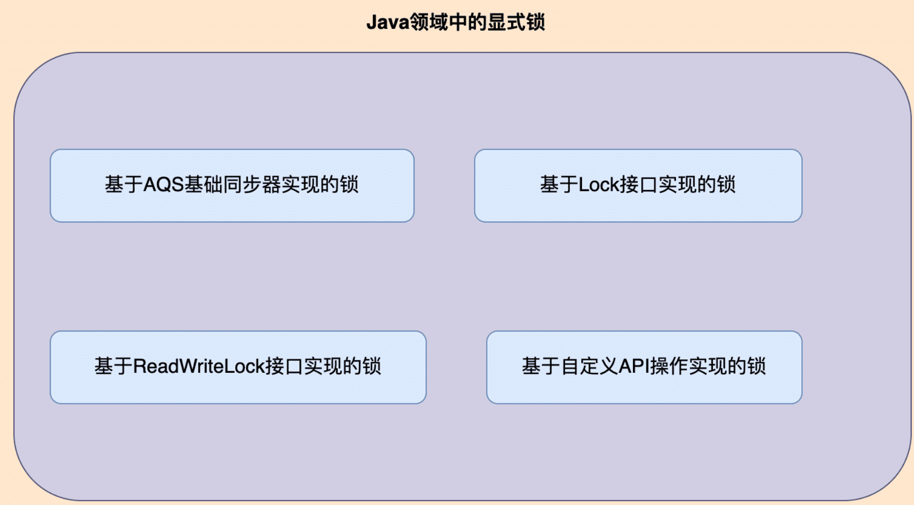
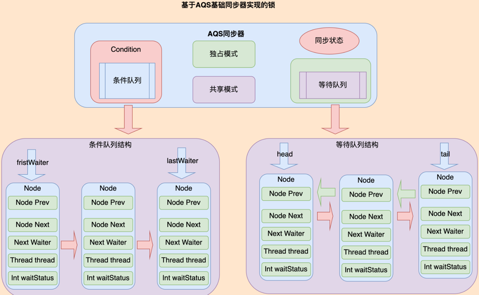
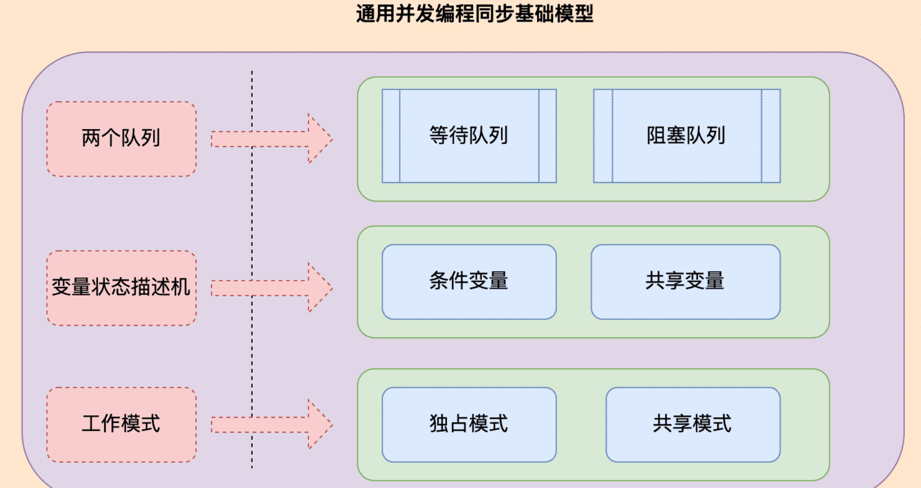
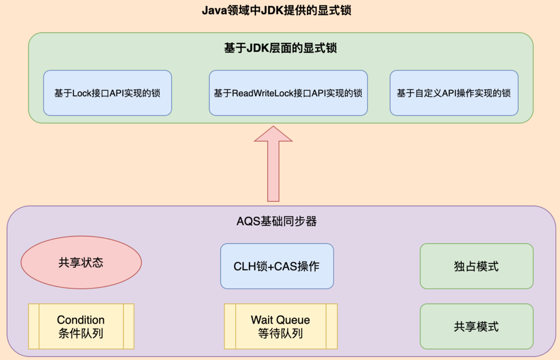
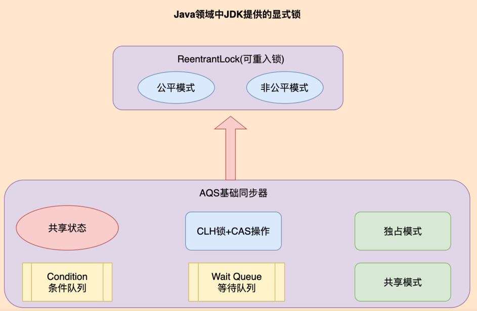
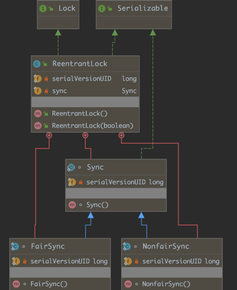
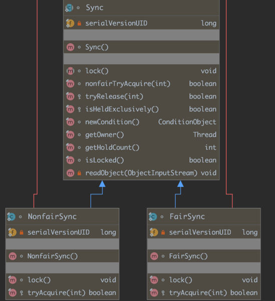
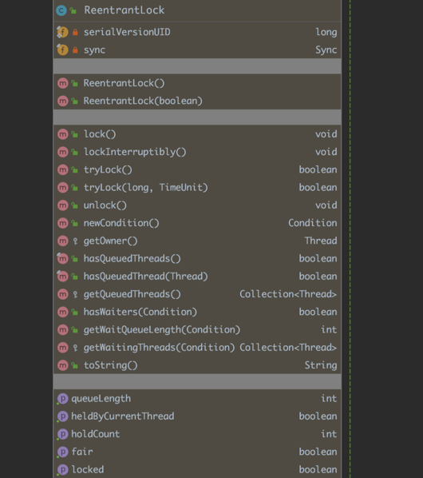

## 一、开头

在并发编程领域，有两大核心问题：一个是互斥，即同一时刻只允许一个线程访问共享资源；另一个是同步，即线程之间如何通信、协作。
主要原因是，对于多线程实现实现并发，一直以来，多线程都存在2个问题：

* 线程之间内存共享，需要通过加锁进行控制，但是加锁会导致性能下降，同时复杂的加锁机制也会增加编程编码难度
* 过多线程造成线程之间的上下文切换，导致效率低下

因此，在并发编程领域中，一直有一个很重要的设计原则： “ 不要通过内存共享来实现通信，而应该通过通信来实现内存共享。”
简单来说，就是尽可能通过消息通信，而不是内存共享来实现进程或者线程之间的同步。

## 二、关健术语

本文用到的一些关键词语以及常用术语，主要如下：

* 并发(Concurrent): 在操作系统中，是指一个时间段中有几个程序都处于已启动运行到运行完毕之间，且这几个程序都是在同一个处理机上运行。
* 并行(Parallel): 当系统有一个以上CPU时，当一个CPU执行一个进程时，另一个CPU可以执行另一个进程，两个进程互不抢占CPU资源，可以同时进行。
* 信号量(Semaphore):  是在多线程环境下使用的一种设施，是可以用来保证两个或多个关键代码段不被并发调用，也是作系统用来解决并发中的互斥和同步问题的一种方法。
* 信号量机制(Semaphores)： 用来解决同步/互斥的问题的，它是1965年,荷兰学者 Dijkstra提出了一种卓有成效的实现进程互斥与同步的方法。
* 管程(Monitor) :  一般是指管理共享变量以及对共享变量的操作过程，让它们支持并发的一种机制。
* 互斥(Mutual Exclusion)：一个公共资源同一时刻只能被一个进程或线程使用，多个进程或线程不能同时使用公共资源。即就是同一时刻只允许一个线程访问共享资源的问题。
* 同步(Synchronization)：两个或两个以上的进程或线程在运行过程中协同步调，按预定的先后次序运行。即就是线程之间如何通信、协作的问题。
* 对象池(Object Pool): 指的是一次性创建出 N 个对象，之后所有的线程重复利用这 N 个对象，当然对象在被释放前，也是不允许其他线程使用的, 一般指保存实例对象的容器。

## 三、基本概述

在Java领域中，我们可以将锁大致分为基于Java语法层面(关键词)实现的锁和基于JDK层面实现的锁。

在Java领域中, 尤其是在并发编程领域，对于多线程并发执行一直有两大核心问题：同步和互斥。其中：

* 互斥(Mutual Exclusion)：一个公共资源同一时刻只能被一个进程或线程使用，多个进程或线程不能同时使用公共资源。即就是同一时刻只允许一个线程访问共享资源的问题。
* 同步(Synchronization)：两个或两个以上的进程或线程在运行过程中协同步调，按预定的先后次序运行。即就是线程之间如何通信、协作的问题。
针对对于这两大核心问题，利用管程是能够解决和实现的，因此可以说，管程是并发编程的万能钥匙。
虽然，Java在基于语法层面(synchronized 关键字)实现了对管程技术,但是从使用方式和性能上来说，内置锁(synchronized 关键字)的粒度相对过大，不支持超时和中断等问题。
为了弥补这些问题，从JDK层面对其“重复造轮子”，在JDK内部对其重新设计和定义，甚至实现了新的特性。
在Java领域中，从JDK源码分析来看，基于JDK层面实现的锁大致主要可以分为以下4种方式：



* 基于Lock接口实现的锁：JDK1.5版本提供的ReentrantLock类
* 基于ReadWriteLock接口实现的锁：JDK1.5版本提供的ReentrantReadWriteLock类
* 基于AQS基础同步器实现的锁：JDK1.5版本提供的并发相关的同步器Semaphore，CyclicBarrier以及CountDownLatch等�
* 基于自定义API操作实现的锁：JDK1.8版本中提供的StampedLock类
从阅读源码不难发现，在Java SDK 并发包主要通过AbstractQueuedSynchronizer(AQS)实现多线程同步机制的封装与定义，而通过Lock 和 Condition 两个接口来实现管程，其中 Lock 用于解决互斥问题，Condition 用于解决同步问题。

### 1.AQS基础同步器基本理论

在Java领域中,同步器是专门为多线程并发设计的同步机制，主要是多线程并发执行时线程之间通过某种共享状态来实现同步，只有当状态满足这种条件时线程才往下执行的一种同步机制。



一个标准的AQS同步器主要有同步状态机制，等待队列，条件队列，独占模式，共享模式等五大核心要素组成。
在Java领域中，JDK的JUC(java.util.concurrent.)包中提供了各种并发工具，但是大部分同步工具的实现基于AbstractQueuedSynchronizer类实现，其内部结构主要如下：

* 同步状态机制(Synchronization Status)：主要用于实现锁(Lock)机制，是指同步状态，其要求对于状态的更新必须原子性的
* 等待队列(Wait Queue)：主要用于存放等待线程获取到的锁资源，并且把线程维护到一个Node(节点)里面和维护一个非阻塞的CHL Node FIFO(先进先出)队列，主要是采用自旋锁+CAS操作来保证节点插入和移除的原子性操作。
* 条件队列(Condition Queue)：用于实现锁的条件机制，一般主要是指替换“等待-通知”工作机制，主要是通过ConditionObject对象实现Condition接口提供的方法实现。
* 独占模式(Exclusive Mode)：主要用于实现独占锁，主要是基于静态内部类Node的常量标志EXCLUSIVE来标识该节点是独占模式
* 共享模式(Shared Mode)：主要用于实现共享锁，主要是基于静态内部类Node的常量标志SHARED来标识该节点是共享模式
我们可以得到一个比较通用的并发同步工具基础模型，大致包含如下几个内容，其中：


* 条件变量(Conditional Variable)： 利用线程间共享的变量进行同步的一种工作机制
* 共享变量((Shared Variable))：一般指对象实体对象的成员变量和属性
* 阻塞队列(Blocking Queue)：共享变量(Shared Variable)及其对共享变量的操作统一封装
* 等待队列(Wait Queue)：每个条件变量都对应有一个等待队列(Wait Queue),内部需要实现入队操作(Enqueue)和出队操作(Dequeue)方法
* 变量状态描述机(Synchronization Status)：描述条件变量和共享变量之间状态变化，又可以称其为同步状态
* 工作模式(Operation Mode)： 线程资源具有排他性，因此定义独占模式和共享模式两种工作模式
综上所述，条件变量和等待队列的作用是解决线程之间的同步问题；共享变量与阻塞队列的作用是解决线程之间的互斥问题。

### 2. JDK显式锁统一概念模型

在并发编程领域，有两大核心问题：一个是互斥，即同一时刻只允许一个线程访问共享资源；另一个是同步，即线程之间如何通信、协作。



综合Java领域中的并发锁的各种实现与应用分析来看，一把锁或者一种锁，基本上都会包含以下几个方面：

* 锁的同步器工作机制：主要是考虑共享模式还是独享模式，是否支持超时机制，以及是否支持超时机制？
* 锁的同步器工作模式：主要是基于AQS基础同步器封装内部同步器，是否考虑公平/非公平模式？
* 锁的状态变量机制： 主要锁的状态设置，是否共享状态变量？
* 锁的队列封装定义：主要是指等待队列和条件队列，是否需要条件队列或者等待队列定义？
* 锁的底层实现操作： 主要是指底层CL锁和CAS操作，是否需要考虑自旋锁或者CAS操作实例对象方法？
* 锁的组合实现新锁： 主要是基于独占锁和共享锁，是否考虑对应API自定义操作实现？
综上所述，大致可以根据上述这些方向，我们便可以清楚知道Java领域中各种锁实现的基本理论时和实现思想。

### 3.ReentrantLock(可重入锁)的设计与实现

在Java领域中，ReentrantLock(可重入锁)是针对于Java多线程并发控制中对一个线程可以多次对某个锁进行加锁操作，主要是基于内置的AQS基础抽象队列同步器实现的一种并发控制工具类。



一般来说，对于同一个线程是否可以重复占有同一个锁对象的角度来分，大致主要可以分为可重入锁与不可重入锁。其中：

* 可重入锁：一个线程可以多次抢占同一个锁，也就意味着能够支持一个线程对资源的重复加锁，或者说，一个线程可以多次进入同一个锁所同步的临界区代码块。
* 不可重入锁：一个线程只能抢占一次同一个锁，也就意味着在同一时刻只能有一个线程获取到锁，而其他获取锁的线程只能等待，只有拥有锁的线程释放了锁后，其他的线程才能够获取锁。

ReentrantLock是JDK中显式锁一个主要基于Lock接口API实现的基础实现类，拥有与内置锁(synchronized)相同的并发性和内存语义，同时提供了限时抢占、可中断抢占等一些高级锁特性。
除此之外，ReentrantLock基于内置的AQS基础抽象队列同步器实现，在线程参与锁资源竞争比较激烈的场景下，能表现出比内置锁较佳的性能。
而且，ReentrantLock是一种独占锁，在独占模式下只能逐一使用锁，也就是说，任意时刻最多只会有一个线程持有锁的控制权。

1. #### 设计思想



ReentrantLock类最早是在JDK1.5版本提供的，从设计思想上来看，主要包括同步器工作模式，获取锁方法，释放锁方法以及定义Condition队列方法等4个核心要素。其中：

* 实现Lock接口 ：主要基于Lock接口API实现对应方法，拥有与内置锁(synchronized)相同的并发性和内存语义，用于支持和解决解决互斥问题。
* 同步器工作模式：基于AQS基础抽象队列同步器封装内置实现一个静态的内置同步器抽象类，然后基于这个抽象类分别实现了公平同步器和非公平同步器，用来指定和描述同步器工作模式是公平模式还是非公平模式。
* 公平/非公平模式：主要描述的是多个线程在同时获取锁时是否按照先到先得的顺序获取锁，如果是则为公平模式，否则为非公平模式。
* 获取锁方法：主要定义了一个lock()方法来获取锁，表示假如锁已经被其他线程占有或持有，其当前获取锁的线程则进入等待状态。
* 释放锁方法：主要定义了一个unlock()方法来释放锁，表示假如锁已经被其他线程放弃或释放，其当前获取锁的线程则获得该锁。
* 定义Condition队列操作方法： 主要是基于Condition接口来定义一个方法实现锁的条件机制，用于支持线程的阻塞和唤醒功能即就是解决同步问题，也就是我们说的线程间的通信方式。
* 定义等待队列操作方法： 主要是依据条件队列来时进行对应的操作，间接适配AQS基础同步器中对于等待队列的功能，保证获取锁的顺序的公平性
2. #### 基本实现



在ReentrantLock类的JDK1.8版本中，对于ReentrantLock的基本实现如下：

```java

public class ReentrantLock implements Lock, java.io.Serializable {

    private static final long serialVersionUID = 7373984872572414699 L;
 
    /**
     * ReentrantLock锁-定义支持同步器实现
     */
    private final Sync sync;
 
    /**
     * ReentrantLock锁-基于AQS定义支持同步器实现
     */
    abstract static class Sync extends AbstractQueuedSynchronizer {
        private static final long serialVersionUID = -5179523762034025860 L;
 
        /**
         * ReentrantLock锁-定义支持同步器Sync获取锁方法
         */
        abstract void lock();
				
        //......其他方法代码
    }
 
    /**
     * ReentrantLock锁-构造同步器默认工作模式(默认非公平模式)
     */
    public ReentrantLock() {
        sync = new NonfairSync();
    }
 
    /**
     * ReentrantLock锁-构造同步器指定工作模式(可选公平/非公平模式)
     */
    public ReentrantLock(boolean fair) {
        sync = fair ? new FairSync() : new NonfairSync();
    }
 
    /**
     * ReentrantLock锁-获取锁(普通模式)
     */
    public void lock() {
        sync.lock();
    }
 
    /**
     * ReentrantLock锁-释放锁
     */
    public void unlock() {
        sync.release(1);
    }
 
    /**
     * ReentrantLock锁-创建锁的条件机制
     */
    public Condition newCondition() {
        return sync.newCondition();
    }
 
    //......其他方法代码
}
```


* 内部同步器：基于AQS基础同步器封装和定义了一个静态内部Sync抽象类，其中抽象了一个内置锁lock()方法
* 同步器工作模式：提供了 2个构造方法，其中无参数构造方法表示的是默认的工作模式，有参数构造方法主要依据参数来实现指定的工作模式
* 获取锁： 主要是提供了lock()方法，调用的静态内部Sync抽象类内置锁lock()方法，而本质上是AQS同步器中的acquire()方法
* 释放锁： 主要是提供了unlock()方法，而本质上是调用的AQS同步器中的release()方法
* 创建条件队列： 主要是基于Condition接口定义了newCondition() 方法，调用的静态内部Sync抽象类ewCondition()方法，而本质上是调用的AQS同步器中的ConditionObject中的newCondition()方法


**2.1 基于AQS同步器封装静态内部Sync抽象类**

```java
    abstract static class Sync extends AbstractQueuedSynchronizer {
        private static final long serialVersionUID = -5179523762034025860L;
 
        /**
         * ReentrantLock锁-内部同步器Sync的内置加锁方法
         */
        abstract void lock();
 
        /**
         * ReentrantLock锁-内部同步器Sync的非公平获取锁
         */
        final boolean nonfairTryAcquire(int acquires) {
            final Thread current = Thread.currentThread();
            int c = getState();
            if (c == 0) {
                if (compareAndSetState(0, acquires)) {
                    setExclusiveOwnerThread(current);
                    return true;
                }
            }
            else if (current == getExclusiveOwnerThread()) {
                int nextc = c + acquires;
                if (nextc < 0) // overflow
                    throw new Error("Maximum lock count exceeded");
                setState(nextc);
                return true;
            }
            return false;
        }
 
        /**
         * ReentrantLock锁-内部同步器Sync的尝试释放
         */
        protected final boolean tryRelease(int releases) {
            int c = getState() - releases;
            if (Thread.currentThread() != getExclusiveOwnerThread())
                throw new IllegalMonitorStateException();
            boolean free = false;
            if (c == 0) {
                free = true;
                setExclusiveOwnerThread(null);
            }
            setState(c);
            return free;
        }
 
 
        /**
         * ReentrantLock锁-内部同步器Sync的检查线程是否独占
         */
        protected final boolean isHeldExclusively() {
            // While we must in general read state before owner,
            // we don't need to do so to check if current thread is owner
            return getExclusiveOwnerThread() == Thread.currentThread();
        }
        /**
         * ReentrantLock锁-内部同步器Sync的条件机制
         */
        final ConditionObject newCondition() {
            return new ConditionObject();
        }
        /**
         * ReentrantLock锁-内部同步器Sync的判断锁持有者
         */
        final Thread getOwner() {
            return getState() == 0 ? null : getExclusiveOwnerThread();
        }
        /**
         * ReentrantLock锁-内部同步器Sync的独占状态
         */
        final int getHoldCount() {
            return isHeldExclusively() ? getState() : 0;
        }
        /**
         * ReentrantLock锁-内部同步器Sync的是否被锁
         */
        final boolean isLocked() {
            return getState() != 0;
        }
        /**
         * ReentrantLock锁-内部同步器Sync的流化处理对象
         */
        private void readObject(java.io.ObjectInputStream s)
            throws java.io.IOException, ClassNotFoundException {
            s.defaultReadObject();
            setState(0); // reset to unlocked state
        }
				
    }
```


* Sync类：FairSync公平同步器和NonfairSync非公平同步器的抽象父类。
* 校验isHeldExclusively()方法： ReentrantLock锁是属于独占模式，需要当前锁持有线程与当前线程是否一致
* nonfairTryAcquire()方法： 一般主要用于非公平模式获取锁，其核心是compareAndSetState方法和setExclusiveOwnerThread方法
* tryRelease()方法： 其公平/非公平模式都是通过ryRelease()来释放锁操作
* newCondition()方法： 基于AQS同步器的ConditionObject对象封装实现，提供给 ReentrantLock类使用
* 私有readObject()方法：对于输入的对象进行流化处理

特别需要注意的是，我们需要重点关注nonfairTryAcquire()方法和tryRelease()方法，其中：

* 获取非公平锁 nonfairTryAcquire()方法：主要是用于获取AQS的状态变量status，其默认取值范围是0和1，其中，0表示未被加锁，1表示已经被加锁
* 如果状态变量status=0，使用compareAndSetState方法进行CAS原子修改操作，把状态变量修改为1，并且通过setExclusiveOwnerThread设置当前线程为锁的持有线程
* 如果状态变量status=1，表示当前线程为锁的持有线程，正在进入锁重入操作，状态变量累加1，超过重入次数时，会抛出throw new Error(“Maximum lock count exceeded”)
* 释放锁tryRelease()方法：主要是检查当前线程是否为锁持有线程，随后AQS同步器状态变量减1，如果不是 throw new IllegalMonitorStateException()
* 如果状态变量status=0，表示锁已经释放成功，通过setExclusiveOwnerThread设置锁的持有线程为null，也就是置空锁的持有线程
* 如果状态变量status !=0,  需要状态变量递减1即可，直到锁已经释放成功

**2.2 基于Sync抽象类封装FairSync公平同步器**
```java
    static final class FairSync extends Sync {
        private static final long serialVersionUID = -3000897897090466540L;
 
        /**
         * ReentrantLock锁-公平模式-获取锁
         */
        final void lock() {
            acquire(1);
        }
 
        /**
         * ReentrantLock锁-公平模式-尝试获取锁
         */
        protected final boolean tryAcquire(int acquires) {
            final Thread current = Thread.currentThread();
            int c = getState();
            if (c == 0) {
                if (!hasQueuedPredecessors() &&
                    compareAndSetState(0, acquires)) {
                    setExclusiveOwnerThread(current);
                    return true;
                }
            }
            else if (current == getExclusiveOwnerThread()) {
                int nextc = c + acquires;
                if (nextc < 0)
                    throw new Error("Maximum lock count exceeded");
                setState(nextc);
                return true;
            }
            return false;
        }
    }
```


* 实现方式： 主要基于AQS封装的内部静态抽象Sync同步类实现，使用的AQS的独占模式。
* 主要方法： 主要提供了lock()和tryAcquire()方法，其严格意义上来说，仅仅只是实现了tryAcquire()方法，但是最关键的使用hasQueuedPredecessors来保证了锁的公平性。
* 锁获取方式： 主要是采用完全通过队列来实现实现公平机制，即就是检查是否存在等待队列，如果队列之中已经存在其他线程，直接放弃操作。

**2.3 基于Sync抽象类封装NonfairSync非公平同步器**

```java
    static final class NonfairSync extends Sync {
        private static final long serialVersionUID = 7316153563782823691L;
 
        /**
         * ReentrantLock锁-非公平模式-获取锁
         */
        final void lock() {
            if (compareAndSetState(0, 1))
                setExclusiveOwnerThread(Thread.currentThread());
            else
                acquire(1);
        }
 
        /**
         * ReentrantLock锁-非公平模式-尝试获取锁
         */
        protected final boolean tryAcquire(int acquires) {
            return nonfairTryAcquire(acquires);
        }
    }

```

* 实现方式： 主要基于AQS封装的内部静态抽象Sync同步类实现，使用的AQS的独占模式。
* 主要方法： 主要提供了lock()和tryAcquire()方法，其严格意义上来说，仅仅只是实现了tryAcquire()方法，直接调用了Sync同步类的nonfairTryAcquire()方法。
* 锁获取方式： 主要是采用闯入策略来打破锁的公平，也就是一般准备获取锁的线程会先尝试获取锁，失败之后才进入队列中。

## 3. 具体实现


在ReentrantLock类的JDK1.8版本中，对于ReentrantLock的具体实现如下：

```java
public class ReentrantLock implements Lock, java.io.Serializable {
private static final long serialVersionUID = 7373984872572414699 L;
/** Synchronizer providing all implementation mechanics */
private final Sync sync;

    /**
     * ReentrantLock锁-基于AQS定义支持同步器实现
     */
    abstract static class Sync extends AbstractQueuedSynchronizer {
        private static final long serialVersionUID = -5179523762034025860 L;
 
        /**
         * ReentrantLock锁-定义支持同步器Sync获取锁方法
         */
        abstract void lock();
				
        //......其他方法代码
    }
 
    /**
     * ReentrantLock锁-构造同步器默认工作模式(默认非公平模式)
     */
    public ReentrantLock() {
        sync = new NonfairSync();
    }
 
    /**
     * ReentrantLock锁-构造同步器指定工作模式(可选公平/非公平模式)
     */
    public ReentrantLock(boolean fair) {
        sync = fair ? new FairSync() : new NonfairSync();
    }
 
    /**
     * ReentrantLock锁-获取锁(普通模式)
     */
    public void lock() {
        sync.lock();
    }
 
    /**
     * ReentrantLock锁-释放锁
     */
    public void unlock() {
        sync.release(1);
    }
 
    /**
     * ReentrantLock锁-创建锁的条件机制
     */
    public Condition newCondition() {
        return sync.newCondition();
    }
		
    /**
     * ReentrantLock锁-获取锁(支持可中断机制)
     */
    public void lockInterruptibly() throws InterruptedException {
        sync.acquireInterruptibly(1);
    }
 
    /**
     * ReentrantLock锁-尝试获取锁(普通模式)
     */
    public boolean tryLock() {
        return sync.nonfairTryAcquire(1);
    }
 
    /**
     * ReentrantLock锁-尝试获取锁(支持超时)
     */
    public boolean tryLock(long timeout, TimeUnit unit)
    throws InterruptedException {
        return sync.tryAcquireNanos(1, unit.toNanos(timeout));
    }
 
    /**
     * ReentrantLock锁-统计当前线程所持有数量
     */
    public int getHoldCount() {
        return sync.getHoldCount();
    }
 
 
    /**
     * ReentrantLock锁-检测当前线程是否独占
     */
    public boolean isHeldByCurrentThread() {
        return sync.isHeldExclusively();
    }
 
    /**
     * ReentrantLock锁-检测是否被加锁
     */
    public boolean isLocked() {
        return sync.isLocked();
    }
 
    /**
     * ReentrantLock锁-检测是否公平模式
     */
    public final boolean isFair() {
        return sync instanceof FairSync;
    }
 
    /**
     * ReentrantLock锁-获取当前锁持有线程
     */
    protected Thread getOwner() {
        return sync.getOwner();
    }
 
    /**
     * ReentrantLock锁-检测轮询线程是否存在队列中
     */
    public final boolean hasQueuedThreads() {
        return sync.hasQueuedThreads();
    }
 
    /**
     * ReentrantLock锁-检测线程是否存在队列中
     */
    public final boolean hasQueuedThread(Thread thread) {
        return sync.isQueued(thread);
    }
 
    /**
     * ReentrantLock锁-获取队列数量
     */
    public final int getQueueLength() {
        return sync.getQueueLength();
    }
 
    /**
     * ReentrantLock锁-获取队列中的所有线程
     */
    protected Collection < Thread > getQueuedThreads() {
        return sync.getQueuedThreads();
    }
 
    /**
     * ReentrantLock锁-检测存在条件队列是否入队状态
     */
    public boolean hasWaiters(Condition condition) {
        if (condition == null)
            throw new NullPointerException();
        if (!(condition instanceof AbstractQueuedSynchronizer.ConditionObject))
            throw new IllegalArgumentException("not owner");
        return sync.hasWaiters((AbstractQueuedSynchronizer.ConditionObject) condition);
    }
 
    /**
     * ReentrantLock锁-获取等待队列的长度
     */
    public int getWaitQueueLength(Condition condition) {
        if (condition == null)
            throw new NullPointerException();
        if (!(condition instanceof AbstractQueuedSynchronizer.ConditionObject))
            throw new IllegalArgumentException("not owner");
        return sync.getWaitQueueLength((AbstractQueuedSynchronizer.ConditionObject) condition);
    }
 
    /**
     * ReentrantLock锁-获取等待队列的线程对象
     */
    protected Collection < Thread > getWaitingThreads(Condition condition) {
        if (condition == null)
            throw new NullPointerException();
        if (!(condition instanceof AbstractQueuedSynchronizer.ConditionObject))
            throw new IllegalArgumentException("not owner");
        return sync.getWaitingThreads((AbstractQueuedSynchronizer.ConditionObject) condition);
    }

}
```


* 获取锁的方法：主要提供了一般模式lock()方法，支持可中断机制lockInterruptibly()方法，无参数tryLock()方法以及有参数的支持超时机制的tryLock(long timeout, TimeUnit unit)方法
* 释放锁的方法：主要是unlock()方法，间接调用是内部同步器中的release()方法
* 条件队列操作：主要提供了获取队列中的线程对象getQueuedThreads()，检测队列入队hasWaiters(Condition condition) 方法，以及
* 等待队列操作：主要提供了获取队列中的线程对象getWaitingThreads(Condition condition)，检测队列入队hasQueuedThread(Thread thread) 方法，以及获取队列长度getQueueLength()方法和getWaitingThreads(Condition condition)方法
* 其他检测判断：主要有判断是否公平模式isFair()方法，是否当前线程独占isHeldByCurrentThread()方法，以及是否加锁 isLocked()等

需要注意的是，在JDK1.8版本之后，对于ReentrantLock的实现有些细微的变化，感兴趣的可自行参考相关版本的源码进行对比分析。

综上所述，从一定意义上讲，ReentrantLock是一种可重入的独占(互斥)锁，属于AQS基础抽象队列同步器中独占模式孵化的产物，支持公平模式与非公平模式，默认采用非公平模式。

## 最后

通过对Java领域中，JDK内部提供的各种锁的实现来看，一直围绕的核心主要还是基于AQS基础同步器来实现的，但是AQS基础同步器不是一种非它不可的技术标准规范，更多的只是一套技术参考指南。

但是，实际上，Java对于锁的实现与运用远远不止这些，还有相位器(Phaser)和交换器(Exchanger),以及在Java JDK1.8版本之前并发容器ConcurrentHashMap中使用的分段锁(Segment)。

不论是何种实现和应用，在Java并发编程领域来讲，都是围绕线程安全问题的角度去考虑的，只是针对于各种各样的业务场景做的具体的实现。

一定意义上来讲，对线程加锁只是并发编程的实现方式之一，相对于实际应用来说，Java领域中的锁都只是一种单一应用的锁，只是给我们掌握Java并发编程提供一种思想没，三言两语也不可能详尽。

到此为止，这算是对于Java领域中并发锁的最终章，文中表述均为个人看法和个人理解，如有不到之处，忘请谅解也请给予批评指正。

