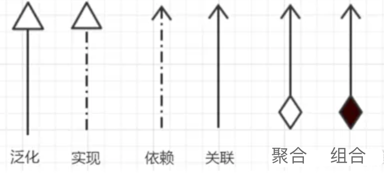
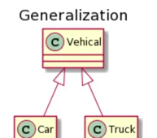
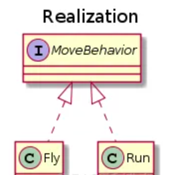
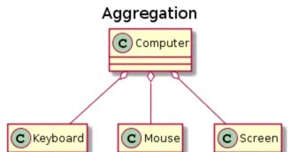
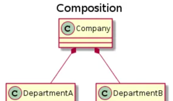
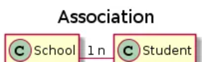
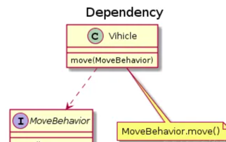

## 面向对象概念

面向对象是一种更优秀的程序设计方法，它的基本思想是使用类、对象、继承、封装、消息等基本概念进行程序设计。

它从现实世界中客观存在的事物出发来构造软件系统，并在系统构造中尽可能运用人类的自然思维方式，强调直接以现实世界中的事物为中心来思考，认识问题，并根据这些事物的本质特点，把它们抽象地表示为系统中的类，作为系统的基本构成单元，这使得软件系统的组件可以直接映像到客观世界，并保持客观世界中事物及其相互关系的本来面貌。

### 扩展：面向功能概念

结构化程序设计方法主张按功能来分析系统需求，其主要原则可概括为自顶向下、逐步求精、模块化等。结构化程序设计首先采用结构化分析方法对系统进行需求分析，然后使用结构化设计方法对系统进行概要设计、详细设计，最后采用结构化编程方法来实现系统。

因为结构化程序设计方法主张按功能把软件系统逐步细分，因此这种方法也被称为面向功能的程序设计方法；结构化程序设计的每个功能都负责对数据进行一次处理，每个功能都接受一些数据，处理完后输出一些数据，这种处理方式也被称为面向数据流的处理方式。

结构化程序设计里最小的程序单元是函数，每个函数都负责完成一个功能，用以接收一些输入数据，函数对这些输入数据进行处理，处理结束后输出一些数据。整个软件系统由一个个函数组成，其中作为程序入口的函数被称为主函数，主函数依次调用其他普通函数，普通函数之间依次调用，从而完成整个软件系统的功能。

每个函数都是具有输入、输出的子系统，函数的输入数据包括函数形参、全局变量和常量等，函数的输出数据包括函数返回值以及传出参数等。结构化程序设计方式有如下两个局限性：

* 设计不够直观，与人类习惯思维不一致。采用结构化程序分析、设计时，开发者需要将客观世界模型分解成一个个功能，每个功能用以完成一定的数据处理。
* 适应性差，可扩展性不强。由于结构化设计采用自顶向下的设计方式，所以当用户的需求发生改变，或需要修改现有的实现方式时，都需要自顶向下地修改模块结构，这种方式的维护成本相当高

## 面向对象的三大特性

面向对象的程序设计方法具有三个基本特征：封装、继承、多态

* 封装指的是将对象的实现细节隐藏起来，然后通过一些公用方法来暴露该对象的功能
* 继承是面向对象实现软件复用的重要手段，当子类继承父类后，子类作为一种特殊的父类，将直接获得父类的属性和方法
* 多态指的是子类对象可以直接赋给父类变量，但运行时依然表现出子类的行为特征，这意味着同一个类型的对象在执行同一个方法时，可能表现出多种行为特征
注意：如果说是对象的四大特性，那么还需要把抽象加上

抽象也是面向对象的重要部分，抽象就是忽略一个主题中与当前目标无关的那些方面，以便更充分地注意与当前目标有关的方面。抽象并不打算了解全部问题，而只是考虑部分问题。例如，需要考察Person对象时，不可能在程序中把Person的所有细节都定义出来，通常只能定义Person的部分数据、部分行为特征，而这些数据、行为特征是软件系统所关心的部分。

## 封装

封装指的是将对象的实现细节隐藏起来，然后通过一些公用方法来暴露该对象的功能

封装是面向对象编程语言对客观世界的模拟，在客观世界里，对象的状态信息都被隐藏在对象内部，外界无法直接操作和修改。对一个类或对象实现良好的封装，可以实现以下目的：

* 隐藏类的实现细节；
* 让使用者只能通过事先预定的方法来访问数据，从而可以在该方法里加入控制逻辑，限制对成员变量的不合理访问；
* 可进行数据检查，从而有利于保证对象信息的完整性；
* 便于修改，提高代码的可维护性。

### 封装的实现

为了实现良好的封装，需要从两个方面考虑：

* 将对象的成员变量和实现细节隐藏起来，不允许外部直接访问；
* 把方法暴露出来，让方法来控制对这些成员变量进行安全的访问和操作。
封装实际上有两个方面的含义：把该隐藏的隐藏起来，把该暴露的暴露出来。这两个方面都需要通过使用Java提供的访问控制符来实现。

## 继承

继承是面向对象实现软件复用的重要手段，当子类继承父类后，子类作为一种特殊的父类，将直接获得父类的属性和方法

继承就是子类继承父类的特征和行为，使得子类对象（实例）具有父类的实例域和方法，或子类从父类继承方法，使得子类具有父类相同的行为。

继承实现了 IS-A 关系，例如 Cat 和 Animal 就是一种 IS-A 关系，因此 Cat 可以继承自 Animal，从而获得 Animal 非 private 的属性和方法。

### 继承的实现

Cat 可以当做 Animal 来使用，也就是说可以使用 Animal 引用 Cat 对象。父类引用指向子类对象称为 向上转型 。

```java
Animal animal = new Cat()
```

### C++和Java继承区别

首先，Java是单继承的，指的是Java中一个类只能有一个直接的父类。Java不能多继承，则是说Java中一个类不能直接继承多个父类。

其次，Java在设计时借鉴了C++的语法，而C++是支持多继承的。

Java语言之所以摒弃了多继承的这项特征，是因为多继承容易产生混淆。

比如，两个父类中包含相同的方法时，子类在调用该方法或重写该方法时就会迷惑。

准确来说，Java是可以实现"多继承"的。因为尽管一个类只能有一个直接父类，但是却可以有任意多个间接的父类。这样的设计方式，避免了多继承时所产生的混淆

继承应该遵循里氏替换原则，子类对象必须能够替换掉所有父类对象。

## 多态

多态指的是子类对象可以直接赋给父类变量，但运行时依然表现出子类的行为特征，这意味着同一个类型的对象在执行同一个方法时，可能表现出多种行为特征

因为子类其实是一种特殊的父类，因此Java允许把一个子类对象直接赋给一个父类引用变量，无须任何类型转换，或者被称为向上转型，向上转型由系统自动完成。

当把一个子类对象直接赋给父类引用变量时，例如 BaseClass obj = new SubClass(); ，这个obj引用变量的编译时类型是BaseClass，而运行时类型是SubClass，当运行时调用该引用变量的方法时，其方法行为总是表现出子类方法的行为特征，而不是父类方法的行为特征，这就可能出现：相同类型的变量、调用同一个方法时呈现出多种不同的行为特征，这就是多态。

### 多态的实现

多态的实现离不开继承，在设计程序时，我们可以将参数的类型定义为父类型。

在调用程序时，则可以根据实际情况，传入该父类型的某个子类型的实例，这样就实现了多态。

* 对于父类型，可以有三种形式，即普通的类、抽象类、接口
* 对于子类型，则要根据它自身的特征，重写父类的某些方法，或实现抽象类/接口的某些抽象方法
具体案例如下：

多态可以提高程序的可扩展性，在设计程序时让代码更加简洁而优雅。

例如我要设计一个司机类，他可以开轿车、巴士、卡车等等，示例代码如下：
```java
class Driver {
void drive(Car car) { ... }
void drive(Bus bus) { ... }
void drive(Truck truck) { ... }
}

```


在设计上述代码时，我已采用了重载机制，将方法名进行了统一。这样在进行调用时，无论要开什么交通工具，都是通过 driver.drive(obj) 这样的方式来调用，对调用者足够的友好。

但对于程序的开发者来说，这显得繁琐，因为实际上这个司机可以驾驶更多的交通工具。

当系统需要为这个司机增加车型时，开发者就需要相应的增加driver方法，类似的代码会堆积的越来越多，显得臃肿。

采用多态的方式来设计上述程序，就会变得简洁很多。我们可以为所有的交通工具定义一个父类Vehicle，然后按照如下的方式设计drive方法。调用时，我们可以传入Vehicle类型的实例，也可以传入任意的Vehicle子类型的实例，对于调用者来说一样的方便，但对于开发者来说，代码却变得十分的简洁了。
```java
class Driver {
void drive(Vehicle vehicle) { ... }
}
class Vehicle {
void didi() { ... }
}

class Car extend Vehicle {
@Override
void didi() { ... }
}
class Bus extend Vehicle {
@Override
void didi() { ... }
}
class Truck extend Vehicle {
@Override
void didi() { ... }
}
```

## 类(对象)之间的关系

### UML类图

类之间的关系，类与接口之间关系可以分一下几种

* 泛化关系(Generalization)
* 实现关系 (Realization)
* 聚合关系 (Aggregation)
* 组合关系 (Composition)
* 关联关系 (Association)
* 依赖关系 (Dependency)



### 泛化关系 (Generalization)

用来描述继承关系，在 Java 中使用 extends 关键字。



### 实现关系 (Realization)

用来实现一个接口，在 Java 中使用 implement 关键字。



### 聚合关系 (Aggregation)

表示整体由部分组成，但是整体和部分不是强依赖的，整体不存在了部分还是会存在。



### 组合关系 (Composition)

和聚合不同，组合中整体和部分是强依赖的，整体不存在了部分也不存在了。比如公司和部门，公司没了部门就不存在了。但是公司和员工就属于聚合关系了，因为公司没了员工还在。



### 关联关系 (Association)

表示不同类对象之间有关联，这是一种静态关系，与运行过程的状态无关，在最开始就可以确定。

因此也可以用 1 对 1、多对 1、多对多这种关联关系来表示。比如学生和学校就是一种关联关系，一个学校可以有很多学生，但是一个学生只属于一个学校，因此这是一种多对一的关系，在运行开始之前就可以确定。



### 依赖关系 (Dependency)

和关联关系不同的是，依赖关系是在运行过程中起作用的。

A 类和 B 类是依赖关系主要有三种形式：

* A 类是 B 类中的(某中方法的)局部变量；
* A 类是 B 类方法当中的一个参数；
* A 类向 B 类发送消息，从而影响 B 类发生变化；

