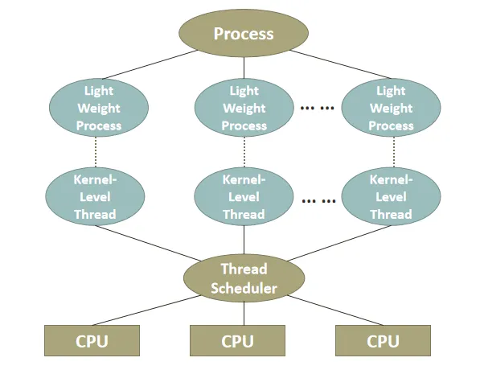
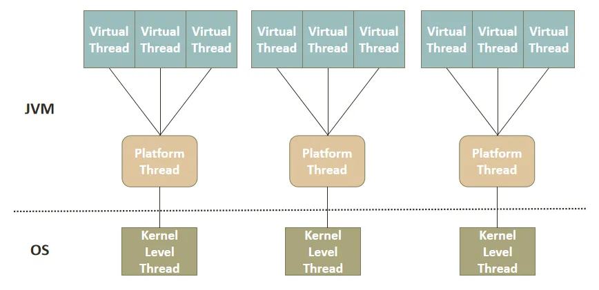
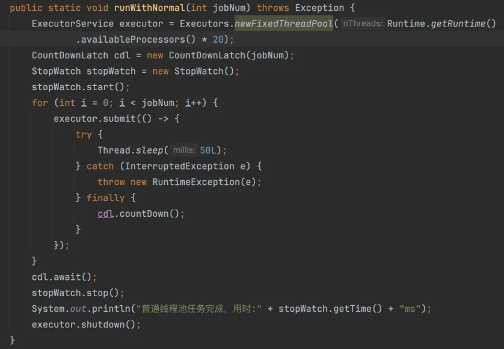
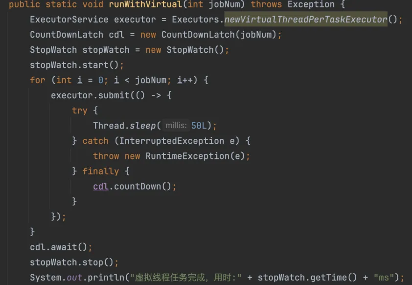
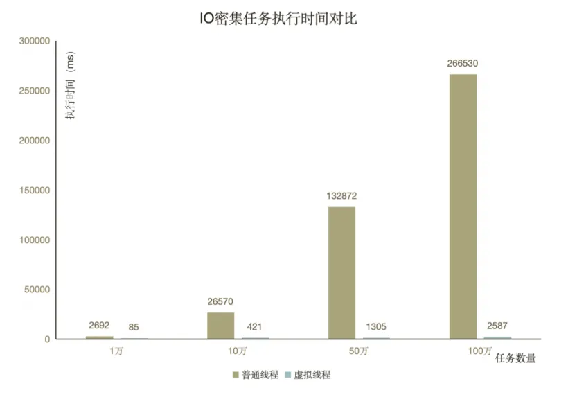
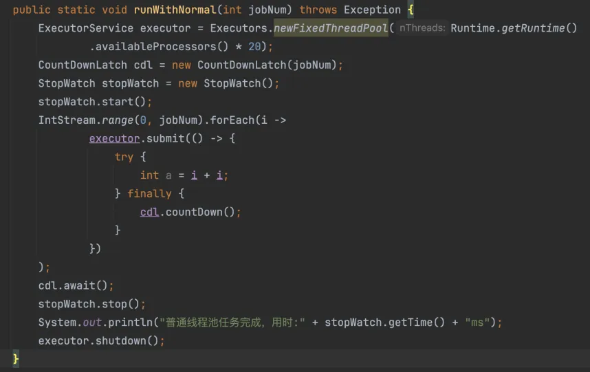
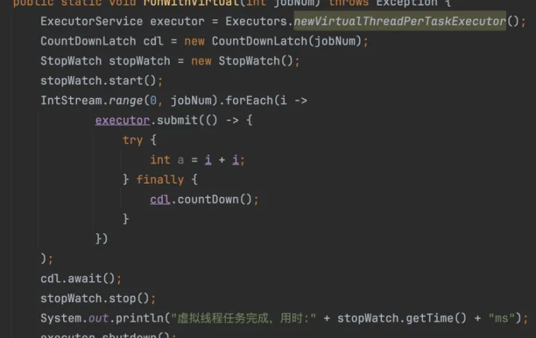

2023年9月19日，Oracle正式发布了JDK21。

JDK21是一个长期支持版本（上一个LTS版本是JDK17，Oracle将LTS版本的发布时间从3年改为了2年），包含了众多新特性，其中最重磅的莫过于虚拟线程（Virtual Threads）。使用虚拟线程，在不改变原来的编程风格的前提下，只需少量改动，就可以极大地提高系统的吞吐量。让我们从Java线程模型的发展、如何使用虚拟线程及性能对比来探一探虚拟线程吧！

**1、Java线程模型**

在早期JDK 1.2以前的Sun Classic虚拟机上Java线程是基于一种被称为“绿色线程”的用户线程（User Thread）实现的。用户线程完全建立在用户空间，系统内核不能感知用户线程的存在。用户线程的建立、同步、调度和销毁完全在用户态中完成，因此操作可以是非常快速且低消耗的，能够支持规模更大的线程数量。同时也因为没有系统内核支持，操作系统只负责把处理器资源分配到进程，线程的所有操作都需要程序自己去处理，比如“阻塞如何处理”、“多处理器系统中如何将线程映射到其他处理器上”等等，这些问题解决起来比较困难，使用用户线程实现的程序一般比较复杂（很多程序依赖特定的线程库来完成基本的线程操作，这些复杂性都封装在线程库之中）。因此Java在JDK1.2之后放弃了用户线程。

从JDK 1.3起，主流平台上的商用Java虚拟机Sun HotSpot的线程模型普遍被替换为基于内核原生线程模型来实现。内核线程（Kernel-Level Thread）直接由操作系统内核支持，由内核完成线程的切换，内核通过操纵调度器对线程进行调度，并负责将线程的任务映射到各个处理器上。程序一般不会直接使用内核线程，而是使用内核线程的一种高级接口—轻量级进程（Light Weight Process）。轻量级进程就是通常意义上所讲的线程，每个轻量级进程都由一个内核线程支持。因为每个轻量级进程都需要一个内核线程支持，所以具有局限性。首先，轻量级进程要消耗一定的内核资源，因此一个系统支持轻量级进程的数量是有限的。其次，各种线程操作，如创建、析构及同步，都需要进行系统调用。而系统调用需要在用户态和内核态中来回切换，代价相对较高。

因为内核原生线程模型存在线程操作占用资源高，无法大量创建等局限性，以及go语言等云原生、高并发语言的崛起和冲击，OpenJDK在2018年创建了Loom项目，试图解决传统并发模型中的限制，提出了官方解决方案—Fiber（纤程）。Fiber（纤程）后续被规范团队改为"Virtual Thread"（虚拟线程）。虚拟线程是在Java虚拟机（JVM）中实现的通过协作式线程调度的轻量级线程。JVM提供了默认的ForkJoinPool用于执行任务，任务执行时会将虚拟线程挂载到一个平台线程，当任务遇到阻塞时，将虚拟线程从平台线程进行卸载，平台线程会分配给其他的虚拟线程执行，而当任务结束阻塞时，虚拟线程重新被调度到平台线程上继续执行任务。平台线程是对操作系统线程的包装，是在底层操作系统线程上运行Java代码，并在整个生命周期过程中一直捕获操作系统线程，通常有大型的线程堆栈和其他资源。

因此，平台线程可用数量受限于操作系统线程的数量，而虚拟线程创建和销毁成本极低，可以被大量创建（参照官方说法可以达到百万级），该特性使得虚拟线程在处理IO密集型任务时可以指数级地提升处理效率。

图3. 虚拟线程模型

**2、如何使用虚拟线程**

使用虚拟线程，首先当然是需要安装JDK21，然后在Spring Boot 3.2.0前，可以通过以下形式设置Tomcat（Tomcat 10.1.x 版本开始支持,11默认使用）启用虚拟线程。

Spring Boot 3.2.0已经支持虚拟线程，启用虚拟线程只需要添加配置：

spring.threads.virtual.enabled=true

虚拟线程的使用方法和普通的线程基本没有区别。Java在设计虚拟线程API的时候进行了充分的考虑，程序不需要很大的改动，就能从普通线程平滑迁移到虚拟线程，可以通过Thread.startVirtualThread(...)ThreadFactory.newThread(...)等方式进行创建并启动。

另外，我们还需要注意使用虚拟线程与传统线程的一些区别，以下是一些建议。

①避免固定虚拟线程。JDK中绝大多数的阻塞操作（如网络库API、大部分IO操作）都会卸载虚拟线程，然而有一些阻塞操作不会卸载虚拟线程，使得虚拟线程被固定在其载体线程，从而阻塞其载体线程和底层操作系统线程，比如当虚拟线程持有监视器或者等待监视器的时候（一般是使用了synchronized关键字或者Object.wait()）或者当虚拟线程持执行本地方法或外部函数时。固定虚拟线程并不会使程序发生错误，但可能会阻碍其可扩展性。针对第一种情况，可以通过使用JUC里的锁API（ReentrantLock）替换synchronized关键字，保护潜在的长IO操作，以避免虚拟线程频繁和长期的固定。第二种情况则只能避免在虚拟线程中执行native方法或者外部函数。

②不建议使用ThreadLocal。虚拟线程支持ThreadLocal，使用方式和普通线程没有区别。但是因为虚拟线程可以大量创建，大量的ThreadLocal会带来额外的内存开销。因此，官方不推荐在使用虚拟线程的场景使用ThreadLocal。在一些场景下，可以使用作用域值（Scoped Values）来替代ThreadLocal。

③对有限资源使用信号量。如果需要限制并发，在确定只有指定数量的线程可以访问有限的资源情况下，如对数据库的请求、对下游系统的调用，使用信号量（Semaphore）而不是线程池，通过信号量限制可以访问物理资源或逻辑资源的线程数。

**3、性能对比**

我们分别模拟IO密集型任务以及CPU密集型任务在使用虚拟线程（Virtual Thread）与普通线程（Thread）执行时的效率进行对比分析。执行代码的机器为10核，Thread线程池数量固定为CPU核数的20倍。

**3.1 模拟IO场景，线程不做实际IO，sleep 50ms，测试代码与执行结果如下。**

**3.2 模拟计算场景，普通线程和虚拟线程测试代码与执行对比结果如下。**

从测试结果可以看出，虚拟线程相较于普通线程在IO密集型任务执行中优势非常惊人，但是在CPU密集型任务执行中并没有优势，效率反而不如普通线程。

**4、结束语**

虚拟线程不是更快的线程，其运行代码的速度并不比平台线程快，它适用于高并发高吞吐量的应用程序中，尤其是那些由大量并发任务组成且需要花费大量时间等待的应用程序。虚拟线程的存在是为了提供规模的扩展（更高的吞吐量），而不是速度的优化（更低的延迟）。

同时，由于虚拟线程推出时间不长，一些现有的Java库和框架设计可能依赖于传统线程的假设或API，使用虚拟线程可能造成一些兼容性问题。大家在使用虚拟线程时需充分考虑业务场景以及使用的第三方库对虚拟线程的支持情况，做好充分压力测试，合理使用虚拟线程，方能助力系统提升吞吐量，达到事半功倍的效果。