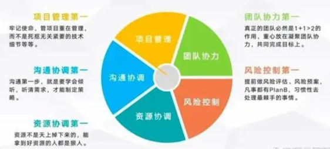
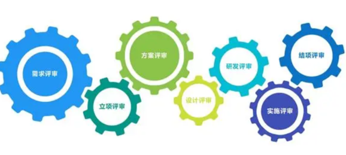

## 一、项目管理的一些经验

|                                                                                                                                                                                                                     |                                                                                                                                                                                                                                                                                                                                                                                                                                                                                                                                                                                                                 |
| ------------------------------------------------------------------------------------------------------------------------------------------------------------------------------------------------------------------- | --------------------------------------------------------------------------------------------------------------------------------------------------------------------------------------------------------------------------------------------------------------------------------------------------------------------------------------------------------------------------------------------------------------------------------------------------------------------------------------------------------------------------------------------------------------------------------------------------------------- |
| 管项目重在管理，而不是死抠无关紧要的技术细节等等。  真正的团队一定是1+1>2，要把重心放在凝聚团队协力，共同完成目标上。  项目的推进永远都是不确定性的，真正考验项目经理的是不断出现的需求变更和状况。**提前做风险评估、风险预案，凡事都有PlanB，习惯性去处理最棘手的事情。**  做好沟通协调就能避免90%的问题发生。沟通第一步，就是要**学会倾听**，听清需求，才能制定策略。 |                                                                                                                                                                                                                                                                                                                                                                                                                                                                                                                                 |
| 霍桑效应                                                                                                                                                                                                                | 924年11月，以哈佛大学心理学专家梅奥为首的研究小组进驻西屋（威斯汀豪斯）电气公司的霍桑工厂。霍桑工厂各方面条件都很好，对工人也不错，但生产效率却非常低下，研究小组的任务就是找出原因并给出方法。  研究初期，专家们把注意力集中在工作条件和生产效率之间的关系上，结果，这样做并不能反映不出工作条件的好坏对生产效率有直接影响。  实验进入第二阶段，重点研究社会因素与生产效率的关系。研究小组最后得出这样一个结论：当某个人受到公众的关注或注视时，或者心情畅快地做事时，其工作效率就会有极为明显的增加。这就是大名鼎鼎的“霍桑效应”。  悟透霍桑效应，善于化解员工的不满，或者让员工的不满情绪得以发泄，让其在工作时保持心情的畅快，不仅有利于团队在管理上的稳定，也是决定生产和经营效益的一个关键。  霍桑效应 (Hawthorne effect)。 霍桑效应指出，对某一事物进行度量时会对其行为产生影响，因此需要 谨慎制定度量指标。  例如，仅度量项目团队可交付物的输出，会鼓励项目团队专注于创建更多数量的可交付物，而不是仅仅专注于度量客户更满意的那些可交付物。 |
| 隐性知识的特性                                                                                                                                                                                                             | 1、由于隐性知识未被编码和格式化，因此具有非格式化的复杂特性；  2、由于隐性知识不易被编码的特点，其传播和共享较困难，难以进行交换和模仿，具有高价值性；  3、隐性知识的个性化、经验性特点，使得其对知识载体具有较强的依附性，同时还具有粘滞性、稳定性、路径依赖性和垄断性；  4、隐性知识是知识主体对经验和所处文化环境的心智感悟，具有特殊性、经验性和情境性；  5、隐性知识难以度量和评价；  6、隐性知识具有层次性。                                                                                                                                                                                                                                                                           |

## 二、项目管理的经典法则

|   |   |
|---|---|
|**01** **胜负在工期，成败在质量**|在项目实施过程中，由于各种因素的影响，有的任务可能按时完成，有的可能提前，有的则可能拖延。  某项任务的实际进度无论快与慢，必定会对其后续任务的按时开始或结束造成影响，甚至影响到整个项目完成的快慢，进而影响到最后的交付时间。  因此，在项目一开始就应该进行计划进度的监控，确保每项工作都能按计划进行。  想要顺利交付除了保时还得保质，很多公司为保证质量，定义了一套规划严谨，资源有序的项目阶段。  包括立项，需求规划，系统设计，详细设计，编码，集成测试，系统测试，样机测试，成果鉴定，市场商用等等里程碑点或者基线阶段。  在每个里程碑或者基线阶段，都会根据这个阶段的过程任务，制定本阶段的交付产物，质量目标，输入输出。  只有进行了阶段评审，交付物，质量达到了该阶段的要求标准后，才能允许进入下一个阶段的项目进程。|
|**02 海恩法则**|海恩法则大家应该都蛮熟悉的吧，这和我们常做的风险管理有异曲同工之妙，项目风险管理的有效性直接关乎项目成功与否。  在风险的潜伏阶段，但其可能性存在于各种征兆之中，识别潜在的风险也是我们要重视的，不能识别也就意味着无法做到预防。  **识别风险的一个重要手段是量化，量化的好处是可以通过对比来鉴别风险征兆，可以设置临界点作为预警指标，并制定应对方案。**|
|**03** **技术入手，经济收尾法则**|**03** **技术入手，经济收尾法则**  所谓“技术入手”，指的就是在某个研发项目正式开展之前，项目经理先仔细分析和判断自己的团队和技术能力，或以技术为突破口，做好充分的准备。  而“经济收尾”，是在有充分的技术保障的前提下，项目经理进行科学组织和管理，在开发过程中逐步降低经营或运作成本。  简单概括就是，你需要同时考虑市场和商品的经济性，不能不计成本。  只有优化流程和方案，在进行适量投入，少走弯路，是保证项目效益最重要的途径。|
|**04** **低成本才能盈利**||
|**05** **干中学，看中学是最佳的培训方法**|知道团队是靠什么赢的，持续复制和优化，才是下次成功之关键。  知道错在哪里，差距在哪里，持续迭代，不断PDCA循环，才能避免反复踩坑。|
|**06** **主要矛盾和木桶效应**|所谓木桶效应是指决定木桶盛水量大小的是最短的那个。  流程和关键动作进度均衡前进，同步完成。|
|**07** **甲方是上帝法则**|怎么在不惯坏他们的前提下，依然遵循甲方是上帝法则，我也总结了三点：  1、公司、项目、各部门内部统一声音，尤其是前端销售和交付人员之间；  2、具备客户思维，每一点分析都基于客户角度出发，让客户相信，他确实在替他们考虑；  3、灵活把握灰度原则，很多大厂员工自带的一种能力，毕竟在现实世界并不是非黑即白的，找到适合的灰度，彼此都有分寸感。|

## **三、6W3H**

6W3H是一个非常实用的工具，它包含了项目管理中需要考虑的重要问题。下面，我们就一一解析这些问题。

> **- What（什么）：** 首要明确项目具体要做什么，这包括项目的目标，预期的结果，需要完成的任务等。
>
> **- Why（为什么）：** 为什么要做这个项目？这个问题帮助我们明确项目背后的动机、理由和价值。这可以是市场需求，客户需求，技术创新等各种原因。
>
> **- Who（谁）：** 谁是执行者，谁是负责人，谁是利益相关者。更好地分配任务，明确责任，提高项目的执行效率。
>
> **- Where（在哪里）：**具体执行地点和环境，也包括项目的地理位置，环境条件等因素。考虑到环境因素对项目的影响，提前做好应对策略。
>
> **- When（何时）：**项目的时间线，包括开始时间，结束时间，重要的里程碑时间等。
>
> **- Which（哪种）：** 具体的技术方案，工作方式，管理工具等。
>
> **- How（如何）：**项目的具体实施执行方案，包括项目的组织结构，任务分配，工作流程等。明确How可以帮助我们更好地组织项目。
>
> **- How much（多少）：** 这涉及到项目的预算和资源分配。控制项目的成本，确保项目的经济效益。  
> **- How many（几个/多少次）：**任务数量或者需要进行的迭代次数。对How many的明确可以帮我们合理安排任务，制定实施计划，有助于整体把控项目的进度。

|   |   |
|---|---|
|**在项目开始之前--制定项目计划**|在这个过程中，6W3H可以帮助我们明确项目的各个重要问题，从而更好地制定项目计划。  例如，我们需要明确项目的目标（What），理解项目背后的动机（Why），确定项目的执行者（Who），选择合适的工具和方式（Which），制定项目的时间线（When），考虑项目的地理位置和环境（Where），明确项目的执行方案（How），分配项目的预算和资源（How much），确定任务数量或迭代次数（How many）。|
|**在项目执行过程中--**监控项目的进度和质量|通过回顾项目的目标（What）和理由（Why）来激励团队，  通过调整任务分配（Who）和工作方式（Which）来提高效率，  通过检查时间线（When）和预算（How much）来控制项目进度和成本，  通过考虑地理位置和环境（Where）来应对可能的困难和挑战，  通过修改执行方案（How）来应对变化，  通过调整任务数量或迭代次数（How many）来把控项目的质量。|
|**在项目结束后：**帮助我们回顾和总结项目。|回顾项目的目标（What）和理由（Why）来评估项目的成效。  通过回顾任务分配（Who）和工作方式（Which）来评估团队的表现，  通过回顾时间线（When）和预算（How much）来评估项目的进度和成本控制，  通过回顾地理位置和环境（Where）来评估项目的环境适应性，  通过回顾执行方案（How）和任务数量或迭代次数（How many）来评估项目的执行效果。|
|||
|||

## **四、PMO-**提供项目管理策略、方法、工具模版；组织项目评审与审计项目

项目管理办公室，简称PMO，是一个专门的团队或部门，负责定义和维护项目管理标准和流程。它为组织提供了一个中心化的方式来管理项目，并确保项目按照既定的标准和最佳实践进行。在许多大型组织中，PMO已经成为了一个不可或缺的部分，它们为项目提供了方向和支持，确保项目能够成功完成。企业级项目都是多个项目组合而成的大项目，在每个项目执行过程中，都会涉及到团队的资源共享，优先级，项目执行过程中的监控、审查，以及项目风险预估等等，同时，PMO在对项目[风险评估](https://so.csdn.net/so/search?q=%E9%A3%8E%E9%99%A9%E8%AF%84%E4%BC%B0&spm=1001.2101.3001.7020)及项目整体把控都进行了标准化规范，让项目在从开始筹划到运行到交付具有全面保障。在对项目管理的过程中实现流程标准化，也提高了项目交付效率，降低项目的风险。

PMO的组织成员很多都是来自于PMP晋升的，其中有四个角色，**PMO管理员、PMO分析师、PMO经理、PMO总监**，通过PMO认证学习、考试的选拔，晋升到PMO成员。PMO让PMP对于项目管理的思路更加开阔，在项目管理办公室中，PMO总监、经理能够以整体战略型眼光去管理一个项目集、项目组合，PMO分析师和管理员能够将项目有关的各个环节以及具体监控数据有更精准与娴熟的把控，PMO为项目经理在协助整体项目管理的过程中，进行了更专业、详细、深入的把控，能够确保复杂的项目组合，顺利运行，让项目能够保证高效、优质地投入市场及应用。

**PMO的定义与功能**

PMO的主要功能是提供项目管理的策略、方法和工具，以确保项目的成功。为了解决确保项目的质量和效益的这个问题，许多PMO开始采用项目评估和审计机制。

**PMO在组织中的角色**

在大多数组织中，PMO是一个核心的部门，与其他部门紧密合作，确保项目的顺利进行。它通常负责制定项目管理的策略和方向，以及确保所有项目都按照这些策略和方向进行。此外，PMO还与高层管理层进行沟通，确保项目与组织的整体战略和目标保持一致。

#### 为什么需要项目评估与审计？

> **项目评估与审计是确保项目成功的关键**。通过对项目的持续评估和审计，组织可以及时发现并解决问题，确保项目按计划进行。这种持续的监控和反馈机制为项目团队提供了有力的支持，帮助他们更好地管理项目，避免潜在的风险和问题。
>
> **项目评估的重要性**
>
> 项目评估是对项目的健康状况进行检查的过程。它可以帮助组织发现项目中的问题和风险，以及确定项目是否按照既定的目标和标准进行。这种评估机制为项目团队提供了一个及时的反馈，帮助他们更好地管理项目，确保项目的成功。
>
> **审计机制的作用**
>
> 审计是对项目的执行情况进行独立的检查和验证的过程。它可以确保项目按照组织的标准和流程进行，以及确保项目的质量和效果。通过审计，组织可以确保项目的透明度和公正性，从而增强项目的信任度和可靠性。
>
> **审计与评估的区别，**虽然项目审计和评估相似，但它们的目的和方法有所不同。
>
> - 审计更多地关注于项目的合规性和风险，而评估则更多地关注于项目的效益和价值。
> - 审计通常由外部的审计师进行，而评估则可以由内部或外部的专家进行。
>
> **审计的关键步骤**  
> 项目审计通常包括以下几个步骤：确定审计的目的和范围、选择审计团队、进行审计、分析审计结果和提供审计报告。这些步骤确保审计的公正性和准确性。

#### **PMO的项目评估方法**

为了确保项目的成功，PMO需要使用一系列的评估方法来检查项目的健康状况。这些评估方法为项目团队提供了一个清晰的框架，帮助他们更好地管理项目，确保项目的成功。

**评估的核心要素**  
项目评估通常包括对项目的范围、时间、成本、质量等关键要素的评估。这些要素是评估项目成功与否的关键指标。通过对这些关键要素的评估，PMO可以更好地了解项目的实际情况，并采取相应的措施。

> **项目健康度检查**
>
> 项目健康度检查是一种定期评估项目健康状况的方法。它涉及到对项目的各个方面进行评估，包括**项目的进度、预算、资源使用情况等。**通过这种检查，PMO可以及时发现项目中的问题，并采取相应的措施来解决。这种方法为项目团队提供了一个及时的反馈，帮助他们更好地管理项目，避免潜在的风险和问题。
>
> **关键绩效指标(KPI)的应用**
>
> 关键绩效指标是用来衡量项目成功的指标。PMO可以使用KPI来跟踪项目的执行情况，并确保项目按照既定的目标进行。常见的KPI包括项目的**完成时间、预算执行情况、项目的质量**等。通过这些KPI，PMO可以及时了解项目的执行情况，从而更好地支持项目团队。
>
> **风险评估与管理**
>
> 风险是任何项目都面临的挑战。PMO需要进行风险评估，以确定项目中可能出现的风险，并采取相应的措施来管理这些风险。这包括制定风险管理计划、分配资源来应对风险，以及监控风险的发展情况。通过这种方法，PMO可以确保项目的成功，避免潜在的风险和问题。

#### PMO的项目审计流程

项目审计是PMO的另一个核心职责。它涉及到对项目的执行情况进行独立的检查和验证，从而确保项目的成功。

> **审计的准备工作**
>
> 在进行审计之前，PMO需要进行一系列的准备工作。这包括确定审计的目标和范围、选择审计团队、以及制定审计计划。这些准备工作为审计团队提供了一个清晰的框架，帮助他们更好地进行审计，确保审计的成功。
>
> **审计的执行与跟进**
>
> 审计的执行涉及到对项目的各个方面进行检查和验证。这包括对项目的进度、预算、资源使用情况等进行审查。审计的结果会被记录下来，并用于后续的跟进工作。这种方法为项目团队提供了一个及时的反馈，帮助他们更好地管理项目，确保项目的成功。
>
> **审计报告的撰写与反馈**
>
> 审计结束后，PMO需要撰写审计报告，总结审计的结果。这份报告会被提交给项目的相关方，以供他们参考。同时，PMO也会根据审计的结果，提供相应的反馈和建议，帮助项目更好地进行。

#### 如何优化PMO的评估与审计机制？

随着项目管理的不断发展和组织环境的变化，PMO的评估与审计机制也需要不断地进行优化和更新。

> **持续的培训与学习**
>
> 为了确保评估与审计机制的有效性，PMO需要定期进行培训和学习。这包括了解最新的项目管理理论和实践、学习新的评估和审计工具，以及与其他组织分享经验和知识。持续的学习和培训可以帮助PMO团队保持其专业知识的领先地位，从而更好地支持项目团队。
>
> **引入先进的工具与技术**
>
> 随着技术的发展，有许多新的工具和技术可以帮助PMO更有效地进行评估和审计。例如，数据分析工具可以帮助PMO更准确地评估项目的健康状况，而自动化审计工具可以提高审计的效率和准确性。引入这些先进的工具和技术可以帮助PMO更好地支持项目团队，确保项目的成功。
>
> **建立反馈循环与改进机制**
>
> 评估与审计不应该是一次性的活动。PMO需要建立一个反馈循环，定期收集项目的反馈和建议，并根据这些反馈进行改进。这不仅可以帮助PMO更好地支持项目，还可以确保评估与审计机制的持续有效性。通过这种反馈循环，PMO可以及时了解项目的需求和挑战，从而更好地支持项目团队。

#### **未来的趋势与展望**

随着项目管理的不断发展，PMO的评估与审计机制也将面临新的挑战和机会。未来，我们可以期待更多的自动化、数据驱动和人工智能技术被应用于评估与审计中，从而提高其效率和准确性。同时，PMO也需要不断地进行学习和创新，以适应变化的环境和需求。

#### 管理评审的定义与背景

管理评审，通常被视为一个组织内部的定期审查和评估过程，其核心是对某一项目或任务的性能进行深入的分析。这通常涉及到项目的负责人、相关的团队成员以及高层管理者。但更重要的是，管理评审是一个持续的学习和改进的过程，它为组织提供了一个机会，通过反思和分析，不断优化其运营和决策。

#### 管理评审的核心目的

> **保障项目的质量与进度**
>
> 在项目管理的复杂性日益增加的今天，管理评审的首要目的是确保项目的质量和进度得到严格的控制。通过定期的评审，组织可以及时发现项目中的偏差和问题，从而采取相应的措施来纠正，确保项目始终保持在正确的轨道上。
>
> **促进团队的沟通与协作**
>
> 管理评审不仅是一个评估项目性能的过程，更是一个促进团队沟通与协作的重要平台。在评审过程中，团队成员有机会分享他们的观点、经验和建议，从而加强团队的凝聚力和合作精神。
>
> **为决策提供依据**
>
> 对于组织的高层管理者来说，管理评审提供了一个宝贵的机会，了解项目的实际进展和团队的表现。这为他们的决策提供了有力的依据，确保组织始终朝着既定的目标前进。
>
> **识别潜在的风险与机会**
>
> 管理评审不仅关注项目的当前状态，更重要的是，它可以帮助组织识别潜在的风险和机会。这为组织提供了一个机会，提前做好准备，应对可能出现的挑战，同时也抓住可能出现的机会。

## 5. 项目经理的职责和领导力

#### 项目负责人的主要职责

项目负责人的职责是多方面的，他们不仅需要确保项目的顺利进行，还需要管理团队成员，确保他们的工作效率。

在任何项目中，项目经理都是一个至关重要的角色。他们需要负责项目的**整体规划，监控进度，协调资源，解决问题，并领导团队朝着既定目标前进。**项目经理必须具备许多技能，包括但不限于**时间管理、风险评估、资源分配、冲突解决以及团队协调**等。然而，其中最重要的一个技能是人际交往和沟通能力。一个好的项目经理必须能够有效地与团队成员，利益相关者以及其他项目相关人员进行沟通。对于项目经理来说，沟通技巧的重要性更是不言而喻。他们需要通过沟通来领导团队，解决问题，协调资源，推进项目。他们需要明确并传递项目的目标，任务，进度以及预期的结果。他们需要倾听团队成员的意见，理解他们的需求，给予反馈和支持。他们需要通过沟通来建立和维护良好的人际关系，提高团队的工作效率和满意度。

> **确定项目目标与方向**  
> 项目的目标和方向是项目成功的关键。项目负责人需要明确项目的目标，确保团队成员明白这些目标。他们还需要为项目制定明确的方向，确保项目的顺利进行。为了实现这一点，项目负责人需要与团队成员、上级管理层以及其他相关部门进行沟通，确保项目的目标得到大家的认同。
>
> **确保项目资源的合理分配**  
> 资源是项目进行的基础。项目负责人需要确保项目的资源得到合理的分配。这包括人力资源、财务资源以及其他必要的资源。为了实现这一点，项目负责人需要与相关部门进行沟通，确保资源的及时到位。
>
> **监控项目进度并调整策略**  
> 项目的进度是项目成功的关键。项目负责人需要定期检查项目的进展，确保项目按照计划进行。如果项目出现问题，他们需要及时调整策略，确保项目的顺利进行。为了实现这一点，项目负责人需要与团队成员进行沟通，确保大家对项目的进度有清晰的了解。
>
> **确保团队沟通与合作**  
> 团队的沟通和合作是项目成功的关键。项目负责人需要确保团队成员之间的沟通顺畅，确保团队成员之间的合作。他们还需要为团队成员提供必要的支持，帮助他们完成任务。为了实现这一点，项目负责人需要定期组织团队会议，确保大家对项目的进展有清晰的了解。
>
> **管理风险与应对突发事件**  
> 项目中可能会出现各种风险和突发事件。项目负责人需要预测项目可能出现的风险，制定相应的应对策略。如果项目出现突发事件，他们需要及时应对，确保项目的顺利进行。为了实现这一点，项目负责人需要与团队成员进行沟通，确保大家对项目的风险有清晰的了解。

#### 项目负责人的领导力

领导力是项目负责人的核心能力之一。他们不仅需要管理项目，还需要管理团队成员，确保团队的合作与协同。

> **如何激励团队成员**  
> 激励是提高团队成员工作积极性的关键。项目负责人需要了解团队成员的需求和期望，为他们提供必要的支持和激励。这可以是提供培训机会，提供晋升机会，或者为他们提供其他形式的奖励。为了实现这一点，项目负责人需要与团队成员进行沟通，了解他们的需求和期望，制定相应的激励策略。
>
> **如何处理团队冲突**  
> 团队冲突是项目进行中常见的问题。项目负责人需要及时发现并处理这些冲突，确保团队的合作与协同。他们可以通过团队建设活动，沟通会议等方式，帮助团队成员建立信任和理解。为了实现这一点，项目负责人需要具备良好的沟通能力和冲突解决技巧。
>
> **如何培养团队成长**  
> 团队的成长是项目成功的关键。项目负责人需要关注团队成员的成长和发展，为他们提供必要的培训和学习机会。他们还需要为团队成员提供反馈，帮助他们改进工作方法和技能。为了实现这一点，项目负责人需要与团队成员进行沟通，了解他们的需求和期望，制定相应的培训计划。

**设计协作工具：**如Figma、Zeplin和InVision等，可以帮助设计师和开发者更加高效地协同工作。

#### 未来的趋势与展望

> **AI在设计中的应用，**未来，AI可能会在设计中发挥更大的作用。例如，AI可以帮助设计师自动生成设计稿，或者提供实时的用户反馈。
>
> **AR/VR与交互设计，**随着AR/VR技术的发展，交互设计将面临新的挑战和机会。设计师和开发者需要合作，创造出全新的交互体验。

#### 项目经理是催促者还是服务者？

在许多公司和项目团队中，人们常常把项目经理看作是一个“催促者”，他们的主要任务是确保项目按照既定的时间表和预算进行，时刻监督项目的进展，并在必要时向团队施加压力以确保任务的完成。这种视角虽然在一定程度上反映了项目经理的角色，但是却忽视了他们作为服务者的身份。

- **项目经理的真正角色定位**

项目经理的核心职责是为项目的成功提供全方位的支持，他们既要为团队创建一个良好的工作环境，也要为他们提供必要的资源和指导，确保他们可以高效地完成任务。这意味着，项目经理不仅要推动项目的进展，还要作为一个服务者，帮助团队解决问题，满足他们的需求，以及激发他们的工作热情和创新精神。

#### 服务型领导的理念

> - **服务型领导理念介绍，**服务型领导是一种颠覆性的领导理念，它把领导者的角色定义为“服务者”**，强调领导者应该以支持和帮助团队为主，而不是单纯地指挥和控制。**这种理念强调的是领导者的“服务”，而不是“权力”。
>
> - **如何以服务者的身份领导项目-尊重和关心，**作为服务型领导者的项目经理，**他们首先需要做的是理解团队的需求和期望，然后提供必要的支持和帮助以满足这些需求**。此外，他们还需要通过开放和透明的沟通，建立团队的信任和尊重，并鼓励团队成员参与决策过程，共享项目的成功。
>

#### 服务型领导对项目成功的重要性

> - **提高团队成员的参与度，**服务型领导可以通过满足团队成员的需求和期望，提高他们的工作满意度和参与度，从而提高他们的工作效率和质量。当团队成员感到被尊重和被听到时，他们更愿意积极参与到项目中，贡献他们的知识和技能。
>
> - **增强团队的凝聚力，**服务型领导也可以通过创建一个开放和包容的工作环境，增强团队的凝聚力。当团队成员感到他们的观点和建议被接纳和尊重时，他们更愿意与其他团队成员合作，共同解决问题，共享成功。
>
> - **增加团队的创新力，**服务型领导还可以通过鼓励团队成员提出新的想法和创新，增加团队的创新力。当团队成员感到他们的创新被鼓励和支持时，他们更愿意尝试新的方法和技术，从而推动项目的进步。
>

#### 转型为服务型领导的实际步骤

> - **开放和透明的沟通，**转型为服务型领导的第一步是建立开放和透明的沟通。项目经理需要向团队清晰地传达项目的目标和期望，同时也需要听取他们的反馈和建议。此外，他们还需要及时和准确地更新项目的进度和问题，以便团队可以根据最新的信息做出决策。
>
> - **提供支持和资源，**转型为服务型领导的第二步是提供必要的支持和资源。项目经理需要理解团队的需求和挑战，然后提供相应的支持和资源以帮助他们解决问题。这包括提供足够的时间、资金和技术支持，以及提供必要的培训和指导。
>
> - **领导通过示例，**转型为服务型领导的第三步是通过示例进行领导。项目经理需要通过他们的行动展示他们是如何支持团队的，如何解决问题，如何接受和处理反馈，以及如何面对挑战和失败。通过这种方式，他们可以赢得团队的信任和尊重，同时也可以为团队树立一个良好的榜样。
>

#### 

## 6. 项目经理 VS 产品经理

#### 尽管产品经理和项目经理都属于管理职位，但他们在职责、目标、工作内容和方法上都存在显著的差异。

> **职责与目标的不同**  
> 产品经理的职责主要集中在产品的规划和设计上，他们需要确定产品的目标市场、用户群体和价值主张，制定产品的发展路线图和发布计划。他们的目标是创建有价值、有竞争力的产品，满足用户的需求，实现企业的商业目标。而项目经理的职责主要集中在项目的执行和控制上，他们需要制定项目计划、分配资源、监控进度和质量，解决项目中的问题和风险。他们的目标是确保项目的成功完成，满足项目的时间、成本和质量要求。
>
> **工作内容与方法的差异**  
> 产品经理主要关注产品的市场定位、用户需求和功能设计，他们需要进行市场研究、用户访谈和竞品分析，以获取有价值的洞察和信息。他们还需要与设计师、开发人员和其他团队成员紧密合作，以实现产品的设计和开发。而项目经理主要关注项目的进度、资源和风险，他们需要制定详细的项目计划、分配合适的资源、监控项目的执行和质量，以确保项目的顺利进行。他们还需要与项目团队成员、利益相关者和供应商保持良好的沟通和协调，以解决项目中的各种问题和冲突。
>
> **所需技能与知识的对比**  
> 产品经理需要具备深厚的市场洞察、用户理解和产品设计能力，他们需要能够发现市场机会、理解用户需求和创造产品价值。他们还需要具备良好的沟通和协调能力，以与团队成员和利益相关者建立有效的合作关系。而项目经理需要具备丰富的项目管理知识和经验，他们需要能够制定实际可行的项目计划、管理项目的资源和风险，确保项目的成功完成。他们还需要具备强大的领导和人际交往能力，以带领项目团队克服困难和挑战，实现项目目标。

产品经理的职责广泛，但主要集中在以下几个方面：

> - 市场研究：理解市场趋势，研究竞品，了解用户需求和痛点，为产品的开发和优化提供方向。
>
> - 产品规划和设计：根据市场研究的结果，制定产品的功能、界面和用户体验，以满足用户的需求。
>
> - 项目管理：协调内部资源，管理项目进度，确保产品的开发和发布按计划进行。
>
> - 数据分析：跟踪产品的使用数据，通过数据分析来了解产品的表现，为产品的改进提供依据。
>
> - 协调沟通：作为团队中的桥梁，产品经理需要与其他部门紧密合作，保证信息的顺畅传递，共同推动产品的成功。
>

## 7. 产品经理、项目经理们，汇报进度和工作的？

> 一、准备充分的汇报材料：包括项目**进展报告、工作计划、问题和风险清单**等。确保这些材料简洁明了，重点突出，能够清晰地传达项目的关键信息。
>
> 二、明确汇报的目标和重点： 根据老板的关注点和需求，选择性地展示项目的关键指标、里程碑完成情况、问题解决方案等。重点突出项目的价值和成果，以及对组织目标的贡献。
>
> 三、简洁清晰地陈述：。避免使用过多的专业术语和技术性的语言，而是用通俗易懂的语言解释项目的进展和工作内容。同时，使用图表、图像等可视化工具，更直观地展示数据和信息。
>
> 四、提供解决方案和建议：以针对项目中的问题和挑战，提出相应的解决方案，并说明实施这些方案的预期效果。这样可以展示他们的主动性和解决问题的能力。
>
> 五、积极回应问题和反馈：积极回应这些问题和反馈，提供更详细的解释和补充信息。同时，他们也可以主动向老板请教，寻求建议和指导，以进一步提升项目的执行效果。
>
> 六、定期汇报和沟通： 除了定期的汇报会议，产品经理和项目经理还应该与老板保持定期的沟通。每周例会、每月汇报或者不定期的项目进展更新。通过定期的沟通，可以及时了解老板的期望和需求，以及项目的变化和调整。

#### 1）处理难缠客户的有效策略

> - **建立清晰、透明的沟通机制**  
    >     与难缠的客户沟通时，项目经理需要确保沟通是清晰和透明的。这意味着项目经理需要及时更新客户关于项目的进展，确保客户了解项目的状态。此外，项目经理还需要确保客户了解项目的风险和挑战，并与客户一起制定应对策略。
>
> - **保持专业态度，不引入个人情感**  
    >     面对难缠的客户，项目经理需要保持专业的态度，不让个人的情感干扰到项目的进行。
>
>
> - **利用中立的第三方资源进行调解**  
    >     有时，项目经理和客户之间的沟通可能会陷入僵局。在这种情况下，项目经理可以考虑引入一个中立的第三方资源来进行调解。这个第三方资源可以是一个独立的顾问、一个行业专家或者一个经验丰富的同事。他们可以为双方提供一个中立的视角，帮助双方找到共同的解决方案。
>
> - **时刻准备计划B**  
    >     面对难缠的客户，项目经理需要时刻准备计划B。这意味着即使项目已经制定了明确的计划，项目经理也需要考虑到可能的变故，并提前做好准备。例如，如果客户突然更改了需求，项目经理可以考虑提前制定一个备用计划，以确保项目能够顺利进行。
