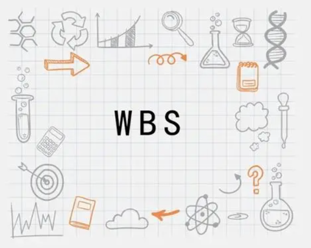
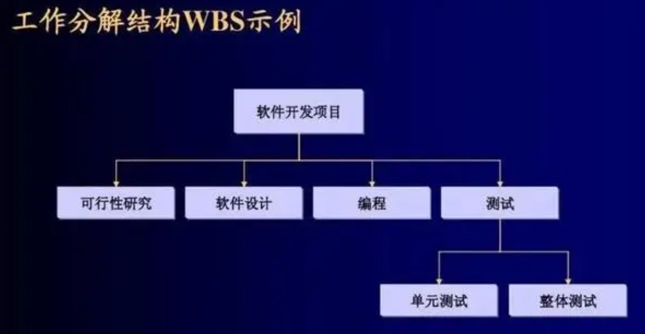
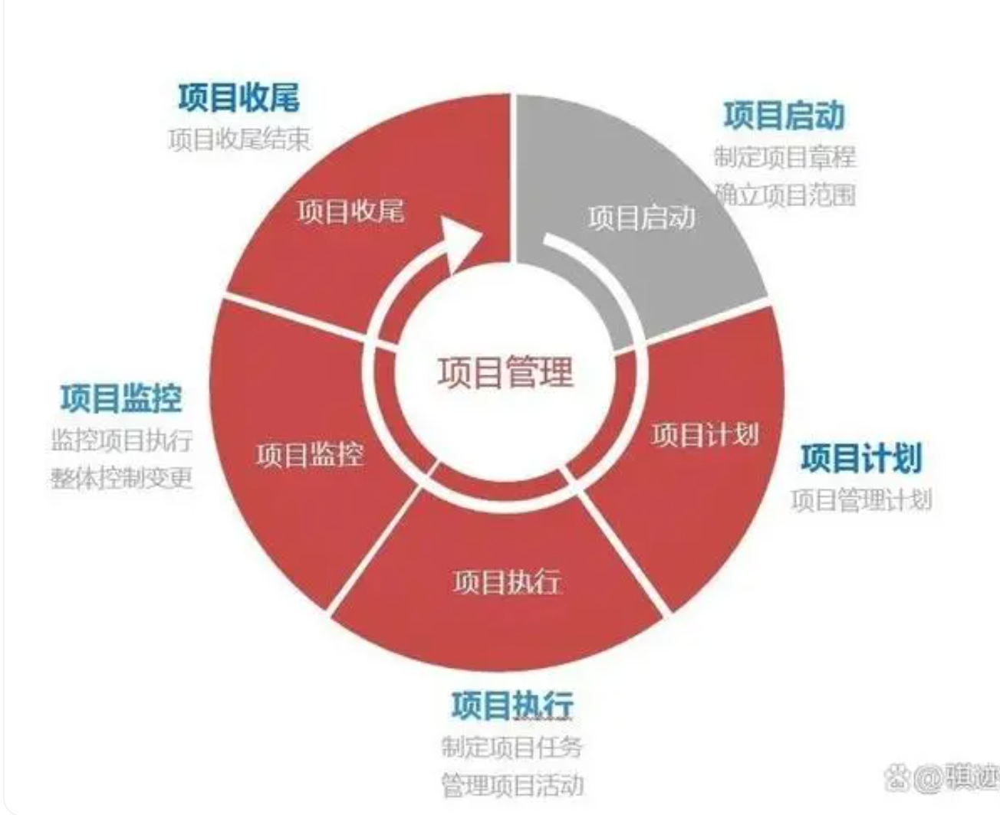

对于项目管理人员来说，如何进行有效的项目管理，提高项目的效率是一个值得关注和探讨的问题。

**1、WBS**

工作分解结构（简称 WBS）是把整个项目逐层分解到较小的、便于管理的要素：可交付成果。

项目分解成任务，任务再分解成一项项工作。即：项目→任务→工作。工作分解结构以可交付成果为导向，对项目要素进行分组，它归纳和定义了项目的整个工作范围，每向下分解一层代表对项目工作的更详细定义。

WBS 处于规划过程的中心，也是制定进度计划、资源需求、成本预算、风险管理计划和采购计划等的重要基础。

**2、项目甘特图**

**拯救你的项目进度计划。**

甘特图能够清晰地反映各项任务之间的关系以及每项工作的完成进度，简单且便于编制，管理者可以通过甘特图快速、直观地弄清项目的剩余任务，评估工作进度，在项目管理中被广泛应用。

甘特图包含以下三个含义：

1、以图形或表格的形式显示活动；

2、通用的显示进度的方法；

3、构造时含日历天和持续时间，不将周末节假算在进度内。

**3、抓住关键问题**

**项目可分为启动、规划、执行、监控、收尾等等不同的阶段，**每个阶段需要明确关键目标，锁定核心问题。作为项目经理，需要把控三点：

（1）驱动管理节点，紧盯目标，这个目标是宏观的目标，包括业务目标、进度目标、人员目标。

（2）保障沟通通道，保障信息传达的有效性，步调一致，协调各团队有效参与。

（3）运用管理机制，包括目标负责制、沟通机制、需求管理机制等。

**4、建立全员风险管理意识**

建立和运用机制持续聚焦项目目标、方案、进度（计划），促成高效执行。同时要发掘和同步风险，准备预案以降低和消除风险危害。

风险在每一个启动的项目里是长期存在的，因此，识别、反馈和处理风险也是持续要做的工作。在项目中一定要建立全员风险管理的意识，鼓励团队成员及时识别和处理风险。

**5、建立项目管理的知识体系**

2023年PMP考试加入了《PMBOK指南第七版》涉及的范围没有变，考试内容发生整合，**由五大过程组启动、规划、执行、监控、收尾变为三大模块，且敏捷内容增加到50%**

过程: 启动，规划，执行，监控，收尾

人员: 人员沟通，团队管理

商业环境: 可行性分析Q，法律法规

解项目管理的知识并掌握基础概念是建立项目管理知识体系的重要一步。小骐为大家分享一本书，PMP的教材《PMBOK指南》。

《PMBOK指南》（Project Management Body of Knowledge）是由项目管理协会（PMI）发布的一本权威性的项目管理标准，其中包含了项目管理的核心概念、流程和最佳实践。

通过阅读《PMBOK指南》等相关书籍，学习项目管理的基础概念，包括项目生命周期、项目过程组、知识领域等。这将为你提供项目管理的框架和理论基础。****
