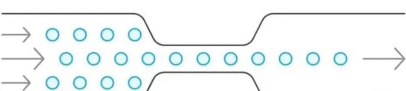

> 在现代企业中，**多项目并行管理已成为常态**，有效的进度管理是确保项目成功的关键。**明确目标、合理分配资源、有效沟通**是实现高效进度管理的核心要素。尤其是在资源有限的情况下，如何在多个项目之间进行优先级排序和资源调配，成为了项目经理必须面对的挑战。本文将深入探讨多项目进度管理的策略与技巧，帮助项目经理更好地掌控项目进度，提升整体工作效率。


### 一、明确项目目标与优先级

明确项目目标是进度管理的第一步。每个项目都有其独特的目标和预期成果，项目经理需要在项目启动阶段与相关利益相关者进行深入沟通，确保所有人对项目目标有一致的理解。**项目目标的清晰度直接影响到后续的进度安排和资源分配**。

在确定目标后，项目经理需要对多个项目进行优先级排序。**优先级排序可以基于项目的紧急性、重要性及资源需求等因素**。例如，某些项目可能由于市场需求的变化而需要优先完成，而另一些项目则可以适当延后。通过合理的优先级排序，项目经理能够更有效地分配资源，确保关键项目按时完成。

### 二、合理资源分配与调度

资源是项目成功的关键因素之一。在多项目管理中，项目经理需要对团队成员、资金、设备等资源进行合理的分配与调度。**资源的合理分配不仅能提高工作效率，还能降低项目风险**。

在资源分配时，项目经理应考虑团队成员的技能与经验，确保将合适的人才分配到合适的项目中。此外，项目经理还需要定期评估资源使用情况，及时调整资源分配策略，以应对项目进展中的变化。例如，当某个项目进展缓慢时，项目经理可以考虑从其他项目中调配资源，以加快进度。


````markmap
---
markmap:
  colorFreezeLevel: 2
---

# 资源分配

## 团队技能考虑

## 定期评估

## 资源重新分配

````

### 三、有效沟通与协作

在多项目管理中，有效的沟通与协作是确保项目顺利进行的重要保障。项目经理需要建立良好的沟通机制，确保团队成员之间的信息畅通。**定期召开项目进展会议，及时分享项目状态与问题，有助于提高团队的协作效率**。

此外，项目经理还应鼓励团队成员之间的协作与支持。通过建立跨项目的协作小组，团队成员可以分享经验与最佳实践，促进知识的传递与创新。有效的沟通与协作不仅能提升团队士气，还能增强项目的整体执行力。

### 四、使用项目管理工具

现代项目管理工具为多项目管理提供了极大的便利。项目经理可以利用这些工具进行进度跟踪、资源管理、任务分配等。**使用项目管理软件可以帮助项目经理实时监控项目进展，及时发现并解决问题**。

使用项目管理软件,如研发项目管理软件PingCode 。
### 五、定期评估与调整

在多项目管理中，定期评估项目进展与效果是至关重要的。项目经理应制定评估指标，定期检查项目的进度、质量和成本等方面的表现。**通过定期评估，项目经理能够及时发现问题并进行调整，确保项目朝着既定目标前进**。

在评估过程中，项目经理还应与团队成员进行反馈交流，了解他们在项目执行中的困难与挑战。通过收集反馈，项目经理可以优化项目管理流程，提升团队的工作效率。此外，项目经理还应根据评估结果，适时调整项目计划与资源分配策略，以应对变化的市场环境与项目需求。

### 常见问答FAQ

**1.多项目管理的最大挑战是什么？**

多项目管理的最大挑战在于资源的有限性和项目之间的优先级冲突。项目经理需要在多个项目之间进行有效的资源分配和调度，以确保每个项目都能按时完成。

**2.如何确定项目的优先级？**

确定项目优先级可以基于项目的紧急性、重要性、资源需求以及对公司战略目标的贡献等因素。项目经理应与利益相关者进行沟通，确保优先级排序的合理性。

**3.项目管理工具有哪些推荐？**

常用的项目管理工具包括Trello、Asana、Microsoft Project、Jira等。这些工具能够帮助项目经理进行任务分配、进度跟踪和资源管理，提高工作效率。

**4.如何提高团队的沟通效率？**

提高团队沟通效率的方法包括定期召开项目进展会议、使用即时通讯工具、建立共享文档和信息平台等。确保信息的及时传递与共享，有助于增强团队的协作能力。

**5.项目进度延误的原因有哪些？**

项目进度延误的原因可能包括资源不足、需求变更、团队沟通不畅、技术问题等。项目经理需要及时识别并解决这些问题，以确保项目按时交付。
