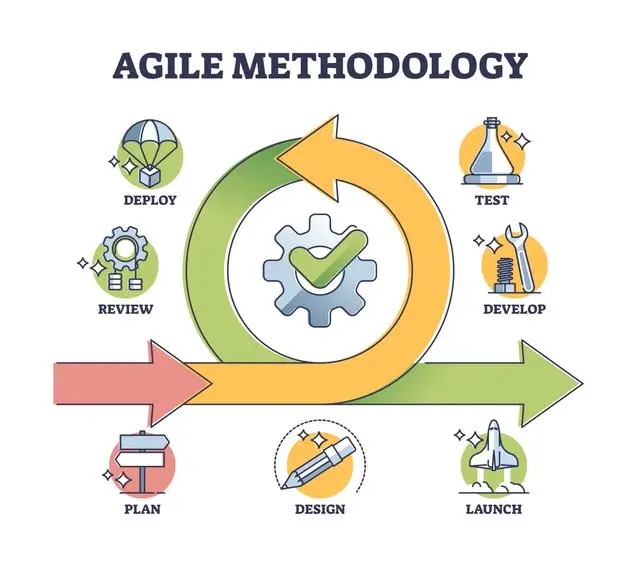
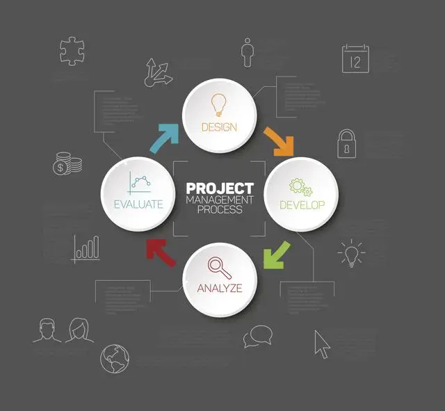
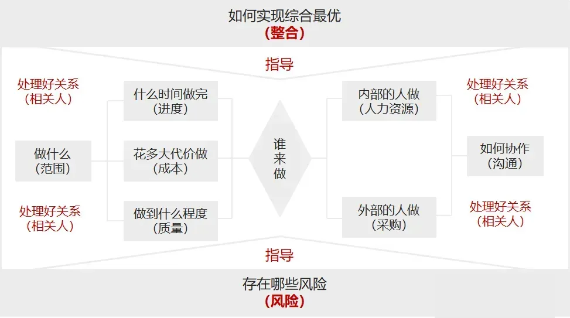
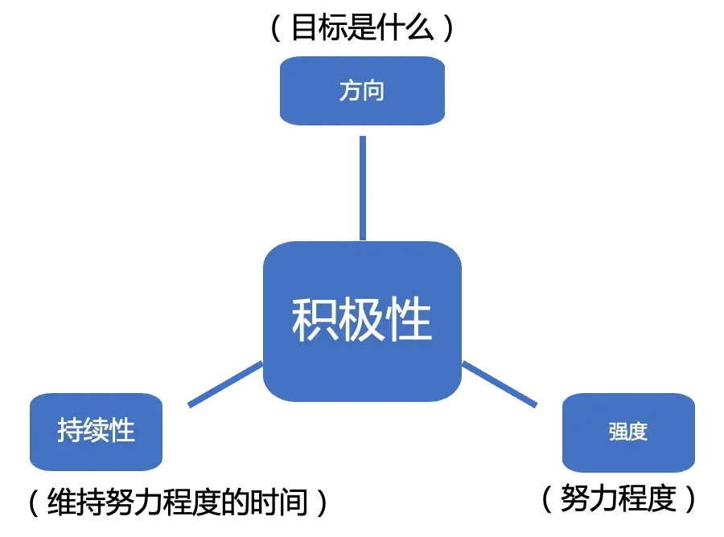
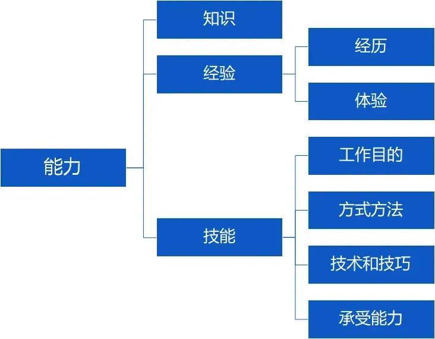

## **一、自我经历和感受**
理论是可以指导实践，但前提是，需要真正理解理论的知识，理解-关联-实践，在理解和关联中去实践，达到融汇贯通，才是真正对理论知识的掌握，并进而形成自己对项目管理新的理论知识的沉淀。
## **二、项目管理应该学什么**
**01学基础**

学过PMBOK或者其他项目管理体系的项目经理，我们在和他们沟通交流的时候，会有一个最直观的感受，就是会有很多同频的词出现，比如范围、进度、时间、成本、需求、启动、规划、执行、监控、收尾、交付、延期、风险、干系人，等等，而这些，都是在项目管理学习时所学的基础知识。也就是说当学完一个知识体系后，学习了基础知识，就可以掌握项目管理的统一语言，可以在大脑中建立一个项目管理的知识框架。有这样的一个知识框架体系，有了统一的沟通语言，这样在实践中，是可以建立统一的沟通频道的，也是理论上的专业项目管理人员。

**02学原则**

基础知识毕竟知识知识，把知识运用到实践是有一个过程，那么在学习项目管理知识体系的时候，我们应该着重学习的是该体系下的原则。比如：
《PMBOK指南》第7版进化而来的12原则；
* 敏捷的12原则；
* Prince2的7大原则；
* 规模化敏捷SAFe的10大原则：
* 还有很多体系下的原则。
之所以说要重点学习该体系下的原则，是因为原则是行动的指南，原则指导项目实践的行动。
做项目，底层核心逻辑是执行。那么执行的时候，在有原则指导的前提下，方式、方法是千变万化的，甚至不局限于项目管理体系讲的方式方法。
这样一来，为达成项目目标，重原则，则大有可为。
举个例子，新版PMBOK的12大原则：

在做项目的时候，12大原则告诉我们，要着重考虑人的因素，过程的合理性，以及环境的影响。
人的因素，要考虑的要点可以包括：项目经理的定位（管家式管理）、团队（团队的组成、团队的参与和奉献）、相关方（干系人的协同和深度参与）、领导力（项目经理本身的影响力，以及项目团队彼此的影响力）
过程方面，项目经理要成为整合专家，需要对项目进行系统的思考和规划，需要具备全局思维；需要重点关注质量；需要重点关注风险的管控（项目管控的核心要点之一，就是风险的管控）；以及对根据不同的项目，不同的团队，进行量体裁衣。
环境方面，也即要结合市场环境、公司或部门的环境，重点考虑项目的商业价值，项目的复杂性，以及项目变革所带来的关联和影响，还有项目本身的适应性和韧性。
再看我们所熟知的敏捷12原则，就不一一举例了

用敏捷，重点是关注这12个原则，不用局限于某个敏捷方法论或者流程，这样就可以更加的为达成目标而落地执行。

**03学流程**

项目管理学习的时候，不知道大家是否真正关注过一个维度，就是流程。
从我个人的理解来说，《PMBOK指南》里面讲的各个知识域，其中的输入输出，都是一个个流程来的。
那我们学习的时候，可能只是为了考试，并没有真正去理解学习流程的目的为什么。而且还容易困惑，困惑点在于，这些流程好像在实际项目中都用不上。
但恰恰是因为这样，我们更要明白，为什么各大知识体系中，会出现各种流程呢？这其实就足以说明，学习流程的重要性。
因为流程是为效率服务的。我们在实际做项目的过程中，要特别梳理清楚项目在每个阶段做什么，应该怎么做，每个角色应该怎么配合，要重点关注什么。
而这，就是“因地制宜”的项目流程。
有了这个项目流程，团队间的协同会更加有效率。
流程有了之后，还需要根据团队的阶段和规模对流程进行规范化，标准化，形成有利于组织过程资产，便于复用和沉淀。

**04学思维**

知识的学习通常都是由点-线-面-系统-体系的这样一个过程。
学习知识固然都是一个个知识点，但学习了很多知识点之后，项目经理要能够根据所学培养自己的结构化思维，并形成系统的思考方式。
比如十大知识域，看着都是一个知识点，但形成结构化之后，可以参考如下图，看到这张图，自然就知道，开发负责一个项目的时候该如何行动。

每个知识体系都有其对应的结构化思维，这需要我们在学习的时候善于去挖掘和总结。因为单个知识点对做好项目管理是有一定的帮助，但做好项目管理，是一个系统化的事情。
通过对知识点的学习，形成结构化思维，从而提升自己的认知和思维方式。再拓展到做事情，解决问题的结构化上来。
也就是说，要明白项目管理的学习，最终都是为达成目标而服务的。那么要达成项目目标，需要在这个过程中下沉业务，落地执行。而执行是一个暴露问题，解决问题的过程。
当形成结构化思维的时候，才可以更好地形成全局思维，以此更好地解决项目中的问题。解决问题也是作为项目经理的核心任务之一。
最典型的全局思维模式即：**发现问题-界定问题-探究根因-制定方案-评估方案-做出决策。**
这就要求项目经理在遇到问题的时候，不要就问题解决问题，这样大概率下次还会遇到同样的问题。
而应该要做的是，在主动发现问题或者被动获取到问题的时候，先界定是什么问题，然后究其根本原因，找到根本原因再根据原因制定可行性方案，并对方案进行有效性评估，评估之后才是作出决策并落地执行，最后，执行结束对结果进行审核确认。
这也就是我们常说的，**项目经理要追求的是全局最优，而不是局部最优。**
要具备全局思维，就需要学习并形成结构化思维，站在更高的维度看项目。这样，在做事情的时候，从整体出发，系统地去看待。当我们掌握全局思维时，能够更好地帮助我们透表象看待本质。

**05学工具**

工欲善其事必先利其器。
工具用得好与不好，某种程度上对效率的提升是有很大的影响的。
所以，在学习项目管理的过程中，务必要学习对一些工具的使用，包括但不限于各种绘图工具，各企业内部的研发管理工具，project，还有其他各类能够提升效率的工具。
比如常用的研发项目管理工具，本身其实也是流程中很重要的一个环节，可以通过工具设定各种流程，以此串联起整个研发节奏。
还有如今AI的爆发，现在已经有不少公司，已经在开始接入大模型等其他可用的工具，这些都是我们作为项目管理从业者必须要学习的。

**06学管理**

在很多人看来，做项目经理并不是一件很难的事情，以至于在他们的认知里，项目经理就是老板的传声筒、是团队的监工、是催进度的人等等，看法不一而足。
有失偏颇的看法，使得我们很多项目管理的从业者，也都认为这是一个起点比较低的岗位。
在我刚成为项目经理的时候，也是这么认为，因为从测试转型项目经理时，一切都看起来很顺，而且刚开始的时候自信满满。
然而在正式负责一个项目的项目管理工作时，各种踩坑、被打击、被diss，完全不是自己所想的那样，更不是当初那个层次的认知，一时间自信心降到冰点。
所以，入行不难，但真正要做好项目经理，并不是一件容易的事情。这里不仅仅涉及到如何把事情做好，让过程满意，目标达成，还需要思考如何做好人员的管理，让干系人满意，尤其是核心干系人的满意。
因此，要做好项目经理，不仅要持续地且系统地学习项目管理，还需要不断的学习管理和领导力。
学习管理，有助于我们理解项目管理的本质。管理，管控目标，梳理人心。管控目标在前，说明项目管理的本质是对目标的管控。而对学习一系列的管理知识，则有助于我们更好地理解目标。**对目标的执着，是要成为一位项目经理的一种本能。**
而学习领导力，是在于对人心的梳理。项目的事情背后都是由人完成的。人存在于团队之中，是最复杂的因素。不同的人，因为共同的目标而聚集在一个项目团队中，光靠管理手段，已经不足以更好的形成凝聚力，而更需要依托的是项目管理者的领导力（或者说影响力），来使众人行。

**07学业务**

不少项目经理之所以做不好项目，有很大一部分在于，脱离了行业和业务本身来做项目。
换句话说，要做好项目管理，必须要学习必要的行业知识和业务知识，要对业务有所掌握和理解才行。
如果仅仅只是基于流程本身，跟进、执行项目，那可能几年之后，仍然还是一个纯粹的执行者。
所以，对行业知识的必要学习，对所负责项目具体所涉及到的业务的掌握，是做好项目管理非常必要的前提之一。
我们可以这样说，当我们对这个项目的情况都非常了解的时候，在项目推进的过程中，自然可以做到心中有数，胸有成竹。

## **三、项目管理应该从哪里入手**

可能不少项目经理朋友们都有过下面的类似经历：
老板出于对自己的信任，安排了一个项目让你来负责，你在老板办公室里面信誓旦旦，并且表达了很强烈的欲望。心里也暗自较劲：一定要把这个项目做好，最终走向升职加薪的快捷通道。
然而，事实并不如自己所想的那样。项目是有了，大脑里面想的都是很美好的，但该怎么落地，怎么推进，怎么有效管控，时而清晰，时而混沌，以至于在项目推进的整个过程中跌跌撞撞，身心疲惫。我想这可能是不少项目经理最常见的困惑了。
那么当我们开始接到一个项目的时候，该从哪里入手，怎么做才是有效管控呢？
关于一开始负责项目时，从哪里入手，因为每个行业、背景、项目的情况都不一样，我从通用的维度，概括说明项目初期该怎么入手。
万事开头难，但项目一旦开始了，就会有条不紊的进行，后面的事情就是该如何进行有效地管控了。

**01慎承诺**

前面提到的经历，是不少项目经理都会遇到的。老板交代了一个项目之后，往往会有一个期望完成时间。
这个时候，不少老板会直接问项目经理是否可以完成，然后就有了在办公室里面两个人的“讨价还价”。老板说3个月，你说4个月，最后老板说各退一步3.5个月。
甚至更有甚者，老板说3个月做完，你拍着胸脯说：好的老板，没问题。
结果可想而知，这种没有经过论证，拍脑袋定的时间，不仅对项目经理和团队来说是巨大的风险和压力，更严重的是最后项目没能按时完成，使得项目经理自己在老板面前的信任度大打折扣。到头来，自己辛辛苦苦的付出，没有得到应有的回报和肯定，还因此心理承受巨大的压力。
因此，当遇到这种情况的时候，项目经理切记不要被老板带进去，即便这是一个非常紧急，非常重要的项目，也同样，不要急于承诺，更不要拍胸脯说没问题。我把这个概括为：“慎承诺”。
专业的做法是，项目经理先耐心地听老板讲完项目的背景及相关情况，做好记录，老板说什么都先听着。
最后离开前的时候，回复老板的时候可以说：感谢老板的认可和信任，把这个项目交给我。老板刚刚讲的事项，包括时间节点，我都记下了，我会尽快梳理清楚项目的相关情况，做好项目的规划，再来和老板对齐项目的具体事项和完成的时间。预计什么时间再来沟通汇报（时间可以自己争取的）。
这样一来，既体现了自己的专业度，也为自己更进一步了解项目的情况争取了时间。所以，一开始切记就直接给出自己的承诺。

**02先识人**

开始接到一个新项目，无论是团队已经确定，还是由项目经理自行组建团队、选人，都需要先把团队的人员认识清楚，尤其是核心团队人员（比如团队规模比较大的时候，就优先认识好核心团队成员）。
人都认不全，项目的工作其实是非常难开展的。
认识完项目核心团队成员不只是简单的认识一下就完了，**主要目的是和他们进行充分的沟通**（PMBOK的专业表述为识别干系人）。因为每位核心团队成员，他们所掌握的信息，以及对项目的理解，还有诉求都是不一样的，和他们进行充分的沟通之后，**有利于项目经理自己进一步了解项目的背景和大家的期望。**
至于说要不要像《PMBOK指南》里面所介绍的，把干系人整理成一个表格。记录好每位核心人员讲的什么。这点坦白说，在项目实践中，从我个人的认知来说，并不是特别重要。

**03明目标**

了解项目背景，还有各核心人员所掌握的信息之后。项目经理就要开始对这些信息进行整合了。毕竟项目经理是整合专家嘛。
因为有了老板传达的信息和期望，以及项目经理自己和核心干系人沟通所了解的项目背景和信息，这样基本上就可以明确项目的目标了。
如果这个过程中，还有疑问，还可以约老板或其他管理层的人员进行一次简短的沟通，但需要带上你的问题，有目的性的去沟通。
**明确项目目标是项目经理的首要任务，也是项目落地执行的关键步骤。**
如果还有不知道怎么去明确目标的，可以直接借助铁三角来进行。
项目最直接的目标=范围+质量+成本+时间+期望。
当知道这是一个怎样的项目，项目需要做哪些，要做成怎么样，预计投入多少资源，在什么时间点完成。再结合老板和核心干系人的期望，综合起来，就是最直接的目标了。

**04理规划**

目标有了，接下来就要理清规划。
理清规划的过程，其实也是对目标进一步分解的过程。无论是项目周期长短，都需要把目标进行分解，确定项目的阶段和关键里程碑。
理清规划，分解目标，是有效管控项目的必要步骤。
以互联网项目或游戏项目来说，理清规划通常是需要产品经理给出整个项目的需求框架（这类项目讲究的是敏捷交付，详细的需求案都是在项目推进过程中逐步写的）。
拿到需求框架，则可以根据需求列表来进行系统的规划，把项目分成多个阶段来进行统筹。而每个阶段就是一个关键里程碑。
具体到每个阶段做什么，项目经理可以先初步梳理一个规划，再和产品负责人进行沟通；也可以拉着产品负责人一起进行规划。
越是前面的规划，越是清楚的，这也符合敏捷的原则。在初步规划上，不要过于纠结后期的是否能够完成。重点是聚焦前面几个规划，一旦项目开始跑起来之后，就可以根据项目团队的实际交付能力来进行动态调整了。
这里也不用担心会被挑战，因为一个新的团队，都没有经过实际的版本迭代，是没法准确评估 一个团队的吞吐量的（实际完成需求的情况）。
当有了前面几个版本的迭代和完成情况之后，就可以更新后面的规划了。
理清楚规划，分解目标，确定每个关键里程碑节点，基本上可以回答老板预期的时间是否可以达成。
这里如果担心自己预估的时间不够准确，更谨慎的办法可以找技术负责人，让他们进行一个初步的评估，然后项目经理在此基础上合理的做一些调整。
除此之外，还有一个重要的事项，就是对可能的风险进行识别和评估。有了这个风险的识别和评估，则基本上可以确定老板给的时间是否合理了。

**05再对齐**

**项目经理掌握足够的信息，才有一定的话语权。**
再次和老板去沟通时 ，项目经理已经是有充分的准备了。两种情况：
一是评估的时间是符合老板预期的，那就重点介绍你的思路和规划，听取老板的进一步反馈，最后达成共识。
二是评估的时间达不到老板的预期，那么要给出可行性方案进行沟通。换句话说，老板定的这个目标（通常是时间节点）没法达成，是因为什么原因，主要的风险在哪里。如果要达成这个目标，需要得到什么支持。
达成共识，才更有利于项目的后续开展。

**06启动会**

启动会还是有必要开的。启动会的目的是同步信息。
像游戏项目或者互联网的一些项目，在项目一开始要做的事情，开发和美术等都已经先行了。但这些参与的团队成员，其实对项目的整体情况并不是很清楚。所以，项目经理需要开这样一个启动会，和团队同步好项目的关键信息。
执行来源于对目标的充分理解。大家目标都不清楚，后面的落地执行也会大打折扣。
启动会可以分为几个部分：
* 1）项目经理重点同步项目的目标和整体规划。让团队成员有一个整体的概念，知道项目是一个怎样的情况，周期多少，有哪几个关键里程碑，人员情况
* 2）邀请老板讲话，整体介绍项目的情况，以及阐述为什么要做这个项目。（为什么要做这个项目，其实是项目的业务目标来的）
* 3）产品负责人介绍产品的整体规划和相关情况。产品的思考、定位和发展。
* 4）技术负责人可以介绍一下技术的架构，或者关键技术
第4点不是非必要性的。看自己项目的情况来定。如果是项目比较大，比较复杂的，建议可以介绍一下。
1、2、3的顺序，并没有严格的顺序。看自己会议的安排。
最近负责的一个比较简单的项目，是我自己先讲，然后老板补充，而后产品负责人再补充。因为我自己是一直在这个项目团队。项目也是由我负责的。所以没有宣布这个项目由谁负责这个环节。
如果是一个比较复杂，周期长，量级大的项目。建议可以提前和老板或者更高层的管理者沟通对齐，让他们来讲讲项目的情况。同时老板或高层管理者也会宣布这个项目由谁负责（授权）。这样项目经理也可以更加名正言顺。
然后产品负责人介绍产品，最后才是项目经理亮相，介绍项目的目标和规划。

**07搭环境**

搭环境是指的搭建项目的受控环境，对项目进行有效的管控。这个是Prince2的表述。
一个项目要有效地开展，必要的受控环境是需要建立起来的。翻译过来就是说，项目经理要思考如何去管控这个项目，让项目在框架内运行。

（1）组建核心管理团队

无论是小团队还是大团队，我都建议，在项目内部组建一个核心管理团队。这个核心管理团队通常是包括各条线的负责人，包括老板。
目的就是可以便于同步对齐项目信息，快速进行决策；同时，把这些核心干系人卷进来，一起对项目负责。
虽然很多项目是老板责任制，项目经理负责，但核心干系人的参与，对项目走向成功利大于弊。

（2）建立必要的规则和流程

项目最开始启动的时候，是建立规则的最好时机。因为团队刚刚组建时，也是团队的蜜月期。至于说具体怎样的规则，根据团队的实际情况来制定。后面在落地的过程中，再进一步地进行优化。
行业、项目、团队人员都不一样，这里就不举例具体怎样的规则了。一些通用的规则如：明确团队成员责任、例会规则、沟通规则、问题反馈机制、变更规则、信息同步规则等等。大家可以自行网上搜索一些关于团队的规则。
除了规则，还有流程。流程简单来说，就是项目是一步步是如何开展的。以一个需求为例，就是需求从开始输出到最后实现的全过程。比如什么时候开始需求评审，哪些人参加，什么时候输出设计方案，什么时候输出计划，什么时候开发，什么时候验收，如何验收，最后交付完成，复盘收尾。
项目经理梳理清楚之后，要和团队宣讲。有疑问的地方做好记录。在执行的过程中，逐步优化。
要注意，流程是为效率服务的。有了流程，可以使得团队间的协同更加高效，切忌为了制定流程而制定流程，增加各种流程，反而影响了团队的工作效率。

（3）建立沟通体系或沟通渠道

沟通是整个项目推进的桥梁，而项目经理作为信息的枢纽环节，要想方设法让团队在这个过程中更加高效地沟通。
现在很多企业，都有在用企业微信，钉钉等沟通工具。项目经理要做的就是根据不同的情况，建立相应的沟通群，以便信息共享全面。
除了群，还有周会，晨会，体验会，评审会，验收会，等等，都是一些必要的沟通渠道，以便让项目信息透明化，可视化。
当然，搭建项目受控环境，远不止这些，包括但不限于：质量体系的建立，冲突的处理规则和流程，闭环思维的培养等等。
但我认为，能理解并做到以上这些，持续灵活运用。在开始负责一个项目时，就基本上不会不知道怎么入手了。
项目管理很多事情就是这样，一旦你知道了怎么开始，后面的路就好走了。

## **四、项目管理如何做到有效地管控**

在做项目的过程中，我们会发现，一旦迈出了第一步，也即知道如何入手了，项目要管控起来，并不是一件难事。
但问题是，很多项目经理在管理项目的过程中会不知不觉地失控，或者说知道如何入手，而要管好一个项目并不是一件容易的事情。
在我过去的经历，以及后来和不少项目经理聊一些问题的时候，都有过类似的经历。当出现这种情况的时候，很容易遭遇来自领导和团队的质疑声，从而打击自己的积极性。
后来，我自己复盘那段过往的时候，我把这些总结为项目经理在项目管理的过程中没有做到有效地管控，所以才导致问题频出，目标偏离预期，受到领导和团队的质疑。
那怎么才能做到有效管控呢？
我们先从拆解“管理”这两个字理解。**管理，管理，即管控目标，梳理人心。**
对于项目管理来说，我们只要做到了对项目目标的有效把控，做到了对团队人心的凝聚，就可以称之为有效管控了。那具体如何做呢？

**01懂业务**

从我个人的认知来看，要做到对目标的有效把控，首要的一件事，就是得懂业务。这个事情其实不难理解。比如你对项目，对项目的事情都了如指掌，没有管不好的理由。
举个大家最通俗易懂的例子：
比如做一顿饭。你对做饭这件事是了解的，你就会知道怎么开始。你会知道如何去选食材，什么时候开始煮饭，什么时候开始煲汤，什么时候开始切菜，洗菜，怎么炒菜等等。
再比如，你要去旅行。你肯定也知道要选目的地，看天气，查航班，定酒店，安排食宿等等。
举我们身边的最熟悉的例子，就是告诉大家，这些都可以按项目或以项目的思维来做这些事。那你想，你知道这些事情如何开展，其中很重要的一点就是你是懂这些的。
回到我们所做的项目，也同样。项目经理要做到对项目的有效管控，就需要对自己负责的项目，项目所在的行业有所了解和掌握。
曾经写过这样的一句话：**当我们知道自己产品/项目的最终形态，是有助于我们更有效地管控项目。**
讲到这里，可能很多项目经理有点困惑了，怎么才算是懂业务呢？以及如何才能做到懂业务？
**我们先谈怎么才算是懂业务。以互联网和游戏项目为例：**
按我自己的理解，有几个核心要点：

**1）对业务目标有所掌握和理解**

目标是分层级的：
**项目直接目标：通常是指我们所熟知的范围、时间、成本和质量之和。**即投入多少人力（成本），要做多少事情（范围），要做成什么样（质量），要在什么时间点（时间）达到上线发布的标准。通常，我们所理解项目最直接的目标，其最直观的体现就是项目什么时候上线。
**业务目标是指在特定时间内想要实现的具体、可测量和有时间限制的目标，是一个项目的间接目标，这些目标通常是具体的参数或指标，它能为实现目标提供清晰的工作方向。**比如游戏项目的业务目标，涉及到具体的参数或指标包括：次留、三留、七留、十四留、活跃（DAU）、活跃ARPU、付费ARPU、付费渗透率、LTV。
项目具体的规划，每个版本做什么，都是根据这些指标设定的值来进行针对性的规划。我们通常都说，项目需要以业务目标为导向。这是因为业务目标有具体的指标为依据，要达到这些指标的具体数值，我们需要规划怎样的需求范围，这些需求的设计目的又是为了什么。
所以，我们通常都说以业务目标为导向。如果做一个项目，作为项目经理，连这些都不懂，是很难做好项目规划的。
事实上，还有一个战略目标。**战略目标也是有必要了解的，因为战略目标往往是指的业务的投资价值，也就是说，为什么要花钱做这个项目。**

**2）对业务流程非常熟悉**

第二个核心要点，我认为是要对业务流程是非常熟悉的。
可能一开始介入一个项目，你是不清楚，但作为项目经理，需要主动去梳理清楚自己项目的全流程。
因为只有你自己亲历去梳理，并能够整理出项目的全流程，你才可以在执行的过程中更好地去跟进。
换句话说，项目经理是需要清楚地知道，自己所带的项目是如何一步步开展的。甚至需要做到，当别人都不知道怎么开展时，自己知道如何开展。
常见的项目全流程分三大类：
一是从整个产品维度来说：项目的构思（概念阶段）-项目价值论证-项目立项-项目开发-项目评审-项目上线。
二是从项目全阶段来说：demo（也称MVP）-核心切片-垂直切片-铺量阶段-内网体验测试-外网测试调优-正式上线运营。
三是从项目需求维度来说：需求设计-需求评审-需求开发-需求验收-需求测试-需求完结。
涉及业务从宏观到微观的三大流程，项目经理是都需要非常清楚的。尤其是二和三。
二是表明一个项目按阶段划分，也即项目要分阶段来进行管理，每个阶段都是一个里程碑，每个里程碑也都有具体的目标。
三是一个需求是怎么落地实现的，这是微观的表现。而且要能够讲清楚每个需求是如何一步步实现的。

**3）对产品有自己的理解和见解**

我们说懂业务，绝对不仅仅只是目标和流程这么简单，还有很重要的一点就是对自己所负责的产品，其所在的行业背景和知识有所了解；以及对产品有深入的了解，包括但不局限于其功能、特点、优势和弱项等，甚至包括能够准确地解答用户关于产品或服务的问题。
这里主要的体现就是，当你和项目负责人，或者产品负责人沟通的时候，你们能够在一个频道上交流；当你们和其他角色沟通交流的时候，能够清晰地阐述产品的背景，目标和为什么这样做。
**接着我们谈谈如何才能做到懂业务。**
核心有三大要点：

**1）要对目标非常敏感和执着**

项目经理的首要任务之一就是关注目标。所以，要对目标非常的敏感和执着。连目标都不清楚，何谈对业务的理解。
所以在项目立项之初的时候，就需要多和管理层沟通交流，了解项目的背景，了解他们的期望。因为高层管理者谈的信息，或者他们的期望，往往就是一个项目潜在的目标。
同时，虚心地请教产品负责人或产品骨干，他们理论上是最了解产品的人。向他们了解产品的信息和关键要素，有利于进一步掌握目标的情况。
此外，还可以在参与各种项目会议的过程中，把握主要信息，进而整合自己对目标的理解。
最后梳理出项目的目标，以及自己的理解，和项目负责人，产品负责人等多方对齐，确定项目的整体目标。

**2）要逐步培养自己的产品能力**

要做到懂业务，需要具备并逐步培养自己的产品思维，提升自己的产品能力。
对于很多初级项目经理来说，这确实是比较难的地方。正是因为这很难，所以，才更进一步地说明，做好项目管理的管控，并不是一件容易的事情。
那项目经理该掌握哪些产品能力呢？
一是需求理解能力和分析能力。项目经理具备良好的需求理解能力和分析能力，在和团队沟通的时候，会显得更加的专业，也会更加的游刃有余。不会别人说什么就是什么。二是运营数据分析能力。这是我认为项目经理需要掌握的一个能力，尤其是数字化时代，核心是数据，如果具备一定的数据分析能力，是可以从数据挖掘对业务目标有利或不利的信息，可以更好的指导项目。三是产品意识。做项目的时候，项目经理也需要深度参与体验，而不是仅仅按时交付给到产品；同时，如果有竞品，建议也多体验竞品，发现竞品的优点，改良自己的产品。四是用户思维。用户思维更多的时候是以用户，或玩家的视角，一个产品做出来，是要面向用户的，而不是只是功能的实现。产品思维和能力从来都不是一天练成的，要做到以上几点，并不是一蹴而就的，需要一个持续的过程，但可以从最基础的做起，也即先从产品思维和需求理解这两个维度出发。要理解需求，就从看产品说明书和需求文档开始。而且项目经理本身也是需要参与需求的各种评审的，所以提前看需求，这点无可厚非。另外就是多体验自己的产品以及体验竞品，或者没有竞品的就体验对标的产品。体验不只是走马观花似的，是需要深入地去体验，并且能够输出体验报告，而且要能够阐述自己的产品或者竞品的相关方面，比如好的方面，不好的方面等等。

**3）持续地学习**

这点毋庸置疑，要懂业务，需要持续不断地学习产品相关的知识，还要学习行业的相关知识，以及必要的数据分析等等。当然，懂业务写到这里，其实可能远远还没有结束，不同的产品，不同的行业，可能都不太一样，涉及到的细节也很多。也欢迎大家评论区留言，我们可以进一步地探讨。

**02重规划**

项目规划能力是项目经理的一个非常重要的能力体现，可以毫不夸张地说，规划能力的强与弱，直接可以看出项目经理能力的强弱。
很多时候，项目的整体规划做得好，项目就更能做到有效管控。
因此，项目经理在项目的管控过程中，要特别重视规划，做好项目规划。

**重规划包括两个含义：**

**第一个含义是显性的，即项目本身的规划和计划。**

这里指的是什么呢？前面我们谈到过，项目经理的首要任务是弄清楚项目目标，然后在项目执行的过程中铭记目标。
当项目目标确定之后，需要对目标进行分解。目标分解是对项目进行规划的重要一步。通常是根据项目的情况，把项目分成不同的阶段，每个阶段就是一个里程碑，每个里程碑也要确定一个里程碑目标。
这样，要达成项目目标，就分解成了要去达成一个个里程碑目标。
在确定里程碑目标时，除了时间节点以外，更重要的是需要和项目负责人或者产品负责人共同确定该里程碑目标的意义，这个是需要和业务目标关联起来。
然后就是需要思考，要达成这个里程碑目标，项目需要做哪些事情。
当每个里程碑的项目事情都确定之后，项目经理就需要制定详细的计划了。
有了计划，项目才有控制。
所以，项目规划在我看来是一个具有很强技术性的事情，并不是件简单简单任由项目说到哪，做到哪。
即便是现在大家都在谈敏捷，好像并不需要规划和计划。恰恰相反，项目要更加敏捷，更离不开前期的规划和计划。
当然，项目的类别或阶段不一样，我们通常可以采取“前紧后松”的方式来进行规划和计划。也就是说初期的几个阶段或版本可以规划的详细些，后面的可以略微笼统些，然后再根据项目执行的具体过程，进行动态调整，以便整体规划和计划符合预期。

**另外一个含义是隐形的，即风险的管控。**

项目规划和计划的过程，也是对项目风险不断识别和应对的过程。
正是因为要达成一个大的目标很难，而且也很容易在执行的过程中偏离预期，所以，我们把项目划分成不同的阶段，对每个阶段进行详细的规划和计划。
那么在这个过程中，就必然要去思考对目标达成的影响会有哪些。能促进目标达成的，就是积极的、正向的机会；反之，影响目标达成的，就是消极的、负向的风险。
做规划和计划的过程，也是对风险进行规划和应对计划的管控。
我们会发现，很多项目经理没办法很好地管控项目，根本原因在于对风险的识别和管控不到位。
风险管控的最大问题不是风险本身，是在于没有识别到对目标达成造成重大影响的风险。

**03强执行**

作为PM，最核心的能力之一就是执行力。
**项目管理的底层核心逻辑是执行，即把所知变成所行，在这个过程中，是一个不断暴露问题，解决问题的过程。**
项目规划做得再好，计划做得再完美，如果不落地执行，都是一纸空文。
关于什么是执行，就不详细说明了，已经有很多篇文章详细介绍了执行。
这里重点谈一下作为项目经理，在面对具体事情的时候怎么去发现问题，并不断解决问题。这里有6个步骤：
作为项目经理，我们要做到强有力的执行力，
* 第一步就是要收集项目的信息。都说掌握足够的信息，才有更多更大的话语权。事实也是如此，当在执行项目的过程中，我们收集的信息、整合的信息越多，就会更从容的应对和推进项目的各个事项。
* 第二步，找问题，即发现问题。当收集到足够多的信息时，就要在众多的信息汇总去找问题，看哪些问题或潜在的问题对目标达成带来影响或造成风险。
* 第三步，制定方案，也即产生解决问题的方案或应对风险的策略。发现问题，并不是直接就问题去解决问题，要界定是什么问题，通用的还是个例；过去发现的还是第一次出现等等。
定位问题的目的是确定问题的归属，便于深入挖掘问题产生的根本原因，从而有助于制定有效的方案。
* 第四步，选择方案。有时候解决某个问题并不是只有一个方案，尤其是当方案需要管理层决策时，这个时候需要给出至少两个方案，以便管理层或领导做选择。
在给出方案时，不能只给方案本身，还需要根据给出的方案说明优势项和弱势项。提供充足的信息，才便于领导更好地决策。
* 第五步，方案的落地执行。在方案确定之后，就是将方案同步到具体执行者了。事情的背后都是由人来完成的，项目中 遇到问题，很多时候都不一定需要项目经理亲力亲为，而是由团队成员来执行完成。
* 第六步，收集方案执行数据。收集执行数据只是表现，深层次原因是根据这些数据或信息，来评估方案执行的效果，进而评估是否达成预期，是否解决了问题。

**04勤跟进**

在项目管理管控的过程中，项目经理是要相信团队的，但必须核实！
怎么来核实？那就是勤跟进。
千万别以为规划做好，计划做好了，风险管控计划也有了，项目就会按照预期走下去，目标就能够顺利达成。
如果你这样想，那只能说：you are too  young！
正所谓想得很美好，但执行的过程中，就会出现各种变形。这个时候，项目经理就要持续地跟进项目执行的情况。
怎么跟进？
* 一是从流程出发来跟进。这也是前面谈到的，项目经理要懂业务，要清楚自己的业务流程，然后就可以根据流程来跟进具体的事项。
* 二是从业务出发来跟进。从业务出发来跟进的核心要点，就是要懂业务。详细的跟进，这里就不赘述了。

**05多复盘**

最后就是多复盘。复盘是快速成长的有效途径之一。
过去会发现，我们不少项目经理在做项目的过程中，很少去复盘和总结。
结果就是，这个项目遇到的问题，下次做项目还是会遇到同样的问题；项目某个阶段经历的挑战或者来自领导的diss，后面同样还是会遇到。
所以，做项目的过程中，项目经理一定要多多复盘。复盘是一个动态的过程，是一个推演的过程。通过回顾、反思、探究、提升来帮助自己或团队成长。
所以，复盘也分为个人的复盘和团队的复盘。
对于个人来说，复盘有助于我们不断地积累、沉淀经验；对团队来说，也同样如此。
至于如何做复盘，通常四步法：回顾目标、评估结果、分析原因、总结经验。

## **五、项目管理如何做到对人心的凝聚**

前面我们谈到对于项目管理来说，我们只要做到了对项目目标的有效把控，做到了对团队人心的凝聚，就可以称之为有效管控了。
所以，介绍了如何做到对项目目标的有效把控，这只是一方面，而要做到全方位的有效把控，还需要做到对团队人心的凝聚。两者相结合，才能算是真正地做到有效把控。
这点也好理解，因为事情的背后最终都是由人来完成的，人的因素也是项目管理中最复杂的因素之一。我们说，很多时候把人搞定了，事情也就差不离了。
所以，随着项目管理技能的不能精进，项目经理需要逐步从关注事的维度上升到关注人的维度。管理是通过他人来拿结果，项目管理亦是如此。
贝尔宾博士说：No individual is perfect,but a team can be！意思是说：没有完美的个人，但有完美的团队！
因此，项目经理在项目推进的过程中，要想尽一切办法，将一群不完美的个人，凝聚在一起，并将他们打造成为一个完美的团队，最终更好地为项目目标服务。那么如何做到对人心的凝聚呢？

**01识预期**

作为一名项目经理，我们需要有这样的意识，即当接到一个项目，或者进驻某个项目的时候，最开始除了要知道项目的背景（也即是一个什么项目）之外，还有很重要的一点，就是要知道团队中有哪些人参与。
这点也很好理解，毕竟，项目经理进入到一个项目团队，连团队成员都不认识，不清楚，那开展项目的时候肯定会不是太顺利。所以，我把识别预期放在总结的第一个。
识预期简而言之就是了解团队成员的诉求和期望。
我们在开始负责一个项目时，会需要做一件事，那就是对团队成员进行干系人分析。做干系人分析的核心是了解团队成员的诉求和期望，绝不仅仅只是做一个人员的登记。
当我们做了充分的干系人登记和分析，团队成员的预期，也基本上会有一个了解。可能不少项目经理看到这里会有疑问：
你一个刚刚开始加入或者刚刚组建的项目团队，作为项目经理，团队成员凭啥就会很轻易的和你说出心里的或诉求、或期望？
还有，团队小好像还行，每个人沟通一下，问题不大，那大团队怎么办，难道都要一一去沟通了解吗？
确实，毫不否认，上面两种情况在项目实践中是很常见的。
那该怎么办呢？
其实并不麻烦，你可以试着这样做：
对于刚刚组建的团队，根据塔克曼理论，团队成员一开始彼此都是有好感的，那对于项目经理也同样（如果项目经理在一开始亮相的时候，做了充分的准备，亦或者是领导重点介绍了项目经理）。
所以，只要你主动去找团队成员去沟通聊天（建议在非正式的场合，比如茶水间、咖啡厅等），他们都是乐意的。
还有一种更便捷的方式，那就是和他们的直属leader去沟通了解每个团队成员的情况，这也是最快的方式之一。
对于团队规模的处理情况，除了直接和他们的直属leader沟通，还有可以和团队骨干沟通，了解他们的诉求或期望。
就我个人而言，在项目初期的时候，这件事还是非常有必要的。
然后随着项目的推进，项目经理在团队中和团队成员融入得更紧密时，就可以在聚餐，团队等多种场合下进一步了解大家的想法。
这点确实不容易做，但作为项目经理，要从低阶走向更高阶，就必须从管事上升到关注人的维度，只有关注到人，关注到团队，才可以更好地发挥团队的效用，从而为实现组织的目标更好地服务。

**02明目标**

执行力来源于对目标的充分理解。这句话我已经在多个场合无数次地强调了。
团队成员聚集在一起，是为了共同的目标而奉献、而奋斗。如果要把团队成员凝聚在一起，连目标都不清晰，自然很难拧成一股绳。
所以，明确目标是项目经理要持续做的一件事。并不是说，在项目一开始确定了目标，并且和团队成员同步了，一切就都OK了。
明确目标远不是那么简单，否则就没有必要持续地去做这件事。
之所以难，是因为目标本身也分很多层级，更重要的是，目标会随着时间、环境、领导期望等多重因素的变化而变化。
甚至从更高维度来说，公司的愿景，战略目标有变化，对项目的目标也会有不同程度的影响。
这样一来，就要求项目经理要有非常强的敏感度，要能够依据自己的专业、经验，及时的识别到目标的变化，然后和管理层对齐，并及时传达给团队成员。

**03多调动**

多调动，自然是指多调动团队的积极性。要做到团队成员人心的凝聚，积极性必然是不可少的。
《认识组织行为学》中是这么说的：**积极性是我们努力工作的原因，是我们为了目标坚持不懈努力的动力，它包括强度（努力程度）、方向（目标是什么）和持续性（维持努力程度的时间）这三个维度。**

项目经理可以从这三个维度调动团队成员的积极性：
* 其一，还是目标，也就是方向。
* 其二是强度，即努力的程度。
* 其三是持续性，也即，维持努力程度的时间。
这个维度和上一篇介绍如何做到有效管控中讲到的重规划是相关联的。很多中大型的项目，时间跨度都很长，所以需要对大目标进行分解，然后考虑每个阶段的工作强度，要松弛有度，考虑持久性，不要一上来就是冲刺，冲刺。
很多时候，团队成员积极性不高，可能是这三者都有问题，或者至少其中之一有问题。要真正做到调动团队成员的积极性，这三者缺一不可。
除了关注这三个维度，项目经理还需要持续地明确目标，在项目推进过中积极的沟通，满足团队成员的需求，切实让团队成员感受到是获得了成长，并取得了某种成就感。这样一来，何愁团队凝聚力不强。

**04重服务**

重服务，这里的服务是指敏捷里面所提到的仆人式领导。
在做项目的过程中，项目经理应该以服务为主。服务为主的思路是项目经理要为团队成员提供项目过程中的必要支持，要逐步让团队成员们知道，项目经理是他们使用的一种资源，从而让他们更好地为达成目标而服务。
曾经，很多项目经理似乎多少都抱怨过，为什么团队成员不听我的，项目经理没有实权，管不了；为什么书本上讲的团队成员要服从项目经理的安排，但实际却完全不是那么回事等等。
当项目经理转变思维，转变观念，不仅可以很好地凝聚团队，还可以避免各种emo，大大减轻心理的压力。
另外一个维度，项目经理需要不断地去提升自己的影响力，提升自身的领导力，在项目管理的过程中，更加注重指引、引领。
同时，在分派任务时，讲清楚为什么，以领导力来提升团队的战斗力。

**05多帮助**

项目的各个任务的完成，最终都是由团队成员来完成的。可能有不少项目经理会有疑惑，怎么来帮助团队成员呢？有几个tips：
* 其一，可以从事的维度，重点帮助团队成员梳理清楚目标不清晰的问题。对于一些负责很多事情的团队成员来说，还需要帮助他们梳理清楚优先级，尤其是一些需求来自于领导，甚至领导的领导的时候。
这种情况下，项目经理更需要发挥专业的整合能力及全局思维，将这些具体的任务和目标对齐，综合考量优先级，给出可行性方案或建议方案，最终由领导来决定。这样在团队成员的心中是大大的加分项。
* 其二，项目经理要清楚，能力的组成拓扑图：

  * （1）知识。我们说某某有能力，那是包含具备这方面的知识的。
  * （2）经验，包括经历和体验。就是实实在在地做过，或者做过类似的。而体验并不是简单的走过场，体验更聚焦的是在整个经历的过程中，是否有进行复盘和总结。
  * （3）技能，是运用已有的知识经验，通过练习而形成的一定的动作方式或智力活动方式，是指掌握并能运用专门技术的能力。包括4个维度：
* 1）从工作的目的和标准入手。要判断团队成员是否具备某些技能，首要的还是要讲清楚工作的目的和标准。也就是我们第一部分讲的，判断能力要有标准。每一项工作都有每一项工作的标准，不能去按照统一的标准去衡量团队成员的能力。
* 2）多观察哪些成员做事情的时候是讲究方式方法。这个一开始的时候可能比较难，但项目经理可以在工作的过程中细心的去观察，哪些同学善于思考，哪些同学时常会提出不一样的观点。这些都说明是有去思考的，而不是机械性的等待工作安排。
* 3）借力看技术和技巧。技术和技巧是指的团队成员完成自己本职工作的实际能力体现。这部分初始的时候可以借力来看。也就是和其职能经理沟通交流，了解详细情况。毕竟每位职能经理在招人的时候，都是按岗位职责要求和能力要求来招人的。
* 4）还可以看团队成员面对压力时的承受能力。不可否认的是，我们项目团队中，有一些成员会迎难而上，积极地承担重任，也有一些成员会逃避，明明力所能及，却不敢承担，害怕担责，心理承受能力较弱。
当项目经理清楚能力的拓扑图之后，要帮助团队成员就不难了，可以从知识、经验、技能几个维度来入手。
* 第一，从知识维度来帮助。这点其实并不难促成，现在很多公司，部门，都会有组织学习小组，分享培训。项目经理可以根据项目不同阶段的忙碌程度，给团队创造相关知识的培训机会。
对于一些比较大型的公司，比如鹅厂，是有比较完备的培训体系的，从专业能力到通用能力，到辅助工作完成的能力，包括心理，学习方法等多个维度，基本能涵盖的都有涵盖。团队成员可以根据自己的岗位要求选择适合自己的培训课程，学习相关的知识。
* 第二，从经验的维度来帮助。我们知道经验是包含经历和体验的，而经历和体验需要的就是过程中的不断复盘、总结的。这点项目经理是最简单的方式，也是最容易去帮助团队成员提升能力的。
项目在推进的过程中，一定会遇到各种各样的问题，这个时候，项目经理需要主动地带领团队去做复盘和总结，帮助他们积累经验和教训，同时形成有效的组织过程资产。
这个过程中，还可以慢慢地引导团队成员，对过程中遇到的问题及时总结，沉淀，输出相关的文档。在年终时，还可以开展文档的评选，激发大家的积极性。比如鹅厂的每个月的知识奖评选，我们部门年底的学霸奖评选。
* 第三，从技能的味道来帮助。以目标驱动并适当提出要求，就是针对团队成员专业技能的提升来进行的。之所以以目标来驱动，是因为项目经理是没有正式权力的，所以以目标驱动是比较合理且不会带来抵触心理的。
项目经理可以在实际的项目管理过程中，根据细心的观察，给那些有能力一般，但积极性非常高，态度也很好的成员（这类我们称之为高意愿低能力），逐步的增加一些挑战性的目标，并在实际工作完成的过程中，提供必要的指导，以此提升团队成员的能力。
对于高能力高意愿的团队成员，本身的自驱力就很强了，也同样可以创造更多的机会，承担或负责除了自己本职工作以外，负责整个特性小组的工作，提一些管理相关的要求。如果还有对产品感兴趣的，还可以提产品方面的能力要求。
对于低意愿高能力的成员，明确目标之后，要想办法了解低意愿团队成员的心理诉求，尽力满足并激发他们。
对于低意愿低能力的成员，必要的可以考虑动用管理的手段，进行优化。

**06勤表扬**

勤表扬是指项目经理在项目实践过程中，要不定期地对团队成员进行及时的肯定和认可，积极、主动、大胆的提出表扬。
这点是很多初级项目经理非常容易忽略的，可能会认为，我自己都还需要得到领导的肯定和认可，我怎么去认可，鼓励，表扬他人呢？
事实上，这是一种误区，也是项目经理不自信的一种表现，虽然在低阶的时候也似乎是一种正常现象。
但如果你当下是项目经理，你不妨先行迈出这样一步，尝试着在工作中给予团队及时的肯定和认可，多鼓励，多表扬他们，会收到不一样的效果。
这本身也符合人性，人都是需要在工作中获得肯定的，获得了表扬，心情总归是会好的。
但项目经理在对团队成员提出表扬的时候，务必要客观、实事求是，以实际的案例来说明，某某成员确实是值得表扬，而且表扬是需要当众表扬的。
还有，当成员在工作群中同步的一些工作成果，或者某些建议，或提出一些好的意见，都可以点赞。这些项目经理看来都是举手之劳，但对团队成员却是不一样的感受。
除此之外，项目经理还可以主动的以文字的形式，不定期的将团队中做的好的事例记录下来，反馈给对方的直属领导，在表扬该团队成员时，还可以顺带表扬该直属领导。
总之，项目经理在项目推进的过程中，千万别吝惜赞美之词。假如你不曾赞扬过团队成员，不妨从现在开始，尝试着去发现团队成员的美，给予他们真诚的表扬和认可，那么他们对你的工作支持，也会在潜移默化中改善。

**六、总结概括**

10年的积累沉淀，是一个里程碑的终点，但更是一个项目管理人新的起点。希望你也可以成为领导眼中优秀的项目经理，团队心中靠谱的项目经理。最后，总结一下：

1、项目管理应该怎么学：

**学知识、学原则、学流程、学思维、学工具、学管理、学业务**

2、项目管理应该从哪里入手：

**慎承诺、先识人、明目标、理规划、再对齐、启动会、搭环境**

3、项目管理如何做到有效管控之目标管控：

**懂业务、重规划、强执行、勤跟进、多复盘**

4、项目管理如何做到有效管控之对人心的凝聚：

**识预期、明目标、多调动、重服务、多帮助、勤表扬**