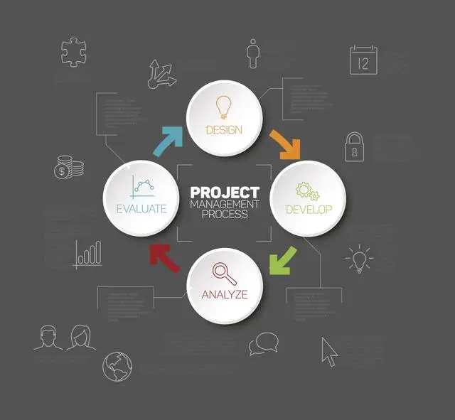

# 什么是项目管理方法？

项目管理方法是一组原则和实践，可指导您组织项目以确保其最佳性能。基本上，它是一个可以帮助您以最佳方式管理项目的框架。

项目管理对于组织和团队非常重要，但为了使其真正有效，您需要确保将项目管理方法正确地映射到您的团队类型、项目、组织和目标。

# 为什么有这么多不同类型的项目管理方法？

没有两个项目是完全相同的，即使您使用项目模板等方便的功能来复制过去的成功。当您考虑不同类型的团队以及不同类型的 行业的不同目标、KPI和生产方法时，就会发现没有一种放之四海皆准的项目管理方法是有道理的。对于一种类型的团队来说最有效的方法对于另一种类型的团队来说可能绝对是一场噩梦。

例如，许多软件开发人员开始发现传统的项目管理方法正在阻碍（而不是帮助）他们的工作流程，并对他们的绩效和结果产生负面影响。因此，软件团队开始开发一种新型的项目管理方法，旨在解决他们的特殊问题。

不久之后，其他团队和行业开始采用这些新的项目管理方法来满足他们独特的需求和关注点。不断地，不同的项目管理方法被重新调整用途并适应不同的行业，并进行调整以适应特定的用例。

# 1. 瀑布法

瀑布方法是项目管理的传统方法。其中，任务和阶段以线性、顺序的方式完成，并且项目的每个阶段必须在下一个阶段开始之前完成。

瀑布项目管理的阶段通常遵循以下顺序：

- 要求
- 分析
- 设计
- 建造
- 测试
- 部署与维护

进步朝着一个方向流动，就像真正的瀑布一样。

不过，就像真正的瀑布一样，这很快就会变得危险。由于一切都是一开始就计划好的，如果期望与现实不符，就有很大的出错空间。而且一旦完成就无法返回到前一阶段（想象一下尝试逆着瀑布游泳——一点也不好玩）。

如果出现以下情况，请尝试此项目管理方法：

- 项目的最终目标是明确定义的，并且不会改变。
- 利益相关者确切地知道他们想要什么（并且不会改变）。
- 您的项目是一致且可预测的（即不会改变）。
- 您在一个受监管的行业工作，需要大量的项目跟踪或文档。
- 您可能需要在中途将新人员引入项目并让他们快速跟上进度。

如果出现以下情况，此项目管理方法可能不适合您：

- 您的项目可能会发生变化。
- 在开始之前，您无法全面了解所有要求。
- 在此过程中您需要进行持续测试或适应反馈。

# 2. 敏捷方法论

敏捷项目管理方法源于对传统项目管理方法的线性方法日益增长的不满。

由于对项目管理方法的局限性感到沮丧，这些方法无法适应项目的进展，因此焦点开始转向更多的迭代模型，该模型允许团队在过程中根据需要修改项目，而不必等到最后才修改项目，审查并修改。

敏捷项目管理的概念已经引发了一些特定的子框架和方法，例如 Scrum、看板和精益。但它们有什么共同点呢？敏捷项目管理方法的关键原则是：

- 这是协作的。
- 进度很快。
- 它对数据驱动的变革持开放态度。

因此，敏捷项目管理方法通常涉及短期的工作阶段，并在整个过程中进行频繁的测试、重新评估和调整。

在许多敏捷方法中，所有要完成的工作都添加到积压工作中，团队可以在每个阶段或周期中完成工作，项目经理或产品负责人对积压工作进行优先级排序，以便团队知道首先要关注什么。

如果出现以下情况，请尝试此项目管理方法：

- 您的项目可能会发生变化。
- 您一开始并不确定解决方案会是什么样子。
- 你需要快速工作，看到快速的进展比完美的结果更重要。
- 您的利益相关者或客户需要（或希望）参与每个阶段。

如果出现以下情况，此项目管理方法不适合您：

- 您需要大量文档（例如，如果您将在项目期间引入新人员）。
- 您需要可预测的交付成果，并且需要从一开始就非常清楚它是什么样的。
- 您的项目在其过程中无法承受更改。
- 你没有自我激励的人。
- 您有严格的截止日期或可交付成果，需要及时掌握。

# 3. Scrum 方法论

Scrum 是敏捷项目管理的一种形式。您可以将其视为一个框架，而不是其本身的项目管理方法。

使用 Scrum，工作被分成称为“冲刺”的短周期，通常持续约 1-2 周。每个冲刺迭代的工作都是从积压工作中获取的（参见：上面的敏捷项目管理），小团队在冲刺期间由 Scrum Master（与项目经理不同）领导 ，之后他们在“冲刺回顾”中审查自己的表现，并在开始下一个冲刺之前进行必要的更改。

如果出现以下情况，请尝试此项目管理方法：您正在努力持续改进。

如果出现以下情况，此项目管理方法可能不适合您：您没有得到团队的充分承诺来使其发挥作用。

# 4. 看板方法

看板是敏捷项目管理中的另一种方法。“看板”一词起源于制造业，现已发展为一种框架，在该框架中，任务在 看板上的列中进展时以可视方式表示。当团队有能力并在板上的列中移动时，工作会连续从预定义的待办事项中提取，每列代表流程的一个阶段。

看板非常适合让每个人立即直观地了解每件作品在任何给定时间的位置。它还可以帮助您了解哪里有可能形成瓶颈——例如，如果您注意到其中一个色谱柱被堵塞，您就会知道这是流程中需要检查的一个阶段。

当用作敏捷项目管理方法的一部分时，实施在制品 (WIP) 限制也很常见。正在进行的工作限制限制了在任何给定时间进行的任务数量，这意味着每列（或整个板上）只能有一定数量的任务。

这可以防止您的团队将精力分散在过多的任务上，而是确保他们可以通过单独关注每项任务来提高工作效率。

如果出现以下情况，请尝试此项目管理方法：

- 您正在寻找项目进度的可视化表示。
- 您想要一目了然的状态更新。
- 您希望鼓励使用 WIP 限制，以便您的团队能够保持专注。
- 您更喜欢在持续的“拉动”基础上工作。

如果出现以下情况，此项目管理方法可能不适合您：

- 您的流程非常复杂或有很多阶段。
- 您需要一个推送系统而不是拉动系统。

# 5. Scrumban 方法

这是一个古老问题的答案：如果 Scrum 和看板有了一个孩子怎么办？

Scrumban 是一种混合敏捷项目管理方法，具有 Scrum 的鼻子和看板的眼睛。

Scrumban 作为一种方法的主要好处是，Scrumban 允许团队不断地从待办事项中“拉动”，而不是在每个冲刺一开始就决定要处理待办事项中的哪个任务（就像在“传统”Scrum 框架中那样）。根据他们的能力积压（就像在看板框架中一样）。

在冲刺周期（来自 Scrum）中使用正在进行的工作限制（来自看板），您可以保持连续的流程，同时仍然根据需要合并项目规划、审查和回顾。

如果出现以下情况，请尝试此项目管理方法：

您曾经看过 Scrum 和看板并想“我希望这两个疯狂的孩子能够聚在一起”。

如果出现以下情况，此项目管理方法可能不适合您：

您曾经若有所思地望向窗外，心想：“噢，scrum 就是 scrum，看板就是看板，两者永远不会相遇”。

# 6. 极限编程（XP）方法论

极限编程 (XP) 方法是敏捷项目管理的另一种形式，专为软件开发而设计。

它强调管理者、客户和开发人员之间的团队合作和协作，以及团队的自组织。它 有一套团队应遵循的明确规则 ，这些规则基于其五个价值观：简单、沟通（首选面对面）、反馈、尊重和勇气。

如果出现以下情况，请尝试此项目管理方法：

- 您想要促进团队合作和协作。
- 您有一个小型的、位于同一地点的团队。

如果出现以下情况，此项目管理方法可能不适合您：

- 你是一个规则破坏者。
- 您的团队分布在不同的地点和时区。

# 7. 适应性项目框架（APF）方法

自适应项目框架（APF）方法，也称为自适应项目管理（APM），是一种敏捷项目管理方法，其设计时考虑到了变革的不可避免性。

适应性项目框架知道，正如约翰·斯坦贝克（John Steinbeck）可能会说的那样，即使是老鼠和人精心设计的项目也经常会出错。所以APF的基本属性是团队需要能够自适应地响应变化。

这意味着使用自适应项目框架方法，团队必须尝试预测风险并为项目中的意外情况做好准备。他们需要了解关键组件不断变化，并能够根据这些变化的部分不断重新评估结果和决策。

这需要与所有利益相关者进行大量沟通，并且像其他敏捷项目管理方法一样能够协作工作。

如果出现以下情况，请尝试此项目管理方法：

你知道你的最终目标（用项目管理的术语来说，你已经概述了你的满意条件；或者，用野兽男孩的术语来说，你很清楚你清楚你想要什么）。

如果出现以下情况，此项目管理方法不适合您：

- 你需要可预测性。
- 您没有资源来处理适应性的潜在负面影响（例如范围蔓延、返工、滥用时间）。

# 8. 精益方法论

精益是另一种项目管理方法，起源于制造业（特别是丰田生产系统）。这一切都是为了将精益原则应用到您的项目管理方法中，以最大化价值并最大程度地减少浪费。

虽然这最初是指减少制造过程中的物理浪费，但现在它指的是项目管理过程中的其他浪费做法。它们被称为 3M：muda、mura 和 muri。

Muda （浪费）消耗资源，却没有为客户增加价值。

当某一区域生产过剩，导致所有其他区域陷入混乱，导致库存过多（浪费！）或流程效率低下（同样浪费！）时，就会出现Mura （不均匀）。

当设备和人员等资源压力过大时，就会发生Muri （超载），这通常会导致机器和人员故障。

利用精益的关键原则，项目经理可以减少这些类型的浪费，从而创建更高效的工作流程。

如果出现以下情况，请尝试此项目管理方法：

- 您正在寻找一套原则来帮助您减少脂肪并优化您的流程。
- 您始终致力于为客户改进并增加价值。
- 您希望最终降低成本。

如果出现以下情况，此项目管理方法可能不适合您：

- 您无法承担遇到供应问题（例如您没有足够的库存）或失去出错空间（例如在重要设备故障的情况下）的后果。
- 您没有预算进行投资（虽然精益项目管理旨在降低总体成本，但实施成本可能很高）。