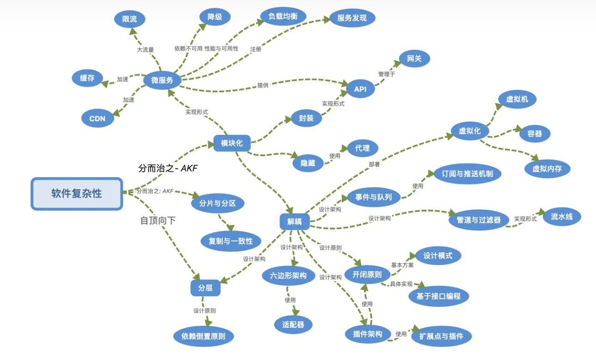

# 第一梯队思想
第一梯队思想，是计算机编程领域最为核心而根本的思想。因其威力强大，且无处不在，简直是天神般的存在。

## 编程

编程没什么神秘的。本质上，编程与写作、绘画、雕塑一样，也是一种手艺，一种探索和求解问题的方式。只不过，编程高度依赖于算法步骤的正确性和可行性，需要高度的理性。

理性有三种类型：逻辑理性、沟通理性和思想理性。编程属于逻辑理性。逻辑理性要求逻辑层次是缜密无矛盾的，不能有一丝纰漏，否则可能会导致全盘溃败。逻辑理性是一层层堆叠起来的。上层的缜密依赖于下层的缜密。

构建逻辑理性的缜密性：

* 原则与思想：从根本上构建行为一致性。
* 约定与惯例：减少多变环境下的管理。
* 推导与演绎：即给定若干条件及事实，能够正确推导出深入而广泛的结论。推导演绎能力是逻辑理性的生动体现和重要特征。

## 结构化

结构化是编程领域的第一性原理。

软件，本质上是一种可动态而弹性变化的逻辑装置。结构化，即是将逻辑进行抽象、提炼、分离、组合，构建成缜密、动态、弹性的结构流。

## 关注点分离

关注点分离，是有序组织大规模逻辑结构的根本性思想。

软件中蕴藏着不计其数的大大小小的关注点。软件开发和设计的本质，就是将关注点分离、组织、连接。 能够将不同的关注点分离开，再合理有序地组织起来，呈现在代码里，就离写出清晰可维护的代码不远了。

从“关注点分离”思想，可以推导出很多重要的软件开发和设计思想。

## 抽象

优雅的编程始于抽象。

萃取出主要特征，而摒弃次要或不相关的特征；无需了解事物的内部实现细节而基于其提供的抽象来构造应用。声明与实现相分离；语义与细节分离。

计算机科学中的抽象俯拾即是，比如指令集是对机器硬件执行能力的基础抽象，高级程序语言是对机器硬件执行能力的更高层次的抽象，进程是对程序一次执行的抽象等。

## 封装

由抽象直接引出的重要概念就是封装。封装是抽象的实现形式。比如，函数是算法的封装，对象是属性与关联逻辑的封装。封装是实现软件模块化、提高软件可维护性的重要思想，是许多软件工程思想的源头。比如隔离变化， 将变化的影响局部化等。封装在计算机软件领域内俯拾即是。比如系统调用，是对操作系统能力的封装； SDK 是利用某种语言或技术进行开发的封装；框架，是对通用技术逻辑流程的封装。

日常生活中，封装的例子也不计其数。任何一个产品设计，都是一种复杂事物的封装。举个例子，汽车方向盘和刹车油门就是汽车驾驶的封装。几乎不需要知道汽车的具体运转原理，只要掌握好方向盘和刹车油门就能驾驶汽车；比如火箭发射，不需要知道火箭的发射原理，只要知道按下哪个按钮即可。

## 复用

没有封装就没有复用。复用是微小的编程能够构建起虚拟大千世界的最重要的秘诀。先构建一个小块，然后在这个小块上构建更大的块，就像建造房子一样。从泥到砖，从砖到墙，从墙到房子四围。最典型的例子就是积木。积木是可复用的组块，在积木的基础上可以建造各种各样的形状。

复用是软件工程领域的重要思想。从 LinuxShell、标准库函数，STL，JDK这样的代码级复用，到 Struts，Spring 的应用框架复用， 以及 设计模式的复用， 解决方案的复用， 复用无处不在。 复用是站在巨人的肩膀上， 能够直接利用专家级的知识和经验，何乐而不为？

新的更优的解决方案往往是现有可复用方案的组合创新。

## 分治

分治几乎是求解编程问题的万能思路。难以求解的问题，都可以分解成若干个可以在能力范围内解决的子问题；如果还不能求解，继续分解。自顶向下，逻辑树法，都是分治法的典型应用。

自顶向下，即是根据目标先分解成一系列的子目标，然后再根据这些子目标进一步分解成子子目标，就像公司的组织结构一样。直到子子目标可以被完成。自顶向下法可用于系统设计、任务分解等。

逻辑树，即是先根据一个论点，引出若干个子论点，然后每个子论点又可以引出若干个子子论点，每个子子论点都可以由相应的论据支撑，最终形成缜密的论证逻辑。逻辑树法可用于工作汇报、数学证明等。

实际工程应用中，分表、分库、分区、分片、微服务，都是分治思想的应用。可以按时间、冷热、业务ID、不同业务分。可以按范围分，也可以哈希映射。

## 组合

有分即有合。单一逻辑单元能够做的事情很有限，但是多个逻辑单元组合起来就能完成很强大的功能。就像一个人的力量有限，但如果多个人的力量团结起来，就不可估量了。

函数式编程，即是充分利用短小函数及各种组合方式，构建出强大的功能。

组合是构建强大功能的最重要的方式之一。

## 缓存

缓存是性能加速的重要法宝。在计算机体系结构里，缓存的身影无处不在。

* CPU 三级缓存
* 存储器层次体系结构
* 内存缓存/分布式缓存
* 预编译缓存
* 数据库缓存
* 浏览器缓存
* CDN缓存
* 代理缓存
* 域名系统
* 计算结果缓存
 

## 解耦

解耦是软件应对多变需求和软件复杂性的重要思想。如果缺乏解耦，软件就会缠绕成一团，无法解开，难以修改，很容易出错。

现代软件工程与技术，实际上就是在各个层次上进行解耦。

* 高级语言与编译器：将编程语义与实际机器执行实现解耦
* 开闭原则：将基于同一数据源的不同业务的处理解耦
* 插件架构：将基于同一系统的不同功能的定制解耦
* 设计模式：将对象的职责与交互解耦
* 事件与队列机制：将事件的发生与处理解耦；将消息的发送与接收处理解耦
* 框架： 将应用业务逻辑与通用技术逻辑流程解耦
* JVM： 将指令执行与操作系统平台解耦
* 容器： 将应用运行环境与操作系统平台解耦
* K8S： 将应用的部署与基础设施和资源利用解耦

解耦思想直接带来了软件工程领域的“高内聚、低耦合”的软件模块化实践。模块化实践大幅降低了软件长期维护的复杂性。

## 编码

上述思想都有点”玄虚“，但编码却是实实在在的实践和基本编程思想。

要写程序，必定要将现实中的实体和活动编码成 01 串，进行处理，最后再解码还原到现实世界。编码是指将现实中的万事万物编码成01串的操作。神乎其技兮！

当然，现代编程并不是要编码成 0,1 串，而是使用高级编程语言来编码。因为高级编程语言是 0,1 串编码的封装。

精通编码，就能洞察程序世界，如镜透明。

## 协议

计算机不是孤立地运行，人亦非孤岛般存在。让计算机能够彼此通信，让人们能够跨时空互联深入交流，是互联网的梦想。协议是网络程序相互协作的必不可少的要件和基石。协议解决计算机程序如何可靠通信的问题。

比如一次5个人的聚会吧，首先大家肯定要事先约定什么时候什么地点碰头，好各自安排行程；这是静态协议； 不过计划总赶不上变化。当实际去赴会时，会发现因为某位明星的到来导致路上特堵，结果2个人不能如约到达；这时候，就必须重新调整计划另约时间和地点，甚至还可能改变原来的游玩计划；或者在原计划中留下充分的缓冲余地。这就是协议要做的事情：约定与标准（碰头时间地点）、缓冲余地（容错）、动态调整（灵活性）。实际的通信协议可能更复杂，依据不同的应用而设定，不过原理是相同的。

协议是互联网通信的基本软件思想。最为人所熟知的莫过于 HTTP(S)， TCP 和 IP 协议了。

## 容错

程序运行过程中，会遇到各种不可预料的情况，产生多姿多彩的错误。比如读文件，文件不存在、找不到、格式被破坏、有恶意代码；获取网络数据，网络波动或者中断；大流量下，扛不住压力而崩溃；甚至于直接掉电。

容错是设计健壮程序的不可或缺的重要考量因素。容错涉及到用户体验问题。试想，一个程序动不动就报错，谁能有耐心使用呢？

## 自动化

自动化使得人从繁琐易错的事情中解脱出来， 从事更具有创造性的工作， 使人与计算机并行协作， 在计算机干活的时候人休息一会也不耽搁事情。善于发现可自动化的流程、规律、事务， 尽可能使用程序自动化和简化手工活， 减少或消除繁琐易错的手工操作。

高效可靠的自动化几乎是程序（员）存在的最主要的使命和价值。

## 预处理

预处理，是指先对待处理数据做一波前期的处理，转换结构，然后再对转换后的结构进行操作，起到加速或方便处理的作用。

比如要多次查询一个无序列表里的元素，可以先把无需列表转成一个映射，再进行查询。这样多次查询的效率就会很高。

比如 Rete 算法，即是将一系列规则或模式，转换成一个拓扑图结构，然后再进行匹配。这样就比用原始结构的匹配更容易效率更高。

预处理有一定的前期开销，但能够为后续处理提供很大的便利或效率价值。

## 时空权衡

时间换空间，或者空间换时间。

空间换时间，是提升性能的常用手段。比如缓存，就是用冗余的空间来换取快速的处理。

时间换空间，是解决内存不足的常用手段。比如要处理大量数据，不会一次性将所有数据都加载到内存里，而是分批次加载和处理，这样小内存也能解决大数据集，代价是处理时间会更长一些（因为需要更多次的加载）。

## 统筹规划

统筹规划思想，注重在全局视角下解决问题。

找到关键路径和节点，解决这些路径和节点的问题，往往会加速整体流程的效率。

不在次要路径和节点上耗时耗力。

统筹规划的典型应用是项目路径规划，最短路径、资源配置优化。
