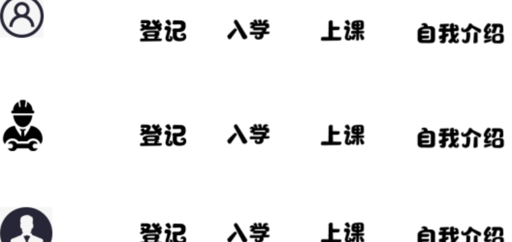

# 第四梯队思想

## 1.面向过程编程
“面向过程”(Procedure Oriented)是一种以过程为中心的编程思想。这些都是以什么正在发生为目标进行编程，不同于面向对象的是谁在受影响。与面向对象明显的不同就是封装、继承、类。
* 特性：模块化 流程化
* 优点：性能比面向对象高, 因为类调用时需要实例化，开销比较大，比较消耗资源;
* 单片机、嵌入式开发、Linux/Unix等一般采用面向过程开发，性能是最重要的因素。
* 缺点：没有面向对象易维护、易复用、易扩展

例如下面这个学生入学的例子：

```java
第一个用户的信息
student_a = {
    'name': '小明',
    'age': 23,
    'gender': '男',
    # 座右铭
    'matto': '人生苦短， 我用python!'
}

第二个用户的信息
student_b = {
    'name': '小红',
    'age': 21,
    'gender': '女',
    # 座右铭
    'matto': '合理安排时间，就等于节约时间。'
}

第三个用户的信息
student_c = {
    'name': '小李',
    'age': 26,
    'gender': '男',
    # 座右铭
    'matto': '挫折不是惩罚而是学习的机会。'
}


def roll(studentDict):
    """
    入学过程封装的函数
    :return:
    """
    # 字典的get方法: 如果key值不存在， 直接返回为空；
    print("正在办理手续".center(20, '*'))
    print("正在注册用户[%s]信息" %(studentDict.get('name')))
    print("用户[%s]正在入学" %(studentDict.get('name')))
    print("用户[%s]正在上课" %(studentDict.get('name')))
    print("用户[%s]正在自我介绍" %(studentDict.get('name')))
    for key, value in studentDict.items():
        print(key, ':', value)

roll(student_a)       
roll(student_b) 
roll(student_c) 

```

上面的代码就是典型的面向过程编程。

面向过程：根据业务逻辑从上到下写代码 。面向过程编程最易被初学者接受，其往往用一长段代码来实现指定功能，开发过程的思路是将数据与函数按照执行的逻辑顺序组织在一起，数据与函数分开考虑。

考虑现实生活中，我们的思维方式是放在学生这个个人上，是学生做了自我介
绍。而不是像我们刚刚写出的代码，先有了介绍的行为，再去看介绍了谁。
用我们的现实思维方式该怎么用程序表达呢？这就要用到面向对象的编程思想了。

面向对象：将数据与函数绑定到一起，进行封装，这样能够更快速的开发程序，减少了重复代码的重写过程

## 2. 函数式编程

函数式编程是种编程方式，它将电脑运算视为函数的计算。函数编程语言最重要的基础是λ演算（lambda calculus），而且λ演算的函数可以接受函数当作输入（参数）和输出（返回值）。

主要思想: 把运算过程尽量写成一系列嵌套的函数调用。
例如：
```java
def add(a,b):
    return a+b

def multi(a,b):
    return a*b

print(multi(add(1,2),add(2,3)))

```


Python 不是也不大可能会成为一种函数式编程语言，但是它支持许多有价值的函数式编程语言构建。也有些表现得像函数式编程机制（如：内建函数 filter()、map()、reduce()），但是从传统上也不能被认为是函数式编程语言的构建。

## 3.面向对象编程
面向对象是按人们认识客观世界的系统思维方式，采用基于对象（实体）的概念建立模型，模拟客观世界分析、设计、实现软件的办法。通过面向对象的理念使计算机软件系统能与现实世界中的系统一一对应。

* 特性：抽象 封装 继承 多态
* 优点：易维护、易复用、易扩展，由于面向对象有封装、继承、多态性的特性，可以设计出低耦合的系统，使系统更加灵活、更加易于维护
* 缺点：性能比面向过程低

## 4.面向过程与面向对象的区别
* 面向过程就是分析出解决问题所需要的步骤，然后用函数把这些步骤一步一步实现，使用的时候一个一个依次调用就可以了；
* 面向对象是把构成问题事务分解成各个对象，建立对象的目的不是为了完成一个步骤，而是为了描叙某个事物在整个解决问题的步骤中的行为。

可以拿生活中的实例来理解面向过程与面向对象，例如五子棋。

面向过程的设计思路就是首先分析问题的步骤：1、开始游戏，2、黑子先走，3、绘制画面，4、判断输赢，5、轮到白子，6、绘制画面，7、判断输赢，8、返回步骤2，9、输出最后结果。把上面每个步骤用不同的方法来实现。

如果是面向对象的设计思想来解决问题。面向对象的设计则是从另外的思路来解决问题。整个五子棋可以分为1、黑白双方，这两方的行为是一模一样的，2、棋盘系统，负责绘制画面，3、规则系统，负责判定诸如犯规、输赢等。第一类对象（玩家对象）负责接受用户输入，并告知第二类对象（棋盘对象）棋子布局的变化，棋盘对象接收到了棋子的变化就要负责在屏幕上面显示出这种变化，同时利用第三类对象（规则系统）来对棋局进行判定。

可以明显地看出，面向对象是以功能来划分问题，而不是步骤。同样是绘制棋局，这样的行为在面向过程的设计中分散在了多个步骤中，很可能出现不同的绘制版本，因为通常设计人员会考虑到实际情况进行各种各样的简化。而面向对象的设计中，绘图只可能在棋盘对象中出现，从而保证了绘图的统一。
