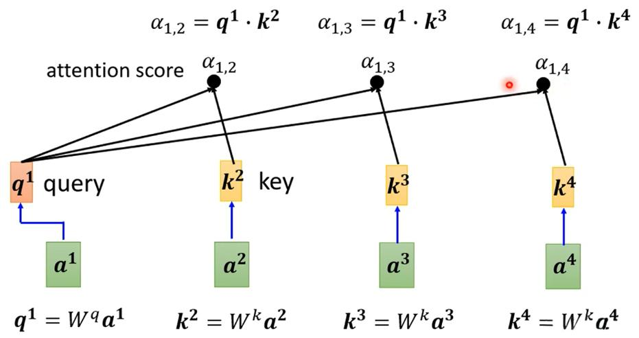
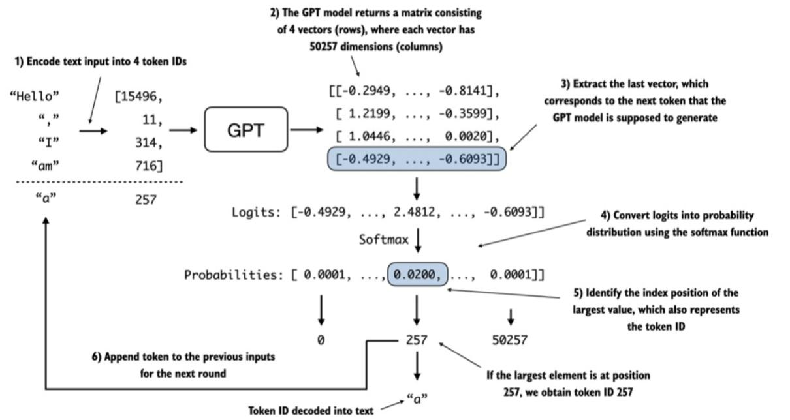
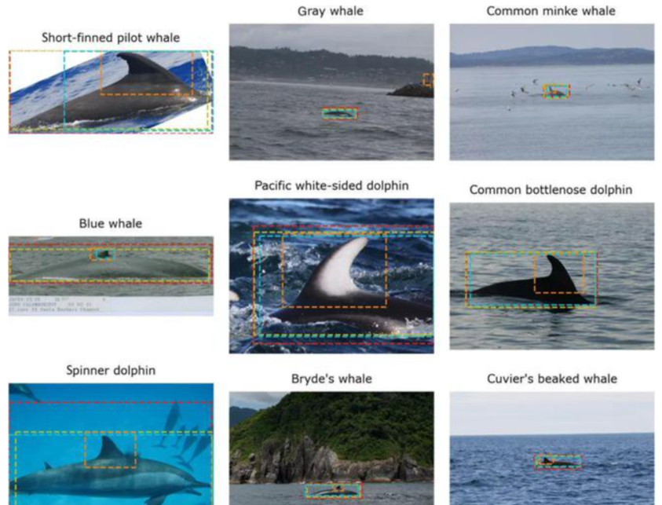
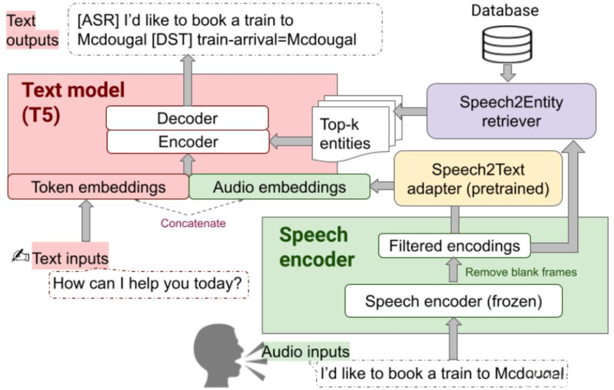
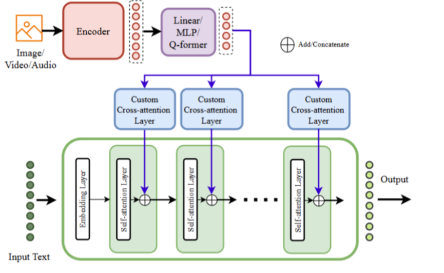
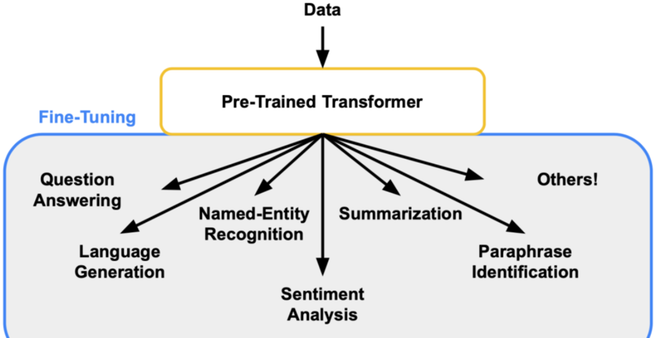

### 第1章：什么是大模型？

#### 1.1 大模型的定义

大模型，顾名思义，是指拥有大规模参数和复杂结构的机器学习模型。与传统的小模型相比，大模型通常包含数亿甚至数千亿个参数，这些参数是模型学习过程中需要调整的变量。大模型的核心目标是通过海量数据的训练，捕捉数据中的复杂规律，从而实现更高的性能和更广泛的应用。

**举个例子**：  
想象一下，传统的小模型就像是一个小学生，只能解决简单的加减乘除问题。而大模型则像是一个博士生，能够解决复杂的数学问题，甚至能够写出论文、创作诗歌、编写代码。

#### 1.2 大模型与普通模型的区别

普通模型通常针对特定任务设计，例如识别猫和狗的分类模型，或者预测房价的回归模型。而大模型则具有更强的通用性，能够处理多种任务，例如GPT（Generative Pre-trained Transformer）不仅可以生成文本，还可以翻译、回答问题、写代码等。

**举个例子**：  
普通模型就像是一把螺丝刀，只能用来拧螺丝。而大模型则像是一个多功能工具箱，既可以拧螺丝，也可以剪电线、钉钉子，甚至还能进行一些创意性的工作。

#### 1.3 大模型的核心技术

大模型的成功离不开几项核心技术：

- **深度学习**：大模型基于深度学习框架，通过多层神经网络从数据中提取特征。
- **Transformer架构**：这是大模型的核心结构，通过自注意力机制（Self-Attention）捕捉数据中的长距离依赖关系。
- **预训练与微调**：大模型通常先在大量通用数据上进行预训练，然后在特定任务上进行微调，从而提高性能。

**举个例子**：  
Transformer架构就像是一个超级大脑，能够同时关注输入数据中的多个部分。例如，在翻译句子时，它能够同时理解句子的开头和结尾，从而生成更准确的翻译结果。

---

### 第2章：大模型的应用领域

大模型的应用范围非常广泛，几乎涵盖了人工智能的所有领域。以下是几个主要的应用场景：

#### 2.1 自然语言处理（NLP）

自然语言处理是大模型最成功的应用领域之一。大模型能够理解和生成人类语言，从而实现多种功能：

- **文本生成**：例如，GPT可以生成文章、故事、甚至代码。
- **机器翻译**：例如，Google Translate使用大模型实现多种语言之间的翻译。
- **情感分析**：例如，分析用户评论中的情感倾向，帮助企业改进产品。

**举个例子**：  
当你使用ChatGPT聊天时，它会根据你的输入生成流畅的回复。这背后就是大模型在发挥作用。

#### 2.2 计算机视觉（CV）

大模型在计算机视觉领域也有广泛应用：

- **图像识别**：例如，识别照片中的物体、人脸或场景。
- **目标检测**：例如，自动驾驶汽车通过大模型识别道路上的行人和车辆。
- **图像生成**：例如，DALL·E可以根据文本描述生成逼真的图像。

**举个例子**：  
当你用手机拍照时，相机会自动识别照片中的人脸并进行对焦。这就是大模型在图像识别中的应用。  

#### 2.3 语音处理

大模型在语音处理领域的应用包括：

- **语音识别**：例如，将语音转换为文本，用于语音助手或字幕生成。
- **语音合成**：例如，生成自然流畅的语音，用于语音助手或有声读物。

**举个例子**：  
当你对智能音箱说“播放音乐”时，它能够准确识别你的语音并执行指令。这背后就是大模型在发挥作用。

#### 2.4 多模态应用

多模态大模型能够同时处理多种类型的数据，例如文本、图像和语音：

- **图像描述生成**：例如，根据一张图片生成一段文字描述。
- **视频理解**：例如，分析视频内容并生成摘要。

**举个例子**：  
当你上传一张照片到社交媒体时，平台会自动生成一段描述，例如“这是一张阳光明媚的海滩照片”。这就是多模态大模型的应用。  

---

### 第3章：大模型的工作原理

#### 3.1 Transformer架构

Transformer架构是大模型的核心，它通过自注意力机制捕捉输入数据中的长距离依赖关系。这种机制使得大模型能够同时关注输入数据中的多个部分，从而提高性能。

**举个例子**：  
在翻译句子“The cat sat on the mat”时，Transformer能够同时关注“cat”和“mat”之间的关系，从而生成准确的翻译结果。

#### 3.2 预训练与微调

大模型通常先在大量通用数据上进行预训练，然后在特定任务上进行微调。这种两阶段的学习方法使得大模型能够适应多种任务。

**举个例子**：  
GPT模型先在大量文本数据上进行预训练，学习语言的通用规律。然后在特定任务（例如问答或翻译）上进行微调，从而提高任务性能。

#### 3.3 大模型的训练与优化

训练大模型需要大量的计算资源和数据。通常使用GPU或TPU等高性能硬件进行训练，并采用分布式计算技术加速训练过程。

**举个例子**：  
训练GPT-4这样的模型需要数千个GPU同时工作，耗时数周甚至数月。