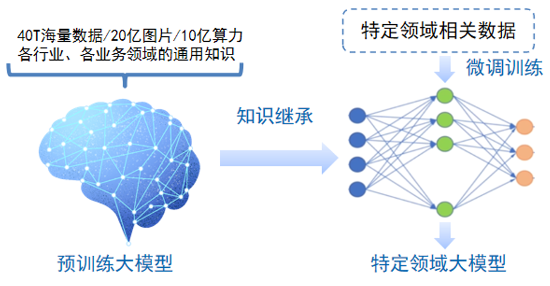
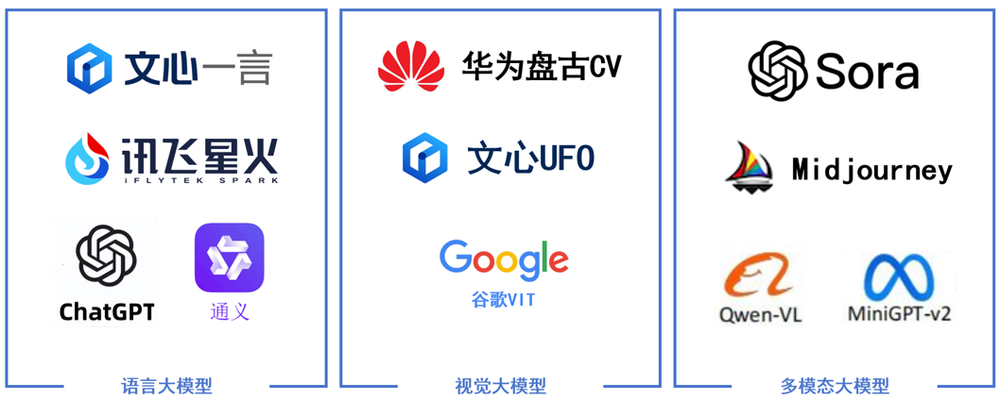
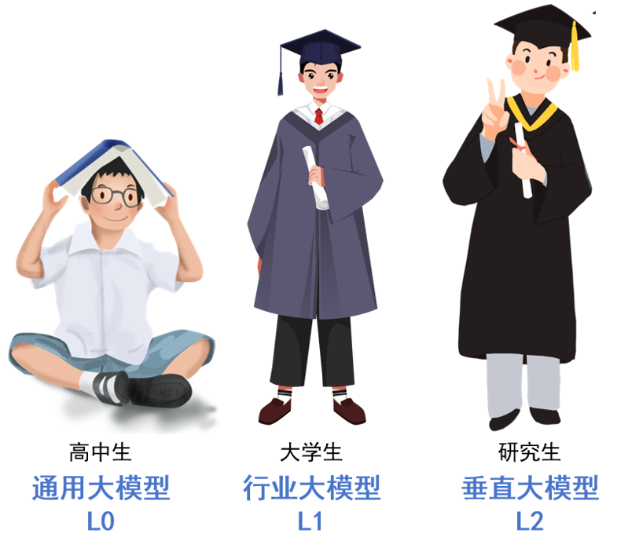
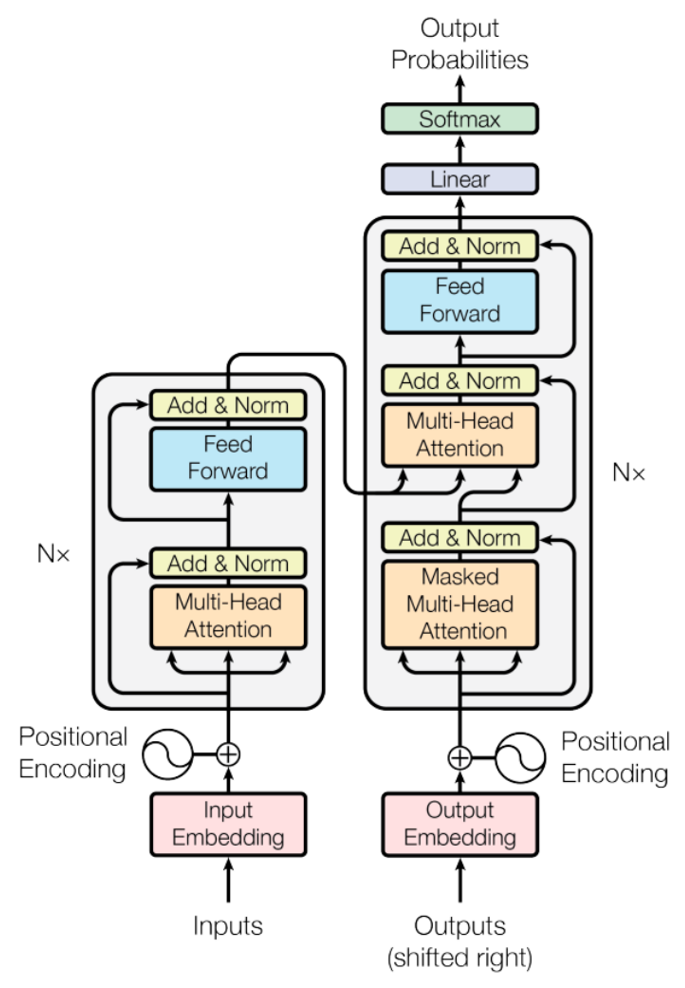

## 让你了解什么是大模型

大模型（Big Model）是指在机器学习和人工智能领域中处理大规模数据和复杂模型的一种方法或技术。随着数据量的不断增加和模型的复杂度提高，传统的机器学习方法已经无法有效处理，因此大模型成为了解决这一挑战的重要工具之一。本文将介绍大模型的基本概念、应用场景以及一些常见的大模型技术。

大模型具有数千万甚至数亿参数的。近年来，随着计算机技术和大数据的快速发展，深度学习在各个领域取得了显著的成果，如自然语言处理，图片生成，工业数字化等。为了提高模型的性能，研究者们不断尝试增加模型的参数数量，从而诞生了大模型这一概念。

大模型通常由深度神经网络构建而成，拥有数十亿甚至数千亿个参数。大模型的设计目的是为了提高模型的表达能力和预测性能，能够处理更加复杂的任务和数据。

大模型采用预训练+微调的训练模式，在大规模数据上进行训练后，能快速适应一系列下游任务的模型。

### 什么是大模型？

大模型是指在处理大规模数据和复杂模型时所采用的一种模型和算法。它通常具有以下特点：

- 规模庞大的数据集： 大模型通常需要处理海量的数据，这些数据可能来自于互联网、传感器、日志文件等各种来源。
- 复杂的模型结构： 为了提高模型的准确度和泛化能力，大模型通常具有复杂的模型结构，如深度神经网络、集成学习模型等。

理解大模型（Large Model）本质上就是理解两个关键词:**大、模型。**

**首先我们理解什么是模型（Model）。**模型是事物的抽象，可用于描述、解释和预测事物。例如数学公式、物理装置、计算机程序、人体模型都可以称为模型。在人工智能领域，模型**特指学习算法从数据中提取的模式或规则，进一步用于数据的预测。**

这样理解可能会比较抽象，举个简单的例子：

**我们想让人工智能来识别图像里有没有猫，该怎么做呢？**

**第一步，我们要准备数据。**我们将大量有猫的图片和没有猫的图片做好标记，例如有猫标记为1，没有猫标记为0。

**第二步，用准备好的数据训练人工智能模型。**我们将图片和标记的数据输入给人工智能算法，让它总结出**一套规则**来区分有猫的图片和没有猫的图片。比如，有猫的情况下，图片中应该有耳朵、胡须、毛茸茸的毛发等等。当然，彩色图片在计算机中实际上对应的是一个像素值的矩阵，**人工智能识别的模式也通常是抽象的数字表示。**

这时候我们已经得到一个模型了，可以命名为「猫咪探测模型」！

**第三步，模型验证。**我们要预留一部分数据来检验模型效果。如果我们发现模型在数据上表现不佳，比如过拟合（指在某些特定数据上才表现效果好，比如只能识别橘猫），准确率低（常常把没有猫判断成有猫），那我们就需要调整模型。可以增加数据量、调整模型参数，甚至更换一种算法框架等等。**当模型在大部分数据上表现都很好的时候，就可以上线了！**

**第四步，数据预测。**将随机找到的图片输入「猫咪探测模型」，让它给出图片中是否有猫的判断。

**更进一步，**我们还可以训练模型，基于它学到的规则，来生成包含猫的图片，也就是**数据生成。**

如果我们将识别猫，改成理解文字、预测并生成下一段文字，那就是大模型的基本流程了（更深层的还需要再看看自然语言处理模型相关的内容）

**再理解什么是大（Large），它主要体现在两个方面。**

首先是数据量大。大模型用于训练的数据量通常是数百GB或TB以上，以OpenAI的GPT 4.0为例，其训练时用了13万亿个token（自然语言文本基本单位），量级至少TB以上。**就像一个博览群书、知识渊博的人一样，训练数据量大的好处是，模型可以充分的学习到数据中的模式和特征，在更广泛的场景下有更好的效果。**

其次，大模型的参数量大。在简单的线性回归模型y=Ax+B中，A和B是模型中的两个参数。而对于大模型，参数将达到数亿到数万亿。以OpenAI的GPT 4.0为例，它有1.8万亿参数。**就像成年人大脑内有数亿个活跃神经元，参数量大意味着大模型可以理解更复杂的事情，从数据中学习到更复杂的规则。**

**研究表明，随着模型的规模（如参数数量、数据量、计算量）增大，其性能通常会随之提高**；**同时模型达到一定的规模时，它会表现出一些在小模型中不曾出现的新能力**（如常识推理、创作能力），这些能力不是被特意设计或训练出来的，而模型的规模增长中“涌现”出来的，被称为涌现能力（Emergent abilities）。

**“读书破万卷，下笔如有神”。**这也就是为什么**大模型规模大、效果好**的原因了。

### 大模型的应用场景

大模型在各个领域都有广泛的应用，以下是一些常见的应用场景：

1. 自然语言处理（NLP）： 大模型被广泛应用于机器翻译、文本生成、情感分析等任务中，如BERT、GPT等。
2. 计算机视觉（CV）： 在图像识别、目标检测、图像生成等领域，大模型也取得了显著的成果，如ResNet、YOLO等。
3. 推荐系统： 大模型在个性化推荐、广告点击率预测等方面发挥了重要作用，如DeepFM、Wide & Deep等。
4. 医疗健康： 大模型在医学影像分析、疾病预测等方面也有广泛的应用，如DenseNet、LSTM等。

### 常见的大模型技术

1. 分布式训练： 通过将模型和数据分布在多台机器上进行并行训练，以加速训练过程，如TensorFlow的分布式训练框架。
2. 模型压缩： 通过剪枝、量化、蒸馏等技术减少模型的参数和计算量，以在有限的资源下实现高效的推理，如Knowledge Distillation。
3. 增量学习： 在已有模型的基础上，通过增量学习的方式不断更新模型以适应新的数据，如在线学习算法。
4. 模型并行： 将模型的不同部分分配给不同的设备或计算节点进行并行计算，以降低计算复杂度，如模型并行和数据并行的结合。
5. 模型优化： 通过改进模型结构、调整超参数等方式优化模型的性能和效率，如AutoML技术。

### 实例分析：深度学习语言模型GPT-3

GPT-3（Generative Pre-trained Transformer 3）是由OpenAI开发的一个大型自然语言处理模型，具有1750亿个参数。它采用了深度学习和自监督学习的方法，在多个自然语言处理任务上取得了state-of-the-art的效果，如文本生成、机器翻译等。GPT-3的成功彰显了大模型在NLP领域的巨大潜力，并且在业界引起了广泛的关注和讨论。

**大模型和小模型的区别**

大模型和小模型在应用方面最大的区别是大模型偏向于全能化、通用化，而小模型一般偏向于解决某一垂直领域中的某个具体问题。比如一个图像识别小模型专门训练用来识别车牌号，对车牌号可以有很好的识别精度。但是一个图像识别大模型不仅可以识别车牌号，还可以识别我们生活中碰到的大部分图片，而且站在我们人类的视角来看，他似乎对图片中的内容有自己的理解，看起来拥有更高的智能化水平。

另外相比小模型来说，大模型通常具有更多的参数，能够学习更复杂的特征和模式。同时大模型的训练数据集也会更大，架构更为复杂，训练起来也需要更高的计算资源。

按照输入数据类型的不同，大模型主要可以分为以下三大类：

**语言大模型**

是指在自然语言处理（NLP）领域中的一类大模型，通常用于处理文本数据和理解自然语言。

**视觉大模型**

是指在计算机视觉（CV）领域中使用的大模型，通常用于图像处理和分析。

**多模态大模型**

是指能够处理多种不同类型数据的大模型，例如文本、图像、音频等多模态数据。

按照应用领域的不同，大模型主要可以分为 L0、L1、L2 三个层级：

**L0 通用大模型**

是指可以在多个领域和任务上通用的大模型。通用大模型就像完成了大学前素质教育阶段的学生，有基础的认知能力，数学、英语、化学、物理等各学科也都懂一点。

**L1 行业大模型**

是指那些针对特定行业或领域的大模型。它们通常使用行业相关的数据进行预训练或微调，以提高在该领域的性能和准确度。行业大模型就像选择了某一个专业的大学生，对自己专业下的相关知识有了更深入的了解。

**L2 垂直大模型**

是指那些针对特定任务或场景的大模型。它们通常使用任务相关的数据进行预训练或微调，以提高在该任务上的性能和效果。垂直大模型就像研究生，对特定行业下的某个具体领域有比较深入的研究。

大语言模型(Large Language Model，LLM)是大模型的子分类，是专门通过处理大量文本数据来理解和生成人类语言的AI系统，从而执行各种自然语言处理任务，如文本分类、问答、对话、内容总结等。我们最为常见的ChatGPT、百度文心一言、讯飞星火等都属于大语言模型。

**大语言模型LLM的基础架构**

目前流行的大语言模型的架构基本都沿用了当前NLP领域最热门最有效的架构—Transformer架构。Transformer架构来源于谷歌在2017年发表的论文《Attention Is All You Need》，翻译过来就是注意力就是你需要的一切。

注意力机制是大语言模型的核心机制，它让模型在处理文本时，能够同时关注输入中的所有词汇，无论句子长短，都能精准捕捉到远距离的语义关联。例如，在解析“华为公司发布了新款手机”这句话时，模型能够迅速聚焦“华为”与“手机”之间的关系，忽略“公司”或“发布”等词的干扰，这种能力使得大语言模型在处理大段文本、复杂语境时能够真正理解其表达的核心含义。

此外，大语言模型通过位置编码（Positional Encoding）的巧妙设计，模型得以理解文本中的词语位置和顺序，准确把握语言的时序特性，同时保留了高效的并行计算能力。

在企业数字化领域中，大语言模型常见的应用场景如下：

01 **知识库问答系统：**

通过提问的方式，快速查找企业知识库中的内容，并通过大模型对内容进行总结提炼并给出解决方案；如设备故障查询、设备运检查询、员工智能助手等。

02 **问答式BI系统：**

通过问答的方式让大模型进行数据库查询，并返回数据结果、可视化图形等内容，供用户进行便捷的数据分析。

03 **智能体系统：**

将大模型的自然语言能力和小模型的垂直领域能力进行整合，形成企业智能体系统，满足设备故障预测、电力负荷预测、供应商评估分析等智能化应用和预测场景。

## 大模型思考

1. **算力是门槛**：大模型对算力的要求，过去10年非常巨大。今天要做人工智能大模型，讲卡伤感情、没卡没感情。

2. **关于数据的数据**：如果有GPT-5出来，可能会上到200T的数据量。但互联网上没有那么多好的数据，清洗完以后，可能20T就差不多到顶了，所以未来要做GPT-5，除了现有的数据，还要更多的多模态数据，甚至人工合成的数据。

3. **大模型的下一章**：有很多多模态的科研工作要做，我相信一个非常重要的方向是多模态的理解和生成的统一。

4. **人工智能的范式转移**：o1出来后，从原来的GPT的预训练思路，变成了今天的自主学习的道路，就是在推理这一步，不断地自我学习的过程。整个过程非常像人类思考问题、分析问题，也需要非常多的算力才行。

5. **大模型横扫千行百业**：在中国的大模型建设浪潮当中，越来越多的是行业大模型。这个趋势肯定是这样的，未来通用大模型的占比会越来越低。

6. **AI Agent**，从愿景到落地：超级应用一开始就在那里，这个超级应用就是一个超级助理，就是一个超级Agent。

7. **开源vs闭源**：Meta的Llama并不是传统的开源，它只是开源了一个模型，并没有给你原代码和数据，所以我们在用开源系统的时候，也要下定决心真正理解大模型的系统闭源的工作。

8. **重视AI的治理**：人工智能对千行百业、对整个社会的冲击非常大，要大家共同来面对。

9. **重新思考人机关系**：真正把人机交互搞清楚，才能成为每一代高科技企业真正有商业价值的领导者。现在讲OpenAI加上微软就代表这个时代还太早，他们是领先了，但是未来还有很多想象的空间。

10. **智能的本质**：虽然大模型已经给大家带来很多的震惊，但是我们对大模型、深度学习是没有理论的。关于人工智能的涌现，大家只是讲讲，并没有讲清楚。